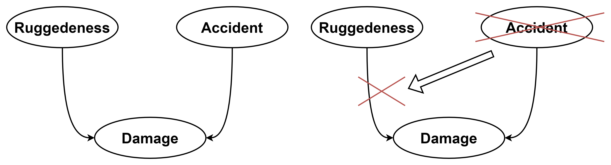
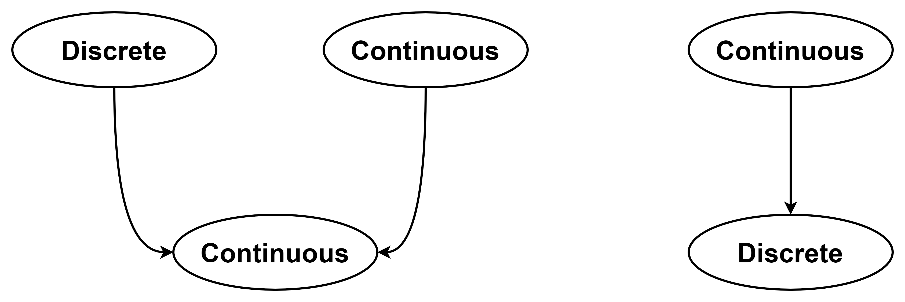
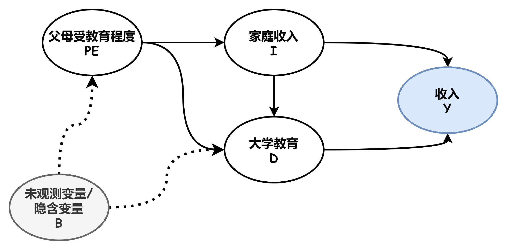
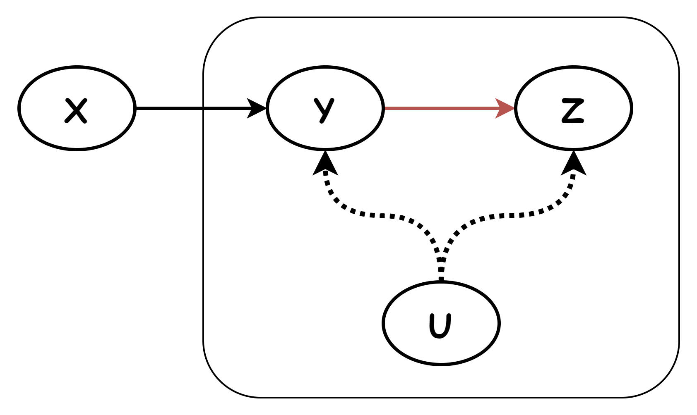

# 贝叶斯网络 Bayesian Network

#### 关于理解贝叶斯网络的几点注意事项

贝叶斯网络两种出发点略有差异的定义：

1. 第一种定义，也是 AIMA 中的定义，其逻辑是：

   首先定义节点具有参数$\theta$，将完全联合分布定义为：

   $$
   P\left(x_{1}, \ldots, x_{n}\right)=\prod_{i=1}^{n} \theta\left(x_{i} \mid\right. parents \left.\left(X_{i}\right)\right)
   $$

   然后接着由条件分布的定义式，代入参数$\theta$，发现条件概率“恰好”等于$\theta$：

   $$
   \begin{aligned} P\left(x_{i} \mid \text { parents }\left(X_{i}\right)\right) & \equiv \frac{P\left(x_{i}, \text { parents }\left(X_{i}\right)\right)}{P\left(\text { parents }\left(X_{i}\right)\right)} \\ \\
   & =\frac{\sum_{\mathbf{y}} P\left(x_{i}, \operatorname{parents}\left(X_{i}\right), \mathbf{y}\right)}{\sum x_{i}^{\prime}, \mathbf{y} P\left(x_{i}^{\prime}, \operatorname{parents}\left(X_{i}\right), \mathbf{y}
   \right)
   }
   \\\\ & =
   \theta\left(x_{i} \mid\right. \text{parents} \left.\left(X_{i}\right)\right)
   \end{aligned}
   $$

   于是，我们可以将网络中的参数，“解释”为条件概率。

   于是，完全联合分布可以改写为：（由定义、概率公理导出的定理）

   $$
   P\left(x_{1}, \ldots, x_{n}\right)=\prod_{i=1}^{n} P\left(x_{i} \mid\right. parents \left.\left(X_{i}\right)\right)
   $$

   基于上式（完全联合分布的改写式），我们可以导出一些独立性关系，如“给定父节点时的条件独立性”，“给定马尔可夫毯时的条件独立性”。

   （注意，这些独立性定理，是由概率图模型的定义所推出的，也就是推出了条件独立的定义式，进而说明存在上述的独立性定理）

2. 第二种类型的定义，是直接将贝叶斯网络节点的参数$\theta\left(x_{i} \mid\right. parents \left.\left(X_{i}\right)\right)$，定义为条件概率分布$P\left(x_{i} \mid\right. parents \left.\left(X_{i}\right)\right)$，也就是直接给出模型的参数的语义：

   $$
   P\left(x_{i} \mid\right. parents \left.\left(X_{i}\right)\right) = \theta\left(x_{i} \mid\right. parents \left.\left(X_{i}\right)\right)
   $$

   然后再给出假设“给定父节点，子节点条件独立”，该假设又称为“马尔可夫假设”。

   上述定义+假设，同样可以推导出“完全联合分布的改写式”，即：

   $$
   P\left(x_{1}, \ldots, x_{n}\right)=\prod_{i=1}^{n} P\left(x_{i} \mid\right. parents \left.\left(X_{i}\right)\right)
   $$

   于是，这两种定义方式，实际上是等价的，只是出发点不同。

第一种定义出发点在于“一个概率模型可以由完全联合概率分布完全确定”，因此直接定义了完全联合概率分布。

第二种定义更贴合实际建模的需要，即，在对问题建模时，我们“合理地”引入马尔科夫假设，构建起问题的概率图模型，以求解问题查询。

注意，“给定父节点，子节点之间相互条件独立”，这个命题是不一定成立的。我们可以在第一种定义中，推导出这条定理，也可以在第二种定义中，直接引入前提假设。这个命题不是显然地，平凡地成立的，也就是说，这个命题的成立是一个假设 — 给定父节点，子节点当然可能不条件独立。

注意，“条件独立”的性质，不是从“事理”上证明的。也就是说，不是“给定父节点，子节点自然而然就条件独立了”，子节点的条件独立是通过概率图模型的定义导出的。

至于所谓的“给定原因，结果就条件独立”的直观认识，是为了便于我们更好地理解这条定理，而不是作为这条定理成立的原因。

概率图模型+马尔可夫假设=贝叶斯网络？

---

又称 信念网络 Belief Network

- 使用有向无环图 DAG 来刻画属性之间的依赖关系
- 使用条件概率表 CPT 来描述属性的联合概率分布

定义 一个贝叶斯网 $B$ 由结构 $G$ 和参数 $\Theta$ 两部分构成, 即 $B=\langle G, \Theta\rangle$

- 网络结构 $G$ 是一个有向无环图，其每个结点对应于一个属性，若两个属性有直接依赖关系，则它们由一条边连接起来；
- 参数 $\Theta$ 定量描述这种依赖关系，假设属性 $x_{i} $在 $G$ 中的父结点集为 $\pi_{i}$，则$ \Theta$ 包含了每个属性的条件概率表 $\theta_{x_{i} \mid \pi_{i}}=P_{B}\left(x_{i} \mid \pi_{i}\right)$

#### 典型结构：

- 同父结构/分叉结构：
  - 给定父节点$x_1$的取值，$x_3$与$x_4$条件独立；
  - 若父节点取值未知，则子节点不条件独立；
- 顺序结构/串行结构：
  - 给定中间节点$x$的取值，$y$与$z$条件独立；
  - 同理？
- V 型结构/汇聚结构/冲撞结构：
  - 给定子节点$x_4$的取值，$x_1$与$x_2$必不独立；
  - 若子节点$x_4$未知，则$x_1$与$x_2$独立，称作“边际独立性”Marginal Independence。
  - $x_4 $称作碰撞因子

如何分析贝叶斯网络中变量间的条件独立性呢？

#### 有向分离 D-Speration

对于网络中的变量$x$，$y$和变量集合$\mathbf{Z}$，$x$和$y$被$\mathbf{Z}$有向分离（$x \perp y \mid \mathbf{Z}$），定义为：

1. 只研究祖先子图Ancestral Subgraph：$\mathbf{X}$、$\mathbf{Y}$、$\mathbf{Z}$和 它们的祖先
2. 道德化：将 DAG 转换成道德图：
   - 找出 DAG 中所有的 V 型结构，在 V 型结构的两个父节点之间添加一条无向边
   - 将所有的有向边改为无向边
     PS：“道德化”的含义是-孩子的父母之间应建立牢固的关系，否则是不“道德”的。
3. $\mathbf{Z}$阻塞了$x$与$y$之间的路径，也就是将变量集合$\mathbf{Z}$去除之后，$x$和$y$分属于两个联通分支。
4. 则称$x$和$y$被$\mathbf{Z}$有向分离，$x$和$y$在给定$\mathbf{Z}$时条件独立。

---

MLBOP 贝叶斯和优化方法

定义 活跃链

节点链$x_1, \cdots x_n$在给定集合$\mathbf{Z}$时是活跃的，满足：

- 对于节点链中任意的一个 V 型结构$x_{i-1}\rightarrow x_i \leftarrow x_{i+1}$，都有$x_i$或$x_i$的某个后代在$\mathbf{Z}$中；
- 除上述之外，没有其他任何节点在$\mathbf{Z}$中。

即：在一条活跃的链中，概率证据经过$\mathbf{Z}$，可以畅通地从$x_1$流到$x_n$（或反向）

定义 有向分离

对于贝叶斯网络 B，$\mathbf{X}$、$\mathbf{Y}$、$\mathbf{Z}$是 B 中三个不相交的节点集，若给定 $\mathbf{Z}$ 的条件下，$\mathbf{X}$ 和$\mathbf{Y}$ 之间的任意节点对 $\forall x\in \mathbf{X}, y \in \mathbf{Y}, ~ (x,y)$ 之间，都不存在活跃链。则称 $\mathbf{X}$ 和$\mathbf{Y}$ 在给定 $\mathbf{Z}$ 的条件下是“有向分离”的。如果不是有向分离的，则称 $\mathbf{X}$ 和 $\mathbf{Y}$ 是有向连通的。

---

AIMA[^2]

语法：每一个节点$X_i$都附加一些局部概率信$\theta\left(x_{i} \mid\right. parents \left.\left(X_{i}\right)\right)$的有向无环图

语义：上述概率信息和图如何对应于网络中变量的联合概率分布？

将联合概率分布中的每个条目“定义”如下：

$$
P\left(x_{1}, \ldots, x_{n}\right)=\prod_{i=1}^{n} \theta\left(x_{i} \mid\right. parents \left.\left(X_{i}\right)\right)
$$

我们是这样定义的，但是，局部概率值到底是什么？对应于什么呢？

答案是，网络中的“参数”/局部概率值，就是联合分布中所隐含的条件概率$P\left(x_{i} \mid\right. parents \left.\left(X_{i}\right)\right)$

[证明 贝叶斯网络参数<=>条件概率分布](<../证明 贝叶斯网络参数-=-条件概率分布/证明 贝叶斯网络参数-=-条件概率分布.md> "证明 贝叶斯网络参数<=>条件概率分布")

> 为什么不直接将参数定义成条件概率值？
> 而是先由参数定义联合概率，然后再推导出这些参数就是条件概率？

#### 贝叶斯网络中的条件独立性关系

性质 1-非子孙性质：给定父节点，每个条件变量独立于它的非子孙节点

性质 2-马尔可夫毯性质：给定一个变量的父节点、子节点、子节点的父节点，该变量条件独立于网络中的所有其他节点。

> 如何证明上述性质？

#### 条件分布的高效表示

贝叶斯网络节点间的依赖关系由条件分布表示，假设某节点的父节点都为布尔型变量，父节点数为 k，则填写该节点的条件概率表 CPT 就要有$2^k$个数值，且需要我们对所有可能的条件事实有大量的经验（意味着要有很多的数据吗？）

贝叶斯网络系统？？有软件可以使用吗？

给定一些“模式”，并提供一些参数，两者组合来指定完整的表？

1. 确定性节点：其值由其父节点的值完全确定，没有不确定性。可以是逻辑关系、数值关系
2. 特定于上下文的独立性？CSI

   如果给定其他变量的某些值，一个变量条件独立于它的一些父节点，则这个条件分布存在 CSI。

   

   如：汽车是否损坏 Damage 依赖于车的坚固程度 Ruggedeness 和汽车否发生了事故 Accident。

   但是，如果知道 Accident=False，即汽车没有发生事故，那么，Damage 不再依赖于其汽车的坚固程度（忽略可能导致汽车损坏的其他因素）。贝叶斯系统通常使用条件判断 ifelse 语法来指定条件分布，以实现 CSI，如：

   $$
   \begin{array}{l}\mathbf{P}(\text { Damage } \mid \text { Ruggedness, } \text { Accident })= \\ \left.\text { if }(\text { Accident }=\text { false }) \text { then } d_{1} \text { else } d_{2} \text { (Ruggedness }\right)\end{array}
   $$

3. 噪声逻辑关系-刻画不确定关系

   “噪声或”关系，为父节点导致子节点为真的能力引入不确定性，父节点与子节点间的因果关系可能会被抑制，也就是失效。

   模型的两个假设：

   - 假设所有可能的原因都被列出
   - 假设每个父节点对子节点的因果关系的抑制是相互独立的
     由此可知，子节点为假，当且仅当，它所有为真的父节点都被抑制，其条件概率表为：
     $$
     P\left(x_{i} \mid\right. parents \left.\left(X_{i}\right)\right)=1-\prod_{\left\{j: X_{j}=\text { true }\right\}} q_{j}
     $$
     依赖于$k$个父节点的变量的噪声逻辑关系，可以使用$O(k)$个参数，而非$O(2^k)$个，来描述完全条件概率表。

---

### 连续变量的贝叶斯网络

方法：1 连续变量离散化 2 用一族标准的概率密度函数来定义连续变量

#### 混合贝叶斯网络-同时具有离散和连续变量

连续 → 连续；连续 → 离散；离散 → 连续；离散 → 离散。

必须指定/确定两种分布：

1. 具有离散或连续父节点的连续型变量的条件分布
2. 具有连续父节点的离散型随机变量的条件分布

- 离散 → 连续：枚举离散父节点的可能值，为每个可能值选择一个分布。
- 连续 x→ 连续 y：指定 y 的分布如何依赖于 x，即将 y 的标准分布中的参数，指定为 x 的函数。

  y 的分布属于一组概率密度函数，y 分布的参数依赖于 x。

  如线性高斯分布：

  $$
  P(y \mid x)=\mathcal{N}\left(y ; a \cdot x +b, \sigma^{2}\right)=\frac{1}{\sigma \sqrt{2 \pi}} e^{-\frac{1}{2}\left(\frac{y-\left(a\cdot h+b\right)}{\sigma}\right)^{2}}
  $$

  y 的条件分布的均值$\mu=a \cdot x +b$随父节点的值$x$线性变化，标准差$\sigma^{2}$固定。

- 连续 → 离散：根据情景确定？

  Cost→Buys：价格低，会购买；价格高，不会买；价格处于中间区域，买的概率平稳变化。

  像一个“软”阈值函数（软激活函数？SoftMax？）

---

#### 如何研究两个变量的的相关性？

假设我们想要研究个人收入与哪些因素有关，我们通过调查获得了调查数据，典型的表项为：

| 姓名 | 收入 | 父母受教育程度 | 家庭收入 | 受教育程度 |     |
| ---- | ---- | -------------- | -------- | ---------- | --- |
| 张三 | 5600 | 大学毕业       | 14000    | 大学毕业   |     |
|      |      |                |          |            |     |
|      |      |                |          |            |     |

现在假设我们要研究个人收入与个人受教育程度的关系，我们应该怎么做？

直观地，我们在中学时都学过的“控制变量法”，因此可以控制其他变量（PE，I）不变/相同，观察个人收入随受教育程度的变化规律。由于其他变量都相同，受个人收入的变化应完全由受教育程度影响。

且慢，其他变量真的都相同了吗？对于没有观测到的变量，或者不能观测的变量，我们根本没有办法控制，因为我们手上只有一条条的数据。

为了更好地、更清晰地研究变量间的相关关系，我们可以根据“先验知识”— 也就是我们对变量间因果关系的主观认识，绘制出一个变量因果关系图，如下图。（注意，绘制该图，相当关于引入了一种假设，完全可以存在另群研究人员，画出完全不同的变量因果关系图，也就是我们对变量间关系有不同的假设。接下来对变量相关性的分析，都是建立在该假设基础之上的。）

从统计上，我们只能通过数据分析变量间的“相关性”，而不能得出“因果性”。所以，要研究收入与大学教育的（直接）关系，我们首先要明确，哪些因素 or 变量，会影响收入？也就是说，哪些变量与收入之间存在相关性？

研究受教育程度对收入的直接影响，也就是 D→Y 这条边。希望 Y 的变化，仅由 D→Y 的影响所决定。那就要研究，D 还能通过哪些“路径”影响到 Y 呢？

1. D → Y
2. D ← I → Y
3. D ← PE → I → Y
4. D ← B → PE → I → Y

上面列举了 4 条由 D 出发，可能影响到 Y 的“路径”。注意，读者可能会疑惑，D 对 Y 的影响路径为什么还有逆向的边呢？有向边代表着变量间存在因果关系，如果有逆向边，岂不是意味着“结果会影响原因”？

因果关系上讲，原因当然不会影响结果。但是，注意我们所面临的实际问题的情景，我们所面对的是调查得到的数据。从数据分布的角度看，如果我们对结果 X 加以限制，也就是选择出 X 满足一定要求的数据，一定会影响原因 Y 的分布。举例来讲，假设“下雨”和“洒水车经过”都会导致“草坪变湿”，那么，观测到“草坪变湿”，一定会影响我们对“下雨”和“洒水车经过”发生的判断，因为两者至少有其一发生了。也就是说，在统计里面，限制结果，一定会“滤去”某些原因，进而导致原因数据分布的变化。于是，结果会“影响”到原因。

结果会“影响”原因，这启发我们研究变量间的相关关系：什么情况下，变量间存在相关关系，什么情况下又不存在呢？

我们采取“马尔可夫假设”，即“结果仅却决于原因，在原因给定时，结果之间条件独立”，于是上述因果关系图就可以转化成“贝叶斯网络模型”。

参考贝叶斯网络模型中变量间的独立性定理（贝叶斯网络的典型/基本结构）：

- 给定父节点，子节点条件独立；父节点未知，子节点相关。
- 给定冲撞因子，父节点相关；重装因子未知，父节点独立（没有其他相关关系）。
- 给定中间节点，先序节点与后序节点条件独立；中间节点未知，先序后序相关。

注意，相关性不具有方向性，也就是说，X 与 Y 相关，意味着变量变化产生的“影响”，可以从 X 传递到 Y，也可以从 Y 传递到 X。

再次分析 D 可能影响到 Y 的四条路径，我们希望 D 变化产生的“影响”，只从路径 1，也就是直接路径，直接传导到 Y。如何将后 3 条路径堵住？我们希望可以通过“控制”某些变量，使得“影响传递链”中断。也就是给定“链”中的某些变量，使得链中两节点“独立”，也就中断了“影响”的传递。

注意：待研究变量（D，Y）和隐含变量（B）肯定是不能控制 or 无法控制的

- 控制变量`I`：2、3、4 中断
- 控制变量`PE`：3、4 中断

于是，我们只需要控制`I`，就可以保证，收入 Y 的变化仅由受教育程度 D 的影响了。

（在给定的变量因果关系的假设下，在马尔可夫条件假设下）

几点说明：

问题 1：“控制变量法”有问题吗？

做实验的控制变量法，控制了可能对结果产生影响的其他原因，并假设无法控制的因素都“没变”，在假想的世界的概率图中，所有其他变量都“被控制”，因而可以断言：结果的变化，仅由待研究的原因的变化所决定。

但在对调查数据进行统计分析时，我们仅能控制调查得到的数据，对于没有调查的数据，我们无法保证它们相同，在我们假设的概率图中，就无法保证结果只与原因直接相关。

---

#### 工具变量

假设要研究变量 Z 与 Y 的直接关系，绘制出的关系图如框内所示。我们发现无法控制某个变量，使得 Y← U → Z 这条路径被中断。怎么办呢？

既然不能直接研究 Z 与 Y 的直接关系，那我们试着间接研究一下：引入工具变量 X。

- 研究 X→Y→Z
- 研究 X→Y

如何得出 Y→Z？

证明 马尔可夫毯性质

如何证明？证明的一般思路是怎样的？

祖先图 Ancestral Graph [wiki](https://en.wikipedia.org/wiki/Ancestral_graph "wiki")

- 混合图？有向图
- 无有向环路
-

后门路径：除直接路径外的相关路径

[^1]: 《机器学习》-周志华-清华大学出版社-P156
[^2]: Artificial Intelligence: A Morden Approach-4th
