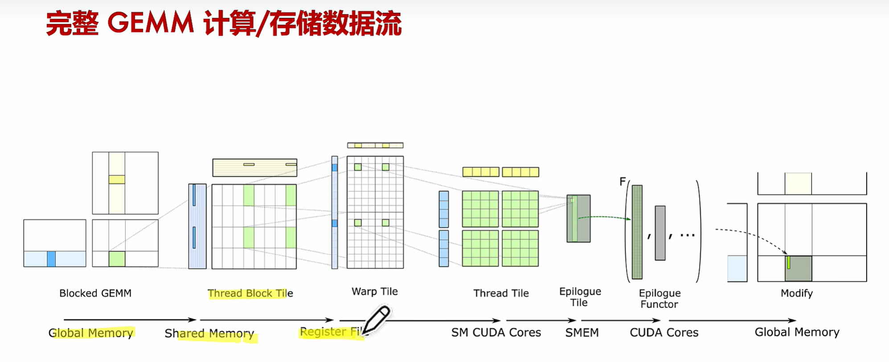

# Tensor Cores

[CUDA Toolkit Documentation 12.2 (nvidia.com)](https://docs.nvidia.com/cuda/)

[NVIDIA 英伟达 Tensor Core 基本原理(上)【AI 芯片】GPU 架构 04\_哔哩哔哩\_bilibili](https://www.bilibili.com/video/BV1aL411a71w/?spm_id_from=333.337.search-card.all.click&vd_source=5ecbb6b773d7fefbad376a941af576e2)

Tensor Core：

专门做矩阵乘，矩阵加，可以在一步中执行混合精度的矩阵乘法和累积。这意味着它们可以乘以两个矩阵，然后将第三个矩阵添加到结果中，这是深度学习中的基本操作，速度非常快。

GEMM 通用矩阵乘 General Matrix Multiplication

FMA 乘积累加指令 Fused Multiply–accumulate operation

## CUDA 核心和 Tensor 核心

CUDA 核心和 Tensor 核心都是 NVIDIA GPU 中的架构组件，但它们是为不同的目的设计的并以不同的方式操作。以下是它们之间的差异：

### 1. 目的 ：

- CUDA 核心 ：CUDA 核心有时被称为“流式多处理器”或“着色器核心”，它们是通用的并且处理各种任务，包括顶点着色、像素着色、几何着色和计算任务。它们是负责传统 GPU 任务的主要组件。
- Tensor 核心 ：Tensor 核心是 NVIDIA 架构的较新添加，与 Volta 代一起引入。它们是专门为加速深度学习工作负载而设计的硬件单元，特别是在神经网络训练和推断中常见的矩阵操作。

### 2. 操作 ：

- CUDA 核心 ：CUDA 核心可以处理浮点算术、整数算术和其他传统的 GPU 任务。
- Tensor 核心 ：Tensor 核心可以在一步中执行混合精度的矩阵乘法和累积。这意味着它们可以乘以两个矩阵，然后将第三个矩阵添加到结果中，这是深度学习中的基本操作，速度非常快。

### 3. 精度 ：

- CUDA 核心 ：支持从高精度（如 FP64）到较低精度（如 FP32）的广泛精度。
- Tensor 核心 ：主要针对混合精度计算进行了优化，通常使用 FP16（半精度）进行乘法和 FP32（单精度）进行累积。这种混合精度方法在深度学习中是有益的，因为许多模型可以容忍降低的精度，而不会对准确性产生重大影响。

### 4. 在 GPU 架构中的存在 ：

- CUDA 核心 ：自 2007 年引入 CUDA 平台以来，CUDA 核心一直是 NVIDIA GPU 的主要组成部分。
- Tensor 核心 ：它们从 Volta 架构开始引入（例如在 Tesla V100 中），并且在随后的架构中（如 Turing、Ampere 等）都存在。

### 5. 性能 ：

- CUDA 核心 ：通用，可以有效地处理各种任务。
- Tensor 核心 ：在与深度学习有关的特定矩阵操作方面，与 CUDA 核心相比，Tensor 核心提供了明显更快的性能。

总之，虽然 CUDA 核心和 Tensor 核心都是 NVIDIA 的 GPU 架构的重要部分，但 CUDA 核心是处理各种任务的通用核心，而 Tensor 核心是针对深度学习矩阵操作优化的专用单元。当购买 NVIDIA 硬件时，应根据预期的主要用途（例如，游戏、图形、通用计算、深度学习）考虑 CUDA 核心和 Tensor 核心之间的平衡。
