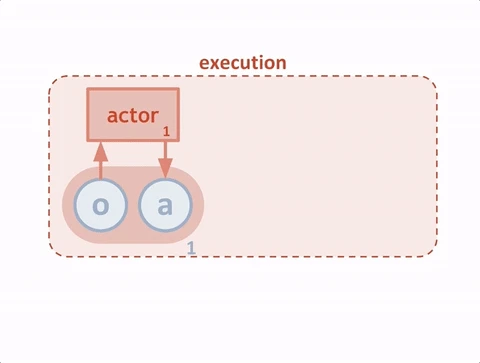
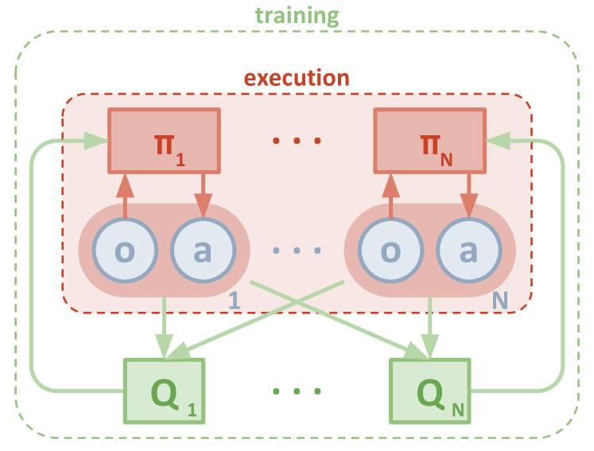
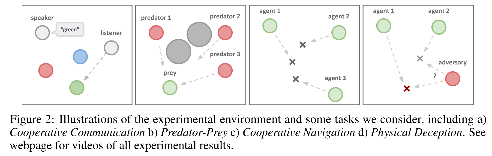

# 2017-12 NIPS: Multi-agent actor-critic for mixed cooperative-competitive environments, OpenAI

多智能体'演员-评论家'混合'合作-竞争'环境

- [arxiv](https://arxiv.org/abs/1706.02275#)
- [acm](https://dl.acm.org/doi/10.5555/3295222.3295385)
  - Cited by 5676
- [openai blog](https://openai.com/index/learning-to-cooperate-compete-and-communicate/)
- [csdn blog](https://blog.csdn.net/crazy_girl_me/article/details/120688681)
- [csdn blog: Q-Learning](https://blog.csdn.net/qq_30615903/article/details/80739243)
- [code: multiagent-particle-envs (MPE)](https://github.com/openai/multiagent-particle-envs)
- [github: PettingZoo](https://github.com/Farama-Foundation/PettingZoo/)
- [PettingZoo MPE doc](https://pettingzoo.farama.org/environments/mpe/)

---

- We explore deep reinforcement learning methods for multi-agent domains.
- We begin by analyzing the difficulty of traditional algorithms in the multi-agent case:
  - Q-learning is challenged by an inherent non-stationarity of the environment,
  - while policy gradient suffers from a variance that increases as the number of agents grows.
- We then present an adaptation of `actor-critic` methods that considers action policies of other agents and is able to successfully learn policies that require complex multi-agent coordination.
- Additionally, we introduce a training regimen utilizing an ensemble of policies for each agent that leads to more robust multi-agent policies.
- We show the strength of our approach compared to existing methods in cooperative as well as competitive scenarios, where agent populations are able to discover various physical and informational coordination strategies.

- 我们探索了多智能体领域的深度强化学习方法。
- 首先，我们分析了传统算法在多智能体情况下的困难：
  - Q 学习因环境固有的非平稳性而面临挑战，
  - 而策略梯度则随着智能体数量增加而方差增大。
- 随后，我们提出了一种改进的'演员-评论家' (actor-critic) 方法，该方法考虑了其他智能体的动作策略，并能成功学习需要复杂多智能体协调的策略。
- 此外，我们引入了一种训练方案，利用每个智能体的策略集合，从而产生更稳健的多智能体策略。
- 我们展示了在合作与竞争场景下，与现有方法相比，我们的方法在智能体群体能够发现各种物理和信息协调策略方面的优势。

Machine Learning (cs.LG); Artificial Intelligence (cs.AI); Neural and Evolutionary Computing (cs.NE)

机器学习（cs.LG）；人工智能（cs.AI）；神经和进化计算（cs.NE）

1. intro
2. related work
3. background
   1. Markov Games 马尔可夫博弈
   2. Q-Learning and Deep Q-Networks (DQN)
   3. Policy Gradient (PG) Algorithms 策略梯度算法
   4. Deterministic Policy Gradient (DPG) Algorithms. 确定性策略梯度（DPG）算法
4. methods
   1. multi-agent actor critic
   2. inferring policies of other agents
   3. agents with policy ensembles
5. experiments
6. conclusion

- [2017-12 NIPS: Multi-agent actor-critic for mixed cooperative-competitive environments, OpenAI](#2017-12-nips-multi-agent-actor-critic-for-mixed-cooperative-competitive-environments-openai)
  - [OpenAI Blog: Learning to cooperate, compete, and communicate](#openai-blog-learning-to-cooperate-compete-and-communicate)
    - [Where traditional RL struggles](#where-traditional-rl-struggles)
  - [1 Introduction](#1-introduction)
  - [4 Methods](#4-methods)
  - [5 Experiments](#5-experiments)

## OpenAI Blog: Learning to cooperate, compete, and communicate

Multiagent environments where agents compete for resources are stepping stones on the path to AGI. Multiagent environments have two useful properties: first, there is a natural curriculum—the difficulty of the environment is determined by the skill of your competitors (and if you’re competing against clones of yourself, the environment exactly matches your skill level). Second, a multiagent environment has no stable equilibrium: no matter how smart an agent is, there’s always pressure to get smarter. These environments have a very different feel from traditional environments, and it’ll take a lot more research before we become good at them.
多智能体环境中，智能体为资源竞争，这是通往人工通用智能（AGI）道路上的垫脚石。多智能体环境具备两个有益特性：其一，存在自然的学习梯度——环境的难度由竞争对手的技能决定（若与自身克隆体竞争，则环境精确匹配你的技能水平）。其二，多智能体环境不存在稳定平衡点：无论智能体多么聪明，总有变得更聪明的压力。这些环境与传统环境感受迥异，我们需要进行大量研究才能在其中游刃有余。

We’ve developed a new algorithm, MADDPG⁠(opens in a new window), for centralized learning and decentralized execution in multiagent environments, allowing agents to learn to collaborate and compete with each other.
我们开发了一种新算法 MADDPG，用于多智能体环境中的集中学习与分散执行，使智能体能够学会相互协作与竞争。
MADDPG extends a reinforcement learning algorithm called DDPG⁠(opens in a new window), taking inspiration from actor-critic reinforcement learning⁠(opens in a new window) techniques; other groups are exploring⁠(opens in a new window) variations⁠(opens in a new window) and parallel implementations⁠(opens in a new window) of these ideas.
MADDPG 算法是对 DDPG（深度确定性策略梯度）强化学习算法的扩展，其灵感来源于演员-评论家强化学习技术；其他研究团队正在探索这些理念的变体及并行实现方案。

We treat each agent in our simulation as an “actor”, and each actor gets advice from a “critic” that helps the actor decide what actions to reinforce during training. Traditionally, the critic tries to predict the value (i.e. the reward we expect to get in the future) of an action in a particular state, which is used by the agent—the actor—to update its policy. This is more stable than directly using the reward, which can vary considerably. To make it feasible to train multiple agents that can act in a globally-coordinated way, we enhance our critics so they can access the observations and actions of all the agents, as the following diagram shows.
在我们的模拟中，我们将每个智能体视为一个“演员”，每个演员都会从“评论家”那里获得建议，帮助演员在训练过程中决定强化哪些动作。传统上，评论家试图预测在特定状态下动作的价值（即我们预期未来会获得的奖励），这一价值由智能体——即演员——用来更新其策略。这比直接使用奖励更为稳定，因为奖励可能会有很大波动。为了使训练多个能够以全局协调方式行动的智能体成为可能，我们增强了评论家的功能，使其能够访问所有智能体的观察和动作，如下图所示。

Our agents don’t need to access the central critic at test time; they act based on their observations in combination with their predictions of other agents behaviors’. Since a centralized critic is learned independently for each agent, our approach can also be used to model arbitrary reward structures between agents, including adversarial cases where the rewards are opposing.

我们的代理在测试时无需访问中央评论者；它们根据自身观察结合对其他代理行为的预测来行动。由于每个代理独立学习一个中央评论者，我们的方法也能用于建模代理间的任意奖励结构，包括奖励相互对立的对抗性情况。

We tested our approach on a variety of tasks and it performed better than DDPG on all of them. In the above animations you can see, from left to right: two AI agents trying to go to a specific location and learning to split up to hide their intended location from the opposing agent; one agent communicating the name of a landmark to another agent⁠(opens in a new window); and three agents coordinating to travel to landmarks without bumping into each other.

我们在多种任务上测试了我们的方法，其表现均优于 DDPG。在上述动画中，从左至右可以看到：两个 AI 代理尝试前往特定位置，并学会分散行动以隐藏其目标位置，不让对方代理察觉；一个代理向另一个代理传达地标名称；以及三个代理协调行动，前往各自地标而不相互碰撞。

### Where traditional RL struggles

传统强化学习的困境所在

Traditional decentralized RL approaches—DDPG, actor-critic learning, deep Q-learning, and so on—struggle to learn in multiagent environments, as at every time step each agent will be trying to learn to predict the actions of other agents while also taking its own actions. This is especially true in competitive situations. MADDPG employs a centralized critic to supply agents with information about their peers’ observations and potential actions, transforming an unpredictable environment into a predictable one.

传统的去中心化强化学习方法——如 DDPG、演员-评论家学习、深度 Q 学习等——在多智能体环境中学习时面临挑战，因为每个智能体在每个时间步不仅要预测其他智能体的行为，还要采取自己的行动。在竞争性情境下，这一挑战尤为突出。MADDPG 采用集中式评论家机制，为智能体提供关于同伴观察和潜在行动的信息，从而将不可预测的环境转化为可预测的环境。

Using policy gradient methods presents further challenges: because these exhibit high variance learning the right policy is difficult to do when the reward is inconsistent. We also found that adding in a critic, while improving stability, still failed to solve several of our environments such as cooperative communication. It seems that considering the actions of others during training is important for learning collaborative strategies.

采用策略梯度方法带来了进一步的挑战：由于这些方法表现出高方差，当奖励不一致时，学习正确的策略变得困难。我们还发现，尽管加入评论家提高了稳定性，但仍未能解决我们的一些环境问题，如合作通信。看来在训练过程中考虑他人的行动对于学习协作策略至关重要。

## 1 Introduction

In this work, we propose a general-purpose multi-agent learning algorithm that: (1) leads to learned policies that only use local information (i.e. their own observations) at execution time, (2) does not assume a differentiable model of the environment dynamics or any particular structure on the communication method between agents, and (3) is applicable not only to cooperative interaction but to competitive or mixed interaction involving both physical and communicative behavior. The ability to act in mixed cooperative-competitive environments may be critical for intelligent agents; while competitive training provides a natural curriculum for learning [32], agents must also exhibit cooperative behavior (e.g. with humans) at execution time.

在这项工作中，我们提出了一种通用多智能体学习算法，该算法：

- （1）在执行时只使用局部信息（即自己的观察）来学习策略；
- （2）不假设环境动力学的可微模型或智能体之间通信方法的任何特定结构；
- （3）不仅适用于合作交互，还适用于涉及物理和通信行为的竞争或混合交互。

在混合合作-竞争环境中采取行动的能力可能对智能体至关重要；虽然竞争训练为学习提供了自然的课程[32]，但在执行时，智能体还必须表现出合作行为（例如与人类）。

We adopt the framework of centralized training with decentralized execution, allowing the policies to use extra information to ease training, so long as this information is not used at test time. It is unnatural to do this with Q-learning without making additional assumptions about the structure of the environment, as the Q function generally cannot contain different information at training and test time. Thus, we propose a simple extension of actor-critic policy gradient methods where the critic is augmented with extra information about the policies of other agents, while the actor only has access to local information. After training is completed, only the local actors are used at execution phase, acting in a decentralized manner and equally applicable in cooperative and competitive settings.

我们采用集中式训练和分布式执行框架，允许策略使用额外信息以简化训练，只要这些信息在测试时未被使用。在没有对环境结构做出额外假设的情况下，使用 Q 学习来做这件事是不自然的，因为 Q 函数通常不能在训练和测试时包含不同的信息。因此，我们提出了一种简单的 actor-critic 策略梯度方法扩展，其中 critic 被其他 agents 策略的额外信息增强，而 actor 只能访问本地信息。训练完成后，仅在执行阶段使用本地 actor，以分布式方式行动，在合作和竞争环境中同样适用。

Since the centralized critic function explicitly uses the decision-making policies of other agents, we additionally show that agents can learn approximate models of other agents online and effectively use them in their own policy learning procedure. We also introduce a method to improve the stability of multi-agent policies by training agents with an ensemble of policies, thus requiring robust interaction with a variety of collaborator and competitor policies. We empirically show the success of our approach compared to existing methods in cooperative as well as competitive scenarios, where agent populations are able to discover complex physical and communicative coordination strategies.

由于集中式批评函数明确使用了其他 agents 的决策策略，我们进一步表明 agents 可以在线学习其他 agents 的近似模型，并在自己的策略学习过程中有效地使用它们。我们还介绍了一种通过训练策略集合来提高多 agents 策略稳定性的方法，从而需要与各种合作者和竞争者策略进行鲁棒的交互。我们通过实验证明了我们的方法在合作和竞争场景中的成功，在这些场景中，agents 群体能够发现复杂的物理和沟通协调策略。

## 4 Methods

## 5 Experiments

Figure 2: Illustrations of the experimental environment and some tasks we consider, including a) Cooperative Communication b) Predator-Prey c) Cooperative Navigation d) Physical Deception. See webpage for videos of all experimental results.
