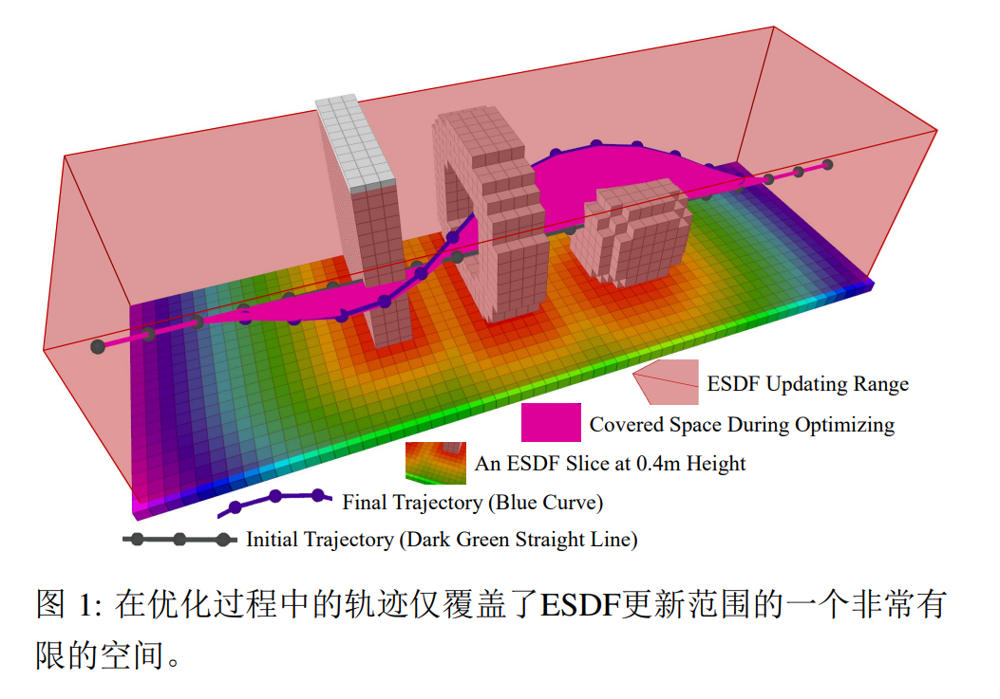
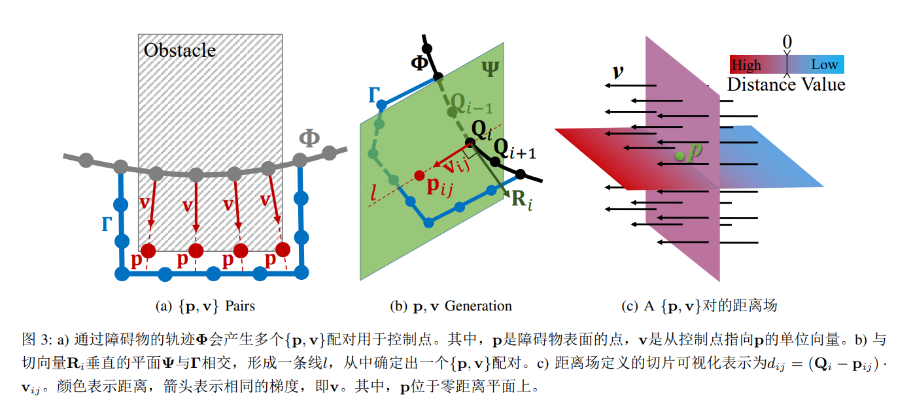
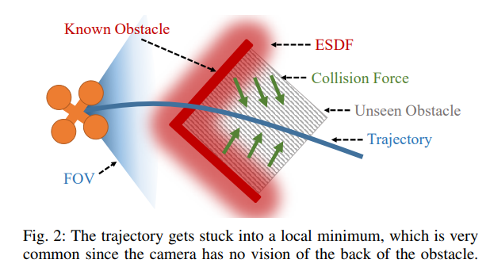
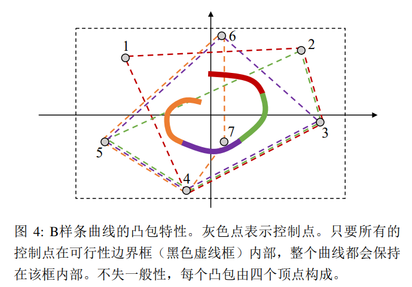
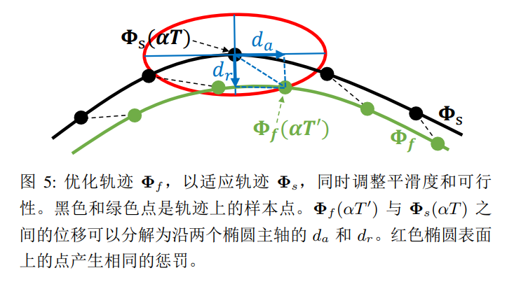

# EGO Planner 2020

## EGO-Planner: An ESDF-free Gradient-based Local Planner for Quadrotors

Gradient-based planners are widely used for quadrotor local planning, in which a Euclidean Signed Distance Field (ESDF) is crucial for evaluating gradient magnitude and direction. Nevertheless, computing such a field has much redundancy since the trajectory optimization procedure only covers a very limited subspace of the ESDF updating range. In this paper, an ESDF-free gradient-based planning framework is proposed, which significantly reduces computation time.

The main improvement is that the `collision term in penalty function` is formulated by comparing the `colliding trajectory` with a `collision free guiding path` .

The resulting obstacle information will be stored only if the trajectory hits new obstacles, making the planner only extract necessary obstacle information. Then, we lengthen the time allocation if dynamical feasibility is violated.

An anisotropic curve fitting algorithm is introduced to adjust higher order derivatives of the trajectory while maintaining the original shape.

Benchmark comparisons and real-world experiments verify its robustness and high-performance. The source code is released as ros packages.

基于梯度的规划器广泛用于四旋翼本地规划，其中 `欧几里得有符号距离场（ESDF）`对于评估梯度大小和方向至关重要。然而，计算这样的场会存在很多冗余，因为轨迹优化过程仅覆盖 ESDF 更新范围的一个非常有限的子空间。本文提出了一种 `无需ESDF的基于梯度的规划框架`（ESDF-free gradient-based planning framework），大大减少了计算时间。主要改进在于通过将 `碰撞轨迹`与 `无碰撞引导路径`进行 `比较`来制定惩罚函数中的 `碰撞项`。 仅当轨迹与新障碍物碰撞时，才会存储生成的障碍信息，使规划器仅提取必要的障碍信息。然后，如果违反了动力学可行性，我们会延长时间分配。引入一种各向 `异性曲线拟合算法`，以调整轨迹的高阶导数，同时保持原始形状。基准比较和实际实验验证了其鲁棒性和高性能。源代码以 ROS 软件包形式发布。

Euclidean Signed Distance Functions

欧式有符号距离函数

### 1 Introduction

尽管 ESDF 被广泛使用，但很少有人研究其必要性。通常来说，有两种方式来构建 ESDF。如第 2 节所述，这些方法可以分为 `增量全局更新方法`和 `批处理局部计算方法`。然而，这两种方法都没有 关注轨迹本身 。因此，计算 ESDF 值上花费了太多的计算量，这些 ESDF 值对规划没有任何贡献。换句话说，当前基于 ESDF 的方法并没有直接和唯一地服务于轨迹优化。如图 1 所示，在一般的自主导航场景中，无人机只需要避免局部碰撞，轨迹仅覆盖了 ESDF 更新范围的有限空间。在实践中，尽管一些手动规则可以决定较窄的 ESDF 范围，它们缺乏理论的合理性，仍然会引起不必要的计算。



(具有碰撞检测和轨迹优化功能)

在本文中，我们设计了一个 ` 无ESDF的基于梯度的``本地``规划框架 `，称为 EGO，并结合精心的工程考虑使其轻巧且鲁棒。 所提出的算法由基于梯度的 `样条优化器`（spline optimizer）和 `后处理程序`（a post-refinement procedure）组成。

Firstly, we optimize the trajectory with smoothness, collision, and dynamical feasibility terms. Unlike traditional approaches that query pre-computed ESDF, we model the collision cost by comparing the trajectory inside obstacles with a guiding collision-free path.

首先，我们通过平滑度、碰撞和动力可行性等项进行了轨迹优化。 与传统方法不同，我们通过将障碍物内的轨迹与引导的无碰撞路径\*\*`进行`\*\*比较来对碰撞成本进行建模。

We then project the forces onto the colliding trajectory and generate estimated gradient to wrap the trajectory out of obstacles. During the optimization, the trajectory will rebound a few times between nearby obstacles and finally terminate in a safe region. In this way, we only calculate the gradient when necessary, and avoid computing ESDF in regions irrelevant to the local trajectory. If the resulted trajectory violates dynamical limits, which is usually caused by unreasonable time allocation, the refinement process is activated. During the refinement, trajectory time is reallocated when the limits are exceeded. With the enlarged time allocation, a new `B-spline` that fits the previous dynamical infeasible one while balancing the feasibility and fitting accuracy is generated. To improve robustness, the fitting accuracy is modeled anisotropically with different penalties on axial and radial directions.

然后，我们将力投影到碰撞轨迹上，生成预估的梯度以将轨迹包裹在障碍物外部。 在优化过程中，轨迹将在附近障碍物之间反弹几次，最后停在一个安全区域。 通过这种方式，我们 只在必要时计算梯度 ，并避免在与局部轨迹无关的区域计算 ESDF。 如果生成的轨迹违反动力学限制，通常是由于不合理的时间分配，将启动 后续优化 。 在优化过程中，超出时间限制时，会重新分配轨迹的时间。 通过增加时间分配，我们生成一个新的 B 样条曲线，它可以拟合先前的动态不可行样条，同时平衡可行性和拟合精度。为了提高鲁棒性，拟合精度采用各向异性建模，在轴向和径向上具有不同的惩罚。

据我们所知，这种方法是首次实现了无 ESDF 的基于梯度的局部规划。 与现有的最先进方法相比，所提出的方法在忽略 ESDF 维护的同时生成具有相当平滑度和侵略性的安全轨迹，计算时间降低了一个数量级。 我们进行了全面的仿真和实际测试，以验证我们的方法。 本文的贡献包括：

1. 我们提出了一种轻量级但有效的轨迹优化算法，通过采用各向异性误差惩罚来建模轨迹拟合问题，从而生成更加平滑的轨迹。
2. 我们将提出的方法集成到一个完全自主的四旋翼系统中，并将我们的软件发布给社区参考。
3. 路径陷入了一个局部最小值，这是非常常见的情况，因为相机无法看到障碍物的背面。

### 2 Related Work

#### A. Gradient-based Motion Planning

`基于梯度的运动规划`是无人机局部轨迹生成的主流方法，它将问题建模为无约束的非线性优化。 Ratliff 等人首次将 `ESDF`引入机器人运动规划中。许多规划框架利用其丰富的梯度信息，直接在配置空间中优化轨迹。 然而，对轨迹进行 `离散时间优化`对于无人机来说不太适用，因为它更加敏感于动力学约束。 因此，[7] 提出了一种适用于无人机规划的连续时间多项式轨迹优化方法。 然而，潜在函数的积分导致了较重的计算负担。 此外，即使进行了随机重启，该方法的成功率也只达到约 70%。 鉴于这些缺点，[2] 引入了轨迹的 B 样条参数化，充分利用了凸包特性。 在 [8] 中，通过找到一个无碰撞的初始路径作为前端，成功率显著提高。 此外，当考虑到运动动力学约束时，初始无碰撞路径的生成进一步改进。 周等人[11] 将感知意识纳入系统中，使其更加鲁棒。 在上述方法中，ESDF 在评估与附近障碍物的距离、梯度幅度和方向方面起着重要作用。

#### B. Euclidean Signed Distance Field (ESDF)

ESDF 在过去的二十多年中一直被用于从嘈杂的传感器数据中构建对象 [12], 并自从 [5] 之后重新引起 了机器人运动规划的兴趣。

Felzenszwalb 等人 [4] 提出 了一种通过将时间复杂度降低到 $O(n) $来构建 ESDF 的包络算法, 其中 n 表示体素数。虽然该算法不适用于增量式建立 ESDF, 但在四旋翼飞行过程中经常需要动态 更新场域。为了解决这个问题, Oleynikova [13] 和 Han [3] 提出了增量式 ESDF 生成方法, 即 Voxblox 和 FIESTA。 尽管这些方法在动态更新情况下非常高效, 但生成 的 ESDF 几乎总是包含可能在规划过程中根本不会使 用的觉余信息。如图 1 所示, 该轨迹仅在整个 ESDF 更新范围的非常有限的子空间上扫描。因此, 设计一种更加 智能和轻量级的方法, 而不是维护整个场域, 具有很高的价值。

### 3 Collision Avoidance Force Estimation 避碰力估计



a) 通过障碍物的轨迹 $\mathbf{\Phi}$ 会产生多个 $\{\mathbf{p},\mathbf{v}\}$ 配对用于控制点。其中， $\mathbf{p}$ 是障碍物表面的点， $\mathbf{v}$ 是从控制点指向 $\mathbf{p}$ 的单位向量。

b) 与切向量 $\mathbf{R}_i$垂直的平面 $\mathbf{\Psi}$ 与 $\mathbf{\Gamma}$ 相交，形成一条线$l$，从中确定出一个 $\{\mathbf{p},\mathbf{v}\}$ 配对。

c) 距离场定义的切片可视化表示为$d_{ij}=(\mathbf{Q}_{i}-\mathbf{p}_{ij}) \cdot \mathbf{v}_{ij}$ 。颜色表示距离，箭头表示相同的梯度，即 $\mathbf{v}$ 。其中， $\mathbf{p}$ 位于零距离平面上。

$$
\begin{aligned}
\textbf{Algorithm 1:} & \quad \text{CheckAndAddObstacleInfo} \\
\hline
\textbf{Notation:} & \\
& \text{Environment } E \\
& \text{Control Points Struct } Q \\
& \text{Anchor Points } p \\
& \text{Repulsive Direction Vector } v \\
& \text{Colliding Segments } S \\
\textbf{Input:} & \quad E, Q \\
1 & \text{for each } Q_i \text{ in } Q \text{ do} \\
2 & \quad \quad \text{if } \text{FindConsecutiveCollidingSegment}(Q_i) \text{ then} \\
3 & \quad \quad \quad S.\text{push\_back}(\text{GetCollisionSegment}()) \\
4 & \quad \quad \text{end if} \\
5 & \text{end for} \\
6 & \text{for each } S_i \text{ in } S \text{ do} \\
7 & \quad \quad \Gamma \leftarrow \text{PathSearch}(E, S_i) \\
8 & \quad \quad \text{for } j = S_i.\text{begin to } S_i.\text{end do} \\
9 & \quad \quad \quad \{p, v\} \leftarrow \text{FindPVpairs}(Q_j, \Gamma) \\
10 & \quad \quad \quad Q_j.\text{push\_back}(\{p, v\}) \\
11 & \quad \quad \text{end for} \\
12 & \text{end for}
\end{aligned}
$$

```Python
def CheckAndAddObstacleInfo(E, Q):
    """
    Function to check and add obstacle information.

    Args:
    - E: The environment
    - Q: Control Points Struct

    Returns:
    - Q: Updated Control Points Struct after adding obstacle info
    """

    S = []  # Colliding segments

    # Check for colliding segments in each control point
    for Q_i in Q:
        if FindConsecutiveCollidingSegment(Q_i):
            S.append(GetCollisionSegment())

    # Process each colliding segment
    for S_i in S:
        Gamma = PathSearch(E, S_i)

        # Not sure how `begin` and `end` are defined for S_i,
        # but assuming they are integer indices
        for j in range(S_i.begin, S_i.end + 1):
            p, v = FindPVpairs(Q[j], Gamma)
            Q[j].append((p, v))

    return Q

```

在本文中，决策变量是`B 样条曲线`的`控制点` $\mathbf{Q}$ 。 每个 $\mathbf{Q}$ 都独立地拥有自己的环境信息。

一开始，给定一个满足终端约束条件的朴素`B 样条曲线` $\mathbf{\Phi}$ ，不考虑碰撞情况。

然后，优化过程开始。 在每次迭代中检测到`碰撞段`后，生成一个无碰撞路径 $\mathbf{\Gamma}$ 。

```


```

接着，将每个碰撞段的`控制点` $\mathbf{Q}_i$ 分配到障碍物表面的`锚点` $\mathbf{p}_{ij}$ ，并带有相应的斥力方向向量 $\mathbf{v}_{ij} =\overrightarrow{Q_{i} p\_{i j}}$ ，如图 2.a 所示。

其中，$i \in \mathbb{N}_+$为`控制点`的索引，$j \in \mathbb{N}$ 为 $\{\mathbf{p},\mathbf{v}\}$ 对的索引。

注意，每个 $\{\mathbf{p},\mathbf{v}\}$ 对只属于一个特定的`控制点`。为了简洁起见，我们在不引起歧义的情况下省略下标$ij$。 本文中详细的 $\{\mathbf{p},\mathbf{v}\}$ 对生成过程概述在`算法1`中，并在图 3.b 中进行了说明。
为了防止轨迹被拉出当前障碍物前、迭代过程中反复生成 \{p, v\} 对，判断是否为新障碍物的标准 是: 如果控制点 Q*{i} 处于障碍物中时，并且对于当前得到的所有障碍物 j 满足 d*{i j}>0 ，则该障 碍物为新发现的障碍物。从而只计算影响轨迹的障碍物信息，减少运行时间。

然后，将从 $\mathbf{Q}_i$到第$j$个障碍物的障碍物距离定义为

$$
d_{i j}=\left(\mathbf{Q}_{i}-\mathbf{p}_{i j}\right) \cdot \mathbf{v}_{i j}
$$

为了防止轨迹被拉出当前障碍物前、迭代过程中反复生成 $\{p, v\} $对，判断是否为新障碍物的标准 是: 如果控制点$ Q*{i} $处于障碍物中时，并且对于当前得到的所有障碍物$ j $满足 $d*{i j}>0 $，则该障碍物 $\mathbf{Q}\_i$才为新发现的障碍物。从而只计算影响轨迹的障碍物信息，减少运行时间。

To incorporate necessary environmental awareness into the local planner, we need to explicitly construct an objective function that keeps the trajectory away from obstacles.

ESDF provides this vital collision information but with the price of a heavy computation burden.

In addition, as shown in Fig.\ref{pic:local_min}, ESDF-based planners can easily fall into a local minimum and fail to escape from obstacles, due to the insufficient or even wrong information from ESDF.

To avoid such situations, an additional front-end is always needed to provide a collision-free initial trajectory.

The above methodology outperforms ESDF in providing the vital information for collision avoidance, since the explicitly designed repulsive force can be fairly effective regarding various missions and environments.

Moreover, the proposed method has no requirement for collision-free initialization.

为了将必要的环境意识融入局部规划器中，我们需要明确构建一个目标函数，使轨迹远离障碍物。 ESDF 提供了这个重要的碰撞信息，但付出了沉重的计算负担。 此外，如图 2 所示，基于 ESDF 的规划器很容易陷入局部最小值，并不能逃离障碍物，这是由于 ESDF 提供的信息不足甚至错误。 为了避免这种情况，额外的前端始终需要提供一个`无碰撞的初始轨迹`。 上述方法在提供用于避障的重要信息方面优于 ESDF，因为明确设计的斥力对于各种任务和环境都非常有效。 此外，所提出的方法对无碰撞的初始化没有要求。

由于不足和错误的 ESDF 信息会导致规划器落入局部最优解。一个无碰撞初始轨迹（$A*$）能够在避免碰撞上提供比 ESDF 更好的信息，因为明确设计的排斥力对各种任务和环境可以相当有效

### 4 Gradient-Based Trajectory Optimization



基于梯度的轨迹优化器

#### A. Problem Formulation

在本文中，轨迹由`均匀 B 样条曲线` $\mathbf{\Phi}$ 参数化，该曲线由：

- 其`次数`$p_b$，
- $N_c$ 个`控制点` $\left\lbrace \mathbf{Q}_1, \mathbf{Q}\_2, \cdots, \mathbf{Q}_{N_c} \right\rbrace$ 和
- `节点向量` $\left\{ t_1, t_2, \cdots, t_M \right\}$ 唯一确定，
- 其中 $\mathbf{Q}_i \in \mathbb{R}^3$，$t_m \in \mathbb{R}$ ，$M=N_c+p_b$ 。

为了简化和提高轨迹评估的效率，我们方法中使用的`B 样条`是`均匀的`，这意味着每个节点与其前一个节点之间有相同的时间间隔 $\triangle t=t_{m+1}-t_m$ 。 本文的问题形式化基于当前最先进的四旋翼机器人局部规划框架 Fast-Planner-19。



B-样条具有`凸包性质`。 该性质表明 B-样条曲线的单个区间仅由$p_b+1$个连续控制点控制，并位于这些点的凸包内。 例如，在 $(t_i, t_{i+1})$ 区间内的一个区段位于由 $\{\mathbf{Q}_{i-p_b}, \mathbf{Q}_{i-p_b+1}, \cdots, \mathbf{Q}_i\}$ 形成的凸包内。

另一个性质是 B-样条的 $k$ 阶导数仍然是一个具有次数 $p_{b,k}=p_b-k$ 的 B-样条。

由于 $\triangle t$与 $\mathbf{\Phi}$ 独立，速度 $\mathbf{V}_i$、加速度 $\mathbf{A}_i$和加加速度 $\mathbf{J}_i$ 曲线的控制点可以通过如下公式获得：

$$
\mathbf{V}_{i}=\frac{\mathbf{Q}_{i+1}-\mathbf{Q}_{i}}{\triangle t}, \mathbf{A}_{i}=\frac{\mathbf{V}_{i+1}-\mathbf{V}_{i}}{\triangle t}, \mathbf{J}_{i}=\frac{\mathbf{A}_{i+1}-\mathbf{A}_{i}}{\triangle t}
$$

我们遵循 [15] 的工作，在差分平坦输出空间的缩减空间中规划控制点 $\mathbf{Q} \in \mathbb{R}^3$（根据无人机的微分平坦特性降低要规划的变量）。 优化问题的表述如下：

$$
\min _{\mathbf{Q}} J=\lambda_{s} J_{s}+\lambda_{c} J_{c}+\lambda_{d} J_{d},
$$

$$
Q=\operatorname{argmin} J=\lambda_{s} J_{s}+\lambda_{c} J_{c}+\lambda_{d} J_{d}
$$

其中$J_s$是平滑度惩罚项，$J_c$是碰撞惩罚项，而$J_d$表示动力学可行项。 $\lambda_s, \lambda_c, \lambda_d$是每个惩罚项的权重。

1）平滑度惩罚项

the smoothness penalty is formulized as the time integral over square derivatives of the trajectory (acceleration, jerk, etc.)

在\cite{Usenko2017ewok}中，平滑惩罚被定义为轨迹二阶导数（加速度、 jerk 等）的时间积分。 在\cite{zhou2019robust}中，只考虑轨迹的几何信息，不考虑时间分配。 在本文中，我们结合了两种方法来对加速度和 jerk 进行平方惩罚，而不进行时间积分。

> 最小化高阶导数能够使得整段轨迹光滑。所以光滑项由加速度和加加速度的平方和构成。

通过凸包性质的优势，只要最小化 `B 样条轨迹`的`二阶导`和`三阶导`控制点的平方和 就足以减小整个曲线上的这些导数。 因此，平滑惩罚函数的公式为：

$$
J_{s}=\sum_{i=1}^{N_{c}-1}\left\|\mathbf{A}_{i}\right\|_{2}^{2}+\sum_{i=1}^{N_{c}-2}\left\|\mathbf{J}_{i}\right\|_{2}^{2},
$$

最小化高阶导数，使整个轨迹变得平滑。

2）碰撞惩罚项

碰撞惩罚将控制点远离障碍物。 这是通过采用`安全间隙` $s_f$ 并`惩罚`满足 $d_{ij} < s_f$ 的控制点来实现的。 为了进一步促进优化，我们构造了一个二次连续可微的`惩罚函数` $j_c$，随着 $d_{ij}$ 减小，$j_c$的斜率就越小，从而得到分段函数：

$$
\begin{array}{rlr}j_{c}(i, j) & =\left\{\begin{array}{lr}0 & \left(c_{i j} \leq 0\right) \\\\ c_{i j}^{3} & \left(0<c_{i j} \leq s_{f}\right) \\\\ 3 s_{f} c_{i j}^{2}-3 s_{f}^{2} c_{i j}+s_{f}^{3} & \left(c_{i j}>s_{f}\right)\end{array}\right.\end{array}
$$

其中$c_{i j} =s_{f}-d_{i j}$ ，$j_c(i,j)$ 是由 $\{\mathbf{p},\mathbf{v}\}_j$ 对于 $\mathbf{Q}_i$ 产生的 cost。 每个 $\mathbf{Q}_i$ 的成本是独立评估的，并且从所有对应的 $\{\mathbf{p},\mathbf{v}\}_j$ 对中累积。 因此，如果一个控制点发现了更多的障碍物，它将获得更高的`轨迹变形权重`。 具体来说，第 $i$ 个控制点的成本值为 $j_c(\mathbf{Q}_i)=\sum_{j=1}^{N_p} j_c(i,j)$，其中 $N_p$ 是属于 $\mathbf{Q}_i$ 的 $\{\mathbf{p},\mathbf{v}\}_j$ 对的数量。 将所有 $\mathbf{Q}_i$ 上的成本组合在一起得到总成本 $J_c$，即：

$$
J_{c}=\sum_{i=1}^{N_{c}} j_{c}\left(\mathbf{Q}_{i}\right).
$$

与传统的基于 ESDF 的方法（Usenko et al., 2017; Zhou et al., 2019）不同，传统方法通过在场上进行三线性插值来计算梯度，而我们通过直接`闭式计算` $J_c$相对于 $\mathbf{Q}_i$的导数来获得梯度：

$$
\frac{\partial J_{c}}{\partial \mathbf{Q}_{i}}=\sum_{i=1}^{N_{c}} \sum_{j=1}^{N_{p}} \mathbf{v}_{i j}\left\{\begin{array}{lr}0 & \left(c_{i j} \leq 0\right) \\ -3 c_{i j}^{2} & \left(0<c_{i j} \leq s_{f}\right) \\ -6 s_{f} c_{i j}+3 s_{f}^{2} & \left(c_{i j}>s_{f}\right)\end{array}\right.
$$

3）可行性惩罚项

> 动力学可行项通过限制轨迹在三个轴上的$k$阶导数来实现。得益于 B 样条曲线的凸包性质，只要对控制点进行限制即可满足动力学可行性。

通过限制每个维度上轨迹的`高阶导数`来确保可行性，即对所有$t$应用

$$
$|\mathbf{\Phi}^{(k)}_r(t)| < \mathbf{\Phi}^{(k)}_{r,max}$
$$

其中$r \in \{x, y, z\}$ 表示每个维度。

由于凸包性质，限制控制点的导数就足以限制整个 B 样条曲线。 因此，罚函数可以表示为：

$$
J_{d}=\sum_{i=1}^{N_{c}} w_{v} F\left(\mathbf{V}_{i}\right)+\sum_{i=1}^{N_{c}-1} w_{a} F\left(\mathbf{A}_{i}\right)+\sum_{i=1}^{N_{c}-2} w_{j} F\left(\mathbf{J}_{i}\right)
$$

其中$w_v, w_a, w_j$是每个项的权重，而$F(\cdot)$是对控制点高阶导数的两次连续可微度量函数。

$$
F(\mathbf{C})=\sum_{r=x, y, z} f\left(c_{r}\right),
$$

$$
f\left(c_{r}\right)=\left\{\begin{array}{lr}a_{1} c_{r}^{2}+b_{1} c_{r}+c_{1} & \left(c_{r} \leq-c_{j}\right) \\\\ \left(-\lambda c_{m}-c_{r}\right)^{3} & \left(-c_{j}<c_{r}<-\lambda c_{m}\right) \\\\ 0 & \left(-\lambda c_{m} \leq c_{r} \leq \lambda c_{m}\right) \\\\ \left(c_{r}-\lambda c_{m}\right)^{3} & \left(\lambda c_{m}<c_{r}<c_{j}\right) \\\\ a_{2} c_{r}^{2}+b_{2} c_{r}+c_{2} & \left(c_{r} \geq c_{j}\right)\end{array}\right.
$$

其中，$c_r \in \mathbf{C} \in \{\mathbf{V}_{i}, \mathbf{A}_{i}, \mathbf{J}_{i}\}$ ，$a_1,b_1,c_1,a_2,b_2,c_2$用于满足函数二阶连续性的条件，$c_m$ 是导数的限制，$c_j$ 是二次区间和三次区间的分割点。 $\lambda<1-\epsilon$ 是一个弹性系数，其中 $\epsilon\ll1$，以使最终结果满足约束条件，因为成本函数是所有加权项的权衡。

#### B. Numerical Optimization 数值优化

> 目标函数 $J$会随着新障碍物的加入而不断改变，这就要求求解器能够快速重启，并且目标函数主要由二次项组成，所以 Hessian 矩阵信息能够加快收敛速度。但得到精确的 Hessian 消耗大量计算机资源。所以我们使用拟牛顿法（ quasi-Newton methods）从梯度信息中来近似计算 Hessian。

本文中提出的问题具有两个方面的特点。

首先，目标函数 $J$ 根据新发现的障碍物进行自适应地改变。 这要求求解器能够快速重启。

其次，二次项在目标函数的制定中占主导地位，使得 $J$ 近似为二次函数。 这意味着利用`海森矩阵信息`可以显著加快收敛速度。 然而，在实时应用中获取精确的逆海森矩阵是不可行的，因为它消耗了相当多的计算资源。 为了解决这个问题，采用了从梯度信息中近似逆海森矩阵的拟牛顿方法。

由于求解器的性能与问题有关，我们比较了属于拟牛顿方法的三种算法。 它们分别是：

1. `Barzilai-Borwein 方法`\cite{barzilai1988two}，该方法能够快速重启，并具有最粗略的海森矩阵估计；
2. `截断牛顿法`\cite{steiha1983truncatednewton}，该方法通过对给定状态添加多个微小扰动来估计海森矩阵；
3. `L-BFGS 方法`\cite{liu1989limited}，该方法通过之前的目标函数评估来近似估计海森矩阵，但需要一系列迭代才能达到相对准确的估计。

在第 \ref{sec:solver_comp} 节的比较中表明，L-BFGS 方法在适当选择内存大小的情况下优于其他两种算法，平衡了重启的损失和逆海森矩阵估计的准确性。 该算法的简要解释如下。

对于一个无约束优化问题 $\mathop{min}_{\mathbf{x} \in {\mathbb{R}^n}} f(\mathbf{x})$，更新 $\mathbf{x}$ 遵循近似牛顿步骤。

$$
\begin{array}{c}x_{k+1}=x k-\alpha_{k} H_{k} \nabla f_{k} \\\\ H_{k+1}=V_{k}^{T} H_{k} V_{k}+\rho_{k} s_{k} s_{k}^{T}\end{array}
$$

其中$ \alpha*{k}$ 为步长， $\rho*{k}=\left(y*{k}^{T} s*{k}\right)^{-1} $，$ V*{k}=I-\rho*{k} y*{k} s*{k}^{T} $，$ s*{k}=x*{k+1}-x*{k}$ ，$ y*{k}=\nabla f*{k+1}-\nabla f*{k}$ 。

算法将式 右乘$ \nabla f*{k}$ ，递归扩展 m 步后得到了有效的、线性时间/空间复杂度的双环递归更新方法。L-BFGS 的始化逆 Hessian $H*{k}^{0}$ 由 Barzilai-Borwein step 的权重来得到

$$
H_{k}^{0}=\frac{s_{k-1}^{T} y_{k-1}}{y_{k-1}^{T} y_{k-1}} I \quad or \quad \frac{s_{k-1}^{T} s_{k-1}}{s_{k-1}^{T} y_{k-1}} I
$$

### 5 Time Re-allocation and Trajectory Refinement

时间重分配和轨迹细化

在优化之前分配一个准确的时间界限是不合理的，因为规划器对最终轨迹没有任何信息。 因此，额外的时间重新分配程序对于确保动力学可行性至关重要。 先前的研究\cite{gao2020teach, zhou2019robust}将轨迹参数化为非均匀 B 样条，并在一些段超过导数限制时迭代地延长一组节点跨度。

然而，一个节点跨度 $\triangle t_n$会影响多个控制点，反之亦然，当调整靠近起始状态的节点跨度时，会导致与之前轨迹的高阶不连续性。

在本节中，根据第四节中得到的安全轨迹 $\mathbf{\Phi}_{s}$ ，生成一条时间分配合理的均匀 B 样条轨迹 $\mathbf{\Phi}_{f}$ 。然后，提出了一种`各向异性曲线拟合方法`（an anisotropic curve fifitting method），使 $\mathbf{\Phi}_{f}$ 可以自由地优化其控制点，以满足更高阶导数约束，同时保持与 $\mathbf{\Phi}_{s}$ 几乎相同的形状。

首先，与 Fast-Planner 类似，我们计算`超出限制的比率`。

$$
r_{e}=\max \left\{\left|\mathbf{V}_{i, r} / v_{m}\right|, \sqrt{\left|\mathbf{A}_{j, r} / a_{m}\right|}, \sqrt[3]{\left|\mathbf{J}_{k, r} / j_{m}\right|}, 1\right\}
$$

其中，$i\in\{1,\cdots, N_c-1\}$ ，$j\in\{1,\cdots, N_c-2\}$ ，$k\in\{1,\cdots, N_c-3\}$ 和$r\in\{x,y,z\}$ 轴。 下标为$m$的概念表示导数的限制。 $r_e$表示相对于 $\mathbf{\Phi}_{s}$ ，我们应该延长 $\mathbf{\Phi}_{f}$ 的时间分配量。 注意， $\mathbf{V}_i$， $\mathbf{A}_j$和 $\mathbf{J}_k$与 $\triangle t$的平方和 $\triangle t$的立方成反比，参见式（\ref{equ:v_a_j}）。

然后我们得到了 $\mathbf{\Phi}_{f}$ 的新时间间隔。

$$
\Delta t^{\prime}=r_{e} \Delta t.
$$

$\mathbf{\Phi}_{f}$ 在满足边界约束的情况下，通过解一个`闭式最小二乘问题`，初始化生成时间跨度为 $\Delta t^{\prime}$ 的轨迹 $\mathbf{\Phi}_{f}$ ，并保持与 $\mathbf{\Phi}_s$相同的`形状`和`控制点数量`。 然后通过优化进一步优化其平滑性和可行性。 由平滑性、可行性和`曲线拟合`（稍后介绍）的线性组合所构造的`惩罚函数`$J'$被用于优化。

$$
\min _{\mathbf{Q}} J^{\prime}=\lambda_{s} J_{s}+\lambda_{d} J_{d}+\lambda_{f} J_{f}
$$

其中， $\lambda_f$ 是拟合项的权重。

`拟合惩罚函数` $J_f$ 的形式是从点 $\mathbf{\Phi}_f (\alpha T')$ 到相应点 $\mathbf{\Phi}_s (\alpha T)$ 的`各向异性位移的积分`，其中 $T$ 和 $T'$ 是 $\mathbf{\Phi}_s$ 和 $\mathbf{\Phi}_f$ 的轨迹持续时间， $\alpha \in [0,1]$。

由于拟合的曲线 $\mathbf{\Phi}_{s}$ 已经没有碰撞，对于两条曲线，我们用带有低权重的轴向位移来放宽光滑调整限制，用高权重的径向位移来防止碰撞。 为了实现这一点，我们使用`球度量`，如图\ref{pic:fitting}所示，使得在相同的球面上的位移产生相同的惩罚。



我们用一个`椭圆`绕其`主轴`之一，即`切线` $\dot{\mathbf{\Phi}}_s(\alpha T)$ 旋转来得到 $\mathbf{\Phi}_f(\alpha T')$ 的椭球面。 因此，轴向位移 $d_a$ 和径向位移 $d_r$ 可以通过计算得到。

$$
\begin{array}{l}d_{a}=\left(\boldsymbol{\Phi}_{f}-\boldsymbol{\Phi}_{s}\right) \cdot \frac{\dot{\boldsymbol{\Phi}}_{s}}{\left\|\dot{\boldsymbol{\Phi}}_{s}\right\|}, \\ d_{r}=\left\|\left(\boldsymbol{\Phi}_{f}-\boldsymbol{\Phi}_{s}\right) \times \frac{\dot{\boldsymbol{\Phi}}_{s}}{\left\|\dot{\boldsymbol{\Phi}}_{s}\right\|}\right\| .\end{array}
$$

匹配程度惩罚项函数为：

$$
J_{f}=\int_{0}^{1}\left[\frac{d_{a}\left(\alpha T^{\prime}\right)^{2}}{a^{2}}+\frac{d_{r}\left(\alpha T^{\prime}\right)^{2}}{b^{2}}\right] \mathrm{d} \alpha
$$

其中$a$和$b$分别代表椭圆的半长轴和半短轴。 该问题通过`L-BFGS 算法`求解。

### 6 实验结果

#### A. Implementation Details

规划框架总结如 Algo2 所示。 我们将 B 样条次数设置为$p_b=3$。 控制点的数量$N_c$大约在$25$个左右，这是由规划水平（约为 7m）和相邻点之间的初始距离间隔（约为 0.3m）决定的。 这些是为了在问题的复杂性和自由度之间取得平衡而设置的`经验参数`。

算法的时间复杂度为$O(N_c)$，因为根据 B 样条的局部支持属性，一个控制点只会影响附近的线段。

L-BFGS 的复杂性在`相同的相对公差`上也是线性的。

对于无碰撞路径搜索，我们采用 A\* 算法，在路径 $\mathbf{\Gamma}$ 总是自然地靠近障碍物表面的优点。 因此，我们可以直接在 $\mathbf{\Gamma}$ 处选择 $\mathbf{p}$ ，而无需搜索障碍物表面。 对于在 Fig.\ref{pic:3d_p_v_pairs}中定义的向量 $\mathbf{R}_i$，可以通过均匀 B 样条参数化的性质推导出， $\mathbf{R}_i$满足

$$
\mathbf{R}_{i}=\frac{\mathbf{Q}_{i+1}-\mathbf{Q}_{i-1}}{2 \Delta t}
$$

可以高效地计算。 式\ref{equ:fitness}被离散化为有限数量的点 $\mathbf{\Phi}_f(k\triangle t')$ 和 $\mathbf{\Phi}_s(k\triangle t)$，其中$k \in \mathbb{N}, 0 \leq k \leq \lfloor{T/\triangle t}\rfloor$。 为了进一步保证安全，在最终轨迹周围执行了一个半径固定的圆管的碰撞检查，以提供足够的障碍物间隙。 只有当没有检测到碰撞时，优化器才停止。 我们在与\cite{gao2020teach}相同的飞行平台上进行了真实世界的实验，该平台使用 Intel RealSense D435 获取深度\footnote{[https://www.intelrealsense.com/depth-camera-d435/](https://www.intelrealsense.com/depth-camera-d435/)}。 此外，我们修改了 Intel RealSense 的 ROS 驱动程序，使其能够让激光发射器以每隔一帧的方式触发。 这样可以在激光发射器的帮助下输出高质量的深度图像，并且不受激光干扰的双目图像。 修改后的驱动程序也已经开源。

$$
\begin{aligned}
\textbf{Algorithm 2:} & \quad \text{Rebound Planning} \\
\hline
\textbf{Notation:} & \\
& \text{Goal } G \\
& \text{Environment } E \\
& \text{Control Point Struct } Q \\
& \text{Penalty } J \\
& \text{Gradient } G \\
\textbf{Initialize:} & \quad Q \leftarrow \text{FindInit}(Q_{\text{last}}, G) \\
1 &\quad \text{while not } \text{IsCollisionFree}(E, Q) \text{ do} \\
2 &\quad \quad \text{CheckAndAddObstacleInfo}(E, Q) \\
3 &\quad \quad (J, G) \leftarrow \text{EvaluatePenalty}(Q) \\
4 &\quad \quad Q \leftarrow \text{OneStepOptimize}(J, G) \\
5 &\quad \text{end while} \\
6 &\quad \text{if not } \text{IsFeasible}(Q) \text{ then} \\
7 &\quad \quad Q \leftarrow \text{ReAllocateTime}(Q) \\
8 &\quad \quad Q \leftarrow \text{CurveFittingOptimize}(Q) \\
9 &\quad \text{end if} \\
10 &\quad \text{return } Q
\end{aligned}
$$

```Python
def ReboundPlanning(E, Q_last, G):
    """
    This function implements the Rebound Planning algorithm.

    Args:
    - E: The environment
    - Q_last: The previous control point struct
    - G: The goal

    Returns:
    - Q: The optimized control point struct after rebound planning
    """

    Q = FindInit(Q_last, G)

    while not IsCollisionFree(E, Q):
        CheckAndAddObstacleInfo(E, Q)
        J, gradient_G = EvaluatePenalty(Q)
        Q = OneStepOptimize(J, gradient_G)

    if not IsFeasible(Q):
        Q = ReAllocateTime(Q)
        Q = CurveFittingOptimize(Q)

    return Q

```

#### B. Optimization Algorithms Comparison

在本节中我们将讨论三种不同的优化算法，包括 Barzilai-Borwein（BB）方法，有限存储 BFGS（L-BFGS）和截断牛顿（T-NEWTON）方法。具体来说，每种算法在随机地图上独立运行 100 次。所有相关的参数，包括边界约束，时间分配，决策变量初始化和随机种子，都设置为不同算法之间相同。记录了成功率，计算时间和目标函数评估次数的数据。由于失败案例中的数据是无意义的，只有成功的案例被计数。相关结果显示在表\ref{tab:solver_comparison}中，表明 L-BFGS 明显优于另外两种算法。L-BFGS 使用二阶泰勒展开的方式来近似描述类型的逼近，适用于在第\ref{sec::problem_optimization}节中描述的目标函数优化。截断牛顿方法也对二阶优化方向 $\mathbf{H}^{-1} \nabla \mathbf{f}_k$进行近似。然而，过多的目标函数评估会增加优化时间。BB 方法通过标量 $\lambda$乘以 $\mathbf{I}$ 来估计 Hessian。然而，对 Hessian 的不充分估计仍然导致收敛速度较低。

#### C. Trajectory Generation With & Without ESDF

我们使用与第\ref{sec:solver_comp}节相同的设置来进行比较。 考虑到使用基于 ESDF 的轨迹生成器的直线初始化时在\cite{boyu2019ral}中解释的成功率较低，我们采用了一种无碰撞的初始化方法。 比较结果见表\ref{tab:ESDF_comparison}。

为了清楚起见，基于 ESDF 且带有无碰撞初始化的方法简称为\textit{EI}和\textit{ENI}。 比较结果显示，所提出的 EGO 算法在成功率上与带有无碰撞初始化的 ESDF 方法相当。 然而，EGO 产生的轨迹能量（加速度积分）稍微更高。 这是因为 EGO 的控制点中包含多个对，相比 EI，它产生的轨迹变形力更强，如 Sec.\ref{sec::colli_fun}中所述。 另一方面，更强的力加速了收敛过程，从而缩短了优化时间。 ENI 的某些统计数据（灰色显示）可能不太有说服力，因为与 EI 和 EGO 相比，ENI 测试只在少数情况下成功，这些情况下生成的轨迹在能量成本和速度方面更加平滑。 值得注意的是，尽管将 ESDF 更新大小减小到$10 \times 4 \times 2~m^3$，分辨率为$0.1m$，适用于$9m$的轨迹，ESDF 更新仍然占据了大部分计算时间。

#### D. Multiple Planners Comparison

我们将提出的规划器与两种最先进的方法，Fast-Planner\cite{boyu2019ral}和 EWOK\cite{Usenko2017ewok}进行比较，它们利用 ESDF 来评估障碍物的距离和梯度。 每个规划器从相同的起点到终点运行十次，使用不同密度的障碍物。 平均性能统计数据和 ESDF 计算时间如表\ref{tab:plan_cmp2}和图\ref{pic:plan_cmp}所示。 三种方法在 0.5 障碍物/$m^2$地图上生成的轨迹如图\ref{pic:traj_cmp}所示。

根据表\ref{tab:plan_cmp2}，我们得出结论：与 Fast-Planner 相比，所提出的方法在飞行时间和轨迹长度上更短，但能量成本更高。 这主要是由\cite{boyu2019ral}中的前端动力学路径搜索引起的。 在密集环境中，EWOK 会导致扭曲的轨迹，因为目标函数包含指数项，导致优化过程不稳定。 此外，我们得出结论：所提出的方法节省了大量在不更新 ESDF 时的计算时间。


#### E. Real-world Experiments

我们在有限相机视野下的杂乱未知环境中进行了几项实验。 其中一个实验是按照预先给定的航点飞行。 在这个实验中，无人机从一个小办公室起飞，通过门，绕着一个大的杂乱房间飞行，然后返回办公室，如图\ref{pic:realworld_exp}a 和图\ref{pic:traj_indoor}所示。 室内实验中最窄的通道小于一米，如图\ref{pic:traj_gen}所示。相比之下，无人机在这样一个杂乱的环境中达到了 3.56 米/秒的速度。

另一个室内实验是在飞行过程中随机和突然追踪目标，如图\ref{pic:realworld_exp}c 所示。 在这个测试中，有限的视野带来更大的挑战，即在接收到新目标或检测到碰撞威胁后必须立即生成可行的轨迹。 因此，这个实验验证了所提出的规划器在可行性的前提下能够进行激进的飞行。

在户外实验中，无人机穿过密集的树林和低矮的灌木丛，如图\ref{pic:realworld_exp}b 和图\ref{pic:traj_outdoor}所示。 尽管无人机周围的风流导致树枝和叶子摇摆，使地图不太可靠，但无人机仍然能够达到 3 米/秒以上的速度。 因此，所提出的规划器可以处理实验和现场环境。 更多信息请参考视频\footnote{[https://youtu.be/UKoaGW7t7Dk](https://youtu.be/UKoaGW7t7Dk)}。

### 5 结论

在本文中，我们研究了 ESDF 在基于梯度的轨迹规划中的必要性，并提出了一种不需要 ESDF 的局部规划器。 它的性能与一些最先进的基于 ESDF 的规划器相当，但计算时间减少了一个数量级。 基准比较和实际实验验证了其鲁棒性和高效性。

所提出的方法仍然存在一些缺陷，其中包括 A\*搜索引入的局部最小值和统一时间重新分配引入的保守轨迹。 因此，我们将致力于进行拓扑规划以避免局部最小值，并重新构建问题以生成近似最优轨迹。 该规划器适用于静态环境，并且可以处理缓慢移动的障碍物（速度低于 0.5m/s）而无需任何修改。 我们将来将研究通过移动物体检测和拓扑规划来应对动态环境导航的问题。
