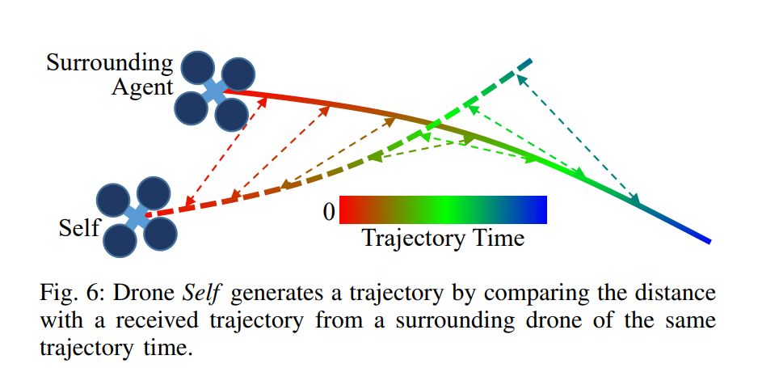
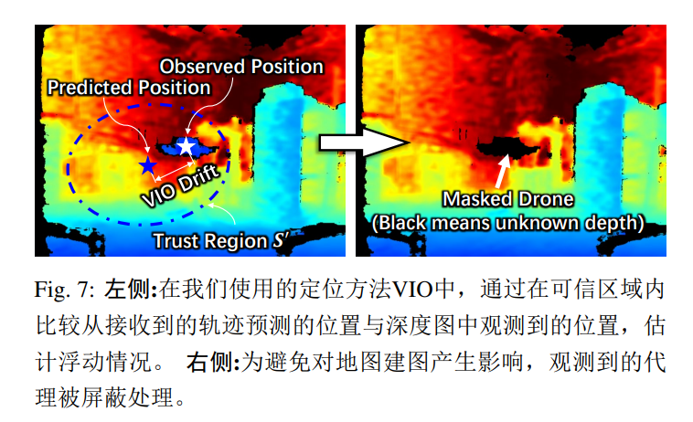
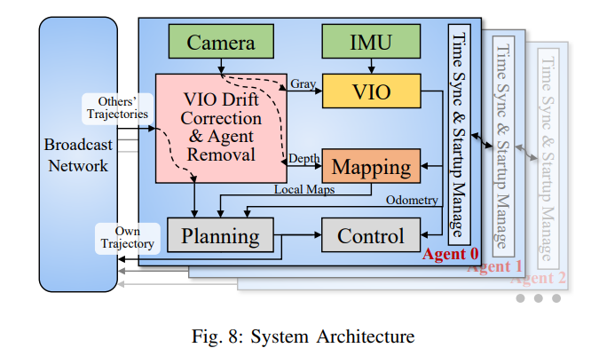
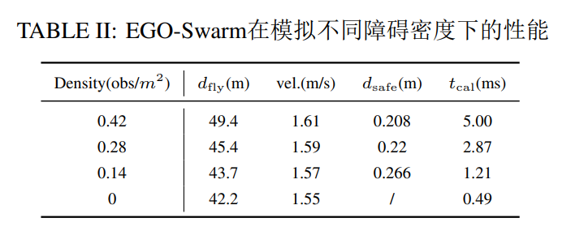
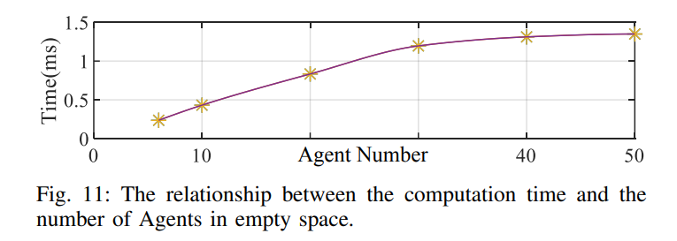
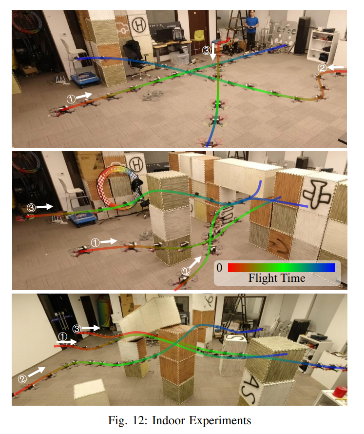
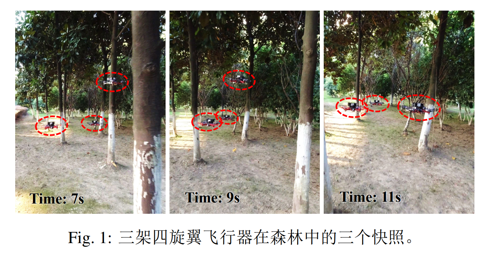

# EGO-Swarm-21

本文提出了一种去中心化的、异步的系统的解决方案，用于仅利用机载资源在障碍物丰富的未知场景中实现`多机器人自主导航`。规划系统是在`基于梯度的局部规划框架`下制定的，通过将`碰撞风险`表述为`非线性优化问题的惩罚`来避免碰撞。为了提高鲁棒性并摆脱局部最小值，我们采用了一种`轻量级拓扑轨迹生成方法`。然后，智能体（Agent）利用`不可靠的轨迹共享网络`，在几毫秒内生成安全、平滑和动态可行的轨迹。通过使用深度图像中的`智能体检测`来纠正智能体之间的`相对定位漂移`。我们的方法在模拟和实际实验中都得到了验证。源代码已发布，供社区参考。

- nontriviality of obstacle parameterization 障碍物参数化的复杂性
- limited sensing range 有限的感知范围
- unreliable and bandwidth limited communication 不可靠和带宽有限的通信
- positioning drift caused by inconsistent localization 不一致定位引起的位置漂移

拓扑规划和互动避障

### 1 Introduction

四旋翼机的灵活性使得该机器能够在未知环境中进行单一机器自主导航，并在开放或已知领域中进行多机精确编队控制。然而，很少有工作同时结合这两者来展示能够在共享相同未知空间的四旋翼机群体中导航的真实系统，尤其是仅通过机载处理。部署多个四旋翼机在未知环境中存在的困难包括但不限于障碍物参数化的复杂性、有限的感知范围、不可靠和带宽有限的通信以及由不一致定位引起的位置漂移。一些相关工作，例如，推进了真实的四旋翼机群体能够避障的能力。然而，上述困难在大多数之前的工作中经常被忽略，在运动捕捉系统或纯粹模拟中，限制了它们算法在实践中的应用。

本文提出了一种系统性的解决方案，能够在存在上述困难的拥挤环境中对四旋翼机群体进行高性能行进。此外，它不需要外部定位和计算或预先构建的地图。所提出的系统名为$\textbf{EGO-Swarm}$，是我们先前工作 ESDF-free Gradient-based lOcal planner (EGO-Planner) 的扩展，为未知环境中单一四旋翼机的机载局部规划奠定了坚实的基础。该扩展包括两个部分，`拓扑规划`和`互动避障`。

如图 3 所示，非凸配置空间可能会导致不希望的行为，例如动力学不可行性或拥挤导航。因此，像拓扑规划这样的策略可以有助于摆脱局部最小值。基于 EGO-Planner 中的`碰撞成本公式`，前端拓扑路径搜索是隐含完成的，因此几乎不需要计算。

通过将群体碰撞的加权惩罚添加到目标函数中，实现了分散的互动避障。这个惩罚是通过将未来一段时间内的智能体分布与正在优化的轨迹进行比较来评估的。为了最小化数据传输并允许不可靠的通信，使用广播网络共享轨迹。而校正相对定位漂移（可以增加到半米），则是通过比较目击智能体的观测和轨迹评估的预测来进行。

- 拓扑规划：topological planning
- 互动避障：reciprocal collision avoidance

### 2 Related Works

#### A. Single Quadrotor Local Planning 单四旋翼飞行器局部规划

`基于梯度的运动规划`是四旋翼机器人局部规划的主流方法。基于开创性的研究 [4, 5]，这些研究将`局部规划问题`形式化为`无约束的非线性优化问题`，提出了一系列的工作 [6]–[10]。这些工作考虑了轨迹的平滑性、可行性和安全性，采用了多种参数化方法，包括多项式和 B 样条曲线。最近我们提出了一种名为 EGO-Planner 的单四旋翼导航系统 [3]，通过采用更紧凑的环境表示方法，进一步减少了计算时间。本文的研究即基于此工作。

[基于梯度的运动规划](https://www.wolai.com/mxLhzmyzFQNKnVoJ9sL9Zf "基于梯度的运动规划")

[EGO-Planner-20](https://www.wolai.com/uwzQfQmK9SDeUEfoC6Gq2h "EGO-Planner-20")

#### B. Topological Planning 拓扑规划

拓扑规划用于避免局部最小值。

基于复分析中的二维曲面同胚等价关系 [11]，Rosmann 等 [12]提出了一种在不同拓扑结构下使用 Voronoi 和基于采样的前端以及 TEB（Timed-Elastic-Bands）局部规划器 [13]作
为后端的轨迹规划方法。

然而，三维中的同胚等价关系要简单得多。为了捕捉到区别明显的有用路径，Jaillet 等 [14]构建了视觉变形路网，它包含了比同伦等价类的典型路径更丰富且更相关的信息。基于 [14]，Zhou 等 [15]通过提出一种有效的拓扑等价性检测实现了实时拓扑规划。我们进一步扩展了 EGO-Planner 以加速拓扑规划的前端部分。

#### C. Decentralized Drone Swarm 去中心化无人机集群&#xA;

去中心化方法已经在文献中提出，例如 [16]–[20]。速度障碍被用来保证点机器人 [16]、 全向性代理[17]和非全向性代理 [18]的无碰撞航迹。 Liu 等人
[21]提出了一种去中心化异步规划策略，用于避免静态/动态障碍物和车辆间碰撞。虽然这些算法通过仿真进行了验证，但未集成感知、建图和规划能力。实验结果在文献中已经展示 [19, 20]。 [19]实现了多车辆点对点转移而无需外部障碍物，而 [20]则依赖于专门的规划优先级。然而，这些算法均未在实地环境中实现全自主化。

### 3 IMPLICIT TOPOLOGICAL TRAJECTORY GENERATION OF GRADIENT-BASED LOCAL PLANNING&#xA;

基于梯度的局部规划隐式拓扑轨迹生成

本节首先介绍了我们之前关于 EGO-Planner 的工作\cite{zhou2020ego}，这是我们提出的群体系统的基础。 然后解释了所提出的拓扑规划策略。

#### A. An ESDF-Free Gradient-based local planner

作为基于梯度的局部规划器，EGO-Planner 将轨迹生成问题形式化为一个非线性优化问题，它在平滑度 $J_s$、碰撞 $J_c$、动态可行性 $J_d$ 和终端进度 $J_t$ 之间进行权衡。 优化问题的决策变量来自于控制点 $\mathbf{Q}$，这些控制点用于参数化轨迹的均匀 B-样条 $\mathbf{\Phi}$。问题定义如下：

$$
\min _{\mathbf{Q}} J_{\mathrm{EGO}}=\sum \lambda_{r} J_{r},
$$

其中 $r=\{s,c,d,t\}$，下标为$\lambda$表示相应的权重。 $J$ 的项可以分为两类：最小误差和软障碍约束。 最小误差项 $J_s$ 和$J_t$，通过最小化决策变量线性变换$L(\mathbf{Q})$与期望值 $\mathcal{D}$之间的总误差，被表示为

$$
J_{r}=\sum_{\mathbf{Q} \in \boldsymbol{\Phi}}\|L(\mathbf{Q})-\mathcal{D}\|_{n}^{n}
$$

软边界约束项 $J_c$ 和 $J_d$ 是惩罚决策变量超过特定阈值  $\mathcal{T}$ 的常见表达式。

$$
J_{r}=\sum_{\mathbf{Q} \in \boldsymbol{\Phi}}\left\{\begin{array}{cl}\left\|\frac{L(\mathbf{Q})-(\mathcal{T}-\epsilon)}{S}\right\|_{n}^{n} & L(\mathbf{Q})>(\mathcal{T}-\epsilon) \\ 0 & L(\mathbf{Q}) \leq(\mathcal{T}-\epsilon)\end{array}\right.
$$

其中，参数$S$，$n$和 $\epsilon$影响着单边约束近似的准确度，如\cite{rosmann2012trajectory}所述。 变换$L(\cdot)$和参数根据惩罚类型选择。 由于篇幅有限，在此处省略了$L(\cdot)$的具体形式，可在\cite{zhou2020ego}中找到。

在 EGO-Planner 中，我们提出了一种新颖的障碍物距离估计方法，该方法根据每个 $\mathbf{Q}$独立拥有的环境信息进行参数化。 由若干 $\{\mathbf{p},\mathbf{v}\}$对参数化的信息高度抽象自周围障碍物，其中 $\mathbf{p}$表示障碍物表面上的锚点， $\mathbf{v}$表示从内部指向外部的安全方向，如图 \ref{pic:a*p_v_pair} 所示。 然后，第 $i$ 个控制点 $\mathbf{Q}_i$到第$j$个障碍物的障碍物距离$d*{ij}$被定义为

TODO

$\{\mathbf{p},\mathbf{v}\}$ 对的生成和轨迹优化过程如图 \ref{pic:a\*p_v_pair} 和  \ref{pic:final_traj}所示。 首先，给出一个简单的初始轨迹 $\mathbf{\Phi}$ ，不考虑碰撞。 然后，搜索连接碰撞段两端的安全路径 $\mathbf{\Gamma}$。 然后，从$\mathbf{\Phi}$到 $\mathbf{\Gamma}$ 生成向量 $\mathbf{v}$ ，并在障碍物表面定义 $\mathbf{p}$ 。 通过生成的 $\{\mathbf{p},\mathbf{v}\}$ 对，规划器最大化 $d*{ij}$ 并返回优化的轨迹。 由于文章长度有限，我们只提供了 EGO-Planner 基本思想的简化描述。 详细解释可参见\cite{zhou2020ego}。

#### B. Implicit Topological Trajectory Generation

分析\cite{jaillet2008path, zhou2020robust}发现，广泛使用的同伦概念无法很好地捕捉三维情况下的候选轨迹，如图\ref{pic:topo_relation}所示。因此，Jaillet 等人\cite{jaillet2008path}提出了在三维空间中更有用的关系，称为可见性变形（VD-visibility deformation），而 Zhou 等人\cite{zhou2020robust}进一步提取了 VD 的一个子集，称为均匀可见性变形（UVD-uniform visibility deformation），这使得实时操作成为可能。然而，本文仍然沿用之前的研究中使用的术语“拓扑规划”，以避免歧义。满足 UVD 的轨迹被认为是同胚的。\cite{zhou2020robust}中定义的 UVD 为：

定义 1：

两条轨迹  $\tau_1(s)$、 $\tau_2(s)$，其参数为 $s\in \left[0,1\right]$，且满足  $\tau_1(0) = \tau_2(0)$、 $\tau_1(1) = \tau_2(1)$ 的条件，如果对于所有的 $s$，线段  $\tau_1(s) \tau_2(s)$ 没有碰撞，则属于相同的 UVD 类别。

传统的拓扑规划方法 \cite{jaillet2008path, rosmann2012trajectory, rosmann2017integrated, zhou2020robust} 主要由拓扑不同的路径搜索和后端优化组成，主要关注在拓扑上不同的同伦中寻找多个初始路径。 与这些方法不同，所提出的方法通过将  $\mathbf{v}$ 反转为  $\mathbf{v}_{new} := -\mathbf{v}$，在不同方向上构建距离场。 然后，一个搜索过程在障碍物表面上沿着 $\mathbf{v}_{new}$ 确定一个新的锚点 $\mathbf{p}_{new}$，如图\ref{pic:multi\*p_v} 所示。 它们构成了新的一对 $\{\mathbf{p}*{new}, \mathbf{v}_{new}\}$，导致了一个不同的局部极小值。 需要注意的是，没有采用明确的路径搜索，但是任何经过 $\mathbf{p}$ 和 $\mathbf{p}_{new}$ 的路径对应着 Def.\ref{def:UVD} 在这两个点上的违反。 随后，不同的轨迹在不同的线程中并行进行优化，如图 4.d 所示。 执行成本最低的轨迹。

### 4 无人机集群导航

#### A. Reciprocal Collision Avoidance 互相避免碰撞

设$t$时刻第$k$个代理在$K$个代理中的位置状态为$x_k(t) \in \mathcal{X} \subset \mathbb{R}^3$。 $\mathcal{X}_k^{free}(t) \subset \mathcal{X}$ 是考虑其他代理存在时代理$k$状态空间中的自由区域。 因此，$\mathcal{X}_k^{free}(t) := \mathcal{X} \backslash \{ i \in \mathbb{Z} \backslash k, i \leq K | x_i(t)\}$，并且对于$\mathbf{\Phi}_k$的定义域中的任何$t$，$\mathbf{\Phi}_k(t) \in \mathcal{X}_k^{free}(t)$，如图 6 所示。 与\cite{liu2017search}不同，这里忽略了已在 Sec.III-A 中处理的障碍物和动态约束。

与障碍物碰撞和动态不可行性的惩罚类似，我们为代理$k$的群体避碰制定了惩罚函数$J_{w,k}$，作为软约束。

$$
\begin{array}{l}d_{k, i}(t)=\left\|\mathbf{E}^{1 / 2}\left[\boldsymbol{\Phi}_{k}(t)-\boldsymbol{\Phi}_{i}(t)\right]\right\|-(\mathcal{C}+\epsilon) \\\end{array}
$$

其中，$i \in \mathbb{Z} \backslash k, i \leq K$ ，$t_s$ 和 $t_e$ 是轨迹 $\mathbf{\Phi}_k(t)$ 时间跨度内的全局起始时间和结束时间。 $\mathcal{C}$ 是用户定义的代理间隙。 $\mathbf{E}:=\rm{diag}(1,1,1/c), c>1$ 将欧式距离转换为具有较短主轴的椭圆距离，以减轻下冲风险。 将加权项 $J_{w,k}$ 添加到方程(1)中，得到每个代理的总优化问题。

$$
\min _{\mathbf{Q}} J=J_{\mathrm{EGO}}+\lambda_{w} J_{w}.
$$

任何包含从决策变量到轨迹上点的映射的轨迹参数化方法都可以应用于公式（\ref{equ:swarm_collision}）。 本文使用$p_b$阶均匀 B 样条对轨迹进行参数化，这使得位置评估具有矩阵表示\cite{zhou2019robust}。

$$
\begin{array}{l}\boldsymbol{\Phi}(t)=\mathbf{s}(t)^{\top} \mathbf{M}_{p_{b}+1} \mathbf{q}_{m} \\ \mathbf{s}(t)=\left[\begin{array}{lllll}1 & s(t) & s^{2}(t) & \cdots & s^{p_{b}}(t)\end{array}\right]^{\top} \\ \mathbf{q}_{m}=\left[\begin{array}{lllll}\mathbf{Q}_{m-p_{b}} & \mathbf{Q}_{m-p_{b}+1} & \mathbf{Q}_{m-p_{b}+2} & \cdots & \mathbf{Q}_{m}\end{array}\right]^{\top} \\\end{array}
$$

其中$\mathbf{M}_{p_b+1}$是由$p_b$确定的常数矩阵，当$t$属于节点跨度$(t_m, t_{m+1}]$时，$s(t)=(t-t_m)/\triangle t$。

#### B. Localization Drift Compensation 定位偏移补偿

作为个体在未知环境中的定位（没有可靠的高频环路闭合），在飞行过程中漂移不断积累。 Xu 等人 \cite{xu2020decentralized} 提出了一种基于额外 UWB 距离测量的航空群体状态估计方法，并实现了准确的协同定位。 然而，我们更关注穿越充满障碍的环境，并且必须为其他应用程序保留计算和通信资源。

Therefore, inspired by \cite{xu2020decentralized}, a simplified and lightweight relative drift estimation method is proposed by comparing the predicted position evaluated from received agents' trajectories and the measured positions from depth images of witnessed agents.&#x20;

因此，在 \cite{xu2020decentralized} 的启发下，通过比较`从接收到的代理轨迹评估的预测位置`与`目击代理深度图像中测量位置`，提出了一种简化和轻量级的相对漂移估计方法。 当轨迹跟踪误差可以忽略不计，并且可能发生碰撞的任何两个代理中至少有一台能看到另一台时，该策略生效。 因此，我们使用 \cite{MelKum1105} 中的控制器进行精确跟踪，并使用广角相机来降低失去代理的可能性。

消除漂移的过程如下。 在评估代理$i$的当前位置$\mathbf{\Phi}_i(t_{now})$后，确定一个以$\mathbf{\Phi}_i(t_{now})$为中心，半径为$\mathcal{R}$的`球形信任区域`$\mathcal{S} \subset \mathbb{R}^3$，其中$\mathcal{R}$是一个经验参数，表示从实验中估计的典型漂移的上界。 然后，将$\mathcal{S}$映射到当前捕获的深度图像，即满足的区域$\mathcal{S'} \subset \mathbb{R}^2$。

$$
z\left[\begin{array}{ll}\mathbf{s}^{\prime}{ }^{\top} & 1\end{array}\right]^{\top}=\mathbf{K} \mathbf{T}_{\mathrm{w}}^{\mathrm{c}}\left[\begin{array}{ll}\mathbf{s}^{\top} & 1\end{array}\right]^{\top},
$$

其中$\mathbf{s'} \in \mathcal{S'}$，$\mathbf{s} \in \mathcal{S}$，$\mathbf{K}$和$\mathbf{T}^{\rm{c}}_{\rm{w}}$是相机的内参和外参矩阵，$z$是${s}$沿主光轴偏离光学中心的偏差。 $\mathcal{S'}$是一个需要进行复杂计算才能得到的椭圆锥曲线。 因此，我们采用了一个近似的轴对齐椭圆$\mathcal{\bar{S}'}$来代替精确的$\mathcal{S'}$。 精确定义信赖区域并不是必要的，因为它只是一个经验区域。

然后我们将$\mathcal{\bar{S}'}$中的每个点投影到`世界坐标系`，并收集属于$\mathcal{S}$的点，这样得到一个点簇$\mathcal{P} \subset \mathcal{S}$。 然后，代理观测的位置$\mathbf{P}$被视为$\mathcal{P}$的中心（第一原始矩-first raw moment）。

$$
\mathbf{P}=\mu_{1}^{\prime}(\mathcal{P}).
$$

如果$\mathcal{P}$仅包含对应代理的观测而没有任何无关的物体，则等式（\ref{equ:moment}）成立，但这不能保证。 然而，由于每个代理都对邻近物体有间隔的轨迹规划，等式（\ref{equ:moment}）在大多数时间内成立。 为了改进代理检测的鲁棒性，还添加了其他条件，如像素数目、$\mathcal{P}$的二阶中心矩，当前测量与先前测量之间的差异等。 更严格的标准会增加误识率，但由于定位漂移变化缓慢，这是无害的。 最后，$\mathbf{\Phi}_i(t_{now})$和$\mathbf{P}$之间的误差被送入一个滤波器，然后获得估计的漂移。

#### C. Agent Removal from Depth Images 从深度图中删除代理

我们使用占据`栅格地图`来存储静态障碍物，并使用深度图像进行地图融合。 移动代理在第\ref{sec:Reciprocal_Collision_Avoidance}节中得到处理。 因此，在地图构建中无需记录移动代理并将其视为障碍物，甚至会产生不必要的干扰。 为了消除移动物体的影响，我们在第\ref{sec:compensate_localization_drafting}节中通过遮罩和移除检测到的代理的像素从深度图像中剔除，如图 7 所示。 除此之外，遮挡了大部分视野的移动物体也会对视觉惯性里程计（VIO）产生干扰。 因此，灰度图像上的代理也会通过相应深度图像的相同遮罩进行移除。 这里使用的代理检测标准较为宽松，因为误判的正样本比误判的负样本更为有害。

### 5 System Architecture

系统架构如图 8 所示，其中包含了单个代理和多 Agent 通信系统的详细架构。

#### A. Navigation System of A Single Agent

单一智能体系统，包括硬件和软件设置，基于我们先前的工作`EGO-Planner` \cite{zhou2020ego}，增加了一个模块来补偿 VIO 漂移并在图像中去除被观察到的智能体。 对于未知环境中的轨迹生成，使用本地规划器。 当当前轨迹与新发现的障碍物发生碰撞或智能体接近当前轨迹的结束时，激活规划。

#### B. Communication Framework

系统由两个网络连接，即共享轨迹的广播网络和同步时间戳以及管理顺序启动的链网络。

1. Broadcast Network 广播网络：

一旦一个 agent 生成了一个新的无碰撞轨迹，它会立即广播给所有的 agent。 其他 agent 接收并存储这个轨迹，以便在必要时为自己生成安全轨迹。 这种闭环策略在网络连接稳定且延迟可忽略的理想情况下能正常工作。 然而，在实践中不能保证这一点。 因此，我们提出了两种方法来减少碰撞的可能性。

首先，在网络容量下以给定频率广播一个轨迹。 这不会引起计算负担，因为典型的轨迹包含 3D 航点和其他参数，大小小于 0.5KB。 相比之下，现代无线网络如蓝牙\footnote{[https://www.bluetooth.com/](https://www.bluetooth.com/ "https://www.bluetooth.com/")}可以实现超过 1Mbps 的速度。 其次，每个 agent 在从广播网络接收到轨迹后立即检查碰撞，如果发现潜在碰撞，就会生成一个新的无碰撞轨迹。 这一策略可以解决多个 agent 在很短的时间内生成轨迹，而没有接收到其他 agent 的轨迹的问题，这是由于延迟或数据包丢失造成的。

此外，考虑到 agent 数量的增加会导致计算复杂度的增加。 在规划之前，每个 agent 将其当前位置与接收到的周围 agent 的轨迹进行比较，任何超出规划范围的轨迹将被忽略。

2）Chain Network 链式网络：

一个基于连接的稳定链网络被用于时间戳同步和系统启动管理。 在系统启动时，代理生成预定义顺序的轨迹。 每个代理通过链网络在收到优先级更高的代理的轨迹后生成初始轨迹。 这种策略避免了在系统启动过程中由于同时生成轨迹而引起的混乱，因为代理在那时没有其他轨迹的信息。

### 6 基准测试

在模拟中，使用 i7-9700KF CPU 进行基准比较。对于参数设置，规划视距设置为 7.5m。$\lambda_s=1.0,~\lambda_c=\lambda_w=\lambda_t=0.5,~\lambda_d=0.1$。地图分辨率为 0.1m。重新规划每秒触发一次或者预测到碰撞时触发。这个设置在模拟和真实世界实验中都被采用。

#### A. Topological Planning&#xD;

我们将所建议的 EGO-Swarm 与 Fast-Planner\cite{zhou2020robust}在候选轨迹数和前端拓扑路径搜索的计算时间方面的拓扑规划性能进行比较。 如图 9 所示，EGO-Swarm 发现的候选轨迹较少，这意味着找到全局最优解的概率较低，但比\cite{zhou2020robust}快 100 倍。 由于 Fast-Planner 通过 PRM\cite{kavraki1996probabilistic}图搜索、路径缩短和路径修剪来找到拓扑上不同的路径，这些方法耗时较长但自由度较高，与所提出的隐式拓扑路径搜索方法相比。

#### B. Swarm Planning

1. In Empty Space 空地

我们将提出的方法与 DMPC\cite{luis2019trajectory}，ORCA\cite{van2011reciprocalnbody}和 RBP\cite{park2020efficient}进行比较，比较的指标包括飞行距离($d_{\rm{fly}}$)，飞行时间($t_{\rm{fly}}$)，每个机器人的碰撞次数和计算时间($t_{\rm{cal}}$)。 每个比较的方法都使用默认参数，除了最大速度和加速度。 如图\ref{pic:multi*comp}所示，八个机器人在一个圆圈上进行交换转换。 Tab.\ref{tab:plan_cmp}中的结果是所有机器人的平均值。 $t*{\rm{cal}}$用' \*'表示，因为我们记录的离线方法 DMPC 和 RBP 的计算时间是计划所有机器人整个轨迹的总时间，而对于 ORCA 和 EGO-Swarm 来说，它是每个机器人的本地重新规划时间。

Tab.\ref{tab:plan_cmp}和图 10 表明，RBP 倾向于生成安全但保守的轨迹，因为构建凸相对安全飞行走廊 \cite{park2020efficient}显著压缩了解空间。&#x20;

DMPC 设计用于分布式部署。 然而，在真实世界的应用中无法保证准确和高频的姿态通信。&#x20;

高效的规则使 ORCA 更新速度快。 然而，使用速度作为控制命令使其不适用于四旋翼等三阶系统。 碰撞风险也限制了它的应用。&#x20;

相比之下，我们提出的方法生成了最短的无碰撞、非保守性的轨迹，并具有快速计算的特点。 因此，它可以实现四旋翼的实时应用。

2. In Obstacle-rich Environments 在障碍物密集的环境

我们模拟了十架无人机以每秒 2 米的速度限制从地图的一边飞到另一边，四旋翼半径为 0.2 米。 图 2 是 0.42 个障碍物/$m^2$的模拟快照。 每个代理单独感知环境，并且构建的局部地图以不同的颜色显示。&#x20;

结果总结在表 2 中，其中$d_{\rm{fly}}$是平均飞行距离，$d_{\rm{safe}}$是飞行测试期间与障碍物的最近距离。 设计了一种逆向点对点转换，使得在地图中心周围不可避免地进行相互避碰。 在这种情景下，属于群体的每个代理都成功地规划了平稳且安全的轨迹。

3. Scalability Analysis 可扩展性分析

我们在一个情景中评估计算性能，其中排列成一条直线的代理飞向随机目标点，距离 50 米。正如图 11 所示，在第 5.B.1 节的按需碰撞检查策略的影响下，随着代理数量的增加，时间复杂度逐渐趋于平稳。

### 7 Real-World exp

1）Indoor

在室内实验中，速度限制为 1.5 米/秒，如图 12 所示。 最上方的图显示了三架四旋翼无人机进行循环交换，并进行互相避碰。 在中间的图中，四旋翼无人机成功依次通过一个狭窄的门。 在底部的图中，环境更加拥挤。 三架四旋翼无人机成功穿越了这个环境。

在一个树木间距大约为 2 米的森林中，如图 1 所示，三个四旋翼无人机一起从森林中起飞，并成功到达森林外的目标位置。 速度限制设定为 1.5 米/秒。 为进一步强调相互避让，我们将目标位置相对于起始位置的顺序颠倒，使得相互避让成为不可避免的，就像我们在第\ref{sec:In_Obstacle-rich_Environments}节中所做的那样。 有关实验的更多信息，请参考我们在 github 上的代码，并观看我们附上的视频\footnote{[https://github.com/ZJU-FAST-Lab/ego-planner-swarm](https://github.com/ZJU-FAST-Lab/ego-planner-swarm "https://github.com/ZJU-FAST-Lab/ego-planner-swarm")}。

### 8 总结

本文提出了一种在未知杂乱环境中利用仅限于机载资源的多机器人导航的系统性解决方案。 基准比较表明其计算时间短且轨迹质量高。 实际世界实验验证了其鲁棒性和效率
