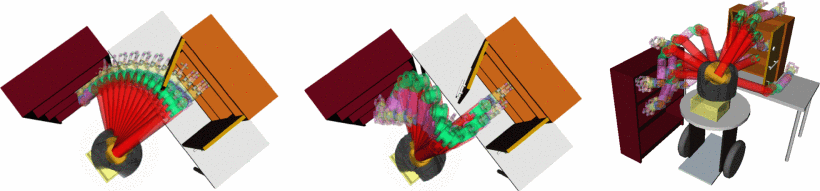

# 基于梯度的运动规划

## [CHOMP](https://ieeexplore.ieee.org/document/5152817)

- CHOMP: Gradient Optimization Techniques for Efficient Motion Planning
- 2009 IEEE International Conference on Robotics and Automation
- Covariant Hamiltonian Optimization for Motion Planning (CHOMP)
  - 运动规划的协变哈密顿优化

摘要：

现有的高维运动规划算法在某种程度上既过度又不足。在障碍物稀疏分布的领域中，基于采样的规划器用于导航“狭窄通道”的启发式方法可能过于复杂；此外，还需要进一步后处理，以去除这些规划器生成路径中的颠簸或多余的动作。在本文中，我们介绍了 CHOMP，一种使用 `协变梯度技术` covariant gradient techniques 持续优化路径的新方法，用于提高采样轨迹的质量。我们的优化技术既可以优化高阶动态性，又可以相对于以前的路径优化策略在更广泛的输入路径上收敛。特别地，我们放宽了这些策略要求的输入路径上的无碰撞可行性先决条件。因此，CHOMP 可以用作许多实际规划查询中的独立运动规划器。我们演示了我们提议的方法在一个 6-DOF 机器臂的操纵规划以及在一个行走的四足机器人的轨迹生成中的有效性。

Left: the initial straight-line trajectory through configuration space. Middle: the final trajectory post optimization. Right: the 15 end point configurations used to create the 105 planning problems discussed in section III.

- CHOMP Algorithm
  - Covariant gradient descent 协变梯度下降
  - Understanding the update rule 理解更新规则
  - Obstacles and distance fields 障碍物和距离场
  - Defining an obstacle potential 定义潜在障碍
  - Smooth projection for joint limits 关节限制的平滑投影

### CHOMP

In this section, we present CHOMP, a new trajectory optimization procedure based on covariant gradient descent. An important theme throughout this exposition is the proper use of geometrical relations, particularly as they apply to inner products. This is a particularly important idea in differential geometry [8]. These considerations appear in three primary locations within our technique.

- First, we find that in order to encourage smoothness we must measure the size of an update to our hypothesis in terms of the amount of a particular dynamical quantity (such as total velocity or total acceleration) it adds to the trajectory.
- Second, measurements of obstacle costs should be taken in the workspace so as to correctly account for the geometrical relationship between the robot and the surrounding environment.
- And finally, the same geometrical considerations used to update a trajectory should be used when correcting any joint limit violations that may occur.
- Sections II-A, II-D, and II-E detail each of these points in turn.

在本节中，我们介绍 CHOMP，一种基于协变梯度下降的新轨迹优化程序。整个阐述的一个重要主题是几何关系的正确使用，特别是当它们应用于内积时。这是微分几何中一个特别重要的思想 [8] 。这些考虑因素出现在我们技术中的三个主要位置。

- 首先，我们发现，为了鼓励平滑性，我们必须根据添加到轨迹中的特定动态量（例如总速度或总加速度）的量来衡量假设更新的大小。
- 其次，应在工作空间中测量障碍物成本，以便正确考虑机器人与周围环境之间的几何关系。
- 最后，在纠正可能发生的任何关节限制违规时，应使用与更新轨迹相同的几何考虑因素。
- Sections II-A, II-D, 和 II-E 依次详细说明每一点。

#### Covariant gradient descent 协变梯度下降

我们使用两项对轨迹成本进行建模：障碍项 fobs ，衡量靠近障碍物的成本；和前一个术语 fprior ，它测量机器人的动态量，例如平滑度和加速度。我们一般假设 fprior 是独立于环境的。因此，我们的目标可以写成

$$
U(\xi) = f_{prior}(\xi) + f_{obs}(\xi)
$$

---

## Stomp

Stomp: Stochastic trajectory optimization for motion planning

摘要 — 我们提出了一种使用 `随机轨迹优化框架`进行运动规划的新方法。此方法依赖于生成噪声轨迹来探索初始（可能不可行）轨迹周围的空间，然后结合它们产生一个成本更低的更新轨迹。在每次迭代中，基于障碍和平滑性成本的组合优化一个成本函数。我们使用的特定优化算法不需要梯度信息，因此可以在成本函数中包括可能无法获得导数的一般成本（例如，对应于约束和电机扭矩的成本）。我们在模拟和移动操作系统上展示了这种方法，用于无约束和受约束的任务。我们实验性地显示，STOMP 的随机性使其能够克服 CHOMP 这样的基于梯度的方法可能陷入的局部最小值。

---

Continuous-time trajectory optimization for online uav replanning

Realtime trajectory replanning for mavs using uniform b-splines and a 3d circular buffer

An efficient b-spline-based kinodynamic replanning framework for quadrotors

Robust and efficient quadrotor trajectory generation for fast autonomous flight

Raptor: Robust and perception aware trajectory replanning for quadrotor fast flight
