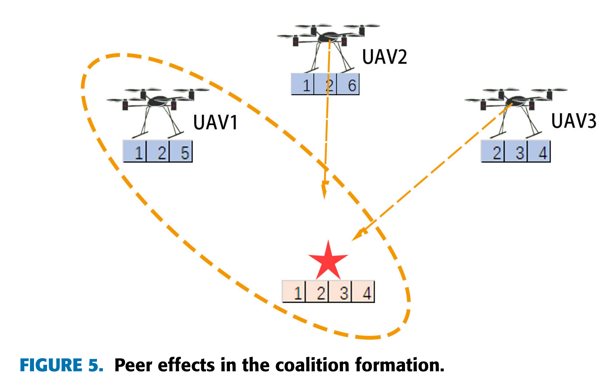

# Energy Efficient Task Cooperation for Multi-UAV Networks: A Coalition Formation Game Approach

多无人机网络的节能任务合作：联盟形成博弈方法

- [ieeexplore](https://ieeexplore.ieee.org/document/9165752)
- Published in: IEEE Access ( Volume: 8)

 

- Heyu Luan; Yitao Xu; Dianxiong Liu; Zhiyong Du; Huiming Qian; Xiaodu Liu
- 鸾和雨;徐一涛;刘殿雄;杜志勇;钱慧明;刘晓都
  - 1 College of Communications Engineering, Army of PLA, Nanjing 210000, China
  - 2 Academy of Military Science, Beijing 100036, China
  - 3 College of Information and Communication, National University of Defense Technology, Wuhan 430010, China
  - 4 PLA 32369 Troops, Beijing 100000, China
- 2020.08.12
- 38 citations

## Abstract:

In this paper, we study the multi-task cooperation problem for unmanned aerial vehicle (UAV) swarms, where the UAV energy consumption is taken into consideration during location scheduling and task implementation. One task may need the cooperation of several UAVs with specific capabilities. To avoid unreasonable task allocation, we quantify the mission properties of UAVs and task areas. We comprehensively consider the overlapping and complementary relationship of the UAV's task types, so that UAVs can form corresponding collective execution tasks according to the task attributes. Based on the coalition game theory, we model the distributed task assignment problem of UAVs as a coalition formation game (CFG). We propose a task allocation algorithm, and then prove that it can achieve the joint optimization of energy and task completion by decision-making of UAVs in finite iterations. With the equilibrium properties of coalition formation in UAV networks, we further optimize the position of UAVs to minimize the network energy consumption. Simulation results verify that the proposed method can reduce the flight loss with high task completion degree.

在本文中，我们研究了无人机 （UAV） 集群的多任务协作问题，其中在位置调度和任务实施过程中考虑了无人机能耗。一项任务可能需要几架具有特定能力的无人机的合作。为避免不合理的任务分配，我们对无人机和任务区的任务属性进行了量化。我们综合考虑了无人机任务类型的重叠和互补关系，使无人机能够根据任务属性形成相应的集体执行任务。基于联盟博弈论，我们将无人机的分布式任务分配问题建模为联盟形成博弈 （CFG）。我们提出了一种任务分配算法，进而证明它可以通过无人机的有限迭代决策来实现能量的联合优化和任务完成。利用无人机网络中联盟形成的均衡特性，我们进一步优化了无人机的位置，以最大限度地降低网络能耗。仿真结果验证了所提方法能够在任务完成度高的情况下降低飞行损失。

## Introduction

Therefore, we propose an **energy-efficient task cooperation scheme for heterogeneous multi-UAV** in view of cooperative task assignment and energy optimization of heterogeneous UAVs.

- Firstly, a **task relationship model** is proposed to quantify the task attribute of ground task areas, the capabilities of UAVs in terms of task types they can run, in order to define a general satisfaction function to quantify the task completion degree.
- Then, the **energy consumption model** is proposed to account for the energy loss during flight and hovering stages.

因此，从异构无人机协同任务分配和能量优化的角度，我们提出一种**异构多无人机节能任务协作方案**。首先，提出**任务关系模型**来量化地面任务区域的任务属性、无人机可运行的任务类型的能力，从而定义通用的满意度函数来量化任务完成程度。然后，提出了**能量消耗模型**来解释飞行和悬停阶段的能量损失。

To achieve automatic and self-organizing task cooperation with energy constraints, we establish a distributed task assignment model for UAVs based on the coalition formation game (CFG) [14]–​[17]. Aiming at characteristics of cooperation and complementary relationships among UAVs brought by location and mission attributes, we develop the coalition formation game with the peer effects among UAVs [18]–​[20]. We propose the coalition formation algorithm based on cooperation rule, where coalition merge rules and coalition split rules are designed. Moreover, we prove the convergence of the algorithm based on the potential game theory [21]–​[23]. The contributions of this paper are summarized as follows:

为了实现能量约束下的自动自组织任务协作，建立了基于联盟形成博弈（CFG）的无人机分布式任务分配模型 [14] –​ [17] 。针对位置和任务属性带来的无人机间合作和互补关系的特点，开发了无人机间同伴效应的联盟形成博弈 [18] –​ [20] 。我们提出了基于合作规则的联盟形成算法，设计了联盟合并规则和联盟分裂规则。并基于势博弈理论证明了算法的收敛性 [21] –​ [23] 。本文的贡献总结如下：

- We study the problem of UAV assignment in multi-UAV and multi-task scenario. The UAVs’ task types, energy loss and the time of performing tasks are considered to improve the task completion degree in the task area while reducing the energy loss of UAVs.
- 我们研究多无人机、多任务场景下的无人机分配问题。综合考虑无人机的任务类型、能量损耗以及执行任务的时间，在降低无人机能量损耗的同时，提高任务区域的任务完成度。

- We define a quantitative amount for each type of task. The definition of task completion degree includes the task performing time and the implementation of all types of tasks in the task areas.
- 我们为每种类型的任务定义了一个数量。任务完成度的定义包括任务执行时间和任务区域内各类任务的执行情况。

- The coalition formation game is applied to the task assignment scenario of UAVs, and a coalition formation algorithm based on cooperative rule is proposed. The overlapping and complementary relationships of UAVs’ tasks are considered, which can reduce the energy loss of the UAVs and improve the task completion degree in the task area.
- 将联盟形成博弈应用于无人机任务分配场景，提出一种基于合作规则的联盟形成算法。考虑无人机任务的重叠和互补关系，可以减少无人机的能量损失，提高任务区域内的任务完成度。

- With the equilibrium properties of coalition formation in UAV networks, we further optimize the position of UAVs within the task coverage to minimize the network energy consumption.
- 利用无人机网络中联盟形成的均衡特性，我们进一步优化无人机在任务覆盖范围内的位置，以最小化网络能耗。

### Related Work

#### 1) Coalition Formation Game Theory 联盟形成博弈论

This paper focuses on the problem of task cooperation and mutual influence among multiple UAVs. Because the game theory is an effective tool to solve the problem of resource optimization in distributed systems [24], [25], an appropriate coalition formation game was used in this paper to model the task assignment problem of UAVs.
本文重点研究多无人机之间的任务协作和相互影响问题。因为博弈论是解决分布式系统资源优化问题的有效工具 [24] , [25] ，本文使用适当的联盟形成博弈来模拟无人机的任务分配问题。

Coalition formation game can accurately and completely describe the cooperative relationships among users in sharing networks. In [16], the authors proposed a context-aware group buying mechanism to reduce users’ data costs based on the coalition formation game. In [26], coalition formation game theory is used to obtain a solution to a resource allocation problem for a team of UAVs prosecuting a target. In [27], the authors proposed a reputation-based mechanism for coalition formation aiming to complete the designated tasks with minimal resource utilization. In [28], the authors studied the data clustering scheme based on the coalition formation game to improve the data collection efficiency in UAV-enabled wireless sensor networks.
联盟形成博弈能够准确、完整地描述共享网络中用户之间的合作关系。在 [16] 论文中，作者提出了一种基于联盟形成博弈的情境感知团购机制，以降低用户的数据成本。在 [26] ，联盟形成博弈论用于获得无人机团队起诉目标的资源分配问题的解决方案。在 [27] ，作者提出了一种基于声誉的联盟形成机制，旨在以最小的资源利用率完成指定的任务。在 [28] ，作者研究了基于联盟形成博弈的数据聚类方案，以提高无人机无线传感器网络的数据收集效率。

Based on the existing work, an appropriate coalition formation game with peer effects is developed in this paper to model the task assignment problem of UAVs.
基于现有工作，本文开发了一种具有同伴效应的适当联盟形成博弈来模拟无人机的任务分配问题。

#### 2) Energy Consumption Model 能源消耗模型

The endurance and performance of UAV systems are fundamentally limited by the on-board energy, which is practically finite due to the aircraft’s size and weight constraints [29]. Thus, energy consumption should be an important concern for UAV task cooperation [30].

无人机系统的续航能力和性能从根本上受到机载能量的限制，而由于飞机的尺寸和重量限制，机载能量实际上是有限的 [29] 。因此，能源消耗应成为无人机任务协作的重要关注点 [30] 。

In [31], The authors investigated an uplink power control problem for UAV-assisted wireless communications. The flying altitude, antenna bandwidth and location of UAVs, as well as allocated bandwidth of ground terminals were jointly optimized to achieve good performance in uplink sum power saving. In [32], the authors considered the jointly optimizing user association, power control, computation capacity allocation, and location planning in a mobile edge computing network with multiple UAVs to minimize the total power effectively. In [33], the authors formulated the energy minimization problem by jointly optimizing the UAV trajectory and communication time allocation among ground nodes. In [34], the author considered the problem of high-efficiency coverage deployment of UAVs and controlled the launch power of UAVs to achieve the purpose of energy conservation. In [35], an efficient algorithm was proposed for maximizing the UAV’s energy efficiency with general constraints on the trajectory.

在 [31] ，作者研究了无人机辅助无线通信的上行链路功率控制问题。对无人机的飞行高度、天线带宽和位置以及地面终端的分配带宽进行联合优化，在上行总省电方面取得了良好的效果。在 [32] ，作者考虑了在具有多个无人机的移动边缘计算网络中联合优化用户关联、功率控制、计算能力分配和位置规划，以有效地最小化总功率。在 [33] ，作者通过联合优化无人机轨迹和地面节点之间的通信时间分配，提出了能量最小化问题。在 [34] 笔者考虑了无人机高效覆盖部署的问题，通过控制无人机的发射功率来达到节能的目的。在 [35] ，提出了一种有效的算法，用于在轨迹的一般约束下最大化无人机的能量效率。

In this paper, we take the energy consumption of UAVs as part of the optimization in the process of the task assignment, which is important for the energy efficiency of task execution.

本文将无人机的能耗作为任务分配过程中优化的一部分，这对于任务执行的能源效率具有重要意义。
