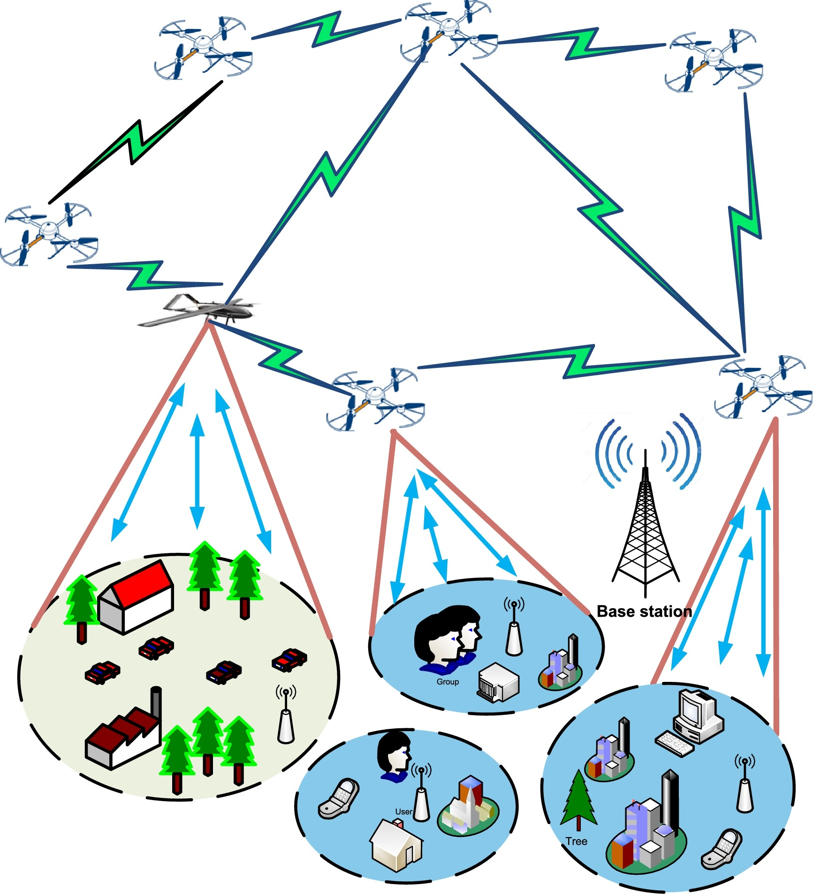
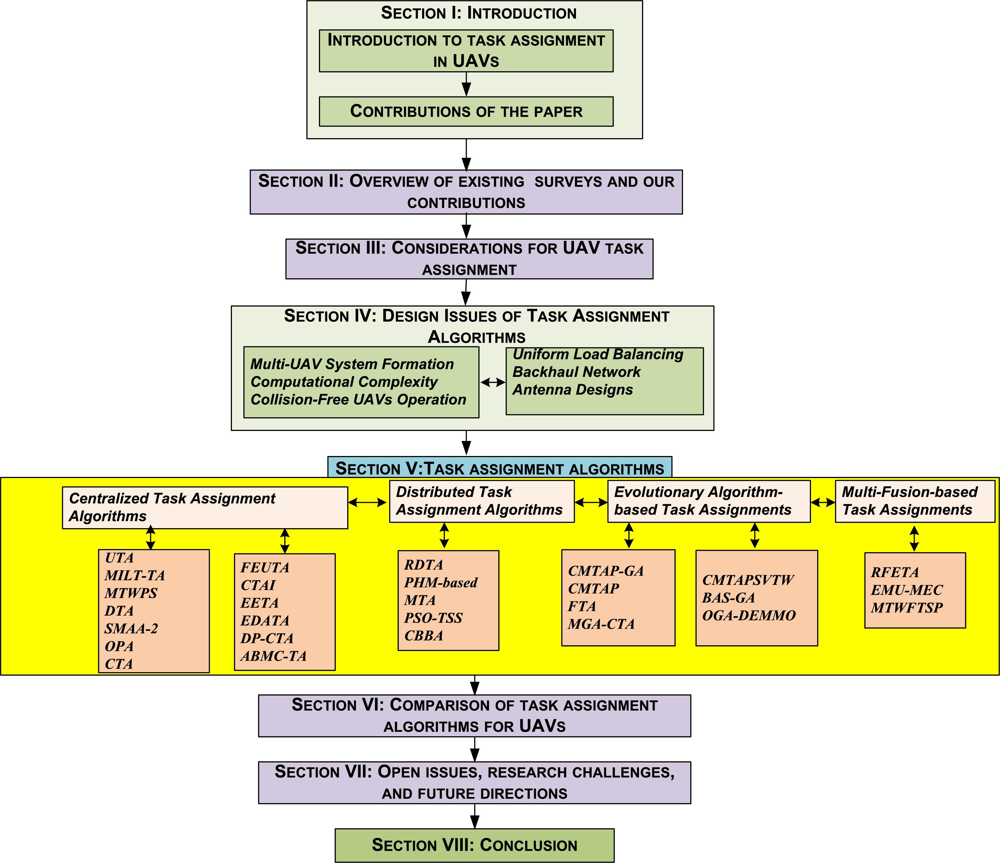
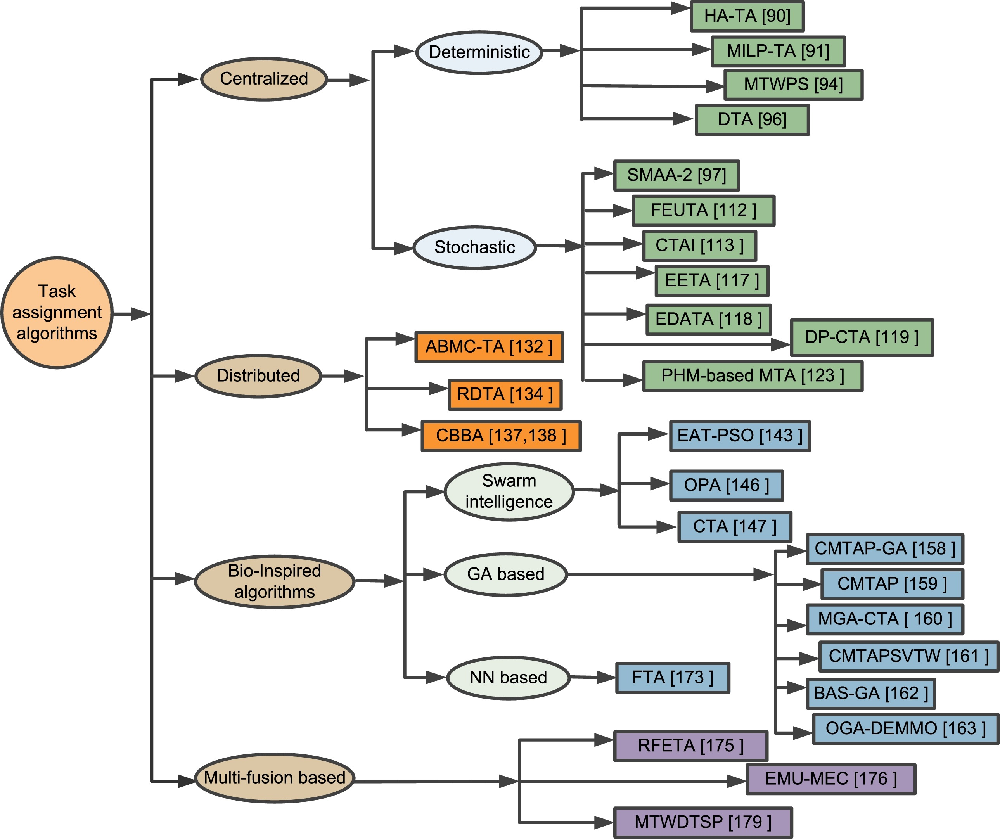
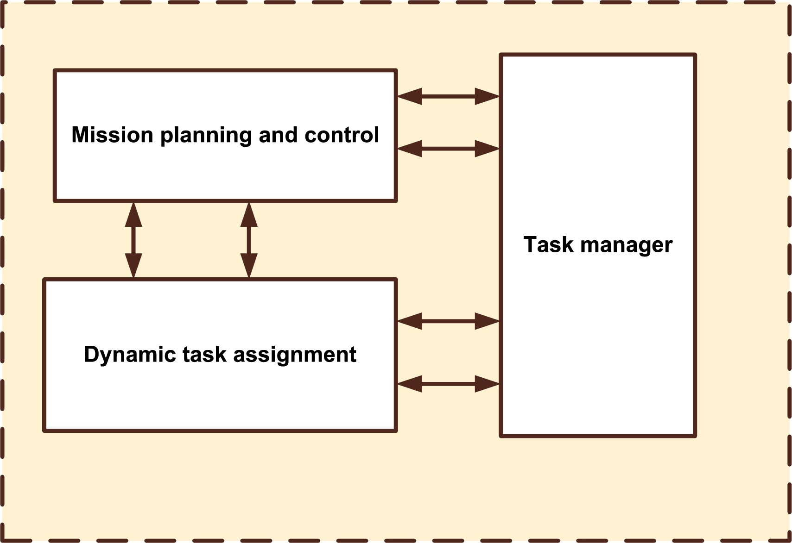
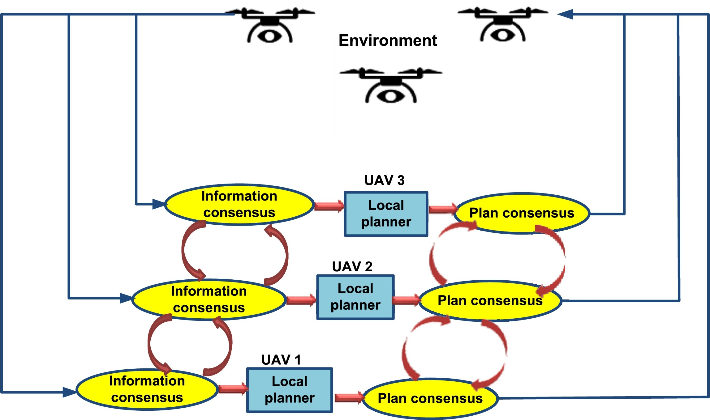
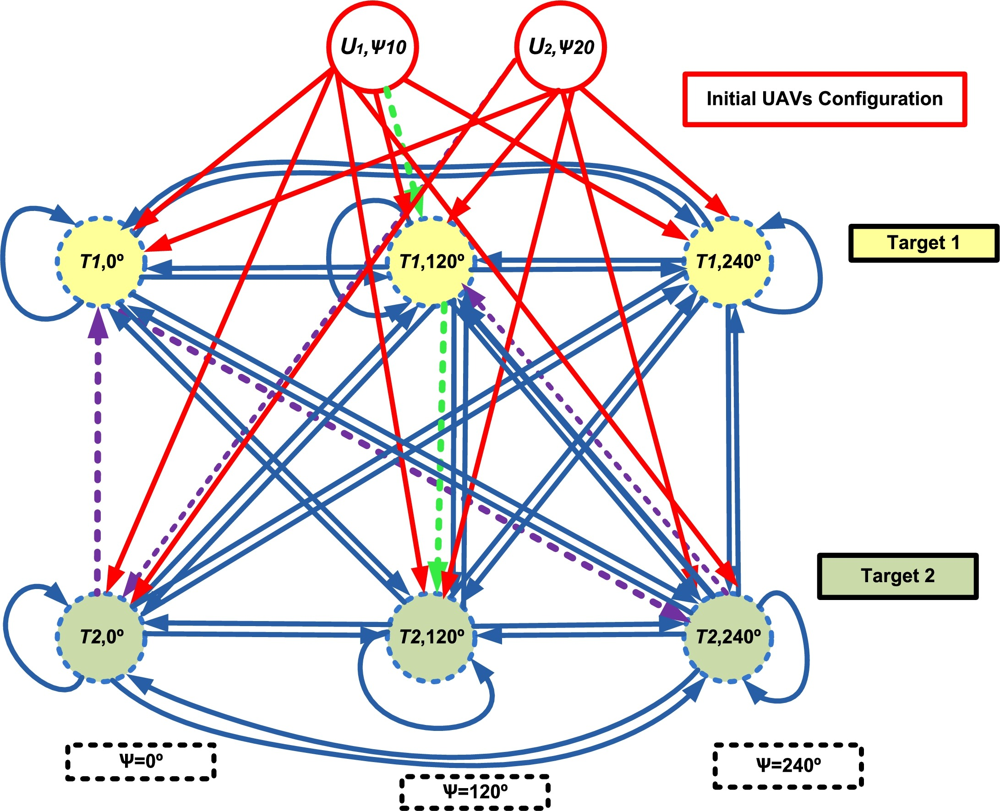
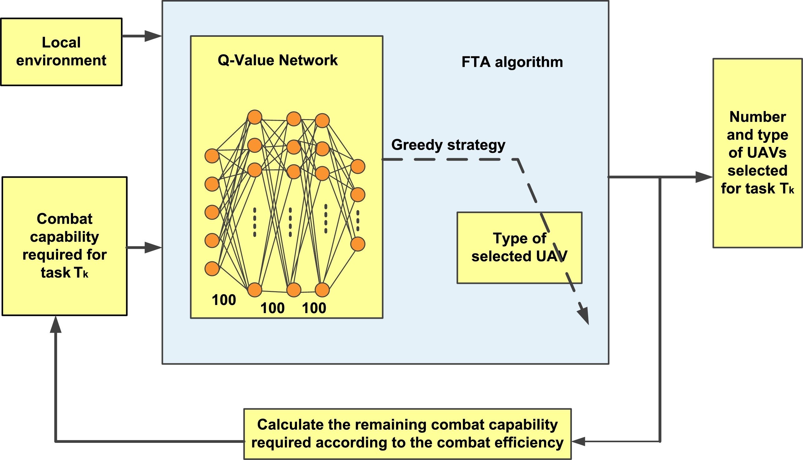

# Task assignment algorithms for unmanned aerial vehicle networks: A comprehensive survey 2022.06

Department of Computer Engineering, Chosun University, Gwangju 61452, South Korea
计算机工程学院，朝鲜大学，韩国光州 61452

- Vehicular Communications
- [sciencedirect](https://www.sciencedirect.com/science/article/pii/S221420962200016X?via%3Dihub)
- [doi](https://doi.org/10.1016/j.vehcom.2022.100469)

## Abstract 抽象的

Unmanned aerial vehicles (UAVs) have significant prospects in a plethora of public and civic spheres. Recently, UAVs have focused primarily on applications where human presence is either impossible or hazardous. A swarm of small UAVs can cooperatively complete operations more proficiently and economically than a single large UAV. However, many issues must be resolved before stable and reliable multi-UAV networks can be realized. Task assignment in fleets of UAVs is concerned with cooperative decision-making and control. UAVs possess various functional abilities and kinematic constraints while carrying limited resources onboard. UAVs are nominated to execute multiple sequential tasks supportively on numerous ground targets. The prime objective of task assignment is to minimalize the task accomplishment time and UAV energy consumption. To date, several task assignment algorithms have been designed for UAV networks, and they are comprehensively surveyed in this paper in terms of their main ideas, operational features, advantages, and limitations. These task assignment algorithms are then compared in terms of their significant characteristics and performance factors. To the best of the authors' knowledge, no survey on task assignment techniques for different UAV missions currently exists in the literature. We also discuss open issues and challenges and then suggest projections for task assignment algorithms concerning possible future directions.

无人机（UAV）在众多公共和公民领域具有广阔的前景。最近，无人机主要关注人类不可能存在或存在危险的应用。一群小型无人机可以比单个大型无人机更高效、更经济地协同完成行动。然而，要实现稳定可靠的多无人机网络，还必须解决许多问题。无人机机队的任务分配涉及协作决策和控制。无人机具有多种功能和运动学限制，但机载资源有限。无人机被指定在众多地面目标上执行多项连续任务。任务分配的首要目标是最小化任务完成时间和无人机能耗。迄今为止，已经设计了几种针对无人机网络的任务分配算法，本文对它们的主要思想、操作特点、优点和局限性进行了全面的综述。然后对这些任务分配算法的显着特征和性能因素进行比较。据作者所知，目前文献中还没有针对不同无人机任务的任务分配技术的调查。我们还讨论了悬而未决的问题和挑战，然后就有关未来可能方向的任务分配算法提出了预测。

Keywords 关键词

- Unmanned aerial vehicle; Multi-UAV networks; UAV autonomy; Task assignment; Task coordination; Heterogeneity;
- 无人机 多无人机网络 无人机自主性 任务分配 任务协调 异质性

1. Introduction
   1. Challanges
   2. Motivation
   3. Contribution of the study
   4. Organization of the paper
2. Overviw of existing surveys on UAVs and our contributions
3. Considerations fo UAV task assignment
   1. Single- and multi-UAV systems
   2. Classification of UAVs
   3. Background study
4. Design issues for task assignment algorithm
   1. Multi-UAV system formation
   2. Computational complexity
   3. Collision-free UAV operation
   4. Backhaul network
   5. Uniform load balancing
   6. Antenna designs
5. Task Assignment Algorithms
   1. Centralized task assignment algorithms
   2. Distributed task assignment algorithms
   3. Bio-inspired task assignment algorithms
6. Comparsion of task assignment algorithms for UAVs
7. Open issues, research challenges, and future directions
8. Conclusion

## 1. Introduction 1. 简介

The remarkable and prompt growth of unmanned aerial vehicles (UAVs) in many different applications has recently fascinated many researchers and operators. The incorporation of UAVs is noticeable in such applications, which are either dangerous or impossible for a human. UAVs can be deployed quickly and easily, possess high maneuverability, are cost-efficient, have the self-organizing ability, and are flexible and scalable. Hence, UAVs have received momentous consideration for civil and military applications. The applications of UAVs include but are not limited to emergency and crisis management [1], [2], [3], search and rescue operations in disastrous environments [4], [5], monitoring agricultural fields [6], post-disaster operations [7], remote sensing [8], [9], wildfire monitoring [10], traffic monitoring [11], freight transportation [12], and relay networks [13], [14], [15]. In the present day, UAVs have also shown wide use in pandemic environments to enforce social distancing [16], spread disinfectants in infected areas [17], carry testing kits and other medical supplies [18], and more. UAVs communication can be distinguished from other ad-hoc communication in the following ways: a) dynamic channel for air-to-air (A2A) and air-to-ground (A2G) propagations; b) spatial as well as temporal inconsistencies induced by high UAV mobility; c) shadowing effect due to design structure and rotation of UAV. UAVs of different sizes and specifications are available. Generally, single-UAV-based applications prefer large UAVs with higher abilities, while small UAVs are chosen for UAV formations and swarms. A multi-UAV operation scenario is illustrated in Fig. 1 and is expected to increase significantly in the future. As shown in the figure, several UAVs are assigned different tasks and are supposed to execute tasks with proper coordination with other UAVs.

无人机（UAV）在众多不同应用中的显著且迅速增长最近吸引了众多研究人员和操作者的兴趣。无人机在这些应用中的融入尤为明显，这些应用要么危险，要么对人类来说不可能。无人机可以快速、轻松地部署，具有高机动性，成本低廉，具有自组织能力，且灵活可扩展。因此，无人机在民用和军事应用中受到了极大的关注。无人机应用包括但不限于紧急和危机管理[1]、[2]、[3]、灾难环境中的搜救行动[4]、[5]、监测农田[6]、灾后行动[7]、遥感[8]、[9]、野火监测[10]、交通监控[11]、货物运输[12]和接力网络[13]、[14]、[15]。在当今时代，无人机在疫情环境中也显示出广泛的应用，以执行社交距离[16]、在感染区域喷洒消毒剂[17]、携带检测套件和其他医疗用品[18]等。

无人机通信可以通过以下方式与其他临时通信区分开来：
a）动态信道用于空对空（A2A）和空对地（A2G）传播；
b）由于高无人机移动性引起的时间和空间不一致性；
c）由于无人机设计结构和旋转产生的阴影效应。

不同尺寸和规格的无人机可供选择。通常，基于单架无人机的应用更倾向于选择能力更强的大型无人机，而小型无人机则用于无人机编队和集群。图 1 展示了多架无人机操作场景，预计未来将显著增加。如图所示，几架无人机被分配不同的任务，并应与其他无人机进行适当的协调以执行任务。

### 1.1. Challenges of UAV networks

1.1. 无人机网络的挑战
The progress made in microchip technology has helped widen the application range of UAVs [19]. Though the UAV network has been promising, some challenges need to be resolved for effective UAVs based on reliable networks. Significant research has been done in the literature that analyzes the challenges and prospects for successful UAVs operations. In [20], [21], a study focusing on the challenges faced by UAVs during deployment, interference, UAV-based relaying, regulations, energy consumption, collision avoidance, and security is made. Various challenges regarding spectral efficiency in multi-UAVs operations are reviewed in [22]. Different issues faced in UAV communication, i.e., routing, handover, and energy efficiency, are deliberated in [23]. Furthermore, some studies have focused on UAVs and UAV-based communications, and state-of-the-art works consider UAVs' particular domain or efficacy [24], [25]. UAV flights can be understood as several degrees of autonomy. Obtaining autonomy for UAVs is a complicated issue, and the complication level depends on different phases in the decision-making process and the necessary level of cooperation between UAVs [26], [27].

微芯片技术的进步有助于扩大无人机（UAVs）的应用范围[19]。尽管无人机网络前景广阔，但为了实现基于可靠网络的无人机有效运行，仍需解决一些挑战。文献中已对成功无人机操作的挑战和前景进行了大量研究。在[20]、[21]中，对无人机部署、干扰、基于无人机的中继、法规、能耗、避障和安全等方面面临的挑战进行了研究。在[22]中，回顾了多无人机操作中关于频谱效率的各种挑战。在[23]中，讨论了无人机通信中面临的不同问题，即路由、切换和能效。此外，一些研究专注于无人机及其基于无人机的通信，而最先进的工作则考虑了无人机特定的领域或功效[24]、[25]。无人机飞行可以理解为几个级别的自主性。为无人机获得自主性是一个复杂的问题，其复杂程度取决于决策过程中的不同阶段以及无人机之间必要的合作水平[26]、[27]。

The maximum cooperation level is essential for task assignment algorithms [28], [29], [30], where UAVs are expected to share information, allocate tasks amongst each other, and consign responsibilities with suitable timing and organization. Task assignment can be described as a graph theory problem and explained using deterministic search algorithms. Due to their computational complexity, traditional deterministic algorithms can handle only small and simple issues. Tasks of a heuristic nature can be solved, but suitable efficiency may not be achieved [31]. Proper communication and exchange of information among UAV groups can improve UAV competence to encounter performance necessities associated with the speedy and trustworthy implementation of tasks. Appropriate collaboration among UAVs is complex and very challenging to implement. An optimization algorithm that considers task superiority and synchronization, flightworthy trajectories, and other constraints of real-world scenarios are highly desired. Furthermore, UAVs differ in their operating abilities, and the cooperation of multiple heterogeneous UAVs can complement mission environments with different types of tasks [32].

最大合作级别对于任务分配算法[28]、[29]、[30]至关重要，在这些算法中，无人机预计将共享信息，相互分配任务，并在适当的时机和组织下委托责任。任务分配可以描述为一个图论问题，并使用确定性搜索算法进行解释。由于它们的计算复杂性，传统的确定性算法只能处理小而简单的问题。可以解决启发式任务，但可能无法达到合适的效率[31]。在无人机群体之间进行适当的沟通和信息交流可以提高无人机应对与快速和可靠任务执行相关的性能需求的能力。无人机之间的适当协作复杂且极具挑战性。一种考虑任务优先级和同步、飞行轨迹以及现实场景其他约束的优化算法非常受欢迎。此外，无人机在操作能力上存在差异，多个异构无人机的合作可以补充具有不同类型任务的使命环境[32]。

### 1.2. Motivation 1.2. 动机

UAV communication imposes many challenges owing to the outstanding issues present in different constituents of UAV networks, as discussed in the previous section. On the other hand, these challenges motivate many researchers to focus their studies on unsolved issues. Real-world UAV-based operations rely on collaboration between UAVs to manage the threat of attrition. Cooperation is fundamental for planning efficient missions in profoundly vulnerable environments. Efficient task allocation algorithms act as they are designed and account for uncertainties in the dynamic environment [33]. Task assignment is a combinatorial optimization process by which a UAV or swarm of UAVs is allocated to accomplish many tasks. Fig. 2 shows how a task assignment algorithm assigns a sequence of tasks within a target region to available UAVs such that the overall cost of the task is minimized.

无人机通信由于无人机网络不同组成部分中存在突出的问题而面临许多挑战，如前节所述。另一方面，这些挑战激励许多研究人员将他们的研究集中在未解决的问题上。现实中的基于无人机的操作依赖于无人机之间的协作来管理损耗威胁。在极其脆弱的环境中，合作对于规划高效任务至关重要。有效的任务分配算法按设计运行，并考虑动态环境中的不确定性[33]。任务分配是一个组合优化过程，通过该过程，无人机或无人机群被分配以完成许多任务。图 2 显示了任务分配算法如何将一系列任务分配给可用的无人机，以使任务的总成本最小化。

The task allocation process for UAVs has become an emergent issue in the past few years with the widespread use of multi-UAV-based mission planning systems [34], [35]. A task manager is accountable for identifying all tasks and decides the availability and capability of UAVs to assign tasks to other UAVs proficiently. Several task assignment algorithms have been studied in the literature over several decades. Task assignments can be broadly categorized into coordinated, distributed, stochastic, deterministic, evolutionary, and multi-fusion-based algorithms.

无人机任务分配过程在过去几年随着基于多无人机任务规划系统的广泛应用而成为一个新兴问题[34]，[35]。任务管理器负责识别所有任务，并决定无人机分配任务给其他无人机的能力和可用性。几十年来，文献中已经研究了多种任务分配算法。任务分配可以广泛分为协调、分布式、随机、确定性、进化以及基于多融合的算法。

In this survey, we extensively investigated task assignment optimization algorithms designed for UAV networks to address their key features and characteristics. In addition, we provide detailed explanations of the basic operational principles. In the near future, UAVs may require an ever-increasing number of higher-level planning capabilities to accomplish their missions effectively. Their missions are expected to be complex, necessitating the use of multiple heterogeneous UAVs to cooperate efficaciously while achieving the overall mission objective. The main contributions of our study are discussed in the following subsection.

在本调查中，我们广泛研究了针对无人机网络的作业分配优化算法，以解决其关键特性和特征。此外，我们还提供了基本操作原理的详细解释。在不久的将来，无人机可能需要越来越多的更高级别的规划能力，以有效地完成其任务。预计他们的任务将是复杂的，需要使用多个异构无人机有效地合作，同时实现整体任务目标。我们研究的主要贡献将在下一个小节中讨论。

### 1.3. Contribution of the study

1.3. 研究贡献

UAVs essentially depend on sensors' information to categorize targets, discard false tasks, and determine comprehensible sequences of decisions and actions to achieve their objectives. The significant contributions of our survey are as follows.

无人机本质上依赖于传感器的信息来分类目标、丢弃错误任务，并确定可理解的决策和行动序列以实现其目标。本调查的显著贡献如下。

- Based on their main ideas, existing surveys on UAVs and their applications are reviewed.
  - 基于它们的主要思想，对现有关于无人机及其应用的调查进行了回顾。
- The motivation behind the study of task assignment algorithms is elaborated on along with design considerations.
  - 研究任务分配算法背后的动机以及设计考虑被详细阐述。
- Existing task assignment optimizations for UAV networks are classified and compared based on their main ideas, advantages, limitations, and possible enhancements. No other earlier works have surveyed the task assignment algorithms proposed for the single and multi-UAVs applications.
  - 现有无人机网络的任务分配优化被根据其主要思想、优点、局限性和可能的改进进行分类和比较。没有其他早期工作对为单无人机和多无人机应用提出的任务分配算法进行了调查。
- State-of-the-art task assignment optimizations are extensively compared and contrasted in terms of their principles, features, advantages, and limitations.
  - 最先进的任务分配优化在原理、特性、优点和局限性方面进行了广泛的比较和对比。
- Task assignment optimizations are qualitatively compared with various features and characteristics with a comprehensive and comparative discussion.
  - 任务分配优化与各种特征和特性进行了定性比较，并进行了全面和比较性的讨论。
- Finally, critical open issues and research challenges faced during task assignments in multi-UAV systems are summarized and deliberated for further enhancement and improvement.
  - 最终，多无人机系统任务分配过程中遇到的关键开放问题和研究挑战被总结并讨论，以进一步改进和提高。

### 1.4. Organization of the paper

1.4. 论文组织结构

The remainder of this paper is organized as follows. Section 2 provides an overview of the state-of-the-art surveys conducted in different fields of UAVs. Section 3 introduces and discusses additional considerations for UAV task assignment algorithms. Task assignments suggested for UAV networks are classified in to different categories and extensively reviewed in Section 4. The task assignment algorithms studied in Section 4 are qualitatively compared and discussed in Section 5. In Section 6, open issues, research challenges, and future projections are summarized and discussed. Finally, concluding remarks are presented in Section 7. The organizational structure of the paper is depicted in Fig. 3.

本文剩余部分组织如下。

- 第 2 节概述了在不同无人机领域进行的最新调查。
- 第 3 节介绍了无人机任务分配算法的附加考虑因素并进行讨论。
- 第 4 节对无人机网络中建议的任务分配进行了分类和广泛审查。
- 第 4 节中研究过的任务分配算法在第 5 节中进行了定性比较和讨论。
- 在第 6 节中，总结了开放性问题、研究挑战和未来展望，并进行了讨论。
- 最后，在第 7 节中提出了结论性评述。

本文的组织结构如图 3 所示。

## 2. Overview of existing surveys on UAVs and our contributions 关于无人机现有调查的概述及我们的贡献

Some surveys and tutorials for UAVs and UAV-based communications have existed in the literature of the past several decades. Most of them have focused on the different issues faced in UAV communication, such as energy and other resource efficiency, security aspects, charging techniques, and channel modeling. Existing surveys on various aspects of UAV and UAV-based applications are summarized in Table 1 to validate the distinctiveness of our study.

一些关于无人机及其通信的调研和教程在过去几十年文献中已有存在。其中大部分聚焦于无人机通信中面临的不同问题，如能源和其他资源效率、安全方面、充电技术和信道建模。表 1 总结了关于无人机及其基于无人机应用各方面现有调研，以验证我们研究的独特性。

Table 1. Summary of existing surveys.

| Reference                                                                          | Year | Description                                                                                       | Classification of UAVs | Challenges | Topic discussed                 | Intelligent decision | IoT | Collision avoidance | Flight control | UAV Networking | Path planning | Channel modeling | Application | Mobility |
| ---------------------------------------------------------------------------------- | ---- | ------------------------------------------------------------------------------------------------- | ---------------------- | ---------- | ------------------------------- | -------------------- | --- | ------------------- | -------------- | -------------- | ------------- | ---------------- | ----------- | -------- |
| [[36]](https://www.sciencedirect.com/science/article/pii/S221420962200016X#br0360) | 2019 | Presents an ample tutorial on using the UAVs in wireless networks                                 | ✕                      | ✓          | Smart cities                    | ✓                    | ✓   | ✕                   | ✕              | ✕              | ✓             | ✕                | ✓           | ✕        |
| [[37]](https://www.sciencedirect.com/science/article/pii/S221420962200016X#br0370) | 2021 | A survey of security for critical UAV applications                                                | ✕                      | ✓          | UAV security                    | ✓                    | ✕   | ✕                   | ✕              | ✕              | ✕             | ✕                | ✓           | ✕        |
| [[38]](https://www.sciencedirect.com/science/article/pii/S221420962200016X#br0220) | 2016 | Surveys UAV-based civil applications                                                              | ✕                      | ✓          | UAV for civil application       | ✕                    | ✕   | ✓                   | ✕              | ✓              | ✕             | ✕                | ✓           | ✓        |
| [[39]](https://www.sciencedirect.com/science/article/pii/S221420962200016X#br0390) | 2020 | A survey of routing protocols for UAVs                                                            | ✓                      | ✓          | Routing in UAVs                 | ✓                    | ✕   | ✓                   | ✕              | ✓              | ✕             | ✕                | ✓           | ✓        |
| [[40]](https://www.sciencedirect.com/science/article/pii/S221420962200016X#br0400) | 2019 | A survey of UAVs from a cyber-physical system perspective                                         | ✕                      | ✓          | UAV networks                    | ✓                    | ✕   | ✓                   | ✓              | ✕              | ✓             | ✓                | ✓           | ✓        |
| [[41]](https://www.sciencedirect.com/science/article/pii/S221420962200016X#br0410) | 2018 | Surveys the methods of UAV channel modeling                                                       | ✕                      | ✓          | Channel modeling in UAVs        | ✕                    | ✕   | ✕                   | ✕              | ✕              | ✕             | ✓                | ✕           | ✕        |
| [[42]](https://www.sciencedirect.com/science/article/pii/S221420962200016X#br0420) | 2021 | Survey of MAC protocols for FANETs                                                                | ✓                      | ✓          | MAC for UAVs                    | ✓                    | ✕   | ✕                   | ✕              | ✕              | ✓             | ✕                | ✕           | ✕        |
| [[43]](https://www.sciencedirect.com/science/article/pii/S221420962200016X#br0430) | 2017 | Overview of the communication architecture as well as routing protocols for UAVs is presented     | ✕                      | ✕          | UAV communication architectures | ✕                    | ✕   | ✕                   | ✕              | ✓              | ✕             | ✕                | ✕           | ✓        |
| [[44]](https://www.sciencedirect.com/science/article/pii/S221420962200016X#br0440) | 2016 | UAVs and UAVs related issues are discussed                                                        | ✓                      | ✓          | UAV based IoTs                  | ✕                    | ✕   | ✕                   | ✕              | ✓              | ✓             | ✕                | ✕           | ✓        |
| Our work                                                                           | –    | Extensively surveys task assignment algorithms for UAVs along with task assignment considerations | ✓                      | ✓          | Task Assignment in UAVs         | ✓                    | ✓   | ✓                   | ✓              | ✓              | ✓             | ✓                | ✓           | ✓        |

The authors in [[36]](https://www.sciencedirect.com/science/article/pii/S221420962200016X#br0360) reviewed the challenges encountered during the cooperation of UAVs with the [Internet of Things](https://www.sciencedirect.com/topics/physics-and-astronomy/internet-of-things) (IoT) devices. A detailed study of security for critical UAV applications, such as [denial of service attacks](https://www.sciencedirect.com/topics/computer-science/denial-of-service-attack), man-in-the-middle attacks, and de-authentication attacks, was presented in [[37]](https://www.sciencedirect.com/science/article/pii/S221420962200016X#br0370). Besides this, [blockchain](https://www.sciencedirect.com/topics/computer-science/blockchain), software-defined networks, [machine learning techniques](https://www.sciencedirect.com/topics/computer-science/machine-learning-technique), and [edge computing](https://www.sciencedirect.com/topics/computer-science/edge-computing) have been studied as emerging technologies. Different features and provisions anticipated for networks of UAVs envisioned from the viewpoint of networking and communications were reported in [[38]](https://www.sciencedirect.com/science/article/pii/S221420962200016X#br0220). UAV applications are classified based on their communication necessities, such as [search and rescue](https://www.sciencedirect.com/topics/earth-and-planetary-sciences/search-and-rescue), construction, coverage, and delivering goods. Existing UAV applications are categorized as short–long-range, high–low capacity, and real-time vs. delay tolerant. The exclusive features of UAV networks (such as high [maneuverability](https://www.sciencedirect.com/topics/engineering/maneuverability) dispersed UAV nodes and frequently changing network topology) present challenges during network design and routing. As a result, the classification of UAVs, the design of communications and applications, and an exhaustive review of the prevailing routing protocols proposed for UAVs were presented [[39]](https://www.sciencedirect.com/science/article/pii/S221420962200016X#br0390).

作者在[36]中回顾了无人机与物联网（IoT）设备合作过程中遇到的问题。在[37]中，对关键无人机应用的安全进行了详细研究，包括拒绝服务攻击、中间人攻击和去认证攻击。此外，区块链、软件定义网络、机器学习技术和边缘计算被研究为新兴技术。在[38]中，从网络和通信的角度报告了针对无人机网络预期的一些功能和规定。无人机应用根据其通信需求进行分类，例如搜索和救援、建筑、覆盖和送货。现有的无人机应用被分为短距离-长距离、高容量-低容量以及实时-延迟容忍。无人机网络（如高机动性分散无人机节点和频繁变化的网络拓扑）的独特特性在设计和路由过程中提出了挑战。 因此，无人机分类、通信设计及应用，以及对为无人机提出的现有路由协议的全面审查都得到了介绍[39]。

A comprehensive study of UAV systems from a cyber-physical system (CPS) perspective was presented, considering three different CPS components [[40]](https://www.sciencedirect.com/science/article/pii/S221420962200016X#br0400). Different channel classification for UAVs, measurement operations, and statistical channel models were studied and comprehensively surveyed [[41]](https://www.sciencedirect.com/science/article/pii/S221420962200016X#br0410). It includes the following: (1) The UAV channel measuring operations in low-altitude platforms (LAPs) created on narrow-band or wide-band channels, low cost or low power channels, and broadly organized ground infrastructures. (2) The experimental methods for A2G and A2A [propagation channels](https://www.sciencedirect.com/topics/computer-science/propagation-channel). (3) Finally, the channel modeling approaches for UAVs are classified as deterministic, stochastic, and geometric–stochastic models and reviewed extensively. A survey of state-of-the-art [medium access control](https://www.sciencedirect.com/topics/engineering/media-access-control) (MAC) protocols proposed for UAV networks was presented from the viewpoint of main features, working ideologies, benefits, and limitations [[42]](https://www.sciencedirect.com/science/article/pii/S221420962200016X#br0420). An extensive analysis of the latest use of UAVs in different IoT devices is made, along with challenges faced and design requirements [[43]](https://www.sciencedirect.com/science/article/pii/S221420962200016X#br0430). Decentralized architectures of multi-layer UAV communication with prospects are discussed in [[44]](https://www.sciencedirect.com/science/article/pii/S221420962200016X#br0440).

对无人机系统从网络物理系统（CPS）角度的全面研究被提出，考虑了三个不同的 CPS 组件[40]。研究了无人机、测量操作和统计信道模型的不同信道分类，并进行了全面调查[41]。包括以下内容：（1）在窄带或宽带信道、低成本或低功耗信道以及广泛组织的地面基础设施上创建的低空平台（LAPs）中的无人机信道测量操作。（2）A2G 和 A2A 传播信道的实验方法。（3）最后，将无人机信道建模方法分为确定性、随机性和几何-随机模型，并进行了广泛审查。从主要特征、工作理念、优势和局限性等方面对为无人机网络提出的最新中继接入控制（MAC）协议进行了调查[42]。对无人机在不同物联网设备中的最新应用进行了广泛分析，包括面临的挑战和设计要求[43]。在[44]中讨论了多层无人机通信的去中心化架构及其前景。

## 3. Considerations for UAV task assignment 无人机任务分配的考虑因素

Recently, UAVs have been widely deployed in many sectors due to the unprecedented progress in drone and [wireless technologies](https://www.sciencedirect.com/topics/computer-science/wireless-technologies). The proper deployment and operation of UAVs offers reliable and effective solutions to a variety of real-world scenarios. UAVs can be used as [base stations](https://www.sciencedirect.com/topics/engineering/basestation) (BSs) to collect and deliver on-demand [wireless communications](https://www.sciencedirect.com/topics/earth-and-planetary-sciences/wireless-communication) in anticipated regions. In particular, UAVs as flying BSs support and maintain connectivity between wireless networks. In comparison to traditional ground BSs, by using UAVs as aerial BSs, network performance can be improved by adjusting their heights, avoiding static and dynamic obstacles, providing line-of-sight (LoS) links to ground nodes, etc. [[45]](https://www.sciencedirect.com/science/article/pii/S221420962200016X#br0450), [[46]](https://www.sciencedirect.com/science/article/pii/S221420962200016X#br0460). Owing to the attributes inherent in UAVs, such as maneuverability, flexibility, and adaptive altitude, they can excellently complement existing wireless and [ad hoc networks](https://www.sciencedirect.com/topics/computer-science/ad-hoc-network). It can be observed that there has been a tremendous increase in the number of UAV-based applications. According to a TechSci study [[47]](https://www.sciencedirect.com/science/article/pii/S221420962200016X#br0470), it is expected that the tentative revenue from UAV-based applications will rise from 69 billion dollars in 2018 to 141 billion dollars in 2023. Different aspects affect the task assignment process in UAVs. Hence, the factors influencing the UAV task assignment are briefly studied in the subsections below.

近期，由于无人机和无线技术的空前进步，无人机在许多领域得到了广泛应用。无人机恰当的部署和运行为各种现实场景提供了可靠有效的解决方案。无人机可以作为基站（BS）在预期区域收集和提供按需无线通信。特别是，作为空中基站的无人机支持并维护无线网络之间的连接。与传统的地面基站相比，通过使用无人机作为空中基站，可以通过调整其高度、避免静态和动态障碍物、为地面节点提供视距（LoS）链路等方式来提高网络性能。[45]，[46]。由于无人机固有的属性，如机动性、灵活性和自适应高度，它们可以很好地补充现有的无线和自组织网络。可以观察到，基于无人机应用的数量急剧增加。根据 TechSci 的研究[47]，预计基于无人机应用的收入将从 2018 年的 690 亿美元增长到 2023 年的 1410 亿美元。 不同方面影响无人机任务分配过程。因此，以下小节简要研究了影响无人机任务分配的因素。

### 3.1. Single- and multi-UAV systems

3.1. 单机和多无人机系统

Previously, single UAVs were commonly used to achieve missions [[48]](https://www.sciencedirect.com/science/article/pii/S221420962200016X#br0480), [[49]](https://www.sciencedirect.com/science/article/pii/S221420962200016X#br0490). Single and large UAVs are used in single UAV-based systems, which directly communicate with ground infrastructures. However, any problems with that one UAV can terminate the entire mission. Utilizing technological advancements and immense research, the integration of multiple small UAVs has been widely considered recently. Multiple UAV-based systems add reliability, multi-tasking ability, and [survivability](https://www.sciencedirect.com/topics/engineering/survivability) to [wireless communications](https://www.sciencedirect.com/topics/computer-science/wireless-communication) [[50]](https://www.sciencedirect.com/science/article/pii/S221420962200016X#br0500), [[51]](https://www.sciencedirect.com/science/article/pii/S221420962200016X#br0510). A comparison of single- and multi-UAV operations is given in [Table 2](https://www.sciencedirect.com/science/article/pii/S221420962200016X#tbl0020).

之前，单个无人机通常用于完成任务[48]，[49]。单个和大型无人机用于基于单个无人机的系统中，它们直接与地面基础设施通信。然而，任何单个无人机的问题都可能终止整个任务。利用技术进步和大量研究，最近广泛考虑了多个小型无人机的集成。基于多个无人机的系统增加了无线通信的可靠性、多任务能力和生存能力[50]，[51]。表 2 给出了单无人机和多无人机操作的比较。

Table 2. Comparison of single- and multi-UAV operation.

| Parameters             | Single-UAV operation | Multi-UAV operation |
| ---------------------- | -------------------- | ------------------- |
| Failure probability    | High                 | Low                 |
| Survivability          | Very low             | High                |
| Antenna used           | Omni-directional     | Directional         |
| System reconfiguration | No                   | Yes                 |
| Complexity             | Low                  | High                |
| Cost                   | High                 | Low                 |
| Coverage               | Limited              | High                |
| Coordination issues    | Very low             | High                |
| Execution time         | Slow                 | Fast                |

Furthermore, multi-UAV-based systems can achieve tasks in much less time and efficiently. In multi-UAV systems, UAVs are assigned either homogeneous or heterogeneous tasks. In both cases, each UAV requires a continually increasing number of high-level directing and planning competencies to accomplish missions. Most missions are very complex and need effective collaboration to achieve [mission objectives](https://www.sciencedirect.com/topics/computer-science/mission-objective). UAVs mainly rely on information from onboard sensors to effectively identify, classify, and select proper targets and determine an understandable sequence of choices.

此外，基于多无人机（UAV）的系统可以在更短的时间内高效地完成任务。在多 UAV 系统中，无人机被分配执行同质或异质任务。在两种情况下，每架无人机都需要不断增加的高级指导和规划能力来完成使命。大多数任务都非常复杂，需要有效的协作来实现任务目标。无人机主要依靠机载传感器的信息来有效地识别、分类和选择合适的靶标，并确定可理解的决策序列。

### 3.2. Classification of UAVs

3.2. 无人机分类

Depending on the application and mission objectives, an appropriate UAV type must be designated to meet several requirements and achieve the anticipated [quality of service](https://www.sciencedirect.com/topics/engineering/quality-of-service) (QoS). UAV selection for a particular application must consider several factors, such as the capability of the UAV, maximum height it can fly up to, and available onboard devices. UAVs can thus be classified based on altitudes they can fly as high-altitude platforms (HAPs) and LAPs. HAPs can fly above 17 km, are almost stationary, have high coverage, and are durable. Alternatively, LAPs have high mobility, can fly in the range of 10 m to a few kilometers, can fly for a few hours, and are cheaper. UAVs are also categorized based on type, such as fixed-wing and rotary-wing. In comparison to rotary-wing UAVs, fixed-wing UAVs, such as small aircrafts have more weight, higher speed, and must move forward to remain airborne. In contrast, rotary-wing UAVs can hover and stay static over a given area [[52]](https://www.sciencedirect.com/science/article/pii/S221420962200016X#br0520), [[53]](https://www.sciencedirect.com/science/article/pii/S221420962200016X#br0530). An overview of UAV categorization based on types and altitudes with their functions and capabilities is shown in [Fig. 4](https://www.sciencedirect.com/science/article/pii/S221420962200016X#fg0040).

根据应用和任务目标，必须指定一种适当的无人机类型以满足多个要求并实现预期的服务质量（QoS）。针对特定应用的无人机选择必须考虑几个因素，如无人机的性能、它能飞到的最大高度以及可用的机载设备。因此，无人机可以根据其飞行高度分为高空平台（HAP）和低空平台（LAP）。HAP 可以飞行在 17 公里以上，几乎静止，覆盖范围广，耐用。相比之下，LAP 具有高机动性，可以在 10 米到几公里的范围内飞行，可以飞行几小时，且成本较低。无人机还可以根据类型分类，如固定翼和旋翼。与旋翼无人机相比，固定翼无人机，如小型飞机，重量更大，速度更快，必须向前移动才能保持空中飞行。相比之下，旋翼无人机可以在指定区域内悬停并保持静止[52]，[53]。图 4 展示了基于类型和高度对无人机进行分类的概述，包括其功能和能力。

### 3.3. Background study 3.3. 背景研究

A task assignment is a combinatorial and open-loop optimization process that minimizes a predefined objective function by assigning single or [multiple agents](https://www.sciencedirect.com/topics/computer-science/multiple-agents) to multiple tasks. Task assignment is efficient if all the tasks are completed appropriately, satisfying the constraints, and is fundamental in many multi-agent-based applications. Only a few restrictions are optimized in most existing [research works](https://www.sciencedirect.com/topics/engineering/research-work), ignoring other factors that deteriorate network performance. In multi-agent systems, agents with distinct capabilities and types are selected to deal with heterogeneous tasks. While assigning tasks to the agents, the capabilities of agents can be an essential constraint. Another critical factor that determines the efficiency of task assignments is time constraints. Most of the practical applications anticipate real-time task accomplishment. During task execution, risks and uncertainties present in the environment provide yet other conditions for efficient task assignment algorithms.

一项任务分配是一个组合和开环优化过程，通过将单个或多个代理分配到多个任务来最小化预定义的目标函数。如果所有任务都得到适当完成，满足约束条件，则任务分配是高效的，这在许多基于多代理的应用中是基本的。大多数现有研究工作中只优化了少数限制，忽略了其他降低网络性能的因素。在多代理系统中，选择具有不同能力和类型的代理来处理异构任务。在分配任务给代理时，代理的能力可能是一个基本约束。决定任务分配效率的另一个关键因素是时间约束。大多数实际应用都预计实时完成任务。在任务执行过程中，环境中存在的风险和不确定性为有效的任务分配算法提供了其他条件。

Task assignment has been studied for many other wireless networks in the literature. Satisfying decision theory [[54]](https://www.sciencedirect.com/science/article/pii/S221420962200016X#br0540) for balancing the necessities of the team with requests of individuals, [traveling salesman problem](https://www.sciencedirect.com/topics/physics-and-astronomy/traveling-salesman-problem) (TSP) [[55]](https://www.sciencedirect.com/science/article/pii/S221420962200016X#br1810), [dynamic programming](https://www.sciencedirect.com/topics/computer-science/dynamic-programming) [[56]](https://www.sciencedirect.com/science/article/pii/S221420962200016X#br0560), mixed-integer linear programming (MILP) [[57]](https://www.sciencedirect.com/science/article/pii/S221420962200016X#br0570), weapon target assignment (WTA) [[58]](https://www.sciencedirect.com/science/article/pii/S221420962200016X#br0580) are some [optimization algorithms](https://www.sciencedirect.com/topics/computer-science/optimization-algorithm) that have been applied to solve task assignment. Complex task assignment can be solved by using multi-objective genetic algorithms (GA) [[59]](https://www.sciencedirect.com/science/article/pii/S221420962200016X#br0590), [ant colony optimization](https://www.sciencedirect.com/topics/computer-science/ant-colony-optimization) (ACO) [[60]](https://www.sciencedirect.com/science/article/pii/S221420962200016X#br0600), [reinforcement learning](https://www.sciencedirect.com/topics/computer-science/reinforcement-learning) (RL) [[61]](https://www.sciencedirect.com/science/article/pii/S221420962200016X#br0610) and [particle swarm optimization](https://www.sciencedirect.com/topics/computer-science/particle-swarm-optimization) (PSO) [[62]](https://www.sciencedirect.com/science/article/pii/S221420962200016X#br0620). However, due to the inadequacies of constrained resources in agents, decisions are sometimes impacted, resulting in target misinterpretation. In such circumstances, the capability of agents to configure a prompt solution is highly desired. The ability to integrate ambiguities while executing robust missions to indeterminate actions is an important consideration in the design of task assigning algorithms. Meanwhile, evidence on the environment must be updated and react to the substantial alterations in the mission environment while properly rejecting confrontational incorrect information. Nevertheless, cooperation and collaboration among agents are most likely to achieve better network performance, which is challenging [[63]](https://www.sciencedirect.com/science/article/pii/S221420962200016X#br0630), [[64]](https://www.sciencedirect.com/science/article/pii/S221420962200016X#br0640), [[65]](https://www.sciencedirect.com/science/article/pii/S221420962200016X#br0650).

任务分配在文献中已被研究了许多其他无线网络。为了平衡团队的需求与个人的请求，满足决策理论[54]，旅行商问题（TSP）[55]，动态规划[56]，混合整数线性规划（MILP）[57]，武器目标分配（WTA）[58]是一些应用于解决任务分配的优化算法。可以通过使用多目标遗传算法（GA）[59]，蚁群优化（ACO）[60]，强化学习（RL）[61]和粒子群优化（PSO）[62]来解决复杂任务分配。然而，由于代理中约束资源的不足，决策有时受到影响，导致目标误解。在这种情况下，代理配置快速解决方案的能力非常受欢迎。在执行鲁棒任务的同时整合模糊性，对不确定动作的能力是任务分配算法设计中一个重要的考虑因素。 与此同时，必须更新关于环境的证据，并针对任务环境的实质性变化做出反应，同时适当拒绝对抗性的错误信息。然而，代理之间的合作和协作最有可能实现更好的网络性能，这具有挑战性[63]，[64]，[65]。

To boost escalating UAV applications and continue their working reliability, task assignment algorithms are compulsory in deliberating the concerns of UAV communications. The maximum collaboration level is required during task assignment, where UAVs can promptly [share information](https://www.sciencedirect.com/topics/computer-science/share-information), tasks and allot tasks to other UAVs with apposite [task scheduling](https://www.sciencedirect.com/topics/computer-science/task-scheduling) and arrangement. This level of cooperation and information sharing complicates the autonomous task assignment process. Task assignment algorithms for a swarm of UAVs have become the subject of much research, and many algorithms have been suggested for UAV task assignment. Hence, a brief review of all state-of-the-art task assignment algorithms proposed for multiple UAVs is presented in this paper, which will help researchers and engineers to explore this topic further.

为了提高不断增长的无人机应用并保持其工作可靠性，任务分配算法在考虑无人机通信问题时是必不可少的。在任务分配过程中需要达到最大协作水平，此时无人机可以迅速共享信息、任务，并通过适当的任务调度和安排将任务分配给其他无人机。这种合作和信息共享程度使得自主任务分配过程变得复杂。针对无人机群的任务分配算法已成为研究热点，许多算法已被提出用于无人机任务分配。因此，本文简要回顾了为多无人机提出的所有最先进的任务分配算法，这将有助于研究人员和工程师进一步探讨这一主题。

The symbols and acronyms used in this paper are listed alongside their descriptions in [Table 3](https://www.sciencedirect.com/science/article/pii/S221420962200016X#tbl0030).

该论文中使用的符号和缩写及其描述列于表 3 中。

Table 3. List of notations and abbreviations.

| Symbol       | Description                               |
| ------------ | ----------------------------------------- |
| $N_v$        | Number of UAVs                            |
| $N_t$        | Number of targets                         |
| $X^k_{i,j}$  | Decision variable in the range of 0–1     |
| $k$          | Order of UAV                              |
| $L^k_{i,j}$  | Shortest path length                      |
| $f^k_{i,j}$  | Waiting time                              |
| $p_i(t)$     | Survival probability                      |
| $S(u_t)$     | Score of targets                          |
| $r_t$        | Remaining targets at time t               |
| $m_t$        | Remaining weapons at time t               |
| $u_t$        | Number of targets to be hit at time t     |
| $λ$          | Time discount coefficient                 |
| $cij(xi,pi)$ | Score function                            |
| $t_u $       | Time required to complete allocated task  |
| $Ck‾$        | Minimal value at time k                   |
| $⊕$          | Exclusive OR                              |
| $x_{k}$      | Decision variable at time k               |
| $N_{Lim}^k$   | Maximum flight path                       |
| $L_{Lim}^k$  | Maximum limit of number of tasks          |
| CPS          | Cyber-physical system                     |
| LAPs         | Low-altitude platforms                    |
| A2G          | Air-to-ground                             |
| A2A          | Air-to-air                                |
| MAC          | Medium access control                     |
| LoS          | Line-of-sight                             |
| BS           | Base station                              |
| DE           | Differential evolution                    |
| QoS          | Quality of service                        |
| HAPs         | High-altitude platforms                   |
| MEC          | Mobile edge computing                     |
| SO           | System orchestrator                       |
| VAIoTS       | Value added IoTs                          |
| EAUS         | Energy-aware UAV selection                |
| DAUS         | Delay-aware UAV selection                 |
| FTUS         | Fair tradeoff UAV selection               |
| IVHM         | Integrated vehicle health management      |
| RUL          | Residual useful life                      |
| BCD          | Block coordinate descent                  |
| EAT          | Earliest available time                   |
| G2G          | Ground-to-ground                          |
| TOT          | Time over target                          |
| IoTs         | Internet of things                        |
| FTA          | Fault tree analysis                       |
| BSUM         | Block successive upper-bound minimization |
| MILP         | Mixed integer linear programming          |
| TSP          | Traveling salesman problem                |
| WTA          | Weapon target assignment                  |
| RL           | Reinforcement learning                    |
| GA           | Genetic algorithm                         |
| PSO          | Particle swarm optimization               |
| ACO          | Ant colony optimization                   |
| DE           | Differential evolution                    |
| ANN          | Artificial neural network                 |

## 4. Design issues of task assignment algorithms 任务分配算法的设计问题

Task assignment algorithms for UAVs face significant difficulties, such as unacceptable [computation time](https://www.sciencedirect.com/topics/computer-science/computation-time) for real-time implementation and degraded performance due to uncertain environmental aspects. This section addresses the primary design issues of task assignment algorithms for different mission planning systems for fleets of UAVs.

无人机的任务分配算法面临着巨大的困难，例如实时执行的计算时间不可接受，以及由于不确定的环境因素而导致性能下降。本节讨论无人机机队不同任务规划系统的任务分配算法的主要设计问题。

### 4.1. Multi-UAV system formation

4.1. 多无人机系统编队

Multiple UAVs should be systematically formed for the task assignment in numerous UAVs. Developing a multi-UAV system is required to accomplish a task cooperatively. Recently, the issues faced during the formation of multi-UAV systems are getting substantial research attention in many studies. The collaborative use of a multi-UAV system offers many advantages over a single UAV in large-scale applications, such as accomplishing complex and large-scaled tasks, improving the probability of successful task accomplishment even during the failure of some UAVs. Moreover, multi-UAV systems provide diverse competencies in various application circumstances. However, designing multi-UAV systems and using them cooperatively to achieve the mission objectives brings particular challenges and complexities [[66]](https://www.sciencedirect.com/science/article/pii/S221420962200016X#br0660), [[67]](https://www.sciencedirect.com/science/article/pii/S221420962200016X#br0670).

多架无人机应系统性地组成以完成众多无人机中的任务分配。开发多无人机系统以协同完成任务是必要的。最近，在许多研究中，多无人机系统形成过程中遇到的问题受到了实质性的研究关注。多无人机系统的协作使用在大型应用中比单无人机具有许多优势，例如完成复杂和大规模的任务，即使在某些无人机失败的情况下也能提高任务成功的概率。此外，多无人机系统在各种应用环境中提供多样化的能力。然而，设计和使用多无人机系统以协同实现任务目标带来了特定的挑战和复杂性[66]，[67]。

应系统地组建多架无人机，在众多无人机中完成任务分配。开发多无人机系统需要协同完成任务。近年来，多无人机系统组建过程中面临的问题受到许多研究的广泛关注。在大规模应用中，多无人机系统的协同使用比单架无人机具有许多优势，例如完成复杂和大规模的任务，即使在某些无人机发生故障的情况下也能提高成功完成任务的概率。此外，多无人机系统在不同的应用环境中提供不同的能力。然而，设计多无人机系统并协同使用它们来实现任务目标带来了特殊的挑战和复杂性[66] ， [67] 。

### 4.2. Computational complexity

4.2. 计算复杂度

Having autonomous capacity allows UAVs to execute assignments with negligible or no human interference. Cooperative UAVs are expected to outperform the sum of individual UAVs. The [interdependency](https://www.sciencedirect.com/topics/engineering/interdependency) of multiple tasks and [trajectory optimization](https://www.sciencedirect.com/topics/physics-and-astronomy/trajectory-optimization) determines the simultaneous operations of UAVs. To confirm the proper dependence among UAVs, the coordination of path plans and task assignments is required in real-time. Complexity is the focal aspect in designing cooperative UAV missions [[68]](https://www.sciencedirect.com/science/article/pii/S221420962200016X#br0680), [[69]](https://www.sciencedirect.com/science/article/pii/S221420962200016X#br0690).

具有自主能力使无人机能够执行任务，几乎无需或无需人类干预。预计协作无人机将优于单个无人机的总和。多个任务和轨迹优化的相互依赖性决定了无人机的协同作业。为了确认无人机之间的适当依赖关系，需要实时协调路径计划和任务分配。复杂性是设计协作无人机任务的关键方面[68]，[69]。

Along with the kinematic constraints of UAVs, factors such as problem size and level of cooperation expected in different types of mission operations induce complexities. Moreover, UAVs are expected to operate in harsh and critical environments, where real-time service is desired. In such scenarios, UAVs must handle the uncertainties and constraints of dynamic environments. UAVs must compute and make decisions at the local level to handle these adversities, which add to the complexity of UAV networks. Recently, [cloud computing](https://www.sciencedirect.com/topics/computer-science/cloud-computing) and [edge computing](https://www.sciencedirect.com/topics/computer-science/edge-computing) techniques have been extensively used to address the computational complexities of UAV communication [[70]](https://www.sciencedirect.com/science/article/pii/S221420962200016X#br0700), [[71]](https://www.sciencedirect.com/science/article/pii/S221420962200016X#br0710).

随着无人机运动学约束，问题规模和不同类型任务操作中期望的合作水平等因素导致复杂性。此外，无人机预计将在恶劣和关键环境中运行，需要实时服务。在这种情况下，无人机必须处理动态环境的不可确定性和约束。无人机必须在本地级别进行计算和决策以应对这些挑战，这增加了无人机网络的复杂性。最近，云计算和边缘计算技术已被广泛用于解决无人机通信的计算复杂性[70]，[71]。

### 4.3. Collision-free UAV operation

4.3. 无碰撞无人机操作

The existence of multiple UAVs in a network surges the chance of collision. Collision among UAVs can occur when UAVs come across each other's way during their operation when they lack autonomy to handle obstacles and are time-constrained. Hence, one of the furthermost significant necessities in multi-UAV networks is that UAVs should not clash each other on their flight route and also their signal should not interfere with each other's. A number of [collision avoidance](https://www.sciencedirect.com/topics/engineering/collision-avoidance) mechanisms are studied and used in the literature [[72]](https://www.sciencedirect.com/science/article/pii/S221420962200016X#br0720). Mixed-integer based model is studied to obtain the collision-free plan for multiple UAVs in [[73]](https://www.sciencedirect.com/science/article/pii/S221420962200016X#br0730). Operating UAVs in different altitudes is considered to avoid collision among UAVs in [[74]](https://www.sciencedirect.com/science/article/pii/S221420962200016X#br0740). Clustering can help to minimize collision to some extent. Another significant aspect in determining the collision-free UAV operation is the [trajectory planning](https://www.sciencedirect.com/topics/earth-and-planetary-sciences/trajectory-planning).

网络中多个无人机（UAV）的存在增加了碰撞的机会。当无人机在操作过程中遇到彼此的路径，缺乏处理障碍物的自主性且时间受限时，无人机之间可能会发生碰撞。因此，在多无人机网络中，最迫切的需求之一是无人机在飞行路线上不应相互碰撞，并且它们的信号也不应相互干扰。文献[72]中研究了多种碰撞避免机制。文献[73]研究了基于混合整数模型，以获得多个无人机的无碰撞计划。文献[74]中考虑了在不同高度操作无人机以避免无人机之间的碰撞。聚类可以在一定程度上帮助减少碰撞。确定无碰撞无人机操作的另一重要方面是轨迹规划。

The existence of multiple UAVs in a network surges the chance of collision. Collision among UAVs can occur when UAVs come across each other's way during their operation when they lack the autonomy to handle obstacles and are time-constrained. Hence, one of the furthermost significant necessities in multi-UAV networks is that UAVs should not clash on their flight route and their signal should not interfere with each other's. Some [collision avoidance](https://www.sciencedirect.com/topics/physics-and-astronomy/collision-avoidance) mechanisms are studied and used in the literature [[72]](https://www.sciencedirect.com/science/article/pii/S221420962200016X#br0720). Mixed-integer based model is studied to obtain the collision-free plan for multiple UAVs in [[73]](https://www.sciencedirect.com/science/article/pii/S221420962200016X#br0730). Operating UAVs in different altitudes is considered to avoid collision among UAVs in [[74]](https://www.sciencedirect.com/science/article/pii/S221420962200016X#br0740). Clustering can help to minimize collision to some extent. Another significant aspect in determining the collision-free UAV operation is the [trajectory planning](https://www.sciencedirect.com/topics/computer-science/trajectory-planning).

网络中多个无人机（UAV）的存在增加了碰撞的机会。当无人机在操作过程中遇到彼此的路径，缺乏处理障碍物的自主性且时间受限时，无人机之间可能会发生碰撞。因此，在多无人机网络中，最迫切的需求之一是无人机在飞行路线上不应相撞，它们的信号也不应相互干扰。文献[72]中研究了并使用了一些碰撞避免机制。文献[73]中研究了基于混合整数模型，以获得多个无人机的无碰撞计划。文献[74]中考虑了在不同高度操作无人机以避免无人机之间的碰撞。聚类可以在一定程度上帮助减少碰撞。确定无碰撞无人机操作的另一重要方面是轨迹规划。

### 4.4. Backhaul network 4.4. 回程网络

Robust backhaul is crucial when UAVs are not fully autonomous. A backhaul network collects and disseminates information for effective UAV cooperation and decision-making processes. Information includes the status of flights, sensed data, and flight control. The limitations and requirements of backhaul links for the design and deployment of UAVs were studied in [[75]](https://www.sciencedirect.com/science/article/pii/S221420962200016X#br0750). Similarly, in [[76]](https://www.sciencedirect.com/science/article/pii/S221420962200016X#br0760), backhaul and latency-aware UAV positioning with time complexity were discussed to calculate the optimal height. An aerial backhaul scheme was formulated to form a network with multi-hop backhaul in the sky [[77]](https://www.sciencedirect.com/science/article/pii/S221420962200016X#br0770). All these studies support UAVs to create backhaul in a distributed manner. Mm-wave is a recent and widespread technique for enabling broadband backhaul in UAVs [[78]](https://www.sciencedirect.com/science/article/pii/S221420962200016X#br0780), [[79]](https://www.sciencedirect.com/science/article/pii/S221420962200016X#br0790).

稳健的回程对于无人机不完全自主运行至关重要。回程网络收集和传播信息，以实现有效的无人机合作和决策过程。信息包括飞行状态、感知数据和飞行控制。在[75]中研究了回程链路的限制和要求，以设计无人机部署。在[76]中，讨论了具有时间复杂度的回程和延迟感知的无人机定位，以计算最佳高度。在[77]中制定了一种空中回程方案，以在空中形成多跳回程网络。所有这些研究都支持无人机以分布式方式创建回程。毫米波是使无人机实现宽带回程的最近和广泛应用的技术[78]，[79]。

当无人机不完全自主时，强大的回程至关重要。回程网络收集和传播信息，以实现有效的无人机合作和决策过程。信息包括航班状态、传感数据和飞行控制。 [75]研究了无人机设计和部署的回程链路的限制和要求。类似地，在[76]中，讨论了具有时间复杂度的回程和延迟感知无人机定位，以计算最佳高度。制定空中回传方案，形成空中多跳回传网络[77] 。所有这些研究都支持无人机以分布式方式创建回程。毫米波是一种最新且广泛应用的技术，用于在无人机中实现宽带回程[78] 、 [79] 。

### 4.5. Uniform load balancing

4.5. 均匀负载均衡

In multi-UAV operations, the uniform distribution of tasks among UAVs is necessary. Differential evolution (DE)-based load balancing mechanism has been discussed in [[80]](https://www.sciencedirect.com/science/article/pii/S221420962200016X#br0800), where accessing problem is modeled as a generalized assignment problem. Grounded on the indication of task load within a specific region of task execution, task assignment can be done approving even dissemination of tasks as far as possible. Another technique for load balancing is to assign a group of arbitrarily created non- intersecting coordinates. The load balancing technique using multi-criterion decision-making is studied [[81]](https://www.sciencedirect.com/science/article/pii/S221420962200016X#br0810). The optimal user association to [balance load](https://www.sciencedirect.com/topics/engineering/load-balance) using hybrid [cognitive radio](https://www.sciencedirect.com/topics/engineering/cognitive-radio) relay [[82]](https://www.sciencedirect.com/science/article/pii/S221420962200016X#br0820). Task assignment methods can be helpful for load balancing in UAV-assisted [IoT](https://www.sciencedirect.com/topics/physics-and-astronomy/internet-of-things) communication [[83]](https://www.sciencedirect.com/science/article/pii/S221420962200016X#br0830), [[84]](https://www.sciencedirect.com/science/article/pii/S221420962200016X#br0840).

在多 UAV 操作中，在 UAV 之间均匀分配任务是必要的。基于差分进化（DE）的负载均衡机制已在[80]中讨论，其中访问问题被建模为广义分配问题。基于任务执行特定区域内的任务负载指示，可以进行任务分配，甚至尽可能广泛地传播任务。另一种负载均衡技术是为任意创建的一组非相交坐标分配任务。使用多标准决策制定的负载均衡技术已在[81]中研究。使用混合认知无线电中继平衡负载的最佳用户关联已在[82]中研究。任务分配方法对于 UAV 辅助的物联网通信中的负载均衡可能是有帮助的[83]、[84]。

### 4.6. Antenna designs 4.6. 天线设计

The design and number of antennas also determine the performance of UAVs, and hence they must be decided cautiously. UAVs essentially incorporate directional and [omnidirectional antennas](https://www.sciencedirect.com/topics/computer-science/omnidirectional-antenna). In short, omnidirectional antennas perform better in environments with high mobility but face energy drain and security issues. In contrast, [directional antennas](https://www.sciencedirect.com/topics/computer-science/directional-antenna) have an improved transmission range but require complex protocols and exact antenna orientation algorithms [[85]](https://www.sciencedirect.com/science/article/pii/S221420962200016X#br0850), [[86]](https://www.sciencedirect.com/science/article/pii/S221420962200016X#br0860). Also, different issues brought about by directional communication, such as head-of-line, deafness, and [hidden terminals](https://www.sciencedirect.com/topics/computer-science/hidden-terminal) must be addressed. UAVs also use smart and adaptive antennas.

设计天线数量也决定了无人机性能，因此必须谨慎决定。无人机本质上包含定向和全向天线。简而言之，全向天线在高度移动的环境中表现更好，但面临能量消耗和安全问题。相比之下，定向天线具有更远的传输范围，但需要复杂的协议和精确的天线方向算法[85]，[86]。此外，定向通信带来的不同问题，如头节点、聋哑和隐藏终端等问题也必须解决。无人机还使用智能和自适应天线。

## 5. Task assignment algorithms 任务分配算法

The task assignment of UAVs is performed to minimize the entire cost by assigning UAVs to accomplish a number of tasks. A UAV can be assigned a single task or more. The issues faced by task assignment algorithms are computational complexities, task coupling, problem size, time constraints, and heterogeneity. Keeping this in mind, different task assignment algorithms have been designed for different application-specific UAV operations. We classify task assignment algorithms into four categories: centralized, distributed, bio-inspired, and multi-fusion, as illustrated in [Fig. 5](https://www.sciencedirect.com/science/article/pii/S221420962200016X#fg0050). The basic operating principles of each algorithm type are briefly discussed along with their advantages, disadvantages, and possible improvements in the subsections below.

无人机的任务分配是通过分配无人机完成多项任务来最小化整体成本。无人机可以被分配一个或多个任务。任务分配算法面临的问题是计算复杂性、任务耦合、问题规模、时间限制和异构性。考虑到这一点，针对不同的特定应用无人机操作设计了不同的任务分配算法。我们将任务分配算法分为四类：集中式、分布式、仿生和多重融合，如图[5](https://www.sciencedirect.com/science/article/pii/S221420962200016X#fg0050)所示。下面的小节将简要讨论每种算法类型的基本工作原理及其优点、缺点和可能的改进。

### 5.1. Centralized task assignment algorithms 集中式任务分配算法

Centralized task assignment algorithms require a central planner that [gathers information](https://www.sciencedirect.com/topics/computer-science/gather-information) from all UAVs, calculates the optimum strategy, and passes that information among the UAVs. The central planner can be a ground station receiving information from all the UAVs, calculating optimal plan, and informing all UAVs about the plan. In some cases, one of the UAVs can also act as a planner. Information sharing is straightforward in centralized task assignment schemes, where each UAV communicates with the central planning agent. Some cooperative algorithms proposed for task assignment are [[87]](https://www.sciencedirect.com/science/article/pii/S221420962200016X#br0870), [[88]](https://www.sciencedirect.com/science/article/pii/S221420962200016X#br0880), [[89]](https://www.sciencedirect.com/science/article/pii/S221420962200016X#br0890).

集中式任务分配算法需要一个中央规划器，该规划器从所有无人机收集信息，计算最佳策略，并在无人机之间传递该信息。中央规划器可以是地面站，接收来自所有无人机的信息，计算最优计划，并将该计划通知所有无人机。在某些情况下，其中一架无人机还可以充当规划者。在集中式任务分配方案中，信息共享非常简单，每个无人机都与中央规划代理进行通信。提出的一些用于任务分配的协作算法是[[87]](https://www.sciencedirect.com/science/article/pii/S221420962200016X#br0870) 、 [[88]](https://www.sciencedirect.com/science/article/pii/S221420962200016X#br0880) 、 [[89]](https://www.sciencedirect.com/science/article/pii/S221420962200016X#br0890) 。

#### 5.1.1. Health-Aware Task Assignment (HA-TA)

5.1.1.健康意识任务分配 (HA-TA)

- A robust decision-making process that improves the group's functioning reliability and competencies of distributed and self-directed UAVs using improved **self-awareness systems** and adaptive mission planning was studied in [[90]](https://www.sciencedirect.com/science/article/pii/S221420962200016X#br0900).
- The task planner manages the list of tasks in the task assignment component, which decides and selects existing UAVs, which can perform tasks depending on the information about the tasks and proficiencies of the UAVs.
- After assigning tasks, they are referred to the trajectory manager, which plans possible trajectories for each UAV.
- The results from the trajectory manager are given as a series of waypoints to each UAV.
- [UAV controllers](https://www.sciencedirect.comkt/topics/computer-science/vehicle-controller) compute the definite controls desired to follow the waypoints using these path coordinates.
- The **health management** issue is focused on using a response mechanism of the performance model used by the task assignment algorithm.

- [[90]](https://www.sciencedirect.com/science/article/pii/S221420962200016X#br0900)研究了一种稳健的决策过程，该过程使用改进的自我意识系统和自适应任务规划来提高分布式和自主无人机的团队功能可靠性和能力。
- **任务规划器**管理任务分配组件中的任务列表，该组件决定并选择现有的无人机，这些无人机可以根据有关无人机的任务和熟练程度的信息来执行任务。
- 分配任务后，它们被转交给**轨迹管理器**，轨迹管理器为每架无人机规划可能的轨迹。
- 轨迹管理器的结果作为每架无人机的一系列**航路点**给出。无人机控制器使用这些路径坐标计算遵循航路点所需的明确控制。
- **健康管理**问题的重点是使用任务分配算法所使用的性能模型的响应机制。

The developed **health-aware task assignment algorithm** was validated to be operative through simulation and real aeronautical experimentations. The preliminary outcomes were very favorable; nevertheless, many can be achieved in the health management sector, accounting for sensor performance and control [actuator](https://www.sciencedirect.com/topics/earth-and-planetary-sciences/actuator) failure modes. Additionally, a robust performance in the face of uncertainty was achieved.

通过模拟和真实航空实验验证了所开发的健康感知任务分配算法的有效性。初步结果非常有利；然而，在健康管理领域可以实现许多目标，考虑传感器性能和控制[执行器](https://www.sciencedirect.com/topics/earth-and-planetary-sciences/actuator)故障模式。此外，在面对不确定性时也取得了稳健的表现。

- Advantages: Improves operational reliabilities and capabilities through **adaptive task assignment systems** and **system awareness**; demonstrated effective performance through simulation and experiments.
- 优点：通过**自适应任务分配系统**和**系统意识**提高操作可靠性和能力；通过模拟和实验证明了有效的性能。

- Disadvantages: Randomly occurring failures provide a level of uncertainty; uncertainty present at all planning stages due to [incomplete knowledge](https://www.sciencedirect.com/topics/computer-science/incomplete-knowledge) at the flight plan level, health of sensors during task assignment, and enduring maintenance at the mission planning level.
- 缺点：随机发生的故障提供了一定程度的不确定性；由于飞行计划层面的[知识不完整](https://www.sciencedirect.com/topics/computer-science/incomplete-knowledge)、任务分配期间传感器的健康状况以及任务规划层面的持久维护，所有规划阶段都存在不确定性。

- Possible enhancements: The amount and quality of feedback information can be improved, and a sophisticated [stochastic model](https://www.sciencedirect.com/topics/computer-science/stochastic-model) of health states like energy usage and sensors' performance can be embedded to deal with uncertainties.
- 可能的增强功能：可以提高反馈信息的数量和质量，并且可以嵌入能源使用和传感器性能等健康状态的复杂[随机模型](https://www.sciencedirect.com/topics/computer-science/stochastic-model)来处理不确定性。

#### 5.1.2. MILP-TA

The issues of task assignment and optimal formulation to solve combined multi-assignment for a widespread search [munition](https://www.sciencedirect.com/topics/engineering/munition) area were addressed in [[91]](https://www.sciencedirect.com/science/article/pii/S221420962200016X#br0910). [MILP](https://www.sciencedirect.com/topics/engineering/mixed-integer-linear-programming) can assign infeasible tasks by adding time to UAV paths due to timing constraints. It makes use of the discrete [approximation](https://www.sciencedirect.com/topics/computer-science/approximation-algorithm) of real-world scenarios. Ammunitions are essential to explore, categorize, attack, and confirm the demolition of achievable goals. Information on the target area is assumed to be communicated between all elements of the UAV swarm. A formulation based on [MILP](https://www.sciencedirect.com/topics/computer-science/mixed-integer-linear-programming) consists of optimization function, upper bound and lower bound on variables and constraints using the variables. A UAV is allowed to visit any target only twice to prevent looping. UAVs can visit a sink once to find new targets before reassignment occurs. This helps to avoid inconsistencies in UAVs entering and leaving the sink. Existing [path planning](https://www.sciencedirect.com/topics/earth-and-planetary-sciences/trajectory-planning) and lengthening algorithms were detailed in [[92]](https://www.sciencedirect.com/science/article/pii/S221420962200016X#br0920), [[93]](https://www.sciencedirect.com/science/article/pii/S221420962200016X#br0930). Through this formulation, the UAV flight path varies to ensure that the timing constraints are fulfilled and varying [task completion times](https://www.sciencedirect.com/topics/computer-science/task-completion-time) are integrated.

[[91]](https://www.sciencedirect.com/science/article/pii/S221420962200016X#br0910)解决了任务分配和优化制定问题，以解决广泛的搜索[弹药](https://www.sciencedirect.com/topics/engineering/munition)区域的组合多重分配问题。由于时间限制，MILP 可以通过增加无人机路径的时间来分配不可行的任务。它利用现实世界场景的离散近似。弹药对于探索、分类、攻击和确认摧毁可实现的目标至关重要。假设有关目标区域的信息在无人机群的所有单元之间进行通信。基于 MILP 的公式由优化函数、变量的上限和下限以及使用变量的约束组成。无人机只能访问任何目标两次，以防止循环。无人机可以在重新分配之前访问接收器一次以寻找新目标。这有助于避免无人机进入和离开接收器的不一致。现有的路径规划和延长算法在[[92]](https://www.sciencedirect.com/science/article/pii/S221420962200016X#br0920) 、 [[93]](https://www.sciencedirect.com/science/article/pii/S221420962200016X#br0930)中有详细介绍。通过这个公式，无人机的飞行路径会发生变化，以确保满足时间约束并整合不同的[任务完成时间](https://www.sciencedirect.com/topics/computer-science/task-completion-time)。

- Advantages: Useful in offline task assignment calculations; provides optimal solution for UAV groups with combined tasks with timing and task order limitations.
- 优点：在离线任务分配计算中很有用；为具有时间和任务顺序限制的组合任务的无人机群提供最佳解决方案。

- Disadvantages: Makes a discrete representation of real-world problems, which makes solutions impractical; solution requires high [computation time](https://www.sciencedirect.com/topics/computer-science/computation-time) and makes unreliable for real-time use.
- 缺点：对现实世界问题进行离散表示，导致解决方案不切实际；该解决方案需要大量[计算时间](https://www.sciencedirect.com/topics/computer-science/computation-time)并且对于实时使用来说不可靠。

- Possible enhancements: Kinematic constraints of UAVs should be focused; aspects of complex and dynamic environment such as obstacles, uncertainties, and [wind speed](https://www.sciencedirect.com/topics/physics-and-astronomy/wind-velocity) must be considered.
- 可能的改进：应关注无人机的运动约束；必须考虑复杂动态环境的各个方面，例如障碍物、不确定性和[风速](https://www.sciencedirect.com/topics/physics-and-astronomy/wind-velocity)。

#### 5.1.3. Modified Two-Part Wolf Pack Search (MTWPS)

5.1.3.改进的两部分狼群搜索 (MTWPS)

MTWPS, a [combinatorial optimization](https://www.sciencedirect.com/topics/computer-science/combinatorial-optimisation) model-based task assignment using **graph and optimization methods**, was studied in [[94]](https://www.sciencedirect.com/science/article/pii/S221420962200016X#br0940). An easy computing function is used for large UAVs and target sizes, and to solve the time-sensitive uncertainty; a practical online hierarchical [planning algorithm](https://www.sciencedirect.com/topics/computer-science/planning-algorithm) is used. MTWPS includes traditional offline centralized situations and online capability with time-sensitive uncertainty. A number of UAVs are assigned to classify, reply, and verify tasks on targets sequentially. UAVs have different flight heights to avoid a collision. The [combinatorial optimization problem](https://www.sciencedirect.com/topics/computer-science/combinatorial-optimization-problem) is modeled as follows:

MTWPS 是一种使用图和优化方法的基于组合优化模型的任务分配，在[94]中进行了研究。针对大型无人机和目标尺寸使用简单的计算函数，解决时间敏感的不确定性；使用实用的在线分层规划算法。 MTWPS 包括传统的离线集中情况和具有时间敏感不确定性的在线能力。多架无人机被分配顺序对目标进行分类、回复和验证任务。无人机具有不同的飞行高度以避免碰撞。组合优化问题建模如下：

- Advantages: Deals with online uncertainties such as communication issues, UAV malfunction, and time-sensitive target problem; easy computing used to lessen simulation time for large-scale UAV networks.
- 优点：处理通信问题、无人机故障、时间敏感目标问题等线上不确定性问题；简单的计算用于减少大型无人机网络的仿真时间。

- Limitations: A UAV's waiting time depends on the performance of other UAVs, which makes waiting time complicated for large-scale networks; the [deadlock](https://www.sciencedirect.com/topics/computer-science/deadlock) problem is ignored.
- 局限性：一架无人机的等待时间取决于其他无人机的性能，这使得大规模网络的等待时间变得复杂；[死锁](https://www.sciencedirect.com/topics/computer-science/deadlock)问题被忽略。

- Possible enhancements: Different types of deadlocks require better handling, which can be focused on in the future; threats and other risks present in the stochastic environment should also be focused on.
- 可能的改进：不同类型的死锁需要更好的处理，可以在以后重点关注；还应关注随机环境中存在的威胁和其他风险。

#### 5.1.4. Dynamic Task Assignment (DTA)

5.1.4.动态任务分配 (DTA)

A mission planning and task assignment framework for the coordination of self-controlled UAVs to improve the robustness and scalability of multi-UAV operations was studied in [[96]](https://www.sciencedirect.com/science/article/pii/S221420962200016X#br0960). An outline of the proposed framework is shown in [Fig. 6](https://www.sciencedirect.com/science/article/pii/S221420962200016X#fg0060). The main goal of the battlefield scenario is to eliminate enemy agents; hence, the maximum mission time includes search and attacks. For probable actions to attack enemies, n agents are used, and each agent is given a specific number for identification, i.e., agent_id. Agent information includes position coordinates, energy level, and payload status. However, enemy agents do not have prior knowledge of the size and location of UAVs. Because of the energy constraints in UAVs, a cost-effective approach is required to allocate tasks to an optimal UAV set. The cost of every attack action is determined using the position of the identified target, the position of available agents, available [battery](https://www.sciencedirect.com/topics/engineering/battery-electrochemical-energy-engineering), and available payload.

文献[96]研究了一种用于协调自控无人机的任务规划和任务分配框架，以提高多无人机操作的鲁棒性和可扩展性。所提出的框架的概要如图 6 所示。战场场景的主要目标是消灭敌方特工；因此，最大任务时间包括搜索和攻击。对于攻击敌人的可能动作，使用 n 个代理，并且每个代理被赋予一个特定的编号用于识别，即 agent_id。代理信息包括位置坐标、能量水平和负载状态。然而，敌方特工事先并不了解无人机的大小和位置。由于无人机的能量限制，需要一种经济高效的方法来将任务分配给最佳无人机组。每次攻击行动的成本是根据已识别目标的位置、可用代理的位置、可用电池和可用有效负载来确定的。

- Advantages: Time efficiency, scalability, and robustness are achieved; achieves the mission goal with minimum cost.
- 优点：实现了时间效率、可扩展性和鲁棒性；以最小的成本实现任务目标。

- Limitations: Does not consider the uncertainties and aspects of dynamic environments; preliminary information regarding the size and location of enemy UAVs is unknown.
- 局限性：没有考虑动态环境的不确定性和方面；有关敌方无人机的大小和位置的初步信息尚不清楚。

- Possible enhancements: Minimizing the combination of all costs is desired, requiring a solver algorithm; threats and uncertainties of the complex dynamic environments need consideration.
- 可能的增强功能：需要最小化所有成本的组合，需要求解器算法；需要考虑复杂动态环境的威胁和不确定性。

#### 5.1.5. Stochastic Multi-Criteria Acceptability Analysis (SMAA-2)

5.1.5。随机多标准可接受性分析 (SMAA-2)

In [[97]](https://www.sciencedirect.com/science/article/pii/S221420962200016X#br0970), a group of UAVs was used to complete attacking tasks on ground targets in an uncertain environment. UAVs with different capabilities were allotted tasks to attack before starting the mission. Uncertain information led the criteria values of the task assignment process to be random, and the criteria weights were not known accurately. A novel task assignment process that relies on SMAA was presented in some previous works [[98]](https://www.sciencedirect.com/science/article/pii/S221420962200016X#br0980), [[99]](https://www.sciencedirect.com/science/article/pii/S221420962200016X#br0990), [[100]](https://www.sciencedirect.com/science/article/pii/S221420962200016X#br1000), [[101]](https://www.sciencedirect.com/science/article/pii/S221420962200016X#br1010), [[102]](https://www.sciencedirect.com/science/article/pii/S221420962200016X#br1020), [[103]](https://www.sciencedirect.com/science/article/pii/S221420962200016X#br1030), [[104]](https://www.sciencedirect.com/science/article/pii/S221420962200016X#br1040), [[105]](https://www.sciencedirect.com/science/article/pii/S221420962200016X#br1050), [[106]](https://www.sciencedirect.com/science/article/pii/S221420962200016X#br1060), [[107]](https://www.sciencedirect.com/science/article/pii/S221420962200016X#br1070), [[108]](https://www.sciencedirect.com/science/article/pii/S221420962200016X#br1080), [[109]](https://www.sciencedirect.com/science/article/pii/S221420962200016X#br1090), [[110]](https://www.sciencedirect.com/science/article/pii/S221420962200016X#br1100), [[111]](https://www.sciencedirect.com/science/article/pii/S221420962200016X#br1110) to deal with the abovementioned problem. Target attack tasks were assigned to multiple UAVs.

文献[[97]](https://www.sciencedirect.com/science/article/pii/S221420962200016X#br0970)利用一组无人机在不确定环境下完成对地面目标的攻击任务。在开始任务之前，具有不同能力的无人机被分配了攻击任务。信息的不确定性导致任务分配过程的准则取值具有随机性，且准则权重无法准确得知。之前的一些工作[[98]](https://www.sciencedirect.com/science/article/pii/S221420962200016X#br0980) 、 [[99]](https://www.sciencedirect.com/science/article/pii/S221420962200016X#br0990) 、 [[100]](https://www.sciencedirect.com/science/article/pii/S221420962200016X#br1000) 、 [[101]](https://www.sciencedirect.com/science/article/pii/S221420962200016X#br1010) 、 [[102]](https://www.sciencedirect.com/science/article/pii/S221420962200016X#br1020) 、 [ 103] 、 [ [104]](https://www.sciencedirect.com/science/article/pii/S221420962200016X#br1040) 、 [[105]](https://www.sciencedirect.com/science/article/pii/S221420962200016X#br1050) 、 [[106]](https://www.sciencedirect.com/science/article/pii/S221420962200016X#br1060)中提出了一种依赖 SMAA 的新颖任务分配过程。 、 [[107]](https://www.sciencedirect.com/science/article/pii/S221420962200016X#br1070) 、 [[108]](https://www.sciencedirect.com/science/article/pii/S221420962200016X#br1080) 、 [[109]](https://www.sciencedirect.com/science/article/pii/S221420962200016X#br1090) 、 [[110]](https://www.sciencedirect.com/science/article/pii/S221420962200016X#br1100) 、 [[111]](https://www.sciencedirect.com/science/article/pii/S221420962200016X#br1110)处理上述内容 问题。目标攻击任务分配给多架无人机。

- Advantages: Uncertainties are analyzed; finds satisfactory solution even in severe situations.
- 优点：分析不确定性；即使在严峻的情况下也能找到令人满意的解决方案。

- Disadvantages: Sensor error or target movement leads to unclear localization; probability of UAVs being destroyed while handling attacks remains.
- 缺点：传感器误差或目标移动导致定位不清晰；无人机在应对攻击时被摧毁的可能性仍然存在。

- Possible enhancements: Threats present in the defense system of targets can be made more apparent; a [confidence factor](https://www.sciencedirect.com/topics/computer-science/confidence-factor) is introduced to judge the accuracy of criteria values.
- 可能的增强：目标防御系统中存在的威胁可以更加明显；引入置信因子来判断标准值的准确性。

#### 5.1.6. Filter-Embedded UAV Task Assignment (FEUTA)

5.1.6。嵌入式滤波器无人机任务分配 (FEUTA)

The classical task assignment problem was modified to form coordinated teams of UAVs to reduce the effect of noise in SA on the solution [[112]](https://www.sciencedirect.com/science/article/pii/S221420962200016X#br1120). The degree of change during the reassignment process was limited appropriately. The measured approach performs reassignments at the degree of updated knowledge to immediately react to substantial fluctuations observed in the environment. Additionally, FEUTA embeds a sophisticated filtering operation during the task assignment process relying on modified weight coefficients that depend on environmental variations.

经典的任务分配问题被修改为形成协调的无人机团队，以减少 SA 中的噪声对解决方案的影响[[112]](https://www.sciencedirect.com/science/article/pii/S221420962200016X#br1120) 。调动过程中的变动程度受到适当限制。测量方法以更新知识的程度执行重新分配，以立即对环境中观察到的大幅波动做出反应。此外，FEUTA 在任务分配过程中嵌入了复杂的过滤操作，依赖于取决于环境变化的修改权重系数。

- Advantages: Condenses the consequence of noise caused due to high-frequency on the planner; mitigates the effects of noise.
- 优点：浓缩了高频带来的噪声对规划者的影响；减轻噪音的影响。

- Limitations: Ignores the aspects such as threats and uncertainties, which makes it unreliable for the real environment; accepts noise entirely.
- 局限性：忽略了威胁和不确定性等方面，导致其对于真实环境不可靠；完全接受噪音。

- Possible enhancements: The importance of robust methods proposed for FEUTA and their connection to noise [rejection algorithms](https://www.sciencedirect.com/topics/engineering/rejection-algorithm) must be investigated.
- 可能的增强功能：必须研究为 FEUTA 提出的鲁棒方法的重要性及其与噪声[抑制算法](https://www.sciencedirect.com/topics/engineering/rejection-algorithm)的联系。

#### 5.1.7. Coordinated Target Assignment and Intercept (CTAI)

5.1.7.协调目标分配和拦截（CTAI）

Cooperative control solutions assign UAVs to pass through target locations known to have many threats [[113]](https://www.sciencedirect.com/science/article/pii/S221420962200016X#br1130).

The complete problem is divided into a target assignment, coordinated UAV, [path planning](https://www.sciencedirect.com/topics/computer-science/path-planning), practicable trajectory design, and asymptotic trajectory based on hierarchical coordinated control.

Different heights are considered for UAVs to avoid collisions.

Satisfying decision theory [[54]](https://www.sciencedirect.com/science/article/pii/S221420962200016X#br0540), control settings, [[114]](https://www.sciencedirect.com/science/article/pii/S221420962200016X#br1140), [[115]](https://www.sciencedirect.com/science/article/pii/S221420962200016X#br1150), and multi-agent interactions [[116]](https://www.sciencedirect.com/science/article/pii/S221420962200016X#br1160) are used.

Two levels are considered for UAV cooperation. There should be negotiation with UAVs and target assignment vector at a higher level to allocate UAVs to targets. After that, UAVs of each team coordinate to identify feasible team time of target (TOT). Coordination of TOT is resolved through the encapsulation of important myopic information for optimization.

协作控制解决方案分配无人机穿过已知存在许多威胁的目标位置[[113]](https://www.sciencedirect.com/science/article/pii/S221420962200016X#br1130) 。

完整的问题分为目标分配、无人机协调、[路径规划](https://www.sciencedirect.com/topics/computer-science/path-planning)、可行轨迹设计以及基于分层协调控制的渐近轨迹。

无人机考虑不同的高度以避免碰撞。

使用满足决策理论[[54]](https://www.sciencedirect.com/science/article/pii/S221420962200016X#br0540) 、控制设置、 [[114]](https://www.sciencedirect.com/science/article/pii/S221420962200016X#br1140) 、 [[115]](https://www.sciencedirect.com/science/article/pii/S221420962200016X#br1150)和多主体交互[[116]](https://www.sciencedirect.com/science/article/pii/S221420962200016X#br1160) 。

无人机合作考虑两个层面。应与无人机和目标分配向量在更高级别进行协商，以将无人机分配给目标。之后，每个团队的无人机进行协调以确定可行的团队目标时间（TOT）。 TOT 的协调是通过封装重要的近视信息进行优化来解决的。

- Advantages: Decomposition of motion planning issues helps obtain a near-real-time solution; risk is mitigated by increasing distance between UAV and threats.
- 优点：运动规划问题的分解有助于获得近实时的解决方案；通过增加无人机与威胁之间的距离来降低风险。

- Limitations: Tracking error increases due to disturbances; only static threats are considered, and thus the results obtained are suboptimal.
- 局限性：由于干扰，跟踪误差增大；仅考虑静态威胁，因此获得的结果不是最优的。

- Possible enhancements: Timing of target intersection can be considered; aspects of the dynamic, complex 3D environment such as [wind speed](https://www.sciencedirect.com/topics/earth-and-planetary-sciences/wind-velocity), risks need consideration.
- 可能的增强功能：可以考虑目标交叉的时间；动态、复杂的 3D 环境如[风速](https://www.sciencedirect.com/topics/earth-and-planetary-sciences/wind-velocity)、风险等方面需要考虑。

#### 5.1.8. Energy-Efficient Task Assignment (EETA)

5.1.8。节能任务分配 (EETA)

To minimize the [power consumption](https://www.sciencedirect.com/topics/engineering/electric-power-utilization) of ground devices and UAVs, assigning tasks and allocating resources were studied for UAV-assisted [mobile edge computing](https://www.sciencedirect.com/topics/computer-science/multi-access-edge-computing) (MEC) systems [[117]](https://www.sciencedirect.com/science/article/pii/S221420962200016X#br1170). [Energy minimization](https://www.sciencedirect.com/topics/engineering/energy-minimisation) for [IoT](https://www.sciencedirect.com/topics/computer-science/internet-of-things) devices and UAVs through combined optimization of trajectory, appropriate task assignment, and resource assignment. It is quite challenging to solve the non-convex structure imposed by the proposed system using conventional [convex optimization](https://www.sciencedirect.com/topics/computer-science/convex-optimization). Hence, **block successive upper-bound minimization (BSUM)** is used.

为了最大限度地减少地面设备和无人机的[功耗](https://www.sciencedirect.com/topics/engineering/electric-power-utilization)，研究了无人机辅助[移动边缘计算](https://www.sciencedirect.com/topics/computer-science/multi-access-edge-computing)（MEC）系统的任务分配和资源分配[[117]](https://www.sciencedirect.com/science/article/pii/S221420962200016X#br1170) 。通过组合优化轨迹、适当的任务分配和资源分配，实现[物联网](https://www.sciencedirect.com/topics/computer-science/internet-of-things)设备和无人机的[能源最小化](https://www.sciencedirect.com/topics/engineering/energy-minimisation)。使用传统的[凸优化](https://www.sciencedirect.com/topics/computer-science/convex-optimization)来解决所提出的系统所施加的非凸结构是相当具有挑战性的。因此，使用**块连续上限最小化**（BSUM）。

- Advantages: Lessens energy depletion, and optimizes [task offloading](https://www.sciencedirect.com/topics/computer-science/task-offloading), resource sharing, and trajectory without increasing delay; minimizes UAV's propulsion and computation power.
- 优点：减少能量消耗，在不增加延迟的情况下优化[任务卸载](https://www.sciencedirect.com/topics/computer-science/task-offloading)、资源共享和轨迹；最大限度地减少无人机的推进力和计算能力。

- Limitations: Single UAV is used, which increases the risk of mission failure.
- 局限性：使用单架无人机，增加了任务失败的风险。

- Possible enhancements: UAVs' kinematic constraints such as external forces, motions, and physical limitations of the dynamic environment such as threats and uncertainties must be considered during the assignment process.
- 可能的增强功能：在任务过程中必须考虑无人机的运动学约束（例如外力、运动）以及动态环境的物理限制（例如威胁和不确定性）。

#### 5.1.9. Energy and Delay Aware Task Assignment (EDATA)

5.1.9.能量和延迟感知任务分配 (EDATA)

A robust system orchestrator (SO) to achieve value-added IoTs (VAIoTS) attained by incorporating UAVs with IoT payloads was presented in [[118]](https://www.sciencedirect.com/science/article/pii/S221420962200016X#br1180). The flight of UAVs is organized using a central, SO that holds the complete information of UAVs, current positions, energy levels, flight operations, and their onboard [IoT devices](https://www.sciencedirect.com/topics/computer-science/internet-of-things-device). SO employs energy-aware UAV selection (EAUS), delay-aware UAV selection (DAUS), and fair tradeoff UAV selection (FTUS). EAUS aims to reduce the total energy depletion by the UAVs, DAUS seeks to decrease the UAV time of operation, and FTUS aims to find a fair solution between the two conflicting objectives of energy and time. The power and time required for traveling, sensing, processing, and [data transmission](https://www.sciencedirect.com/topics/physics-and-astronomy/data-transmission) are considered and optimized.

[[118]](https://www.sciencedirect.com/science/article/pii/S221420962200016X#br1180)中提出了一种强大的系统协调器（SO），通过将无人机与物联网有效负载相结合来实现增值物联网（VAIoTS）。无人机的飞行是使用中央 SO 来组织的，该 SO 保存着无人机的完整信息、当前位置、能量水平、飞行操作及其机载物联网设备。 SO 采用能量感知无人机选择 (EAUS)、延迟感知无人机选择 (DAUS) 和公平权衡无人机选择 (FTUS)。 EAUS 旨在减少无人机的总能量消耗，DAUS 旨在减少无人机的运行时间，FTUS 旨在在能源和时间这两个相互冲突的目标之间找到公平的解决方案。考虑并优化了行进、传感、处理和数据传输所需的功率和时间。

- Advantages: Energy consumption, operational time, and fairness of the system are optimized jointly; environmental effects on flights and performance are considered.
- 优点：系统的能耗、运行时间、公平性共同优化；考虑了环境对飞行和性能的影响。

- Limitations: [GPS](https://www.sciencedirect.com/topics/physics-and-astronomy/global-positioning-system) [localization errors](https://www.sciencedirect.com/topics/engineering/localization-error) and signal losses exist; increase in [execution time](https://www.sciencedirect.com/topics/engineering/execution-time) for FTUS, which impacts the performance of the model.
- 局限性：存在[GPS](https://www.sciencedirect.com/topics/physics-and-astronomy/global-positioning-system)[定位误差](https://www.sciencedirect.com/topics/engineering/localization-error)和信号丢失； FTUS 的[执行时间](https://www.sciencedirect.com/topics/engineering/execution-time)增加，这会影响模型的性能。

- Possible enhancements: Cases of accidents and UAV failures must be considered; the modeling part could be improved concerning the energy consumed by [GPS](https://www.sciencedirect.com/topics/earth-and-planetary-sciences/global-positioning-system) in errors and signal losses.
- 可能的增强功能：必须考虑事故和无人机故障的情况；建模部分可以针对[GPS](https://www.sciencedirect.com/topics/earth-and-planetary-sciences/global-positioning-system)误差和信号损失所消耗的能量进行改进。

#### 5.1.10. Dynamic Programming-based Cooperative Task Assignment (DP-CTA)

5.1.10.基于动态规划的协作任务分配（DP-CTA）

DP-CTA, which accounts for cooperation among UAVs rather than just coordination in adversarial environments, was studied [[119]](https://www.sciencedirect.com/science/article/pii/S221420962200016X#br1190). As discussed in [[120]](https://www.sciencedirect.com/science/article/pii/S221420962200016X#br1200), [[121]](https://www.sciencedirect.com/science/article/pii/S221420962200016X#br1210), [[122]](https://www.sciencedirect.com/science/article/pii/S221420962200016X#br1220), DP-CTA relies on weapon target assignment, where weapons are assigned to targets for optimizing the mission objectives.

Two approximation methods of DP have been developed for large-scale networks.

- A one-step method is responsible for generating a cooperative solution quickly,
- and a two-step method generates an optimal solution with minimum possible computation time.
- Using a one-step look-ahead at stage and state, maximizes the expression as

[119] 研究了 DP-CTA，它考虑了无人机之间的合作，而不仅仅是对抗环境中的协调 。正如[120] 、 [121] 、 [122]中所讨论的，DP-CTA 依赖于武器目标分配，其中武器被分配到目标以优化任务目标。已经针对大规模网络开发了两种 DP 近似方法。

- 一步法负责快速生成协作解，而两步法则以尽可能最小的计算时间生成最优解。
- 使用阶段和状态的一步前瞻，最大化表达式：

$$
\max _{u_{t},\left|u_{t}\right| \leq m_{t}}\left\{S\left(u_{t}\right)+\lambda \bar{J}_{t+1}\left(r_{t}-u_{t}, m_{t}-\left|u_{t}\right|\right)\right\} \quad t \in\{0, \ldots, N-1\}
$$

- Advantages: Generates cooperative and optimal solution quickly; recovers planning of real-world air operations providing improvements.
- 优点：快速生成协同最优解；恢复现实世界空中作战的规划并提供改进。

- Limitations: Computation time grows with the number of targets, and the uncertainties of real complex environment are ignored.
- 局限性：计算时间随着目标数量的增加而增长，并且忽略了真实复杂环境的不确定性。

- Possible enhancements: Constraints of the real dynamic environment such as sudden threats, effects of wind, and temperature on UAV flights must be focused on.
- 可能的改进：必须关注真实动态环境的约束，例如突发威胁、风的影响、温度对无人机飞行的影响。

#### 5.1.11. Prognostics and Health Monitoring (PHM)-based Multi-UAV Task Assignment (PHM-based MTA)

5.1.11.基于预测和健康监测 (PHM) 的多无人机任务分配（基于 PHM 的 MTA）

Applying [integrated vehicle health management](https://www.sciencedirect.com/topics/engineering/integrated-vehicle-health-management) (IVHM), based on PHM for multiple UAVs, was considered in [[123]](https://www.sciencedirect.com/science/article/pii/S221420962200016X#br1230) to achieve objectives with negligible spontaneous disruptions. IVHM is the ability of the system to evaluate current as well as future system health state and incorporate that with the structure of existing resources and demands. PHM is the capability to measure different states of health, forecasting forthcoming failures and predicting the probable RUL of the system based on measurements. Information from PHM consists of residual useful life (RUL) approximations. System-level RUL is designed for decision support to assign a group of UAVs to weighted tasks. RUL is determined through [fault tree](https://www.sciencedirect.com/topics/computer-science/fault-tree) analysis (FTA), which is then served by a distribution function from the [probability distribution function](https://www.sciencedirect.com/topics/engineering/probability-distribution-function) concerning time and probability of failure in critical scenarios. FTA is a widely used failure analysis technique where graphs explore potential causes of undesired states.

[[123]](https://www.sciencedirect.com/science/article/pii/S221420962200016X#br1230)考虑对多架无人机应用基于 PHM 的[集成车辆健康管理](https://www.sciencedirect.com/topics/engineering/integrated-vehicle-health-management)(IVHM)，以实现自发干扰可忽略不计的目标。 IVHM 是系统评估当前和未来系统健康状态并将其与现有资源和需求结构相结合的能力。 PHM 能够测量不同的健康状态、预测即将发生的故障并根据测量结果预测系统可能的 RUL。来自 PHM 的信息由剩余使用寿命 (RUL) 近似值组成。系统级 RUL 旨在支持决策支持，将一组无人机分配给加权任务。 RUL 通过故障树分析 (FTA) 确定，然后由关于关键场景中故障时间和概率的概率分布函数的分布函数提供服务。 FTA 是一种广泛使用的故障分析技术，通过图表探索不良状态的潜在原因。

- Advantages: Applies system-level RUL methodology to accomplish task assignment including failure probability.
- 优点：应用系统级 RUL 方法来完成包括故障概率在内的任务分配。

- Limitations: It may not be feasible to know the probability of failure in advance; threats and uncertainties of real stochastic environments are ignored.
- 局限性：提前知道失败的概率可能不可行；真实随机环境的威胁和不确定性被忽略。

- Possible enhancements: PHM-based TA for extensive haul task reaction of algorithm during failure requires further investigation; consideration of aspects of real environment such as wind, temperature, threats is a must.
- 可能的增强功能：基于 PHM 的 TA 在故障期间算法的广泛拖运任务反应需要进一步研究；必须考虑真实环境的各个方面，例如风、温度、威胁。

### 5.2. Distributed task assignment algorithms 分布式任务分配算法

Centralized task assignments are sometimes not feasible for UAV swarms due to underlying communication restrictions, robustness concerns during inconsistencies, and scalability. Computation requirement gets impractical once the number of agents grows, which is also a limiting factor for centralized algorithms. Distributed methods can be helpful in such situations to minimize these complications. Distributed task assignment algorithms primarily focus on market-based procedures, i.e., contract network algorithms and auction algorithms [[124]](https://www.sciencedirect.com/science/article/pii/S221420962200016X#br1240), [[125]](https://www.sciencedirect.com/science/article/pii/S221420962200016X#br1250), [[126]](https://www.sciencedirect.com/science/article/pii/S221420962200016X#br1260), [[127]](https://www.sciencedirect.com/science/article/pii/S221420962200016X#br1270). However, decentralized algorithms require proper coordination to improve overall performance [[128]](https://www.sciencedirect.com/science/article/pii/S221420962200016X#br1280), [[129]](https://www.sciencedirect.com/science/article/pii/S221420962200016X#br1490), [[130]](https://www.sciencedirect.com/science/article/pii/S221420962200016X#br1300), [[131]](https://www.sciencedirect.com/science/article/pii/S221420962200016X#br1310). The fundamental problem is that accomplishing harmonization requires UAVs to interchange large amounts of environmental information, existing states, and forthcoming purposes. Communication on this scale is not always possible and increases UAVs' visibility to threats. Some recent decentralized approaches to overcome the issues of centralized task assignment on each UAV are discussed in the following subsections. Information sharing is a vital part of decentralized task assignment algorithms.

由于潜在的通信限制、不一致期间的鲁棒性问题以及可扩展性，集中式任务分配有时对于无人机群来说是不可行的。一旦代理数量增加，计算需求就变得不切实际，这也是中心化算法的限制因素。在这种情况下，分布式方法有助于最大限度地减少这些并发症。分布式任务分配算法主要关注基于市场的程序，即合约网络算法和拍卖算法[[124]](https://www.sciencedirect.com/science/article/pii/S221420962200016X#br1240) ， [[125]](https://www.sciencedirect.com/science/article/pii/S221420962200016X#br1250) ， [[126]](https://www.sciencedirect.com/science/article/pii/S221420962200016X#br1260) ， [[127]](https://www.sciencedirect.com/science/article/pii/S221420962200016X#br1270) 。然而，去中心化算法需要适当的协调来提高整体性能[[128]](https://www.sciencedirect.com/science/article/pii/S221420962200016X#br1280) ， [[129]](https://www.sciencedirect.com/science/article/pii/S221420962200016X#br1490) ， [[130]](https://www.sciencedirect.com/science/article/pii/S221420962200016X#br1300) ， [[131]](https://www.sciencedirect.com/science/article/pii/S221420962200016X#br1310) 。根本问题是，实现协调需要无人机交换大量环境信息、现有状态和即将实现的目的。这种规模的通信并不总是可行，并且增加了无人机对威胁的可见性。以下小节将讨论最近的一些分散方法来克服每个无人机上集中任务分配的问题。信息共享是去中心化任务分配算法的重要组成部分。

#### 5.2.1. Auction-based Multiple Constraints Task Assignment (ABMC-TA)

5.2.1.基于拍卖的多重约束任务分配（ABMC-TA）

An auction-based task assignment algorithm for assigning dynamic tasks to UAVs using multi-layer cost calculation was studied in [[132]](https://www.sciencedirect.com/science/article/pii/S221420962200016X#br1320). The cost computation method divides the computation cost into four layers concerning the four constraint types. UAVs cooperate in a surveillance task considering four features: sensor type (C), [field of view](https://www.sciencedirect.com/topics/physics-and-astronomy/field-of-view) (F), lowest distinct pixels (P), and resolution (R). UAVs that can meet these features are selected when a new task appears. In addition, the task has a specific time window that specifies the start time for the earliest, latest, and total time required to accomplish that particular task. An auction-based task assignment algorithm is studied in [[133]](https://www.sciencedirect.com/science/article/pii/S221420962200016X#br1330), where UAVs are deployed as traps.

[[132]](https://www.sciencedirect.com/science/article/pii/S221420962200016X#br1320)研究了一种基于拍卖的任务分配算法，该算法使用多层成本计算将动态任务分配给无人机。成本计算方法将计算成本分为涉及四种约束类型的四层。无人机在执行监视任务时要考虑四个特征：传感器类型 (C)、视场 (F)、最低明显像素 (P) 和分辨率 (R)。当新的任务出现时，就会选择能够满足这些特征的无人机。此外，任务还有一个特定的时间窗口，指定完成该特定任务所需的最早、最晚开始时间和总时间。 [[133]](https://www.sciencedirect.com/science/article/pii/S221420962200016X#br1330)研究了基于拍卖的任务分配算法，其中无人机被部署为陷阱。

- Advantages: Solves multi-constraint task assignment issues efficiently considering the constraints of sensors, time, danger, and fuel.
- 优点：考虑传感器、时间、危险和燃料的约束，有效解决多约束任务分配问题。

- Limitations: 2D environment with static obstacles considered for implementation which cannot justify the constraints of real dynamic environment; kinematics of UAV such as motion and impacts of external forces on its flight path needs consideration.
- 局限性：考虑实施时具有静态障碍物的二维环境，无法证明真实动态环境的约束；需要考虑无人机的运动学，例如运动和外力对其飞行路径的影响。

- Possible enhancements: Complexities imposed by real 3D environment need to be considered to confirm its practical validity; more experimental study and investigation are required to verify the efficiency of the proposed method in real environment.
- 可能的增强功能：需要考虑真实 3D 环境带来的复杂性，以确认其实际有效性；需要更多的实验研究和调查来验证所提出的方法在实际环境中的有效性。

#### 5.2.2. Robust Decentralized Task Assignment (RDTA)

5.2.2.鲁棒的去中心化任务分配（RDTA）

Decentralized task assignment for a swarm of cooperative UAVs, which performs well for sparse networks, was studied [[134]](https://www.sciencedirect.com/science/article/pii/S221420962200016X#br1340). A set of waypoints is identified for UAVs, and a matrix gives their locations. A vector provides the waypoint values. A matrix characterizes the capabilities of UAVs; signifies a UAV that can handle tasks with waypoint w. Two significant phases, information consensus, and planning, are used, as shown in [Fig. 7](https://www.sciencedirect.com/science/article/pii/S221420962200016X#fg0070). In the first phase, UAV communication improves the consistency of the data. However, due to limitations on communication resulting from noise and slow convergence, consensus cannot be reached. In this case, the second phase, i.e., planning, must be used. RDTA uses a modified planning phase to eliminate potential conflicts [[135]](https://www.sciencedirect.com/science/article/pii/S221420962200016X#br1350). In stage 1, UAVs use updated information to generate a set of candidate plans. Then, the petal algorithm is used, as discussed in [[136]](https://www.sciencedirect.com/science/article/pii/S221420962200016X#br1360). In stage 2, UAVs develop the ultimate non-conflicting goal based on the candidate plan.

- 研究了一群协作无人机的分散任务分配，它在稀疏网络中表现良好[[134]](https://www.sciencedirect.com/science/article/pii/S221420962200016X#br1340) 。
- 为无人机识别一组航路点，并用一个矩阵给出它们的位置。
- 矢量提供航路点值。矩阵描述了无人机的能力；w 表示可以处理航路点的任务的无人机。
- [如图 7](https://www.sciencedirect.com/science/article/pii/S221420962200016X#fg0070)所示，使用了两个重要的阶段：信息共识和规划。
- 第一阶段，无人机通信提高了数据的一致性。然而，由于噪声和收敛速度慢造成的通信限制，无法达成共识。在这种情况下，必须使用第二阶段，即规划。
- RDTA 使用修改后的规划阶段来消除潜在的冲突[[135]](https://www.sciencedirect.com/science/article/pii/S221420962200016X#br1350) 。
- 在第一阶段，无人机使用更新的信息来生成一组候选计划。
  - 然后，使用花瓣算法，如[[136]](https://www.sciencedirect.com/science/article/pii/S221420962200016X#br1360)中讨论的。
- 在第二阶段，无人机根据候选计划制定最终的不冲突目标。

- Advantages: “No Fly Zones” are considered; a modified candidate plan [selection algorithm](https://www.sciencedirect.com/topics/engineering/selection-algorithm) is used to improve performance and increase the robustness to the inconsistencies.
- 优点：考虑“禁飞区”；修改后的候选计划[选择算法](https://www.sciencedirect.com/topics/engineering/selection-algorithm)用于提高性能并增加对不一致的鲁棒性。

- Disadvantages: Does not consider the heterogeneity of UAVs and targets and the constraints of the dynamic environment such as threats and effects of external forces (wind, temperature, etc.) on UAVs performance.
- 缺点：没有考虑无人机和目标的异质性以及外力（风、温度等）对无人机性能的威胁和影响等动态环境的约束。

- Possible enhancements: Conflicts arising due to low convergence need to be eliminated; heterogeneity of UAVs and other environmental aspects such as threats and uncertainties must be considered.
- 可能的改进：需要消除由于低收敛性而产生的冲突；必须考虑无人机的异质性以及威胁和不确定性等其他环境因素。

#### 5.2.3. Consensus-based Bundle Algorithm (CBBA)

5.2.3.基于共识的捆绑算法（CBBA）

A conflict-free task assignment to resolve two real UAV operating complications, i.e., collision-free paths and churning behavior of UAV flight path, was considered in [[137]](https://www.sciencedirect.com/science/article/pii/S221420962200016X#br1370), [[138]](https://www.sciencedirect.com/science/article/pii/S221420962200016X#br1380). CBBA was extended to account for obstacles and mitigate churning to reduce the algorithm's sensitivity to noise with the minimum computational burden. For a given task and agent, CBBA task assignment can be derived as

$$
\max \sum_{i=1}^{N_{u}}\left(\sum_{j=1}^{N_{t}} c_{i j}\left(x_{i,} p_{i}\right) x_{i j}\right)
$$

[137] 、 [138]考虑了无冲突任务分配来解决两个实际的无人机操作复杂性，即无碰撞路径和无人机飞行路径的搅动行为。 CBBA 被扩展以考虑障碍并减轻搅动，从而以最小的计算负担降低算法对噪声的敏感性。对于给定的任务和代理，CBBA 任务分配可以导出为

$$
\max \sum_{i=1}^{N_{u}}\left(\sum_{j=1}^{N_{t}} c_{i j}\left(x_{i,} p_{i}\right) x_{i j}\right)
$$

在哪里 $x_{i j}=1$ 如果 $U A V_{i}$ 被分配给任务 $j$ 而 $x_{i} \in\{0,1\}^{N_{t}}$ 是第 $j$ 个元素为的向量 $x_{i j}$, 和 $c i j(x i, p i)$ 是作业 $x i$ 和路径 $p i$ 的得分函数。 [139]还研究了基于 CBBA 的无人机群两层任务分配。

- Advantages: Handles operational complexities of multi-UAVs; provides reliable, conflict-free UAV task assignments.
- 优点：处理多无人机操作复杂性；提供可靠、无冲突的无人机任务分配。

- Limitations: All targets may not be discovered; dynamic threats and uncertainties are ignored.
- 局限性：可能无法发现所有目标；动态威胁和不确定性被忽略。

- Possible enhancements: Kinematic and dynamic UAV constraints on air and ground can be incorporated; UAVs need to be penalized for massive heading changes.
- 可能的增强功能：可以纳入空中和地面无人机的运动和动态约束；无人机需要因大幅航向变化而受到惩罚。

### 5.3. Bio-inspired task assignment algorithms 仿生任务分配算法

Bio-inspired algorithms originate from mimicking biological behavior based on their analyzing ability to deal with problems. These algorithms leave out the process of building difficult environmental models, and recommend a strong [searching algorithm](https://www.sciencedirect.com/topics/computer-science/searching-algorithm) to meet the objective firmly. In our study, we have further classified the bio-inspired algorithms into swarm intelligence-based algorithms, GA-based algorithms, and [artificial neural network](https://www.sciencedirect.com/topics/earth-and-planetary-sciences/artificial-neural-network) (ANN)-based algorithms. On the other hand, [evolutionary algorithms](https://www.sciencedirect.com/topics/computer-science/evolutionary-algorithms) are stochastic methods used to find optimal solutions, and they have been applied in a variety of [optimization problems](https://www.sciencedirect.com/topics/computer-science/optimization-problem) [[140]](https://www.sciencedirect.com/science/article/pii/S221420962200016X#br1400), [[141]](https://www.sciencedirect.com/science/article/pii/S221420962200016X#br1410), [[142]](https://www.sciencedirect.com/science/article/pii/S221420962200016X#br1420). Motivated by the nature of biological organisms, individuals learn and adapt to environmental situations for survival. The fitness function evaluates and decides which individuals are suited for the next generation in each iteration.

仿生算法源于基于其处理问题的分析能力来模仿生物行为。这些算法省略了构建困难的环境模型的过程，并推荐强大的搜索算法来坚定地实现目标。在我们的研究中，我们将仿生算法进一步分类为基于群体智能的算法、基于遗传算法的算法和基于人工神经网络（ANN）的算法。另一方面，进化算法是用于寻找最优解的随机方法，它们已应用于各种优化问题[[140]](https://www.sciencedirect.com/science/article/pii/S221420962200016X#br1400) 、 [[141]](https://www.sciencedirect.com/science/article/pii/S221420962200016X#br1410) 、 [[142]](https://www.sciencedirect.com/science/article/pii/S221420962200016X#br1420) 。在生物有机体本质的激励下，个体学习并适应环境状况以求生存。适应度函数在每次迭代中评估并决定哪些个体适合下一代。

**Swarm intelligence-based task assignment**

基于群体智能的任务分配

Swarm intelligence is the communal behavior of self-organized and distributed particles generally witnessed in nature. These algorithms deploy a search-focused approach, where every particle operates independently. Later on, they collaborate with surrounding neighbors to explore the environment. Two different phases are involved: exploration and search. While exploring, particles sense data and then broadcast the sensed data to their neighbors through different communication channels. The data are then received by other agents of the swarm. In the search phase, every agent uses its specific data and the data obtained from its neighbors to discover a favorable direction to travel. [ACO](https://www.sciencedirect.com/topics/computer-science/ant-colony-optimization) [[60]](https://www.sciencedirect.com/science/article/pii/S221420962200016X#br0600) and [PSO](https://www.sciencedirect.com/topics/computer-science/particle-swarm-optimization) [[62]](https://www.sciencedirect.com/science/article/pii/S221420962200016X#br0620) are some commonly used swarm intelligence-based algorithms for task assignment in the literature.

群体智能是自然界中普遍存在的自组织和分布式粒子的集体行为。这些算法采用以搜索为中心的方法，其中每个粒子独立运行。随后，他们与周围的邻居合作探索环境。涉及两个不同的阶段：探索和搜索。在探索时，粒子感知数据，然后通过不同的通信渠道将感知到的数据广播给邻居。然后数据被群体的其他代理接收。在搜索阶段，每个代理使用其特定数据和从邻居获得的数据来发现有利的行进方向。 ACO [60]和 PSO [62]是文献中一些常用的基于群体智能的任务分配算法。

#### 5.3.1. Earliest available time with PSO (EAT-PSO)

5.3.1. PSO 的最早可用时间 (EAT-PSO)

A task assignment algorithm for UAVs to operate in an [indoor environment](https://www.sciencedirect.com/topics/earth-and-planetary-sciences/indoor-environment) has been studied [[143]](https://www.sciencedirect.com/science/article/pii/S221420962200016X#br1430). A [mathematical problem](https://www.sciencedirect.com/topics/computer-science/mathematical-problem) model and a heuristic approach to solve the problems faced by indoor UAV operation are suggested. For real-time actions, rapid response to indeterminate actions requires a practicable schedule. EAT is incorporated with [PSO](https://www.sciencedirect.com/topics/engineering/particle-swarm-optimization) to find the optimum plan with a concise calculation time. Indistinguishable UAVs with cameras and substance handling tools capable of handling the desired tasks in an indoor environment were studied. UAVs can take more than one task during flight. The framework in [[144]](https://www.sciencedirect.com/science/article/pii/S221420962200016X#br1440) was upgraded by fitting its solvability. The scheduler allocates tasks to UAVs, and the time to start a consigned task for every UAV, flight path, hover time, waiting time, and recharge schedule are all planned. PSO-based cooperative task assignment and path planning is presented in [[145]](https://www.sciencedirect.com/science/article/pii/S221420962200016X#br1450).

人们已经研究了无人机在[室内环境](https://www.sciencedirect.com/topics/earth-and-planetary-sciences/indoor-environment)中运行的任务分配算法[[143]](https://www.sciencedirect.com/science/article/pii/S221420962200016X#br1430) 。提出了解决室内无人机操作所面临问题的数学问题模型和启发式方法。对于实时行动，对不确定行动的快速响应需要一个可行的时间表。 EAT 与 PSO 相结合，以简洁的计算时间找到最佳计划。研究了具有摄像头和物质处理工具的、无法区分的无人机，这些无人机能够在室内环境中处理所需的任务。无人机在飞行过程中可以执行多项任务。 [[144]](https://www.sciencedirect.com/science/article/pii/S221420962200016X#br1440)中的框架通过拟合其可解性进行了升级。调度器给无人机分配任务，每架无人机启动委托任务的时间、飞行路径、悬停时间、等待时间、充电时间表等都已规划好。 [[145]](https://www.sciencedirect.com/science/article/pii/S221420962200016X#br1450)中提出了基于 PSO 的协作任务分配和路径规划。

- Advantages: Achieves a minimum total make span, forms a seamless UAV operation schedule, and short computation time in finding a high-quality [feasible solution](https://www.sciencedirect.com/topics/engineering/feasible-solution).
- 优点：实现最小的总制造周期，形成无缝的无人机操作计划，并缩短找到高质量[可行解决方案](https://www.sciencedirect.com/topics/engineering/feasible-solution)的计算时间。

- Limitations: Allows a single UAV to occupy a position at a particular time, ignoring uncertain events and obstacles.
- 局限性：允许单架无人机在特定时间占据某个位置，忽略不确定的事件和障碍物。

- Possible enhancements: An anti-collision refinement phase can be incorporated, a detailed study on the distributed control of UAVs can be conducted, and the robustness of the system can be assessed.
- 可能的增强功能：可以纳入防碰撞细化阶段，可以对无人机的分布式控制进行详细研究，并可以评估系统的鲁棒性。

#### 5.3.2. Orchard Picking Algorithms (OPA)

5.3.2.果园采摘算法 (OPA)

Influenced by the garnering proficiency of farmers, a task assignment for multiple UAVs was presented in [[146]](https://www.sciencedirect.com/science/article/pii/S221420962200016X#br1460). The nearest neighbor, which is deliberated with minimum possible neighboring distance as a pointer, rapidly resolves the optimum arrangement of numerous tasks for collective accomplishment. Every target that must be destroyed necessitates various ammunition, and a collaborative task assignment model for heterogeneous UAVs is established accordingly. Three different types of task sets, i.e., [reconnaissance](https://www.sciencedirect.com/topics/earth-and-planetary-sciences/reconnaissance) (D), attack (A), and evaluation (V), are considered. Specifies the load task set of UAVs, where subscripts T and U indicate belonging to the task and UAV, respectively. Depending on the [geometric relation](https://www.sciencedirect.com/topics/engineering/geometric-relation) between two triples, i.e., the ammunition required to destroy the target entirely and the capacity of UAVs to load this ammunition, it is decided whether tasks are fully executed. If and denote the sets of targets and UAVs, respectively, and, where is the number of types of missiles, the total number of type missiles for targets to be destroyed is given as

受农民收割能力的影响， [146]提出了多无人机的任务分配。最近邻以最小可能的邻近距离为指针，快速解决众多任务的最佳安排，以实现集体完成。每一个需要摧毁的目标都需要不同的弹药，并据此建立了异构无人机的协同任务分配模型。考虑三种不同类型的任务集，即侦察（ D ）、攻击（ A ）和评估（ V ）。指定无人机的负载任务集，下标 T 和 U 分别表示属于任务和无人机。根据两个三元组之间的几何关系，即完全摧毁目标所需的弹药和无人机装载该弹药的能力，来决定任务是否完全执行。如果 和 分别表示目标和无人机的集合，其中 是导弹类型的数量，则要摧毁的目标类型导弹的总数为

- Advantages: Works with short execution time, highly flexible, strongly robust, and scalable; quickly finds optimal solution; avoids difficult [cost function](https://www.sciencedirect.com/topics/engineering/cost-function) based on the tasks, and has high calculation efficiency.
- 优点：执行时间短、灵活性高、鲁棒性强、可扩展；快速找到最优解；避免了基于任务的复杂[成本函数](https://www.sciencedirect.com/topics/engineering/cost-function)，计算效率高。

- Limitations: Does not consider the constraints of the actual battlefield; threats and uncertainties that may arise in the dynamic environment are ignored.
- 局限性：没有考虑实际战场的限制；动态环境中可能出现的威胁和不确定性被忽略。

- Possible enhancements: Adaptive approach of cooperative task assignment can be introduced to balance the load of UAVs and adapt to real-time battlefield situations.
- 可能的增强功能：可以引入协作任务分配的自适应方法来平衡无人机的负载并适应实时战场情况。

#### 5.3.3. Cooperative Task Assignment (CTA)

5.3.3.合作任务分配（CTA）

Cooperative task assignment for UAVs in obstacle-based environments was presented in [[147]](https://www.sciencedirect.com/science/article/pii/S221420962200016X#br1470). The upgraded ACO-based optimization and [Hungarian algorithm](https://www.sciencedirect.com/topics/computer-science/hungarian-algorithm) are collectively used for multi-UAV formation. A battlefield environment is considered, where UAVs fly from different positions, search targets in that area, and destroy them. If xi,j∈[0,1] is the decision variable, xi,j=1 when the UAV is assigned a task, and xi,j=0 otherwise. Cooperative task assignment and path planning for multi-UAVs using K-means algorithm and hybrid optimization algorithms is also studied in [[148]](https://www.sciencedirect.com/science/article/pii/S221420962200016X#br1480).

[[147]](https://www.sciencedirect.com/science/article/pii/S221420962200016X#br1470)中提出了基于障碍的环境中无人机的协作任务分配。升级后的基于ACO的优化和[匈牙利算法](https://www.sciencedirect.com/topics/computer-science/hungarian-algorithm)共同用于多无人机编队。考虑战场环境，无人机从不同位置飞行，搜索该区域的目标并摧毁它们。如果 $xi,j∈[0,1]$ 是决策变量， $xi,j=1$ 当无人机被分配任务时，以及 $xi,j=0$ 否则。文献[[148]](https://www.sciencedirect.com/science/article/pii/S221420962200016X#br1480)还研究了使用K-means算法和混合优化算法的多无人机协作任务分配和路径规划。

- Advantages: Efficiently solves considerate task assignment problems of UAVs under multiple circumstances and constraints; fast convergence and a highly stable iterative curve are assured.
- 优点：高效解决多环境、多约束下的无人机任务分配问题；确保快速收敛和高度稳定的迭代曲线。

- Limitations: Focuses on flight length only and ignores other constraints of task assignment; threats and uncertainties of the real environment are ignored, making the solution impractical.
- 局限性：仅关注飞行长度，忽略任务分配的其他约束；现实环境的威胁和不确定性被忽视，使得解决方案不切实际。

- Possible enhancements: Estimation of cost function could be adjusted considering the flight mission; in an actual battlefield environment, target values vary, and distribution of UAV firepower must be considered.
- 可能的改进：可以考虑飞行任务来调整成本函数的估计；在实际战场环境中，目标值各不相同，必须考虑无人机火力分布。

**GA-based task assignment 基于 GA 的任务分配**

Recently, [GA](https://www.sciencedirect.com/topics/engineering/genetic-algorithm) has a wide range of applications and it is demonstrated to be appropriate for task assignment problems [[149]](https://www.sciencedirect.com/science/article/pii/S221420962200016X#br1290), [[150]](https://www.sciencedirect.com/science/article/pii/S221420962200016X#br1500), [[151]](https://www.sciencedirect.com/science/article/pii/S221420962200016X#br1510), [[152]](https://www.sciencedirect.com/science/article/pii/S221420962200016X#br1520). The central idea of GA is the survival of the fittest using good genetic factor (i.e., efficient assignment) to the succeeding generation. It also produces new [search space](https://www.sciencedirect.com/topics/engineering/search-space) combining different genes. A GA-based approach for assigning [processing tasks](https://www.sciencedirect.com/topics/computer-science/processing-task) to engines spontaneously is studied in [[153]](https://www.sciencedirect.com/science/article/pii/S221420962200016X#br1530). Some other task assignment algorithms using GA are studied as well [[154]](https://www.sciencedirect.com/science/article/pii/S221420962200016X#br1540), [[155]](https://www.sciencedirect.com/science/article/pii/S221420962200016X#br1550), [[156]](https://www.sciencedirect.com/science/article/pii/S221420962200016X#br1560), [[157]](https://www.sciencedirect.com/science/article/pii/S221420962200016X#br1570).

最近，[遗传算法](https://www.sciencedirect.com/topics/engineering/genetic-algorithm)具有广泛的应用，并且它被证明适用于任务分配问题[[149]](https://www.sciencedirect.com/science/article/pii/S221420962200016X#br1290) ， [[150]](https://www.sciencedirect.com/science/article/pii/S221420962200016X#br1500) ， [[151]](https://www.sciencedirect.com/science/article/pii/S221420962200016X#br1510) ， [[152]](https://www.sciencedirect.com/science/article/pii/S221420962200016X#br1520) 。遗传算法的中心思想是利用良好的遗传因素（即有效分配）给下一代，适者生存。它还产生结合不同基因的新[搜索空间](https://www.sciencedirect.com/topics/engineering/search-space)。 [[153]](https://www.sciencedirect.com/science/article/pii/S221420962200016X#br1530)研究了一种基于 GA 的方法，用于自发地将[处理任务](https://www.sciencedirect.com/topics/computer-science/processing-task)分配给引擎。还研究了一些使用 GA 的其他任务分配算法[[154]](https://www.sciencedirect.com/science/article/pii/S221420962200016X#br1540) 、 [[155]](https://www.sciencedirect.com/science/article/pii/S221420962200016X#br1550) 、 [[156]](https://www.sciencedirect.com/science/article/pii/S221420962200016X#br1560) 、 [[157]](https://www.sciencedirect.com/science/article/pii/S221420962200016X#br1570) 。

#### 5.3.4. Cooperative Multiple Task Assignment Problem with GA (CMTAP-GA)

5.3.4.遗传算法的协作多任务分配问题（CMTAP-GA）

The combined issue of task assignment and path planning in the form of a graph was presented in [[158]](https://www.sciencedirect.com/science/article/pii/S221420962200016X#br1580). The CMTAP is suggested for circumstances concerning a group of different types of UAVs. A Dubins car model-based motion planning is used to consider each vehicle's specific constraint's minimum turn radius. Consuming a determinate set for defining the visit angle of a UAV over a target, the combined problem of task assignment and path optimization was posed as a graph. This novel method results in suboptimal route assignments. Refining the visitation angle [discretization](https://www.sciencedirect.com/topics/computer-science/discretization) results in an upgraded solution. Owing to the computational complications of the subsequent combinatorial optimization problem, GA for stochastic exploration of the space of solutions was proposed. Two different cases of UAVs [group configuration](https://www.sciencedirect.com/topics/computer-science/group-configuration) were illustrated: homogeneous, where all UAVs are indistinguishable and heterogeneous, with varying competencies of working and kinematic limitations.

[[158]](https://www.sciencedirect.com/science/article/pii/S221420962200016X#br1580)中以图表的形式提出了任务分配和路径规划的组合问题。 CMTAP 建议用于涉及一组不同类型无人机的情况。基于杜宾斯汽车模型的运动规划用于考虑每辆车的特定约束的最小转弯半径。使用确定集来定义无人机在目标上的访问角度，将任务分配和路径优化的组合问题呈现为图表。这种新颖的方法会导致路线分配不理想。改进访问角度离散化会产生升级的解决方案。由于后续组合优化问题的计算复杂性，提出了对解空间进行随机探索的遗传算法。说明了无人机组配置的两种不同情况：同类，其中所有无人机都无法区分和异构，具有不同的工作能力和运动学限制。

- Advantages: Promptly offers feasible task assignment solutions and real-time implementation for high dimensions; considers task priority and coordination, time constraints, and trajectory.
- 优点：针对高维度，及时提供可行的任务分配方案并实时执行；考虑任务优先级和协调、时间限制和轨迹。

- Disadvantages: Performance degrades if the search space is harsh; it ignores the aspects of real dynamic environments, which makes the proposed method impractical in real-time implementation.
- 缺点：如果搜索空间严酷，性能会下降；它忽略了真实动态环境的各个方面，这使得所提出的方法在实时实施中不切实际。

- Possible enhancements: Proper [synchronization](https://www.sciencedirect.com/topics/physics-and-astronomy/synchronism) must be considered to maintain coordination among UAVs; constraints of the dynamic environment such as threats, uncertainties, and external forces and their impacts on UAV's motion need to be investigated.
- 可能的增强功能：必须考虑适当的[同步](https://www.sciencedirect.com/topics/physics-and-astronomy/synchronism)以保持无人机之间的协调；需要研究威胁、不确定性和外力等动态环境的约束及其对无人机运动的影响。

#### 5.3.5. Cooperative Multiple Task Assignment Problem (CMTAP)

5.3.5。协作多任务分配问题（CMTAP）

Assigning cooperative UAVs for multiple tasks on multiple targets was proposed as a combinatorial optimization problem [[159]](https://www.sciencedirect.com/science/article/pii/S221420962200016X#br1590). The authors used GA to account for distinctive necessities, such as task preference and harmonization, timing constraints, and flight restrictions. A matrix exemplification of GA chromosomes simplifies the encoding procedure and the application of genetic operatives. The set of tasks is performed by the teams of the UAVs on each target, i.e., classify, attack, verify. Each task requires execution after a successful target classification from the given observation ability. It is assumed that the probability of achieving the assigned task if the physical requirements are met sums to one. If not, the assignment algorithm is conducted again.

为多个目标上的多个任务分配协作无人机被提出作为组合优化问题[[159]](https://www.sciencedirect.com/science/article/pii/S221420962200016X#br1590) 。作者使用遗传算法来考虑独特的必要性，例如任务偏好和协调、时间限制和飞行限制。 GA 染色体的矩阵示例简化了编码过程和遗传操作的应用。这组任务由无人机团队对每个目标执行，即分类、攻击、验证。每个任务都需要在根据给定的观察能力成功进行目标分类后执行。假设如果满足物理要求，则完成指定任务的概率总计为 1。如果没有，则再次进行分配算法。

Fig. 8 presents a graph representation of the CMTAP solution with two UAVs, $U=\left\{U_{1}, U_{2}\right\}$ and two targets $T=\left\{T_{1}, T_{2}\right\}$ to perform three tasks $N_{m}=3$. The green line indicates the path of the first UAV, $U_{1}$, starting from the initial point, visiting the target, $T_{1}$, moving $\psi=120^{\circ}$, and completing its assignment visiting $T_{2}$. However, the purple path shows the routes of $U_{2}$ visiting $T_{2}$ with $\psi=0^{\circ}$ and proceeding towards $T_{1}$, returning to $T_{2}$ with $\psi=240^{\circ}$, and flying to $T_{1}$ with $\psi=240^{\circ}$.

图 8 展示了使用两架无人机的 CMTAP 解决方案的图形表示, $U=\left\{U_{1}, U_{2}\right\}$ 和两个目标 $T=\left\{T_{1}, T_{2}\right\}$ 执行三项任务 $N_{m}=3$ 。绿线表示第一架无人机的路径, $U_{1}$, 从初始点出发, 访问目标点, $T_{1}$, 移动 $\psi=120^{\circ}$, 并完成其任务访问 $T_{2}$ 。然而, 紫色路径显示了 $U_{2}$ 来访 $T_{2}$ 和 $\psi=0^{\circ}$ 并朝着 $T_{1}$, 返回到 $T_{2}$ 和 $\psi=240^{\circ}$, 并飞往 $T_{1}$ 和 $\psi=240^{\circ}$ 。

- Advantages: Solves computational complexity for classical combinatorial optimization methods with higher efficiency and considers task priority and timing constraints.
- 优点：以更高的效率解决经典组合优化方法的计算复杂性，并考虑任务优先级和时序约束。

- Disadvantages: Does not consider the dynamic aspects of the environment such as impacts of threats, uncertainties, and external forces on UAVs flight; heterogeneity of tasks, targets, and UAVs are ignored.
- 缺点：没有考虑环境的动态方面，如威胁、不确定性、外力对无人机飞行的影响；任务、目标和无人机的异质性被忽略。

- Possible enhancements: Moving, sudden targets, and actual environmental scenarios must be considered; computational efficiency needs to be realized to achieve a real-time solution.
- 可能的增强功能：必须考虑移动、突发目标和实际环境场景；需要提高计算效率才能实现实时解决方案。

#### 5.3.6. Modified GA-based Cooperative Task Assignment (MGA-CTA)

5.3.6。改进的基于 GA 的协作任务分配 (MGA-CTA)

Task assignment for heterogeneous multiple UAVs, concerned with cooperative decision-making and control, was studied in [[160]](https://www.sciencedirect.com/science/article/pii/S221420962200016X#br1600). In comparison to previous GA-based algorithms, genetic factors of chromosomes were distinct with regard to the tasks to be accomplished on targets in this work. In addition, a mirror demonstration of UAVs for expressing inadequate resources of UAVs was used. Information on UAV resources is maintained and updated in a timely manner to process distinct types of genes. A task assignment that assigns multiple UAVs to several tasks on various targets is a possible solution.

[[160]](https://www.sciencedirect.com/science/article/pii/S221420962200016X#br1600)研究了异构多无人机的任务分配，涉及协作决策和控制。与之前基于遗传算法的算法相比，染色体的遗传因素在这项工作中要在目标上完成的任务方面是不同的。此外，还通过无人机镜像演示来表达无人机资源不足的情况。及时维护和更新无人机资源信息，以处理不同类型的基因。将多架无人机分配给不同目标上的多项任务的任务分配是一种可能的解决方案。

- Advantages: Considers and addresses the heterogeneity of UAVs, targets, and environments; mirror representation to deal with the limited resources.
- 优点：考虑并解决无人机、目标和环境的异构性；镜像表示来处理有限的资源。

- Limitations: Only one kind of resource, i.e., weapon, is considered; [stationary targets](https://www.sciencedirect.com/topics/engineering/stationary-target) considered in simulation, weapons are used in one way only.
- 局限性：只考虑一种资源，即武器；在模拟中考虑[固定目标](https://www.sciencedirect.com/topics/engineering/stationary-target)时，武器仅以一种方式使用。

- Possible enhancements: Different operational and kinematic constraints of UAV must be considered; aspects of real dynamic environments such as threats, uncertainties, and other external forces and their impacts need to be analyzed.
- 可能的增强功能：必须考虑无人机的不同操作和运动学约束；需要分析真实动态环境的各个方面，例如威胁、不确定性和其他外部力量及其影响。

#### 5.3.7. Cooperative Multiple Task Assignment Problem with Stochastic Velocities and Time Windows (CMTAPSVTW)

5.3.7.具有随机速度和时间窗的协作多任务分配问题 (CMTAPSVTW)

A unique [improved GA](https://www.sciencedirect.com/topics/computer-science/improved-genetic-algorithm) is anticipated to acquire a competent solution for realistic mission environments [[161]](https://www.sciencedirect.com/science/article/pii/S221420962200016X#br1610). UAVs with superior abilities and some limitations are considered for task consignment. The model of Dubins car is accepted to create UAV flight paths along with two extra flights to coordinate the paths and create actual paths.

独特的[改进型遗传算法](https://www.sciencedirect.com/topics/computer-science/improved-genetic-algorithm)预计将为现实任务环境提供有效的解决方案[[161]](https://www.sciencedirect.com/science/article/pii/S221420962200016X#br1610) 。任务委托时会考虑使用能力优越但有一定局限性的无人机。 Dubins 汽车模型被用来创建无人机飞行路径以及两个额外的航班来协调路径并创建实际路径。

- Advantages: Considers kinematic constraints (motion, external forces, propulsion), [resource constraints](https://www.sciencedirect.com/topics/computer-science/resource-constraint) (fuel and onboard weapons), and time constraints (time windows and sequence of tasks).
- 优点：考虑运动学约束（运动、外力、推进力）、[资源约束](https://www.sciencedirect.com/topics/computer-science/resource-constraint)（燃料和机载武器）和时间约束（时间窗口和任务顺序）。

- Limitations: Does not cover practical [mission scenarios](https://www.sciencedirect.com/topics/computer-science/mission-scenario) such as weather constraints, radar, terrain barriers during simulation.
- 局限性：不涵盖模拟过程中的天气限制、雷达、地形障碍等实际[任务场景](https://www.sciencedirect.com/topics/computer-science/mission-scenario)。

- Possible enhancements: Distributed model with more stochastic features can be considered to cover practical mission scenarios; a comparison of a centralized and distributed algorithm for stochastic task assignment needs to be made.
- 可能的改进：可以考虑使用具有更多随机特征的分布式模型来覆盖实际的任务场景；需要对随机任务分配的集中式和分布式算法进行比较。

#### 5.3.8. Battle Antennae Search with GA (BAS-GA)

5.3.8. GA 战斗天线搜索 (BAS-GA)

The BAS algorithm-based multi-UAV task assignment using an improved GA was discussed in [[162]](https://www.sciencedirect.com/science/article/pii/S221420962200016X#br1620). First, the target sequence is searched using the BAS algorithm, and then double-crossing operatives are used to increase the multiplicity of the target arrangement to find the optimal solution. Finally, dynamic adjustment of [mutation probability](https://www.sciencedirect.com/topics/computer-science/mutation-probability) is considered to improve the local search ability to avoid local optima. Homogeneous UAVs are assigned to accomplish tasks within a target area. Three main types of tasks are considered, i.e., Task={Reconnaissance,Attack,Verify}.

[[162]](https://www.sciencedirect.com/science/article/pii/S221420962200016X#br1620)讨论了使用改进的 GA 的基于 BAS 算法的多无人机任务分配。首先使用 BAS 算法搜索目标序列，然后使用双交叉算子增加目标排列的重数来寻找最优解。最后，考虑动态调整[变异概率](https://www.sciencedirect.com/topics/computer-science/mutation-probability)，提高局部搜索能力，避免局部最优。同类无人机被分配来完成目标区域内的任务。考虑三种主要类型的任务，即 Task={Reconnaissance,Attack,Verify} 。

- Advantages: Diversity of searching capacity improves convergence time; local search ability is increased; has good convergence from small to large missions.
- 优点：搜索能力的多样性提高了收敛时间；本地搜索能力增强；从小到大任务具有良好的收敛性。

- Limitations: Does not consider the kinematics of UAV which impacts on performance and constraints of the realistic dynamic environment such as threats and uncertainties.
- 局限性：没有考虑无人机的运动学对性能的影响以及现实动态环境的约束，例如威胁和不确定性。

- Possible enhancements: Rapid task adjustment using centralized and distributed methods can be experimented on; integration of path plan into task assignment for broad task planning for multi-UAVs can be done.
- 可能的增强功能：可以尝试使用集中式和分布式方法快速调整任务；可以将路径规划集成到任务分配中，以实现多无人机的广泛任务规划。

#### 5.3.9. Opposition-based GA Using Double-Chromosomes Encoding and Multiple Mutation Operators (OGA-DEMMO)

5.3.9.使用双染色体编码和多突变算子的基于对立的遗传算法 (OGA-DEMMO)

Multi-UAV-based [reconnaissance](https://www.sciencedirect.com/topics/computer-science/reconnaissance) for heterogeneous targets using GA to optimize the task sequence of UAVs was considered in [[163]](https://www.sciencedirect.com/science/article/pii/S221420962200016X#br1630). Targets are classified as line targets, point targets, and area targets, considering the features of the target geometry and view of the sensor's field. To solve the computational issues, OGA-DEMMO was developed to enhance the variety of the population to improve the global exploration ability. OGA-DEMMO aims to find the best task assignment to UAVs, maximizing overall performance effectiveness.

[[163]](https://www.sciencedirect.com/science/article/pii/S221420962200016X#br1630)考虑了基于多无人机的异构目标[侦察](https://www.sciencedirect.com/topics/computer-science/reconnaissance)，使用遗传算法来优化无人机的任务序列。考虑到目标几何形状和传感器视场的特征，将目标分为线目标、点目标和区域目标。为了解决计算问题，开发了OGA-DEMMO来增强种群的多样性，以提高全局探索能力。 OGA-DEMMO 旨在找到无人机的最佳任务分配，最大限度地提高整体性能效率。

- Advantages: Minimizes the execution time and total UAV consumption and improves the [optimality](https://www.sciencedirect.com/topics/engineering/optimality) of the algorithm and convergence energy.
- 优点：最小化执行时间和无人机总消耗，提高算法的[最优性](https://www.sciencedirect.com/topics/engineering/optimality)和收敛能量。

- Limitations: No constraints are considered for [reconnaissance](https://www.sciencedirect.com/topics/engineering/reconnaissance); if the sensor's field of view covers the ground target, the task on that target is ended; constant UAV velocity is considered.
- 局限性：[侦察](https://www.sciencedirect.com/topics/engineering/reconnaissance)时不考虑任何约束；如果传感器的视野覆盖了地面目标，则对该目标的任务结束；考虑恒定的无人机速度。

- Possible enhancements: Constraints of natural and dynamic environments such as threats, uncertainties, and other external forces can be considered.
- 可能的增强功能：可以考虑自然和动态环境的约束，例如威胁、不确定性和其他外力。

**Artificial Neural Network (ANN)-based Task Assignment**

基于人工神经网络 (ANN) 的任务分配

Coordination and cooperation always remain as a challenge in multi-robot and multi-agent systems. The ultimate goal of the agents is to find an [optimal policy](https://www.sciencedirect.com/topics/engineering/optimal-policy) to maximize the cumulative reward instead of the [local optimal solution](https://www.sciencedirect.com/topics/computer-science/local-optimal-solution) in real time. In recent years, ANN has been developed as a promising approach to solve the issues of dynamic environment by continuously interacting with the environment. [DRL](https://www.sciencedirect.com/topics/computer-science/deep-reinforcement-learning) [[164]](https://www.sciencedirect.com/science/article/pii/S221420962200016X#br1640), [[165]](https://www.sciencedirect.com/science/article/pii/S221420962200016X#br1650), [DNN](https://www.sciencedirect.com/topics/computer-science/deep-neural-network) [[166]](https://www.sciencedirect.com/science/article/pii/S221420962200016X#br1660), SOM [[167]](https://www.sciencedirect.com/science/article/pii/S221420962200016X#br1670), and DQN [[168]](https://www.sciencedirect.com/science/article/pii/S221420962200016X#br1680) are some commonly used ANN algorithms. Existing ANN-based task assignment algorithms were studied in the literature [[169]](https://www.sciencedirect.com/science/article/pii/S221420962200016X#br1690), [[170]](https://www.sciencedirect.com/science/article/pii/S221420962200016X#br1700), [[171]](https://www.sciencedirect.com/science/article/pii/S221420962200016X#br1710), [[172]](https://www.sciencedirect.com/science/article/pii/S221420962200016X#br1720).

协调与合作始终是多机器人和多智能体系统中的一个挑战。智能体的最终目标是实时找到最大化累积奖励[的](https://www.sciencedirect.com/topics/computer-science/local-optimal-solution)[最优策略](https://www.sciencedirect.com/topics/engineering/optimal-policy)，而不是局部最优解。近年来，人工神经网络已成为一种通过与环境持续交互来解决动态环境问题的有前途的方法。 [DRL](https://www.sciencedirect.com/topics/computer-science/deep-reinforcement-learning) [[164]](https://www.sciencedirect.com/science/article/pii/S221420962200016X#br1640) 、 [[165]](https://www.sciencedirect.com/science/article/pii/S221420962200016X#br1650) 、 [DNN](https://www.sciencedirect.com/topics/computer-science/deep-neural-network) [[166]](https://www.sciencedirect.com/science/article/pii/S221420962200016X#br1660) 、SOM [[167]](https://www.sciencedirect.com/science/article/pii/S221420962200016X#br1670)和 DQN [[168]](https://www.sciencedirect.com/science/article/pii/S221420962200016X#br1680)是一些常用的 ANN 算法。现有的基于 ANN 的任务分配算法在文献[[169]](https://www.sciencedirect.com/science/article/pii/S221420962200016X#br1690) 、 [[170]](https://www.sciencedirect.com/science/article/pii/S221420962200016X#br1700) 、 [[171]](https://www.sciencedirect.com/science/article/pii/S221420962200016X#br1710) 、 [[172]](https://www.sciencedirect.com/science/article/pii/S221420962200016X#br1720)中进行了研究。

#### 5.3.10. Fast Task Assignment (FTA)

5.3.10.快速任务分配 (FTA)

A Q-learning-based task assignment for heterogeneous UAVs in uncertain environments through neural network (NN) estimation and experience replay with priority to solve R L problems was studied in [173].

$T=\{T 1, T 2, \ldots, T N\}$ represents tasks in order of priority, and $\{a t t(T k), \operatorname{def}(T k), e l e(T k)\}$ is attack capability, defense capability, and electronic jamming capability, respectively, to complete task Tk. Environmental uncertainty is denoted as $envk =\{w k, r k\}$, where w k represents wind speed, and r k represents rainfall. In addition, UAVs are denoted as $U=\left\{U*{1}^{j}, U*{12}^{j}, \ldots, U\_{m}^{j}\right\}$, and $\left\{a t t\left(U^{j}\right), \operatorname{def}(T k), \operatorname{ele}(T k)\right\}$ is the attack capability, defense capability, and electronic jamming capability of a j-type UAV. Task assignment can be formulated by repetitively choosing UAV type in correspondence with the maximum Q-value using the greedy. strategy as depicted in Fig. 9.

[173]研究了一种基于 Q 学习的异构无人机在不确定环境中的任务分配，通过神经网络（NN）估计和经验回放优先解决 R L 问题。

$T=\{T 1, T 2, \ldots, T N\}$ 按优先级顺序表示任务, 并且 $\{\operatorname{att}(T k), \operatorname{def}(T k), \operatorname{ele}(T k)\}$ 分别为完成任务 $T k$ 的攻击能力、防御能力和电子干扰能力。

环境不确定性表示为 $e n v k=\{w k, r k\}$ ，其中 $w k$ 代表风速，$rk$ 代表降雨量。

此外，无人机被表示为 $U=\left\{U_{1}^{j}, U_{12}^{j}, \ldots, U_{m}^{j}\right\}$ ，和$\left\{\operatorname{att}\left(U^{j}\right), \operatorname{def}(T k), \operatorname{ele}(T k)\right\}$ 是 $j$ 型无人机的攻击能力、防御能力和电子干扰能力。

可以通过使用贪婪策略重复选择与最大 Q 值相对应的无人机类型来制定任务分配，如图 9 所示。

- Advantages: Computationally fast and efficient, highly adaptive, and handles uncertainty; deals with different types of tasks.
- 优点：计算快速高效、适应性强、处理不确定性；处理不同类型的任务。

- Disadvantages: Considers only stationary targets; complexities and aspects of the real battlefield environment are ignored.
- 缺点：仅考虑静止目标；真实战场环境的复杂性和各个方面都被忽略了。

- Possible enhancements: Moving and sudden targets and complexities of real battlefield environmental scenarios must be considered.
- 可能的增强功能：必须考虑移动和突然的目标以及真实战场环境场景的复杂性。

### 5.4. Multi-fusion-based task assignments 基于多重融合的任务分配

To meet the requirements of UAV applications, the fusion of two or more task assignment algorithms is practiced in the literature. GA, [ACO](https://www.sciencedirect.com/topics/engineering/ant-colony-optimization), and PSO-based multi-UAV task assignments for team orienteering problems are studied [[174]](https://www.sciencedirect.com/science/article/pii/S221420962200016X#br1740). In this manner, the limitations imposed by specific algorithms can be complemented by the advantages of other algorithms, and hence, the best solution can be achieved. A few studies that utilized a combination of two or more algorithms are presented below.

为了满足无人机应用的要求，文献中实践了两种或多种任务分配算法的融合。研究了针对团队定向问题的基于 GA、 [ACO](https://www.sciencedirect.com/topics/engineering/ant-colony-optimization)和 PSO 的多无人机任务分配[[174]](https://www.sciencedirect.com/science/article/pii/S221420962200016X#br1740) 。这样，特定算法的限制可以通过其他算法的优点来补充，从而获得最佳解决方案。下面介绍了一些结合使用两种或多种算法的研究。

#### 5.4.1. Robust Filter Embedded Task Assignment (RFETA)

5.4.1.鲁棒过滤器嵌入式任务分配 (RFETA)

A combination of robust and FETA algorithms for uncertain and dynamic environments was presented in [[175]](https://www.sciencedirect.com/science/article/pii/S221420962200016X#br1750). One of the approaches is used to design task plans robust to uncertainties, reduce sensitivity to errors in [situational awareness](https://www.sciencedirect.com/topics/engineering/situational-awareness), and work for long durations. After updating these results, the following approach plans again, resulting in the best plan with the current information. However, this may lead to churning if updates are frequent. RFETA uses proactive and reactive methods for handling uncertainties and enhances the worst-case scenario expressed as

[175]中提出了针对不确定和动态环境的鲁棒算法和 FETA 算法的组合。

- 其中一种方法用于设计对不确定性具有鲁棒性的任务计划，降低对态势感知错误的敏感性，并长时间工作。
- 更新这些结果后，以下方法再次计划，从而根据当前信息得出最佳计划。
- 但是，如果更新频繁，这可能会导致流失。

RFETA 使用主动和被动方法来处理不确定性，并增强最坏情况的情况，表示为

$$
\max _{x_{k 1} \in X_{k}}\left(\overline{C_{k}}-\underline{\lambda}_{k} \cdot \sigma_{k}\right)^{T} x_{k 1}-\beta_{k}^{T}\left(x_{k 1} \oplus x_{k-1}\right)
$$

在哪里 $\overline{C_{k}}$ 是 $k$ 时刻的最小值, $\oplus$ 是异或, $x_{k 1}$ 是时间 $k 1$ 时的决策变量, 并且 $\underline{\lambda}_{k} \circ \sigma_{k}$ 表示逐个元素的乘法。

- Advantages: Presents robust results in uncertain environments; sensitive to errors; minimizes the effects of noise; yields fast convergence, and reduces churning.
- 优点：在不确定的环境中呈现稳健的结果；对错误敏感；最大限度地减少噪音的影响；产生快速收敛，并减少搅动。

- Limitations: It does not perform better if lots of information must be considered while planning.
- 局限性：如果在规划时必须考虑大量信息，它的性能并不会更好。

- Possible enhancements: Effects of intermittent measurements on the performance of RFETA can be studied; adaptive formulations of tuning parameter λ for optimization can be studied.
- 可能的增强功能：可以研究间歇测量对 RFETA 性能的影响；可以研究用于优化的调整参数*λ*的自适应公式。

#### 5.4.2. Energy-Efficient Multi-UAV Assisted Multi- Access Edge Computing (EMU-MEC)

5.4.2.节能多无人机辅助多路访问边缘计算 (EMU-MEC)

Energy efficient multi-UAV task assignment using MEC that offers computing services to resource-constrained UAVs has been studied [[176]](https://www.sciencedirect.com/science/article/pii/S221420962200016X#br1760). Task assignment, [joint](https://www.sciencedirect.com/topics/engineering/joints-structural-components) device association, and computing resource assignment problems were formulated for the minimization of energy depletion considering the power budget, existing resources for computing at UAVs, and deadline restraints. The problem is first decomposed into three sub-problems and solved using the iterative block coordinate descent (BCD) algorithm. A single UAV-aided MEC was studied in [[177]](https://www.sciencedirect.com/science/article/pii/S221420962200016X#br1770), [[178]](https://www.sciencedirect.com/science/article/pii/S221420962200016X#br1780) where UAV roams around the target area to aid as a server. Performance and stability of the single UAV based system is constrained. Thus, constraints of energy, computing power, task completion are improved by controlling association of devices and resource assignment variables in multi-UAV system in the proposed method.

人们已经研究了使用 MEC 为资源受限的无人机提供计算服务的节能多无人机任务分配[[176]](https://www.sciencedirect.com/science/article/pii/S221420962200016X#br1760) 。

考虑到功率预算、无人机计算的现有资源和期限限制，制定了任务分配、[联合](https://www.sciencedirect.com/topics/engineering/joints-structural-components)设备关联和计算资源分配问题，以最大限度地减少能量消耗。

该问题首先分解为三个子问题，并使用迭代块坐标下降（BCD）算法进行求解。

[[177]](https://www.sciencedirect.com/science/article/pii/S221420962200016X#br1770) 、 [[178]](https://www.sciencedirect.com/science/article/pii/S221420962200016X#br1780)研究了单个无人机辅助的 MEC ，其中无人机在目标区域周围漫游，作为服务器提供帮助。单一无人机系统的性能和稳定性受到限制。因此，该方法通过控制多无人机系统中设备的关联和资源分配变量来改善能量、计算能力、任务完成度的约束。

- Advantages: [Total energy consumption](https://www.sciencedirect.com/topics/computer-science/total-energy-consumption) of sensor devices and UAVs is minimized.
- 优点：传感器设备和无人机的[总能耗](https://www.sciencedirect.com/topics/computer-science/total-energy-consumption)最小化。

- Limitations: Inter-cell inferences from mobile devices of other UAVs are experienced.
- 局限性：来自其他无人机移动设备的小区间干扰是存在的。

- Possible enhancements: UAV trajectory, communication, and computation resource assignment can be investigated.
- 可能的增强功能：可以研究无人机轨迹、通信和计算资源分配。

#### 5.4.3. Multiple Time-Window-based Dubins Traveling Salesmen Problem (MTWDTSP)

5.4.3.基于多时间窗的杜宾旅行商问题 (MTWDTSP)

Task assignment for multiple UAVs with altered capacities using a multi-objective symbiotic organism search algorithm to enhance UAV task arrangement was studied in [[179]](https://www.sciencedirect.com/science/article/pii/S221420962200016X#br1790). In addition, a task model based on the time window and task assignment based on MTWDTSP was developed for various targets. Double-chain and some criteria are recognized for task assignment in logical and environmental constraints. A group of targets requires an investigation using heterogeneous UAVs subjected to different restraints. The Dubins model [[180]](https://www.sciencedirect.com/science/article/pii/S221420962200016X#br1800), [[181]](https://www.sciencedirect.com/science/article/pii/S221420962200016X#br0550) is introduced for UAVs with the following suppositions: (i) constant UAV velocity, (ii) reconnaissance job at certain heights, (iii) UAV flies at different heights without collision, and (iv) limited flight time. The dimensions of the UAVs are abridged from 3D to 2D.

[[179]](https://www.sciencedirect.com/science/article/pii/S221420962200016X#br1790)研究了使用多目标共生有机体搜索算法来增强无人机任务安排的具有改变能力的多个无人机的任务分配。此外，针对各种目标，开发了基于时间窗口和基于MTWDTSP的任务分配的任务模型。在逻辑和环境约束下，双链和一些标准被认可用于任务分配。一组目标需要使用受到不同约束的异构无人机进行调查。 Dubins 模型[[180]](https://www.sciencedirect.com/science/article/pii/S221420962200016X#br1800) 、 [[181]](https://www.sciencedirect.com/science/article/pii/S221420962200016X#br0550)是针对无人机引入的，假设如下：（i）无人机速度恒定，（ii）在一定高度进行侦察工作，（iii）无人机在不同高度飞行而不发生碰撞，（iv）飞行时间有限。无人机的尺寸从 3D 缩减为 2D。

- Advantages: Improved convergence speed and efficiency; provides optimized task sequence.
- 优点：提高收敛速度和效率；提供优化的任务序列。

- Limitations: Complexities increases with the number of UAVs and tasks; not all tasks are executed.
- 局限性：复杂性随着无人机和任务数量的增加而增加；并非所有任务都被执行。

- Possible enhancements: Constraints of complex dynamic environments such as the effect of speed of the wind, flight height, and temperature can be considered for better and realistic results.
- 可能的增强功能：可以考虑复杂动态环境的约束，例如风速、飞行高度和温度的影响，以获得更好、更真实的结果。

The advantages, limitations, and possible enhancements of each task assignment algorithms discussed in this section are listed in [Table 4](https://www.sciencedirect.com/science/article/pii/S221420962200016X#tbl0040). This will help readers to understand better through comparison.

[表 4](https://www.sciencedirect.com/science/article/pii/S221420962200016X#tbl0040)列出了本节中讨论的每种任务分配算法的优点、局限性和可能的增强功能。这样可以帮助读者通过比较更好地理解。

Table 4. Comparison of task assignment algorithms in terms of their advantages, limitations, and possible enhancements.

| Protocol                                                                                                                                                                      | Advantages                                                                                                                                                                                               | Limitations                                                                                                                                                                                                                                                    | Possible enhancements                                                                                                                                                                                                                |
| ----------------------------------------------------------------------------------------------------------------------------------------------------------------------------- | -------------------------------------------------------------------------------------------------------------------------------------------------------------------------------------------------------- | -------------------------------------------------------------------------------------------------------------------------------------------------------------------------------------------------------------------------------------------------------------- | ------------------------------------------------------------------------------------------------------------------------------------------------------------------------------------------------------------------------------------ |
| HA-TA [[90]](https://www.sciencedirect.com/science/article/pii/S221420962200016X#br0900)                                                                                      | Improves operational reliabilities and capabilities through adaptive task assignment systems and system awareness; demonstrated effective performance through simulation and experiments.                | Randomly occurring failures provide a level of uncertainty; uncertainty present at all planning stages due to incomplete knowledge at the flight plan level, health of sensors during task assignment, and enduring maintenance at the mission planning level. | The amount and quality of feedback information can be improved, and a sophisticated stochastic model of health states like energy usage and sensors' performance can be embedded to deal with uncertainties.                         |
| MILP-TA [[91]](https://www.sciencedirect.com/science/article/pii/S221420962200016X#br0910)                                                                                    | Useful in offline task assignment calculations; provides optimal solution for UAV groups with combined tasks with timing and task order limitations.                                                     | Makes a discrete representation of real-world problems, which makes solutions impractical; solution requires high computation time and makes unreliable for real-time use.                                                                                     | Kinematic constraints of UAVs should be focused; aspects of complex and dynamic environment such as obstacles, uncertainties, and wind speed must be considered.                                                                     |
| MTWPS [[94]](https://www.sciencedirect.com/science/article/pii/S221420962200016X#br0940)                                                                                      | Deals with online uncertainties such as communication issues, UAV malfunction, and time-sensitive target problem; easy computing used to lessen simulation time for large-scale UAV networks.            | A UAV's waiting time depends on the performance of other UAVs, which makes waiting time complicated for large-scale networks; the deadlock problem is ignored.                                                                                                 | Different types of deadlocks require better handling, which can be focused on in the future; threats and other risks present in the stochastic environment should also be focused on.                                                |
| DTA [[96]](https://www.sciencedirect.com/science/article/pii/S221420962200016X#br0960)                                                                                        | Time efficiency, scalability, and robustness are achieved; achieves the mission goal with minimum cost.                                                                                                  | Does not consider the uncertainties and aspects of dynamic environments; preliminary information regarding the size and location of enemy UAVs is unknown.                                                                                                     | Minimizing the combination of all costs is desired, requiring a solver algorithm; threats and uncertainties of the complex dynamic environments need consideration.                                                                  |
| SMAA-2 [[97]](https://www.sciencedirect.com/science/article/pii/S221420962200016X#br0970)                                                                                     | Uncertainties are analyzed; finds satisfactory solution even in severe situations.                                                                                                                       | Sensor error or target movement leads to unclear localization; probability of UAVs being destroyed while handling attacks remains.                                                                                                                             | Threats present in the defense system of targets can be made more apparent; a confidence factor is introduced to judge the accuracy of criteria values.                                                                              |
| FEUTA [[112]](https://www.sciencedirect.com/science/article/pii/S221420962200016X#br1120)                                                                                     | Condenses the consequence of noise caused due to high-frequency on the planner; mitigates the effects of noise.                                                                                          | Ignores the aspects such as threats and uncertainties, which makes it unreliable for the real environment; accepts noise entirely.                                                                                                                             | The importance of robust methods proposed for FEUTA and their connection to noise rejection algorithms must be investigated.                                                                                                         |
| CTAI [[113]](https://www.sciencedirect.com/science/article/pii/S221420962200016X#br1130)                                                                                      | Decomposition of motion planning issues helps obtain a near-real-time solution; risk is mitigated by increasing distance between UAV and threats.                                                        | Tracking error increases due to disturbances; only static threats are considered, and thus the results obtained are suboptimal.                                                                                                                                | Timing of target intersection can be considered; aspects of the dynamic, complex 3D environment such as wind speed, risks need consideration.                                                                                        |
| EETA [[117]](https://www.sciencedirect.com/science/article/pii/S221420962200016X#br1170)                                                                                      | Lessens energy depletion, and optimizes task offloading, resource sharing, and trajectory without increasing delay; minimizes UAV's propulsion and computation power.                                    | Single UAV is used, which increases the risk of mission failure.                                                                                                                                                                                               | UAVs' kinematic constraints such as external forces, motions, and physical limitations of the dynamic environment such as threats and uncertainties must be considered during the assignment process.                                |
| EDATA [[118]](https://www.sciencedirect.com/science/article/pii/S221420962200016X#br1180)                                                                                     | Energy consumption, operational time, and fairness of the system are optimized jointly; environmental effects on flights and performance are considered.                                                 | GPS localization errors and signal losses exist; increase in execution time for FTUS, which impacts the performance of the model.                                                                                                                              | Cases of accidents and UAV failures must be considered; the modeling part could be improved concerning the energy consumed by GPS in errors and signal losses.                                                                       |
| DP-CTA [[119]](https://www.sciencedirect.com/science/article/pii/S221420962200016X#br1190)                                                                                    | Generates cooperative and optimal solution quickly; recovers planning of real-world air operations providing improvements.                                                                               | Computation time grows with the number of targets, and the uncertainties of real complex environment are ignored.                                                                                                                                              | Constraints of the real dynamic environment such as sudden threats, effects of wind, and temperature on UAV flights must be focused on.                                                                                              |
| PHM-based MTA [[123]](https://www.sciencedirect.com/science/article/pii/S221420962200016X#br1230)                                                                             | Applies system-level RUL methodology to accomplish task assignment including failure probability.                                                                                                        | It may not be feasible to know the probability of failure in advance; threats and uncertainties of real stochastic environments are ignored.                                                                                                                   | PHM-based TA for extensive haul task reaction of algorithm during failure requires further investigation; consideration of aspects of real environment such as wind, temperature, threats is a must.                                 |
| ABMC-TA [[132]](https://www.sciencedirect.com/science/article/pii/S221420962200016X#br1320)                                                                                   | Solves multi-constraint task assignment issues efficiently considering the constraints of sensors, time, danger, and fuel.                                                                               | 2D environment with static obstacles considered for implementation which cannot justify the constraints of real dynamic environment; kinematics of UAV such as motion and impacts of external forces on its flight path needs consideration.                   | Complexities imposed by real 3D environment need to be considered to confirm its practical validity; more experimental study and investigation are required to verify the efficiency of the proposed method in real environment.     |
| RDTA [[134]](https://www.sciencedirect.com/science/article/pii/S221420962200016X#br1340)                                                                                      | “No Fly Zones” are considered; a modified candidate plan selection algorithm is used to improve performance and increase the robustness to the inconsistencies.                                          | Does not consider the heterogeneity of UAVs and targets and the constraints of the dynamic environment such as threats and effects of external forces (wind, temperature, etc.) on UAVs performance.                                                           | Conflicts arising due to low convergence need to be eliminated; heterogeneity of UAVs and other environmental aspects such as threats and uncertainties must be considered.                                                          |
| CBBA [[137]](https://www.sciencedirect.com/science/article/pii/S221420962200016X#br1370), [[138]](https://www.sciencedirect.com/science/article/pii/S221420962200016X#br1380) | Handles operational complexities of multi-UAVs; provides reliable, conflict-free UAV task assignments.                                                                                                   | All targets may not be discovered; dynamic threats and uncertainties are ignored.                                                                                                                                                                              | Kinematic and dynamic UAV constraints on air and ground can be incorporated; UAVs need to be penalized for massive heading changes.                                                                                                  |
| EAT-PSO [[143]](https://www.sciencedirect.com/science/article/pii/S221420962200016X#br1430)                                                                                   | Achieves a minimum total make span, forms a seamless UAV operation schedule, and short computation time in finding a high-quality feasible solution.                                                     | Allows a single UAV to occupy a position at a particular time, ignoring uncertain events and obstacles.                                                                                                                                                        | An anti-collision refinement phase can be incorporated, a detailed study on the distributed control of UAVs can be conducted, and the robustness of the system can be assessed.                                                      |
| OPA [[146]](https://www.sciencedirect.com/science/article/pii/S221420962200016X#br1460)                                                                                       | Works with short execution time, highly flexible, strongly robust, and scalable; quickly finds optimal solution; avoids difficult cost function based on the tasks, and has high calculation efficiency. | Does not consider the constraints of the actual battlefield; threats and uncertainties that may arise in the dynamic environment are ignored.                                                                                                                  | Adaptive approach of cooperative task assignment can be introduced to balance the load of UAVs and adapt to real-time battlefield situations.                                                                                        |
| CTA [[147]](https://www.sciencedirect.com/science/article/pii/S221420962200016X#br1470)                                                                                       | Efficiently solves considerate task assignment problems of UAVs under multiple circumstances and constraints; fast convergence and a highly stable iterative curve are assured.                          | Focuses on flight length only and ignores other constraints of task assignment; threats and uncertainties of the real environment are ignored, making the solution impractical.                                                                                | Estimation of cost function could be adjusted considering the flight mission; in an actual battlefield environment, target values vary, and distribution of UAV firepower must be considered.                                        |
| CTMAP-GA [[158]](https://www.sciencedirect.com/science/article/pii/S221420962200016X#br1580)                                                                                  | Promptly offers feasible task assignment solutions and real-time implementation for high dimensions; considers task priority and coordination, time constraints, and trajectory.                         | Performance degrades if the search space is harsh; it ignores the aspects of real dynamic environments, which makes the proposed method impractical in real-time implementation.                                                                               | Proper synchronization must be considered to maintain coordination among UAVs; constraints of the dynamic environment such as threats, uncertainties, and external forces and their impacts on UAV's motion need to be investigated. |
| CMTAP [[159]](https://www.sciencedirect.com/science/article/pii/S221420962200016X#br1590)                                                                                     | Solves computational complexity for classical combinatorial optimization methods with higher efficiency and considers task priority and timing constraints.                                              | Does not consider the dynamic aspects of the environment such as impacts of threats, uncertainties, and external forces on UAVs flight; heterogeneity of tasks, targets, and UAVs are ignored.                                                                 | Moving, sudden targets, and actual environmental scenarios must be considered; computational efficiency needs to be realized to achieve a real-time solution.                                                                        |
| MGA-CTA [[160]](https://www.sciencedirect.com/science/article/pii/S221420962200016X#br1600)                                                                                   | Considers and addresses the heterogeneity of UAVs, targets, and environments; mirror representation to deal with the limited resources.                                                                  | Only one kind of resource, i.e., weapon, is considered; stationary targets considered in simulation, weapons are used in one way only.                                                                                                                         | Different operational and kinematic constraints of UAV must be considered; aspects of real dynamic environments such as threats, uncertainties, and other external forces and their impacts need to be analyzed.                     |
| CMTAPSVTW[[161]](https://www.sciencedirect.com/science/article/pii/S221420962200016X#br1610)                                                                                  | Considers kinematic constraints (motion, external forces, propulsion), resource constraints (fuel and onboard weapons), and time constraints (time windows and sequence of tasks).                       | Does not cover practical mission scenarios such as weather constraints, radar, terrain barriers during simulation.                                                                                                                                             | Distributed model with more stochastic features can be considered to cover practical mission scenarios; a comparison of a centralized and distributed algorithm for stochastic task assignment needs to be made.                     |
| BAS-GA [[162]](https://www.sciencedirect.com/science/article/pii/S221420962200016X#br1620)                                                                                    | Diversity of searching capacity improves convergence time; local search ability is increased; has good convergence from small to large missions.                                                         | Does not consider the kinematics of UAV which impacts on performance and constraints of the realistic dynamic environment such as threats and uncertainties.                                                                                                   | Rapid task adjustment using centralized and distributed methods can be experimented on; integration of path plan into task assignment for broad task planning for multi-UAVs can be done.                                            |
| OGA-DEMMO [[163]](https://www.sciencedirect.com/science/article/pii/S221420962200016X#br1630)                                                                                 | Minimizes the execution time and total UAV consumption and improves the optimality of the algorithm and convergence energy.                                                                              | No constraints are considered for reconnaissance; if the sensor's field of view covers the ground target, the task on that target is ended; constant UAV velocity is considered.                                                                               | Constraints of natural and dynamic environments such as threats, uncertainties, and other external forces can be considered.                                                                                                         |
| FTA [[173]](https://www.sciencedirect.com/science/article/pii/S221420962200016X#br1730)                                                                                       | Computationally fast and efficient, highly adaptive, and handles uncertainty; deals with different types of tasks.                                                                                       | Considers only stationary targets; complexities and aspects of the real battlefield environment are ignored.                                                                                                                                                   | Moving and sudden targets and complexities of real battlefield environmental scenarios must be considered.                                                                                                                           |
| RFETA [[175]](https://www.sciencedirect.com/science/article/pii/S221420962200016X#br1750)                                                                                     | Presents robust results in uncertain environments; sensitive to errors; minimizes the effects of noise; yields fast convergence, and reduces churning.                                                   | It does not perform better if lots of information must be considered while planning.                                                                                                                                                                           | Effects of intermittent measurements on the performance of RFETA can be studied; adaptive formulations of tuning parameter λ for optimization can be studied.                                                                        |
| EMU-MEC [[176]](https://www.sciencedirect.com/science/article/pii/S221420962200016X#br1760)                                                                                   | Total energy consumption of sensor devices and UAVs is minimized.                                                                                                                                        | Inter-cell inferences from mobile devices of other UAVs are experienced                                                                                                                                                                                        | UAV trajectory, communication, and computation resource assignment can be investigated.                                                                                                                                              |
| MTWDTSP [[179]](https://www.sciencedirect.com/science/article/pii/S221420962200016X#br1790)                                                                                   | Improved convergence speed and efficiency; provides optimized task sequence.                                                                                                                             | Complexities increases with the number of UAVs and tasks; not all tasks are executed.                                                                                                                                                                          | Constraints of complex dynamic environments such as the effect of speed of the wind, flight height, and temperature can be considered for better and realistic results.                                                              |

#### 5.4.4. Lesson learned 5.4.4.吸取的教训

A good task assignment algorithm should be adaptive that can acquires the best performance in any circumstances. Thus, creating an adaptive system, which is capable of adapting not only to the objectives of the assignment but also to the limitations of the environment, is highly anticipated. Otherwise, massive degradation in the performance of the [target system](https://www.sciencedirect.com/topics/engineering/target-system) can be observed with the increasing amount of limitations imposed by the environment and UAVs. The task assignment algorithms, reviewed in this section, were evaluated through [computer simulations](https://www.sciencedirect.com/topics/computer-science/computer-simulation) by the original authors and many of them were also validated through theoretical analysis. In the future, one can consider implementing these algorithms in real systems and evaluate the performance accurateness of the algorithms in actual environment, which is necessary when handling the intricate [environmental issues](https://www.sciencedirect.com/topics/earth-and-planetary-sciences/environmental-issue). Though computer based simulations gives preliminary results for the validation of the algorithms, many unforeseen issues may arise while implementing the algorithms in real systems.

一个好的任务分配算法应该具有适应性，在任何情况下都能获得最佳性能。因此，人们高度期望创建一个不仅能够适应任务目标而且能够适应环境限制的自适应系统。否则，随着环境和无人机施加的限制越来越多，可以观察到目标系统性能的大幅下降。本节回顾的任务分配算法由原作者通过[计算机模拟](https://www.sciencedirect.com/topics/computer-science/computer-simulation)进行了评估，其中许多算法还通过理论分析进行了验证。未来可以考虑在实际系统中实现这些算法，并评估算法在实际环境中的性能准确性，这在处理复杂的环境问题时是必要的。尽管基于计算机的模拟给出了算法验证的初步结果，但在实际系统中实现算法时可能会出现许多不可预见的问题。

## 6. Comparison of task assignment algorithms for UAVs 无人机任务分配算法比较

In this section, existing task assignment algorithms studied for UAVs and UAV networks are qualitatively compared in terms of their main ideas, algorithms used for the task assignment process, performance metrics considered, and qualitative and operational features. [Table 4](https://www.sciencedirect.com/science/article/pii/S221420962200016X#tbl0040) summarizes the main ideas of all 27 algorithms discussed in the previous section along with the metrics considered for their improvement. It can be observed that the most popular algorithms used for task assignment are [GA](https://www.sciencedirect.com/topics/engineering/genetic-algorithm), RHTA, MILP, and DP. The primary focus of the task assignment algorithms is to minimize the convergence time and complexities while maintaining cooperation between UAVs.

在本节中，对现有的无人机和无人机网络任务分配算法的主要思想、用于任务分配过程的算法、考虑的性能指标以及定性和操作特征进行了定性比较。[表 4](https://www.sciencedirect.com/science/article/pii/S221420962200016X#tbl0040)总结了上一节讨论的所有 27 种算法的主要思想以及改进这些算法所考虑的指标。可以看出，最流行的任务分配算法是[GA](https://www.sciencedirect.com/topics/engineering/genetic-algorithm) 、RHTA、MILP 和 DP。任务分配算法的主要重点是最大限度地减少收敛时间和复杂性，同时保持无人机之间的合作。

In [Table 5](https://www.sciencedirect.com/science/article/pii/S221420962200016X#tbl0050), task assignment algorithms are compared in terms of qualitative features and key characteristics, such as task interdependence, types of target, task precedence, types of UAVs considered, types of task assignment algorithms, level of operational complexities of the algorithms, performance evaluation tools used, and environmental scenario considered. Only a few of the algorithms consider real environmental scenarios that are full of uncertainties and adversities. An ideal task assignment algorithm must consider the dynamics and complexities of real-world scenarios. In some missions, task priorities are significant, and hence, they must be considered during the task assignment process. In addition, from the tabular comparison, we can observe that heterogeneous UAVs have been used in recent studies. Most task assignment algorithms are centralized and evolutionary. However, a combination of centralized and distributed task assignment algorithms has not been considered in the literature. The fusion of multiple algorithms can be observed in some task assignment processes. Most algorithms are aimed at minimizing complexities. Moreover, popular simulation tools include Monte Carlo, MATLAB, and mathematical formulations.

在[表 5](https://www.sciencedirect.com/science/article/pii/S221420962200016X#tbl0050)中，任务分配算法在定性特征和关键特征方面进行了比较，例如任务相互依赖性、目标类型、任务优先级、考虑的无人机类型、任务分配算法类型、算法的操作复杂程度、性能使用的评估工具并考虑环境情景。只有少数算法考虑了充满不确定性和逆境的真实环境场景。理想的任务分配算法必须考虑现实场景的动态性和复杂性。在一些特派团中，任务优先事项很重要，因此在任务分配过程中必须考虑这些优先事项。此外，从表格比较中，我们可以观察到最近的研究中已经使用了异构无人机。大多数任务分配算法都是集中式和进化式的。然而，文献中尚未考虑集中式和分布式任务分配算法的结合。在一些任务分配过程中可以观察到多种算法的融合。大多数算法的目的是最小化复杂性。此外，流行的仿真工具包括蒙特卡洛、MATLAB 和数学公式。

Table 5. Comparison of task assignment algorithms in terms of main ideas and design approaches.

| Protocol                                                                                                                                                                      | Main idea                                                                                                                                                                                 | Design approach                                                   |
| ----------------------------------------------------------------------------------------------------------------------------------------------------------------------------- | ----------------------------------------------------------------------------------------------------------------------------------------------------------------------------------------- | ----------------------------------------------------------------- |
| HA-TA [[90]](https://www.sciencedirect.com/science/article/pii/S221420962200016X#br0900)                                                                                      | Step towards allowing robust decision making for disseminated autonomous UAVs.                                                                                                            | RHTA algorithm                                                    |
| MILP-TA [[91]](https://www.sciencedirect.com/science/article/pii/S221420962200016X#br0910)                                                                                    | Optimal formulation for solving the coupled multiple-assignment problem.                                                                                                                  | MILP algorithm                                                    |
| MTWPS [[94]](https://www.sciencedirect.com/science/article/pii/S221420962200016X#br0940)                                                                                      | Task assignment with constraint and time-sensitive uncertainties.                                                                                                                         | Meta-heuristic optimization called MTPS                           |
| DTA [[96]](https://www.sciencedirect.com/science/article/pii/S221420962200016X#br0960)                                                                                        | A dynamic task assignment using enemy information for combinatorial optimization.                                                                                                         | Hungarian algorithm                                               |
| SMAA-2 [[97]](https://www.sciencedirect.com/science/article/pii/S221420962200016X#br0970)                                                                                     | Offers suitable task assignment under severely uncertain circumstances.                                                                                                                   | Stochastic multi-criteria acceptability analysis method           |
| FEUTA [[112]](https://www.sciencedirect.com/science/article/pii/S221420962200016X#br1120)                                                                                     | Performs reassignment at the rate that information is updated, which permits instantaneous response to any noteworthy fluctuations in the environment.                                    | Noise rejection algorithm and linear integer program              |
| CTAI [[113]](https://www.sciencedirect.com/science/article/pii/S221420962200016X#br1130)                                                                                      | Provides end-to-end explanation to cooperative control problem in the occurrence of dynamic threats.                                                                                      | Satisfying decisions theory                                       |
| EETA [[117]](https://www.sciencedirect.com/science/article/pii/S221420962200016X#br1170)                                                                                      | Joint task assignment and resource assignment in UAV-aided MEC.                                                                                                                           | Block successive upper-bound minimization algorithm               |
| EDATA [[118]](https://www.sciencedirect.com/science/article/pii/S221420962200016X#br1180)                                                                                     | EAUS, DAUS, and FTUS are proposed.                                                                                                                                                        | Linear integer problem                                            |
| DP-CTA [[119]](https://www.sciencedirect.com/science/article/pii/S221420962200016X#br1190)                                                                                    | Two models of DP estimation methods are designed i.e. one-step look-ahead and two-step look-ahead                                                                                         | Dynamic programming based                                         |
| PHM-based MTA [[123]](https://www.sciencedirect.com/science/article/pii/S221420962200016X#br1230)                                                                             | Information from a PHM method is applied so as to support decision making through IVHM structure.                                                                                         | Receding horizon task assignment algorithm                        |
| ABMC-TA [[132]](https://www.sciencedirect.com/science/article/pii/S221420962200016X#br1320)                                                                                   | Auction-based technique that deals with assigning tasks of multi-UAV system under the constrictions of UAV capability, time window, cost of fuel and dangers during the travel.           | Auction algorithm and multi-layer cost computation                |
| RDTA [[134]](https://www.sciencedirect.com/science/article/pii/S221420962200016X#br1340)                                                                                      | Confirms the resultant plans calculated by team are conflict-free and feasible                                                                                                            | RDTA                                                              |
| CBBA [[137]](https://www.sciencedirect.com/science/article/pii/S221420962200016X#br1370), [[138]](https://www.sciencedirect.com/science/article/pii/S221420962200016X#br1380) | Modified CBBA to handle obstacles and mitigate churning behavior                                                                                                                          | Consensus-based bundle algorithm                                  |
| EAT-PSO [[143]](https://www.sciencedirect.com/science/article/pii/S221420962200016X#br1430)                                                                                   | A mathematical model that solves the problem and heuristic-based methodology.                                                                                                             | Earliest available time (EAT) and PSO algorithm                   |
| OPA [[146]](https://www.sciencedirect.com/science/article/pii/S221420962200016X#br1460)                                                                                       | Resolves the ideal order of numerous tasks for cooperative accomplishment.                                                                                                                | Nearest neighbor method                                           |
| CTA [[147]](https://www.sciencedirect.com/science/article/pii/S221420962200016X#br1470)                                                                                       | Cooperative multi-task assignment model.                                                                                                                                                  | Hungarian algorithm                                               |
| CTMAP-GA [[158]](https://www.sciencedirect.com/science/article/pii/S221420962200016X#br1580)                                                                                  | Allows unique requirements of the scenario to be considered, such as task precedence and coordination, timing constraints, and trajectory limitations                                     | GA                                                                |
| CMTAP [[159]](https://www.sciencedirect.com/science/article/pii/S221420962200016X#br1590)                                                                                     | Integrated task assignment and path optimization refining the visitation angle                                                                                                            | Dubins car and GA                                                 |
| MGA-CTA [[160]](https://www.sciencedirect.com/science/article/pii/S221420962200016X#br1600)                                                                                   | Concerned with cooperative decision making and control                                                                                                                                    | Modified GA with multi-type genes                                 |
| CMTAPSVTW[[161]](https://www.sciencedirect.com/science/article/pii/S221420962200016X#br1610)                                                                                  | Cooperative multi-task assignment problem with stochastic velocities and time windows for heterogeneity                                                                                   | Meta-heuristic based on a modified GA                             |
| BAS-GA [[162]](https://www.sciencedirect.com/science/article/pii/S221420962200016X#br1620)                                                                                    | Uses two cross-operator methods to preserve the globality of the algorithm and perform a deep search of the solution space                                                                | Improved GA based on the beetle antenna search algorithm          |
| OGA-DEMMO [[163]](https://www.sciencedirect.com/science/article/pii/S221420962200016X#br1630)                                                                                 | Presents a multi-UAV reconnaissance task assignment model for heterogeneous targets and an effective genetic algorithm to optimize UAV task sequence                                      | Opposition-based GA                                               |
| FTA [[173]](https://www.sciencedirect.com/science/article/pii/S221420962200016X#br1730)                                                                                       | Neural network approximation and prioritized replay to offload online computation to offline learning procedure                                                                           | MDP and Q-learning-based                                          |
| RFETA [[175]](https://www.sciencedirect.com/science/article/pii/S221420962200016X#br1750)                                                                                     | Provides substitute approach that associates robust scheduling with procedures established to eradicate churning                                                                          | Robust filter embedded task assignment                            |
| EMU-MEC [[176]](https://www.sciencedirect.com/science/article/pii/S221420962200016X#br1760)                                                                                   | A joint device association, task assignment, and computing resource assignment problem considering the energy budget, available computing power, and task completion deadline constraints | Mixed-integer non-linear programming and block coordinate descent |
| MTWDTSP [[179]](https://www.sciencedirect.com/science/article/pii/S221420962200016X#br1790)                                                                                   | Problem of task consignment is articulated as a manifold time window-based Dubins traveling salesman problem                                                                              | Modified multi-objective symbiotic organism search algorithm      |

Similarly, Table 6, Table 6 summarizes different performance metrics, such as energy consumption, latency, efficiency of algorithms, adaptability scalability, and load balancing. Most task assignment algorithms focus on increasing the lifetime of the network by reducing energy consumption. Delay is another major consideration in task assignment algorithms. We can observe that most task assignment algorithms have managed to achieve low latency and high efficiency. Balancing the load among UAVs has not been considered much in state-of-the-art algorithms. However, load balancing also plays a significant role in large-scale mission planning systems. Moreover, performance determinants, such as adaptability and scalability, have not been considered much in previous studies.

类似地，表 6 ，表 6 总结了不同的性能指标，例如能耗、延迟、算法效率、适应性可扩展性和负载平衡。大多数任务分配算法的重点是通过减少能耗来延长网络的寿命。延迟是任务分配算法中的另一个主要考虑因素。我们可以观察到大多数任务分配算法都能够实现低延迟和高效率。最先进的算法尚未充分考虑平衡无人机之间的负载。然而，负载平衡在大规模任务规划系统中也发挥着重要作用。此外，在之前的研究中，适应性和可扩展性等性能决定因素并未得到太多考虑。

Table 6. Comparison of task assignment algorithms in terms of key features and characteristics.
表 6 .任务分配算法在关键特征和特性方面的比较。

| Protocol                                                                                                                                                                      | Task interdependency | Target                       | Priority | Environment                     |
| ----------------------------------------------------------------------------------------------------------------------------------------------------------------------------- | -------------------- | ---------------------------- | -------- | ------------------------------- |
| HA-TA [[90]](https://www.sciencedirect.com/science/article/pii/S221420962200016X#br0900)                                                                                      | No                   | Heterogeneous                | Yes      | Complex and uncertain           |
| MILP-TA [[91]](https://www.sciencedirect.com/science/article/pii/S221420962200016X#br0910)                                                                                    | Yes                  | Heterogeneous                | Yes      | -                               |
| MTWPS [[94]](https://www.sciencedirect.com/science/article/pii/S221420962200016X#br0940)                                                                                      | No                   | Mobile                       | No       | Complex and dynamic             |
| DTA [[96]](https://www.sciencedirect.com/science/article/pii/S221420962200016X#br0960)                                                                                        | No                   | –                            | No       | Battlefield                     |
| SMAA-2 [[97]](https://www.sciencedirect.com/science/article/pii/S221420962200016X#br0970)                                                                                     | No                   | Mobile                       | No       | Severely uncertain              |
| FEUTA [[112]](https://www.sciencedirect.com/science/article/pii/S221420962200016X#br1120)                                                                                     | –                    | Uncertain                    | No       | Dynamic                         |
| CTAI [[113]](https://www.sciencedirect.com/science/article/pii/S221420962200016X#br1130)                                                                                      | Yes                  | Homogeneous                  | Yes      | Dynamic and threat-based        |
| EETA [[117]](https://www.sciencedirect.com/science/article/pii/S221420962200016X#br1170)                                                                                      | No                   | Mobile                       | No       | –                               |
| EDATA [[118]](https://www.sciencedirect.com/science/article/pii/S221420962200016X#br1180)                                                                                     | No                   | IoT devices                  | Yes      | Unknown and uncertain           |
| DP-CTA [[119]](https://www.sciencedirect.com/science/article/pii/S221420962200016X#br1190)                                                                                    | Yes                  | Heterogeneous                | No       | Adversarial                     |
| PHM-based MTA [[123]](https://www.sciencedirect.com/science/article/pii/S221420962200016X#br1230)                                                                             | No                   | Stationary                   | Yes      | Critical                        |
| ABMC-TA [[132]](https://www.sciencedirect.com/science/article/pii/S221420962200016X#br1320)                                                                                   | No                   | Heterogeneous                | No       | Dynamic                         |
| RDTA [[134]](https://www.sciencedirect.com/science/article/pii/S221420962200016X#br1340)                                                                                      | No                   | –                            | No       | Uncertain                       |
| CBBA [[137]](https://www.sciencedirect.com/science/article/pii/S221420962200016X#br1370), [[138]](https://www.sciencedirect.com/science/article/pii/S221420962200016X#br1380) | No                   | Stationary and mobile        | No       | Obstacle- and noise-based       |
| EAT-PSO [[143]](https://www.sciencedirect.com/science/article/pii/S221420962200016X#br1430)                                                                                   | No                   | Heterogeneous                | No       | Indoor                          |
| OPA [[146]](https://www.sciencedirect.com/science/article/pii/S221420962200016X#br1460)                                                                                       | No                   | Stationary                   | No       | Complex                         |
| CTA [[147]](https://www.sciencedirect.com/science/article/pii/S221420962200016X#br1470)                                                                                       | No                   | Mobile                       | No       | Obstacle-based                  |
| CTMAP-GA [[158]](https://www.sciencedirect.com/science/article/pii/S221420962200016X#br1580)                                                                                  | Yes                  | Heterogeneous                | Yes      | –                               |
| CMTAP [[159]](https://www.sciencedirect.com/science/article/pii/S221420962200016X#br1590)                                                                                     | No                   | Heterogeneous and stationary | No       | –                               |
| MGA-CTA [[160]](https://www.sciencedirect.com/science/article/pii/S221420962200016X#br1600)                                                                                   | Yes                  | Heterogeneous                | No       | –                               |
| CMTAPSVTW[[161]](https://www.sciencedirect.com/science/article/pii/S221420962200016X#br1610)                                                                                  | Yes                  | Stationary                   | Yes      | Uncertain and dynamic           |
| BAS-GA [[162]](https://www.sciencedirect.com/science/article/pii/S221420962200016X#br1620)                                                                                    | Yes                  | Stationary                   | No       | –                               |
| OGA-DEMMO [[163]](https://www.sciencedirect.com/science/article/pii/S221420962200016X#br1630)                                                                                 | No                   | Heterogeneous                | No       | Real-world mission environments |
| FTA [[173]](https://www.sciencedirect.com/science/article/pii/S221420962200016X#br1730)                                                                                       | No                   | Stationary                   | Yes      | Complex and uncertain           |
| RFETA [[175]](https://www.sciencedirect.com/science/article/pii/S221420962200016X#br1750)                                                                                     | No                   | Heterogeneous                | No       | Uncertain and dynamic           |
| EMU-MEC [[176]](https://www.sciencedirect.com/science/article/pii/S221420962200016X#br1760)                                                                                   | Yes                  | IoT                          | No       | Infrastructure-less             |
| MTWDTSP [[179]](https://www.sciencedirect.com/science/article/pii/S221420962200016X#br1790)                                                                                   | No                   | Heterogeneous                | Yes      | Obstacle- and threat-based      |

Table 6. Comparison of task assignment algorithms in terms of key features and characteristics (continued).
表 6 .任务分配算法在关键特征和特性方面的比较（续） 。

| Protocol                                                                                                                                                                      | Year | UAV type                          | Task assignment type       | Operational complexity | Performance evaluation tool                                |
| ----------------------------------------------------------------------------------------------------------------------------------------------------------------------------- | ---- | --------------------------------- | -------------------------- | ---------------------- | ---------------------------------------------------------- |
| HA-TA [[90]](https://www.sciencedirect.com/science/article/pii/S221420962200016X#br0900)                                                                                      | 2008 | Draganfly VTi Pro R/C helicopters | Centralized                | Low                    | MIT's Real-time Indoor Autonomous Vehicle Test Environment |
| MILP-TA [[91]](https://www.sciencedirect.com/science/article/pii/S221420962200016X#br0910)                                                                                    | 2003 | WASM                              | Centralized                | High                   | Numerical formulations                                     |
| MTWPS [[94]](https://www.sciencedirect.com/science/article/pii/S221420962200016X#br0940)                                                                                      | 2017 | Heterogeneous                     | Centralized                | Low                    | MATLAB                                                     |
| DTA [[96]](https://www.sciencedirect.com/science/article/pii/S221420962200016X#br0960)                                                                                        | 2019 | –                                 | Centralized                | Low                    | SITL and Gazebo                                            |
| SMAA-2 [[97]](https://www.sciencedirect.com/science/article/pii/S221420962200016X#br0970)                                                                                     | 2015 | Homogeneous                       | Stochastic and centralized | Low                    | Monte Carlo                                                |
| FEUTA [[112]](https://www.sciencedirect.com/science/article/pii/S221420962200016X#br1120)                                                                                     | 2004 | Homogeneous                       | Centralized and stochastic | High                   | Numerical formulations                                     |
| CTAI [[113]](https://www.sciencedirect.com/science/article/pii/S221420962200016X#br1130)                                                                                      | 2002 | Homogeneous                       | Coordinated and stochastic | High                   | MATLAB and Simulink                                        |
| EETA [[117]](https://www.sciencedirect.com/science/article/pii/S221420962200016X#br1170)                                                                                      | 2021 | Single UAV                        | Centralized and stochastic | Low                    | Numerical formulation                                      |
| EDATA [[118]](https://www.sciencedirect.com/science/article/pii/S221420962200016X#br1180)                                                                                     | 2019 | Rotary UAVs                       | Centralized and stochastic | –                      | Python and Gurobi optimization tools                       |
| DP-CTA [[119]](https://www.sciencedirect.com/science/article/pii/S221420962200016X#br1190)                                                                                    | 2005 | Homogeneous                       | Stochastic and centralized | Lower                  | Numerical formulations                                     |
| PHM-based MTA [[123]](https://www.sciencedirect.com/science/article/pii/S221420962200016X#br1230)                                                                             | 2014 | Homogeneous                       | Decentralized              | –                      | MATLAB and CPLEX                                           |
| ABMC-TA [[132]](https://www.sciencedirect.com/science/article/pii/S221420962200016X#br1320)                                                                                   | 2016 | Homogeneous                       | Centralized and stochastic | –                      | Experimented                                               |
| RDTA [[134]](https://www.sciencedirect.com/science/article/pii/S221420962200016X#br1340)                                                                                      | 2006 | Heterogeneous                     | Decentralized              | Low                    | Monte Carlo                                                |
| CBBA [[137]](https://www.sciencedirect.com/science/article/pii/S221420962200016X#br1370), [[138]](https://www.sciencedirect.com/science/article/pii/S221420962200016X#br1380) | 2009 | Heterogeneous                     | Decentralized              | Low                    | Monte Carlo                                                |
| EAT-PSO [[143]](https://www.sciencedirect.com/science/article/pii/S221420962200016X#br1430)                                                                                   | 2019 | Multi-copters                     | Bio-inspired               | High                   | Numerical formulations                                     |
| OPA [[146]](https://www.sciencedirect.com/science/article/pii/S221420962200016X#br1460)                                                                                       | 2021 | Heterogeneous                     | Bio-inspired               | Low                    | Numerical formulation                                      |
| CTA [[147]](https://www.sciencedirect.com/science/article/pii/S221420962200016X#br1470)                                                                                       | 2017 | Homogeneous                       | Bio-inspired               | –                      | MATLAB                                                     |
| CTMAP-GA [[158]](https://www.sciencedirect.com/science/article/pii/S221420962200016X#br1580)                                                                                  | 2005 | –                                 | Bio-inspired               | Low                    | Monte Carlo                                                |
| CMTAP [[159]](https://www.sciencedirect.com/science/article/pii/S221420962200016X#br1590)                                                                                     | 2010 | Heterogeneous                     | Bio-inspired               | Low                    | Monte Carlo                                                |
| MGA-CTA [[160]](https://www.sciencedirect.com/science/article/pii/S221420962200016X#br1600)                                                                                   | 2012 | Heterogeneous                     | Bio-inspired               | Low                    | Monte Carlo                                                |
| CMTAPSVTW[[161]](https://www.sciencedirect.com/science/article/pii/S221420962200016X#br1610)                                                                                  | 2018 | Heterogeneous                     | Bio-inspired               | Low                    | MATLAB                                                     |
| BAS-GA [[162]](https://www.sciencedirect.com/science/article/pii/S221420962200016X#br1620)                                                                                    | 2020 | Homogeneous                       | Bio-inspired               | Low                    | -                                                          |
| OGA-DEMMO [[163]](https://www.sciencedirect.com/science/article/pii/S221420962200016X#br1630)                                                                                 | 2018 | Heterogeneous                     | Bio-inspired               | High                   | MATLAB                                                     |
| FTA [[173]](https://www.sciencedirect.com/science/article/pii/S221420962200016X#br1730)                                                                                       | 2019 | Heterogeneous                     | Bio-inspired               | –                      | Python 3.7.0, Tensorflow                                   |
| RFETA [[175]](https://www.sciencedirect.com/science/article/pii/S221420962200016X#br1750)                                                                                     | 2007 | Homogeneous                       | Multi-fusion               | –                      | Monte Carlo                                                |
| EMU-MEC [[176]](https://www.sciencedirect.com/science/article/pii/S221420962200016X#br1760)                                                                                   | 2021 | Edge server- equipped UAVs        | Multi-fusion               | Low                    | Numerical formulations                                     |
| MTWDTSP [[179]](https://www.sciencedirect.com/science/article/pii/S221420962200016X#br1790)                                                                                   | 2019 | Heterogeneous                     | Multi-fusion               | Low                    | Visual C++ and MATLAB                                      |

By comparison, for practical applications, stochastic evolutionary algorithms can perform better as they can learn from experience and adapt to the aspects of complex dynamic environments in real time. Moreover, decentralized algorithms assuring coordinated UAV operation can provide alternative solutions to enhance the performance of multi-UAV operations. In addition, robust and highly scalable algorithms are desirable for large missions. See Table 7.

相比之下，在实际应用中，随机进化算法可以表现得更好，因为它们可以从经验中学习并实时适应复杂动态环境的各个方面。此外，确保无人机协调运行的去中心化算法可以提供替代解决方案，以提高多无人机运行的性能。此外，大型任务需要稳健且高度可扩展的算法。参见表 7 。

Table 7. Qualitative comparison of task assignment algorithms in terms of performance.
表 7 .任务分配算法在性能方面的定性比较。

| Protocol                                                                                                                                                                      | Energy consumption | Latency      | Efficiency | Adaptability | Scalability | Load balancing |
| ----------------------------------------------------------------------------------------------------------------------------------------------------------------------------- | ------------------ | ------------ | ---------- | ------------ | ----------- | -------------- |
| HA-TA [[90]](https://www.sciencedirect.com/science/article/pii/S221420962200016X#br0900)                                                                                      | Low                | Low          | High       | High         | –           | No             |
| MILP-TA [[91]](https://www.sciencedirect.com/science/article/pii/S221420962200016X#br0910)                                                                                    | –                  | High         | High       | No           | No          | No             |
| MTWPS [[94]](https://www.sciencedirect.com/science/article/pii/S221420962200016X#br0940)                                                                                      | No                 | Low          | High       | No           | No          | No             |
| DTA [[96]](https://www.sciencedirect.com/science/article/pii/S221420962200016X#br0960)                                                                                        | Low                | Low          | High       | High         | High        | -              |
| SMAA-2 [[97]](https://www.sciencedirect.com/science/article/pii/S221420962200016X#br0970)                                                                                     | No                 | No           | Improved   | No           | No          | No             |
| FEUTA [[112]](https://www.sciencedirect.com/science/article/pii/S221420962200016X#br1120)                                                                                     | –                  | Low          | Improved   | No           | No          | No             |
| CTAI [[113]](https://www.sciencedirect.com/science/article/pii/S221420962200016X#br1130)                                                                                      | –                  | Low          | High       | No           | No          | No             |
| EETA [[117]](https://www.sciencedirect.com/science/article/pii/S221420962200016X#br1170)                                                                                      | Low                | Satisfactory | High       | No           | No          | No             |
| EDATA [[118]](https://www.sciencedirect.com/science/article/pii/S221420962200016X#br1180)                                                                                     | Low                | Low          | High       | No           | No          | No             |
| DP-CTA [[119]](https://www.sciencedirect.com/science/article/pii/S221420962200016X#br1190)                                                                                    | No                 | Low          | Improved   | High         | –           | No             |
| PHM-based MTA [[123]](https://www.sciencedirect.com/science/article/pii/S221420962200016X#br1230)                                                                             | Low                | Low          | High       | No           | No          | No             |
| ABMC-TA [[132]](https://www.sciencedirect.com/science/article/pii/S221420962200016X#br1320)                                                                                   | Low                | Low          | High       | –            | –           | No             |
| RDTA [[134]](https://www.sciencedirect.com/science/article/pii/S221420962200016X#br1340)                                                                                      | –                  | Low          | High       | High         | Low         | No             |
| CBBA [[137]](https://www.sciencedirect.com/science/article/pii/S221420962200016X#br1370), [[138]](https://www.sciencedirect.com/science/article/pii/S221420962200016X#br1380) | No                 | Low          | High       | –            | –           | No             |
| EAT-PSO [[143]](https://www.sciencedirect.com/science/article/pii/S221420962200016X#br1430)                                                                                   | Recharging         | Low          | High       | No           | Yes         | No             |
| available                                                                                                                                                                     |                    |              |            |              |             |                |
| OPA [[146]](https://www.sciencedirect.com/science/article/pii/S221420962200016X#br1460)                                                                                       | No                 | Low          | High       | High         | High        | Yes            |
| CTA [[147]](https://www.sciencedirect.com/science/article/pii/S221420962200016X#br1470)                                                                                       | No                 | Low          | Improved   | No           | No          | No             |
| CTMAP-GA [[158]](https://www.sciencedirect.com/science/article/pii/S221420962200016X#br1580)                                                                                  | Low                | Low          | High       | High         | High        | No             |
| CMTAP [[159]](https://www.sciencedirect.com/science/article/pii/S221420962200016X#br1590)                                                                                     | Low                | Low          | Improved   | High         | High        | No             |
| MGA-CTA [[160]](https://www.sciencedirect.com/science/article/pii/S221420962200016X#br1600)                                                                                   | Low                | Low          | Improved   | No           | –           | No             |
| CMTAPSVTW[[161]](https://www.sciencedirect.com/science/article/pii/S221420962200016X#br1610)                                                                                  | Low                | Low          | High       | High         | High        | No             |
| BAS-GA [[162]](https://www.sciencedirect.com/science/article/pii/S221420962200016X#br1620)                                                                                    | Low                | Low          | High       | No           | Yes         | No             |
| OGA-DEMMO [[163]](https://www.sciencedirect.com/science/article/pii/S221420962200016X#br1630)                                                                                 | Low                | Low          | High       | No           | No          | No             |
| FTA [[173]](https://www.sciencedirect.com/science/article/pii/S221420962200016X#br1730)                                                                                       | No                 | Low          | High       | High         | No          | No             |
| RFETA [[175]](https://www.sciencedirect.com/science/article/pii/S221420962200016X#br1750)                                                                                     | No                 | Low          | High       | High         | High        | No             |
| EMU-MEC [[176]](https://www.sciencedirect.com/science/article/pii/S221420962200016X#br1760)                                                                                   | Low                | Low          | High       | –            | –           | No             |
| MTWDTSP [[179]](https://www.sciencedirect.com/science/article/pii/S221420962200016X#br1790)                                                                                   | Low                | Low          | High       | No           | No          | No             |

## 7. Open issues, research challenges, and future directions 未决问题、研究挑战和未来方向

Researchers in both academic and industrial fields are striving to utilize the full potential of UAVs. Regardless of the promising roles of UAVs, there are also a number of design challenges to be addressed. In fact, every UAV application has its own challenges and opportunities. From the above detailed review of the literature, we present the following research gaps along with future efforts that could be pursued for the practical deployment of UAVs. In this section, the major characteristics and research gaps faced during the design of task assignment schemes for a set of UAVs are briefly addressed. Furthermore, future research directions for these issues are suggested.

学术和工业领域的研究人员正在努力充分利用无人机的潜力。尽管无人机的作用前景广阔，但仍有许多设计挑战需要解决。事实上，每种无人机应用都有其自身的挑战和机遇。通过上述对文献的详细回顾，我们提出了以下研究空白以及未来为无人机的实际部署可以采取的努力。在本节中，简要讨论了一组无人机的任务分配方案设计过程中面临的主要特征和研究空白。此外，还提出了这些问题的未来研究方向。

### 7.1. UAV regulations 7.1.无人机法规

Regulatory concerns are a key limiting factor in the deployment of UAV operations. Regardless of the widespread UAVs applications, there are numerous issues concerning confidentiality, security, collision avoidance, safety, and protection of data. In this respect, UAV guidelines are uninterruptedly being established to govern the operation of UAVs while bearing in mind various factors, such as UAV type, range, height, and speed of UAVs [[182]](https://www.sciencedirect.com/science/article/pii/S221420962200016X#br1820), [[183]](https://www.sciencedirect.com/science/article/pii/S221420962200016X#br1830). Generally, five different criteria are frequently considered when developing UAV regulations. Despite their usefulness in each area, UAVs are banned in different places; hence, appropriate [airspace](https://www.sciencedirect.com/topics/physics-and-astronomy/airspace) protocols and registration of drones are necessary for appropriate UAV operation. Specific areas of flying should be recognized for UAV practitioners, where they can operate UAVs without any obstacles following the regulations. Apps that indicate restricted zones must be developed to ensure safe UAV operation. Moreover, combative counter-drone measures should be established to circumvent the utilization of UAVs for [malicious intent](https://www.sciencedirect.com/topics/computer-science/malicious-intent) or in an unintentional [security breach](https://www.sciencedirect.com/topics/computer-science/security-breach).

监管问题是无人机行动部署的一个关键限制因素。尽管无人机应用广泛，但仍存在许多涉及机密性、安全性、防撞、安全和数据保护的问题。在这方面，不断制定无人机指南来管理无人机的操作，同时考虑各种因素，例如无人机类型、航程、高度和无人机速度[[182]](https://www.sciencedirect.com/science/article/pii/S221420962200016X#br1820) 、 [[183]](https://www.sciencedirect.com/science/article/pii/S221420962200016X#br1830) 。一般来说，制定无人机法规时经常考虑五种不同的标准。尽管无人机在各个领域都很有用，但在不同的地方都被禁止使用；因此，适当的空域协议和无人机注册对于适当的无人机操作是必要的。应为无人机从业者提供特定的飞行区域，让他们能够按照规定无障碍地操作无人机。必须开发指示限制区域的应用程序，以确保无人机安全运行。此外，应建立战斗性反无人机措施，以避免出于恶意或无意的安全漏洞而利用无人机。

### 7.2. Dynamic network topology 动态网络拓扑

The foundation of a peer-to-peer wireless network is a dynamic [network topology](https://www.sciencedirect.com/topics/computer-science/network-topology) that determines the relationships among neighboring nodes to be maintained within the network. Due to the high maneuverability of UAVs and constraints of the dynamic environment, the topology of UAV networks remains intermittent most of the time. High UAV mobility causes rapid changes in the [network topology](https://www.sciencedirect.com/topics/engineering/network-topology) and fluctuations in radio communication channels. Communication between nodes is significantly affected when the topology of the network fluctuates due to failures and mobility. Delayed or incorrect information misleads the communication process. As a result, the network may experience delays, which are intolerable in many UAV applications. FANETs require exact and timely network information to determine the best and real-time communication. Moreover, adaptive and online communication protocols must be explored and designed for dynamic network topologies [[184]](https://www.sciencedirect.com/science/article/pii/S221420962200016X#br1840), [[185]](https://www.sciencedirect.com/science/article/pii/S221420962200016X#br1850).

对等无线网络的基础是动态网络拓扑，它确定网络内要维护的相邻节点之间的关系。由于无人机的高机动性和动态环境的限制，无人机网络的拓扑结构在大多数情况下保持间歇性。无人机的高机动性导致网络拓扑的快速变化和无线电通信信道的波动。当网络拓扑由于故障和移动性而发生波动时，节点之间的通信会受到显着影响。延迟或不正确的信息会误导沟通过程。因此，网络可能会出现延迟，这在许多无人机应用中是无法容忍的。 FANET 需要准确、及时的网络信息来确定最佳的实时通信。此外，必须针对动态网络拓扑探索和设计自适应在线通信协议[[184]](https://www.sciencedirect.com/science/article/pii/S221420962200016X#br1840) ， [[185]](https://www.sciencedirect.com/science/article/pii/S221420962200016X#br1850) 。

### 7.3. Localization 7.3.本土化

Localization plays a crucial role in the safe operation of UAVs beyond LoS applications. Because of the high and unpredictable mobility of UAVs, accurate localization of UAVs within a short time is problematic. The position of UAVs in the network affects the formation of appropriate communication between UAVs. A widely adopted solution is to use [GPS](https://www.sciencedirect.com/topics/physics-and-astronomy/global-positioning-system) [[186]](https://www.sciencedirect.com/science/article/pii/S221420962200016X#br1860), [[187]](https://www.sciencedirect.com/science/article/pii/S221420962200016X#br1870) to obtain the position coordinates of any [wireless node](https://www.sciencedirect.com/topics/computer-science/wireless-node). However, the accuracy of UAV location is limited due to its 3D mobility and highly dynamic and obstacle-based environment. Furthermore, due to the probable large deployment of UAVs, the use of [GPS](https://www.sciencedirect.com/topics/earth-and-planetary-sciences/global-positioning-system) may add unnecessary costs undermining its use prospective. Different [localization methods](https://www.sciencedirect.com/topics/computer-science/localization-algorithm) have been studied for proficient UAV location. Network-based positioning, which is based on exchanging packets and height-based positioning, can be used to enhance [position information](https://www.sciencedirect.com/topics/computer-science/position-information). Recently, localization techniques based on fuzzy logic that relies on weighted [centroid](https://www.sciencedirect.com/topics/earth-and-planetary-sciences/centroid) and vision-based localizations [[188]](https://www.sciencedirect.com/science/article/pii/S221420962200016X#br1880) have been greatly favored for precise localization. Moreover, [wireless links](https://www.sciencedirect.com/topics/computer-science/wireless-link) through which [location information](https://www.sciencedirect.com/topics/computer-science/location-information) is shared must be reliable and robust in the network design [[189]](https://www.sciencedirect.com/science/article/pii/S221420962200016X#br1890).

除了视距应用之外，定位对于无人机的安全运行也起着至关重要的作用。由于无人机的机动性高且难以预测，短时间内准确定位无人机是存在问题的。无人机在网络中的位置影响无人机之间适当通信的形成。一种广泛采用的解决方案是使用[GPS](https://www.sciencedirect.com/topics/physics-and-astronomy/global-positioning-system) [[186]](https://www.sciencedirect.com/science/article/pii/S221420962200016X#br1860) 、 [[187]](https://www.sciencedirect.com/science/article/pii/S221420962200016X#br1870)来获取任何无线节点的位置坐标。然而，由于无人机的3D移动性以及高度动态和基于障碍物的环境，无人机定位的准确性受到限制。此外，由于无人机可能大规模部署，GPS的使用可能会增加不必要的成本，从而损害其使用前景。为了熟练的无人机定位，已经研究了不同的定位方法。基于网络的定位以交换数据包和基于高度的定位为基础，可用于增强位置信息。最近，基于模糊逻辑的定位技术依赖于加权质心和基于视觉的定位[[188]，](https://www.sciencedirect.com/science/article/pii/S221420962200016X#br1880)在精确定位方面受到了极大的青睐。此外，共享[位置信息](https://www.sciencedirect.com/topics/computer-science/location-information)的[无线链路](https://www.sciencedirect.com/topics/computer-science/wireless-link)在网络设计中必须可靠且稳健[[189]](https://www.sciencedirect.com/science/article/pii/S221420962200016X#br1890) 。

### 7.4. UAV speed 7.4.无人机速度

The mobility of UAVs is one of the major reasons for their rapid adoption in many different applications. Owing to the high mobility of UAVs, frequently changing and unpredictable topologies have been observed. The speed of UAVs varies with their size; small-sized UAVs usually move at 15 m/s approximately, and large UAVs can have a remarkable speed of 150 m/s. The types of UAVs must be carefully selected considering the desired speed for their targeted applications. The trade-off between the speed of the UAV and its turning agility must also be prioritized. Different emergent technologies, such as designing dynamic and optimized trajectories for UAVs in 3D for better accuracy and speed, have sustained the durability of small UAV nodes. Consequently, restrictions on speed must be considered via field experiments. The optimized and adaptive speed of UAVs benefits highly enhanced UAV communication [[190]](https://www.sciencedirect.com/science/article/pii/S221420962200016X#br1900).

无人机的移动性是其在许多不同应用中快速采用的主要原因之一。由于无人机的高机动性，人们观察到频繁变化且不可预测的拓扑结构。无人机的速度因其大小而异；小型无人机的移动速度通常约为 15 m/s，大型无人机的移动速度可达 150 m/s。必须仔细选择无人机的类型，考虑其目标应用所需的速度。无人机的速度和转弯敏捷性之间的权衡也必须优先考虑。不同的新兴技术，例如为无人机设计动态和优化的 3D 轨迹以提高精度和速度，维持了小型无人机节点的耐用性。因此，必须通过现场实验来考虑对速度的限制。无人机的优化和自适应速度有利于高度增强的无人机通信[[190]](https://www.sciencedirect.com/science/article/pii/S221420962200016X#br1900) 。

### 7.5. UAV types 7.5。无人机类型

Depending on the goals and application of UAV operation, one must select an appropriate UAV type and meet numerous requirements imposed by the anticipated [QoS](https://www.sciencedirect.com/topics/engineering/quality-of-service) and environmental constraints. In fact, for the proper utilization of UAVs, numerous factors, such as UAV capabilities and onboard sensor devices, must be considered [[191]](https://www.sciencedirect.com/science/article/pii/S221420962200016X#br1910), [[192]](https://www.sciencedirect.com/science/article/pii/S221420962200016X#br1920). UAVs are categorized based on their size, weight, speed, coverage range, and other operational capabilities. Inappropriate UAV selection may deteriorate complete network performance.

根据无人机操作的目标和应用，必须选择合适的无人机类型并满足预期[服务质量](https://www.sciencedirect.com/topics/engineering/quality-of-service)和环境限制所提出的众多要求。事实上，为了正确利用无人机，必须考虑许多因素，例如无人机能力和机载传感器设备[[191]](https://www.sciencedirect.com/science/article/pii/S221420962200016X#br1910) ， [[192]](https://www.sciencedirect.com/science/article/pii/S221420962200016X#br1920) 。无人机根据其尺寸、重量、速度、覆盖范围和其他操作能力进行分类。不适当的无人机选择可能会降低整体网络性能。

### 7.6. Channel modeling 7.6 信道建模

Wireless media amongst transmitters and receivers affect the [signal propagation](https://www.sciencedirect.com/topics/computer-science/signal-propagation). The characteristics of A2G channels are considerably different from those of ground-to-ground (G2G) channels. A2G is highly susceptible to blockage, whereas A2A communication has dominant [LoS communications](https://www.sciencedirect.com/topics/physics-and-astronomy/line-of-sight-communication). To design and implement optimal UAV applications, an accurate A2G channel model is a perquisite. In addition, A2G channels are highly dependent on altitude, type, angle of elevation, and type of [propagation environment](https://www.sciencedirect.com/topics/engineering/propagation-environment) of UAV employment. Therefore, finding a standard channel model for UAV-to-UAV and UAV-to-ground communications requires ample simulations and measurements. In [[193]](https://www.sciencedirect.com/science/article/pii/S221420962200016X#br1930), [[41]](https://www.sciencedirect.com/science/article/pii/S221420962200016X#br0410), a summary of the prevailing A2G channel modeling works were presented. Ref. [[193]](https://www.sciencedirect.com/science/article/pii/S221420962200016X#br1930) provides both simulation and measurement-based results for path loss, delay spread, and fading in A2G communications. Thus, accurate channel characterization is crucial for [performance optimization](https://www.sciencedirect.com/topics/computer-science/performance-optimization) and the design of efficient UAV communication. Measurement operation while modeling the UAV-UAV and UAV-GBS channels with various velocities and moving directions of UAVs must be done in the presence of regularly and irregularly shaped infrastructures.

发射器和接收器之间的无线介质影响信号传播。 A2G 信道的特性与地对地（G2G）信道有很大不同。 A2G 非常容易受到阻塞，而 A2A 通信则以视距通信为主。为了设计和实现最佳的无人机应用，准确的 A2G 信道模型是必要条件。此外，A2G 信道高度依赖于无人机使用的高度、类型、仰角和传播环境类型。因此，找到无人机对无人机和无人机对地面通信的标准信道模型需要大量的模拟和测量。在[[193]](https://www.sciencedirect.com/science/article/pii/S221420962200016X#br1930) 、 [[41]](https://www.sciencedirect.com/science/article/pii/S221420962200016X#br0410)中，总结了流行的A2G信道建模工作。参考号[[193]](https://www.sciencedirect.com/science/article/pii/S221420962200016X#br1930)提供了 A2G 通信中路径损耗、延迟扩展和衰落的仿真和基于测量的结果。因此，准确的信道表征对于[性能优化](https://www.sciencedirect.com/topics/computer-science/performance-optimization)和高效无人机通信的设计至关重要。在对具有不同速度和无人机移动方向的 UAV-UAV 和 UAV-GBS 通道进行建模时，必须在存在规则和不规则形状的基础设施的情况下进行测量操作。

### 7.7. Synchronization 7.7.同步

It is assumed that for every application sphere of UAV [time synchronization](https://www.sciencedirect.com/topics/physics-and-astronomy/time-synchronization), proper time-stamping is required not only to be updated but also for coordination among other UAVs and devices. Synchronization plays a crucial role in UAV applications in disaster or emergency environments, where if one of the UAVs misses information at a particular time, the network will be partitioned, which degrades the network performance [[194]](https://www.sciencedirect.com/science/article/pii/S221420962200016X#br1940).

假设对于无人机[时间同步](https://www.sciencedirect.com/topics/physics-and-astronomy/time-synchronization)的每个应用领域，不仅需要更新适当的时间戳，而且还需要用于其他无人机和设备之间的协调。同步在灾难或紧急环境中的无人机应用中起着至关重要的作用，如果其中一架无人机在特定时间丢失信息，网络将被分割，从而降低网络性能[[194]](https://www.sciencedirect.com/science/article/pii/S221420962200016X#br1940) 。

### 7.8. UAV antennas 7.8 无人机天线

Owing to the ability to move in any direction and at different speeds, a new [antenna design](https://www.sciencedirect.com/topics/earth-and-planetary-sciences/antenna-design) for UAV networks is essential to achieve higher data rates. One of the alternatives for improving the data rate during UAV-to-UAV and UAV-to-BS transmission is to install a [UAV tracking](https://www.sciencedirect.com/topics/engineering/tracking-position) antenna. For UAVs cruising at high speeds, it is desirable to have small, aerodynamic antennas that limit drag but can still yield sufficient bandwidth and coverage. Moreover, [directional antennas](https://www.sciencedirect.com/topics/computer-science/directional-antenna) are widespread due the restricted energy and space limitations of particularly small sized UAVs. Moreover, tilted-beam circularly-polarized antenna can be used to save space. Performance is expected to be improved in terms of return losses, [axial ratio](https://www.sciencedirect.com/topics/engineering/axial-ratio), and radiation pattern, which can be achieved by means of such antennas. Additional propose for scheming and using [smart antennas](https://www.sciencedirect.com/topics/computer-science/smart-antenna) is to reduce the UAV communication energy by minimizing the transmission power [[85]](https://www.sciencedirect.com/science/article/pii/S221420962200016X#br0850), [[86]](https://www.sciencedirect.com/science/article/pii/S221420962200016X#br0860). Backscatter antennas and [wireless power transfer](https://www.sciencedirect.com/topics/engineering/wireless-power-transfer) techniques could also be adopted for longer-term network life. The integration of several adaptive antennas also contributes in the communication of highly mobile UAVs. A compact, sabre-like antenna that is capable of switching between two radiation patterns can be considered for better coverage in UAV communications [[195]](https://www.sciencedirect.com/science/article/pii/S221420962200016X#br1950), [[196]](https://www.sciencedirect.com/science/article/pii/S221420962200016X#br1960).

由于能够以不同的速度向任何方向移动，无人机网络的新天线设计对于实现更高的数据速率至关重要。提高无人机到无人机和无人机到基站传输期间数据速率的替代方案之一是安装无人机跟踪天线。对于高速巡航的无人机，希望拥有小型空气动力学天线，既能限制阻力，又能产生足够的带宽和覆盖范围。此外，由于特别小型无人机的能量和空间限制，定向天线得到了广泛应用。此外，可以使用斜波束圆极化天线来节省空间。预期在回波损耗、轴比和辐射方向图方面的性能将得到改善，这可以通过此类天线来实现。设计和使用智能天线的额外建议是通过最小化传输功率来减少无人机通信能量[[85]](https://www.sciencedirect.com/science/article/pii/S221420962200016X#br0850) ， [[86]](https://www.sciencedirect.com/science/article/pii/S221420962200016X#br0860) 。还可以采用反向散射天线和[无线功率传输](https://www.sciencedirect.com/topics/engineering/wireless-power-transfer)技术来延长网络寿命。多个自适应天线的集成也有助于高机动性无人机的通信。可以考虑使用能够在两种辐射模式之间切换的紧凑型军刀式天线，以在无人机通信中实现更好的覆盖范围[[195]](https://www.sciencedirect.com/science/article/pii/S221420962200016X#br1950) 、 [[196]](https://www.sciencedirect.com/science/article/pii/S221420962200016X#br1960) 。

### 7.9. Network lifetime 7.9 网络寿命

[Power consumption](https://www.sciencedirect.com/topics/engineering/electric-power-utilization) is always a primary concern in UAV communications. Most often, UAVs are battery-powered devices, and UAVs use their energy for thrust, data gathering, processing, and dissemination. The proficiency of UAV networks and network lifetime are greatly determined by the energy levels of the UAVs. Hence, ensuring energy-efficient UAV mission operations is of primary importance. Different [energy harvesting](https://www.sciencedirect.com/topics/engineering/energy-harvesting) techniques, such as wireless charging and solar energy can help increase the network lifetime of UAVs. An autonomous concept of [battery](https://www.sciencedirect.com/topics/engineering/battery-electrochemical-energy-engineering) swapping was introduced and enhanced in [[197]](https://www.sciencedirect.com/science/article/pii/S221420962200016X#br1970), [[198]](https://www.sciencedirect.com/science/article/pii/S221420962200016X#br1980), [[199]](https://www.sciencedirect.com/science/article/pii/S221420962200016X#br1990), [[200]](https://www.sciencedirect.com/science/article/pii/S221420962200016X#br2000). In the swapping process, UAVs are connected to an external power supply for smooth functioning and to prevent data loss due to dead UAV nodes [[201]](https://www.sciencedirect.com/science/article/pii/S221420962200016X#br2010), [[202]](https://www.sciencedirect.com/science/article/pii/S221420962200016X#br2020). Additionally, exhausted batteries are sometimes replaced by abundantly charged batteries to continue the current mission. The clustering of nodes also helps to minimize energy consumption by limiting the number of transmissions [[203]](https://www.sciencedirect.com/science/article/pii/S221420962200016X#br2030).

功耗始终是无人机通信的首要问题。大多数情况下，无人机是电池供电的设备，无人机利用其能量进行推力、数据收集、处理和传播。无人机网络的熟练程度和网络寿命在很大程度上取决于无人机的能量水平。因此，确保无人机任务运行的节能至关重要。无线充电和太阳能等不同的能量收集技术可以帮助延长无人机的网络寿命。 [[197]](https://www.sciencedirect.com/science/article/pii/S221420962200016X#br1970) 、 [[198]](https://www.sciencedirect.com/science/article/pii/S221420962200016X#br1980) 、 [[199]](https://www.sciencedirect.com/science/article/pii/S221420962200016X#br1990) 、 [[200]](https://www.sciencedirect.com/science/article/pii/S221420962200016X#br2000)中引入并增强了电池交换的自主概念。在交换过程中，无人机连接到外部电源以实现平稳运行并防止由于无人机节点失效而导致数据丢失[[201]](https://www.sciencedirect.com/science/article/pii/S221420962200016X#br2010) ， [[202]](https://www.sciencedirect.com/science/article/pii/S221420962200016X#br2020) 。此外，耗尽的电池有时会被充满电的电池替换以继续当前的任务。节点集群还有助于通过限制传输数量来最小化能耗[[203]](https://www.sciencedirect.com/science/article/pii/S221420962200016X#br2030) 。

### 7.10. Coordinated communication 7.10 协调沟通

The number of UAVs employed in any application may vary from one to numerous. Proper coordination and control among UAVs is necessary for better network performance. To this end, several efforts have been made to design error-free mechanisms to guarantee cooperation among UAVs. However, most of them are still immature and are subject to several challenges. The distributed approach divides the workload between all nodes, making peer-to-peer communication suitable. In the [centralized approach](https://www.sciencedirect.com/topics/computer-science/centralized-approach), a central entity is responsible for designing and controlling all other nodes. Collision avoidance and proper sharing of tasks between the employed UAVs are significant for efficient cooperation and collaboration. A bandwidth-efficient multi-robot coordination algorithm tackling the problem of UAV swarm formation and maintenance was studied in [[204]](https://www.sciencedirect.com/science/article/pii/S221420962200016X#br2040). Network [time synchronization](https://www.sciencedirect.com/topics/earth-and-planetary-sciences/time-synchronization) and proper time-stamping for UAV networks require intense investigation for proper coordination among UAVs.

任何应用中使用的无人机数量可能从一架到多架不等。无人机之间的适当协调和控制对于更好的网络性能是必要的。为此，人们做出了一些努力来设计无差错机制来保证无人机之间的合作。然而，它们中的大多数仍然不成熟，并且面临一些挑战。分布式方法在所有节点之间划分工作负载，从而适合点对点通信。在集中式方法中，中央实体负责设计和控制所有其他节点。所使用的无人机之间的避免碰撞和正确分担任务对于高效合作和协作具有重要意义。 [[204]](https://www.sciencedirect.com/science/article/pii/S221420962200016X#br2040)研究了一种解决无人机群形成和维护问题的带宽高效的多机器人协调算法。无人机网络的网络[时间同步](https://www.sciencedirect.com/topics/earth-and-planetary-sciences/time-synchronization)和正确的时间戳需要进行深入调查，以确保无人机之间的正确协调。

### 7.11. Network density 7.11 网络密度

A UAV network consists of flying nodes that rely on battery power and limited onboard resources; therefore, communication protocols that consume the minimum possible energy with new inbuilt intelligent technologies must be focused on. Based on the types of UAV and objectives of the applications, the density of UAVs can vary from small to extremely dense. In dense UAV networks, suitable [clustering methods](https://www.sciencedirect.com/topics/computer-science/clustering-method) must be considered to aid communication. Designing adaptive density-based communication protocols can be another credible solution [[205]](https://www.sciencedirect.com/science/article/pii/S221420962200016X#br2050), [[27]](https://www.sciencedirect.com/science/article/pii/S221420962200016X#br0270). In addition, adaptive and energy-efficient [clustering approaches](https://www.sciencedirect.com/topics/computer-science/clustering-approach) improve the performance of dense UAV networks. The assessment of wind and weather conditions affects drone robustness against harsh environmental conditions to enhance network lifetime.

无人机网络由依赖电池电源和有限机载资源的飞行节点组成；因此，必须关注采用新的内置智能技术消耗尽可能少的能量的通信协议。根据无人机的类型和应用目标，无人机的密度可以从小型到极其密集不等。在密集的无人机网络中，必须考虑合适的聚类方法来辅助通信。设计基于自适应密度的通信协议可能是另一种可靠的解决方案[[205]](https://www.sciencedirect.com/science/article/pii/S221420962200016X#br2050) 、 [[27]](https://www.sciencedirect.com/science/article/pii/S221420962200016X#br0270) 。此外，自适应和节能的[集群方法](https://www.sciencedirect.com/topics/computer-science/clustering-approach)可以提高密集无人机网络的性能。对风和天气条件的评估会影响无人机在恶劣环境条件下的鲁棒性，从而延长网络寿命。

### 7.12. Security and privacy 7.12. 安全和隐私

UAVs are exposed to many possible security risks attributed to the susceptibility of protocols and resource-constrained UAV nodes. Security communication is necessary for many UAV applications. Security issues are a [foremost concern](https://www.sciencedirect.com/topics/computer-science/foremost-concern) in UAV communications because wireless media are used. Highly secure and safe communication is of [utmost importance](https://www.sciencedirect.com/topics/computer-science/utmost-importance) for military applications, where data secrecy is the principal focus. Any alterations in information by a fraudulent node may cause severe degradation of UAV applications. Furthermore, invaders may cause network partitioning and decrease network efficiency. Consequently, it is very important to develop robust and secure UAV communications that can meet the diverse needs of application reliability with minimum untrusted node involvement [[206]](https://www.sciencedirect.com/science/article/pii/S221420962200016X#br2060). The security mechanisms of UAV communications are highly affected by the presence of faulty nodes and erroneous communication channels, which must be controlled with effective approaches. Different cryptographic measures, such as [data encryption](https://www.sciencedirect.com/topics/computer-science/data-encryption) and hashing techniques, can be used to prevent network attacks [[207]](https://www.sciencedirect.com/science/article/pii/S221420962200016X#br2070). [Block chain](https://www.sciencedirect.com/topics/computer-science/blockchain) technology can be utilized to ensure the safety and security of UAVs based on [collected data](https://www.sciencedirect.com/topics/computer-science/collected-data).

由于协议的敏感性和资源受限的无人机节点，无人机面临许多可能的安全风险。安全通信对于许多无人机应用来说是必要的。由于使用无线媒体，安全问题是无人机通信中最重要的问题。高度安全的通信对于军事应用至关重要，其中数据保密是主要关注点。欺诈节点对信息的任何更改都可能导致无人机应用的严重退化。此外，入侵者可能会导致网络分区并降低网络效率。因此，开发强大且安全的无人机通信非常重要，该通信可以满足应用程序可靠性的多样化需求，同时最大限度地减少不可信节点的参与[[206]](https://www.sciencedirect.com/science/article/pii/S221420962200016X#br2060) 。无人机通信的安全机制受到故障节点和错误通信通道的影响很大，必须采取有效的方法进行控制。可以使用不同的加密措施，例如[数据加密](https://www.sciencedirect.com/topics/computer-science/data-encryption)和散列技术，来防止网络攻击[[207]](https://www.sciencedirect.com/science/article/pii/S221420962200016X#br2070) 。基于收集的数据，可以利用[区块链](https://www.sciencedirect.com/topics/computer-science/blockchain)[技术](https://www.sciencedirect.com/topics/computer-science/collected-data)来确保无人机的安全。

### 7.13. Fault-tolerant system 7.13 容错系统

In contrast to manned aerial networks, UAVs allow a wider range of flight operating points and are highly vulnerable to failures. To augment safe and reliable UAV communications, fault-tolerant methods must be considered when designing control systems for multiple UAVs. Different strategies of fault-tolerant control for UAV communications are receiving significant attention from researchers because of the growing awareness of hazards resulting from the failure of different components and the necessity of trustworthy and secure systems in emergent scenarios. A network of UAVs must share critical data, and faults in a particular UAV can break down the entire network. Keeping this in mind, robust fault-tolerant mechanisms should be adopted to overcome the different [failures observed](https://www.sciencedirect.com/topics/computer-science/observed-failure) in UAV networks [[208]](https://www.sciencedirect.com/science/article/pii/S221420962200016X#br2080), [[209]](https://www.sciencedirect.com/science/article/pii/S221420962200016X#br2090). Inter-UAV support must be restructured in case the [network partitions](https://www.sciencedirect.com/topics/computer-science/network-partition) due to the failure of one or more UAVs.

与有人驾驶航空网络相比，无人机允许更广泛的飞行操作点，并且很容易出现故障。为了增强安全可靠的无人机通信，在设计多架无人机的控制系统时必须考虑容错方法。由于人们越来越意识到不同组件故障造成的危险以及在紧急情况下需要可靠和安全的系统，无人机通信的不同容错控制策略正受到研究人员的极大关注。无人机网络必须共享关键数据，特定无人机的故障可能会破坏整个网络。记住这一点，应该采用强大的容错机制来克服无人机网络中观察到的不同故障[[208]](https://www.sciencedirect.com/science/article/pii/S221420962200016X#br2080) ， [[209]](https://www.sciencedirect.com/science/article/pii/S221420962200016X#br2090) 。必须重组无人机间支持，以防由于一架或多架无人机故障而导致[网络分区](https://www.sciencedirect.com/topics/computer-science/network-partition)。

### 7.14. Integration with cloud computing 7.14 与云计算集成

Cloud services have become the next frontier in advancing the workflows of UAVs. Cloud services have facilitated UAVs by allowing the use of resources at their leisure. The limitations of UAV networks can be incorporated and supported using [cloud computing](https://www.sciencedirect.com/topics/computer-science/cloud-computing) techniques, as discussed in [[210]](https://www.sciencedirect.com/science/article/pii/S221420962200016X#br2100). To accomplish higher [data throughput](https://www.sciencedirect.com/topics/computer-science/throughput-data) in UAV-based applications, aerial caching could be a promising solution. A cloud-assisted approach can also be useful for deriving optimal flight and data acquisition. Some research efforts have been made to provide techniques for linking UAVs to the cloud.

云服务已成为推进无人机工作流程的下一个前沿。云服务允许无人机随意使用资源，从而为无人机提供了便利。正如[[210]](https://www.sciencedirect.com/science/article/pii/S221420962200016X#br2100)中所讨论的，可以使用[云计算](https://www.sciencedirect.com/topics/computer-science/cloud-computing)技术来合并和支持无人机网络的局限性。为了在基于无人机的应用中实现更高的[数据吞吐量](https://www.sciencedirect.com/topics/computer-science/throughput-data)，空中缓存可能是一个有前途的解决方案。云辅助方法也可用于获得最佳飞行和数据采集。已经开展了一些研究工作来提供将无人机连接到云的技术。

### 7.15. Path planning 7.15 路径规划

Path/trajectory planning is an important and challenging issue in the design of UAV-based [communication systems](https://www.sciencedirect.com/topics/engineering/communication-system). In fact, task assignment and path planning are highly interrelated aspects of any UAV mission. The UAV path must be optimized with respect to key performance metrics, such as [spectral efficiency](https://www.sciencedirect.com/topics/computer-science/spectral-efficiency), throughput, energy, and delay. Although many studies have focused on path [planning algorithms](https://www.sciencedirect.com/topics/computer-science/planning-algorithm) for UAVs, UAV networks still experience issues of target location and identification due to high UAV mobility. Thus, it is desirable to rapidly develop dynamic [trajectory planning](https://www.sciencedirect.com/topics/engineering/trajectory-planning) approaches for UAVs to increase the likelihood of end-to-end connections while maintaining adequate intact target area coverage. Various path planning techniques proposed for UAV path planning were analyzed in [[211]](https://www.sciencedirect.com/science/article/pii/S221420962200016X#br2110). There are still several issues in the path-planning process, in which path optimization considers the mobility patterns, obstacles, delay, and energy. Moreover, the algorithm can be equipped with [deep learning](https://www.sciencedirect.com/topics/computer-science/deep-learning) approaches to help UAVs generate an environment map in real time. Genetic and chaotic operators can also be introduced to improve the convergence rate and hence the efficiency. 3D real-time path planning for different obstacle densities and moving obstacle environments in the presence of uncertainty was studied in [[212]](https://www.sciencedirect.com/science/article/pii/S221420962200016X#br2120), [[213]](https://www.sciencedirect.com/science/article/pii/S221420962200016X#br2130), [[214]](https://www.sciencedirect.com/science/article/pii/S221420962200016X#br2140).

路径/轨迹规划是基于无人机的通信系统设计中的一个重要且具有挑战性的问题。事实上，任务分配和路径规划是任何无人机任务中高度相关的方面。无人机路径必须针对关键性能指标进行优化，例如频谱效率、吞吐量、能量和延迟。尽管许多研究都集中在无人机的路径规划算法上，但由于无人机的高机动性，无人机网络仍然面临目标定位和识别的问题。因此，需要快速开发无人机的动态轨迹规划方法，以增加端到端连接的可能性，同时保持足够的完整目标区域覆盖。 [[211]](https://www.sciencedirect.com/science/article/pii/S221420962200016X#br2110)中分析了针对无人机路径规划提出的各种路径规划技术。路径规划过程中仍然存在几个问题，其中路径优化考虑了移动模式、障碍物、延迟和能量。此外，该算法可以配备深度学习方法，帮助无人机实时生成环境地图。还可以引入遗传算子和混沌算子来提高收敛速度，从而提高效率。 [[212]](https://www.sciencedirect.com/science/article/pii/S221420962200016X#br2120) 、 [[213]](https://www.sciencedirect.com/science/article/pii/S221420962200016X#br2130) 、 [[214]](https://www.sciencedirect.com/science/article/pii/S221420962200016X#br2140)研究了在存在不确定性的情况下针对不同障碍物密度和移动障碍物环境的 3D 实时路径规划。

### 7.16. Integration with IoT 7.16 与物联网集成

The efficient operation of UAVs requires addressing several key problems [[215]](https://www.sciencedirect.com/science/article/pii/S221420962200016X#br2150). For instance, the number of UAVs that are necessary for full coverage of a given geographical area must be considered. UAVs are self-efficient for sensing and decision making, and this has made UAV networks more demanding. The integration of UAVs with IoT adds huge dimensions and remarkable results. However, there are many additional challenges [[216]](https://www.sciencedirect.com/science/article/pii/S221420962200016X#br2160). Designing scalable UAV networks is in high demand as the [application areas](https://www.sciencedirect.com/topics/computer-science/application-area) to be covered, as well as the number of tasks to be accomplished, are exponentially increasing.

无人机的高效运行需要解决几个关键问题[[215]](https://www.sciencedirect.com/science/article/pii/S221420962200016X#br2150) 。例如，必须考虑完全覆盖给定地理区域所需的无人机数量。无人机在感知和决策方面具有自我高效性，这对无人机网络提出了更高的要求。无人机与物联网的融合增加了巨大的规模和显着的成果。然而，还有许多额外的挑战[[216]](https://www.sciencedirect.com/science/article/pii/S221420962200016X#br2160) 。随着要覆盖的[应用领域](https://www.sciencedirect.com/topics/computer-science/application-area)以及要完成的任务数量呈指数级增长，设计可扩展的无人机网络的需求量很大。

### 7.17. Quality of service 7.17 服务质量

QoS support over UAV communications remains as a challenging issue when previously built-up arrangements of the network are not accessible due to the changes in speed, location, architecture, or separation between UAV nodes. Different types of QoS provisions for UAV-aided IoT networks were recommended in [[217]](https://www.sciencedirect.com/science/article/pii/S221420962200016X#br2170). New resource innovation and planning procedures are necessary to dynamically change the requirements of QoS of UAV networks. Therefore, well-organized approaches for the efficient [handover](https://www.sciencedirect.com/topics/engineering/handover) mechanism, proficient methods for determining and solving UAV battery related issues, user-facilitation, and network assortment, capability, and spectral effectiveness needs an additional exploration. Furthermore, designing of the protocols supporting multiple classes of traffic and preemption allowance, identification of position and prioritization of the packets are some unexplored areas. Timely update of the [control information](https://www.sciencedirect.com/topics/computer-science/control-information) guarantees précised information but adds consumption of energy. Competent routing, flight self-sufficiency, and policy-making metrics can confirm the essential QoS of the targeted UAV applications.

当由于速度、位置、架构或无人机节点之间的分离的变化而无法访问先前构建的网络安排时，无人机通信的 QoS 支持仍然是一个具有挑战性的问题。 [[217]](https://www.sciencedirect.com/science/article/pii/S221420962200016X#br2170)中推荐了针对无人机辅助物联网网络的不同类型的 QoS 规定。新的资源创新和规划程序对于动态改变无人机网络的服务质量要求是必要的。因此，高效切换机制的组织良好的方法、确定和解决无人机电池相关问题的熟练方法、用户便利性以及网络分类、能力和频谱有效性需要进一步探索。此外，支持多类流量和抢占允许的协议设计、数据包的位置识别和优先级划分也是一些尚未探索的领域。控制信息的及时更新保证了信息的精确性，但增加了能源的消耗。有效的航线、飞行自给自足和决策指标可以确认目标无人机应用的基本服务质量。

### 7.18. Scalability 7.18 可扩展性

The large-scale ever-growing use of UAVs in a wide range of applications is anticipated in the next few decades. Thus, UAV networks as well as task assignment algorithms designed for a swarm of UAVs must be highly scalable. Small-scaled UAV networks are the best choice for commercial applications because of their easy positioning, low maintenance, low acquisition costs, and high mobility. The number of UAVs employed, urgency of the UAV applications, and range to be covered are highly interrelated. Large-scaled UAVs are required when the mission area is large and delay is strictly undesirable. However, the complexity of task assignment algorithms increases with increasing number of UAVs and other IoT nodes. Designing scalable and adaptive communication protocols is a principal challenge for both light and dense UAV networks [[218]](https://www.sciencedirect.com/science/article/pii/S221420962200016X#br2180).

预计未来几十年，无人机将在各种应用中得到大规模、不断增长的使用。因此，无人机网络以及为无人机群设计的任务分配算法必须具有高度可扩展性。小型无人机网络因其易定位、低维护、低采购成本和高机动性而成为商业应用的最佳选择。使用的无人机数量、无人机应用的紧迫性以及覆盖范围是高度相关的。当任务区域很大并且延迟是绝对不可取的时候，就需要大型无人机。然而，任务分配算法的复杂性随着无人机和其他物联网节点数量的增加而增加。设计可扩展和自适应的通信协议是轻型和密集型无人机网络的主要挑战[[218]](https://www.sciencedirect.com/science/article/pii/S221420962200016X#br2180) 。

### 7.19. Mobility management 7.19 移动管理

Networks of UAVs face many design problems related to [network mobility](https://www.sciencedirect.com/topics/computer-science/mobility-network). Frequent [topology changes](https://www.sciencedirect.com/topics/computer-science/topology-change) affect the communication and cooperation among UAVs. Different [mobility models](https://www.sciencedirect.com/topics/computer-science/mobility-model) have been studied to manage the movement of UAVs, but they are insufficient to completely solve the issues faced in UAV communication. Mobility models must be selected based on network requirements. UAV mobility at low speed reduces the coverage significantly, which results in network delays. Regarding the emergency application of UAVs, mobility models with minimal latency are highly desired. However, continuous connectivity with the network is very challenging, which may result in degraded network performance in such scenarios. Thus, new mobility models for a specific environment and applications that can cope with the challenges of mobility must be focused on. Recently, different mobility models have been designed for UAVs [[219]](https://www.sciencedirect.com/science/article/pii/S221420962200016X#br2190), and they can use variable speeds during different communication phases. Dynamic UAV speed control using [machine learning techniques](https://www.sciencedirect.com/topics/engineering/machine-learning-technique) to adapt the UAV speed according to network requirements is another possible solution. Based on recent advances in [deep reinforcement learning](https://www.sciencedirect.com/topics/computer-science/deep-reinforcement-learning) algorithms, green mobility management has been proposed for UAV-assisted IoT.

无人机网络面临许多与网络移动性相关的设计问题。频繁的拓扑变化会影响无人机之间的通信和协作。人们已经研究了不同的移动模型来管理无人机的运动，但不足以完全解决无人机通信中面临的问题。必须根据网络要求选择移动模型。无人机低速移动会显着降低覆盖范围，从而导致网络延迟。对于无人机的紧急应用，非常需要具有最小延迟的移动模型。然而，与网络的持续连接非常具有挑战性，在这种情况下可能会导致网络性能下降。因此，必须关注能够应对移动挑战的特定环境和应用的新移动模型。最近，已经为无人机设计了不同的移动模型[[219]](https://www.sciencedirect.com/science/article/pii/S221420962200016X#br2190) ，它们可以在不同的通信阶段使用可变的速度。使用[机器学习技术](https://www.sciencedirect.com/topics/engineering/machine-learning-technique)动态控制无人机速度，根据网络要求调整无人机速度是另一种可能的解决方案。基于[深度强化学习](https://www.sciencedirect.com/topics/computer-science/deep-reinforcement-learning)算法的最新进展，针对无人机辅助物联网提出了绿色移动管理。

### 7.20. Task offloading 7.20 任务卸载

In many mission planning systems, numerous tasks must be conducted simultaneously. Multi-UAV systems are in high demand for such applications. Tasks must be divided among the employed UAVs such that all tasks receive proper attention in a timely manner. Owing to time-sensitive and computation-intensive UAV applications and high mobility scenarios, cost-efficient task offloading remains a challenging issue. Many intelligent task offloading algorithms have been presented in the literature for the proper utilization of UAV networks [[220]](https://www.sciencedirect.com/science/article/pii/S221420962200016X#br2200), [[221]](https://www.sciencedirect.com/science/article/pii/S221420962200016X#br2210) that aim to minimize the overall energy consumption for the accomplishment of predefined tasks.

在许多任务规划系统中，必须同时执行许多任务。此类应用对多无人机系统的需求很高。必须在所使用的无人机之间分配任务，以便所有任务都能及时得到适当的关注。由于时间敏感和计算密集型无人机应用和高移动性场景，具有成本效益的任务卸载仍然是一个具有挑战性的问题。文献中已经提出了许多智能任务卸载算法，用于正确利用无人机网络[[220]](https://www.sciencedirect.com/science/article/pii/S221420962200016X#br2200) 、 [[221]](https://www.sciencedirect.com/science/article/pii/S221420962200016X#br2210) ，其目的是最大限度地减少完成预定义任务的总体能耗。

### 7.21. Impact of 5G, B5G, and mm-wave communication 7.21 5G、B5G 和毫米波通信的影响

Providing universal connectivity to miscellaneous IoT devices is a prime challenge for 5G and B5G. 5G communications were deployed globally from 2020, and many more competences are in the progression for standardization, such as mass connectivity, guaranteed low latency, and ultra-reliability. Concerning future requirements and demands, researchers are now interested in beyond 5G/6G communication, which is expected to provide worldwide coverage, improved energy/spectral/cost efficiency, better intelligent security, and more benefits. The challenges, issues, and concerns for these networks are immense, and integrating them with highly mobile aerial nodes adds more complications and technical problems. Mm-wave communication with multi-gigahertz/terahertz bandwidth availability enhances the proficiency and [data transmission](https://www.sciencedirect.com/topics/physics-and-astronomy/data-transmission) rate in comparison to microwave communications. Recently, UAVs have been expected to serve ample applications, and the use of mm-wave bands can be very promising for handling the higher demands for data rate to achieve greater throughput. However, mm-wave suffers from propagation-related inadequacies, which can be compensated by the flexibility of UAVs. Many other deficiencies present in mm-wave signals must be resolved while preserving its benefits. 5G, B5G, and mm-wave-based UAV communications were discussed in [[222]](https://www.sciencedirect.com/science/article/pii/S221420962200016X#br2220). Further investigation of mm-wave and 6G communications is extremely desired for reliable, flexible, robust, and spectrally efficient UAV communications [[223]](https://www.sciencedirect.com/science/article/pii/S221420962200016X#br2230), [[224]](https://www.sciencedirect.com/science/article/pii/S221420962200016X#br2240).

为各种物联网设备提供通用连接是 5G 和 B5G 面临的主要挑战。 5G 通信从 2020 年开始在全球范围内部署，更多能力正在标准化过程中，例如大规模连接、保证低延迟和超可靠性。考虑到未来的要求和需求，研究人员现在对超越 5G/6G 的通信感兴趣，这种通信有望提供全球覆盖、更高的能源/频谱/成本效率、更好的智能安全性和更多效益。这些网络面临着巨大的挑战、问题和担忧，将它们与高度移动的空中节点集成会增加更多的复杂性和技术问题。与微波通信相比，具有多千兆赫/太赫兹带宽可用性的毫米波通信提高了熟练程度和数据传输速率。最近，无人机有望提供广泛的应用，而毫米波段的使用非常有希望满足对数据速率的更高要求，从而实现更大的吞吐量。然而，毫米波存在传播相关的不足，这可以通过无人机的灵活性来弥补。毫米波信号中存在的许多其他缺陷必须得到解决，同时保留其优点。 [[222]](https://www.sciencedirect.com/science/article/pii/S221420962200016X#br2220)中讨论了 5G、B5G 和基于毫米波的无人机通信。对于可靠、灵活、稳健和频谱高效的无人机通信而言，迫切需要对毫米波和 6G 通信进行进一步研究[[223]](https://www.sciencedirect.com/science/article/pii/S221420962200016X#br2230) 、 [[224]](https://www.sciencedirect.com/science/article/pii/S221420962200016X#br2240) 。

### 7.22. Intelligence-based algorithms 7.22 基于智能的算法

[Machine learning](https://www.sciencedirect.com/topics/computer-science/machine-learning) techniques play a promising role in UAV-based applications as they can deal with uncertain environmental constraints and can be implemented in real time. Machine learning improves UAV network performance by learning from the surrounding environment and [past experience](https://www.sciencedirect.com/topics/computer-science/past-experience). Machine learning can possibly be leveraged to design and optimize UAV-based [wireless communication](https://www.sciencedirect.com/topics/earth-and-planetary-sciences/wireless-communication) systems [[225]](https://www.sciencedirect.com/science/article/pii/S221420962200016X#br2250), [[226]](https://www.sciencedirect.com/science/article/pii/S221420962200016X#br2260), [[227]](https://www.sciencedirect.com/science/article/pii/S221420962200016X#br2270), [[228]](https://www.sciencedirect.com/science/article/pii/S221420962200016X#br2280). Using RL methods, UAVs can automatically modify their locations, directions, and motion to serve ground nodes. UAVs can adapt to the constraints of dynamic environments by independently optimizing their paths. Furthermore, [neural networks](https://www.sciencedirect.com/topics/physics-and-astronomy/neural-network) and data analysis models can be leveraged to envisage the behavior of ground nodes and efficiently arrange and control UAVs. The mobility of users and load sharing can be achieved for the best distribution and route planning of UAVs.

[机器学习](https://www.sciencedirect.com/topics/computer-science/machine-learning)技术在基于无人机的应用中发挥着有前途的作用，因为它们可以处理不确定的环境约束并且可以实时实施。机器学习通过学习周围环境和[过去的经验](https://www.sciencedirect.com/topics/computer-science/past-experience)来提高无人机网络性能。机器学习可以用来设计和优化基于无人机的[无线通信](https://www.sciencedirect.com/topics/earth-and-planetary-sciences/wireless-communication)系统[[225]](https://www.sciencedirect.com/science/article/pii/S221420962200016X#br2250) ， [[226]](https://www.sciencedirect.com/science/article/pii/S221420962200016X#br2260) ， [[227]](https://www.sciencedirect.com/science/article/pii/S221420962200016X#br2270) ， [[228]](https://www.sciencedirect.com/science/article/pii/S221420962200016X#br2280) 。使用强化学习方法，无人机可以自动修改其位置、方向和运动以服务地面节点。无人机可以通过独立优化其路径来适应动态环境的约束。此外，可以利用[神经网络](https://www.sciencedirect.com/topics/physics-and-astronomy/neural-network)和数据分析模型来设想地面节点的行为并有效地安排和控制无人机。可以实现用户的移动性和负载分担，以实现无人机的最佳分布和航线规划。

### 7.23. Lesson learned 7.23 吸取的教训

In this subsection, key lessons learned while surveying on the task assignment algorithms are provided. Multiple UAVs can be used in many applications to enhance the area of coverage, to minimize the cost of [operation and maintenance](https://www.sciencedirect.com/topics/engineering/operation-and-maintenance), to do real-time operation, and to meet the network requirements. The task assignment is the significant aspect of multi-UAV based applications. Task allocation in UAVs needs several considerations such as UAV capability, time for task execution, cost of fuel, and risks imposed by the dynamic environment. An efficient task assignment algorithm can assure cooperative and coordinated UAV operation to meet the application requirements. The task assignment is mutually participated, discussed, and contended using multiple UAVs, or each UAV selects task independently in accordance to the observation of environmental constraints. Distributed algorithms emphasizes on achieving efficiency whereas they do not take global considerations into account, which may not result in accurate task assignment. Coordinated algorithms, on the other hand, have a central controller with global information and assign tasks that benefit the overall system. Proper connectivity between UAVs is always required while designing the multi-UAV systems.

在本小节中，提供了在调查任务分配算法时学到的重要经验教训。多架无人机可以在多种应用中使用，以增强覆盖范围，最大限度地降低[运维](https://www.sciencedirect.com/topics/engineering/operation-and-maintenance)成本，做到实时操作，满足网络要求。任务分配是基于多无人机的应用的重要方面。无人机的任务分配需要考虑多种因素，例如无人机能力、任务执行时间、燃料成本以及动态环境带来的风险。高效的任务分配算法可以保证无人机协同作业，满足应用需求。任务分配采用多架无人机相互参与、讨论、竞争，或者每架无人机根据对环境约束的观察独立选择任务。分布式算法强调实现效率，而没有考虑全局因素，这可能导致任务分配不准确。另一方面，协调算法有一个具有全局信息的中央控制器，并分配有利于整个系统的任务。在设计多无人机系统时，始终需要无人机之间保持适当的连接。

## 8. Conclusion

In this article, we have presented a detailed review and discussion of the recent research and development of UAVs in industry as well as academia. UAV fleets are the primary choice for many mission planning systems because of their effectiveness. We have reviewed the prevailing studies on UAV networks and different aspects of UAV communications. Task assignment algorithms play a crucial role in multi-UAV operations for proper cooperation and coordination and need further research. We have extensively surveyed the state-of-the-art task assignment and optimization algorithms for multi-UAV based mission planning systems. We have also reviewed existing algorithms with their advantages, disadvantages, and possible enhancements in the near future. Then, all the task assignment algorithms for UAV networks were classified and compared in terms of their main principles, [operational characteristics](https://www.sciencedirect.com/topics/computer-science/operational-characteristic), and performance metrics.

在本文中，我们对工业界和学术界最近的无人机研究和发展进行了详细的回顾和讨论。无人机机队因其有效性而成为许多任务规划系统的首选。我们回顾了有关无人机网络和无人机通信不同方面的流行研究。任务分配算法在多无人机操作中的适当合作和协调中发挥着至关重要的作用，需要进一步研究。我们广泛研究了基于多无人机的任务规划系统的最先进的任务分配和优化算法。我们还回顾了现有算法的优点、缺点以及在不久的将来可能的增强功能。然后，对无人机网络的所有任务分配算法的主要原理、[运行特点](https://www.sciencedirect.com/topics/computer-science/operational-characteristic)和性能指标进行了分类和比较。

This review has exposed the blossoming attention of researchers and engineers towards the harnessing and utilization of the full potential of UAVs. A number of deep RL algorithms have been suggested in the literature for the mitigation of collision, [trajectory optimization](https://www.sciencedirect.com/topics/earth-and-planetary-sciences/trajectory-optimization), etc. Nevertheless, there is significant scope for designing task assignment algorithms for multi-UAV communications. We believe that this review will assist researchers and engineers in conducting further research on task assignment and optimization algorithms.

这次审查暴露了研究人员和工程师对充分利用无人机潜力的日益关注。文献中已经提出了许多用于减轻碰撞、[轨迹优化](https://www.sciencedirect.com/topics/earth-and-planetary-sciences/trajectory-optimization)等的深度强化学习算法。尽管如此，为多无人机通信设计任务分配算法仍有很大的空间。我们相信这篇综述将有助于研究人员和工程师对任务分配和优化算法进行进一步的研究。
