# 2023-04 Drones: Task Assignment of UAV Swarms Based on Deep Reinforcement Learning

- 基于深度强化学习的无人机蜂群任务分配
- 哈尔滨工业大学空间控制与惯性技术中心智能导航课题组
- Space Control and Inertial Technology Research Center, Harbin Institute of Technology, Harbin 150000, China
- Bo Liu, Shulei Wang, Qinghua Li, Xinyang Zhao, Yunqing Pan and Changhong Wang
- [doi](https://doi.org/10.3390/drones7050297)
- [mdpi](https://www.mdpi.com/2504-446X/7/5/297)

作者在文中提出了一种基于深度强化学习的完全分布式无人机蜂群任务分配算法——Ex-MADDPG，即在 MADDPG 算法的基础上，加入均值模拟观测、蜂群同步训练机制以及扩展多重决策流程等改进，有效克服了 MADDPG 算法的扩展性差、难适应大规模智能体场景的缺点。文中依据 MADDPG 算法以及蜂群打击任务分配场景的需求设计了奖励模型、动作模型以及通讯模型用以完成任务分配。其次，由于扩展性的要求，设计了具有扩展潜力的均值模拟观测模型，该模型会在低数目的训练场景中模拟出虚拟智能体，以达到在大规模场景训练的效果，提出蜂群同步训练机制，能够直接将训练好的策略复制到更多数目的无人机群体上而不必考虑无人机之间的策略配合，任务分配算法经过扩展之后，可直接应用于大规模的任务分配问题。为保证任务分配算法性能，提出了扩展多重决策流程，保证训练网络可以直接部署在更多的无人机上。

## Abstract

UAV swarm applications are critical for the future, and their mission-planning and decision-making capabilities have a direct impact on their performance. However, creating a dynamic and scalable assignment algorithm that can be applied to various groups and tasks is a significant challenge. To address this issue, we propose the Extensible Multi-Agent Deep Deterministic Policy Gradient (Ex-MADDPG) algorithm, which builds on the MADDPG framework. The Ex-MADDPG algorithm improves the robustness and scalability of the assignment algorithm by incorporating **local communication**, **mean simulation observation**, **a synchronous parameter-training mechanism**, and **a scalable multiple-decision mechanism**. Our approach has been validated for effectiveness and scalability through both simulation experiments in the Multi-Agent Particle Environment (MPE) and a real-world experiment. Overall, our results demonstrate that the Ex-MADDPG algorithm is effective in handling various groups and tasks and can scale well as the swarm size increases. Therefore, our algorithm holds great promise for mission planning and decision-making in UAV swarm applications.

无人机集群应用对未来至关重要，其任务规划与决策能力直接影响其性能表现。然而，创建一个能够适应不同群体和任务的动态可扩展分配算法是一项重大挑战。为解决此问题，我们提出了基于 MADDPG 框架的可扩展多智能体深度确定性策略梯度（Ex-MADDPG）算法。Ex-MADDPG 算法通过融入**局部通信**、**平均模拟观测**、**同步参数训练机制**及**可扩展的多决策机制**，增强了分配算法的鲁棒性和可扩展性。我们的方法在 Multi-Agent Particle Environment（MPE）中的仿真实验及实际场景实验中都验证了其有效性和可扩展性。总体而言，结果表明 Ex-MADDPG 算法能有效处理各种群体和任务，并随着集群规模扩大展现出良好的扩展性。因此，该算法在无人机集群应用的任务规划与决策方面具有巨大潜力。

Keywords: UAV swarm; task assignment; deep reinforcement learning; Ex-MADDPG

- [2023-04 Drones: Task Assignment of UAV Swarms Based on Deep Reinforcement Learning](#2023-04-drones-task-assignment-of-uav-swarms-based-on-deep-reinforcement-learning)
  - [Abstract](#abstract)
  - [Introduction](#introduction)
    - [1.1. Related Works](#11-related-works)
    - [1.2. Contribution](#12-contribution)
  - [2 Deep Reinforcement Learning Background](#2-deep-reinforcement-learning-background)
  - [3 Extensible Task Assignment Algorithm of UAV Swarm](#3-extensible-task-assignment-algorithm-of-uav-swarm)
    - [3.1 Local Communication Model](#31-local-communication-model)
    - [3.2 Mean Simulation Observation Model](#32-mean-simulation-observation-model)
    - [3.3 Swarm Synchronization Training](#33-swarm-synchronization-training)
    - [3.4 Extensible Multi-Decision Mechanism](#34-extensible-multi-decision-mechanism)
  - [4 Simulation Experiments and Results](#4-simulation-experiments-and-results)
    - [4.1 Training Experiment Scenario](#41-training-experiment-scenario)
    - [4.2 Construction of Training Model](#42-construction-of-training-model)
      - [4.2.1 Action Value](#421-action-value)
      - [4.2.2 Mean Simulation Observation](#422-mean-simulation-observation)
      - [4.2.3 Centralized and Distributed Reward Function](#423-centralized-and-distributed-reward-function)
    - [4.3 Validity of the Algorithm](#43-validity-of-the-algorithm)
    - [4.4 Extended Experiments](#44-extended-experiments)
    - [4.5 Extended Performance Test](#45-extended-performance-test)
      - [4.5.1 Task Completion Rate](#451-task-completion-rate)
      - [4.5.2 Task Loss](#452-task-loss)
      - [4.5.3 Decision Time](#453-decision-time)
      - [4.5.4 Number of Communications](#454-number-of-communications)
  - [5 Experiments and Results](#5-experiments-and-results)
    - [5.1 Architecture Overview](#51-architecture-overview)
    - [5.2 Flight Test](#52-flight-test)
  - [6 Conclusions](#6-conclusions)
  - [7 References](#7-references)

## Introduction

With their advantages of high altitude, low price, and strong substitutability, unmanned aerial vehicle (UAV) swarms are becoming increasingly prevalent in daily life. UAV swarm refers to a large number of UAVs with weak autonomous capability that can effectively perform complex tasks such as multi-aircraft formation and cooperative attack through information interaction and autonomous decision-making.

无人机集群凭借其高空作业、成本低廉及强替代性等优势，在日常生活中日益普及。无人机集群指的是大量自主能力较弱的无人机，通过信息交互与自主决策，能够有效执行多机编队、协同攻击等复杂任务。

UAV swarm target-attacking is a complex process, including autonomous path planning, target detection, and task assignment, and it is almost impossible to design one algorithm to complete the whole combat process mentioned above. Therefore, this paper simplifies the whole UAV swarm target-attacking process into two parts: target detection and target assignment. The target-detection and target-assignment abilities of the UAV swarm affect the quality of mission accomplishment and are the most important parts of the swarm target-attacking system. However, different tasks have significant differences in operational objectives, time constraints, mission requirements, and other aspects. Simultaneously, sub-task coupling, self-organizing, and the large-scale nature of swarms pose great challenges for the mission planning and decision-making of the UAV swarm.

无人机集群目标攻击是一个复杂的过程，涉及自主路径规划、目标检测和任务分配等多个环节，几乎不可能设计一种算法来完成上述整个作战流程。因此，本文简化了无人机集群目标攻击的全过程，将其分为目标检测和目标分配两部分。无人机集群的目标检测与目标分配能力直接影响任务完成的质量，是集群目标攻击系统中最为关键的部分。然而，不同任务在作战目标、时间限制、任务需求等方面存在显著差异。同时，子任务间的耦合性、自组织性以及集群的大规模特性，给无人机集群的任务规划与决策带来了巨大挑战。

In recent years, the great potential of reinforcement learning (RL) within the swarm intelligence domain makes it an important approach to studying UAV swarm task assignment. However, RL task-assignment algorithms applied to UAV swarms still face a series of technical bottlenecks such as low sampling efficiency, difficult reward function design, poor stability, and poor scalability, so it is especially critical for scalable and robust task planning and decision-making algorithms to be designed for UAV swarms. Therefore, we propose a scalable task-assignment method to deal with the dynamic UAV swarm task planning and decision-making problem in this paper.

近年来，强化学习（RL）在群体智能领域的巨大潜力使其成为研究无人机群任务分配的重要方法。然而，应用于无人机群的 RL 任务分配算法仍面临采样效率低、奖励函数设计困难、稳定性差和可扩展性差等一系列技术瓶颈，因此设计可扩展且鲁棒的无人机群任务规划与决策算法尤为关键。为此，本文提出了一种可扩展的任务分配方法，以应对动态无人机群任务规划与决策问题。

### 1.1. Related Works

The UAV swarm task planning problem can be formulated as a complex combinatorial optimization problem [1] considering time constraints, task decomposition, and dynamic reallocation, which make it an NP-hard problem. The algorithms for task assignment are generally divided into optimization algorithms, heuristic algorithms, swarm intelligence algorithms, contract network, auction algorithms, and reinforcement learning algorithms.

无人机集群任务规划问题可被表述为一个复杂的组合优化问题[1]，涉及时间约束、任务分解及动态重分配等因素，使其成为 NP 难问题。任务分配算法通常分为优化算法、启发式算法、群体智能算法、合同网协议、拍卖算法以及强化学习算法等类别。

The optimization algorithm aims to obtain the optimal solution according to the objective function under constraint conditions. Common optimization methods include enumeration algorithms, dynamic programming algorithms [2], integer programming algorithms [3], etc. The enumeration algorithm is the simplest task assignment algorithm and can only be used to solve problems of small size and low complexity. The dynamic programming algorithm is a bottom-up algorithm that establishes several sub-problems from the bottom and solves the whole problem by solving the sub-problems. The integer programming algorithm is the general name of a set of algorithms for solving integer programming problems, and it includes the Hungarian algorithm [4], the branch and bound method, etc.

优化算法旨在根据约束条件下的目标函数获得最优解。常见的优化方法包括枚举算法、动态规划算法[2]、整数规划算法[3]等。枚举算法是最简单的任务分配算法，仅能用于解决规模小、复杂度低的问题。动态规划算法是一种自底向上的算法，从底层建立若干子问题，并通过解决这些子问题来解决整个问题。整数规划算法是解决整数规划问题的一系列算法的总称，其中包括匈牙利算法[4]、分支定界法等。

The heuristic algorithm is an algorithm based on intuition or experience that aims to find feasible solutions to complex problems in a limited time. Common heuristic algorithms include the genetic algorithm [5] (GA), tabu search, simulated annealing [6] (SA), etc. Take GA as an example. GA was proposed by John Holland of the United States in the 1970s. The algorithm simulates genetic evolution in nature to search for the optimal solution. Wu et al. [7] combined the optimization idea of SA to improve the global optimization effect and convergence speed of GA. Martin et al. [8] dynamically adjusted the parameters of the genetic algorithm according to the available computational capacity, thus realizing the trade-off between computation time and accuracy.

启发式算法是一种基于直觉或经验的算法，旨在有限时间内为复杂问题寻找可行解。常见的启发式算法包括遗传算法[5]（GA）、禁忌搜索、模拟退火[6]（SA）等。以 GA 为例，该算法由美国的约翰·霍兰德于 20 世纪 70 年代提出，通过模拟自然界中的遗传进化来搜索最优解。Wu 等人[7]结合了 SA 的优化思想，提升了 GA 的全局优化效果和收敛速度。Martin 等人[8]则根据可用的计算能力动态调整遗传算法的参数，从而实现了计算时间与精度之间的权衡。

The swarm intelligence algorithm is rooted in the concept of swarm intelligence, which is observed in nature. This algorithm addresses the task-assignment problem by exploring all feasible solutions in the problem space, including popular techniques such as Ant Colony Optimization Algorithm (ACO), Particle Swarm Optimization Algorithm (PSO), Grey Wolf (GW), etc. ACO mimics the foraging behavior of ants to determine an optimal solution [9]. Gao et al. [10] introduced a negative feedback mechanism to hasten the convergence of ACO, which has proved to be advantageous in solving large-scale task-assignment problems. Du et al. [11] devised a role-based approach for the ant colony to prioritize different search strategies, thus enhancing the efficiency of finding the global optimal solution. PSO, a random search algorithm that emulates bird feeding behavior, has been employed to tackle the task assignment problem [12,13]. Chen et al. [14] proposed a guided PSO approach that has been demonstrated to yield optimal task-assignment schemes, thereby improving the cooperative combat capability of multiple UAVs.

群体智能算法源于自然界中观察到的群体智能概念。该算法通过探索问题空间内的所有可行解来解决任务分配问题，其中包括蚁群优化算法（ACO）、粒子群优化算法（PSO）、灰狼算法（GW）等流行技术。ACO 模仿蚂蚁的觅食行为来确定最优解[9]。Gao 等人[10]引入了负反馈机制以加速 ACO 的收敛，这已被证明在解决大规模任务分配问题上具有优势。Du 等人[11]设计了一种基于角色的方法，使蚁群能够优先考虑不同的搜索策略，从而提高了寻找全局最优解的效率。PSO 是一种模拟鸟类觅食行为的随机搜索算法，已被用于解决任务分配问题[12, 13]。Chen 等人[14]提出了一种引导式 PSO 方法，该方法已被证明能够产生最优的任务分配方案，从而提高了多无人机协同作战能力。

The contract network algorithm has been proposed to solve the workload balancing problem among unmanned aerial vehicles (UAVs) through a “bidding winning” mechanism [15]. Chen [16] presented a distributed contract network-based task assignment method to solve the communication-delay-constrained task assignment problem in multiple UAVs. The auction algorithm [17] mimics the human auction process to optimize the benefits of the UAV swarm system [18]. Liao [19] proposed a dynamic target-assignment algorithm using multi-agent distributed collaborative auctioning. Li et al. [20] introduced a result-updating mechanism where new and old tasks are reauctioned together, resulting in the most beneficial replanning results while satisfying real-time requirements. The effectiveness of this algorithm was demonstrated by the experimental results.

合同网络算法被提出，旨在通过“竞标获胜”机制解决无人机（UAV）间的工作负载平衡问题[15]。Chen[16]提出了一种基于分布式合同网络的任务分配方法，以解决多无人机系统中通信延迟受限的任务分配问题。拍卖算法[17]模仿人类拍卖过程，以优化无人机群系统的效益[18]。Liao[19]提出了一种使用多智能体分布式协作拍卖的动态目标分配算法。Li 等人[20]引入了一种结果更新机制，其中新旧任务一起重新拍卖，从而在满足实时要求的同时，获得最有利的重新规划结果。实验结果证明了该算法的有效性。

In recent years, deep RL (DRL), which combines RL and deep learning (DL), has emerged as an important research area in UAV control and decision-making. DRL alleviates the dimension explosion problem that easily occurs in traditional RL and has made great breakthroughs in areas such as robot control [21,22,23], scheduling optimization [24,25], and multi-agent collaboration [26,27,28,29]. Ma [30] proposed a task-assignment algorithm based on Deep Q Network (DQN) to support UAV swarm operations, which significantly improves the success rate of UAV swarm combat. Huang [31] combines DQN with an evolutionary algorithm to optimize task-assignment results of traditional algorithms and can obtain assignment results dynamically.

近年来，结合强化学习（RL）与深度学习（DL）的深度强化学习（DRL）已成为无人机（UAV）控制与决策领域的重要研究方向。DRL 有效缓解了传统 RL 中易出现的维度爆炸问题，并在机器人控制[21, 22, 23]、调度优化[24, 25]及多智能体协作[26, 27, 28, 29]等领域取得了重大突破。马[30]提出了一种基于深度 Q 网络（DQN）的任务分配算法，以支持无人机集群作战，显著提升了无人机集群作战的成功率。黄[31]则将 DQN 与进化算法相结合，优化了传统算法的任务分配结果，并能动态获取分配方案。

In short, heuristic and swarm intelligence algorithms solve problems faster but produce suboptimal solutions that have poor scalability and flexibility. The improved distributed algorithms can only handle specific problems. Contract network and auction algorithms have high robustness and scalability, but both rely heavily on communication and computing capacities with poor flexibility. As for DRL, as the group size increases, there are problems such as spatial linkage of action states, dimensional explosion, and difficulty in determining the reward function.

简而言之，启发式和群体智能算法虽能更快地解决问题，但产生的解决方案往往次优，且可扩展性和灵活性较差。改进后的分布式算法仅能处理特定问题。合同网和拍卖算法虽具有较高的鲁棒性和可扩展性，但两者均高度依赖通信与计算能力，灵活性欠佳。至于深度强化学习（DRL），随着群体规模增大，会出现动作状态空间关联、维度爆炸及奖励函数难以确定等问题。

### 1.2. Contribution

According to the aforementioned investigations, this paper presents Ex-MADDPG to solve dynamic task assignment problems for UAV swarms. The main distinguishing advantages of our algorithm are easy training, good scalability, excellent assignment performance, and real-time decision-making. We summarize the main contributions as follows.

基于上述研究，本文提出了 Ex-MADDPG 算法，旨在解决无人机群动态任务分配问题。该算法的主要优势在于易于训练、良好的可扩展性、卓越的任务分配性能以及实时决策能力。我们将主要贡献总结如下。

- (1) We construct an extensible framework with local communication, a mean simulation observation model, and a synchronization parameter training mechanism to meet the scalability capability so that the strategies from small-scale system training can be directly applied to large-scale swarms.
- 我们构建了一个具有本地通信、均值仿真观测模型和同步参数训练机制的可扩展框架，以满足可扩展性需求，使得从小规模系统训练中获得的策略能够直接应用于大规模群体。
- (2) Due to the poor assignment performance of the traditional DRL algorithm with increasing system scale, a multiple-decision mechanism is proposed to ensure the assignment performance of a large UAV swarm to perform complex and diverse tasks.
- 鉴于传统深度强化学习（DRL）算法在系统规模增大时分配性能下降的问题，本文提出了一种多决策机制，以确保大规模无人机群在执行复杂多样任务时的分配性能。
- (3) The practicality and effectiveness of the proposed Ex-MADDPG algorithm have been verified through simulation experiments carried out on the MPE simulation platform and a real-world experiment with nine drones and three targets. The results demonstrate that the proposed algorithm outperforms traditional task-assignment algorithms in various performance indicators, including task completion rate, task loss, number of communications, and decision time.
- 所提出的 Ex-MADDPG 算法的实用性和有效性已通过在 MPE 仿真平台上进行的仿真实验及一项涉及九架无人机与三个目标的真实世界实验得到验证。结果表明，该算法在任务完成率、任务损失、通信次数及决策时间等多个性能指标上均优于传统任务分配算法。

The paper is structured as follows. First, we describe the basic theory and background of DRL in Section 2. Then, the proposed method for the dynamic extensible task assignment problem is detailed in Section 3. Afterward, the efficiency of the proposed algorithm is verified in Section 4 and Section 5. Finally, we draw the conclusion and outline possible future directions in Section 6.

本文结构如下。首先，在第二部分中，我们阐述了深度强化学习（DRL）的基础理论与背景。接着，第三部分详细介绍了针对动态可扩展任务分配问题所提出的方法。随后，第四和第五部分验证了所提算法的有效性。最后，第六部分得出结论并概述了未来可能的研究方向。

## 2 Deep Reinforcement Learning Background

RL is a machine learning method for learning “what to do” to maximize utility. The agent must learn an optimal policy in the current situation through trial and error. Most RL algorithms are based on Markov Decision Processes (MDPs) for theoretical modeling, derivation, and demonstration. Figure 1 shows the interaction process between the agent and the environment in MDPs.

RL 是一种机器学习方法，用于学习 “做什么” 以最大限度地提高效用。代理人必须通过反复试验来学习当前情况下的最佳策略。大多数 RL 算法都基于马尔可夫决策过程 （MDP） 进行理论建模、推导和演示。图 1 显示了 MDP 中代理体与环境之间的交互过程。

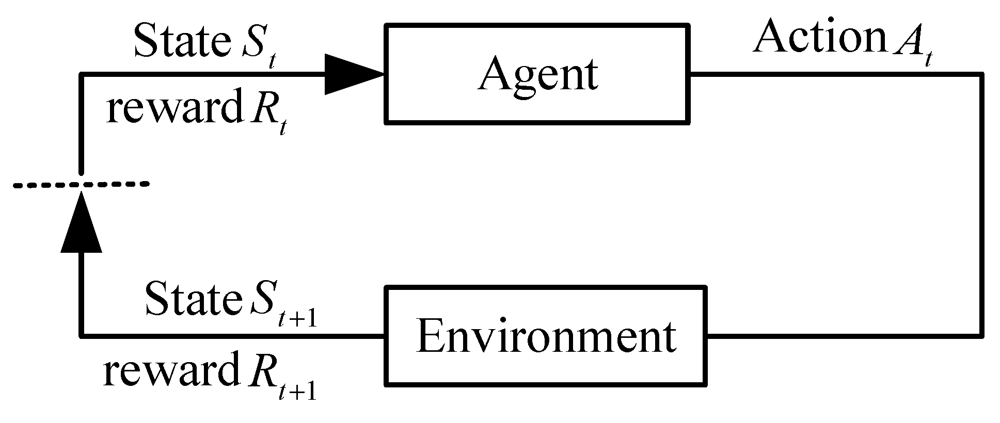

In MDPs, the decision-making process is described as the following quads: $(S, A, P, R)$ where $S$ is the state set, $A$ is the action set, $S \times S \times A \rightarrow [0,1]$, $R$ is the expected rewards of state-action, $S \times A \rightarrow R$, and $P$ is the state transition function.

在 MDPs（马尔可夫决策过程）中，决策过程被描述为以下四元组：$(S, A, P, R)$，其中 $S$ 是状态集合，$A$ 是动作集合，$S \times S \times A \rightarrow [0,1]$，$R$ 是状态-动作的期望奖励，$S \times A \rightarrow R$，而 $P$ 是状态转移函数。

$$
\begin{aligned}
p\left(s^{\prime} \mid s, a\right) & = \operatorname{Pr}\left\{S_{t} \mid S_{t-1}, A_{t-1}\right\} \\
& = \sum_{r \in R} P\left(s^{\prime}, r \mid s, a\right)
\end{aligned}
$$

In a UAV swarm system, a UAV observes a certain state $S_{t} \in S$ of the environment, then chooses an action $A_{t} \in A$ according to that state. In the next moment, according to the different selected action, the UAV will obtain a reward $R_{t+1} \in R$ from the state transfer function $\boldsymbol{P}$ and enters a new state $S_{t+1}$. This process can be repeated to obtain the following Markov decision sequence:

在无人机集群系统中，无人机观察环境的某个状态 $S_{t} \in S$，然后根据该状态选择一个动作 $A_{t} \in A$。在下一时刻，根据所选动作的不同，无人机会从状态转移函数 $\boldsymbol{P}$ 中获得一个奖励 $R_{t+1} \in R$，并进入一个新的状态 $S_{t+1}$。这一过程可以重复进行，从而得到如下的马尔可夫决策序列：

$$
S_{0}, A_{0}, R_{1}, S_{1}, A_{1}, R_{2}, S_{2}, A_{2}, S_{3}, \cdots
$$

In 1989, Watkins [[32](https://www.mdpi.com/2504-446X/7/5/297#B32-drones-07-00297)] proposed the Q-learning algorithm by combining the time series difference learning method and optimal control, which is a great milestone for RL. In 2013, Mnih [[33](https://www.mdpi.com/2504-446X/7/5/297#B33-drones-07-00297)] proposed DQN by combining RL and DL and achieved the top level of human performance in a classic Atari game. In the DRL algorithm, Lillicrap [[34](https://www.mdpi.com/2504-446X/7/5/297#B34-drones-07-00297)] proposed a new algorithm that combines the DQN and Policy Gradient (PG) algorithm named Deep Deterministic Policy Gradient (DDPG) to solve the control problem in continuous action space effectively. The framework of DDPG is shown in[Figure 2](https://www.mdpi.com/2504-446X/7/5/297#fig_body_display_drones-07-00297-f002). DDPG samples the distribution of actions by improving the policy𝝁μto obtain the specific actionA. At this point, the reward function𝑅(𝑠,𝑎)R(s,a)is determined. The deterministic policy is𝝁𝜃:𝑺→𝑨μθ:S→A, and its maximum objective function is:

1989 年，Watkins [ 32] 提出了 Q-learning 算法，将时间序列差分学习方法与最优控制相结合，这是 RL 的一个伟大里程碑。2013 年，Mnih [ 33] 提出了 DQN，将 RL 和 DL 相结合，并在经典的 Atari 游戏中实现了人类表演的顶级水平。在 DRL 算法中，Lillicrap [ 34] 提出了一种结合了 DQN 和策略梯度 （PG） 算法的新算法，称为深度确定性策略梯度 （DDPG），以有效解决连续动作空间中的控制问题。DDPG 的框架如图 2 所示。DDPG 通过改进策略 𝝁μ 来获取特定的操作 A，从而对操作的分布进行采样。此时，奖励函数 𝑅(𝑠,𝑎)R(s,a)已确定。确定性策略为 𝝁𝜃:𝑺→𝑨μθ:S→A，其最大目标函数为：

$$
J(\theta)=\mathbb{E}_{s \sim p^{\mu}}[R(s, a)]
$$

The corresponding gradient is:

$$
\nabla_{\theta} J(\theta) = \mathbb{E}_{s \sim D}\left[\left.\nabla_{\theta} \boldsymbol{\mu}_{\theta}(a \mid s) \nabla_{a} Q^{\mu}(s, a)\right|_{a=\mu_{\theta}(s)}\right]
$$

Equation (5) depends on $\nabla_{a} Q^{\mu}(s, a)$, and the action space of the DDPG algorithm must be continuous.

公式 (5) 依赖于 $\nabla_{a} Q^{\mu}(s, a)$，且 DDPG 算法的动作空间必须是连续的。

The critic network is updated as follows:

$$
\begin{aligned}
L(\theta) & = \mathbb{E}_{s, a, r, s^{\prime}}\left[\left(Q^{\mu}(s, a) - y\right)^{2}\right] \\
y & = r + \left.\gamma Q^{\mu^{\prime}}\left(s^{\prime}, a^{\prime}\right)\right|_{a^{\prime}=\mu_{\theta^{\prime}}^{\prime}\left(s^{\prime}\right)}
\end{aligned}
$$

where $\mu$ is the actor prediction network and $\mu^{\prime}$ is the target network. The gradient of the objective function of the actor network is:

其中，$\mu$ 是演员预测网络，$\mu^{\prime}$ 是目标网络。演员网络目标函数的梯度为：

$$
\nabla_{\theta} J(\boldsymbol{\mu}) = \mathbb{E}_{s, a \sim D}\left[\left.\nabla_{\theta} \boldsymbol{\mu}(a \mid s) \nabla_{a} Q^{\mu}(s, a)\right|_{a=\mu(s)}\right]
$$

The loss function is:

$$
L(\mu) = -Q^{\mu}(s, a)
$$

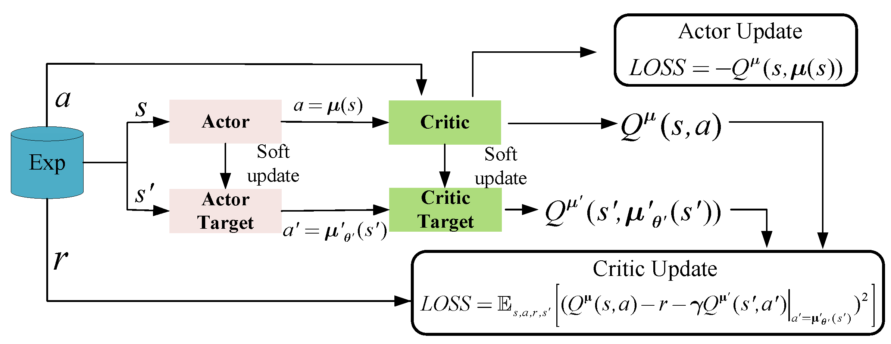

...

Unlike the situation of single-agent training, the change in environment is not only related to the actions of the agent itself, but also related to the actions of other agents and the interaction between agents, which leads to the instability of multi-agent training. Based on the DDPG algorithm, Lowe [35] extended it to the case of multiple agents and proposed the MADDPG algorithm. It adopted a centralized training and distributed execution framework, as shown in Figure 3. It uses global information to guide the training of multi-agent, while in the process of execution, the agent will only make decisions based on its own observations. It greatly improves the convergence speed and training effect of the algorithm.

与单智能体训练的情况不同，环境的变化不仅与智能体本身的动作有关，还与其他智能体的动作和智能体之间的互动有关，这导致了多智能体训练的不稳定性。在 DDPG 算法的基础上，Lowe [35] 将其扩展到多个智能体的情况，并提出了 MADDPG 算法。它采用了集中式训练和分布式执行框架，如图 3 所示。它使用全局信息来指导多智能体的训练，而在执行过程中，智能体只会根据自己的观察做出决策。大大提高了算法的收敛速度和训练效果。

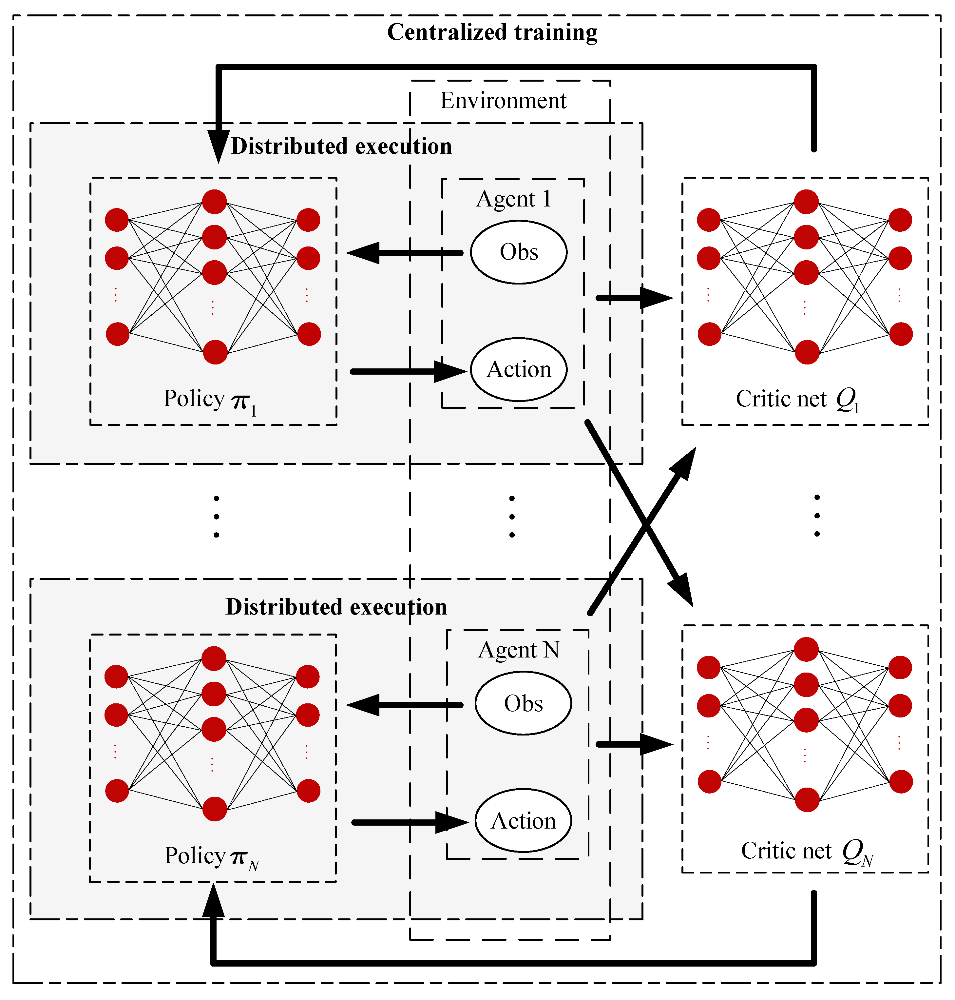

Considering $N$ agents, each agent's policy parameters can be written in the following form:

$$
\boldsymbol{\theta} = \left\{ \theta_{1}, \theta_{2}, \theta_{3}, \cdots, \theta_{N} \right\}
$$

Its policy is:

$$
\boldsymbol{\pi} = \left\{ \pi_{1}, \pi_{2}, \pi_{3}, \ldots, \pi_{N} \right\}
$$

According to the PG algorithm, the gradient of the expected return $J\left(\theta_{i}\right) = \mathbb{E}\left[R_{i}\right]$ for agent $i$ can be obtained:

$$
\begin{aligned}
\nabla_{\theta_{i}} J\left(\theta_{i}\right) & = \mathbb{E}_{s \sim p^{u}, a_{i} \sim \pi_{i}} \left[ \mathcal{L}\left(\theta_{i}\right) \right] \\
\mathcal{L}\left(\theta_{i}\right) & = \nabla_{\theta_{i}} \log \pi_{\theta_{i}} \left( a_{i} \mid o_{i} \right) Q_{i}^{\pi} \left( x, a_{1}, \cdots, a_{N} \right)
\end{aligned}
$$

$Q_{i}^{\pi}\left(x, a_{1}, \cdots, a_{N}\right)$ is a centralized action-value function. The input consists of the state $x$, and the action $a_{1}, \cdots, a_{N}$ of all agents. The state $x$ can be simply composed of the observations of all agents. Each agent can design a reward function independently and learn independently to achieve competitive, cooperative, or hybrid policies.

Similar to DDPG, its policies are:

$$
\boldsymbol{\mu} = \left\{ \mu_{1}, \mu_{2}, \mu_{3}, \ldots, \mu_{N} \right\}
$$

The parameters of the policies are:

$$
\boldsymbol{\theta} = \left\{ \theta_{1}, \theta_{2}, \theta_{3}, \cdots, \theta_{N} \right\}
$$

The gradient of the objective function is:

$$
\nabla_{\theta_{i}} J\left(\boldsymbol{\mu}_{i}\right) = \left[ \left. \mathbb{E}_{x, a \sim D} \nabla_{\theta_{i}} \boldsymbol{\mu}_{i} \left( a_{i} \mid o_{i} \right) \nabla_{a_{i}} Q_{i}^{\mu} \left( x, a_{1}, \ldots, a_{N} \right) \right|_{a_{i} = \boldsymbol{\mu}_{i} \left( o_{i} \right)} \right]
$$

The experience replay buffer $D$ contains $\left(x, x^{\prime}, a_{1}, \cdots, a_{N}, r_{1}, \cdots, r_{N}\right)$, which records the experience of all agents. The loss function of the actor network is:

$$
L\left(\boldsymbol{\mu}_{i}\right) = -Q_{i}^{\mu}\left(x, a_{1}, \cdots, a_{N}\right)
$$

Accordingly, the critical network $Q_{i}^{\mu}$ is updated as follows:

$$
\begin{aligned}
L\left(\theta_{i}\right) & = \mathbb{E}_{x, a, r, x^{\prime}} \left[ \left( Q_{i}^{\mu} \left( x, a_{1}, \ldots, a_{N} \right) - y \right)^{2} \right] \\
y & = r_{i} + \left. \gamma Q_{i}^{\mu^{\prime}} \left( x^{\prime}, a_{1}^{\prime}, \ldots, a_{N}^{\prime} \right) \right|_{a_{j}^{\prime} = \mu_{j}^{\prime} \left( o_{j} \right)}
\end{aligned}
$$

where $\boldsymbol{\mu}^{\prime} = \left\{ \mu_{\theta_{1}^{\prime}} \ldots, \boldsymbol{\mu}_{\theta_{N}^{\prime}} \right\}$ is the policy target network and $\theta_{i}^{\prime}$ is the parameter of network $i$.

The MADDPG algorithm provides a common centralized training and distributed execution framework in multi-agent systems, as shown in Figure 3. However, the input dimension of the critical network will expand rapidly with the increase in the number of agents. Therefore, MADDPG cannot be applied to large-scale agent scenarios directly. Meanwhile, MADDPG may fail when the training and application scenarios are different. Based on the above discussion, this paper will solve the problems with the MADDPG algorithm and propose an extensible UAV swarm task assignment algorithm.

MADDPG 算法在多代理系统中提供了一个通用的集中式训练和分布式执行框架，如图 3 所示。但是，关键网络的输入维度将随着代理数量的增加而迅速扩展。因此，MADDPG 不能直接应用于大规模代理方案。同时，当训练场景和应用场景不同时，MADDPG 可能会失败。基于以上讨论，本文将解决 MADDPG 算法存在的问题，并提出一种可扩展的无人机集群任务分配算法。

## 3 Extensible Task Assignment Algorithm of UAV Swarm

This section designs a scalable UAV swarm task assignment algorithm based on the following scenarios, which is trained on a small number of agents but can be directly applied to a larger UAV swarm system with guaranteed task assignment performance.

本节基于以下场景设计了一种可扩展的无人机集群任务分配算法，该算法在少量智能体上进行训练，但可以直接应用于更大的无人机集群系统，并保证任务分配性能。

- (1)The UAV swarm searches for an unknown number of targets in a given area, using the Boids [36] algorithms to avoid obstacles during exploration.
  - 无人机集群在给定区域搜索未知数量的目标，使用 Boids [ 36] 算法在探索过程中避开障碍物。
- (2)The UAV is the ammunition to attack the detected target.
  - 无人机是攻击检测到的目标的弹药。
- (3)Each target needs multiple UAVs to destroy.
  - 每个目标都需要多架无人机来摧毁。

In this section, we design a local communication model and a mean simulation observation model to reduce the computational burden of the basic MADDPG algorithm. Meanwhile, we propose a parameter synchronization training mechanism, which guarantees that the training network can be used in more UAVs directly. To ensure the performance, this paper proposes a multi-task assignment decision process. The system framework of the proposed Ex-MADDPG algorithm is shown in Figure 4, where letters A–F indicate the UAV swarm and the stars indicate the targets.

在本节中，我们设计了一个局部通信模型和一个均值模拟观察模型，以减轻基本 MADDPG 算法的计算负担。同时，我们提出了一种参数同步训练机制，保证了训练网络可以直接用于更多的无人机。为了保证性能，本文提出了一种多任务分配决策过程。所提出的 Ex-MADDPG 算法的系统框架如图 4 所示，其中字母 A-F 表示无人机集群，星星表示目标。

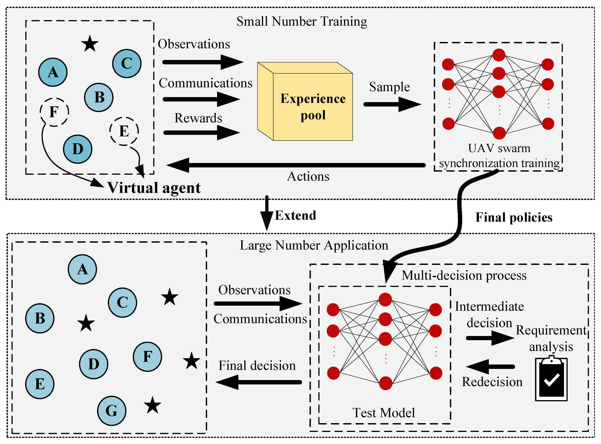

### 3.1 Local Communication Model

均值模拟观察模型

To ensure that the algorithm can be used in a large-scale UAV swarm system, this paper assumes that each agent can only receive partial information from its neighboring agents. The local communication model followed by each agent is designed as shown in Equation (17):

为了确保该算法可以在大规模无人机集群系统中使用，本文假设每个代理只能从其相邻代理接收部分信息。每个代理遵循的本地通信模型设计如公式 （ 17） 所示：

$$
c_{i}^{\text {out }}=\left[a_{t}, \operatorname{pos}_{i}, \operatorname{pos}_{i, \text { goal }}\right]
$$

$$
c_{i}^{\text {in }}=\left\{\begin{array}{ll}c_{j}^{\text {out }} & \text { agent }_{j} \text { in } C_{\text {agent }}^{i} \\ 0 & \text { agent }_{j} \text { not in } C_{\text {agent }}^{i}\end{array}\right.
$$

where $c_{i}^{\text{out}}$ is the communication message sent from the agent $i$; $a_{t}$ is a bool variable, indicating whether the agent $i$ is in the ready attack state. $pos_{i}$ is the position of the agent $i$; $\operatorname{pos}_{i, \text{goal}}$ is target positions found by the current agent $i$; $c_{j}^{\text{out}}$ is the release information of agent $j$; $c_{i}^{in}$ is the information received by the agent $i$; $C_{a_{\text{agent}}}$ refers to the communication range of agent $i$. An example of the local communication model is shown in Figure 5. The agent only receives messages within its communication range, such as $A$ and $B$. If two agents are not within each other's communication range, such as $B$ and $C$ in Figure 5, they will not communicate.

其中，$c_{i}^{\text{out}}$ 是从智能体 $i$ 发送的通信消息；$a_{t}$ 是一个布尔变量，表示智能体 $i$ 是否处于准备攻击状态。$pos_{i}$ 是智能体 $i$ 的位置；$\operatorname{pos}_{i, \text{goal}}$ 是当前智能体 $i$ 找到的目标位置；$c_{j}^{\text{out}}$ 是智能体 $j$ 的发布信息；$c_{i}^{in}$ 是智能体 $i$ 接收到的信息；$C_{a_{\text{agent}}}$ 表示智能体 $i$ 的通信范围。图 5 展示了一个局部通信模型的示例。智能体仅接收其通信范围内的消息，例如 A 和 B。如果两个智能体不在彼此的通信范围内，例如图 5 中的 B 和 C，它们将不会进行通信。

### 3.2 Mean Simulation Observation Model

Aiming at the problem that the observation dimension changes with the scale of the UAV swarm, which leads to the failure of the DRL algorithm, this paper proposes fixed-dimension observation values to solve this problem. Compared with the Long Short-Term Memory (LSTM) method proposed by Zhou Wenqin [37], fixed dimension observation values are more stable in environments with huge changes. The design observation model is a mean simulation observation model, as shown in Equation (19):

针对观测维度随无人机集群规模变化导致 DRL 算法失效的问题，该文提出固定维度观测值来解决该问题。与周文琴[37]提出的长短期记忆（LSTM）方法相比，固定维度观测值在变化较大的环境中更加稳定。设计观测模型是均值模拟观测模型，如方程 （19） 所示：

$$
obs _{i}=\left[\begin{array}{llll}n, & \operatorname{pos}_{i}, & \text { pos }_{\text {mean }}, & \operatorname{pos}_{\text {goal }}\end{array}\right]
$$

The agent receives the target assignment $n$ according to local communication and dynamically adjusts its assignment strategy according to $n$. Its position $\operatorname{pos}_{i}$, the average position of the surrounding agents $pos_{\text{mean}}$, and the target position $pos_{\text{goal}}$ allow the agent to complete the target assignment based on its own observations. Meanwhile, the dimensions of the observation will not change when the number of surrounding agents changes dynamically.

智能体根据局部通信接收目标分配 $n$，并根据 $n$ 动态调整其分配策略。其位置 $\operatorname{pos}_{i}$、周围智能体的平均位置 $pos_{\text{mean}}$ 以及目标位置 $pos_{\text{goal}}$ 使得智能体能够基于自身观察完成目标分配。同时，当周围智能体的数量动态变化时，观察的维度不会发生变化。

At the same time, n is designed as a simulation quantity for large UAV swarms, where n is simulated as a random number. Through the parameter n, the situation of a large number of UAVs around a single UAV can be simulated. By training a small number of UAVs, an algorithm suitable for a large number of scenarios can be obtained. The mean simulation observation model effectively reduces the computing power and time consumed by training a large number of UAV task assignment algorithms and solves the disadvantage that the trained algorithms can only be applied to a fixed number. In subsequent experiments, it can be proved that the algorithm using the mean simulation observation model greatly improves the scalability of the MADDPG algorithm.

同时，n 被设计为大型无人机集群的模拟量，其中 n 被模拟为随机数。通过参数 n，可以模拟大量无人机围绕单个无人机的情况。通过训练少量无人机，可以得到适合大量场景的算法。均值模拟观测模型有效降低了训练大量无人机任务分配算法的计算能力和时间消耗，解决了训练算法只能应用于固定数量的缺点。在随后的实验中可以证明，采用均值模拟观测模型的算法大大提高了 MADDPG 算法的可扩展性。

### 3.3 Swarm Synchronization Training

Swarm 同步训练

In traditional multi-agent reinforcement learning training processes, the parameters of the agents are different, so the trained agents cannot be applied to systems of different scales. After the training is completed, the strategy of a single agent is often incomplete and needs the cooperation of other agent strategies. This training method can complete most multi-agent tasks. When considering the scalability, this training method will fail.

在传统的多智能体强化学习训练过程中，智能体的参数不同，因此训练后的智能体无法应用于不同规模的系统。训练完成后，单个智能体的策略往往是不完整的，需要其他智能体策略的配合。这种训练方法可以完成大多数多智能体任务。当考虑可扩展性时，这种训练方法会失败。

Inspired by the characteristics of bee colony systems, this paper designs a training mechanism called a swarm synchronization training mechanism, which is shown in Figure 6, to achieve scalability. Unlike the traditional reinforcement learning training process, all agent parameters are synchronized every certain number of training steps. Under the mean value simulation observation model 𝒐𝒃𝒔𝑖, action value 𝐴𝑐𝑖, and the UAV swarm synchronization training mechanism, we obtain the gradient of the objective function:

受蜂群系统特点的启发，本文设计了一种称为蜂群同步训练机制的训练机制，如图 6 所示，以实现可扩展性。与传统的强化学习训练过程不同，所有智能体参数每经过一定数量的训练步骤就会同步。在均值模拟观测模型 𝒐𝒃𝒔𝑖、 动作值 𝐴𝑐𝑖 和无人机集群同步训练机制下，我们得到目标函数的梯度：

The gradient of the objective function is:

$$
\nabla_{\theta_{i}} J\left(\boldsymbol{\mu}_{i}\right) = \mathbb{E}_{x, A c \sim D} \left[ \left. \nabla_{\theta_{i}} \boldsymbol{\mu}_{i} \left( A c_{i} \mid \boldsymbol{obs}_{i} \right) \nabla_{A c_{i}} Q_{i}^{\mu} \left( x, A c_{1}, \ldots, A c_{N} \right) \right|_{A c_{i} = \boldsymbol{\mu}_{i} \left( \boldsymbol{obs}_{i} \right)} \right]
$$

where $\boldsymbol{x} = \left[ obs_{1}, \ldots, obs_{N} \right]$ is the collection of the observations for each agent. The loss function of the actor network is rewritten in Equation (21):

$$
L\left(\boldsymbol{\mu}_{i}\right) = -Q_{i}^{\mu}\left(x, A c_{1}, \cdots, A c_{N}\right)
$$

The update method of the critical network $Q_{i}^{\mu}$ is formulated as Equation (22):

$$
\begin{aligned}
L\left(\theta_{i}\right) & = \mathbb{E}_{x, A c, r, x^{\prime}} \left[ \left( Q_{i}^{\mu} \left( x, A c_{1}, \ldots, A c_{N} \right) - y \right)^{2} \right] \\
y & = \boldsymbol{r}_{i} + \left. \gamma Q_{i}^{\mu^{\prime}} \left( x^{\prime}, A c_{1}^{\prime}, \ldots, A c_{N}^{\prime} \right) \right|_{A c_{j}^{\prime} = \mu_{j}^{\prime} \left( \text{obs}_{j} \right)}
\end{aligned}
$$

where $\boldsymbol{\mu}^{\prime} = \left\{ \boldsymbol{\mu}_{\theta_{1}^{\prime}}, \ldots, \boldsymbol{\mu}_{\theta_{N}^{\prime}} \right\}$ is the actor target network, $\boldsymbol{\theta}^{\prime}$ is the actor target network parameter, $\omega$ is the critical network parameter, and $\omega^{\prime}$ is the critic target network parameter. After a certain number of steps, we synchronize the parameters of the actor and critic network:

$$
\begin{array}{c}
\boldsymbol{\theta}_{i \_new} = \frac{\sum_{j=1}^{N} \boldsymbol{\theta}_{j}}{N}, \quad \boldsymbol{\theta}_{i \_new}^{\prime} = \frac{\sum_{j=1}^{N} \boldsymbol{\theta}_{j}^{\prime}}{N} \\
\boldsymbol{\omega}_{i \_new} = \frac{\sum_{j=1}^{N} \boldsymbol{\omega}_{j}}{N}, \quad \boldsymbol{\omega}_{i \_new}^{\prime} = \frac{\sum_{j=1}^{N} \boldsymbol{\omega}_{j}^{\prime}}{N}
\end{array}
$$

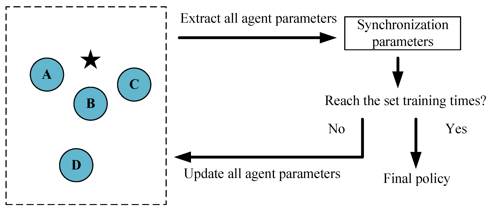

When the training process is finished, all agents have the same “brain”, which means the same parameters. The final strategy 𝝁 can be directly applied to any scale of a UAV swarm system. Thus, Ex-MADDPG with a synchronization training mechanism solves the problem of applying the algorithm to large-scale agents.

当训练过程完成后，所有代理都有相同的 “大脑”，这意味着相同的参数。最终策略 𝝁 可以直接应用于任何规模的无人机集群系统。因此，具有同步训练机制的 Ex-MADDPG 解决了将算法应用于大规模代理的问题。

### 3.4 Extensible Multi-Decision Mechanism

To ensure the performance of dynamic task assignment, this paper proposes a multi-decision mechanism to adjust its decision in real time according to n, as shown in Figure 7. In this mechanism, all agents complete the first-round decision, i.e., 𝑛=0, as shown in Equation (24), and then communicate with other involved agents (shown as the same color in Figure 7), and make an attack decision again, as shown in Equations (25) and (26):
为了保证动态任务分配的性能，本文提出了一种多决策机制，根据 n 实时调整其决策，如图 7 所示。在这种机制中，所有智能体都完成第一轮决策， 𝑛=0 即，如等式 （24） 所示，然后与其他参与的智能体通信（如图 7 中的相同颜色所示），并再次做出攻击决策，如等式 （25） 和 （ 26） 所示：

$$
\left[0\right., pos _{i}, pos _{\text {mean }} pos \left._{\text {goal }}\right] \rightarrow \mu_{i} \rightarrow A c_{i}
$$

$$
\sum_{i=1}^{N} A c_{i} \rightarrow n
$$

$$
\left[n\right., pos _{i}, pos _{\text {mean }} pos \left._{\text {goal }}\right] \rightarrow \mu_{i} \rightarrow A c_{i}
$$

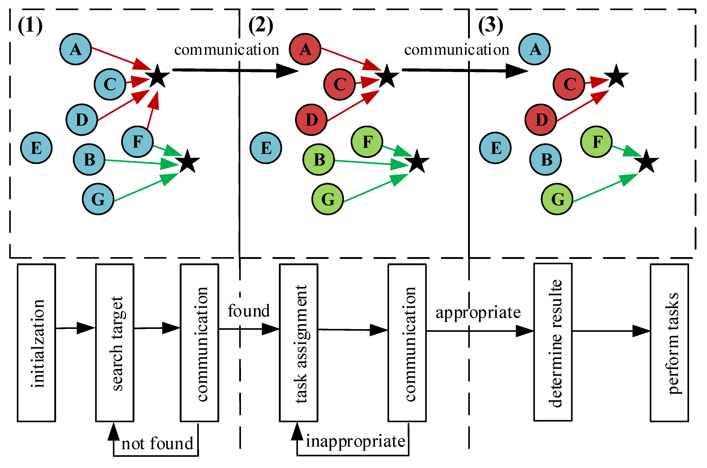

Remark 1. In practice, there may be more than one type of UAV to complete the mission and more than one target to attack. At the same time, the mission objective may have different priorities. It is impossible to train for every possible situation. The proposed multi-decision mechanism can easily accommodate these requirements by simply adding the appropriate decision conditions in Figure 7, such as the priority of the targets, the characteristics of attack targets, and so on.

Remark 1. 在实践中，可能有不止一种类型的无人机来完成任务，并且有不止一种目标要攻击。同时，任务目标可能具有不同的优先级。不可能针对所有可能的情况进行训练。所提出的多决策机制只需在图 7 中添加适当的决策条件，例如目标的优先级、攻击目标的特征等，即可轻松满足这些要求。

By designing multi-decision mechanisms, the algorithm is more scalable and can handle much more complex dynamic missions.

通过设计多决策机制，该算法更具可扩展性，可以处理更复杂的动态任务。

## 4 Simulation Experiments and Results

The simulation environment adopts the classical multi-agent simulation environment MPE, which is a set of 2D environments with discrete time and continuous space developed by OpenAI. This environment performs a series of tasks by controlling the motion of various role particles in 2D space [38]. At present, it is widely used in the simulation and verification of various multi-agent RL algorithms. We deployed the proposed algorithm on the PC platform with Intel Xeon Gold 5222 and NVIDIA GeForce RTX 2080Ti.

仿真环境采用经典的多智能体仿真环境 MPE，MPE 是 OpenAI 开发的一组具有离散时间和连续空间的 2D 环境。该环境通过控制 2D 空间中各种角色粒子的运动来执行一系列任务 [ 38]。目前，它被广泛应用于各种多智能体 RL 算法的仿真和验证。我们在 PC 平台上部署了所提出的算法，使用的是 Intel Xeon Gold 5222 和 NVIDIA GeForce RTX 2080Ti。

In this paper, the training scenario and the application scenario are made to be not exactly the same in order to illustrate the scalability of the proposed algorithm. Therefore, the training scenario and the application scenario will be discussed respectively.

在本文中，训练场景和应用场景并不完全相同，以说明所提出的算法的可扩展性。因此，将分别讨论训练场景和应用场景。

### 4.1 Training Experiment Scenario

We trained the algorithm with only four agents and deploy the result to any large system. During the training process, the agent moves and searches for the target in the scene. After the agent finds the target, it will communicate with the surrounding agents and make a decision.
我们只用四个代理训练了算法，并将结果部署到任何大型系统。在训练过程中，代理在场景中移动和搜索目标。Agent 找到目标后，会与周围的 Agent 进行沟通并做出决策。
We set the following conditions and assumptions for the task-assignment training experiment:
我们为任务分配训练实验设置了以下条件和假设：

(1) The UAV makes decisions based on the distance to the target and the average distance of the group to the target.
无人机根据到目标的距离和群体到目标的平均距离做出决策。
(2) The target needs at least two UAVs to destroy.
目标至少需要两架无人机才能摧毁。
(3) The UAV only observes the target within its detection range.
无人机仅观察其检测范围内的目标。
(4) The UAV communicates only with agents within the communication range.
无人机仅与通信范围内的代理通信。

### 4.2 Construction of Training Model

During the training process, the training model is designed according to the task assignment conditions and specific simulation application scenarios in Section 4.1, including action, reward, mean simulation observation model, a swarm synchronization training mechanism, and a multi-decision mechanism.
在训练过程中，根据 4.1 节中的任务分配条件和具体仿真应用场景设计训练模型，包括动作、奖励、均值模拟观察模型、群体同步训练机制和多决策机制。

#### 4.2.1 Action Value

In the process of UAV swarm task assignment, the UAV needs to perform actions such as obstacle avoidance and assignment according to the observation value. According to the task requirements and experimental assumptions, the design action value is shown in Equation (27):
在无人机集群任务分配过程中，无人机需要根据观测值进行避障、分配等动作。根据任务要求和实验假设，设计行动值如公式 （ 27） 所示：

#### 4.2.2 Mean Simulation Observation

#### 4.2.3 Centralized and Distributed Reward Function

### 4.3 Validity of the Algorithm

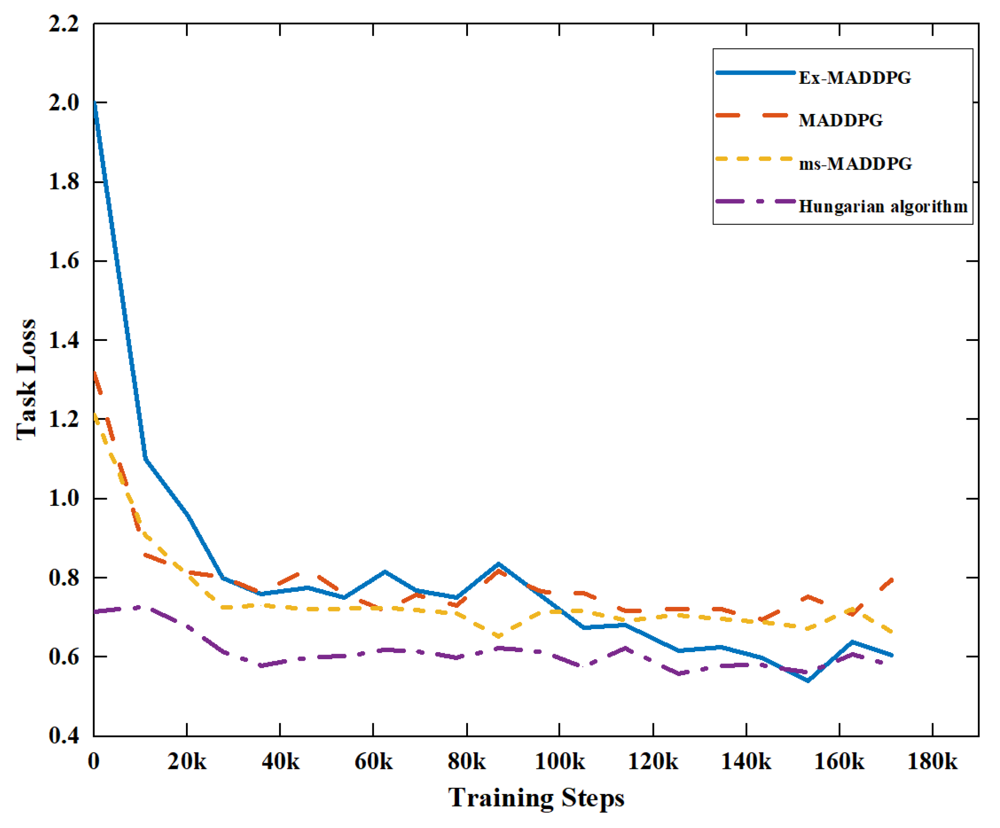
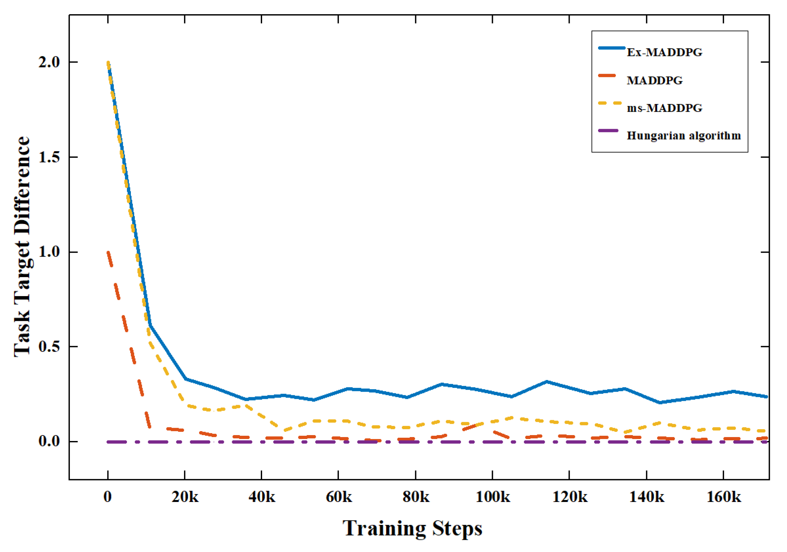

### 4.4 Extended Experiments

Based on the training scenario in Section 4.1, we expand the number of agents and targets. At the same time, to increase the detection rate of the target, the expanded scene is divided into three phases: takeoff, search, and decision. The agent will take off from the bottom left, pass through the formation, fly to the target area and hover, and complete the total task.

根据 Section 4.1 中的训练场景，我们扩展了 Agent 和 Target 的数量。同时，为了提高对目标的检出率，将扩展后的场景分为起飞、搜索和决策三个阶段。代理将从左下角起飞，穿过编队，飞到目标区域并悬停，完成全部任务。

In this section, we design two kinds of extension experiments to demonstrate the superiority of our proposed algorithm.

在本节中，我们设计了两种扩展实验来证明我们提出的算法的优越性。

**Experiment 1: Number extension**

Considering that the attack ratio between agents and targets in the training process is 2:1, the number of agents and the number of targets are expanded according to this ratio. The experimental design conditions are as follows:

(1)Number of agents:number of targets = 2:1;
(2)The number of agents is between 8 and 56, with an interval of 4;
(3)The final decision distance of the agent is designed as 1.5. If the distance between the agent and the target exceeds this range, the agent will communicate and make a decision at specified intervals. Otherwise, it will attack the target directly.

**Experiment 2: Task extension**

The practical application may be different from the training, so the tasks may also need to be expanded. To ensure the attack effect, we add task redistribution requirements, which means that one target may require two or more UAVs to destroy.

(1)Number of agents:number of targets = 5:2;
(2)The number of agents is between 5 and 55, with an interval of 5;
(3)The final decision distance of the agent is chosen to be 1.5. If the distance between the agent and the target exceeds this range, the agent will communicate and make a decision at specified intervals. Otherwise, it will attack the target directly;
(4)The target attacked by two agents has an 80% chance of being destroyed, while the target attacked by three agents has a 100% chance of being destroyed.
To reduce the random effect, each experiment is performed 30 times.

### 4.5 Extended Performance Test

Based on the performance requirements of the extended extension experiment, the extended performance metrics must be redesigned to compare the performance changes during the two extended experiments. In the following experiment, the 5:2 in the legend is used to refer to Experiment 2 for algorithm comparison and analysis.

根据扩展扩展实验的性能要求，必须重新设计扩展性能指标，以比较两个扩展实验期间的性能变化。在下面的实验中，图例中的 5：2 用于参考实验 2 进行算法对比分析。

The running simulation process of the algorithm is shown in Figure 10, which is applied to the dynamic target-assignment scenario of 32 agents. In Figure 10, (1) is the swarm of intelligent agents flying from the takeoff area to the target area, and (2) is the agent that first detects the target and starts to make decisions and allocate the target. Other agents continue to search. Finally, (3) is the final assignment result. Each target is hit by two agents.

该算法的运行仿真过程如图 10 所示，它应用于 32 个智能体的动态目标分配场景。在图 10 中，（1） 是从起飞区域飞到目标区域的智能代理群，（2） 是首先检测到目标并开始做出决策和分配目标的代理。其他代理继续搜索。最后，（3） 是最终的赋值结果。每个目标都由两个代理命中。

For the above process, the following performance metrics are designed.

#### 4.5.1 Task Completion Rate

As shown in Figure 11, the improved MADDPG algorithm (ms-MADDPG) using only the mean simulation has a small scalability number. When the number of agents continues to increase, the task-completion rate of the ms-MADDPG algorithm decreases significantly, and it can only complete some tasks. The MADDPG algorithm has no scalability at all. When the number of applications is inconsistent with the number of training, the algorithm will not work, and the task completion rate is 0%.

如图 11 所示，仅使用均值模拟的改进后的 MADDPG 算法 （ms-MADDPG） 具有较小的可扩展性数字。当 Agent 数量持续增加时，ms-MADDPG 算法的任务完成率明显下降，只能完成部分任务。MADDPG 算法根本没有可扩展性。当申请数与训练数不一致时，算法将不起作用，任务完成率为 0%。

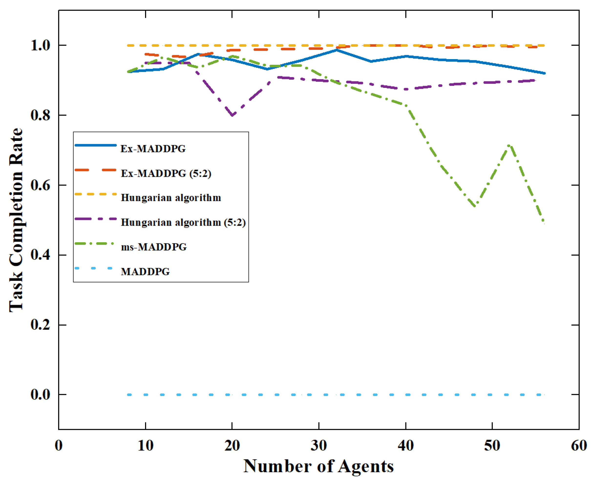

In the comparison test between Experiment 1 and Experiment 2 (5:2), the Hungarian algorithm was found to be able to destroy the target at 100% in Experiment 1, but destroyed less than 90% of the target in Experiment 2. At the same time, Ex-MADDPG could destroy more than 90% of the target in two experiments within the range of the number of tests. In Experiment 2, the algorithm could detect the target in real time. If the target was not completely destroyed, the new optimal agent was immediately determined to attack it to ensure that the target esd destroyed, achieving a task-completion rate of nearly 100%. The Ex-MADDPG algorithm could maintain the task assignment performance under application numbers and task-assignment conditions.

在实验 1 和实验 2 的比较测试 （5：2） 中，发现匈牙利算法能够在实验 1 100% 中摧毁目标，但摧毁的目标比 90% 实验 2 中的目标少。同时，Ex-MADDPG 可以在测试次数范围内的两次实验中摧毁超过 90% 目标的目标。在实验 2 中，该算法可以实时检测目标。如果目标没有被完全摧毁，立即确定新的最优智能体对其进行攻击，确保目标 ESD 被摧毁，实现接近 100% 的任务完成率。Ex-MADDPG 算法可以在应用程序数量和任务分配条件下保持任务分配性能。

#### 4.5.2 Task Loss

The design of task loss is the same as that of task loss in Section 4.3. This metric is the key metric for judging the distributional effect. The smaller the value, the more advantageous it is for the agent in the group, and the less time and distance it takes to execute the attack decision, which means the better the decision will be.

任务损失的设计与第 4.3 节中的任务损失相同。该指标是判断分布效应的关键指标。值越小，对组中的代理越有利，执行攻击决策所需的时间和距离就越短，这意味着决策就越好。

Figure 12 shows that the Hungarian algorithm, as a traditional algorithm, had poor results in Experiment 1 and Experiment 2. In the Hungarian algorithm, all agents make decisions at the same time, resulting in poor task loss performance. The Ex-MADDPG algorithm can select the agents in the group that is closer to the target to attack and make better decisions for each decision. When the shortest decision distance is chosen as 1.5, the agent can only make the final attack decision when it is relatively close to the target, which can further reduce the task loss. In terms of task loss, whether in Experiment 1 or Experiment 2, Ex-MADDPG algorithm has obvious advantages and can make better decisions in the case of expansion. However, the MADDPG algorithm cannot complete the expansion experiment and count its task loss.

图 12 显示，匈牙利算法作为一种传统算法，在实验 1 和实验 2 中效果不佳。在匈牙利算法中，所有代理同时做出决策，导致任务丢失性能不佳。Ex-MADDPG 算法可以选择组中更接近攻击目标的 Agent，并为每个决策做出更好的决策。当最短决策距离选择为 1.5 时，智能体只有在距离目标比较近的情况下才能做出最终的攻击决策，可以进一步减少任务损失。在任务丢失方面，无论是在 Experiment 1 还是 Experiment 2 中，Ex-MADDPG 算法都具有明显的优势，在扩展的情况下可以做出更好的决策。但是，MADDPG 算法无法完成扩容实验并统计其任务丢失。

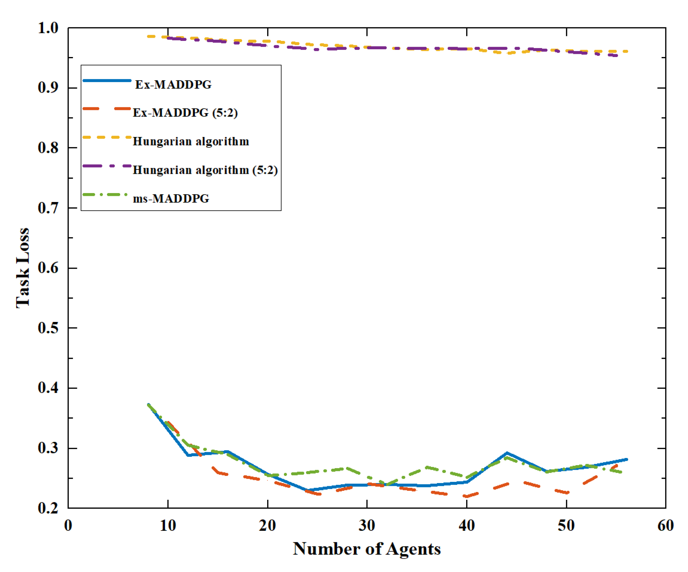

#### 4.5.3 Decision Time

In the actual operation process, real time is a very important indicator that determines whether the agent can react quickly to external changes and react in real time. Therefore, the time required to execute a decision is designed as one of the performance metrics of the algorithm.
在实际操作过程中，实时性是决定智能体是否能够对外部变化做出快速反应并实时反应的一个非常重要的指标。因此，执行决策所需的时间被设计为算法的性能指标之一。
As shown in Figure 13, whether in Experiment 1 or Experiment 2, the Hungarian algorithm, as a traditional algorithm, has a relatively short execution time in a small number of cases, but there is an obvious upward trend with the increase in agents. It can be predicted that when the scale of the agent is large, it will take a lot of time to obtain the decision results. The Ex-MADDPG algorithm is calculated by a neural network. The change in the number of surrounding agents has little impact on its input value, and the number of iterations needed to make decisions is small. Therefore, with the increase in the number of agents, its decision-making time showed a small upward trend. It can easily meet the real-time requirements of the scene. However, the ms-MADDPG algorithm has many iterations to make decisions, and it is difficult for to make decisions, so it consumes the most time. The MADDPG algorithm cannot count its decision time because it cannot complete the expansion experiment.
如图 13 所示，无论是在实验 1 还是实验 2 中，匈牙利算法作为传统算法，在少数情况下具有相对较短的执行时间，但随着智能体的增加，存在明显的上升趋势。可以预见，当智能体规模较大时，需要花费大量时间才能获得决策结果。Ex-MADDPG 算法由神经网络计算。周围代理数量的变化对其输入值影响很小，并且做出决策所需的迭代次数很小。因此，随着智能体数量的增加，其决策时间呈现小幅上升趋势。可以轻松满足场景的实时性要求。但是，ms-MADDPG 算法需要多次迭代来做出决策，并且很难做出决策，因此它消耗的时间最多。MADDPG 算法无法计算其决策时间，因为它无法完成扩展实验。

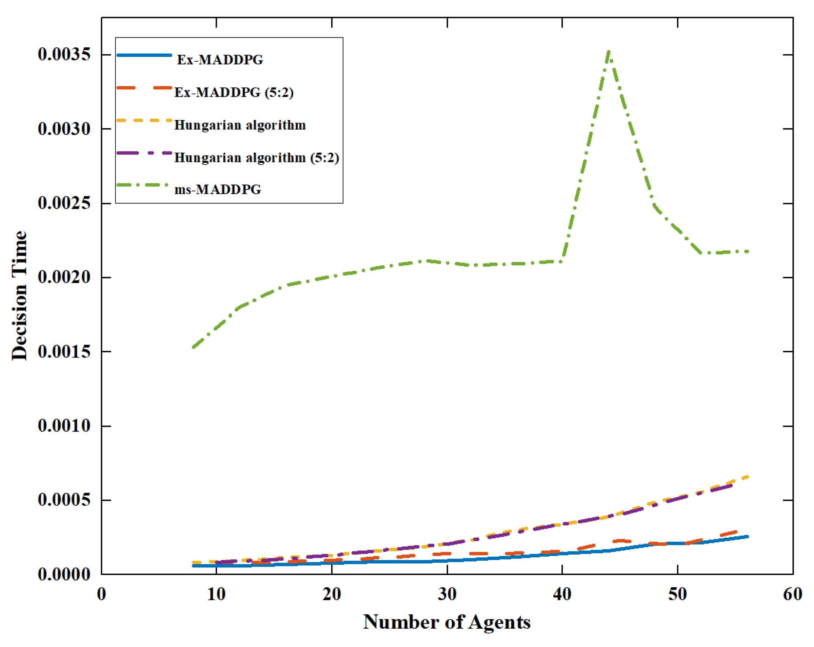

#### 4.5.4 Number of Communications

The number of agents that need to communicate refers to the number of other agents that each agent needs to communicate with when making decisions in a decision process. The more agents that need to communicate in a decision round, the more communication bandwidth is required to make decisions, the higher the hardware requirements for the agents, and the more difficult the algorithm is to implement.
需要通信的代理数是指在决策过程中做出决策时，每个代理需要与之通信的其他代理数。在决策轮次中需要通信的代理越多，做出决策所需的通信带宽就越多，对代理的硬件要求就越高，算法的实现难度就越大。
As shown in Figure 14, in Experiment 1 and Experiment 2, the Hungarian algorithm needed all scene information to make decisions, and each agent needed to communicate with all other agents. Therefore, the number of communications is equal to the size of the agent. The Ex-MADDPG algorithm only needs to communicate with nearby agents and can make decisions using part of the scene information. The required communication bandwidth is therefore greatly reduced. The improved ms-MADDPG algorithm using mean simulation requires a medium number of agents to make decisions. It can be found that the introduction of neural networks greatly reduces the amount of information required for decision-making and reduces the communication bandwidth.
如图 14 所示，在实验 1 和实验 2 中，匈牙利算法需要所有场景信息来做出决策，并且每个代理都需要与所有其他代理进行通信。因此，通信的数量等于代理的大小。Ex-MADDPG 算法只需要与附近的代理进行通信，就可以使用部分场景信息做出决策。因此，所需的通信带宽大大降低。使用均值模拟的改进 ms-MADDPG 算法需要中等数量的代理来做出决策。可以发现，神经网络的引入大大减少了决策所需的信息量，降低了通信带宽。

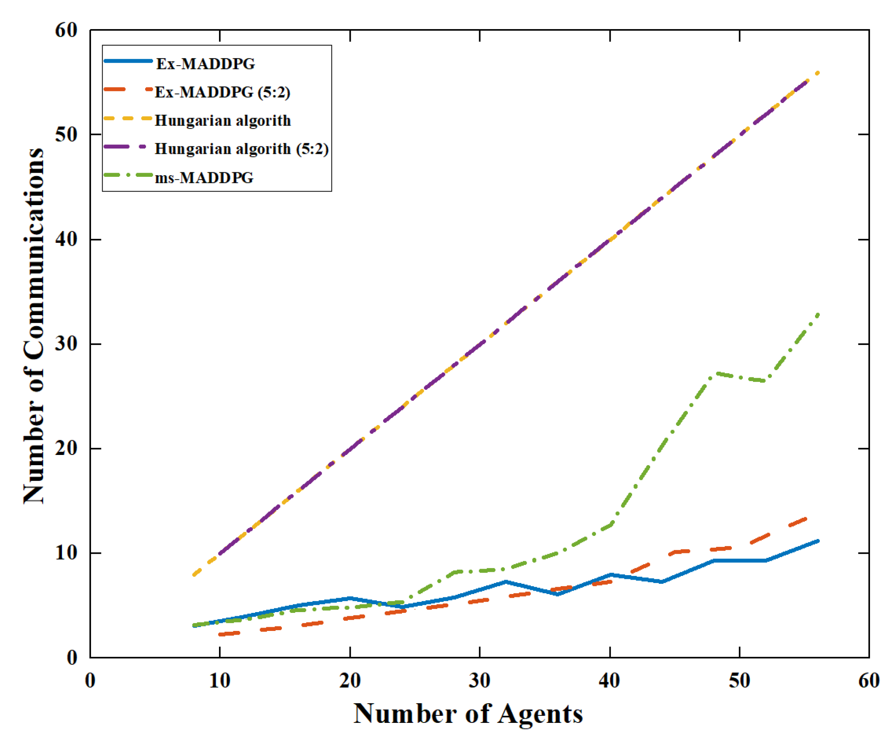

In conclusion, in Experiment 1 and Experiment 2 of the expansion experiment, the Ex-MADDPG algorithm was shown to be significantly superior to the traditional Hungarian algorithm and the MADDPG algorithm in terms of task completion rate, task loss, decision time, and the communication number, and could maintain stable performance during the expansion process and correctly complete the expected tasks.

综上所述，在扩展实验的实验 1 和实验 2 中，Ex-MADDPG 算法在任务完成率、任务丢失率、决策时间和通信数量方面明显优于传统的匈牙利算法和 MADDPG 算法，并且在扩展过程中能够保持稳定的性能并正确完成预期任务。

## 5 Experiments and Results

In this section, experiments are transferred from simulation to the real world in the context of task assignment in a UAV swarm target-attacking scenario. To validate its performance in practical task assignment, experiments in the real world were conducted with a group of nano-quadcopters named scit-minis (as shown in Figure 15) flying under the supervision of a NOKOV motion capture system. We deployed the proposed algorithm on the same PC platform as the simulation, but the algorithm ran separately for each UAV. The scit-mini is a nano-quadcopter such as crazyfile 2.0 [39], but with much more power and a longer endurance. Meanwhile, we used an open-source, unmanned vehicle Autopilot Software Suite called ArduPilot to make it easier to transfer the algorithm from simulation to the real world.
在本节中，在无人机集群目标攻击场景中的任务分配环境中，实验从模拟转移到现实世界。为了验证其在实际任务分配中的性能，在现实世界中，一组名为 scit-minis 的纳米四轴飞行器（如图 15 所示）在 NOKOV 行动捕捉系统的监督下飞行。我们将所提出的算法部署在与仿真相同的 PC 平台上，但算法针对每个无人机单独运行。scit-mini 是一种纳米四轴飞行器，例如 crazyfile 2.0 [ 39]，但具有更大的动力和更长的续航能力。同时，我们使用了一个名为 ArduPilot 的开源无人驾驶车辆 Autopilot 软件套件，以便更轻松地将算法从模拟转移到现实世界。

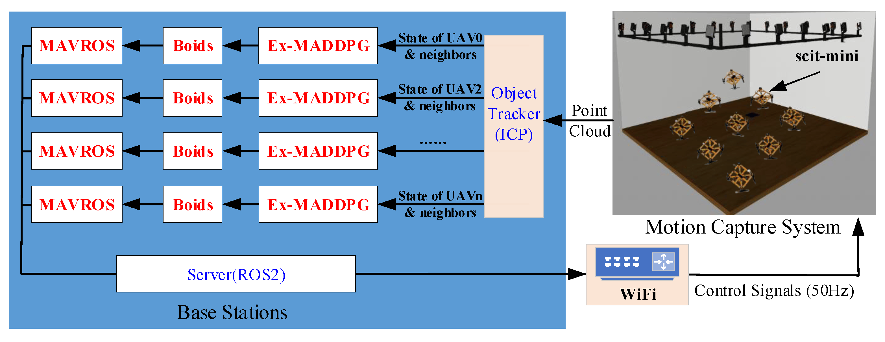

### 5.1 Architecture Overview

Similar to crazyswarm [39], our system architecture is outlined in Figure 15. We tracked the scit-mini with a motion capture system using passive spherical markers. Thanks to the sub-millimeter recognition accuracy of the motion capture system, we used the Iterative Closest Point (ICP) algorithm [40] to obtain the precise location of each scit-mini in the swarm in real time.
与 crazyswarm [ 39] 类似，我们的系统架构如图 15 所示。我们使用无源球形标记的动作捕捉系统跟踪了 scit-mini。由于动作捕捉系统的亚毫米级识别精度，我们使用迭代最近点 （ICP） 算法 [ 40] 来实时获取每个 scit-mini 在集群中的精确位置。
Unlike crazyswarm, the scit-mini communicates with a PC platform over WiFi that can transfer more data than Crazyradio PA. The control signals run at 50 Hz with an ROS2 a communication delay of about 10∼20 ms. However, the main onboard loop, like its attitude control loop, runs at 400 Hz, which can ensure the stable operation of the scit-mini. Each scit-mini obtains the control signals from its own Ex-MADDPG and boids through MAVROS with ROS2. We used only one computer in this experiment, but our system architecture supports multiple computers running simultaneously.
与 crazyswarm 不同，scit-mini 通过 WiFi 与 PC 平台通信，该平台可以传输比 Crazyradio PA 更多的数据。控制信号以 50 Hz 的频率运行，ROS2 的通信延迟约为 10∼20 ms。但是，主机载回路和它的姿态控制回路一样，以 400 Hz 的频率运行，这可以保证 scit-mini 的稳定运行。每个 scit-mini 都通过带有 ROS2 的 MAVROS 从自己的 Ex-MADDPG 和 boids 获取控制信号。在这个实验中，我们只使用了一台计算机，但是我们的系统架构支持多台计算机同时运行。

### 5.2 Flight Test

The actual test environment is shown in Figure 16, and the experimental area was divided into the take-off area and the target area. We tested our proposed Ex-MADDPG in a task-extension experiment, similar to Experiment 2 in Section 4.4, with nine scit-minis and three targets. The experimental procedure was as follows: nine scit-minis took off from the takeoff area shown in Figure 16(1) and then flew toward the target area, detected three targets, and executed the Ex-MADDPG algorithm. The experimental subject would fly over the target if it decides to attack it, and the rest of the scit-minis that do not decided to attack would continue to fly forward until they cross the target area. The scit-minis used the Boids algorithm to avoid collisions with each other.

实际测试环境如图 16 所示，实验区域分为起飞区和目标区。我们在任务扩展实验中测试了我们提出的 Ex-MADDPG，类似于第 4.4 节中的实验 2，有 9 个 scit-mini 和 3 个目标。实验过程如下：9 架 scit-minis 从图 16（1） 所示的起飞区域起飞，然后飞向目标区域，探测到三个目标，并执行 Ex-MADDPG 算法。如果实验对象决定攻击目标，它会飞越目标，而其余没有决定攻击的 scit-mini 将继续向前飞行，直到他们穿过目标区域。scit-mini 使用 Boids 算法来避免彼此冲突。

We selected two key steps of the experiment during the whole autonomous process, as shown in Figure 16(2),(3). Figure 16(2) shows that the scit-mini made the first decision to attack its target using Ex-MADDPG, and Figure 16(3) is the final result of the task assignment. As shown in Figure 16(3), one target was attacked by two scit-minis and two targets were attacked by three scit-minis. The videos of this experiment and more tests are available online: https://youtu.be/shA1Tu7VujM.

在整个自主过程中，我们选择了实验的两个关键步骤，如图 16（2）、（3） 所示。图 16（2） 显示 scit-mini 首先决定使用 Ex-MADDPG 攻击其目标，图 16（3） 是任务分配的最终结果。如图 16（3） 所示，一个目标被两个 scit-mini 攻击，两个目标被三个 scit-mini 攻击。该实验和更多测试的视频可在线获取：https://youtu.be/shA1Tu7VujM。

The experiment demonstrated that the proposed Ex-MADDPG algorithm can accomplish task assignment in UAV swarm target-attacking scenario efficiently in real-time, verifying its practicality and effectiveness.

实验表明，所提出的 Ex-MADDPG 算法能够实时高效地完成无人机集群目标攻击场景中的任务分配，验证了其实用性和有效性。

## 6 Conclusions

This paper presents an improved algorithm Ex-MADDPG algorithm based on MADDPG to solve the problem of task assignment in a UAV swarm target-attacking scenario. This algorithm uses mean simulation observation and swarm-synchronization mechanisms to deploy in arbitrary-scale systems, training only a small number of agents. By designing the scalable multi-decision mechanism, this algorithm can maintain its performance in the process of expansion and achieve arbitrary expansion of the number of UAVs. At the same time, the algorithm can achieve task expansion and can complete similar tasks that differ from the training process. The Ex-MADDPG algorithm can be trained once and applied to a large number of task-assignment scenarios, effectively solving the problem of insufficient scalability of the traditional RL/DRL algorithm. Simulation results show that the Ex-MADDPG has obvious advantages over the Hungarian algorithm in terms of assignment performance, fault tolerance, and real-time capabilities. At the same time, the algorithm has good scalability and maintains performance under the condition of number and task expansion. Furthermore, the proposed method proves to be feasible and effective in UAV swarm target attack scenarios in both simulations and practical experiments.
该文针对无人机集群目标攻击场景下的任务分配问题，提出了一种基于 MADDPG 的改进算法 Ex-MADDPG 算法。该算法使用均值模拟观察和群同步机制在任意规模的系统中进行部署，仅训练少量代理。通过设计可扩展的多决策机制，该算法可以在扩展过程中保持其性能，实现无人机数量的任意扩展。同时，该算法可以实现任务扩展，可以完成与训练过程不同的相似任务。Ex-MADDPG 算法可以一次训练并应用于大量的任务分配场景，有效解决了传统 RL/DRL 算法可扩展性不足的问题。仿真结果表明，Ex-MADDPG 算法在赋值性能、容错性和实时性方面均优于匈牙利算法。同时，该算法具有良好的可扩展性，在数量和任务扩展的情况下也能保持性能。此外，所提方法在无人机集群目标攻击场景下的仿真和实际实验中均被证明是可行和有效的。
In this paper, we propose a scalable reinforcement learning algorithm to address the task assignment problem in variable scenarios, with a particular focus on UAV formation planning. While the current implementation uses the Boids algorithm for formation flying, the UAV formation algorithm is not presented in detail. Therefore, future work will concentrate on the design and implementation of advanced formation planning algorithms to improve the efficiency of target detection and task assignment.
在本文中，我们提出了一种可扩展的强化学习算法来解决可变场景中的任务分配问题，特别关注无人机编队规划。虽然当前的实现使用 Boids 算法进行编队飞行，但并未详细介绍无人机编队算法。因此，未来的工作将集中在高级编队规划算法的设计和实现上，以提高目标检测和任务分配的效率。

Abbreviations

|   Short   |                           Full                            |
| :-------: | :-------------------------------------------------------: |
|    MPE    |             Multi-Agent Particle Environment              |
|    UAV    |                  Unmanned Aerial Vehicle                  |
|    GA     |                     Genetic Algorithm                     |
|    SA     |                    Simulated Annealing                    |
|    ACO    |             Ant Colony Optimization algorithm             |
|    PSO    |           Particle Swarm Optimization algorithm           |
|    GW     |                         Grey Wolf                         |
|    ICP    |                  Iterative Closest Point                  |
|    DRL    |                Deep Reinforcement Learning                |
|    RL     |                  Reinforcement Learning                   |
|    DL     |                       Deep Learning                       |
|    DQN    |                      Deep Q Network                       |
|   MDPs    |                 Markov Decision Processes                 |
|   LSTM    |                  Long Short-Term Memory                   |
|    PG     |                      Policy Gradient                      |
|   DDPG    |            Deep Deterministic Policy Gradient             |
|  MADDPG   |      Multi-Agent Deep Deterministic Policy Gradient       |
| ms-MADDPG |                   Mean Simulated MADDPG                   |
| Ex-MADDPG | Extensible Multi-Agent Deep Deterministic Policy Gradient |

## 7 References

[1]: https://doi.org/10.1177/0278364913496484

Korsah, G.A.; Stentz, A.; Dias, M.B. A comprehensive taxonomy for multi-robot task allocation.Int. J. Robot. Res.**2013**,32, 1495–1512. [[Google Scholar](https://scholar.google.com/scholar_lookup?title=A+comprehensive+taxonomy+for+multi-robot+task+allocation&author=Korsah,+G.A.&author=Stentz,+A.&author=Dias,+M.B.&publication_year=2013&journal=Int.+J.+Robot.+Res.&volume=32&pages=1495–1512&doi=10.1177/0278364913496484)] [[CrossRef](https://doi.org/10.1177/0278364913496484)]

1. Korsah, G.A.; Stentz, A.; Dias, M.B. A comprehensive taxonomy for multi-robot task allocation.Int. J. Robot. Res.**2013**,32, 1495–1512. [[Google Scholar](https://scholar.google.com/scholar_lookup?title=A+comprehensive+taxonomy+for+multi-robot+task+allocation&author=Korsah,+G.A.&author=Stentz,+A.&author=Dias,+M.B.&publication_year=2013&journal=Int.+J.+Robot.+Res.&volume=32&pages=1495–1512&doi=10.1177/0278364913496484)] [[CrossRef](https://doi.org/10.1177/0278364913496484)]
2. Ahner, D.K.; Parson, C.R. Optimal multi-stage allocation of weapons to targets using adaptive dynamic programming.Optim. Lett.**2015**,9, 1689–1701. [[Google Scholar](https://scholar.google.com/scholar_lookup?title=Optimal+multi-stage+allocation+of+weapons+to+targets+using+adaptive+dynamic+programming&author=Ahner,+D.K.&author=Parson,+C.R.&publication_year=2015&journal=Optim.+Lett.&volume=9&pages=1689–1701&doi=10.1007/s11590-014-0823-x)] [[CrossRef](https://doi.org/10.1007/s11590-014-0823-x)]
3. Zhao, Z.; Liu, S.; Zhou, M.C.; Abusorrah, A. Dual-objective mixed integer linear program and memetic algorithm for an industrial group scheduling problem.IEEE/CAA J. Autom. Sin.**2020**,8, 1199–1209. [[Google Scholar](https://scholar.google.com/scholar_lookup?title=Dual-objective+mixed+integer+linear+program+and+memetic+algorithm+for+an+industrial+group+scheduling+problem&author=Zhao,+Z.&author=Liu,+S.&author=Zhou,+M.C.&author=Abusorrah,+A.&publication_year=2020&journal=IEEE/CAA+J.+Autom.+Sin.&volume=8&pages=1199–1209)]
4. Crouse, D.F. On implementing 2d rectangular assignment algorithms.IEEE Trans. Aerosp. Electron. Syst.**2016**,52, 1679–1696. [[Google Scholar](https://scholar.google.com/scholar_lookup?title=On+implementing+2d+rectangular+assignment+algorithms&author=Crouse,+D.F.&publication_year=2016&journal=IEEE+Trans.+Aerosp.+Electron.+Syst.&volume=52&pages=1679–1696&doi=10.1109/TAES.2016.140952)] [[CrossRef](https://doi.org/10.1109/TAES.2016.140952)]
5. Holland, J.H.Adaptation in Natural and Artificial Systems: An Introductory Analysis with Applications to Biology, Control, and Artificial Intelligence; MIT Press: Cambridge, MA, USA, 1992; Volume 52, pp. 1679–1696. [[Google Scholar](https://scholar.google.com/scholar_lookup?title=Adaptation+in+Natural+and+Artificial+Systems:+An+Introductory+Analysis+with+Applications+to+Biology,+Control,+and+Artificial+Intelligence&author=Holland,+J.H.&publication_year=1992)]
6. Tanha, M.; Shirvani, M.H.; Rahmani, A.M. A hybrid meta-heuristic task scheduling algorithm based on genetic and thermodynamic simulated annealing algorithms in cloud computing environments.Neural Comput. Appl.**2021**,33, 16951–16984. [[Google Scholar](https://scholar.google.com/scholar_lookup?title=A+hybrid+meta-heuristic+task+scheduling+algorithm+based+on+genetic+and+thermodynamic+simulated+annealing+algorithms+in+cloud+computing+environments&author=Tanha,+M.&author=Shirvani,+M.H.&author=Rahmani,+A.M.&publication_year=2021&journal=Neural+Comput.+Appl.&volume=33&pages=16951–16984)]
7. Wu, X.; Yin, Y.; Xu, L.; Wu, X.; Meng, F.; Zhen, R. Multi-uav task allocation based on improved genetic algorithm.IEEE Access**2021**,52, 100369–100379. [[Google Scholar](https://scholar.google.com/scholar_lookup?title=Multi-uav+task+allocation+based+on+improved+genetic+algorithm&author=Wu,+X.&author=Yin,+Y.&author=Xu,+L.&author=Wu,+X.&author=Meng,+F.&author=Zhen,+R.&publication_year=2021&journal=IEEE+Access&volume=52&pages=100369–100379)]
8. Martin, J.G.; Frejo, J.R.D.; García, R.A.; Camacho, E.F. Multi-robot task allocation problem with multiple nonlinear criteria using branch and bound and genetic algorithms.Intell. Serv. Robot.**2021**,14, 707–727. [[Google Scholar](https://scholar.google.com/scholar_lookup?title=Multi-robot+task+allocation+problem+with+multiple+nonlinear+criteria+using+branch+and+bound+and+genetic+algorithms&author=Martin,+J.G.&author=Frejo,+J.R.D.&author=García,+R.A.&author=Camacho,+E.F.&publication_year=2021&journal=Intell.+Serv.+Robot.&volume=14&pages=707–727&doi=10.1007/s11370-021-00393-4)] [[CrossRef](https://doi.org/10.1007/s11370-021-00393-4)]
9. Abidin Çil, Z.; Mete, S.; Serin, F. Robotic disassembly line balancing problem: A mathematical model and ant colony optimization approach.Appl. Math. Model.**2020**,86, 335–348. [[Google Scholar](https://scholar.google.com/scholar_lookup?title=Robotic+disassembly+line+balancing+problem:+A+mathematical+model+and+ant+colony+optimization+approach&author=Abidin+Çil,+Z.&author=Mete,+S.&author=Serin,+F.&publication_year=2020&journal=Appl.+Math.+Model.&volume=86&pages=335–348)]
10. Gao, S.; Wu, J.; Ai, J. Multi-uav reconnaissance task allocation for heterogeneous targets using grouping ant colony optimization algorithm.Soft Comput.**2021**,25, 7155–7167. [[Google Scholar](https://scholar.google.com/scholar_lookup?title=Multi-uav+reconnaissance+task+allocation+for+heterogeneous+targets+using+grouping+ant+colony+optimization+algorithm&author=Gao,+S.&author=Wu,+J.&author=Ai,+J.&publication_year=2021&journal=Soft+Comput.&volume=25&pages=7155–7167&doi=10.1007/s00500-021-05675-8)] [[CrossRef](https://doi.org/10.1007/s00500-021-05675-8)]
11. Du, P.; Tang, Z.; Sun, Y. An object-oriented multi-role ant colony optimization algorithm for solving TSP problem.Control Decis.**2014**,29, 1729–1736. [[Google Scholar](https://scholar.google.com/scholar_lookup?title=An+object-oriented+multi-role+ant+colony+optimization+algorithm+for+solving+TSP+problem&author=Du,+P.&author=Tang,+Z.&author=Sun,+Y.&publication_year=2014&journal=Control+Decis.&volume=29&pages=1729–1736&doi=10.13195/j.kzyjc.2013.1173)] [[CrossRef](https://doi.org/10.13195/j.kzyjc.2013.1173)]
12. Wei, C.; Ji, Z.; Cai, B. Particle swarm optimization for cooperative multi-robot task allocation: A multi-objective approach.IEEE Robot. Autom. Lett.**2020**,5, 2530–2537. [[Google Scholar](https://scholar.google.com/scholar_lookup?title=Particle+swarm+optimization+for+cooperative+multi-robot+task+allocation:+A+multi-objective+approach&author=Wei,+C.&author=Ji,+Z.&author=Cai,+B.&publication_year=2020&journal=IEEE+Robot.+Autom.+Lett.&volume=5&pages=2530–2537&doi=10.1109/LRA.2020.2972894)] [[CrossRef](https://doi.org/10.1109/LRA.2020.2972894)]
13. Li, W.; Zhang, W. Method of tasks allocation of multi-UAVs based on particles swarm optimization.Control Decis.**2010**,25, 1359–1363. [[Google Scholar](https://scholar.google.com/scholar_lookup?title=Method+of+tasks+allocation+of+multi-UAVs+based+on+particles+swarm+optimization&author=Li,+W.&author=Zhang,+W.&publication_year=2010&journal=Control+Decis.&volume=25&pages=1359–1363&doi=10.13195/j.cd.2010.09.82.liw.023)] [[CrossRef](https://doi.org/10.13195/j.cd.2010.09.82.liw.023)]
14. Chen, X.; Liu, Y.; Yin, L.; Qi, L. Cooperative task assignment and track planning for multi-uav attack mobile targets.J. Intell. Robot. Syst.**2020**,100, 1383–1400. [[Google Scholar](https://scholar.google.com/scholar_lookup?title=Cooperative+task+assignment+and+track+planning+for+multi-uav+attack+mobile+targets&author=Chen,+X.&author=Liu,+Y.&author=Yin,+L.&author=Qi,+L.&publication_year=2020&journal=J.+Intell.+Robot.+Syst.&volume=100&pages=1383–1400)]
15. Zhao, M.; Li, D. Collaborative task allocation of heterogeneous multi-unmanned platform based on a hybrid improved contract net algorithm.IEEE Access**2021**,29, 78936–78946. [[Google Scholar](https://scholar.google.com/scholar_lookup?title=Collaborative+task+allocation+of+heterogeneous+multi-unmanned+platform+based+on+a+hybrid+improved+contract+net+algorithm&author=Zhao,+M.&author=Li,+D.&publication_year=2021&journal=IEEE+Access&volume=29&pages=78936–78946&doi=10.1109/ACCESS.2021.3084238)] [[CrossRef](https://doi.org/10.1109/ACCESS.2021.3084238)]
16. Chen, P.; Yan, F.; Liu, Z.; Cheng, G. Communication-constrained task allocation of heterogeneous UAVs.Acta Aeronaut.**2021**,42, 313–326. [[Google Scholar](https://scholar.google.com/scholar_lookup?title=Communication-constrained+task+allocation+of+heterogeneous+UAVs&author=Chen,+P.&author=Yan,+F.&author=Liu,+Z.&author=Cheng,+G.&publication_year=2021&journal=Acta+Aeronaut.&volume=42&pages=313–326)]
17. Bertsekas, D.P. The auction algorithm: A distributed relaxation method for the assignment problem.Ann. Oper. Res.**1988**,14, 105–123. [[Google Scholar](https://scholar.google.com/scholar_lookup?title=The+auction+algorithm:+A+distributed+relaxation+method+for+the+assignment+problem&author=Bertsekas,+D.P.&publication_year=1988&journal=Ann.+Oper.+Res.&volume=14&pages=105–123&doi=10.1007/BF02186476)] [[CrossRef](https://doi.org/10.1007/BF02186476)]
18. Di, B.; Zhou, R.; Ding, Q. Distributed coordinated heterogeneous task allocation for unmanned aerial vehicles.Control Decis.**2013**,28, 274–278. [[Google Scholar](https://scholar.google.com/scholar_lookup?title=Distributed+coordinated+heterogeneous+task+allocation+for+unmanned+aerial+vehicles&author=Di,+B.&author=Zhou,+R.&author=Ding,+Q.&publication_year=2013&journal=Control+Decis.&volume=28&pages=274–278&doi=10.13195/j.cd.2013.02.117.dib.010)] [[CrossRef](https://doi.org/10.13195/j.cd.2013.02.117.dib.010)]
19. Liao, M.; Chen, Z. Dynamic target assignment method based on multi-agent decentralized cooperative auction.J. Beijing Univ. Aeronaut. Astronaut.**2007**,33, 180–183. [[Google Scholar](https://scholar.google.com/scholar_lookup?title=Dynamic+target+assignment+method+based+on+multi-agent+decentralized+cooperative+auction&author=Liao,+M.&author=Chen,+Z.&publication_year=2007&journal=J.+Beijing+Univ.+Aeronaut.+Astronaut.&volume=33&pages=180–183&doi=10.13700/j.bh.1001-5965.2007.02.012)] [[CrossRef](https://doi.org/10.13700/j.bh.1001-5965.2007.02.012)]
20. Li, X.; Liang, Y. An optimal online distributed auction algorithm for multi-uav task allocation. InLISS 2021; Springer: Singapore, 2013; Volume 28, pp. 537–548. [[Google Scholar](https://scholar.google.com/scholar_lookup?title=An+optimal+online+distributed+auction+algorithm+for+multi-uav+task+allocation&author=Li,+X.&author=Liang,+Y.&publication_year=2013&pages=537–548)]
21. Duo, N.; Lv, Q.; Lin, H.; Wei, H. Step into High-Dimensional and Continuous Action Space:A Survey on Applications of Deep Reinforcement Learning to Robotics.Control Decis.**2019**,41, 276–288. [[Google Scholar](https://scholar.google.com/scholar_lookup?title=Step+into+High-Dimensional+and+Continuous+Action+Space:A+Survey+on+Applications+of+Deep+Reinforcement+Learning+to+Robotics&author=Duo,+N.&author=Lv,+Q.&author=Lin,+H.&author=Wei,+H.&publication_year=2019&journal=Control+Decis.&volume=41&pages=276–288&doi=10.13973/j.cnki.robot.180336)] [[CrossRef](https://doi.org/10.13973/j.cnki.robot.180336)]
22. Sun, H.; Hu, C.; Zhang, J. Deep reinforcement learning for motion planning of mobile robots.Control Decis.**2021**,36, 1281–1292. [[Google Scholar](https://scholar.google.com/scholar_lookup?title=Deep+reinforcement+learning+for+motion+planning+of+mobile+robots&author=Sun,+H.&author=Hu,+C.&author=Zhang,+J.&publication_year=2021&journal=Control+Decis.&volume=36&pages=1281–1292&doi=10.13195/j.kzyjc.2020.0470)] [[CrossRef](https://doi.org/10.13195/j.kzyjc.2020.0470)]
23. Wu, X.; Liu, S.; Yang, L.; Deng, W.-Q.; Jia, Z.-H. A Gait Control Method for Biped Robot on Slope Based on Deep Reinforcement Learning.Acta Autom. Sin.**2021**,47, 1976–1987. [[Google Scholar](https://scholar.google.com/scholar_lookup?title=A+Gait+Control+Method+for+Biped+Robot+on+Slope+Based+on+Deep+Reinforcement+Learning&author=Wu,+X.&author=Liu,+S.&author=Yang,+L.&author=Deng,+W.-Q.&author=Jia,+Z.-H.&publication_year=2021&journal=Acta+Autom.+Sin.&volume=47&pages=1976–1987&doi=10.16383/j.aas.c190547)] [[CrossRef](https://doi.org/10.16383/j.aas.c190547)]
24. Shi, J.; Gao, Y.; Wang, W.; Yu, N.; Ioannou, P.A. Operating electric vehicle fleet for ride-hailing services with reinforcement learning.IEEE Trans. Intell. Transp. Syst.**2019**,21, 4822–4834. [[Google Scholar](https://scholar.google.com/scholar_lookup?title=Operating+electric+vehicle+fleet+for+ride-hailing+services+with+reinforcement+learning&author=Shi,+J.&author=Gao,+Y.&author=Wang,+W.&author=Yu,+N.&author=Ioannou,+P.A.&publication_year=2019&journal=IEEE+Trans.+Intell.+Transp.+Syst.&volume=21&pages=4822–4834&doi=10.1109/TITS.2019.2947408)] [[CrossRef](https://doi.org/10.1109/TITS.2019.2947408)]
25. Yin, Y.; Guo, Y.; Su, Q.; Wang, Z. Task Allocation of Multiple Unmanned Aerial Vehicles Based on Deep Transfer Reinforcement Learning.Drones**2022**,6, 215. [[Google Scholar](https://scholar.google.com/scholar_lookup?title=Task+Allocation+of+Multiple+Unmanned+Aerial+Vehicles+Based+on+Deep+Transfer+Reinforcement+Learning&author=Yin,+Y.&author=Guo,+Y.&author=Su,+Q.&author=Wang,+Z.&publication_year=2022&journal=Drones&volume=6&pages=215&doi=10.3390/drones6080215)] [[CrossRef](https://doi.org/10.3390/drones6080215)]
26. Zhou, W.; Zhu, J.; Kuang, M. An unmanned air combat system based on swarm intelligence.Sci. Sin. Inf.**2020**,50, 363–374. [[Google Scholar](https://scholar.google.com/scholar_lookup?title=An+unmanned+air+combat+system+based+on+swarm+intelligence&author=Zhou,+W.&author=Zhu,+J.&author=Kuang,+M.&publication_year=2020&journal=Sci.+Sin.+Inf.&volume=50&pages=363–374&doi=10.1360/SSI-2019-0196)] [[CrossRef](https://doi.org/10.1360/SSI-2019-0196)]
27. Chu, T.; Wang, J.; Codecà, L.; Li, Z. Multi-agent deep reinforcement learning for large-scale traffic signal control.IEEE Trans. Intell. Transp. Syst.**2019**,21, 1086–1095. [[Google Scholar](https://scholar.google.com/scholar_lookup?title=Multi-agent+deep+reinforcement+learning+for+large-scale+traffic+signal+control&author=Chu,+T.&author=Wang,+J.&author=Codecà,+L.&author=Li,+Z.&publication_year=2019&journal=IEEE+Trans.+Intell.+Transp.+Syst.&volume=21&pages=1086–1095&doi=10.1109/TITS.2019.2901791)] [[CrossRef](https://doi.org/10.1109/TITS.2019.2901791)]
28. Shi, W.; Feng, Y.; Cheng, G.; Huang, H.; Huang, J.; Liu, Z.; He, W. Research on Multi-aircraft Cooperative Air Combat Method Based on Deep Reinforcement Learning.Acta Autom. Sin.**2021**,47, 1610–1623. [[Google Scholar](https://scholar.google.com/scholar_lookup?title=Research+on+Multi-aircraft+Cooperative+Air+Combat+Method+Based+on+Deep+Reinforcement+Learning&author=Shi,+W.&author=Feng,+Y.&author=Cheng,+G.&author=Huang,+H.&author=Huang,+J.&author=Liu,+Z.&author=He,+W.&publication_year=2021&journal=Acta+Autom.+Sin.&volume=47&pages=1610–1623&doi=10.16383/j.aas.c201059)] [[CrossRef](https://doi.org/10.16383/j.aas.c201059)]
29. Wang, L.; Wang, W.; Wang, Y.; Hou, S.; Qiao, Y.; Wu, T.; Tao, X. Feasibility of reinforcement learning for UAV-based target searching in a simulated communication denied environment.Sci. China Inf. Sci.**2020**,50, 375–395. [[Google Scholar](https://scholar.google.com/scholar_lookup?title=Feasibility+of+reinforcement+learning+for+UAV-based+target+searching+in+a+simulated+communication+denied+environment&author=Wang,+L.&author=Wang,+W.&author=Wang,+Y.&author=Hou,+S.&author=Qiao,+Y.&author=Wu,+T.&author=Tao,+X.&publication_year=2020&journal=Sci.+China+Inf.+Sci.&volume=50&pages=375–395)]
30. Ma, Y.; Fan, W.; Chang, T. Optimization Method of Unmanned Swarm Defensive Combat Scheme Based on Intelligent Algorithm.Acta Armamentarii**2022**,43, 1415–1425. [[Google Scholar](https://scholar.google.com/scholar_lookup?title=Optimization+Method+of+Unmanned+Swarm+Defensive+Combat+Scheme+Based+on+Intelligent+Algorithm&author=Ma,+Y.&author=Fan,+W.&author=Chang,+T.&publication_year=2022&journal=Acta+Armamentarii&volume=43&pages=1415–1425)]
31. Huang, T.; Cheng, G.; Huang, K.; Huang, J.; Liu, Z. Task assignment method of compound anti-drone based on DQN for multitype interception equipment.Control Decis.**2021**,37, 142–150. [[Google Scholar](https://scholar.google.com/scholar_lookup?title=Task+assignment+method+of+compound+anti-drone+based+on+DQN+for+multitype+interception+equipment&author=Huang,+T.&author=Cheng,+G.&author=Huang,+K.&author=Huang,+J.&author=Liu,+Z.&publication_year=2021&journal=Control+Decis.&volume=37&pages=142–150&doi=10.13195/j.kzyjc.2020.0787)] [[CrossRef](https://doi.org/10.13195/j.kzyjc.2020.0787)]
32. Watkins, C.J.C.H. Learning from Delayed Rewards. Ph.D. Thesis, King’s College, London, UK, 1989. [[Google Scholar](https://scholar.google.com/scholar_lookup?title=Learning+from+Delayed+Rewards&author=Watkins,+C.J.C.H.&publication_year=1989)]
33. Mnih, V.; Kavukcuoglu, K.; Silver, D.; Graves, A.; Antonoglou, I.; Wierstra, D.; Riedmiller, M. Playing atari with deep reinforcement learning.arXiv**2013**, arXiv:1312.5602. [[Google Scholar](https://scholar.google.com/scholar_lookup?title=Playing+atari+with+deep+reinforcement+learning&author=Mnih,+V.&author=Kavukcuoglu,+K.&author=Silver,+D.&author=Graves,+A.&author=Antonoglou,+I.&author=Wierstra,+D.&author=Riedmiller,+M.&publication_year=2013&journal=arXiv)]
34. Timothy, L.P.; Jonathan, H.J.; Alexander, P.; Heess, N.M.O.; Erez, T.; Tassa, Y.; Silver, D.; Wierstra, D. Continuous control with deep reinforcement learning.arXiv**2015**, arXiv:1509.02971. [[Google Scholar](https://scholar.google.com/scholar_lookup?title=Continuous+control+with+deep+reinforcement+learning&author=Timothy,+L.P.&author=Jonathan,+H.J.&author=Alexander,+P.&author=Heess,+N.M.O.&author=Erez,+T.&author=Tassa,+Y.&author=Silver,+D.&author=Wierstra,+D.&publication_year=2015&journal=arXiv)]
35. Lowe, R.; Wu, Y.I.; Tamar, A.; Harb, J.; Pieter Abbeel, O.; Mordatch, I. Multi-agent actor-critic for mixed cooperative-competitive environments.Adv. Neural Inf. Process. Syst.**2017**,30, 1–12. [[Google Scholar](https://scholar.google.com/scholar_lookup?title=Multi-agent+actor-critic+for+mixed+cooperative-competitive+environments&author=Lowe,+R.&author=Wu,+Y.I.&author=Tamar,+A.&author=Harb,+J.&author=Pieter+Abbeel,+O.&author=Mordatch,+I.&publication_year=2017&journal=Adv.+Neural+Inf.+Process.+Syst.&volume=30&pages=1–12)]
36. Reynolds, C.W. Flocks, Herds and schools: A distributed behavioral model. In Proceedings of the SIGGRAPH’87, Anaheim, CA, USA, 27–31 July 1987. [[Google Scholar](https://scholar.google.com/scholar_lookup?title=Flocks,+Herds+and+schools:+A+distributed+behavioral+model&conference=Proceedings+of+the+SIGGRAPH’87&author=Reynolds,+C.W.&publication_year=1987)]
37. Bakker, B. Reinforcement learning with long short-term memory.Adv. Neural Inf. Process. Syst.**2001**,14, 1475–1482. [[Google Scholar](https://scholar.google.com/scholar_lookup?title=Reinforcement+learning+with+long+short-term+memory&author=Bakker,+B.&publication_year=2001&journal=Adv.+Neural+Inf.+Process.+Syst.&volume=14&pages=1475–1482)]
38. Mordatch, I.; Abbeel, P. Emergence of grounded compositional language in multi-agent populations. In Proceedings of the AAAI Conference on Artificial Intelligence 2018, New Orleans, LA, USA, 2–7 February 2018; Volume 32. [[Google Scholar](https://scholar.google.com/scholar_lookup?title=Emergence+of+grounded+compositional+language+in+multi-agent+populations&conference=Proceedings+of+the+AAAI+Conference+on+Artificial+Intelligence+2018&author=Mordatch,+I.&author=Abbeel,+P.&publication_year=2018)]
39. Preiss, J.A.; Honig, W.; Sukhatme, G.S.; Ayanian, N. Crazyswarm: A large nano-quadcopter swarm. In Proceedings of the 2017 IEEE International Conference on Robotics and Automation (ICRA), Singapore, 29 May–3 June 2017; pp. 3299–3304. [[Google Scholar](<https://scholar.google.com/scholar_lookup?title=Crazyswarm:+A+large+nano-quadcopter+swarm&conference=Proceedings+of+the+2017+IEEE+International+Conference+on+Robotics+and+Automation+(ICRA)&author=Preiss,+J.A.&author=Honig,+W.&author=Sukhatme,+G.S.&author=Ayanian,+N.&publication_year=2017&pages=3299–3304&doi=10.1109/ICRA.2017.7989376>)] [[CrossRef](https://doi.org/10.1109/ICRA.2017.7989376)]
40. Besl, P.J.; McKay, N.D. A method for registration of 3-D shapes.IEEE Trans. Pattern Anal. Mach. Intell.**1992**,14, 239–256. [[Google Scholar](https://scholar.google.com/scholar_lookup?title=A+method+for+registration+of+3-D+shapes&author=Besl,+P.J.&author=McKay,+N.D.&publication_year=1992&journal=IEEE+Trans.+Pattern+Anal.+Mach.+Intell.&volume=14&pages=239–256&doi=10.1109/34.121791)] [[CrossRef](https://doi.org/10.1109/34.121791)]
