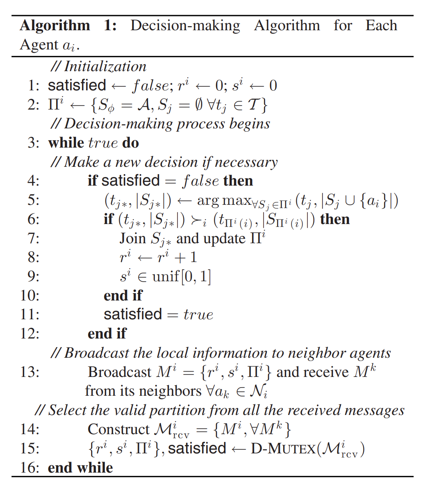
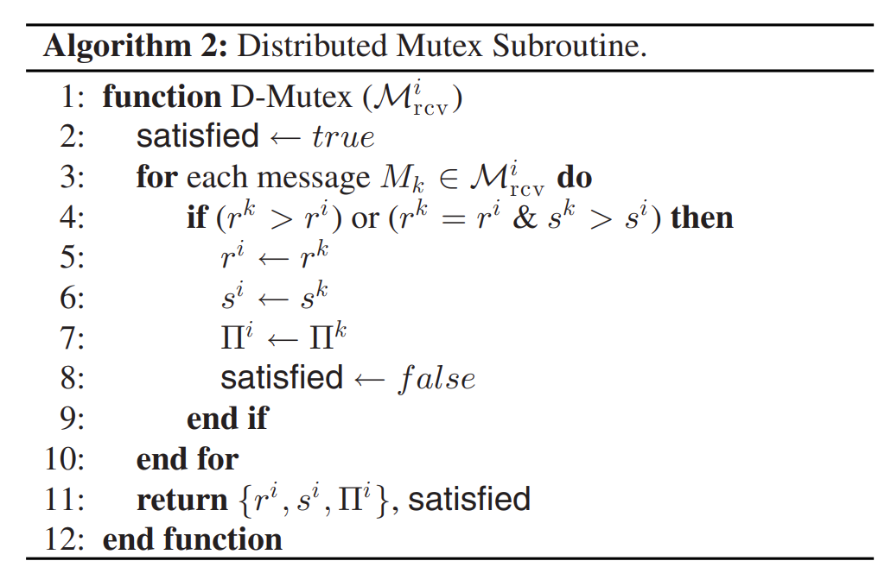

# Anonymous Hedonic Game for Task Allocation in a Large-Scale Multiple Agent System

用于在大规模多代理系统中分配任务的匿名享乐博弈

- TRO: IEEE Transactions on Robotics
- [doi](https://doi.org/10.1109/TRO.2018.2858292)

Abstract:

This paper proposes a **novel game-theoretical autonomous decision-making framework** to address a task allocation problem for a swarm of multiple agents. We consider cooperation of **self-interested** agents, and show that our proposed **decentralized** algorithm guarantees convergence of agents with **social inhibition** to a **Nash stable partition** (i.e., social agreement) within polynomial time. The algorithm is simple and executable based on local interactions with neighbor agents under a **strongly connected communication network** and even in **asynchronous environments**. We analytically present a mathematical formulation for computing the l**ower bound of suboptimality of the outcome**, and additionally show that at least 50% of suboptimality can be guaranteed if social utilities are nondecreasing functions with respect to the number of coworking agents. The results of numerical experiments confirm that the proposed framework is scalable, fast adaptable against dynamical environments, and robust even in a realistic situation.

本文提出了一种新的博弈论自主决策框架，以解决一群多个智能体的任务分配问题。我们考虑了**自利代理**的合作，并表明我们提出的去中心化算法保证了在多项式时间内具有社会抑制作用的代理收敛到纳什稳定分区（即社会协议）。该算法简单且可执行，基于在强连接通信网络下甚至在异步环境中与相邻代理的本地交互。我们分析性地提出了一个数学公式，用于计算结果的次优性下限，并且还表明，如果社会效用是相对于联合办公代理数量的非递减函数，则可以保证至少 50% 的次优性。数值实验的结果证实，所提出的框架是可扩展的，可以快速适应动态环境，即使在现实情况下也能保持鲁棒性。

Introduction
Related Work
Group Agent Partitioning and Placing Event
Analysis
GRAPE With Minmum Requirements
Simulation and Results
Conclusions

## Introduction

Cooperation of a large number of possibly small-sized robots, called robotic swarm, will play a significant role in complex missions that existing operational concepts using a few large robots could not handle [1]. Even if every single robot (or agent) in a swarm is incapable of accomplishing a task alone, their cooperation will lead to successful outcomes [2]–​[5]. The possible applications include surveillance [6], ad hoc network relay [7], disaster management [8], and cooperative radar jamming [9], to name a few.

大量可能小型机器人的协作，称为机器人群体，将在 在复杂任务中扮演重要角色，这些任务是现有使用少量大型机器人的操作概念无法处理的 [1] . 即使群体中的每一个机器人（或代理）都 无法独自完成任务，他们的合作将带来成功的成果 [2] –​ [5] 。可能的应用包括监控 [6] 、ad hoc 网络中继 [7] ，灾害管理 [8] ，以及协作雷达干扰 [9] ，仅举几例。

Due to the large cardinality of a swarm robot system, however, it is infeasible for human operators to supervise each agent directly, but needed to entrust the swarm with certain levels of decision-makings (e.g., task allocation, path planning, and individual control). Thereby, what only remains is to provide a high-level mission description, which is manageable for a few or even a single human operator. Nevertheless, there still exist various challenges in the autonomous decision-making of robotic swarms. Among them, this paper addresses a task allocation problem where the number of agents is higher than that of tasks: how to partition a set of agents into subgroups and assign the subgroups to each task. In the problem, it is assumed that each agent can be assigned to at most one task, whereas each task may require multiple agents: this case falls into single-task robot and multi-robot task (ST-MR) category [10], [11].

然而，由于群体机器人系统的基数庞大，人类操作员进行监督是不可行的 每个代理直接地，但需要将一定程度的决策（例如任务分配）委托给群体。 路径规划与个体控制）。因此，剩下的只是提供一个高层次的使命描述， 这对于少数甚至单个操作员来说是可控的。然而，仍然存在各种挑战 机器人群体自主决策。其中，本文解决了一个任务分配问题，其中 代理数量多于任务数量：如何将一组代理划分为子组并分配 将每个任务分配给子组。在问题中，假设每个代理最多只能被分配到一个任务，而 每个任务可能需要多个代理：这种情况属于单任务机器人和多机器人任务（ST-MR）类别 [10] , [11] .

According to [4], [5], and [12]–​[14], decision-making frameworks for a robotic swarm should be decentralized (i.e., the desired collective behavior can be achieved by individual agents relying on local information), scalable, predictable (e.g., regarding convergence performance and outcome quality), and adaptable to dynamic environments (e.g., unexpected elimination or addition of agents or tasks). Moreover, the frameworks are also desirable to be robust against asynchronous environments because, due to the large cardinality of the system and its decentralization, it is very challenging for every agent to behave synchronously. For synchronization in practice, “artificial delays and extra communication must be built into the framework” [14], which may cause considerable inefficiency on the system. In addition, it is also preferred to be capable of accommodating different interests of agents (e.g., different swarms operated by different organizations [15]).

根据 [4] 、 [5] 和 [12] –​ [14] ，机器人群体决策框架应具备去中心化（即期望的集体行为可通过个体代理依赖本地信息实现）、可扩展性、可预测性（例如，关于收敛性能与结果质量）以及适应动态环境的能力（如代理或任务的意外增减）。此外，框架还需在异步环境中保持鲁棒性，因为由于代理数量庞大， 系统及其去中心化特性使得每个代理同步行为极具挑战性。 在实践中，“必须在框架中构建人为延迟和额外通信” [14] ，这可能导致系统效率显著降低。此外，还希望系统能够适应不同代理的利益（例如，由不同组织操作的不同群体 [15] ）。

In this paper, we propose a novel decision-making framework based on hedonic games [16]–​[18]. The task allocation problem considered is modeled as a coalition-formation game where self-interest agents are willing to form coalitions to improve their own interests. The objective of this game is to find a Nash stable partition, which is a social agreement where all the agents agree with the current task assignment. Despite any possible conflicts between the agents, this paper shows that if they have social inhibition, then a Nash stable partition can always be determined within polynomial times in the proposed framework and all the desirable characteristics mentioned above can be achieved. Furthermore, we analyze the lower bound of the outcome's suboptimality and show that at least 50% is guaranteed for a particular case. Various settings of numerical experiments validate that the proposed framework is scalable, adaptable, and robust even in asynchronous environments.

本文提出了一种基于享乐博弈([16]–[18])的新型决策框架。所考虑的任务分配问题被建模为一个**联盟形成博弈**，其中自利主体愿意结成联盟以提高自身利益。该博弈的目标是找到一个纳什稳定划分，即所有主体都同意当前任务分配的社会协议。尽管主体之间可能存在冲突，但本文表明，如果他们具有社会抑制性，则可以在所提出的框架内以多项式时间确定纳什稳定划分，并且可以实现上述所有理想特性。此外，我们分析了结果次优性的下界，并证明在特定情况下至少保证 50%。数值实验的各种设置验证了所提出的框架在异步环境中也具有可扩展性、适应性和鲁棒性。

This paper is organized as follows. Section II reviews existing literature on decentralized multi-robot task allocation and introduces a recent finding in hedonic games that inspires this study. Section III proposes our decision-making framework, named GRAPE, and analytically proves the existence of and the polynomial-time convergence to a Nash stable partition. Section IV discusses the framework's algorithmic complexity, suboptimality, adaptability, and robustness. Section V shows that the framework can also address a task allocation problem in which each task may need a certain number of agents for completion. Numerical simulations in Section VI confirm that the proposed framework holds all the desirable characteristics. Finally, concluding remarks are given in Section VII.

本文组织结构如下。

- Section II 回顾了关于去中心化多机器人任务分配的现有文献，并介绍了启发本研究的一项关于享乐博弈的最新发现。
- Section III 提出了我们的决策框架，命名为 GRAPE，并从理论上证明了纳什稳定划分的存在性及其多项式时间收敛性。
- Section IV 讨论了该框架的算法复杂性、次优性、适应性和鲁棒性。
- Section V 表明该框架还能解决每个任务可能需要一定数量代理才能完成的任务分配问题。
- Section VI 中的数值模拟证实了 所提出的框架具备所有理想特性。
- 最后，Section VII 给出了结论性评述。

## Related Work

### A. Decentralized Coordination of Robotic Swarms

Existing approaches for task allocation problems can be categorized into two branches, depending on how agents eventually reach a converged outcome: orchestrated and (fully) self-organized approaches [19]. In the former, an additional mechanism such as a negotiation or voting model is imposed so that some agents can be worse off if a specific condition is met (e.g., the global utility is better off). Alternatively, in self-organized approaches, each agent simply makes a decision without negotiating with the other agents. The latter generally induce less resource consumption in communication and computation [20], and hence are preferable in terms of scalability. On the other hand, the former usually provide a better quality of solutions with respect to the global utility, and a certain level of suboptimality could be guaranteed [21]–​[23]. A comparison result between the two approaches [20] presents that as the available information to agents becomes local, the latter outperforms the former. The following review will focus on self-organized approaches because, for large-scale multiple agent systems, scalability is at least essential and each agent is likely to know information about its immediate surrounds rather than the global environment.

现有任务分配问题的方法可根据代理最终达成收敛结果的方式分为两大类：协调式和（完全）自组织式方法 [19] 。

- 前者中，引入了额外的机制，如协商或投票模型，使得在满足特定条件时（例如，全局效用更好），某些代理可能会处于不利地位。
- 相反，在自组织方法中，**每个代理只需做出决策，而无需与其他代理协商**。
- 后者通常在通信和计算方面消耗较少的资源 [20]，因此在可扩展性方面更受青睐。
- 另一方面，前者通常在全局效用方面提供更好的解决方案质量，并且可以保证一定程度的次优性 [21] –​ [23] 。
- 两种方法之间的比较结果 [20] 表明，随着代理可获得的信息变得局部化，后者优于前者。

以下综述将聚焦于**自组织方法**，因为对于大规模多代理系统而言，可扩展性至少是至关重要的，且每个代理更可能了解其直接周围环境的信息，而非全局环境。

**Self-organized approaches** can be categorized into top-down approaches and bottom-up approaches, according to the level (i.e., an ensemble versus individuals) mainly focused on.

Top-down approaches emphasize developing a macroscopic model for the whole system. For instance, population fractions associated with given tasks are represented as states, and the dynamics of the population fractions are modeled by Markov chains [12], [24]–​[26] or differential equations [27]–​[31]. Given a desired fraction distribution over the tasks, agents can converge to the desired status by following local decision policies from a macroscopic model (e.g., the associated rows or columns of the current Markov matrix). One advantage of using top-down approaches is predictability of average emergent behavior with regard to convergence speed and the quality of a stable outcome (i.e., how well the agents converge to the desired fraction distribution). However, such prediction, to the best of our knowledge, can be made mainly numerically. Besides, as top-down generated control policies regulate agents, it may be difficult to accommodate each agent's individual preference. Also, each agent may have to physically move around according to its local policy during the entire decision-making process, which may cause wastage of time and energy during the transitioning.

**自组织方法**可根据主要关注层面（即整体与个体）分为**自上而下方法**和**自下而上方法**。

**自上而下的方法**强调为整个系统开发**宏观模型**。例如，与特定任务相关的人口比例被表示为状态，而人口比例的动态则通过马尔可夫链[12]、[24]–[26]或微分方程[27]–[31]进行建模。给定任务上的期望比例分布，代理可以通过遵循宏观模型中的局部决策策略（例如，当前马尔可夫矩阵的相关行或列）收敛到期望状态。

使用自上而下方法的一个优势在于，平均紧急行为在收敛速度和稳定结果的质量（即代理收敛到所需分数分布的程度）方面的可预测性。然而，据我们所知，这种预测主要可以通过数值方法进行。此外，由于自上而下生成的控制策略调节代理，可能难以适应每个代理的个体偏好。同时，在整个决策过程中，每个代理可能必须根据其局部策略进行物理移动，这可能在过渡期间导致时间和能量的浪费。

Bottom-up approaches focus on designing each agent's individual rules (i.e., microscopic models) that eventually lead to a desired emergent behavior. Possible actions of a single agent can be modeled as a finite state machine [32], and a change of behavior occurs according to a **probabilistic threshold model** [33]. A threshold value in the model determines the decision boundary between two motions. This value is adjustable based on an agent's past experiences such as the time spent on working a task [19], [34], the success/failure rates [32], [35] , and direct communication from a central unit [33]. This feature can improve system adaptability, and may have the potential to incorporate each agent's individual interest if required. However, it was shown in [35]–​[41] that to predict or evaluate an emergent performance of a swarm operated by a bottom-up approach, a macroscopic model for the system is eventually required to be developed by abstracting the microscopic model.

**自下而上的方法**侧重于设计每个代理的个体规则（即**微观模型**），最终导致期望的涌现行为。单个代理的可能行为可以建模为有限状态机 [32] ，行为的变化则根据**概率阈值模型** [33] 发生。模型中的阈值决定了两种动作之间的决策边界。该值可根据代理的过往经验进行调整，例如完成任务所花费的时间 [19] [34] ，以及成功率/失败率 [32] [35]，以及来自中央单元的直接通信 [33] 。这一特性可以提高系统的适应性，并有可能在需要时融入每个代理的个体利益。然而， [35] – [41] 中表明，要预测或评估由自下而上方法操作的群体涌现性能，最终需要通过抽象微观模型来开发系统的宏观模型。

### B. Hedonic Games

Hedonic games [16]–​[18] model a conflict situation where self-interest agents are willing to form coalitions to improve their own interests. Nash stability [18] plays a key role since it yields a social agreement among the agents even without having any negotiation. Many researchers have investigated conditions under which a Nash stable partition is guaranteed to exist and to be determined [18], [42]–​[44]. Among them, the works in [43] and [44] mainly addressed anonymous hedonic games, in which each agent considers the size of a coalition to which it belongs instead of the identities of the members. Recently, Darmann [44] showed that selfish agents who have social inhibition (i.e., preference to a coalition with a fewer number of members) could converge to a Nash stable partition in an anonymous hedonic game. The author also proposed a centralized recursive algorithm that can find a Nash stable partition within O(n2a⋅nt) of iterations. Here, na is the number of agents and nt is the number of tasks.

享乐博弈[16]–[18]模拟了一种冲突情境，其中自利的代理愿意结成联盟以提升自身利益。**纳什稳定性** [18]在此扮演关键角色，因为它能在无需任何谈判的情况下促成代理间的社会共识。众多研究者已探讨了确保纳什稳定划分存在并可被确定的条件[18], [42]–[44]。其中，[43]和[44]的研究主要聚焦于**匿名享乐博弈**，在此类博弈中，每个代理关注的是其所属联盟的规模而非成员身份。最近，Darmann[44]揭示了具有**社交抑制**（即偏好成员较少的联盟）的自私代理在匿名享乐博弈中能够收敛至纳什稳定划分。作者还提出了一种集中式递归算法，能够找到纳什稳定 $O(n^2_a⋅n_t)$ 内的分区 迭代次数。这里， $n_a$ 是代理的数量 and $n_t$ 是任务的数量。

### C. Main Contributions

Inspired by the recent breakthrough of [44], we propose a novel decentralized framework that models the task allocation problem considered as an anonymous hedonic game. The proposed framework is a self-organized approach in which agents make decisions according to its local policies (i.e., individual preferences). Unlike top-down or bottom-up approaches reviewed in the previous section, which primarily concentrate on designing agents’ decision-making policies either macroscopically or microscopically, our work instead focuses on investigating and exploiting advantages from **socially inhibitive agents**, while simply letting them greedily behave according to their individual preferences. Explicitly, the main contributions of this paper are as follows.

受 [44] 近期突破的启发，我们提出了一种新颖的去中心化框架，将任务分配问题建模为匿名享乐博弈。该框架是一种自组织方法，其中代理根据其本地策略（即个人偏好）做出决策。与上一节回顾的自上而下或自下而上的方法不同，这些方法主要集中于宏观或微观地设计代理的决策策略，而我们的工作则侧重于研究和利用**社会抑制性代理**的优势，同时简单地让它们根据个人偏好贪婪地行为。具体而言，本文的主要贡献如下。

This paper shows that selfish agents with social inhibition, which we refer to as single-peaked-at-one (SPAO) preference (Definition 4 ), can reach a Nash stable partition within less algorithmic complexity compared with [44]: O(n2a) of iterations are required.1

本文展示了具有社交抑制的自私主体，我们称之为单峰偏好 (single-peaked-at-one preference)（SPAO）（定义 4 ），能够在较低的算法复杂度内达到纳什稳定分区 [44] : O(n2a) 次迭代是必需的。 1

- We provide a decentralized algorithm, which is executable under a **strongly connected communication network of agents** and even in **asynchronous environments**. Depending on the network assumed, the algorithmic complexity may be additionally increased by $O(dG)$, where $d_G<n_a$ is the graph diameter of the network.
- This paper analyzes the suboptimality of a Nash stable partition in term of the global utility. We firstly present a mathematical formulation to compute the suboptimality lower bound by using the information of a Nash stable partition and agents’ individual utilities. Furthermore, we additionally show that at least 50% of suboptimality can be guaranteed if the social utility for each coalition is defined as a nondecreasing function with respect to the number of members in the coalition.
- Our framework can accommodate different agents with different interests as long as their individual preferences hold SPAO.
- Through various numerical experiments, it is confirmed that the proposed framework is scalable, fast adaptable to environmental changes, and robust even in a realistic situation where some agents are temporarily unable to proceed a decision-making procedure and communicate with the other agents during a mission.

 

- 我们提供了一种去中心化算法，该算法可在强连通条件下执行代理的通信网络，甚至在异步环境中。根据所假设的网络，算法复杂度可能会额外增加 $O(d_G)$，其中$d_G<n_a$表示网络的图直径。
- 本文分析了**纳什稳定分区**在**全局效用**方面的**次优性**。我们首先提出了一种数学公式，利用纳什稳定分区的信息和代理的个体效用来计算**次优性下界**。此外，我们还进一步证明，如果每个联盟的**社会效用**被定义为联盟成员数量的**非递减函数**，则至少可以保证 50% 的次优性。
- 我们的框架能够容纳具有不同利益的不同代理，只要它们的个人偏好满足 SPAO。
- 通过各种数值实验证实，所提出的框架具有可扩展性，能够快速适应环境变化，并且在某些代理在任务期间暂时无法进行决策过程或与其他代理通信的现实情况下仍表现出鲁棒性。

| Symbol          | Description                                                                                                                                        |
| --------------- | -------------------------------------------------------------------------------------------------------------------------------------------------- |
| $\mathcal{A}$   | a set of $n_a$ agents                                                                                                                              |
| $a_i$           | the $i$-th agent                                                                                                                                   |
| $\mathcal{T}^*$ | a set of $n_t$ tasks                                                                                                                               |
| $t_j$           | the $j$-th task                                                                                                                                    |
| $t_\phi$        | the void task (i.e., not to work any task)                                                                                                         |
| $\mathcal{T}$   | a set of tasks, $\mathcal{T} = \mathcal{T}^* \cup \{t_\phi\}$                                                                                      |
| $(t_j, p)$      | a task-coalition pair (i.e., to do task $t_j$ with $p$ participants)                                                                               |
| $\mathcal{X}$   | the set of task-coalition pairs, $\mathcal{X} = \mathcal{X}^* \cup \{t_\phi\}$, where $\mathcal{X}^* = \mathcal{T}^* \times \{1, 2, \ldots, n_a\}$ |
| $\mathcal{P}_i$ | agent $a_i$'s preference relation over $\mathcal{X}$                                                                                               |
| $\gamma_i$      | the strong preference of agent $a_i$                                                                                                               |
| $\zeta_i$       | the indifferent preference of agent $a_i$                                                                                                          |
| $\Sigma_i$      | the weak preference of agent $a_i$                                                                                                                 |
| $\Pi$           | a partition: a disjoint set that partitions the agent set $\mathcal{A}$, $\Pi = \{S_1, S_2, \ldots, S_{n_t}, S_\phi\}$                             |
| $S_j$           | the (task-specific) coalition for $t_j$                                                                                                            |
| $\Pi(i)$        | the index of the task to which agent $a_i$ is assigned given $\Pi$                                                                                 |
| $d_G$           | the graph diameter of the agent communication network                                                                                              |
| $\mathcal{N}_i$ | The neighbor agent set of agent $a_i$ given a network                                                                                              |

## Group Agent Partitioning and Placing Event

### A. Problem Formulation

Let us frst introduce the multi-robot task allocation problem considered in this paper and underlying assumptions.

Problem1:

Suppose that there exist a set of $n_a$ agents $\mathcal{A}=\{a_{1},a_{2},...,a_{n_{a}}\}$ and a set of tasks $\mathcal{T}=\mathcal{T}^*\cup\{t_{\phi}\}$,where $\mathcal{T}^*=\{t_1,t_2,...,t_{n_t}\}$ is a set of $n_t$ tasks and $t_\phi$ is the void task (i.e., not to perform any task). Each agent $a_i$ has the individual utility $u_i:\mathcal{T}\times|\mathcal{A}|\to\mathbb{R}$, which is a function of the task to which the agent is assigned and the number of its coworking agents (including itself) $p\in\{1,2,\ldots,n_a\}$ called participants. The individual utility for $t_\phi$ is zero regardless of the participants. Since every agent is considered to have limited capabilities to fnish a task alone, the agent can be assigned to at most one task. The objective of this task allocation problem is to find an assignment that maximizes the global utility, which is the sum of individual utilities of the entire agents. The problem described above is defined as follows:

$$\max_{\{x_{ij}\}}\sum_{\forall a_i\in\mathcal{A}}\sum_{\forall t_j\in\mathcal{T}}u_i(t_j,p)x_{ij}$$

subject to

$$\sum\limits_{\forall t_j\in T}x_{ij}\leq1,\quad\forall a_i\in\mathcal{A}$$

$$x_{ij}\in\{0,1\},\quad\forall a_i\in\mathcal{A},\forall t_j\in\mathcal{T}$$

where $x_{ij}$ is a binary decision variable that indicates whether or not task $t_j$ is assigned to agent $a_i.$

The term social utility refers to the sum of individual utilities within any agent group.

Assumption l (Homogeneous agents with limited capabilities): This paper considers a large-scale multi-robot system of homogeneous agents since the realization of a swarm can be in general achieved through mass production [4]. Therefore, each individual utility $u_i$ is concerned with the cardinality of coworking agents. Note that agents in this paper may have different preferences with respect to the given tasks, e.g., for an agent, a spatially closer task is more preferred, whereas this may not be the case for another agent. Besides, noting that“mass production favors robots with fewer and cheaper components, resulting in lower cost but also reduced capabilities [45]," it is also assumed that each agent can only be assigned to perform at most a single task. According to[10], such a robot is called a ST robot.

Assumption 2 ( Agents' communication): The communication network of the entire agents is at least strongly connected, i.e., there exists a directed communication path between any two arbitrary agents. Given a network, $\mathcal{N}_i\subseteq\mathcal{A}$ denotes a set of neighbor agents for agent $a_i.$

Assumption 3 (MR-required tasks): Every task is a MR task, meaning that the task may require multiple robots[10]. For now, we assume that each task can be performed even by a single agent although it may take a long time. However, in Section V, we will also address a particular case in which some tasks need at least a certain number of agents for completion.

Assumption 4 (Agents’preknowninformation): Every agent $a_i$ only knows its own individual utility function $u_i$ with regard to every task, while not being aware of those of the other agents. Through communication, however, they can notice which agent currently chooses which task, i.e., partition (Definition 2). Note that the agents do not necessarily have to know the true partition information all the time. Each agent may own its locally known partition information.

### A. 问题描述

首先，我们介绍本文所考虑的多机器人任务分配问题及其基本假设。

**问题 1：**

假设存在一组 $n_a$ 个智能体 $\mathcal{A}=\{a_{1},a_{2},...,a_{n_{a}}\}$ 和一组任务 $\mathcal{T}=\mathcal{T}^*\cup\{t_{\phi}\}$，其中 $\mathcal{T}^*=\{t_1,t_2,...,t_{n_t}\}$ 是 $n_t$ 个任务的集合，$t_\phi$ 是空任务（即不执行任何任务）。每个智能体 $a_i$ 具有个体效用函数 $u_i:\mathcal{T}\times|\mathcal{A}|\to\mathbb{R}$，该函数取决于智能体被分配的任务以及其协作智能体（包括自身）的数量 $p\in\{1,2,\ldots,n_a\}$，称为参与者。对于空任务 $t_\phi$，无论参与者数量如何，个体效用均为零。由于每个智能体被认为单独完成任务的能力有限，因此每个智能体最多只能被分配到一个任务。该任务分配问题的目标是找到一个最大化全局效用的分配方案，全局效用是所有智能体的个体效用之和。上述问题定义如下：

$$\max_{\{x_{ij}\}}\sum_{\forall a_i\in\mathcal{A}}\sum_{\forall t_j\in\mathcal{T}}u_i(t_j,p)x_{ij}$$

约束条件为：

$$\sum\limits_{\forall t_j\in T}x_{ij}\leq1,\quad\forall a_i\in\mathcal{A}$$

$$x_{ij}\in\{0,1\},\quad\forall a_i\in\mathcal{A},\forall t_j\in\mathcal{T}$$

其中，$x_{ij}$ 是一个二元决策变量，表示任务 $t_j$ 是否被分配给智能体 $a_i$。

**社会效用**指的是任何智能体组内个体效用的总和。

**假设 1（能力有限的同质智能体）：**  
本文考虑大规模同质智能体的多机器人系统，因为群体机器人通常可以通过大规模生产实现[4]。因此，每个个体效用 $u_i$ 与协作智能体的数量相关。需要注意的是，本文中的智能体可能对给定任务有不同的偏好，例如，对于某个智能体，空间上更近的任务更受青睐，而另一个智能体可能并非如此。此外，注意到“大规模生产倾向于使用组件更少、成本更低的机器人，从而降低成本但也会减少能力[45]”，因此假设每个智能体最多只能被分配执行一个任务。根据[10]，这种机器人被称为**ST 机器人**。

**假设 2（智能体的通信）：**  
整个智能体的通信网络至少是强连通的，即任意两个智能体之间存在一条有向通信路径。给定一个网络，$\mathcal{N}_i\subseteq\mathcal{A}$ 表示智能体 $a_i$ 的邻居智能体集合。

**假设 3（多机器人需求任务）：**  
每个任务都是**多机器人任务**，意味着任务可能需要多个机器人来完成[10]。目前，我们假设每个任务即使由单个智能体执行也可以完成，尽管可能需要较长时间。然而，在第五节中，我们还将讨论某些任务需要至少一定数量的智能体才能完成的特殊情况。

**假设 4（智能体的预知信息）：**  
每个智能体 $a_i$ 仅知道其自身关于每个任务的个体效用函数 $u_i$，而不知道其他智能体的效用函数。然而，通过通信，它们可以注意到当前每个智能体选择了哪个任务，即分区（定义 2）。需要注意的是，智能体并不一定需要始终知道真实的分区信息。每个智能体可能拥有其本地已知的分区信息。

### B. Proposed Game-Theoretical Approach: GRAPE

Let's transform Problem 1 into an anonymous hedonic game event where every agent selfishly tends to join a coalition according to its preference.

**Definition 1 (GRAPE):** An instance of Group Agent Partitioning and Placing Event (GRAPE) is a tuple $(\mathcal{A}, \mathcal{T}, \mathcal{P})$ that consists of (1) $\mathcal{A} = \{a_1, a_2, \ldots, a_{n_a}\}$, a set of $n_a$ agents; (2) $\mathcal{T} = \mathcal{T}^* \cup \{t_\phi\}$, a set of tasks; and (3) $\mathcal{P} = (\mathcal{P}_1, \mathcal{P}_2, \ldots, \mathcal{P}_{n_a})$, an $n_a$-tuple of preference relations of the agents. For each agent $a_i$, $\mathcal{P}_i$ describes its preference relation over the set of task-coalition pairs $\mathcal{X} = \mathcal{X}^* \cup \{t_\phi\}$, where $\mathcal{X}^* = \mathcal{T}^* \times \{1, 2, \ldots, n_a\}$; a task-coalition pair $(t_j, p)$ is interpreted as "to do task $t_j$ with $p$ participants." For any task-coalition pairs $x_1, x_2 \in \mathcal{X}$, $x_1 \succ_i x_2$ implies that agent $a_i$ strongly prefers $x_1$ to $x_2$, and $x_1 \sim_i x_2$ means that the preference regarding $x_1$ and $x_2$ is indifferent. Likewise, $\succeq_i$ indicates the weak preference of agent $a_i$.

Note that agent $a_i$'s preference relation can be derived from its individual utility $u_i(t_j, p)$ in Problem 1. For instance, given that $u_i(t_1, p_1) > u_i(t_2, p_2)$, it can be said that $(t_1, p_1) \succ_i (t_2, p_2)$.

**Definition 2 (Partition):** Given an instance $(\mathcal{A}, \mathcal{T}, \mathcal{P})$ of GRAPe, a partition is defined as a set $\Pi = \{S_1, S_2, \ldots, S_{n_t}, S_\phi\}$ that disjunctively partitions the agent set $\mathcal{A}$. Here, $S_j \subseteq \mathcal{A}$ is the (task-specific) coalition for executing task $t_j$ such that $\bigcup_{j=0}^{n_t} S_j = \mathcal{A}$ and $S_j \cap S_k = \emptyset$ for $j \neq k$. $S_\phi$ is the set of agents who choose the void task $t_\phi$. Note that this paper interchangeably uses $S_0$ to indicate $S_\phi$. Given a partition $\Pi$, $\Pi(i)$ indicates the index of the task to which agent $a_i$ is assigned. For example, $S_{\Pi(i)}$ is the coalition that the agent belongs to, i.e., $S_{\Pi(i)} = \{S_j \in \Pi \mid a_i \in S_j\}$.

The objective of GRAPe is to determine a stable partition that all the agents agree with. In this paper, we seek for a Nash stable partition, which is defined as follows.

**Definition 3 (Nash stable):** A partition $\Pi$ is said to be Nash stable if, for every agent $a_i \in \mathcal{A}$, it holds that $(t_{\Pi(i)}, |S_{\Pi(i)}|) \succeq_i (t_j, |S_j \cup \{a_i\}|), \forall S_j \in \Pi$.

In other words, in a Nash stable partition, every agent prefers its current coalition to joining any of the other coalitions. Thus, every agent does not have any conflict within this partition, and no agent will not unilaterally deviate from its current decision.

**Remark 1 (An advantage of Nash stability):** The rationale behind the use of Nash stability among various stable solution concepts in hedonic games [16], [46]–[48] is that it can reduce communication burden between agents required to reach a social agreement. In the process of converging to a Nash stable partition, an agent does not need to get any permission from the other agents when it is willing to deviate. This property may not be the case for the other solution concepts. Therefore, each agent is only required to notify its altered decision without any negotiation. This fact can reduce inter-agent communication in the proposed approach.

让我们将**问题 1**转化为一个匿名享乐博弈事件，其中每个智能体都自私地倾向于根据其偏好加入某个联盟。

**定义 1（GRAPE）：**

一个 **群体智能体分区与放置事件（Group Agent Partitioning and Placing Event - GRAPE）** 的实例是一个元组 $(\mathcal{A}, \mathcal{T}, \mathcal{P})$，包括：

1. $\mathcal{A} = \{a_1, a_2, \ldots, a_{n_a}\}$，一组 $n_a$ 个智能体；
2. $\mathcal{T} = \mathcal{T}^* \cup \{t_\phi\}$，一组任务；
3. $\mathcal{P} = (\mathcal{P}_1, \mathcal{P}_2, \ldots, \mathcal{P}_{n_a})$，一个 $n_a$ 元组，表示智能体的偏好关系。

对于每个智能体 $a_i$，$\mathcal{P}_i$ 描述了其对任务-联盟对集合 $\mathcal{X} = \mathcal{X}^* \cup \{t_\phi\}$ 的偏好关系，其中 $\mathcal{X}^* = \mathcal{T}^* \times \{1, 2, \ldots, n_a\}$；任务-联盟对 $(t_j, p)$ 被解释为“与 $p$ 个参与者一起执行任务 $t_j$”。对于任意任务-联盟对 $x_1, x_2 \in \mathcal{X}$，$x_1 \succ_i x_2$ 表示智能体 $a_i$ 强烈偏好 $x_1$ 而非 $x_2$，而 $x_1 \sim_i x_2$ 表示对 $x_1$ 和 $x_2$ 的偏好无差异。类似地，$\succeq_i$ 表示智能体 $a_i$ 的弱偏好。

需要注意的是，智能体 $a_i$ 的偏好关系可以从问题 1 中的个体效用 $u_i(t_j, p)$ 推导出来。例如，如果 $u_i(t_1, p_1) > u_i(t_2, p_2)$，则可以认为 $(t_1, p_1) \succ_i (t_2, p_2)$。

**定义 2（分区 Partition）：**

给定一个 GRAPe 实例 $(\mathcal{A}, \mathcal{T}, \mathcal{P})$，**分区**被定义为一个集合 $\Pi = \{S_1, S_2, \ldots, S_{n_t}, S_\phi\}$，它将智能体集合 $\mathcal{A}$ 不重叠地划分。其中，$S_j \subseteq \mathcal{A}$ 是执行任务 $t_j$ 的（任务特定）联盟，满足 $\bigcup_{j=0}^{n_t} S_j = \mathcal{A}$ 且对于 $j \neq k$，$S_j \cap S_k = \emptyset$。$S_\phi$ 是选择空任务 $t_\phi$ 的智能体集合。注意，本文中 $S_0$ 和 $S_\phi$ 可以互换使用。给定一个分区 $\Pi$，$\Pi(i)$ 表示智能体 $a_i$ 被分配的任务的索引。例如，$S_{\Pi(i)}$ 是智能体所属的联盟，即 $S_{\Pi(i)} = \{S_j \in \Pi \mid a_i \in S_j\}$。

GRAPe 的目标是确定一个所有智能体都同意的稳定分区。在本文中，我们寻求一种**纳什稳定分区**，其定义如下。

**定义 3（纳什稳定）：**

一个分区 $\Pi$ 被称为**纳什稳定**，如果对于每个智能体 $a_i \in \mathcal{A}$，都满足 $(t_{\Pi(i)}, |S_{\Pi(i)}|) \succeq_i (t_j, |S_j \cup \{a_i\}|), \forall S_j \in \Pi$。

换句话说，在纳什稳定分区中，每个智能体都更倾向于其当前联盟，而不是加入任何其他联盟。因此，所有智能体在此分区中没有冲突，且没有智能体会单方面偏离其当前决策。

**备注 1（纳什稳定的优势）：**

在享乐博弈的各种稳定解概念中[16], [46]–[48]，使用纳什稳定的原因在于它可以减少智能体之间达成社会共识所需的通信负担。在收敛到纳什稳定分区的过程中，当智能体希望偏离时，它不需要获得其他智能体的许可。这一特性在其他解概念中可能并不成立。因此，每个智能体只需通知其决策的变化，而无需进行任何协商。这一事实可以减少所提出方法中智能体之间的通信。

### C. SPAO Preference: Social Inhibition

This section introduces the key condition, called $SPAO$, that enables our proposed approach to provide all the
desirable properties described in Section I, and then explains its implications.

Definition 4 (SPAO): Given an instance $(\mathcal{A},\mathcal{T},\mathcal{P})$ of GRAPE, it is said that the preference relation of agent $a_i$ with respect to task $t_j$ is SPAO if it holds that, for every $(t_j,p)\in\mathcal{X}^*,(t_j,p_1)\succeq_i(t_j,p_2)$ for any $p_1,p_2\in\{1,\ldots,n_a\}$ such that $p_1<p_2.$ Besides, we say that an instance $(\mathcal{A},\mathcal{T},\mathcal{P})$ of GRAPE is SPAO if the preference relation of every agent in $\mathcal{A}$ with respect to every task in $\mathcal{T}^*$ is SPAO.

For an example, suppose that $\mathcal{P}_i$ is such that

$$(t_1,1)\succ_i(t_1,2)\succeq_i(t_1,3)\succ_i(t_2,1)\sim_i(t_1,4)\succ_i(t_2,2).$$

This preference relation indicates that agent $a_i$ has $(t_1,1)\succ_i(t_1,2)\succeq_i(t_1,3)\succ_i(t_1,4)$ for task $t_1$,and $(t_2,1)\succ_i(t_2,2)$ for task $t_2.$ According to Definition $_4$, the preference relation for each of the tasks holds SPAO. For another example, given that

$$(t_1,1)\succ_i(t_1,2)\succeq_i(t_1,3)\succ_i(t_2,2)\sim_i(t_1,4)\succ_i(t_2,1)$$

the preference relation regarding task $t_1$ holds SPAO, whereas this is not the case for task $t_2$ because of
$(t_2,2)\succ_i(t_2,1).$

This paper only considers the case in which every agent has SPAO preference relations regarding all the given tasks
Such agents prefer to execute a task with smaller number of collaborators, i.e., they have social inhibition .

Remark 2 (Implications ofSPAO):

SPAO implies that an agent's individual utility should be a monotonically decreasing function with respect to the size of a coalition. In practice, SPAO can often emerge. For instance, experimental and simulation results in [ 49, Figs. 3 and 4] show that the total work capacity resulted from cooperation of multiple robots does not proportionally increase due to interferences of the robots. In such a nonsuperadditive environment[50], assuming that an agent's individual work efficiency is considered as its individual utility, the individual utility monotonically drops as the number of collaborators enlarges even though the social utility is increased. For another example, SPAO also arises when individual utilities are related with shared resources. As more agents use the same resource simultaneously, their individual productivities become diminished (e.g., traffic affects travel times [51], [52, Example 3]). As the authors in [50] pointed out, a nonsuperadditive case is more realistic than a superadditive case: agents in a superadditive environment always attempt to form the grand coalition whereas those in a nonsuperadditive case are willing to reduce unnecessary costs. Note that social utility functions are not restricted so that they can be either monotonic or nonmonotonic.

Remark 3 (Cooperation of selfish agents with different interests):

The proposed framework can accommodate selfish agents who greedily follow their individual preferences as long as the preferences hold SPAO. This implies that the framework may be utilized for a combination of swarm systems from different organizations under the condition that the multiple systems satisfy SPAO.

$$
\Delta _{\Pi (i)} := \min \limits _{{S}_j \in \Pi \setminus \lbrace {S}_{\Pi (i)}\rbrace } \max \limits _{\Delta \in \mathbb {Z}}\lbrace \Delta \mid (t_{\Pi (i)},|{S}_{\Pi (i)}| + \Delta)\succeq _i (t_j,|{S}_j \cup \lbrace a_i\rbrace |)\rbrace . \tag{4}
$$

### C. SPAO 偏好：社会抑制

本节介绍了一个关键条件，称为**SPAO**，它使得我们提出的方法能够提供第一节中描述的所有理想特性，并解释了其含义。

**定义 4（SPAO）：**

给定一个 GRAPE 实例 $(\mathcal{A},\mathcal{T},\mathcal{P})$，如果对于每个任务 $t_j$，智能体 $a_i$ 的偏好关系满足以下条件，则称其关于任务 $t_j$ 的偏好关系是**SPAO**的：对于任意 $(t_j,p)\in\mathcal{X}^*$，以及任意 $p_1,p_2\in\{1,\ldots,n_a\}$，若 $p_1<p_2$，则 $(t_j,p_1)\succeq_i(t_j,p_2)$。此外，如果 GRAPE 实例 $(\mathcal{A},\mathcal{T},\mathcal{P})$ 中每个智能体关于每个任务 $\mathcal{T}^*$ 的偏好关系都是 SPAO 的，则称该实例是 SPAO 的。

例如，假设 $\mathcal{P}_i$ 满足：

$$(t_1,1)\succ_i(t_1,2)\succeq_i(t_1,3)\succ_i(t_2,1)\sim_i(t_1,4)\succ_i(t_2,2).$$

这一偏好关系表明，智能体 $a_i$ 对于任务 $t_1$ 有 $(t_1,1)\succ_i(t_1,2)\succeq_i(t_1,3)\succ_i(t_1,4)$，对于任务 $t_2$ 有 $(t_2,1)\succ_i(t_2,2)$。根据定义 4，每个任务的偏好关系都满足 SPAO。再例如，给定：

$$(t_1,1)\succ_i(t_1,2)\succeq_i(t_1,3)\succ_i(t_2,2)\sim_i(t_1,4)\succ_i(t_2,1),$$

任务 $t_1$ 的偏好关系满足 SPAO，而任务 $t_2$ 的偏好关系不满足 SPAO，因为 $(t_2,2)\succ_i(t_2,1)$。

本文仅考虑每个智能体关于所有给定任务的偏好关系都满足 SPAO 的情况。这样的智能体倾向于与较少的协作者一起执行任务，即它们具有**社会抑制**特性。

**备注 2（SPAO 的含义）：**

SPAO 意味着智能体的个体效用应该是关于联盟规模的单调递减函数。在实践中，SPAO 经常出现。例如，文献[49, 图 3 和图 4]中的实验和仿真结果表明，多个机器人合作的总工作能力并不会成比例增加，这是由于机器人之间的干扰。在这种非超加性环境中[50]，假设智能体的个体工作效率被视为其个体效用，那么即使社会效用增加，个体效用也会随着协作者数量的增加而单调下降。再例如，当个体效用与共享资源相关时，SPAO 也会出现。随着更多智能体同时使用同一资源，它们的个体生产力会下降（例如，交通影响旅行时间[51], [52, 例 3]）。正如文献[50]所指出的，非超加性情况比超加性情况更现实：在超加性环境中，智能体总是试图形成大联盟，而在非超加性情况下，智能体则愿意减少不必要的成本。需要注意的是，社会效用函数不受限制，可以是单调的或非单调的。

**备注 3（具有不同利益的自私智能体的合作）：**

只要偏好满足 SPAO，所提出的框架就可以容纳那些贪婪地遵循其个体偏好的自私智能体。这意味着该框架可以用于不同组织的群体系统的组合，前提是这些系统满足 SPAO。

$$
\Delta _{\Pi (i)} := \min \limits _{{S}_j \in \Pi \setminus \lbrace {S}_{\Pi (i)}\rbrace } \max \limits _{\Delta \in \mathbb {Z}}\lbrace \Delta \mid (t_{\Pi (i)},|{S}_{\Pi (i)}| + \Delta)\succeq _i (t_j,|{S}_j \cup \lbrace a_i\rbrace |)\rbrace . \tag{4}
$$

### D. Existence of and Convergence to a Nash Stable Partition

Let us prove that if an instance of GRAPE holds SPAO, there always exists a Nash stable partition and it can be found within polynomial time.

Definition 5 (Iteration):

This paper uses the term iteration to represent an iterative stage in which a single arbitrary agent compares the set of selectable task-coalition pairs given an existing partition, and then exclusively updates the partition according to its individual preference. This paper refers to this agent as the deciding agent at the iteration. Based on the resultant partition, another deciding agent performs the same process at the next iteration, and this continues until every agent does not deviate from a specific partition, which is, in fact, a Nash stable partition.

Assumption 5 (Mutual exclusion algorithm):

To choose the deciding agent at each iteration, a mutual exclusion (or called mutex) algorithm is required in practice. In this section, for simplicity of description, we assume that all the agents are fully connected, by which they somehow select and know the deciding agent. However, in Section III-E, we will present a distributed mutex algorithm that enables the proposed approach to be executed under a strongly connected communication network even in an asynchronous manner.

Lemma 1: Given an instance $(\mathcal{A}, \mathcal{T}, \mathcal{P})$ of GRAPE that is SPAO, suppose that a new agent $a_r \notin \mathcal{A}$ holding a SPAO preference relation with regard to every task in $\mathcal{T}$ joins $(\mathcal{A}, \mathcal{T}, \mathcal{P})$ in which a Nash stable partition is already established. Then, the new instance $(\widetilde{\mathcal{A}}, \widetilde{\mathcal{T}}, \widetilde{\mathcal{P}})$, where $\widetilde{\mathcal{A}} = \mathcal{A} \cup \{a_r\}$ and $\widetilde{\mathcal{P}} = \mathcal{P} \cup \{p_r\}$, also (1) satisfies SPAO; (2) contains a Nash stable partition; and (3) the maximum number of iterations required to reconverge to a Nash stable partition is $|\widetilde{\mathcal{A}}|$.

Proof: Given a partition $\Pi$, for agent $a_i$, the number of additional coworkers tolerable in its coalition is defined as shown in (4) at the bottom of this page. Due to the SPAO preference relation, this value satisfies the following characteristics: (a) if $\Pi$ is Nash stable, for every agent $a_i$, it holds that $\Delta_{\Pi(i)} \geq 0$; (b) $\Delta_{\Pi(i)} < 0$ implies that agent $a_i$ is willing to deviate to another coalition at the next iteration; and (c) for the agent $a_i$ that deviated at the last iteration and updated the partition as $\Pi'$, it holds that $\Delta_{\Pi'(i)} \geq 0$.

From Definition 4, it is clear that the new instance $(\widetilde{\mathcal{A}}, \widetilde{\mathcal{T}}, \widetilde{\mathcal{P}})$ still holds SPAO. Let $\Pi_0$ denote a Nash stable partition in the original instance $(\mathcal{A}, \mathcal{T}, \mathcal{P})$. When a new agent $a_r \notin \mathcal{A}$ decides to execute one of the tasks in $\mathcal{T}$ and creates a new partition $\Pi_1$, it holds that $\Delta_{\Pi_1(r)} \geq 0$, as shown in (c). If there is no existing agent $a_q \in \mathcal{A}$ whose $\Delta_{\Pi_1(q)} < 0$, then the new partition $\Pi_1$ is Nash stable.

Suppose that there exists at least an agent $a_q$ whose $\Delta_{\Pi_1(q)} < 0$. Then, the agent must be one of the existing members in the coalition that agent $a_r$ selected in the last iteration. As agent $a_q$ moves to another coalition and creates a new partition $\Pi_2$, the previously deviated agent $a_r$ holds $\Delta_{\Pi_2(r)} \geq 1$. In other words, an agent who deviates to a coalition and expels one of the existing agents in that coalition will not deviate again even if another agent joins the coalition in a next iteration. This implies that at most $|\widetilde{\mathcal{A}}|$ of iterations are required to hold $\Delta_{\widetilde{\Pi}(i)} \geq 0$ for every agent $a_i \in \widetilde{\mathcal{A}}$, where the partition $\widetilde{\Pi}$ is Nash stable.

Lemma 1 is essential not only for the existence of and convergence to a Nash stable partition but also for fast adaptability to dynamic environments.

Theorem 1 (Existence): If $(\mathcal{A}, \mathcal{T}, \mathcal{P})$ is an instance of GRAPE holding SPAO, then a Nash stable partition always exists.

Proof: This theorem will be proved by induction. Let $M(n)$ be the following mathematical statement: for $|\mathcal{A}| = n$, if an instance $(\mathcal{A}, \mathcal{T}, \mathcal{P})$ of GRAPE is SPAO, then there exists a Nash stable partition.

Base case: When $n = 1$, there is only one agent in an instance. This agent is allowed to participate in its most preferred coalition, and the resultant partition is Nash stable. Therefore, $M(1)$ is true.

Induction hypothesis: Assume that $M(k)$ is true for a positive integer $k$ such that $|\mathcal{A}| = k$.

Induction step: Suppose that a new agent $a_i \notin \mathcal{A}$ whose preference relation regarding every task in $\mathcal{T}$ is SPAO joins the instance $(\mathcal{A}, \mathcal{T}, \mathcal{P})$. This induces a new instance $(\tilde{\mathcal{A}}, \tilde{\mathcal{T}}, \tilde{\mathcal{P}})$ where $\tilde{\mathcal{A}} = \mathcal{A} \cup \{a_i\}$ and $|\tilde{\mathcal{A}}| = k + 1$. From Lemma 1, it is clear that the new instance also satisfies SPAO and has a Nash stable partition $\tilde{\Pi}$. Consequently, $M(k+1)$ is true. By mathematical induction, $M(n)$ is true for all positive integers $n \geq 1$.

Theorem 2 (Convergence): If $(\mathcal{A}, \mathcal{T}, \mathcal{P})$ is an instance of GRAPE holding SPAO, then the number of iterations required to determine a Nash stable partition is at most $|\mathcal{A}| \cdot (\lvert\mathcal{A}\rvert + 1)/2$.

Proof: Suppose that, given a Nash stable partition in an instance where there exists only one agent, we add another arbitrary agent and find a Nash stable partition for this new instance, and repeat the procedure until all the agents in $\mathcal{A}$ are included. From Lemma 1, if a new agent joins an instance in which the current partition is Nash stable, then the maximum number of iterations required to find a new Nash stable partition is the number of the existing agents plus one. Therefore, it is trivial that the maximum number of iterations to find a Nash stable partition of an instance $(\mathcal{A}, \mathcal{T}, \mathcal{P})$ is given as

$$\sum_{k=1}^{|\mathcal{A}|} k = |\mathcal{A}| \cdot (\lvert\mathcal{A}\rvert + 1)/2.$$

Note that this polynomial-time convergence still holds even if the agents are initialized to a random partition.
Suppose that we have the following setting: the entire agents $\mathcal{A}$ are firstly not movable from the existing partition, except a set of free agents $\mathcal{A}^{\prime}\subseteq\mathcal{A};$ whenever the agents $\mathcal{A}^{\prime}$ find a Nash stable partition $\Pi^{\prime}$, one arbitrary agent in $a_r\in\mathcal{A}\setminus\mathcal{A}^{\prime}$ additionally becomes liberated and deviates from the current coalition $S_\Pi^{\prime}(r)$ to another coalition in $\Pi^\prime.$
In this setting, from the viewpoint of the agents in $\mathcal{A}^\prime\setminus S_{\Pi^{\prime}(r)}$ ,the newly liberated agent is considered as the new
agent in Lemma 1. Accordingly, we can still utilize the lemma for the agents in $\mathcal{A}^{\prime}\setminus S_{\Pi^{\prime}(r)}\cup\{a_r\}.$ The agents also can
find a Nash stable partition if one of them moves to $S_{\Pi^{\prime}(r)}$ during the process, because, due to $a_r$, it became
$\Delta_{\Pi^{\prime}(i)}\geq1$ for every agent $a_i\in S_\Pi^{\prime}(r)\setminus\{a_r\}$ .In a nutshell, the agents $\mathcal{A}^\prime\cup\{a_r\}$ can converge to a Nash stable
partition within $|\mathcal{A}^\prime\cup\{a_r\}|$,

which is equivalent to Lemma 1. Hence, Theorem 1 and this theorem are also valid for the case when the initial partition of the agents are randomly given. ■

### D. 纳什稳定分区的存在性与收敛性

让我们证明，如果一个 GRAPE 实例满足 SPAO 条件，那么纳什稳定分区总是存在，并且可以在多项式时间内找到。

**定义 5（迭代）：**  
本文使用**迭代**一词来表示一个迭代阶段，在该阶段中，单个任意智能体在给定现有分区的情况下比较可选的任务-联盟对集合，然后根据其个体偏好更新分区。本文将这一智能体称为该迭代的**决策智能体**。基于生成的分区，另一个决策智能体在下一个迭代中执行相同的过程，直到所有智能体不再偏离某个特定分区，该分区实际上是一个纳什稳定分区。

**假设 5（互斥算法）：**  
为了在每个迭代中选择决策智能体，实践中需要一个互斥（mutex）算法。在本节中，为了简化描述，我们假设所有智能体都是完全连接的，因此它们可以通过某种方式选择并知道决策智能体。然而，在第三节 E 部分，我们将提出一种分布式互斥算法，使所提出的方法能够在强连通通信网络中以异步方式执行。

**引理 1：**  
给定一个满足 SPAO 的 GRAPE 实例 $(\mathcal{A}, \mathcal{T}, \mathcal{P})$，假设一个新的智能体 $a_r \notin \mathcal{A}$ 加入该实例，且该智能体关于 $\mathcal{T}$ 中每个任务的偏好关系也满足 SPAO。此时，新的实例 $(\widetilde{\mathcal{A}}, \widetilde{\mathcal{T}}, \widetilde{\mathcal{P}})$，其中 $\widetilde{\mathcal{A}} = \mathcal{A} \cup \{a_r\}$ 且 $\widetilde{\mathcal{P}} = \mathcal{P} \cup \{p_r\}$，也满足以下条件：

1. 满足 SPAO；
2. 包含一个纳什稳定分区；
3. 重新收敛到纳什稳定分区所需的最大迭代次数为 $|\widetilde{\mathcal{A}}|$。

**证明：**  
给定一个分区 $\Pi$，对于智能体 $a_i$，其联盟中可容忍的额外协作者数量定义如(4)式所示。由于 SPAO 偏好关系，该值满足以下特性：  
(a) 如果 $\Pi$ 是纳什稳定的，则对于每个智能体 $a_i$，有 $\Delta_{\Pi(i)} \geq 0$；  
(b) $\Delta_{\Pi(i)} < 0$ 表示智能体 $a_i$ 愿意在下一个迭代中偏离到另一个联盟；  
(c) 对于在上一个迭代中偏离并更新分区为 $\Pi'$ 的智能体 $a_i$，有 $\Delta_{\Pi'(i)} \geq 0$。

根据定义 4，显然新的实例 $(\widetilde{\mathcal{A}}, \widetilde{\mathcal{T}}, \widetilde{\mathcal{P}})$ 仍然满足 SPAO。设 $\Pi_0$ 表示原始实例 $(\mathcal{A}, \mathcal{T}, \mathcal{P})$ 中的一个纳什稳定分区。当新智能体 $a_r \notin \mathcal{A}$ 决定执行 $\mathcal{T}$ 中的一个任务并创建一个新分区 $\Pi_1$ 时，如(c)所示，有 $\Delta_{\Pi_1(r)} \geq 0$。如果不存在现有智能体 $a_q \in \mathcal{A}$ 使得 $\Delta_{\Pi_1(q)} < 0$，则新分区 $\Pi_1$ 是纳什稳定的。

假设存在至少一个智能体 $a_q$ 使得 $\Delta_{\Pi_1(q)} < 0$。那么，该智能体必须是上一个迭代中智能体 $a_r$ 选择的联盟中的现有成员之一。当智能体 $a_q$ 移动到另一个联盟并创建新分区 $\Pi_2$ 时，先前偏离的智能体 $a_r$ 满足 $\Delta_{\Pi_2(r)} \geq 1$。换句话说，一个偏离到某个联盟并驱逐该联盟中现有智能体的智能体，即使另一个智能体在下一个迭代中加入该联盟，也不会再次偏离。这意味着最多需要 $|\widetilde{\mathcal{A}}|$ 次迭代才能使每个智能体 $a_i \in \widetilde{\mathcal{A}}$ 满足 $\Delta_{\widetilde{\Pi}(i)} \geq 0$，其中分区 $\widetilde{\Pi}$ 是纳什稳定的。

引理 1 不仅对纳什稳定分区的存在性和收敛性至关重要，还对动态环境中的快速适应性具有重要意义。

**定理 1（存在性）：**  
如果 $(\mathcal{A}, \mathcal{T}, \mathcal{P})$ 是一个满足 SPAO 的 GRAPE 实例，则纳什稳定分区总是存在。

**证明：**  
本定理将通过归纳法证明。设 $M(n)$ 为以下数学命题：对于 $|\mathcal{A}| = n$，如果一个 GRAPE 实例 $(\mathcal{A}, \mathcal{T}, \mathcal{P})$ 满足 SPAO，则存在一个纳什稳定分区。

**基例：**  
当 $n = 1$ 时，实例中只有一个智能体。该智能体可以参与其最偏好的联盟，生成的分区是纳什稳定的。因此，$M(1)$ 成立。

**归纳假设：**  
假设对于正整数 $k$，$|\mathcal{A}| = k$，$M(k)$ 成立。

**归纳步骤：**  
假设一个新的智能体 $a_i \notin \mathcal{A}$ 加入实例 $(\mathcal{A}, \mathcal{T}, \mathcal{P})$，且该智能体关于 $\mathcal{T}$ 中每个任务的偏好关系满足 SPAO。这将生成一个新的实例 $(\tilde{\mathcal{A}}, \tilde{\mathcal{T}}, \tilde{\mathcal{P}})$，其中 $\tilde{\mathcal{A}} = \mathcal{A} \cup \{a_i\}$ 且 $|\tilde{\mathcal{A}}| = k + 1$。根据引理 1，显然新实例也满足 SPAO 并具有一个纳什稳定分区 $\tilde{\Pi}$。因此，$M(k+1)$ 成立。通过数学归纳法，$M(n)$ 对所有正整数 $n \geq 1$ 成立。

**定理 2（收敛性）：**  
如果 $(\mathcal{A}, \mathcal{T}, \mathcal{P})$ 是一个满足 SPAO 的 GRAPE 实例，则确定一个纳什稳定分区所需的迭代次数最多为 $|\mathcal{A}| \cdot (\lvert\mathcal{A}\rvert + 1)/2$。

**证明：**  
假设在一个仅包含一个智能体的实例中给定一个纳什稳定分区，我们添加另一个任意智能体并找到该新实例的纳什稳定分区，然后重复此过程，直到包含 $\mathcal{A}$ 中的所有智能体。根据引理 1，如果一个新智能体加入一个当前分区为纳什稳定的实例，则找到新的纳什稳定分区所需的最大迭代次数为现有智能体数量加一。因此，显然找到实例 $(\mathcal{A}, \mathcal{T}, \mathcal{P})$ 的纳什稳定分区所需的最大迭代次数为

$$\sum_{k=1}^{|\mathcal{A}|} k = |\mathcal{A}| \cdot (\lvert\mathcal{A}\rvert + 1)/2.$$

需要注意的是，即使智能体初始化为随机分区，这种多项式时间收敛性仍然成立。  
假设我们有以下设置：所有智能体 $\mathcal{A}$ 最初无法从现有分区中移动，除了一组自由智能体 $\mathcal{A}^{\prime}\subseteq\mathcal{A};$ 每当智能体 $\mathcal{A}^{\prime}$ 找到一个纳什稳定分区 $\Pi^{\prime}$，一个任意智能体 $a_r\in\mathcal{A}\setminus\mathcal{A}^{\prime}$ 会额外被释放并从当前联盟 $S_\Pi^{\prime}(r)$ 偏离到 $\Pi^\prime$ 中的另一个联盟。  
在这种设置下，从 $\mathcal{A}^\prime\setminus S_{\Pi^{\prime}(r)}$ 的角度来看，新释放的智能体被视为引理 1 中的新智能体。因此，我们仍然可以对 $\mathcal{A}^{\prime}\setminus S_{\Pi^{\prime}(r)}\cup\{a_r\}$ 使用引理 1。如果其中一个智能体在过程中移动到 $S_{\Pi^{\prime}(r)}$，则这些智能体也可以找到一个纳什稳定分区，因为由于 $a_r$，对于每个智能体 $a_i\in S_\Pi^{\prime}(r)\setminus\{a_r\}$，有 $\Delta_{\Pi^{\prime}(i)}\geq1$。简而言之，智能体 $\mathcal{A}^\prime\cup\{a_r\}$ 可以在 $|\mathcal{A}^\prime\cup\{a_r\}|$ 次迭代内收敛到一个纳什稳定分区，这与引理 1 等价。因此，定理 1 和本定理在智能体初始化为随机分区的情况下也成立。 ■

### E. Decentralized Algorithm

In the previous section, it was assumed that only one agent is somehow chosen as the deciding agent at each iteration under the fully connected network. On the contrary, in this section, we propose a decentralized algorithm, as shown in Algorithm 1, in which every agent does decision-making based on its local information and affects its neighbors simultaneously under a strongly connected network. Despite that, we show that Theorems 1 and 2 still hold thanks to our proposed distributed mutex subroutine shown in Algorithm 2. The details of the decentralized main algorithm are as follows.

在上一节中，假设在全连接网络下的每次迭代中只有一个代理被以某种方式选为决定代理。相反，在本节中，我们提出了一种去中心化算法，如算法 1 所示，其中每个代理都根据其本地信息进行决策，并在强连接网络下同时影响其邻居。尽管如此，我们表明定理 1 和 2 仍然成立，这要归功于我们在算法 2 中所示的提出的分布式互斥锁子例程。去中心化主算法的详细信息如下。

  

  

Each agent $a_i$ has local variables such as $\Pi ^i, \textbf{satisfied}, r^i$, and $s^i$ (Lines 1-2). Here, $\Pi^i$ is the agent's locally known partition; satisfied is a binary variable that indicates whether or not the agent is satisfied with $\Pi^{i}$ such that it does not want to deviate from its current coalition; $r^i\in\mathbb{Z}^+$ is an integer variable to represent how many times $\Pi^i$ has evolved (i.e, the number of iterations happened for updating $\Pi^i$ until that moment); and $s^i\in[0,1]$ is a uniform-random variable that is generated whenever $\Pi^{\iota}$ is newly updated (i.e, a random time stamp). Given $\Pi^\iota$,agent $a_i$ examines which coalition is the most preferred among others, assuming that the other agents remain at the existing coalitions (Line 5).Then, the agent joins the newly found coalition if it is strongly preferred than its current coalition. In this case, the agent updates $\Pi^i$ to reflect its new decision, increases $r^i$, and generates a new random time stamp $s^i$ (Lines 6-10). In any case, the agent ascertained that the currently selected coalition is the most preferred, so the agent becomes satisfied with $\Pi^i$ (Line 11). Then, agent $a_i$ generates and sends a message $M^i:=\{r^i,s^i,\Pi^i\}$ to its neighbor agents, and vice versa (Line 13).

Since every agent locally updates its locally known partition simultaneously, one of the partitions should be regarded as if it were the partition updated by a deciding agent at the previous iteration. We refer to this partition as the valid partition at the iteration. The distributed mutex subroutine in Algorithm 2 enables the agents to recognize the valid partition among all the locally known current partitions even under a strongly connected network and in asynchronous environments. Before executing this subroutine, each agent $a_i$ collects all the messages received from its neighbor agents $\forall a_k\in \mathcal{N} _i$ ( including $M^i)$ as $\mathcal{M}_\mathrm{rcv}^i=\{M^i,\forall M^k\}.$ Using this message set, the agent examines whether or not its own partition $\Pi^i$ is valid. If there exists any other partition $\Pi^k$ such that $r^k>r^i$,then the agent considers $\Pi^k$ more valid than $\Pi^i.$ This also happens if $r^k=r^i$ and $s^k>s^i$,which indicates the case where $\Pi^k$ and $\Pi^i$ have evolved over the same amount of time, but the former has a higher time stamp. Since $\Pi^k$ is considered as more valid, agent $a_i$ will need to re-examine if there is a more preferred coalition, given $\Pi^k$ in the next iteration Thus, the agent sets satisfied as false ( Lines 3-1o in Algorithm 2). After completing this subroutine, depending om satisfied, each agent proceeds the decision-making process again (i.e., Lines 4-12 in Algorithm 1) and/or just broadcasts the existing locally known partition to its neighbor agents (Line $1_3$ in Algorithm 1).

In a nutshell, the distributed mutex algorithm makes sure that there is only one valid partition that dominates (or will finally dominate depending on the communication network) any other partitions. In other words, multiple partitions locally evolve, but one of them eventually survives as long as a strongly connected network is given. From each partition's viewpoint, it can be regarded as being evolved by a random sequence of the agents under the fully connected network. Thus, the partition becomes Nash stable within the polynomial time as shown in Theorem 2. In an extreme case, we may encounter multiple Nash stable partitions at the very last. Nevertheless, thanks to the mutex algorithm, one of them can be distributedly selected by the agents. All the features imply that agents using Algorithm 1 can find a Nash stable partition in a decentralized manner and Theorems 1 and 2 still hold.

每个智能体 $a_i$ 都有局部变量，例如 $\Pi^i$、$\textbf{satisfied}$、$r^i$ 和 $s^i$（第 1-2 行）。其中，$\Pi^i$ 是智能体本地已知的分区；$\textbf{satisfied}$ 是一个二元变量，表示智能体是否对 $\Pi^i$ 感到满意，即是否不愿意偏离其当前联盟；$r^i\in\mathbb{Z}^+$ 是一个整数变量，表示 $\Pi^i$ 已经演化的次数（即到目前为止更新 $\Pi^i$ 的迭代次数）；$s^i\in[0,1]$ 是一个均匀随机变量，每当 $\Pi^i$ 被更新时生成（即一个随机时间戳）。给定 $\Pi^i$，智能体 $a_i$ 检查在其他智能体保持现有联盟的情况下，哪个联盟是最优选的（第 5 行）。然后，如果新找到的联盟比当前联盟更受青睐，智能体将加入该联盟。在这种情况下，智能体更新 $\Pi^i$ 以反映其新决策，增加 $r^i$，并生成一个新的随机时间戳 $s^i$（第 6-10 行）。无论如何，智能体确认当前选择的联盟是最优选的，因此智能体对 $\Pi^i$ 感到满意（第 11 行）。接着，智能体 $a_i$ 生成并发送消息 $M^i:=\{r^i,s^i,\Pi^i\}$ 给其邻居智能体，反之亦然（第 13 行）。

由于每个智能体同时本地更新其本地已知的分区，其中一个分区应被视为由上一个迭代中的决策智能体更新的分区。我们将此分区称为该迭代中的**有效分区**。算法 2 中的分布式互斥子程序使智能体能够在强连通网络和异步环境中识别所有本地已知当前分区中的有效分区。在执行此子程序之前，每个智能体 $a_i$ 收集从其邻居智能体 $\forall a_k\in \mathcal{N}_i$（包括 $M^i$）接收到的所有消息，记为 $\mathcal{M}_\mathrm{rcv}^i=\{M^i,\forall M^k\}$。使用此消息集，智能体检查其自己的分区 $\Pi^i$ 是否有效。如果存在任何其他分区 $\Pi^k$ 使得 $r^k>r^i$，则智能体认为 $\Pi^k$ 比 $\Pi^i$ 更有效。如果 $r^k=r^i$ 且 $s^k>s^i$，也会发生这种情况，这表明 $\Pi^k$ 和 $\Pi^i$ 已经演化了相同的时间，但前者具有更高的时间戳。由于 $\Pi^k$ 被认为是更有效的，智能体 $a_i$ 需要在下一个迭代中重新检查是否存在更优选的联盟，给定 $\Pi^k$。因此，智能体将 $\textbf{satisfied}$ 设置为 false（算法 2 的第 3-10 行）。完成此子程序后，根据 $\textbf{satisfied}$ 的值，每个智能体再次进行决策过程（即算法 1 的第 4-12 行）或仅将现有的本地已知分区广播给其邻居智能体（算法 1 的第 13 行）。

简而言之，分布式互斥算法确保只有一个有效分区主导（或最终主导，取决于通信网络）其他所有分区。换句话说，多个分区在本地演化，但只要给定强连通网络，其中一个分区最终会存活下来。从每个分区的角度来看，它可以被视为在完全连接的网络下由智能体的随机序列演化而来。因此，如定理 2 所示，分区在多项式时间内变为纳什稳定的。在极端情况下，我们可能在最后遇到多个纳什稳定分区。然而，由于互斥算法，智能体可以分布式地选择其中一个分区。所有这些特性表明，使用算法 1 的智能体能够以去中心化的方式找到纳什稳定分区，且定理 1 和定理 2 仍然成立。

## Analysis

### A. Algorithmic Complexity (Scalability)

First, let us discuss the running time for the proposed framework to find a Nash stable partition. This paper refers to a unit time required for each agent to proceed the main loop of Algorithm 1 (Line 4–15) as a time step. Depending on the communication network considered, especially if it is not fully connected, it may be possible that some of the given agents have to execute this loop to just propagate their locally known partition information without affecting ri as Line 1. Because this process also spends a unit time step, we call it as dummy iteration to distinguish from an ( normal) iteration, which increases ri.

Notice that such dummy iterations happen sequentially at most $d_G$ times before a normal iteration occurs, where $d_G$ is the graph diameter of the communication network. Hence, thanks to Theorem 2, the total required time steps until finding a Nash stable partition is $O(d_Gn_a^2)$. For the fully connected network case, it becomes $O(n_a^2)$ because of $d_G=1$. Note that this algorithmic complexity is less than that of the centralized algorithm, i.e., $O(n_a^2 \cdot n_t)$, in [44].

Every agent at each iteration investigates $n_t+1$ of selectable task-coalition pairs including $t_\phi$, given a locally known valid partition (as shown in Line 5 in Algorithm 1). Therefore, the computational overhead for an agent is $O(n_t)$ per any iteration. Considering the total required time steps, the running time of the proposed approach for an agent can be bounded by $O(d_Gn_tn_a^2)$. Note that the running time in practice can be much less than the bound since Theorem 2 was conservatively analyzed, as described in the following remark.

Remark 4 (The number of required iterations in practice): Algorithm 1 allows the entire agents in $\mathcal{A}$ to be involved in the decision-making process, whereas, in the proof for Theorem 2, a new agent can be involved after a Nash stable partition of existing agents is found. Since agents using Algorithm 1 do not need to find every Nash stable partition for each subset of the agents, unnecessary iterations can be reduced. Hence, the number of required iterations in practice may become less than that shown in Theorem 2, which is also supported by the experimental results in Section VI-B.

Let us now discuss the communication overhead for each agent per iteration. Given a network, agent $a_i$ should communicate with $|\mathcal{N}_i|$ of its neighbors, and the size of each message grows with regard to $n_a$. Hence, the communication overhead of the agent is $O(|\mathcal{N}_i| \cdot n_a)$. It could be quadratic if $|\mathcal{N}_i|$ increases in proportion to $n_a$. However, this would rarely happen in practice due to spatial distribution of agents and physical limits on communication such as range limitation. Instead, $|\mathcal{N}_i|$ would be most likely saturated.

Remark 5 (Communication overhead versus running time): To reduce the communication overhead, we may impose the maximum number of transactions per iteration, denoted by $n_c$, on each agent. Even so, Theorems 1 and 2 are still valid as long as the union of underlying graphs of the communication networks over time intervals becomes connected. However, in return, the number of dummy iterations may increase, so does the framework's running time. In an extreme case where $n_c=1$ (i.e., unicast mode), dummy iterations may happen in a row at most $n_a$ times. Thus, the total required time steps until finding a Nash stable partition could be $O(n_a^3)$, whereas the communication overhead is $O(n_a)$. In short, the running time of the framework can be traded off against the communication overhead for each agent per iteration.

### A. 算法复杂度（可扩展性）

首先，我们讨论所提出框架找到纳什稳定分区所需的运行时间。本文将每个智能体执行算法 1 主循环（第 4-15 行）所需的单位时间称为一个**时间步**。根据所考虑的通信网络（尤其是非完全连接的网络），某些智能体可能只需执行此循环以传播其本地已知的分区信息，而不会影响 $r^i$（如第 1 行所示）。由于此过程也消耗一个单位时间步，我们称之为**虚拟迭代**，以区别于增加 $r^i$ 的（正常）迭代。

需要注意的是，这种虚拟迭代在正常迭代发生之前最多会连续发生 $d_G$ 次，其中 $d_G$ 是通信网络的图直径。因此，得益于定理 2，找到纳什稳定分区所需的总时间步为 $O(d_Gn_a^2)$。对于完全连接的网络，由于 $d_G=1$，其复杂度为 $O(n_a^2)$。需要注意的是，该算法复杂度低于文献[44]中集中式算法的复杂度 $O(n_a^2 \cdot n_t)$。

在每次迭代中，每个智能体在给定本地已知的有效分区的情况下，检查 $n_t+1$ 个可选的任务-联盟对（包括 $t_\phi$）（如算法 1 第 5 行所示）。因此，每个智能体在每次迭代中的计算开销为 $O(n_t)$。考虑到总时间步，所提出方法对每个智能体的运行时间上限为 $O(d_Gn_tn_a^2)$。需要注意的是，实际运行时间可能远低于此上限，因为定理 2 的分析是保守的，如下文备注所述。

**备注 4（实践中所需的迭代次数）：**  
算法 1 允许 $\mathcal{A}$ 中的所有智能体参与决策过程，而在定理 2 的证明中，新智能体只有在找到现有智能体的纳什稳定分区后才能参与。由于使用算法 1 的智能体不需要为每个智能体子集找到每个纳什稳定分区，因此可以减少不必要的迭代。因此，实践中所需的迭代次数可能少于定理 2 中所示的结果，第六节 B 部分的实验结果也支持这一点。

现在，我们讨论每个智能体每次迭代的通信开销。给定一个网络，智能体 $a_i$ 需要与其 $|\mathcal{N}_i|$ 个邻居通信，且每条消息的大小随 $n_a$ 增长。因此，该智能体的通信开销为 $O(|\mathcal{N}_i| \cdot n_a)$。如果 $|\mathcal{N}_i|$ 与 $n_a$ 成比例增长，则通信开销可能为二次方。然而，由于智能体的空间分布和通信的物理限制（如范围限制），这种情况在实践中很少发生。相反，$|\mathcal{N}_i|$ 很可能会趋于饱和。

**备注 5（通信开销与运行时间的权衡）：**  
为了减少通信开销，我们可以对每个智能体每次迭代的最大通信次数 $n_c$ 进行限制。即便如此，只要通信网络的基础图在时间间隔内的并集是连通的，定理 1 和定理 2 仍然成立。然而，作为代价，虚拟迭代的次数可能会增加，从而增加框架的运行时间。在极端情况下，当 $n_c=1$（即单播模式）时，虚拟迭代可能最多连续发生 $n_a$ 次。因此，找到纳什稳定分区所需的总时间步可能为 $O(n_a^3)$，而通信开销为 $O(n_a)$。简而言之，框架的运行时间可以与每个智能体每次迭代的通信开销进行权衡。

### B. Suboptimality

This section investigates the suboptimity lower bound (or can be called approximation ratio) of the proposed framework in terms of the global utility, i.e., the objective function in (1). Given a partition Π, the global utility value can be equivalently rewritten as

$$J=\sum_{\forall a_i\in A} u_i(t_{\Pi(i)},|S_{\Pi(i)}|).$$

Note that we can simply derive {x\*ij} for (1) from Π for (6), and vice versa. Let $J_{GRAPE}$ and Jopt represent the global utility of a Nash stable partition obtained by the proposed framework and the optimal value, respectively. This paper refers to the fraction of $J_{GRAPE}$ with respect to Jopt as the suboptimality of GRAPE, denoted by α, i.e.,
$$\alpha \equiv J_{GRAPE}/J_{OPT}.$$

The lower bound of the suboptimality can be determined by the following theorem.

Theorem 3 (Suboptimality lower bound: general case): Given a Nash stable partition Π obtained by GRAPE, its suboptimality in terms of the global utility is lower bounded as follows:
$$\alpha \geq J_{GRAPE}/(J_{GRAPE}+\lambda)$$

where

$$\lambda \equiv \sum_{\forall S_j\in \Pi} \max_{a_i\in A, p \leq |A|} \{p \cdot [u_i(t_j,p)-u_i(t_j,|S_j \cup \{a_i\}|)]\}.$$

Proof: Let $\Pi^*$ denote the optimal partition for the objective function in (6). Given a Nash stable partition $\Pi$, from Definition 3, it holds that $\forall a_i \in \mathcal{A}$

$$u_i(t_{\Pi(i)}, |S_{\Pi(i)}|) \geq u_i(t^{*}_{j \leftarrow i}, |S_j \cup \{a_i\}|)$$

where $t^{*}_{j \leftarrow i} \in \mathcal{T}$ to which agent $a_i$ should have joined according to the optimal partition $\Pi^*$; and $S_j \in \Pi$ is the coalition for task $t_j$ whose participants follow the Nash stable partition $\Pi$.

The right-hand side of the inequality in (10) can be rewritten as

$$\begin{aligned} u_i\bigl(t^{*}_{j \leftarrow i}, |S_j \cup \{a_i\}| \bigr) &= u_i\bigl(t^{*}_{j \leftarrow i}, |S_j^*\bigr| \\ &- \Bigl\{u_i\bigl(t^{*}_{j \leftarrow i}, |S_j^*|\bigr) - u_i\bigl(t^{*}_{j \leftarrow i}, |S_j \cup \{a_i\}| \bigr)\Bigr\} \end{aligned}$$

where $S_j^* \in \Pi^*$ is the ideal coalition of task $t^{*}_{j \leftarrow i}$ that maximizes the objective function.

By summing over all the agents, the inequality in (10) can be expressed as

$$\sum_{\forall a_i \in \mathcal{A}} u_i\bigl(t_{\Pi(i)}, |S_{\Pi(i)}| \bigr) \geq \sum_{\forall a_i \in \mathcal{A}} u_i\bigl(t^{*}_{j \leftarrow i}, |S_j^*\bigr| \\ - \sum_{\forall a_i \in \mathcal{A}} \bigl\{u_i\bigl(t^{*}_{j \leftarrow i}, |S_j^*|\bigr) - u_i\bigl(t^{*}_{j \leftarrow i}, |S_j \cup \{a_i\}| \bigr)\bigr\}.$$

The left-hand side of the inequality in (12) represents the objective function value of the Nash stable partition $\Pi$, i.e., $J_{\text{NASH}}$, and the first term of the right-hand side is the optimal value, i.e., $J_{\text{OPT}}$. The second term in the right-hand side can be interpreted as the summation of the utility loss of each agent caused by the related decision to its optimal task, provided that the other agents still follow the Nash stable partition.

The upper bound of the second term is given by

$$\sum_{j=1}^{n_t}|\mathcal{S}_j^*|\cdot\max_{a_i\in\mathcal{S}_j^*}\bigl\{u_i(\boldsymbol{t}_{j\leftarrow i}^*,|\mathcal{S}_j^*|)-u_i(\boldsymbol{t}_{j\leftarrow i}^*,|\mathcal{S}_j\cup\{a_i\}|)\bigr\}.$$

This is at most

$$\sum_{\forall S_j\subseteq\Pi}\max_{a_i\in\mathcal{A},p\leqslant|\mathcal{A}|}L_{ij}[p]\equiv\lambda$$

where $L_{ij}[p]=p\cdot\bigl(u_i(t_j,p)-u_i(t_j,|\mathcal{S}_j\cup\{a_i\}|)\bigr)$.

Hence, the inequality in (12) can be rewritten as

$$J_{\text{GRAPE}}\geq J_{\text{OPT}}-\lambda.$$

Dividing both sides by $J_{\text{GRAPE}}$ and rearranging them yield the suboptimality lower bound of the Nash stable partition as given by (8).

Although Theorem 3 does not provide a fixed-value lower bound, it can be determined as long as a Nash stable partition and agents' individual utility functions are given. Nevertheless, as a special case, if the social utility for any coalition is nondecreasing (or monotonically increasing) in terms of the number of coworking agents, then we can obtain a fixed-value lower bound for the suboptimality of a Nash stable partition.

Theorem 4 (Suboptimality lower bound: a special case): Given an instance $(\mathcal{A},\mathcal{T},\mathcal{P})$ of GRAPE, if (i) the social utility for any coalition is nondecreasing with regard to the number of participants, i.e., for any $S_j\subseteq\mathcal{A}$ and $a_i\in\mathcal{A}\setminus S_j$, it holds that

$\sum_{\forall a_i \in S_j} u_i(t_j, |S_j|) \leq \sum_{\forall a_i \in S_j \cup \{a_l\}} u_i(t_j, |S_j \cup \{a_l\}|)$

and (ii) if all the individual utilities can derive SPAO preference relations, then a Nash stable partition $\Pi$ obtained by GRAPE provides at least 50% of suboptimality in terms of the global utility.

Proof: First, we introduce some definitions and notations that facilitate to describe this proof. Given a partition $\Pi$ of an instance $(\mathcal{A}, \mathcal{T}, \mathcal{P})$, the global utility is denoted by

$$V(\Pi):= \sum_{\forall a_i \in \mathcal{A}} u_i(t_{\Pi(i)}, |S_{\Pi(i)}|).$$

We use operator $\oplus$ as follows. Given any two partitions $\Pi^A = \{S_0^A, \ldots, S_{n_t}^A\}$ and $\Pi^B = \{S_0^B, \ldots, S_{n_t}^B\}$,

$$\Pi^A \oplus \Pi^B := \{S_0^A \cup S_0^B, S_1^A \cup S_1^B, \ldots, S_{n_t}^A \cup S_{n_t}^B\}.$$

Since $\bigcup_{j=0}^{n_t} S_j^A = \bigcup_{j=0}^{n_t} S_j^B = \mathcal{A}$, there may exist the same agent $a_i$ even in two different coalitions in $\Pi^A \oplus \Pi^B$. For instance, suppose that $\Pi^A = \{\{a_1\}, \{a_2\}, \{a_3\}\}$ and $\Pi^B = \{\emptyset, \{a_1, a_3\}, \{a_2\}\}$. Then, $\Pi^A \oplus \Pi^B = \{\{a_1\}, \{a_1, a_2, a_3\}, \{a_2, a_3\}\}$. We regard such an agent as two different agents in $\Pi^A \oplus \Pi^B$. Accordingly, the operation may increase the number of total agents in the resultant partition.

Using the definitions described above, condition (i) implies that

$$V(\Pi^A) \leq V(\Pi^A \oplus \Pi^B).$$

From now on, we will show that $\frac{1}{2} V(\Pi^*) \leq V(\widehat{\Pi})$, where $\Pi^* = \{S_0^*, S_1^*, \ldots, S_{n_t}^*\}$ is an optimal partition and

$\widehat{\Pi} = \left\{ \widehat{S}_{0}, \widehat{S}_{1}, \ldots, \widehat{S}_{n_{\ell}} \right\}$ is a Nash stable partition. By doing so, this theorem can be proved. From the definition in (15), it can be said that

$$V\left( \widehat{\Pi} \oplus \Pi^{*} \right) = \sum_{\forall a_{i} \in \mathcal{A}} u_{i}\left( t_{\widehat{\Pi}(i)}, |\widehat{S}_{\widehat{\Pi}(i)} \cup S_{\widehat{\Pi}(i)}^{*}| \right) + \sum_{\forall a_{i} \in \mathcal{A}^{-}} u_{i}\left( t_{\Pi^{*}(i)}, |\widehat{S}_{\Pi^{*}(i)} \cup S_{\Pi^{*}(i)}^{*}| \right)$$

where $\mathcal{A}^{-}$ is the set of agents whose decisions follow not the Nash stable partition $\widehat{\Pi}$ but only the optimal partition $\Pi^{*}$. Due to condition (ii), the first term of the right-hand side in (17) is no more than

$$\sum_{\forall a_{i} \in \mathcal{A}} u_{i}\left( t_{\widehat{\Pi}(i)}, |\widehat{S}_{\widehat{\Pi}(i)}| \right) \equiv V(\widehat{\Pi}).$$

Likewise, the second term is also at most

$$\sum_{\forall a_{i} \in \mathcal{A}^{-}} u_{i}\left( t_{\Pi^{*}(i)}, |\widehat{S}_{\Pi^{*}(i)} \cup \{a_{i}\}| \right).$$

By the definition of Nash stability (i.e., for every agent $a_{i} \in \mathcal{A}$, $u_{i}\left( t_{\widehat{\Pi}(i)}, |\widehat{S}_{\widehat{\Pi}(i)}| \right) \geq u_{i}\left( t_{j}, |\widehat{S}_{j} \cup \{a_{i}\}| \right)$, $\forall \widehat{S}_{j} \in \widehat{\Pi}$), the above equation is at most

$$\sum_{\forall a_{i} \in \mathcal{A}^{-}} u_{i}\left( t_{\widehat{\Pi}(i)}, |\widehat{S}_{\widehat{\Pi}(i)}| \right)$$

which is also no more than, because of $\mathcal{A}^{-} \subseteq \mathcal{A}$

$$\sum_{\forall a_i \in A} u_i(t_{\widehat{\Pi}(i)}, |\widehat{S}_{\widehat{\Pi}(i)}|) \equiv V(\widehat{\Pi}).$$

Accordingly, the left-hand side of (17) holds the following inequality:

$$V(\widehat{\Pi} \oplus \Pi^*) \leq 2V(\widehat{\Pi}).$$

Thanks to (16), it follows that

$$V(\Pi^*) \leq V(\widehat{\Pi} \oplus \Pi^*).$$

Therefore, $V(\Pi^*) \leq 2V(\widehat{\Pi}),$ which completes this proof.

### B. 次优性

本节从全局效用（即目标函数(1)）的角度探讨所提出框架的次优性下界（或称为近似比）。给定一个分区 $\Pi$，全局效用值可以等价地重写为：

$$J=\sum_{\forall a_i\in A} u_i(t_{\Pi(i)},|S_{\Pi(i)}|).$$

需要注意的是，我们可以简单地从 $\Pi$ 推导出 (1) 中的 $\{x^*_{ij}\}$，反之亦然。令 $J_{GRAPE}$ 和 $J_{OPT}$ 分别表示通过所提出框架获得的纳什稳定分区的全局效用和最优值。本文将 $J_{GRAPE}$ 相对于 $J_{OPT}$ 的比例称为 GRAPE 的次优性，记为 $\alpha$，即：

$$\alpha \equiv J_{GRAPE}/J_{OPT}.$$

次优性的下界可以通过以下定理确定。

**定理 3（次优性下界：一般情况）：**  
给定通过 GRAPE 获得的纳什稳定分区 $\Pi$，其在全局效用方面的次优性下界为：

$$\alpha \geq J_{GRAPE}/(J_{GRAPE}+\lambda)$$

其中

$$\lambda \equiv \sum_{\forall S_j\in \Pi} \max_{a_i\in A, p \leq |A|} \{p \cdot [u_i(t_j,p)-u_i(t_j,|S_j \cup \{a_i\}|)]\}.$$

**证明：**  
令 $\Pi^*$ 表示目标函数 (6) 的最优分区。给定一个纳什稳定分区 $\Pi$，根据定义 3，对于所有 $a_i \in \mathcal{A}$，有：

$$u_i(t_{\Pi(i)}, |S_{\Pi(i)}|) \geq u_i(t^{*}_{j \leftarrow i}, |S_j \cup \{a_i\}|)$$

其中 $t^{*}_{j \leftarrow i} \in \mathcal{T}$ 是根据最优分区 $\Pi^*$ 智能体 $a_i$ 应加入的任务；$S_j \in \Pi$ 是任务 $t_j$ 的联盟，其参与者遵循纳什稳定分区 $\Pi$。

不等式 (10) 的右侧可以重写为：

$$\begin{aligned} u_i\bigl(t^{*}_{j \leftarrow i}, |S_j \cup \{a_i\}| \bigr) &= u_i\bigl(t^{*}_{j \leftarrow i}, |S_j^*\bigr| \\ &- \Bigl\{u_i\bigl(t^{*}_{j \leftarrow i}, |S_j^*|\bigr) - u_i\bigl(t^{*}_{j \leftarrow i}, |S_j \cup \{a_i\}| \bigr)\Bigr\} \end{aligned}$$

其中 $S_j^* \in \Pi^*$ 是最大化目标函数的任务 $t^{*}_{j \leftarrow i}$ 的理想联盟。

通过对所有智能体求和，不等式 (10) 可以表示为：

$$\sum_{\forall a_i \in \mathcal{A}} u_i\bigl(t_{\Pi(i)}, |S_{\Pi(i)}| \bigr) \geq \sum_{\forall a_i \in \mathcal{A}} u_i\bigl(t^{*}_{j \leftarrow i}, |S_j^*\bigr| \\ - \sum_{\forall a_i \in \mathcal{A}} \bigl\{u_i\bigl(t^{*}_{j \leftarrow i}, |S_j^*|\bigr) - u_i\bigl(t^{*}_{j \leftarrow i}, |S_j \cup \{a_i\}| \bigr)\bigr\}.$$

不等式 (12) 的左侧表示纳什稳定分区 $\Pi$ 的目标函数值，即 $J_{\text{NASH}}$，右侧的第一项是最优值，即 $J_{\text{OPT}}$。右侧的第二项可以解释为每个智能体由于与其最优任务相关的决策而导致的效用损失的总和，前提是其他智能体仍然遵循纳什稳定分区。

第二项的上界为：

$$\sum_{j=1}^{n_t}|\mathcal{S}_j^*|\cdot\max_{a_i\in\mathcal{S}_j^*}\bigl\{u_i(\boldsymbol{t}_{j\leftarrow i}^*,|\mathcal{S}_j^*|)-u_i(\boldsymbol{t}_{j\leftarrow i}^*,|\mathcal{S}_j\cup\{a_i\}|)\bigr\}.$$

这最多为：

$$\sum_{\forall S_j\subseteq\Pi}\max_{a_i\in\mathcal{A},p\leqslant|\mathcal{A}|}L_{ij}[p]\equiv\lambda$$

其中 $L_{ij}[p]=p\cdot\bigl(u_i(t_j,p)-u_i(t_j,|\mathcal{S}_j\cup\{a_i\}|)\bigr)$。

因此，不等式 (12) 可以重写为：

$$J_{\text{GRAPE}}\geq J_{\text{OPT}}-\lambda.$$

将两边除以 $J_{\text{GRAPE}}$ 并重新排列，得到纳什稳定分区的次优性下界，如 (8) 所示。

尽管定理 3 没有提供固定值的下界，但只要给定纳什稳定分区和智能体的个体效用函数，就可以确定该下界。然而，作为一种特殊情况，如果任何联盟的社会效用随着协作者数量的增加而不减（或单调增加），那么我们可以获得纳什稳定分区次优性的固定值下界。

**定理 4（次优性下界：特殊情况）：**  
给定 GRAPE 的一个实例 $(\mathcal{A},\mathcal{T},\mathcal{P})$，如果 (i) 任何联盟的社会效用随着参与者数量的增加而不减，即对于任何 $S_j\subseteq\mathcal{A}$ 和 $a_i\in\mathcal{A}\setminus S_j$，有：

$$\sum_{\forall a_i \in S_j} u_i(t_j, |S_j|) \leq \sum_{\forall a_i \in S_j \cup \{a_l\}} u_i(t_j, |S_j \cup \{a_l\}|)$$

并且 (ii) 如果所有个体效用都能推导出 SPAO 偏好关系，那么通过 GRAPE 获得的纳什稳定分区 $\Pi$ 在全局效用方面至少提供 50% 的次优性。

**证明：**  
首先，我们引入一些定义和符号以方便描述此证明。给定实例 $(\mathcal{A}, \mathcal{T}, \mathcal{P})$ 的一个分区 $\Pi$，全局效用表示为：

$$V(\Pi):= \sum_{\forall a_i \in \mathcal{A}} u_i(t_{\Pi(i)}, |S_{\Pi(i)}|).$$

我们使用运算符 $\oplus$ 如下。给定任意两个分区 $\Pi^A = \{S_0^A, \ldots, S_{n_t}^A\}$ 和 $\Pi^B = \{S_0^B, \ldots, S_{n_t}^B\}$，

$$\Pi^A \oplus \Pi^B := \{S_0^A \cup S_0^B, S_1^A \cup S_1^B, \ldots, S_{n_t}^A \cup S_{n_t}^B\}.$$

由于 $\bigcup_{j=0}^{n_t} S_j^A = \bigcup_{j=0}^{n_t} S_j^B = \mathcal{A}$，在 $\Pi^A \oplus \Pi^B$ 中可能存在相同的智能体 $a_i$ 出现在两个不同的联盟中。例如，假设 $\Pi^A = \{\{a_1\}, \{a_2\}, \{a_3\}\}$ 和 $\Pi^B = \{\emptyset, \{a_1, a_3\}, \{a_2\}\}$。那么，$\Pi^A \oplus \Pi^B = \{\{a_1\}, \{a_1, a_2, a_3\}, \{a_2, a_3\}\}$。我们将这样的智能体视为 $\Pi^A \oplus \Pi^B$ 中的两个不同智能体。因此，该操作可能会增加结果分区中的总智能体数量。

使用上述定义，条件 (i) 意味着：

$$V(\Pi^A) \leq V(\Pi^A \oplus \Pi^B).$$

接下来，我们将证明 $\frac{1}{2} V(\Pi^*) \leq V(\widehat{\Pi})$，其中 $\Pi^* = \{S_0^*, S_1^*, \ldots, S_{n_t}^*\}$ 是最优分区，$\widehat{\Pi} = \left\{ \widehat{S}_{0}, \widehat{S}_{1}, \ldots, \widehat{S}_{n_{\ell}} \right\}$ 是纳什稳定分区。通过这样做，可以证明该定理。根据 (15) 中的定义，可以得出：

$$V\left( \widehat{\Pi} \oplus \Pi^{*} \right) = \sum_{\forall a_{i} \in \mathcal{A}} u_{i}\left( t_{\widehat{\Pi}(i)}, |\widehat{S}_{\widehat{\Pi}(i)} \cup S_{\widehat{\Pi}(i)}^{*}| \right) + \sum_{\forall a_{i} \in \mathcal{A}^{-}} u_{i}\left( t_{\Pi^{*}(i)}, |\widehat{S}_{\Pi^{*}(i)} \cup S_{\Pi^{*}(i)}^{*}| \right)$$

其中 $\mathcal{A}^{-}$ 是那些决策不遵循纳什稳定分区 $\widehat{\Pi}$ 而仅遵循最优分区 $\Pi^{*}$ 的智能体集合。由于条件 (ii)，(17) 右侧的第一项不超过：

$$\sum_{\forall a_{i} \in \mathcal{A}} u_{i}\left( t_{\widehat{\Pi}(i)}, |\widehat{S}_{\widehat{\Pi}(i)}| \right) \equiv V(\widehat{\Pi}).$$

同样，第二项也最多为：

$$\sum_{\forall a_{i} \in \mathcal{A}^{-}} u_{i}\left( t_{\Pi^{*}(i)}, |\widehat{S}_{\Pi^{*}(i)} \cup \{a_{i}\}| \right).$$

根据纳什稳定性的定义（即对于每个智能体 $a_{i} \in \mathcal{A}$，$u_{i}\left( t_{\widehat{\Pi}(i)}, |\widehat{S}_{\widehat{\Pi}(i)}| \right) \geq u_{i}\left( t_{j}, |\widehat{S}_{j} \cup \{a_{i}\}| \right)$, $\forall \widehat{S}_{j} \in \widehat{\Pi}$），上述等式最多为：

$$\sum_{\forall a_{i} \in \mathcal{A}^{-}} u_{i}\left( t_{\widehat{\Pi}(i)}, |\widehat{S}_{\widehat{\Pi}(i)}| \right)$$

由于 $\mathcal{A}^{-} \subseteq \mathcal{A}$，这也不超过：

$$\sum_{\forall a_i \in A} u_i(t_{\widehat{\Pi}(i)}, |\widehat{S}_{\widehat{\Pi}(i)}|) \equiv V(\widehat{\Pi}).$$

因此，(17) 的左侧满足以下不等式：

$$V(\widehat{\Pi} \oplus \Pi^*) \leq 2V(\widehat{\Pi}).$$

由于 (16)，可以得出：

$$V(\Pi^*) \leq V(\widehat{\Pi} \oplus \Pi^*).$$

因此，$V(\Pi^*) \leq 2V(\widehat{\Pi}),$ 从而完成证明。

### C. Adaptability

Our proposed framework is also adaptable to dynamic environments such as unexpected addition or loss of agents or tasks, owing to its fast convergence to a Nash stable partition. Thanks to Lemma 1 , if a new agent additionally joins an ongoing mission in which an assignment was already determined, the number of iterations required for converging to a new Nash stable partition is at most the number of the total agents. Responding to any environmental change, the framework is able to establish a new agreed task assignment within polynomial time.

### D. Robustness in Asynchronous Environments

In the proposed framework, for every iteration, each agent does not need to wait until or ensure that its locally known information has been propagated to a certain neighbor group. Instead, as described in Remark 5, it is enough for the agent to receive the local information from one of its neighbors, to make a decision, and to send the updated partition back to some of its neighbors. Temporary disconnection or nonoperation of some agents may cause dummy iterations additionally. However, it does not affect the existence of, the convergence to, and the suboptimality of a Nash stable partition under the proposed framework, which is also supported by Section VI-E.

### C. 适应性

我们所提出的框架能够快速收敛到纳什稳定分区，因此也适用于动态环境，例如智能体或任务的意外增加或减少。得益于**引理 1**，如果一个新智能体加入一个已经确定分配的正在进行的任务中，那么收敛到新的纳什稳定分区所需的迭代次数最多为总智能体数量。面对任何环境变化，该框架能够在多项式时间内建立一个新的、达成一致的任务分配方案。

### D. 异步环境中的鲁棒性

在所提出的框架中，每个智能体在每次迭代时不需要等待或确保其本地已知信息已经传播到某个特定的邻居组。相反，如**备注 5**所述，智能体只需从其某个邻居接收本地信息，做出决策，并将更新后的分区发送回其部分邻居即可。某些智能体的临时断开或非操作可能会导致额外的虚拟迭代。然而，这并不影响所提出框架下纳什稳定分区的存在性、收敛性和次优性，第六节 E 部分的实验结果也支持这一点。

## GRAPE With Minmum Requirements

This section addresses another task allocation problem where each task may require at least a certain number of agents for its completion. This problem can be defined as follows.

Problem 2: Given a set of agents $\mathcal{A}$ and a set of tasks $\mathcal{T}$,the
objective is to find an assignment such that

$$\max_{\{x_{ij}\}}\sum_{\forall a_i\in\mathcal{A}}\sum_{\forall t_j\in\mathcal{T}}u_i(t_j,p)x_{ij}$$

subject to

$$\sum_{\forall a_i\in\mathcal{A}}x_{ij}\geq R_j,\quad\forall t_j\in\mathcal{T}$$
$$\sum_{\forall t_j\in\mathcal T}x_{ij}\leq1,\quad\forall a_i\in\mathcal A$$

$$x_{ij}\in\{0,1\},\quad\forall a_i\in\mathcal{A},\forall t_j\in\mathcal{T}$$

where $R_j\in\mathbb{N}\cup\{0\}$ is the number of minimum required agents for task $t_j$, and all the other variables are identically defined as those in Problem 1. Here, it is considered that, for $\forall a_i\in\mathcal{A}$ and $\forall t_j\in\mathcal{T}$

$$u_i(t_j,p)=0\quad\text{if}p<R_j$$

because task $t_j$ cannot be completed in this case. Note that any task $t_j$ without such a requirement is regarded to have $R_j=0.$ For each task $t_j$ having $R_j>0$, even if $u_i(t_j,p)$ is monotonically decreasing when $p\geq R_j$, the individual utility cannot be simply transformed to a preference relation holding SPAO because of (27). Thus, we need to modify the utility function to yield alternative values for the case when $p<R_j.$ We refer to the modified utility as auxiliary individual utility $\tilde{u}_i$, which is

defined as

$$\widetilde{u}_i(t_j,p)=\begin{cases} u_i^0(t_j,p) & \text{if } p\leq R_j \\ u_i(t_j,p) & \text{otherwise} \end{cases}$$

where $u_i^0(t_j,p)$ is the dummy utility of agent $a_i$ with regard to task $t_j$, when $p\leq R_j$.

The dummy utility is intentionally used also for the case when $p=R_j$ in order to find an assignment that holds (24). For this, the auxiliary individual utility should satisfy the following condition:

Condition 1: For every agent $a_i\in A$, its preference relation $\mathcal{P}_i$ holds that, for any two tasks $t_j,t_k\in\mathcal{T}$,

$$(t_j,R_j)\succsim_i(t_k,R_k+1).$$

This condition enables every agent to prefer a task for which the number of coworking agents is less than its minimum requirement, over any other tasks whose requirements are already fulfilled. Under this condition, as long as the agent set $A$ is such that $|A|\geq\sum_{j\in\mathcal{T}}R_j$ and a Nash stable partition is found, the resultant assignment satisfies (24).

Proposition 1: Given an instance of Problem 2 where $u_i(t_j,p)$ $\forall i,j$ is a monotonically decreasing function with respect to $p\geq R_j$, if the dummy utilities $u_i^0(t_j,p)$ $\forall i,j$ in (28) are set to satisfy Condition 1 and SPAO for $p\leq R_j$, then all the resultant auxiliary individual utilities $\widetilde{u}_i(t_j,p)$ $\forall i,j$ can be transformed to a $n_\theta$-tuple of preference relations $\mathcal{P}_i$ that hold Condition 1 as well as SPAO for $\forall p\in\{1,\ldots,n_\theta\}$. In the corresponding instance of GRAPE $(A,\mathcal{T},\mathcal{P})$, a Nash stable partition can be determined within polynomial time as shown in Theorems 1 and 2 because of SPAO, and the resultant partition can satisfy (24) due to Condition 1.

Let us give an example. Suppose there exist 100 agents $A$, and 3 tasks $\mathcal{T}=\{t_1,t_2,t_3\}$ where only $t_3$ has its minimum requirement $R_3=5$. For every agent $a_i\in A$, individual utilities $u_i(t_j,p)$ are much higher than that for $t_3$ in $y_p\in\{1,\ldots,100\}$. We can find a Nash stable partition for this example, as described in Proposition 1, by setting $u_i^{(t_3,p)}=\max_{x_t}(u_i(t_j,R_j+1)+\beta)$ for $\forall p\leq R_3$, $\forall a_i\in A$, where $\beta>0$ is an arbitrary positive constant.

After a Nash stable partition is found, in order to compute the objective function value in (23), the original individual utility function $u_i$ should be used instead of the auxiliary one $\widetilde{u}_i$.

Proposition 2: Given a Nash stable partition $\Pi$ obtained by implementing Proposition 1, its suboptimality bound $\alpha$ is such that

$$\alpha\geq\frac{J_{\mathrm{GRAPE}}}{J_{\mathrm{GRAPE}}+\lambda}\cdot\frac{J_{\mathrm{GRAPE}}}{J_{\mathrm{GRAPE}}+\delta}.$$

Here, $\delta\approx\widetilde{J}_{\mathrm{GRAPE}}-J_{\mathrm{GRAPE}}$, where $\widetilde{J}_{\mathrm{GRAPE}}$ (or $J_{\mathrm{GRAPE}}$) is the objective function value in (23) using $\widetilde{u}_i$ (or using $u_i$ given the Nash stable partition). Likewise, $\lambda$ is the value in (9) using $\widetilde{u}_i$. In addition to this, if every $\widetilde{u}_i$ satisfies the conditions for Theorem 4, then

Proof: Since the Nash stable partition $\Pi$ is obtained by using $\tilde{u}_i$,it can be said from (7) and (8) that

$$\frac{\tilde{J}_{\mathrm{GRAPE}}}{\tilde{J}_{\mathrm{OPT}}}\geq\frac{\tilde{J}_{\mathrm{GRAPE}}}{\tilde{J}_{\mathrm{GRAPE}}+\tilde{\lambda}}.$$

Due to the fact that $\tilde{u}_i(t_j,p)\geq u_i(t_j,p)$ for $\forall i,j,p$, it is clear that $\tilde{J}_{\mathrm{GRAPE}}\geq J_{\mathrm{GRAPE}}$ and $\tilde{J}_{\mathrm{OPT}}\geq J_{\mathrm{OPT}}$.By letting that $\delta:=\tilde{J}_{\mathrm{GRAPE}}-J_{\mathrm{GRAPE}}$, the left term in (31) is at most $(J_{\mathrm{GRAPE}}+\delta)/J_{\mathrm{OPT}}.$ Besides, the right term in (31) is a monotonically increasing function with regard to $\tilde{J}_{\mathrm{GRAPE}}$, and thus, it is lower bounded by $J_\mathrm{GRAPE}/(J_\mathrm{GRAPE}+\tilde{\lambda}).$ From this, (31) can be rewritten as (29) by multiplying $J_\mathrm{GRAPE}/$ $(J_{\mathrm{GRAPE}}+\delta).$
Likewise, for the case when every $\tilde{u}_i$ satisfies the conditions for Theorem 4, it can be said that $\tilde{J}_{\mathrm{GRAPE}}\geq1/2\cdot\tilde{J}_{\mathrm{OPT}}$,which can be transformed into (30) as shown above.
Notice that if $\delta=0$ for the Nash stable partition in Proposition 2, then the suboptimality bounds become equivalent to those in Theorems 3 and 4.

## 具有最低要求的 GRAPE

本节讨论另一个任务分配问题，其中每个任务可能需要至少一定数量的智能体才能完成。该问题可以定义如下：

**问题 2：**  
给定一组智能体 $\mathcal{A}$ 和一组任务 $\mathcal{T}$，目标是找到一个分配方案，使得

$$\max_{\{x_{ij}\}}\sum_{\forall a_i\in\mathcal{A}}\sum_{\forall t_j\in\mathcal{T}}u_i(t_j,p)x_{ij}$$

满足以下约束条件：

$$\sum_{\forall a_i\in\mathcal{A}}x_{ij}\geq R_j,\quad\forall t_j\in\mathcal{T}$$
$$\sum_{\forall t_j\in\mathcal T}x_{ij}\leq1,\quad\forall a_i\in\mathcal A$$

$$x_{ij}\in\{0,1\},\quad\forall a_i\in\mathcal{A},\forall t_j\in\mathcal{T}$$

其中，$R_j\in\mathbb{N}\cup\{0\}$ 是任务 $t_j$ 所需的最低智能体数量，其他变量与问题 1 中的定义相同。这里，我们假设对于所有 $a_i\in\mathcal{A}$ 和 $t_j\in\mathcal{T}$，

$$u_i(t_j,p)=0\quad\text{如果}p<R_j$$

因为在这种情况下任务 $t_j$ 无法完成。需要注意的是，任何没有此类要求的任务 $t_j$ 被视为 $R_j=0$。对于每个 $R_j>0$ 的任务 $t_j$，即使 $u_i(t_j,p)$ 在 $p\geq R_j$ 时单调递减，由于 (27)，个体效用不能简单地转换为满足 SPAO 的偏好关系。因此，我们需要修改效用函数，以在 $p<R_j$ 时提供替代值。我们将修改后的效用称为**辅助个体效用** $\tilde{u}_i$，其定义为：

$$\widetilde{u}_i(t_j,p)=\begin{cases} u_i^0(t_j,p) & \text{如果 } p\leq R_j \\ u_i(t_j,p) & \text{否则} \end{cases}$$

其中，$u_i^0(t_j,p)$ 是智能体 $a_i$ 在 $p\leq R_j$ 时关于任务 $t_j$ 的虚拟效用。

虚拟效用也特意用于 $p=R_j$ 的情况，以便找到满足 (24) 的分配方案。为此，辅助个体效用应满足以下条件：

**条件 1：**  
对于每个智能体 $a_i\in A$，其偏好关系 $\mathcal{P}_i$ 满足，对于任意两个任务 $t_j,t_k\in\mathcal{T}$，

$$(t_j,R_j)\succsim_i(t_k,R_k+1).$$

该条件使得每个智能体更倾向于选择协作者数量少于其最低要求的任务，而不是那些已经满足要求的任务。在此条件下，只要智能体集合 $A$ 满足 $|A|\geq\sum_{j\in\mathcal{T}}R_j$ 并且找到纳什稳定分区，生成的分配方案就满足 (24)。

**命题 1：**  
给定问题 2 的一个实例，其中 $u_i(t_j,p)$ 对于所有 $i,j$ 在 $p\geq R_j$ 时是单调递减函数，如果虚拟效用 $u_i^0(t_j,p)$ 对于所有 $i,j$ 在 (28) 中设置为满足条件 1 和 SPAO（对于 $p\leq R_j$），则所有生成的辅助个体效用 $\widetilde{u}_i(t_j,p)$ 对于所有 $i,j$ 都可以转换为满足条件 1 和 SPAO 的偏好关系 $\mathcal{P}_i$。在 GRAPE 的对应实例 $(A,\mathcal{T},\mathcal{P})$ 中，由于 SPAO，可以在多项式时间内确定纳什稳定分区（如定理 1 和定理 2 所示），并且由于条件 1，生成的分区满足 (24)。

让我们举一个例子。假设存在 100 个智能体 $A$ 和 3 个任务 $\mathcal{T}=\{t_1,t_2,t_3\}$，其中只有 $t_3$ 有最低要求 $R_3=5$。对于每个智能体 $a_i\in A$，个体效用 $u_i(t_j,p)$ 在 $y_p\in\{1,\ldots,100\}$ 时远高于 $t_3$ 的效用。我们可以通过设置 $u_i^{(t_3,p)}=\max_{x_t}(u_i(t_j,R_j+1)+\beta)$ 对于所有 $p\leq R_3$ 和所有 $a_i\in A$，找到该例子的纳什稳定分区，其中 $\beta>0$ 是任意正常数。

在找到纳什稳定分区后，为了计算 (23) 中的目标函数值，应使用原始个体效用函数 $u_i$ 而不是辅助效用 $\widetilde{u}_i$。

**命题 2：**  
给定通过实施命题 1 获得的纳什稳定分区 $\Pi$，其次优性界 $\alpha$ 满足：

$$\alpha\geq\frac{J_{\mathrm{GRAPE}}}{J_{\mathrm{GRAPE}}+\lambda}\cdot\frac{J_{\mathrm{GRAPE}}}{J_{\mathrm{GRAPE}}+\delta}.$$

其中，$\delta\approx\widetilde{J}_{\mathrm{GRAPE}}-J_{\mathrm{GRAPE}}$，$\widetilde{J}_{\mathrm{GRAPE}}$（或 $J_{\mathrm{GRAPE}}$）是使用 $\widetilde{u}_i$（或使用 $u_i$ 给定纳什稳定分区）计算的目标函数值。同样，$\lambda$ 是使用 $\widetilde{u}_i$ 计算的 (9) 中的值。此外，如果每个 $\widetilde{u}_i$ 满足定理 4 的条件，则：

**证明：**  
由于纳什稳定分区 $\Pi$ 是通过使用 $\tilde{u}_i$ 获得的，从 (7) 和 (8) 可以得出：

$$\frac{\tilde{J}_{\mathrm{GRAPE}}}{\tilde{J}_{\mathrm{OPT}}}\geq\frac{\tilde{J}_{\mathrm{GRAPE}}}{\tilde{J}_{\mathrm{GRAPE}}+\tilde{\lambda}}.$$

由于 $\tilde{u}_i(t_j,p)\geq u_i(t_j,p)$ 对于所有 $i,j,p$，显然 $\tilde{J}_{\mathrm{GRAPE}}\geq J_{\mathrm{GRAPE}}$ 且 $\tilde{J}_{\mathrm{OPT}}\geq J_{\mathrm{OPT}}$。令 $\delta:=\tilde{J}_{\mathrm{GRAPE}}-J_{\mathrm{GRAPE}}$，(31) 的左侧最多为 $(J_{\mathrm{GRAPE}}+\delta)/J_{\mathrm{OPT}}$。此外，(31) 的右侧是关于 $\tilde{J}_{\mathrm{GRAPE}}$ 的单调递增函数，因此其下界为 $J_\mathrm{GRAPE}/(J_\mathrm{GRAPE}+\tilde{\lambda})$。由此，(31) 可以通过乘以 $J_\mathrm{GRAPE}/$ $(J_{\mathrm{GRAPE}}+\delta)$ 重写为 (29)。

同样，对于每个 $\tilde{u}_i$ 满足定理 4 条件的情况，可以得出 $\tilde{J}_{\mathrm{GRAPE}}\geq1/2\cdot\tilde{J}_{\mathrm{OPT}}$，这可以如上所述转换为 (30)。

需要注意的是，如果命题 2 中的纳什稳定分区的 $\delta=0$，则其次优性界与定理 3 和定理 4 中的界相同。

## Simulation and Results

This section validates the performances of the proposed framework with respect to its scalability, suboptimality, adaptability against dynamic environments, and robustness in asynchronous environments.

### A. Mission Scenario and Settings

Utility Functions: First, we introduce the social and individual utilities used in this numerical experiment. We consider that if multiple robots execute a task together as a coalition, then they are given a certain level of reward for the task. The amount of the reward varies depending on the number of the coworking agents. The reward is shared with the agents, and each agent's individual utility is considered as the shared reward minus the cost required to personally spend on the task (e.g., fuel consumption for movement). In this experiment, the $equalfairallocationrule[53],[54]$ is adopted. Under this rule, a task's reward is equally shared among the members. Therefore, the individual utility of agent $a_i$ executing task $t_j$ with coalition $S_j$ is defined as

$$u_i(t_j,|S_j|)=r(t_j,|S_j|)/|S_j|-c_i(t_j)$$

where $r(t_j,|S_j|)$ is the reward from task $t_j$ when it is executed by $S_j$ together, and $c_i(t_j)$ is the cost that agent $a_i$ needs to pay for the task. Here, we simply set the cost as a function of the distance from agent $a_i$ to task $t_j.$ We set that if $u_i(t_j,|S_j|)$ is not positive, agent $a_i$ prefers to join $S_\phi$ over $S_j.$

This experiment considers two types of tasks. For the first type, a task's reward becomes higher as the number of participants gets close to a specific desired number. We refer to such a task as a peaked-reward task, and its reward can be defined as

$$r(t_j,|S_j|)=\frac{r_j^{\max}\cdot|S_j|}{n_j^d}\cdot e^{-|S_j|/n_j^d+1}$$

where $n_j^d$ represents the desired number, and $r_j^{\max}$ is the peaked reward in case that $n_j^d$ of agents are involved. Consequently, the individual utility of agent $\alpha_i$ with regard to task $t_j$ becomes the following equation:

$$u_i(t_j, |S_j|) = \frac{r_j^{\max}}{n_j^d} \cdot e^{-\frac{|S_j|}{n_j^d+1}} - c_i(t_j).$$

For the second type, a task's reward becomes higher as more agents are involved, but the corresponding marginal gain decreases. This type of tasks is said to be submodular reward, and the reward can be defined as

$$r_j(t_j, |S_j|) = r_j^{\min} \cdot \log_{c_j}(|S_j| + \epsilon_j - 1),$$

where $r_j^{\min}$ indicates the reward obtained if there is only one agent involved, and $\epsilon_j > 1$ is the design parameter regarding the diminishing marginal gain. The resultant individual utility becomes

$$u_i(t_j, |S_j|) = r_j^{\min} \cdot \log_{c_j}(|S_j| + \epsilon_j - 1) / |S_j| - c_i(t_j).$$

Fig. 1 illustrates examples of the social utilities and individual utilities for the task types introduced above. For simplification, agents' costs are ignored in the figure. We set $r_j^{\max}, n_j^d, r_j^{\min}$, and $\epsilon_j$ to be 60, 15, 10, and 2, respectively. Notice that the individual utilities are monotonically decreasing in both cases, as depicted in Fig. 1(b). Therefore, given a mission that entails these task types, we can generate an instance $(A, T, P)$ of GRAPE that holds SPAO.

2. Parameters Generation: In the following sections, we will mainly utilize Monte Carlo simulations. At each run, $n_t$ tasks and $n_a$ agents are uniformly randomly located in a $1000$m × $1000$m arena and a $250$m × $250$m arena within there, respectively. For a scenario including peaked-reward tasks, $r_j^{\max}$ is randomly generated from a uniform distribution over $[1000, 2000] \times n_a/n_t$, and $n_j^d$ is set to be the rounded value of $(r_j^{\max}/\sum_{t \in T} r_t^{\max}) \times n_a$. For a scenario including submodular-reward tasks, $\epsilon_j$ is set as 2, and $r_j^{\min}$ is uniformly randomly generated over $[1000, 2000] \times 1/\log_{c_j}(n_a/(n_t+1))$.

3. Communication Network: Given a set of agents, their communication network is strongly connected in a way that only contains a bidirectional minimum spanning tree with consideration of the agents' positions. Furthermore, we also consider the fully connected network in some experiments in order to examine the influence of the network. The communication net- work is randomly generated at each instance and is assumed to be sustained during a mission except the robustness test simu- lations in Section VI-E.

### B. Scalability

To investigate the effectiveness of $n_t$ and $n_a$ upon the scalabil- ity of the proposed approach, we conduct Monte Carlo simulati- ons with 100 runs for the scenarios introduced in Section VI-A with a fixed $n_t = 20$ and various $n_a \in \{80,160,240,320\}$ and for those with $n_a = 160$ and $n_t \in \{5,10,15,20\}$. Fig. 2 shows the statistical results using box-and-whisker plots, where the green boxes indicate the results from the scenarios with the peaked-reward tasks and the magenta boxes are those with the submodular-reward tasks. The blue and red lines connecting the boxes represent the average value for each test case ($n_a,n_t$).

under a strongly connected network and the fully connected network, respectively

The left subfigure in Fig. 2(a) shows that the ratio of the number of required (normal) iterations to that of agents linearly increases as more agents are involved. This implies that the proposed framework has quadratic complexity with regard to the number of agents (i.e., $C_1n_a^2)$, as stated in Theorem 2, but $\operatorname*{with}C_{1}\operatorname*{being}\operatorname*{much}_{C}$less than$\frac{\bar{1}}{2},\operatorname*{which}_{C}$the value from the theorem. $C_1$ can become even Iower (e.g., $C_1=5\times10^{-4}$ in the experiments) under the fully connected network. $C_1$ being smaller than $\frac12$ may be explained by Remark 4: the algorithmic efficiency of Algorithm 1 can reduce unnecessary iterations that may be induced in the procedure of the proof for Theorem 2. On the other hand, the left subfigure in Fig. 2(b) shows that the number of required iterations decreases with regard to the number of tasks. This trend may be caused by the fact that more selectable options provided to the fixed number of agents can reduce possible conflicts between the agents.
Furthermore, in the two results, the trends regarding either $n_a$ or $n_t$ have higher slopes under a strongly connected network than those under the fully connected network. This is because the former condition is more sensitive to conflicts between agents, and thus causes additional iterations. For example, agents at the middle nodes of the network may change their decisions (and thus increase the number of iterations) while the local partition information of the agent at one end node is being propagated to the other end nodes. Such unnecessary iterations in the middle might not have occurred if the agents at all the end nodes were directly connected to each other.

The right subfigures in Fig. 2(a) and (b) indicate that approximately 3-4 times of dummy iterations, compared with the required number of normal iterations, are additionally needed under a strongly connected network. Noting that the mean values of the graph diameter $d_G$ for the instances with $n_{a}\in\{80,160,240,320\}$ are 36,58,75, and 92, respectively the results show that the amount of dummy iterations happened is much less than the bound value, which is $d_G$ as pointed out in Section IV-A. On the contrary, under the fully connected network, there is no need of such a dummy iteration, and thus the required number of iterations and time steps are the same.

### C. Suboptimality

This section examines the suboptimality of the proposed framework by using Monte Carlo simulations with 100 instances. In each instance, there are $n_t=3$ of tasks and $n_a=12$ of agents who are strongly connected. Fig.3 presents the true suboptimality of each instance, which is the ratio of the global utility obtained by the proposed framework to that by a bruteforce search, i.e., $J_{\mathrm{GRAPE}}/J_{\mathrm{OPT}}$,and the lower bound given by Theorem 3. A blue circle and a red cross in the figure indicate the true suboptimality and the lower bound, respectively. The results show that the framework provides near-optimal solutions in almost all cases and the suboptimality of each Nash stable partition is enclosed by the corresponding lower bound.
The suboptimality may be improved if the agents are allowed to investigate a larger search space, for example, possible

The suboptimality may be improved if the agents are allowed to investigate a larger search space, for example, possible coalitions caused by codeviation of multiple agents. However, this strategy in return may increase communication transactions between the agents because they have to notice each other's willingness unless their individual utility functions are known to each other, which is in contradiction to Assumption 4. Besides, the computational overhead for each agent per iteration also becomes more expensive than O(nt), which is the complexity for unilateral searching as shown in Section IV-A. Hence, the resultant algorithm's complexity may hinder its practical applicability to a large-scale multiple agent system.

Fig. 4 depicts the suboptimality lower bounds for the large-size problems that were previously addressed in Section VI-B. It is clearly shown that the agent communication network does not have any effect on the suboptimality lower bound of a Nash stable partition. Although there is no universal trend of the suboptimality with regard to na and nt in both utility types, it is suggested that the features of the lower bound given by Theorem 3 can be influenced by the utility functions considered. In the experiments, the suboptimality bound averagely remains above 60–70%.

### D. Adaptability

This section discusses the adaptability of our proposed framework in response to dynamic environments such as unexpected inclusion or loss of agents or tasks. Suppose that there are 10 tasks and 160 agents in a mission, and a Nash stable partition was already found as a baseline. During the mission, the number of agents (or tasks) changes; the range of the change is from losing 50% of the existing agents (or tasks) to additionally including new ones as much as 50% of them. For each dynamical environment, we perform a Monte Carlo simulation with 100 instances, randomly including or excluding a subset of the corresponding number of agents or tasks. Here, we consider a strongly connected communication network.

Fig. 5(a) illustrates that the more agents are involved additionally, the more iterations are required for reconverging to a new Nash stable partition. This is because the inclusion of a new agent may lead to additional iterations at most as much as the number of the total agents including the new agent (as shown in Lemma 1). On the contrary, the loss of existing agents does not seem to have any apparent relation with the number of iterations. A possible explanation is that the exclusion of an existing agent is favorable to the other agents due to SPAO preferences. This stimulates only a limited number of agents who are preferred to move to the coalition where the excluded agent was. This feature induces fewer additional iterations to reach a new Nash stable partition, compared with the case of adding a new agent.

Fig. 5. - The plot shows the number of additional iterations required for reconverging to a Nash stable partition relative to the number of agents in the case when some agents or tasks are partially lost or newly involved (baseline: $n_t = 10$, $n_a = 160$, and a Nash stable partition was already found). Negative values in the x-axis indicate that the corresponding number of existing agents or tasks are lost. Positive values indicate that the corresponding number of new agents or tasks are included in an ongoing mission. A strongly connected communication network is used. (a) Dynamic agents. (b) Dynamic tasks.

Fig. 5(b) shows that eliminating existing tasks causes more iterations than including new tasks. This can be explained by the fact that removing any task releases the agents performing the task free and it results in extra iterations at least as much as the number of the freed agents. On the other hand, adding new tasks induces relatively fewer additional iterations because only some of the existing agents are attracted to these tasks.

In summary, as the ratio of the number of agents to that of tasks increases, the number of additional iterations for convergence to a new Nash stable partition also increases. This result corresponds to the trend described in Section VI-B, i.e., the left subfigures in Fig. 2(a) and (b). In all the cases of this experiment, the number of additionally induced iterations still remains at the same order of the number of the given agents, which implies that the proposed framework provides excellent adaptability.

### E. Robustness in Asynchronous Environments

This section investigates the robustness of the proposed framework in asynchronous environments. This scenario assumes that a certain fraction of the given agents, which are randomly chosen at each time step, somehow cannot execute Algorithm 1 and even cannot communicate with other normally working neighbor agents. We refer to such agents as nonoperating agents. Given that nt=5 and na=40, the fractions of the nonoperating agents are set as {0,0.2,0.4,0.6,0.8}. In each case, we conduct 100 instances of Monte Carlo experiments for which the submodular-reward tasks are used.

Fig. 6(a) presents that the number of (normal) iterations required for converging to a Nash stable partition remains at the same level regardless of the fraction of the nonoperating agents. Despite that, the required time steps increase as more agents become nonoperating, as shown in Fig. 6(b). Note that time steps growth rate means the ratio of the total required time steps to those for the case when all the agents operate normally. These findings indicate that, due to communicational discontinuity caused by the nonoperating agents, the framework may take more time to wait for these agents to operate again and then to disseminate locally known partition information over the entire agents. Accordingly, dummy iterations may increase in asynchronous environments, but the proposed framework is still able to find a Nash stable partition. Furthermore, the resultant Nash stable partition's suboptimality lower bound obtained by Theorem 3 is not affected, as presented in Fig. 6(c).

Fig. 6. - Robustness test in asynchronous environments at scenarios with $n_t = 10, n_a = 160$, and the submodular-reward tasks: the plot shows the effectiveness of the fraction of non-operating agents with regard to: (a) number of iterations happened until convergence relative to that of agents; (b) ratio of the time steps happened to those for the normal case; and (c) suboptimality lower bound by Theorem 3.

### F. Visualization

We have na=320 agents and nt=5 tasks. The initial locations of the given agents are randomly generated, and the overall formation shape is different in each test scenario such as being circle, skewed circle, and square (denoted by Scenario #1, #2, and #3, respectively). The tasks are also randomly located away from the agents. In this simulation, each agent is able to communicate with its nearby agents within a radius of 50 m. Here, the submodular-reward tasks are used.

Fig. 7 shows the visualized task allocation results, where the circles and the squares indicate the positions of the agents and the tasks, respectively. The lines between the circles represent the communication networks of the agents. The colored agents are assigned to the same colored task; for example, yellow agents belong to the team for executing the yellow task. The size of a square indicates the reward of the corresponding task. The cost for an agent with regard to a task is considered as a function of the distance from the agent to the task. The allocation results seem to be reasonable with consideration of the task rewards and the costs.

Fig. 7: Visualized task allocation results are shown with different geographic scenarios (nt=5, na=320). Each square and its size represent each task's position and its reward (or demand), respectively. The circles and the lines between them indicate the positions of agents and their communication network, respectively. The color of each circle implies that the corresponding agent is assigned to the same colored task. (a) Scenario #1. (b) Scenario #2. (c) Scenario #3.

The number of iterations required to find a Nash stable partition is 1355, 1380, and 1295 for Scenario #1, #2, and #3, respectively. The number of dummy iterations happened is just 20– 30% of that of the iterations. This value is much fewer than the results in Fig. 2 because the networks considered here are more connected than those in Section VI-B.

## 仿真与结果

本节通过仿真验证所提出框架在可扩展性、次优性、动态环境适应性以及异步环境鲁棒性方面的性能。

### A. 任务场景与设置

**效用函数：**  
首先，我们介绍本数值实验中使用的社会和个体效用函数。假设多个机器人作为一个联盟共同执行任务时，它们会获得一定水平的任务奖励。奖励的金额取决于协作者的数量。奖励在智能体之间共享，每个智能体的个体效用被视为共享奖励减去其个人为完成任务所需支付的成本（例如，移动的燃料消耗）。在本实验中，采用**公平分配规则**[53],[54]。根据该规则，任务的奖励在成员之间平均分配。因此，智能体 $a_i$ 执行任务 $t_j$ 并与联盟 $S_j$ 合作的个体效用定义为：

$$u_i(t_j,|S_j|)=r(t_j,|S_j|)/|S_j|-c_i(t_j)$$

其中，$r(t_j,|S_j|)$ 是任务 $t_j$ 由 $S_j$ 共同执行时的奖励，$c_i(t_j)$ 是智能体 $a_i$ 为完成任务所需支付的成本。这里，我们简单地将成本设置为智能体 $a_i$ 到任务 $t_j$ 的距离函数。如果 $u_i(t_j,|S_j|)$ 不为正，则智能体 $a_i$ 更倾向于加入 $S_\phi$ 而不是 $S_j$。

本实验考虑两种类型的任务。对于第一种类型，任务的奖励随着参与者数量接近特定期望值而增加。我们将此类任务称为**峰值奖励任务**，其奖励定义为：

$$r(t_j,|S_j|)=\frac{r_j^{\max}\cdot|S_j|}{n_j^d}\cdot e^{-|S_j|/n_j^d+1}$$

其中，$n_j^d$ 表示期望的参与者数量，$r_j^{\max}$ 是当 $n_j^d$ 个智能体参与时的峰值奖励。因此，智能体 $\alpha_i$ 关于任务 $t_j$ 的个体效用为：

$$u_i(t_j, |S_j|) = \frac{r_j^{\max}}{n_j^d} \cdot e^{-\frac{|S_j|}{n_j^d+1}} - c_i(t_j).$$

对于第二种类型，任务的奖励随着更多智能体的参与而增加，但相应的边际收益递减。此类任务称为**次模奖励任务**，其奖励定义为：

$$r_j(t_j, |S_j|) = r_j^{\min} \cdot \log_{c_j}(|S_j| + \epsilon_j - 1),$$

其中，$r_j^{\min}$ 表示仅有一个智能体参与时的奖励，$\epsilon_j > 1$ 是与边际收益递减相关的设计参数。生成的个体效用为：

$$u_i(t_j, |S_j|) = r_j^{\min} \cdot \log_{c_j}(|S_j| + \epsilon_j - 1) / |S_j| - c_i(t_j).$$

图 1 展示了上述任务类型的社会效用和个体效用的示例。为简化起见，图中忽略了智能体的成本。我们设置 $r_j^{\max}$、$n_j^d$、$r_j^{\min}$ 和 $\epsilon_j$ 分别为 60、15、10 和 2。注意，个体效用在这两种情况下都是单调递减的，如图 1(b)所示。因此，给定一个包含这些任务类型的任务场景，我们可以生成一个满足 SPAO 的 GRAPE 实例 $(A, T, P)$。

**参数生成：**  
在以下部分中，我们将主要使用蒙特卡罗仿真。每次运行时，$n_t$ 个任务和 $n_a$ 个智能体分别均匀随机地分布在 $1000$m × $1000$m 的区域内和其中的 $250$m × $250$m 区域内。对于包含峰值奖励任务的场景，$r_j^{\max}$ 从 $[1000, 2000] \times n_a/n_t$ 的均匀分布中随机生成，$n_j^d$ 设置为 $(r_j^{\max}/\sum_{t \in T} r_t^{\max}) \times n_a$ 的舍入值。对于包含次模奖励任务的场景，$\epsilon_j$ 设置为 2，$r_j^{\min}$ 从 $[1000, 2000] \times 1/\log_{c_j}(n_a/(n_t+1))$ 的均匀分布中随机生成。

**通信网络：**  
给定一组智能体，它们的通信网络是强连通的，仅包含一个基于智能体位置的双向最小生成树。此外，在某些实验中我们还考虑完全连接的网络，以研究网络的影响。通信网络在每次实例中随机生成，并假设在任务期间保持不变，除非在第六节 E 部分的鲁棒性测试仿真中。

### B. 可扩展性

为了研究 $n_t$ 和 $n_a$ 对所提出方法可扩展性的影响，我们进行了蒙特卡罗仿真，每次运行 100 次，针对第六节 A 部分介绍的场景，固定 $n_t = 20$ 并改变 $n_a \in \{80,160,240,320\}$，以及固定 $n_a = 160$ 并改变 $n_t \in \{5,10,15,20\}$。图 2 使用箱线图展示了统计结果，其中绿色箱子表示峰值奖励任务场景的结果，洋红色箱子表示次模奖励任务场景的结果。连接箱子的蓝色和红色线分别表示在强连通网络和完全连接网络下每个测试案例（$n_a,n_t$）的平均值。

图 2(a)的左侧子图显示，所需（正常）迭代次数与智能体数量的比率随着更多智能体的参与而线性增加。这表明所提出框架在智能体数量方面具有二次复杂度（即 $C_1n_a^2)$，如定理 2 所述，但 $C_1$ 远小于 $\frac{1}{2}$，这是定理中的值。在完全连接网络下，$C_1$ 可以更低（例如实验中 $C_1=5\times10^{-4}$）。$C_1$ 小于 $\frac{1}{2}$ 可以通过备注 4 解释：算法 1 的算法效率可以减少在定理 2 证明过程中可能引发的不必要迭代。另一方面，图 2(b)的左侧子图显示，所需迭代次数随着任务数量的增加而减少。这种趋势可能是由于为固定数量的智能体提供更多可选选项可以减少智能体之间的冲突。

此外，在这两个结果中，无论是 $n_a$ 还是 $n_t$，强连通网络下的趋势斜率都高于完全连接网络。这是因为前者对智能体之间的冲突更敏感，从而导致额外的迭代。例如，位于网络中间节点的智能体可能会改变其决策（从而增加迭代次数），而位于一端节点的智能体的本地分区信息正在传播到另一端节点。如果所有端节点智能体直接相互连接，这些中间的不必要迭代可能不会发生。

图 2(a)和(b)的右侧子图表明，在强连通网络下，相比所需的正常迭代次数，大约需要 3-4 倍的虚拟迭代。注意到 $n_{a}\in\{80,160,240,320\}$ 的实例的图直径 $d_G$ 的平均值分别为 36、58、75 和 92，结果表明发生的虚拟迭代次数远少于边界值 $d_G$，如第四节 A 部分所述。相反，在完全连接网络下，不需要此类虚拟迭代，因此所需的迭代次数和时间步数相同。

### C. 次优性

本节通过 100 次蒙特卡罗仿真实例检验所提出框架的次优性。每个实例中有 $n_t=3$ 个任务和 $n_a=12$ 个强连通的智能体。图 3 展示了每个实例的真实次优性，即所提出框架获得的全局效用与暴力搜索获得的全局效用的比率 $J_{\mathrm{GRAPE}}/J_{\mathrm{OPT}}$，以及定理 3 给出的下界。图中的蓝色圆圈和红色叉分别表示真实次优性和下界。结果表明，该框架在几乎所有情况下都提供了接近最优的解决方案，并且每个纳什稳定分区的次优性都被相应的下界所包含。

如果允许智能体探索更大的搜索空间，例如多个智能体的协同偏离可能引发的联盟，次优性可能会提高。然而，这种策略反过来可能会增加智能体之间的通信事务，因为它们必须通知彼此的意愿，除非它们的个体效用函数彼此已知，这与假设 4 相矛盾。此外，每个智能体每次迭代的计算开销也会比 $O(n_t)$ 更高，这是单边搜索的复杂度，如第四节 A 部分所示。因此，所得算法的复杂度可能会阻碍其在大规模多智能体系统中的实际应用。

图 4 展示了第六节 B 部分中讨论的大规模问题的次优性下界。显然，智能体通信网络对纳什稳定分区的次优性下界没有影响。尽管在两种效用类型中，次优性关于 $n_a$ 和 $n_t$ 没有普遍趋势，但结果表明，定理 3 给出的下界特征可能受到所考虑的效用函数的影响。在实验中，次优性下界平均保持在 60-70%以上。

### D. 适应性

本节讨论所提出框架在应对动态环境（如智能体或任务的意外增加或减少）时的适应性。假设任务中有 10 个任务和 160 个智能体，并且已经找到了一个纳什稳定分区作为基线。在任务执行期间，智能体（或任务）的数量发生变化；变化范围从失去现有智能体（或任务）的 50%到额外增加 50%的新智能体（或任务）。对于每个动态环境，我们进行 100 次蒙特卡罗仿真实例，随机包含或排除相应数量的智能体或任务子集。这里，我们考虑强连通通信网络。

图 5(a)显示，随着更多智能体的加入，重新收敛到新的纳什稳定分区所需的迭代次数增加。这是因为新智能体的加入可能导致最多与包括新智能体在内的总智能体数量相同的额外迭代（如引理 1 所示）。相反，现有智能体的减少似乎与迭代次数没有明显关系。一个可能的解释是，由于 SPAO 偏好，现有智能体的减少对其他智能体有利。这只会刺激少数倾向于移动到被排除智能体所在联盟的智能体。与添加新智能体的情况相比，这一特性导致达到新的纳什稳定分区所需的额外迭代次数较少。

图 5(b)显示，消除现有任务比添加新任务导致更多的迭代。这是因为移除任何任务会释放执行该任务的智能体，从而导致至少与释放的智能体数量相同的额外迭代。另一方面，添加新任务引发的额外迭代相对较少，因为只有部分现有智能体被这些任务吸引。

总之，随着智能体数量与任务数量的比率增加，收敛到新的纳什稳定分区所需的额外迭代次数也增加。这一结果与第六节 B 部分描述的趋势一致，即图 2(a)和(b)的左侧子图。在本实验的所有情况下，额外引发的迭代次数仍然与给定智能体数量处于同一数量级，这表明所提出框架具有出色的适应性。

### E. 异步环境中的鲁棒性

本节研究所提出框架在异步环境中的鲁棒性。该场景假设在每个时间步中，随机选择的一定比例的智能体无法执行算法 1，甚至无法与正常工作的邻居智能体通信。我们将此类智能体称为**非操作智能体**。给定 $n_t=5$ 和 $n_a=40$，非操作智能体的比例设置为 $\{0,0.2,0.4,0.6,0.8\}$。在每种情况下，我们进行 100 次蒙特卡罗实验实例，使用次模奖励任务。

图 6(a)显示，无论非操作智能体的比例如何，收敛到纳什稳定分区所需的（正常）迭代次数保持不变。尽管如此，如图 6(b)所示，随着更多智能体变为非操作状态，所需的时间步数增加。注意，时间步数增长率表示总所需时间步数与所有智能体正常操作情况下的时间步数的比率。这些发现表明，由于非操作智能体导致的通信中断，框架可能需要更多时间等待这些智能体重新操作，然后将本地已知的分区信息传播到所有智能体。因此，在异步环境中，虚拟迭代可能会增加，但所提出框架仍然能够找到纳什稳定分区。此外，如图 6(c)所示，定理 3 获得的纳什稳定分区的次优性下界不受影响。

### F. 可视化

我们有 $n_a=320$ 个智能体和 $n_t=5$ 个任务。给定智能体的初始位置随机生成，整体形状在每个测试场景中不同，例如圆形、偏斜圆形和方形（分别表示为场景#1、#2 和#3）。任务也随机分布在远离智能体的位置。在本仿真中，每个智能体能够与半径 50 米内的附近智能体通信。这里使用次模奖励任务。

图 7 展示了可视化的任务分配结果，其中圆圈和方块分别表示智能体和任务的位置。圆圈之间的线表示智能体的通信网络。相同颜色的智能体被分配到相同颜色的任务；例如，黄色智能体属于执行黄色任务的团队。方块的大小表示相应任务的奖励。智能体关于任务的成本被视为智能体到任务距离的函数。分配结果在考虑任务奖励和成本的情况下似乎是合理的。

图 7：展示了不同地理场景下的任务分配结果（$n_t=5$，$n_a=320$）。每个方块及其大小分别表示每个任务的位置及其奖励（或需求）。圆圈及其之间的线分别表示智能体的位置及其通信网络。每个圆圈的颜色表示相应智能体被分配到相同颜色的任务。(a) 场景#1。(b) 场景#2。(c) 场景#3。

找到纳什稳定分区所需的迭代次数分别为 1355、1380 和 1295，对应场景#1、#2 和#3。发生的虚拟迭代次数仅为迭代次数的 20-30%。这一值远少于图 2 中的结果，因为这里考虑的网络比第六节 B 部分中的网络更连通。

## Conclusions

This paper proposed a novel game-theoretical framework that addresses a task allocation problem for a robotic swarm consisting of self-interested agents. We showed that selfish agents whose individual interests are transformable to SPAO preferences can converge to a Nash stable partition by using the proposed decentralized algorithm, which is straightforward and executable even in asynchronous environments and under a strongly connected communication network. We analytically and experimentally presented that the proposed framework provides scalability, a certain level of guaranteed suboptimality, adaptability, robustness, and the potential to accommodate different interests of agents.

As this framework can be considered as a new sub-branch of self-organized approaches, one of our ongoing works is to compare it with one of the existing methods. Defining a fair scenario for both methods is nontrivial and requires careful consideration; otherwise, a resultant unsuitable scenario may provide biased results. Secondly, another natural progression of this study is to relax anonymity of agents and thus to consider a combination of the agents’ identities. Experimentally, we have often observed that heterogeneous agents with social inhibition also can converge to a Nash stable partition. More research would be needed to analyze the quality of a Nash stable partition obtained by the proposed framework in terms of min-max optimization because our various experiments showed that the outcome provides individual utilities to agents in a balanced manner.

## 结论

本文提出了一种新颖的博弈论框架，用于解决由自利智能体组成的机器人群体中的任务分配问题。我们证明了，个体利益可转化为 SPAO 偏好的自私智能体可以通过所提出的分布式算法收敛到纳什稳定分区，该算法简单且可在异步环境和强连通通信网络下执行。我们通过分析和实验表明，所提出的框架具有可扩展性、一定程度的次优性保证、适应性、鲁棒性以及容纳智能体不同利益的潜力。

由于该框架可以被视为自组织方法的一个新分支，我们正在进行的工作之一是与现有方法之一进行比较。为两种方法定义一个公平的场景并非易事，需要仔细考虑；否则，生成的不合适场景可能会提供有偏见的结果。其次，本研究的另一个自然进展是放宽智能体的匿名性，从而考虑智能体身份的组合。通过实验，我们经常观察到具有社会抑制特性的异构智能体也能收敛到纳什稳定分区。需要更多的研究来分析所提出框架获得的纳什稳定分区在最小-最大优化方面的质量，因为我们的大量实验表明，结果以平衡的方式为智能体提供了个体效用。
