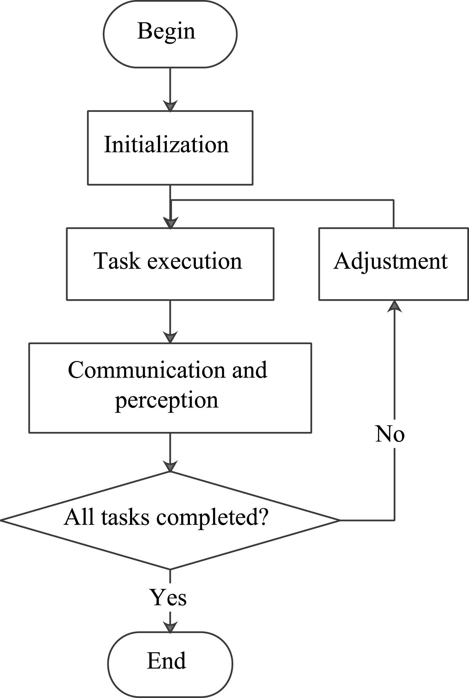
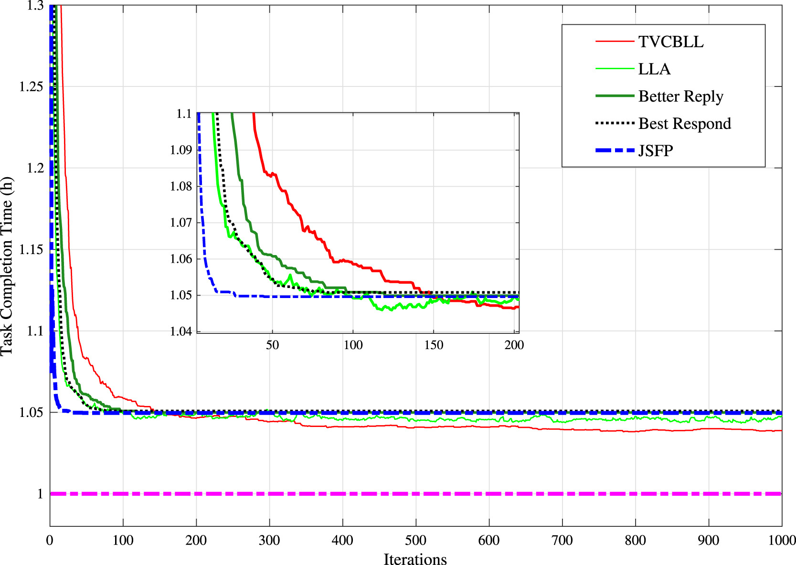
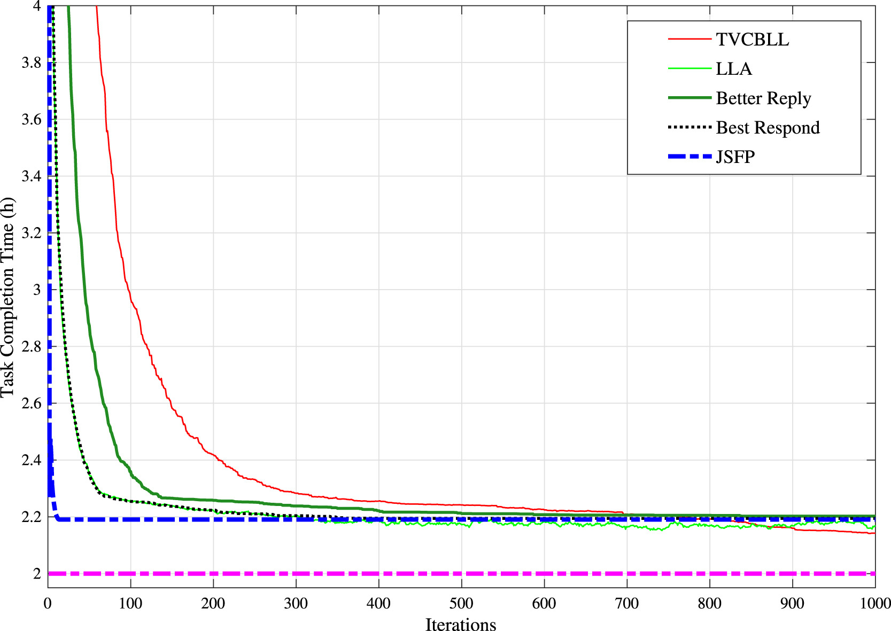
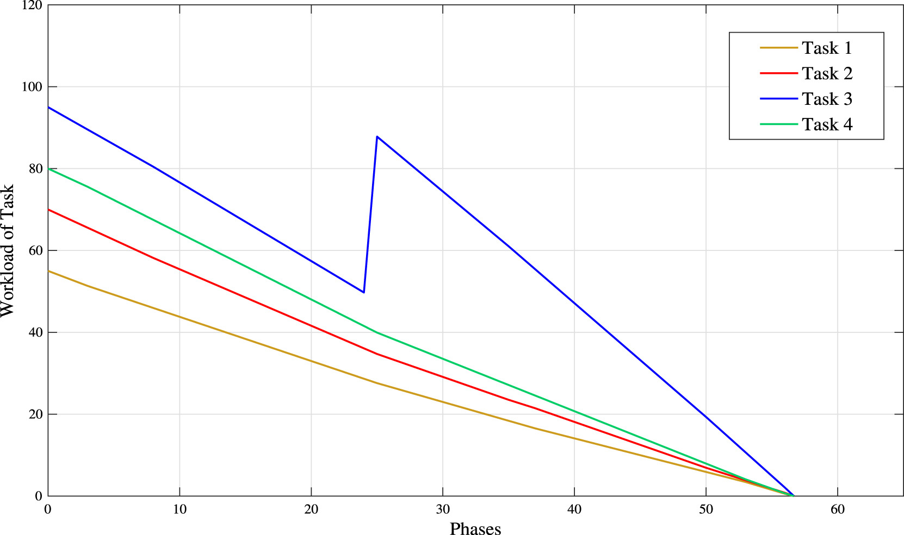

# 2020.03 ISA-Transitions: Potential game for dynamic task allocation in multi-agent system

- 多智能体系统中动态任务分配的势博弈
- [sciencedirect](https://www.sciencedirect.com/science/article/pii/S0019057820301129?via%3Dihub)
- [doi](https://doi.org/10.1016/j.isatra.2020.03.004)
- Research Center of Smart Networks and Systems School of Information Science and Engineering, Fudan University, Shanghai 200433, PR China
  - 复旦大学信息科学与工程学院智能网络与系统研究中心
- Academy for Engineering and Technology, Fudan University, Shanghai 200433, PR China
  - 复旦大学工程与技术学院

ISA-Transitions

- [ISA-Transitions](https://www.sciencedirect.com/journal/isa-transactions)
  - ISA Transactions is a journal of advances and state-of-the-art in the science and engineering of measurement and automation, of value to leading-edge industrial practitioners and applied researchers.
- [isa: International Society of Automation](https://www.isa.org/)
- 11.7 CiteScore 6.3 Impact Factor

Contents

- [2020.03 ISA-Transitions: Potential game for dynamic task allocation in multi-agent system](#202003-isa-transitions-potential-game-for-dynamic-task-allocation-in-multi-agent-system)
  - [0 Abstract](#0-abstract)
  - [1 Introduction](#1-introduction)
  - [2 Related works](#2-related-works)
  - [3 Game model](#3-game-model)
    - [3.1 Task model](#31-task-model)
    - [3.2 Global utility and agent utility](#32-global-utility-and-agent-utility)
    - [3.3 The efficiency of Nash equilibriums](#33-the-efficiency-of-nash-equilibriums)
    - [3.4 Dynamic task allocation](#34-dynamic-task-allocation)
  - [4 Learning algorithm](#4-learning-algorithm)
    - [4.1 Time variant constrained binary log-linear learning](#41-time-variant-constrained-binary-log-linear-learning)
    - [4.2 Analysis](#42-analysis)
  - [5 Experimental results](#5-experimental-results)
    - [5.1 Static task allocation](#51-static-task-allocation)
    - [5.2 Dynamic task allocation](#52-dynamic-task-allocation)
  - [6 Conclusion](#6-conclusion)
  - [7 Declaration of competing interest](#7-declaration-of-competing-interest)
  - [8 References](#8-references)

## 0 Abstract

This paper proposes a novel distributed multi-agent dynamic task allocation method based on the potential game. Consider that the workload of each task may vary in a dynamic environment, and the communication range of each agent constrains the selectable action set. Each agent makes the decision independently based on the local information.

- Firstly, a potential game-theoretic framework is designed. Any Nash equilibrium is guaranteed at least 50% of suboptimality, and the best Nash equilibrium is the optimal solution.
- Furthermore, a time variant constrained binary log-linear learning algorithm is provided and the global convergence is proved under certain conditions.
- Finally, numerical results show that the proposed algorithm performs well in terms of global searching ability, and verify the effectiveness of the distributed dynamic task allocation approach.

本文提出了一种基于势博弈的新型分布式多智能体动态任务分配方法。考虑到在动态环境中，每项任务的工作负载可能有所不同，且每个智能体的通信范围限制了其可选动作集。每个智能体基于局部信息独立做出决策。首先，设计了一个势博弈理论框架，确保任何纳什均衡至少达到 50% 的次优性，而最佳纳什均衡即为最优解。此外，提出了一种时变约束二元对数线性学习算法，并在特定条件下证明了其全局收敛性。最后，数值结果表明，所提算法在全局搜索能力方面表现良好，验证了分布式动态任务分配方法的有效性。

Keywords

Dynamic task allocation; Multi-agent system; Game theory; Log-linear learning

## 1 Introduction

Cooperative task allocation plays a vital role in cooperative control in the field of multi-agent systems. It raises fundamental and novel problems in control theory and robotics and brings more significant challenges when it comes to a real-time assignment in a dynamic environment [1]. Generally, the cooperation of a swarm of agents could perform more complex tasks that a single agent can hardly achieve, for instance, cooperative radar jamming [2], surveillance [3], weapon-target assignment [4], and disaster management [5], [6], etc. Driven by these demands, multiple agents must coordinate intelligently for successful task allocation.

协作任务分配在多智能体系统领域的协作控制中扮演着至关重要的角色。它在控制理论和机器人学中提出了基础且新颖的问题，并在动态环境下的实时分配方面带来了更为显著的挑战[1]。通常，一群智能体的协作能够执行单个智能体难以完成的复杂任务，例如协作雷达干扰[2]、监视[3]、武器-目标分配[4]以及灾害管理[5][6]等。在这些需求的驱动下，多个智能体必须智能协调以实现成功的任务分配。

How to cooperate intelligently to achieve an overall goal is crucial. The complexity of multi-agent dynamic task allocation mainly comes from the large cardinality of the systems and environmental uncertainty. Therefore, it is necessary to entrust individuals certain levels of decision-making such that they can adaptively adjust the assignment to finish the tasks efficiently. For this reason, this paper focuses on the general dynamic task allocation problem, where agents are allowed to change their choices in response to environmental change or the actions of other agents to obtain the desired state [1]. In such a single-task robot and multi-robot task (ST-MR) problem [7], an agent can only participate in at most one task while each task may require the combined effort of multiple agents, and the objective is to minimize the task completion time with limited computation resources. The motivation of this research is to design a distributed method to solve the dynamic ST-MR problem, and provide some theoretic supports for addressing applications such as surveillance, disaster management, etc.

如何智能协作以实现整体目标至关重要。多智能体动态任务分配的复杂性主要源于系统的大基数性和环境的不确定性。因此，有必要赋予个体一定程度的决策权，使其能够自适应地调整任务分配，从而高效完成任务。基于此，本文聚焦于一般动态任务分配问题，其中允许智能体根据环境变化或其他智能体的行为调整选择，以达到期望状态[1]。在此类单任务机器人及多机器人任务（ST-MR）问题[7]中，一个智能体最多只能参与一项任务，而每项任务可能需要多个智能体的共同努力，目标是在有限的计算资源下最小化任务完成时间。本研究的动机在于设计一种分布式方法来解决动态 ST-MR 问题，并为诸如监控、灾害管理等应用提供理论支持。

As it is known that multi-agent task allocation is an NP-hard problem [7], and the computational requirement increases exponentially with the number of agents and tasks. Moreover, the problem becomes more complicated when the workload of each task may vary in a dynamic environment. An efficient distributed decision-making framework is expected as it has better robustness and scalability than centralized systems. However, the convergence performance of distributed decision-making systems may not as well as the centralized one; it is hard to guarantee global convergence, such as the market-based approaches [8], [9]. Thus, the core challenge for distributed decision-making systems is to design the proper individual control policies which contribute to the global objective.

众所周知，多智能体任务分配是一个 NP 难问题[7]，其计算需求随着智能体和任务数量的增加呈指数级增长。此外，当每个任务的工作量在动态环境中可能变化时，问题变得更加复杂。一个高效的分布式决策框架被寄予厚望，因为它比集中式系统具有更好的鲁棒性和可扩展性。然而，分布式决策系统的收敛性能可能不如集中式系统；很难保证全局收敛，例如基于市场的方法[8]，[9]。因此，分布式决策系统的核心挑战在于设计适当的个体控制策略，这些策略有助于实现全局目标。

In this paper, a novel distributed multi-agent task allocation framework for the dynamic environment is designed based on the potential game. The potential game plays a critical role in engineering multi-agent systems and is formally defined by Monderer & Shapley [10]. The advantages of the potential game-theoretic framework include: (1) There are efficient approaches of designing the local decision rules [11], [12] ; (2) Several learning algorithms, such as log-linear learning [13], fictitious play [14], and regret matching [15], etc., ensure to converge to Nash equilibrium (NE) in the potential game. The potential game model is designed at first. The single task reward function is defined as the submodular set function [16] with considering the properties of the task, and the global objective function is the discounted sum of all tasks’ reward. Also, the agent individual utility function is designed as the normalized marginal contribution of global function according to the Wonderful Life Utility designing rule [17]. In the proposed interaction framework, each agent communicates with local agents and receives little information to formulate its decision. Furthermore, this paper also proves that any NE is guaranteed at least of suboptimality, which is the state of being suboptimal, and the best NE is the global function maximizer.

本文设计了一种基于势博弈的新型分布式多智能体任务分配框架，适用于动态环境。势博弈在多智能体系统工程中扮演着关键角色，并由 Monderer 和 Shapley 正式定义[10]。势博弈理论框架的优势包括：(1) 存在设计局部决策规则的有效方法[11], [12]；(2) 多种学习算法，如对数线性学习[13]、虚拟博弈[14]和遗憾匹配[15]等，确保在势博弈中收敛至纳什均衡(NE)。首先设计了势博弈模型，将单一任务奖励函数定义为考虑任务特性的子模集函数[16]，全局目标函数则是所有任务奖励的折现总和。此外，根据“美好生活效用”设计规则[17]，将智能体个体效用函数设计为全局函数的归一化边际贡献。在所提出的交互框架中，每个智能体与局部智能体通信，并接收少量信息以制定其决策。 此外，本文还证明了任何纳什均衡（NE）至少保证了 50%的次优性，即处于次优状态，而最佳纳什均衡则是全局函数的最大化者。

Next, a time variant constrained binary log-linear learning (TVCBLL) algorithm is provided, where beta is a time variant parameter, and the communication range constrains the action set of each agent. This paper proves that the TVCBLL converges to the global optimal solutions with probability one under certain conditions. Finally, numerical experiments validate the proposed method.

接下来，本文提出了一种时变约束二元对数线性学习（TVCBLL）算法，其中 beta 是一个时变参数，通信范围限制了每个智能体的动作集。本文证明了在特定条件下，TVCBLL 算法以概率 1 收敛到全局最优解。最后，数值实验验证了所提方法的有效性。

This paper is organized as follows. In the next section, some approaches for distributed multi-agent task allocation problems are reviewed. Section 3 introduces the game-theoretic model and proves the efficiency of the Nash equilibrium. Section 4 provides the time variant constrained binary log-linear learning algorithm and analyzes its convergence performance. Then, numerical experiments show that the TVCBLL performs well in terms of global searching ability and validate the proposed method in Section 5. Finally, Section 6 presents the summary and expectations.

本文组织结构如下。下一节回顾了分布式多智能体任务分配问题的一些方法。第三节介绍了博弈论模型并证明了纳什均衡的效率。第四节提出了时变约束二元对数线性学习算法，并分析了其收敛性能。随后，数值实验表明 TVCBLL 在全局搜索能力方面表现良好，并在第五节验证了所提方法的有效性。最后，第六节总结了全文并提出了展望。

## 2 Related works

## 3 Game model

### 3.1 Task model

### 3.2 Global utility and agent utility

### 3.3 The efficiency of Nash equilibriums

### 3.4 Dynamic task allocation

## 4 Learning algorithm

### 4.1 Time variant constrained binary log-linear learning

### 4.2 Analysis

## 5 Experimental results

### 5.1 Static task allocation

### 5.2 Dynamic task allocation

## 6 Conclusion

To the cooperation of a swarm robotic system, this paper proposed an efficient game-theoretic framework for addressing the multi-agent dynamic task allocation problem. A large number of agents, which have limited computing and communication capacities, make their own decisions based on local information. The effectiveness of the designed game-theoretic model is proved according to the submodularity of global utility function. Then, the convergence of provided TVCBLL algorithm is also analyzed based on inhomogeneous Markov chain theory. Numerical experiments validate the proposed game-theoretic framework and learning algorithm. In conclusion, the multi-agent dynamic task allocation approach has great potential for many applications, such as forest fire fighting, logistics operation, and surveillance, et al.

针对群体机器人系统的协作问题，本文提出了一种高效的博弈论框架，以解决多智能体动态任务分配问题。大量计算和通信能力有限的智能体基于局部信息自主决策。通过全局效用函数的子模性，证明了所设计博弈论模型的有效性。随后，基于非齐次马尔可夫链理论，分析了所提出的 TVCBLL 算法的收敛性。数值实验验证了所提出的博弈论框架和学习算法的有效性。总之，这种多智能体动态任务分配方法在森林灭火、物流操作及监控等诸多应用领域展现出巨大潜力。

The future works will be (1) compare our work with the existing excellent works in applications, (2) improve the effectiveness of the game model, such that the lower bound of Nash equilibrium can be improved, and (3) consider the feasibility of our method in asynchronous environments since it is difficult for every agent to update the state and receives information synchronously.

未来的工作将包括：（1）将我们的工作与现有优秀应用成果进行比较；（2）提升游戏模型的有效性，以期改进纳什均衡的下界；（3）考虑我们的方法在异步环境中的可行性，因为每个智能体同步更新状态和接收信息存在难度。

## 7 Declaration of competing interest

## 8 References
