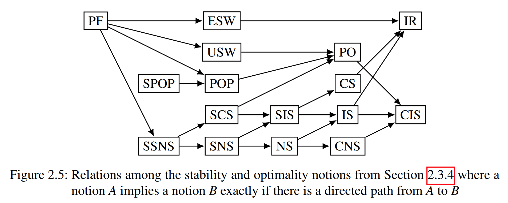
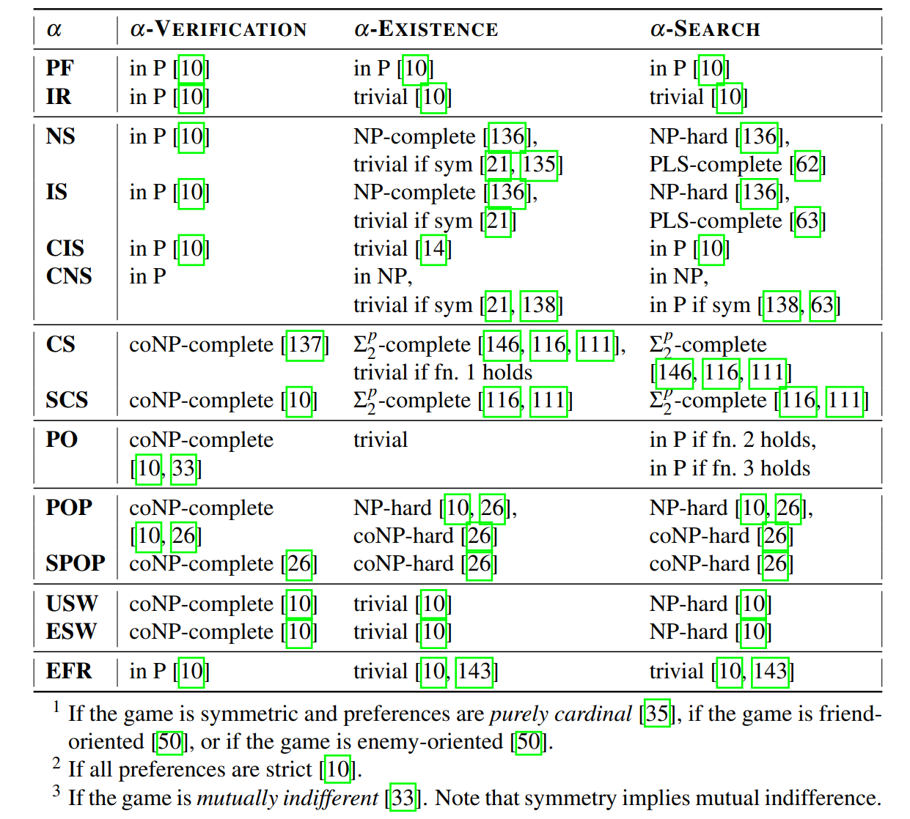

# 2022 phd: An Axiomatic and Computational Analysis of Altruism, Fairness, and Stability in Coalition Formation Games

联盟形成博弈中利他主义、公平性和稳定性的公理和计算分析

- 海因里希·海涅大学数学与自然科学学院的博士学位
- Anna Maria Kerkmann

## Abstract

本论文研究**联盟形成博弈 (Coalition Formation Games)**，属于合作博弈论 (cooperative game theory) 的研究领域。在这些博弈中，玩家根据个人偏好分成小组，也称为联盟。在我们的研究中，我们主要关注**享乐 (hedonic) 联盟形成博弈**，简称享乐博弈，其中玩家的偏好假设仅取决于包含他们的联盟。

- 享乐博弈研究中的一个核心问题是寻找**合理的偏好提取形式 (reasonable formats for the elicitation of preferences)**。这些偏好表示应该易于提取、合理表达且简洁。相关文献中已经提出了许多这样的形式，其中一些我们也会在本论文中讨论。
- 关于享乐博弈的研究的第二个核心点是调查**稳定性**、**公平性**和**最优性**。例如，常见的稳定性概念处理的是个体玩家或玩家群体是否有偏离当前联盟的激励问题。其中概念包括，例如，纳什稳定性和核稳定性。

基于当前的研究状况，我们介绍了新的（享乐）联盟形成博弈模型，并从**公理化性质**、**稳定性**、**公平性**和**最优性**等方面对其进行了研究。特别是，对相关决策问题的**计算复杂性**的研究起着重要作用。

我们首先介绍几种联盟形成博弈中的**利他主义模型 (models for altruism)**。首先，我们关注享乐博弈的背景，然后将模型扩展到更一般的联盟形成博弈，其中可能存在更广泛的利他主义形式。我们对我们的模型进行**公理化分析**，并将它们与相关模型以及彼此进行比较。此外，我们研究在考虑利他主义联盟形成博弈的经典稳定性概念时出现的问题，以及它们的计算复杂性。

随后，我们为享乐博弈定义了三种**基于阈值的公平性概念**。这些概念被视为**局部公平性**概念，因为代理只需要检查自己的联盟来决定联盟结构是否对他们公平。我们研究了这些概念与其他常见稳定性和公平性概念之间的关系，并从计算复杂性的角度进行了考察。此外，我们还研究了局部公平性的成本，即我们的公平性概念对社会福利的影响。

最后，我们介绍另一种偏好形式，玩家可以区分**朋友、中立玩家和敌人**。因此，他们通过提交一个由两个阈值分隔的弱排名来表达自己的偏好。由于从这些排名中可以推导出的偏好不一定**完整**，我们在最终博弈中区分了可能性和必要性稳定性。再次，我们对与常见稳定性概念相关的出现的问题进行了计算复杂度分析。

## 1 Introduction

如今，有关人工智能（AI）的研究范围极为广泛。实际上，人工智能研究不仅关乎模仿人类智能，还涉及各种应用不同科学领域知识的解决方案概念，包括自然科学（如生物学和物理学）以及社会科学（如社会学和经济学）。在人工智能会议上引起广泛关注的两大学术领域是多智能体系统和博弈论。尽管这些领域的研究非常广泛，但它们之间并不总是有明确的界限。

关于多智能体系统的研究主要涉及分布式问题解决，即具有共同解决问题目标的智能体之间的合作。这些系统通常应用于单个智能体可能更难解决或根本无法解决的问题。在自然界中可以找到非常成功的多智能体系统的鼓舞人心的例子：蚂蚁群体利用它们的沟通能力和劳动分工来掌握单个蚂蚁永远无法实现的复杂问题。

博弈论研究个体代理之间的相互作用，这些代理通常被假定为自私地追求自己的目标。这一领域的研究大致始于 Borel[22]、Neumann[103]以及 Neumann 和 Morgenstern[104]的作品，通常分为非合作博弈论和合作博弈论。非合作博弈论主要关注个体代理的偏好和行为，而合作博弈论也考虑个体偏好，但更侧重于群体的形成，并允许他们采取联合行动。非合作博弈论的例子包括著名的囚徒困境[118]、蒙提霍尔问题（参见，例如，Selvin[131, 132]或 Randow 的德国书籍[120]），以及经典的组合博弈，如井字棋、Nim 博弈、国际象棋、围棋或数独。非合作博弈论的重点主要在于研究均衡，即没有代理有理由偏离其当前策略的稳定状态。在合作博弈中，代理可以形成联盟并采取联合行动。关于多代理系统和博弈论更多背景信息，请参阅 Shoham 和 Leyton-Brown[133]以及 Rothe[126]的教科书。

本论文的焦点在于**联盟形成博弈**，这是合作博弈论中的关键主题。其应用范围从技术、工程和经济问题扩展到社会甚至政治问题。Dr`eze 和 Greenberg[53]开创了对具有**享乐偏好**的联盟形成博弈的研究。这些博弈后来被 Banerjee 等人[15]和 Bogomolnaia 和 Jackson[21] 形式化。这类博弈的关键思想是，**代理人必须形成分区，同时只关心他们所属的联盟**。在享乐博弈的通用框架中，代理人对包含自己的所有联盟具有任意偏好。然而，在实践中，对所有这样的联盟进行排序是不合理的。相反，需要**合理的偏好表示**。理想情况下，这种形式应该**简洁、表达性强且易于获取**。合理偏好表示的确定是享乐博弈研究的基础部分。已建立的表示包括 Bogomolnaia 和 Jackson[21]提出的**加法编码 (additive encoding) 等基数形式(cardinal formats)**，以及 Aziz 等人[11]的分数编码。其他形式基于将代理人分为朋友和敌人[50, 111, 17]或基于使用命题公式[56, 9]。

享乐博弈研究的一个重要分支涉及与稳定性、公平性和最优性概念相关的问题。这些概念的确立构成了过去研究的主要部分。特别是，一些常见的稳定性概念涉及单玩家偏差。例如，如果一个享乐博弈中代理人的划分被称为纳什稳定（或处于纳什均衡状态），那么没有代理人想要偏离到该划分的另一个联盟[21]。其他稳定性概念涉及群体的偏差。核心稳定性可能是享乐博弈中群体稳定性最重要的概念（例如，参见 Banerjee 等人早期的论文[15]和 Woeginger 的综述[147]）。非正式地说，如果一个群体中的所有玩家都宁愿选择给定的玩家划分而不是划分分配的群体，那么这个群体就阻止了该划分。如果一个划分是核心稳定的（或处于核心），那么就没有阻止联盟[15]。相关的最优性概念包括帕累托最优、受欢迎程度以及最大化功利主义或平等主义的社会福利。 有趣的概念，例如无嫉妒性，已被从公平分配和资源分配的研究中采纳（参见 Foley[61]以及 Bouveret 等人[24]和 Lang 与 Rothe[95]的书籍章节，以了解这些主题的背景）。

考虑到稳定性、最优性或公平性等概念，我们感兴趣的是识别这些概念的充分条件，即我们询问哪些属性保证了结果的稳定性、公平性或最优性。此外，对于某些偏好配置，稳定、公平或最优的结果甚至可能不存在。相当数量的研究集中在识别保证这些结果存在的属性。例如，Bogomolnaia 和 Jackson[21]表明，在对称可加分离的享乐博弈中，Nash 稳定的联盟结构是保证存在的。然而，后来又证明，在（不对称）可加分离的享乐博弈中判断是否存在 Nash 稳定的联盟结构是 NP 完全的[136]。确定这类存在问题的复杂性通常是一个重要的研究方面。对于核心稳定性和严格核心稳定性，存在性问题已被证明对于可加分离的享乐博弈是 Σ2-完全的[146, 116, 111]。然而，也存在简化存在问题的条件。 Burani 和 Zwicker [35] 已经表明，对于具有纯粹基数偏好的对称可加分离的享乐博弈，始终存在核心稳定结果。Dimitrov 等人[50]证明了对于以朋友为导向和以敌人为导向的享乐博弈，存在性问题微不足道。

在本论文中，我们基于当前的研究现状，进一步引入了简洁的偏好。为了解决寻找具有表达性、紧凑性和易于引出偏好的形式的问题，我们引入了具有双重阈值的弱排序。这些排序比纯粹序数排序（如个体理性编码[14]）、朋友与敌人编码[50]或单元素编码[40]更具表达性。然而，我们的形式在认知上是合理的，并且易于从代理人那里引出——可能比例如命题公式（如享乐联盟网[56]或布尔享乐编码[9]）更容易。此外，我们对偏好的性质没有做出强烈的假设（如只考虑联盟大小的匿名编码[15]或为二分偏好设计的布尔享乐编码），并且我们的形式简洁。总之，我们的形式在三个要求之间提供了令人满意的平衡。

我们在这篇论文中处理的第二个重要方面引出了偏好建模的一个新分支。自从博弈论开始以来，代理人通常被认为是完全理性和自利的个体 (参见 Neumann 和 Morgenstern[104])。我们挑战这一假设，并旨在更真实地表示现实世界的联盟形成场景: 我们将利他主义引入联盟形成博弈。在我们的模型中，代理人并不是自私的，而是在比较不同的联盟结构时考虑了他们朋友的意见。我们提出了各种利他模型，并比较了它们的公理化特性。在专注于享爱模型之后，我们还介绍了放弃享爱限制的利他主义模型。我们对这些非 hedonic 模型所做的更改带来了一些公理化的改进，并且在我们看来，一个更现实的利他主义模型。

本论文的第三部分关注享乐博弈的公平性。先前文献将嫉妒自由性视为公平性的概念[21, 10, 148, 114]。然而，为了验证这一概念，代理人必须检查其他代理人的联盟。在某种程度上，这与享乐假设相冲突，该假设指出代理人只关心自己的联盟。此外，我们希望避免需要比较大量联盟的需求。因此，我们引入了三种**局部公平性**的概念，这些概念可以仅基于代理人的自身联盟及其偏好来决定。

除了这些概念性贡献外，这篇论文还包含几个技术性贡献。我们研究了通过将具有双重阈值的弱排序提升到联盟偏好的 FEN-享乐博弈。我们描述了这些博弈中的稳定性，并研究了验证稳定联盟结构和检查其存在性的问题。此外，我们不仅从公理上研究了利他联盟形成博弈，还提供了关于相关稳定性验证和存在性问题的详细计算分析。我们的结果涵盖了许多常见的稳定性概念，如纳什稳定性、核稳定性、帕累托最优和流行度。关于我们的局部公平性概念，我们确定了计算局部公平性阈值和决定对于可加分离的享乐博弈是否存在局部公平联盟结构的复杂性。此外，我们还研究了我们局部公平性概念的成本。

### 1.1 概述

第二章中，我们为本论文提供了必要的背景知识，并解释了理解后续章节所需的所有概念。提供的背景包括 2.1 节中对计算复杂性的介绍，2.2 节中对图论简要概述，以及 2.3 节中对联盟形成博弈中相关方面的调查。这项调查不仅包括基本定义和观察，还引用了相关研究。

我们研究的主要部分从第三章开始，其中我们研究了联盟形成博弈中利他主义的不同方面。更确切地说，第三章分为三个部分。

- 首先，我们在 3.1 节中探讨利他主义享乐博弈。在介绍此类博弈后，我们对我们的利他主义模型进行公理化分析，并研究验证稳定结果的问题以及在这些博弈中是否存在稳定结果的问题。
- 在 3.2 节中，我们进一步分析利他主义享乐博弈，同时关注流行和严格流行等概念。随后，我们在更广泛的联盟形成博弈范围内研究利他主义。
- 特别是，第 3.3 节阐述了非限制于享乐偏好的利他联盟形成模型，允许更广泛的利他行为。我们确定了与利他享乐模型相比，这种扩展模型提供的一些优势，并研究了这些博弈中的稳定性。

在第 4 章中，我们继续研究享乐博弈中的局部公平概念。在提出三个这样的概念后，我们将它们与其他流行的稳定性概念联系起来，确定相关决策问题的计算复杂性，并研究我们局部公平概念的成本。

在第 5 章中，我们介绍了并研究了 FEN-享乐博弈，其中代理将其他代理分为朋友、敌人和中立玩家，同时分别对朋友和敌人进行排名。然后，我们研究了有关可能或必然稳定的联盟结构验证和存在性的问题。

在第 6 章中，我们回顾了这篇论文，突出了一些重要贡献，并确定了未来研究的一些可能方向。

## 2 Background

### Coalition Formation Games

- Definitions
- Hedonic Games
- Prefernce Representations
- Stability and Optimality in Hedonic Games
- Fairness in Hedonic Games
- Decision Problems for Hedonic Games

#### Definitions

- Non-Transferable Utility Games (NTU)
- Coalition Formation Game
- Hedonic Games: agents only care about the coalitions that they belong to

- Common Preference Representations
  - Cardinal Formats
  - representations based on the categorization into friends and enemies
- stability, optimality, and fairness notions

##### 2.3.1 Basic Definitions

Let $N=\{1,\ldots,n\}$ be the set of agents (which we also call players). Subsets $C\subseteq N$ of the agents are called coalitions and, for any player $i\in N$, we denote the set of all coalitions containing $i$ by $\mathscr{N}^i=\{C\subseteq N\mid i\in C\}.$ It holds that $|\mathscr{N}^i|=2^{n-1}$, which means that the number of coalitions containing $i$ is exponential in the number of agents. Coalitions that contain only one player are also called singleton coalitions or singletons, for short. The coalition $N$ that consists of all players is also called the $grand coalition. A coalition structure is a partition $\Gamma=\{C_1,\ldots,C_k\}$ of the set $N$ of agents. As for every partition, it holds that $\bigcup_{i=1}^kC_i=N$ and $C_i\cap C_j=\emptyset$ for all $i,j\in\{1,\ldots,k\}$ with $i\neq j.$ There is no general restriction on the number $k$ of coalitions in a coalition structure which means that $k$ can range anywhere between 1 and $n.$ The unique coalition in $\Gamma$ that contains agent $i$ is denoted by $\Gamma(i).$ Moreover, the set of all coalition structures for a set of agents $N$ is denoted by $\mathscr{C}_N.$ Note that the size of $\mathscr{C}_N$ grows exponentially with the number $n$ of agents and equals the $n$th Bell number[18, 123]. For example, the first six Bell numbers are $B_1=1,B_2=2,B_3=5,B_4=15,B_5=52$, and $B_6=203$, which means that there are 203 possible partitions of a set of six agents.

Based on these notions, a coalitionformation game is a pair $(N,\succeq)$,where $N=\{1,\ldots,n\}$ is a set of agents and $\succeq=(\succeq_1,\ldots,\succeq_n)$ is the profile of preferences of the agents. For each agent $i\in N,\succeq_i$ denotes her preference relation which is a complete weak order over all coalition structures, i.e., $\succeq_i\subseteq\mathscr{C}_N\times\mathscr{C}_N.$ For two coalition structures $\Gamma,\Delta\in\mathscr{C}_N$, we say that agent $i$ weakly prefers $\Gamma$ to $\Delta$ if $\sum_{i} \Gamma_i > \Delta_i$, that $i$ prefers $\Gamma$ to $\Delta$ (denoted by $\Gamma_i \succ_i \Delta$) if $\Gamma_i > \Delta_i$ but not $\Delta_i > \Gamma_i$, and that $i$ is indifferent between $\Gamma$ and $\Delta$ (denoted by $\Gamma_i \sim_i \Delta$) if $\Gamma_i > \Delta_i$ and $\Delta_i \geqslant_i \Gamma_i$.

##### 2.3.2 Hedonic Games

The focus of this thesis will mainly be on coalition formation games with hedonic preferences, hedonic games for short. They were introduced independently by Banerjee et al. [15] and Bogomolnaia and Jackson [21]. The key idea of hedonic games (going back to Drèze and Greenberg [53]) is that agents only care about the coalitions that they are part of and not about the rest of a coalition structure. More formally, let any coalition formation game $(N,\succeq)$ be given. Then, the preference $\succeq_i$ of player $i$ is hedonic if it only depends on the coalitions that $i$ is part of, i.e., if for any two coalition structures $\Gamma,\Delta\in\mathscr{C}_N$, it holds that $\Gamma(i)=\Delta(i)$ implies $\Gamma\sim_i\Delta.$ If the preferences of all agents $i\in N$ are hedonic, $(N,\succeq)$ is also called hedonic. For such a hedonic (coalition formation) game $(N,\succeq)$, the preferences are usually represented by complete weak orders over the set of coalitions containing an agent, i.e., $\succeq_i\subseteq\mathscr{N}^i\times\mathscr{N}^i$ for all $i\in N.$ For two coalitions $A,B\in\mathscr{N}^i$, we then say that $i$ weakly prefers $A$ to $B$ if $A\succeq_iB$, that $i$ prefers A to B if $A\succ _iB$, and that $i$ is indifferent between $A$ and $B$ if $A\sim_iB.$ It follows from the definition of hedonic games that $\Gamma\succeq_i\Delta$ if and only if $\Gamma(i)\succeq_i\Delta(i).$

Note that there are subclasses of hedonic games where only coalitions of certain sizes are allowed. For example, marriage and roommate games [64, 124] are hedonic games where all coalitions must have a size of at most two. These games and many other matching models are studied in $matching theory. For more background on this topic we refer to the book chapter by Klaus et al.[94] and the textbooks by Roth and Sotomayor [124], Manlove[98] and Gusfield and Irving [71]. For other subclasses of hedonic games, the agents are assumed to divide into two types. In hedonic diversity games[31], an agent's preference depends on the fractions of agents of each type in a coalition. In this thesis however, we will only concentrate on general hedonic games where agents have no types and arbitrary coalition sizes are allowed.

Example 2. 3.

Let the set of players be given by $N= \{ 1, 2, 3\}$. Then, there are four different coalitions containing agent 1, namely $C_1=\{1\},C_2=\{1,2\},C_3=\{1,3\}$, and $C_4=\{1,2,3\}.$ Here,$C_1$ is a singleton coalition and $C_4$ is the grand coalition. The set of all possible coalition structures $\mathscr{C}_N$ contains exactly five coalition structures:

$$
\Gamma_1=\{\{1\},\{2\},\{3\}\},\:\Gamma_2=\{\{1\},\{2,3\}\},\:\Gamma_3=\{\{1,2\},\{3\}\}
$$

$$
\Gamma_4=\{\{1,3\},\{2\}\}, \text{and} \ \Gamma_5=\{\{1,2,3\}\}.
$$

In particular, we have $\mathscr{C}_N = \{\Gamma_1, \Gamma_2, \Gamma_3, \Gamma_4, \Gamma_5 \}$.

Further consider the following preference profile $\succeq = (\succeq_1, \succeq_2, \succeq_3)$ that, together with the set of agents $N$, defines a hedonic game $\mathcal{G} = (N, \succeq)$:

$\begin{cases}
\{1, 2, 3\} \succ_1 \{1, 2\} \succ_1 \{1, 3\} \succ_1 \{1\}, \\
\{1, 2\} \succ_2 \{1, 2, 3\} \succ_2 \{2\} \succ_2 \{2, 3\}, \\
\{3\} \succ_3 \{1, 3\} \sim_{3} \{2, 3\} \succ_3 \{1, 2, 3\}.
\end{cases}$

For this hedonic game, agent 1 prefers coalition $\Gamma_4(1) = \{1, 3\}$ to coalition $\Gamma_2(1) = \{1\}$. Therefore, 1 also prefers $\Gamma_4$ to $\Gamma_2$. In contrast, agent 3 is indifferent between $\Gamma_4$ and $\Gamma_2$ because she is indifferent between $\Gamma_4(3) = \{1, 3\}$ and $\Gamma_2(3) = \{2, 3\}$.

---

#### **2.3.1 基本定义**

1. **玩家与联盟**：

   - 设 $N=\{1,\ldots,n\}$ 为玩家集合，子集 $C\subseteq N$ 称为联盟。
   - 对于任意玩家 $i\in N$，包含 $i$ 的所有联盟集合记为 $\mathscr{N}^i=\{C\subseteq N\mid i\in C\}$。
   - 包含 $i$ 的联盟数量为 $|\mathscr{N}^i|=2^{n-1}$，即联盟数量随玩家数量指数增长。
   - 仅包含一个玩家的联盟称为**单例联盟**，所有玩家组成的联盟称为**大联盟**。

2. **联盟结构**：

   - 联盟结构是玩家集合 $N$ 的一个划分 $\Gamma=\{C_1,\ldots,C_k\}$，满足 $\bigcup_{i=1}^kC_i=N$ 且 $C_i\cap C_j=\emptyset$（$i\neq j$）。
   - 联盟结构中的联盟数量 $k$ 可以在 $1$ 到 $n$ 之间任意取值。
   - 包含玩家 $i$ 的联盟记为 $\Gamma(i)$。
   - 所有可能的联盟结构集合记为 $\mathscr{C}_N$，其大小随玩家数量 $n$ 指数增长，等于第 $n$ 个贝尔数（如 $B_6=203$，即 6 个玩家有 203 种划分方式）。

3. **联盟形成博弈**：
   - 联盟形成博弈定义为 $(N,\succeq)$，其中 $N$ 是玩家集合，$\succeq=(\succeq_1,\ldots,\succeq_n)$ 是玩家的偏好关系。
   - 每个玩家 $i\in N$ 的偏好关系 $\succeq_i$ 是一个完全弱序，定义在所有联盟结构上（即 $\succeq_i\subseteq\mathscr{C}_N\times\mathscr{C}_N$）。
   - 对于两个联盟结构 $\Gamma,\Delta\in\mathscr{C}_N$：
     - 若 $\Gamma_i > \Delta_i$，则玩家 $i$ 偏好 $\Gamma$ 胜过 $\Delta$（记为 $\Gamma \succ_i \Delta$）；
     - 若 $\Gamma_i = \Delta_i$，则玩家 $i$ 对 $\Gamma$ 和 $\Delta$ 无差异（记为 $\Gamma \sim_i \Delta$）。

---

#### **2.3.2 享乐博弈**

1. **享乐博弈的定义**：

   - 享乐博弈是一种特殊的联盟形成博弈，由 Banerjee 等人 [15] 和 Bogomolnaia 与 Jackson [21] 独立提出。
   - 其核心思想是玩家只关心自己所在的联盟，而不关心联盟结构的其他部分。
   - 形式上，若联盟形成博弈 $(N,\succeq)$ 中每个玩家 $i$ 的偏好 $\succeq_i$ 仅依赖于其所在的联盟（即 $\Gamma(i)=\Delta(i)$ 时 $\Gamma\sim_i\Delta$），则该博弈称为享乐博弈。

2. **享乐博弈的偏好表示**：

   - 在享乐博弈中，玩家的偏好通常表示为对其所在联盟集合 $\mathscr{N}^i$ 的完全弱序（即 $\succeq_i\subseteq\mathscr{N}^i\times\mathscr{N}^i$）。
   - 对于两个联盟 $A,B\in\mathscr{N}^i$：
     - 若 $A\succeq_iB$，则玩家 $i$ 弱偏好 $A$ 胜过 $B$；
     - 若 $A\succ_iB$，则玩家 $i$ 严格偏好 $A$ 胜过 $B$；
     - 若 $A\sim_iB$，则玩家 $i$ 对 $A$ 和 $B$ 无差异。
   - 根据享乐博弈的定义，$\Gamma\succeq_i\Delta$ 当且仅当 $\Gamma(i)\succeq_i\Delta(i)$。

3. **享乐博弈的子类**：
   - 某些享乐博弈限制联盟的大小，例如婚姻和室友博弈 [64, 124] 中联盟大小不超过 2。
   - 其他子类如享乐多样性博弈 [31]，玩家的偏好取决于联盟中各类玩家的比例。
   - 本论文主要研究一般享乐博弈，其中玩家无类型限制且联盟大小任意。

**总结**

- **联盟形成博弈**：研究玩家如何通过形成联盟实现目标，核心是玩家对联盟结构的偏好。
- **享乐博弈**：玩家仅关心自己所在的联盟，偏好由其所在联盟决定。
- **应用与扩展**：享乐博弈在匹配理论、多样性博弈等领域有广泛应用，本论文聚焦于一般享乐博弈的研究。

#### **示例 2.3**

设玩家集合为 $N= \{ 1, 2, 3\}$。那么，包含玩家 1 的不同联盟共有四个，分别是：

- $C_1=\{1\}$（单例联盟），
- $C_2=\{1,2\}$，
- $C_3=\{1,3\}$，
- $C_4=\{1,2,3\}$（大联盟）。

所有可能的联盟结构集合 $\mathscr{C}_N$ 包含以下五种联盟结构：

$$
\Gamma_1=\{\{1\},\{2\},\{3\}\},\quad \Gamma_2=\{\{1\},\{2,3\}\},\quad \Gamma_3=\{\{1,2\},\{3\}\},
$$

$$
\Gamma_4=\{\{1,3\},\{2\}\},\quad \text{以及} \quad \Gamma_5=\{\{1,2,3\}\}.
$$

特别地，$\mathscr{C}_N = \{\Gamma_1, \Gamma_2, \Gamma_3, \Gamma_4, \Gamma_5 \}$。

进一步考虑以下偏好关系 $\succeq = (\succeq_1, \succeq_2, \succeq_3)$，它与玩家集合 $N$ 一起定义了一个享乐博弈 $\mathcal{G} = (N, \succeq)$：

$$
\begin{cases}
\{1, 2, 3\} \succ_1 \{1, 2\} \succ_1 \{1, 3\} \succ_1 \{1\}, \\
\{1, 2\} \succ_2 \{1, 2, 3\} \succ_2 \{2\} \succ_2 \{2, 3\}, \\
\{3\} \succ_3 \{1, 3\} \sim_{3} \{2, 3\} \succ_3 \{1, 2, 3\}.
\end{cases}
$$

在这个享乐博弈中：

- 玩家 1 偏好联盟 $\Gamma_4(1) = \{1, 3\}$ 胜过联盟 $\Gamma_2(1) = \{1\}$，因此玩家 1 也偏好 $\Gamma_4$ 胜过 $\Gamma_2$。
- 相比之下，玩家 3 对 $\Gamma_4$ 和 $\Gamma_2$ 无差异，因为她在 $\Gamma_4(3) = \{1, 3\}$ 和 $\Gamma_2(3) = \{2, 3\}$ 之间无差异。

**补充说明**

- **联盟结构**：示例展示了 3 个玩家的所有可能联盟结构，共 5 种。
- **偏好关系**：每个玩家对联盟的偏好决定了其对联盟结构的偏好。
- **享乐博弈的核心**：玩家仅关心自己所在的联盟，而不关心联盟结构的其他部分。

---

#### 2.3.3 Preference Representations

Even when considering the restricted case of hedonic coalition formation games, it is not reasonable to elicit full preferences in practice. Collecting a full preference over $\mathscr{N}^i$ for every agent $i\in N$ would not only lead to a preference profile of exponential size (in the number of agents) but would also present an extreme cognitive burden for the agents. Hence, we are looking for succinct representations of the preferences that are still reasonably expressive and easy to elicit.

##### Cardinal Preference Representations

There is a broad literature that concerns the problem of finding compact representations for hedonic preferences. Commonly used representations include the additive encoding due to $\operatorname{Bogomolnaia}$ and Jackson [21], the fractional encoding due to Aziz et al. [ 11] , the modifed fractional encoding due to Olsen [ 110], and the friends-and-enemies encoding due to Dim-itrov et al.[50]. All these four representations have in common that they can be specified via cardinal valuation functions, i.e., they belong to the class of $cardinalhedonic games. In these games, each agent $i$ assigns a cardinal value to every other agent $j$ that indicates how much $i$ likes $j.$ The agents’ preferences can then be inferred from their valuation functions. The four representations differ in the range of valuations and in how the preferences are inferred.

Additively Separable Hedonic Games A hedonic game $(N,\succeq)$ is additively separable if, for every player $i\in N$, there exists a valuation function $\nu_i:N\to\mathbb{Q}$ such that for any two coalitions $A,B\in\mathscr{N}^i$ it holds that

$$A\succeq_iB\Longleftrightarrow\sum_{j\in A}\nu_i(j)\geq\sum_{j\in B}\nu_i(j).$$

Hence, an additively separable hedonic game can also be represented by a tuple $(N,\nu)$ consisting of a set of agents and a collection of valuation functions. It is commonly assumed that $\nu_i(i)=0$ for every $i\in N/7$ In additively separable hedonic games, agent $i$ s valuation of a coalition $A\in\mathscr{N}^i$ is defined as $\nu_i^\mathrm{add}(A)=\sum_{j\in A}\nu_i(j).$ Additively separable hedonic games [21] were studied, e.g., by Sung and Dimitrov [137,136], Aziz et al. [10], and Woeginger [146].

Example 2.4. Again, consider the hedonic game $\mathscr{C}=(N,\succeq)$ from Example $2.3\mathscr{C}$ is additively separable as it can be represented via the following valuation functions:

$$
\begin{array}{c|ccc}
i&\nu_i(1)&\nu_i(2)&\nu_i(3)\\\hline1&0&2&1\\2&2&0&-1\\3&-1&-1&0
\end{array}
$$

We validate that these valuation functions indeed lead to the preferences from Example [2.3]
using agent 2 as an example. We compute agent 2's valuations for the four coalitions:
$$\begin{aligned}&\nu_2^{\mathrm{add}}(\{1,2\})=2+0=2,&&\nu_2^{\mathrm{add}}(\{1,2,3\})=2+0-1=1,\\&\nu_2^{\mathrm{add}}(\{2\})=0,\mathrm{~and}&&\nu_2^{\mathrm{add}}(\{2,3\})=0-1=-1.\end{aligned}$$

Since $\nu _2^{\mathrm{add}}( \{ 1, 2\} ) > \nu _2^{\mathrm{add}}( \{ 1, 2, 3\} ) > \nu _2^{\mathrm{add}}( \{ 2\} ) > \nu _2^{\mathrm{add}}( \{ 2, 3\} )$, agent $2^{\prime }$s valuation function $\nu_2$ indeed corresponds to the preference $\{1,2\}\succ_2\{1,2,3\}\succ_2\{2\}\succ_2\{2,3\}.$

**Fractional Hedonic Games**

In fractional hedonic games, the value of a coalition is the average value of the members of the coalition. Hence, given a valuation function $\nu_i$ of agent $i,i$ 's fractional value for a coalition $A\in\mathscr{N}^i$ is $\nu_i^\mathrm{frac}(A)=\frac1{|A|}\sum_{j\in A}\nu_i(j)$ and a hedonic game $(N,\succeq)$ is fractional if for every player $i\in N$ there exists a valuation function $\nu_i:N\to\mathbb{Q}$ such that for any two coalitions $A,B\in\mathscr{N}^i$ it holds that

$$A\succeq_iB\Longleftrightarrow\nu_i^{\mathrm{frac}}(A)\geq\nu_i^{\mathrm{frac}}(B).$$

Again, giving a fractional hedonic game by a tuple $(N,\nu)$ of agents and valuation functions, it is commonly assumed that $\nu_i(i)=0$ for all agents $i\in N.$ Fractional hedonic games[11] have been studied, e.g., by Bilò et al. [19], Brandl et al.[25], Kaklamanis et al.[80], and $\mathsf{Carosi~et~al.~[37].}$

**Modified Fractional Hedonic Games**

Modifed fractional hedonic games are defined analogously to fractional hedonic games besides that the valuation of a player $i\in N$ for coalition $A\in\mathscr{N}^i$ is defined by

$$\nu_i^{\mathrm{mfrac}}(A)=\begin{cases}\frac1{(|A|-1)}\sum_{j\in A}\nu_i(j)&\text{ if }A\neq\{i\},\\0&\text{ if }A=\{i\}.&\end{cases}$$

**The Friends-and-Enemies-Encoding**

In the friends-and-enemies encoding due to Dimitrov et al. [50], each player $i\in N$ partitions the other players into a set of friends $F_i\subseteq N\setminus\{i\}$ and a set of enemies $E_i=N\setminus(F_i\cup\{i\}).$ Based on this representation, Dimitrov et al.[50] distinguish between the friend-oriented and the enemy-oriented preference extension. Under the friend-oriented model, agents prefer coalitions with more friends to coalitions with fewer friends, and in the case that two coalitions contain the same number of friends, they prefer the coalition with fewer enemies. Formally, a hedonic game $(N,\succeq)$ is friend-oriented if, for any agent $i\in N$, there exist a set of friends $F_i\subseteq N\setminus\{i\}$ and a set of enemies $E_i=N\setminus(F_i\cup\{i\})$ such that for any two coalitions $A,B\in\mathscr{N}^i$ it holds that

$$A\succeq_iB\Longleftrightarrow|A\cap F_i|>|B\cap F_i|\mathrm{~or~}\left(|A\cap F_i|=|B\cap F_i|\mathrm{~and~}|A\cap E_i|\leq|B\cap E_i|\right).$$

Analogously, a hedonic game $(N,\succeq)$ is enemy-oriented if, for any agent $i\in N$, there exist a set of friends $F_i\subseteq N\setminus\{i\}$ and a set of enemies $E_i=N\setminus(F_i\cup\{i\})$ such that for any two coalitions $A,B\in\mathscr{N}^i$ it holds that

$$A\succeq_iB\Longleftrightarrow|A\cap E_i|<|B\cap E_i|\mathrm{~or~}\left(|A\cap E_i|=|B\cap E_i|\mathrm{~and~}|A\cap F_i|\geq|B\cap F_i|\right).$$

Friend-oriented and enemy-oriented hedonic games can be seen as the subclasses of additively separable hedonic games where the valuation functions of the agents map only to $\{-1,n\}$ and $\{-n,1\}$ respectively. In particular, in friend-oriented hedonic games, agents assign value $n$ to their friends and value -1 to their enemies. In enemy-oriented hedonic games, agents assign value 1 to their friends and value $-n$ to their enemies. These cardinal values assure that the resulting additively separable hedonic preferences in fact satisfy the conditions from Equations[2.1]and[2.2] Agent $i$ 's friend-oriented respectively enemy-oriented value for coalition $A\in\mathscr{N}^i$ is then given by

$$\nu_i^\text{fo}(A)=\sum_{j\in A}\nu_i(j)=n|A\cap F_i|-|A\cap E_i|$$

$$\nu_i^{\mathrm{eo}}(A)=\sum_{j\in A}\nu_i(j)=|A\cap F_i|-n|A\cap E_i|.$$

Note that friend- and enemy-oriented hedonic games are also referred to as hedonic games with appreciation offriends and aversion to enemies. Friend- and enemy-oriented hedonic games[50] were studied, e.g, by Sung and Dimitrov [137,136], Aziz and Brandl[7], Rey et al. [122], and Igarashi et al. [79].

**Visual Presentation**

All these classes of cardinal hedonic games can be represented by complete weighted directed graphs with the agents as vertices where the weight of an edge $(i,j)$ from agent $i$ to agent $j$ is $i$ "s value for $j.$ Sometimes some edges with equal weights, e.g., all edges with weight zero, are omitted in the graph representation. In the case of the friends-and-enemies encoding, all weights can be omitted. Instead, the game can be visualized by a directed graph where an edge from agent $i$ to agent $j$ indicates that $j$ is $i$'s friend. This graph is also called network offriends.

We call a cardinal hedonic game $(N,\nu)$ symmetric if $\nu_i(j)=\nu_j(i)$ for all $i,j\in N$ and simple if $\nu_i(j)\in\{0,1\}$ for all $i,j\in N.$ For symmetric friend-oriented and symmetric enemy-oriented hedonic games, we also say that the friendship relations are $mutual.$ In this case, the network of friends is an undirected graph where an edge $\{i,j\}$ represents the mutual friendship between agents $i$ and $j.$
We now give examples of a modified fractional hedonic game and a friend-oriented hedonic
game, respectively.

##### Preference Representations Based on Friends and Enemies

Apart from the friends-and-enemies encoding due to Dimitrov et al.[50], there has been quite some research concerning preference representations that are based on the partitioning of agents into different groups.
For instance, Ota et al.[111] study hedonic games where agents specify their preferences by partitioning the other agents into friends, enemies, and neutral agents. In their model, an agent's preference is independent of all agents that she is neutral to. They then distinguish between the friend appreciation and enemy aversion due to Dimitrov et al.[50] and consider the problems of verifying (strict) core stability and checking the existence of (strictly) core stable coalition structures. They show that the neutral agents have an impact of on the computational complexity of these problems.

Similarly, Barrot et al.[17] study hedonic games where the agents partition each other into friends, enemies, and unknown agents. In contrast to Ota et al.[1111], Barrot et al.[17] do not assume that agents are neutral to agents that they do not know. Instead, they distinguish between extraverted and introverted agents who either appreciate the presence of unknown agents or prefer coalitions with fewer unknown agents. They then investigate the impact of unknown agents on core stability and individual stability.

Another preference representation that is based on the partitioning of agents into friends, enemies, and neutral players is described in Chapter[5] In particular, we introduce $FEN$-hedonic games where agents represent their preferences via weak rankings with double threshold. That means that each agent partitions the other agents into friends, enemies, and neutral players and additionally specifes weak rankings on her friends and on her enemies, respectively. For more details on FEN-hedonic games, see Chapter 5 Weak rankings with double threshold are also studied by Rey and Rey [121] who obtain preferences over coalitions by measuring the distance between any given coalition and the specified ranking.

Under the $a$nonymous encoding defıned by Banerjee et al.[15], the agents’ preferences only depend on their coalition sizes. This means that, under anonymous preferences, the agents are indifferent among any two coalitions of the same size and do not care about the identity of the agents. A generalization of anonymous hedonic games has been studied by Darmann et al.[47]. They consider group activity selection problems where the agents’preferences depend on the sizes of their coalitions and on the activities allocated to their coalitions
Elkind and Wooldridge[56] proposed a very expressive representation: hedonic coalition nets where the agents specify their preferences by giving a set of propositional formulas. With these formulas, the agents can specify which combination of agents they would like to have in their coalitions. For instance, agent $i$ might specify the formula $j\wedge k\mapsto_i8$ which means that $i$ obtains utility 8 if she is in a coalition with agents $j$ and $k.$ These propositional formulas can also be more complex and contain the Boolean operators $\land,\lor,\to,\leftrightarrow$, and $\lnot.$ An agent's total utility for a given coalition is the sum of all formulas that are satisfied by the coalition. Elkind and Wooldridge[56] show that hedonic coalition nets generalize several other preference representations such as hedonic games with $\mathscr{B}$- or $\mathscr{W}$ -preferences [40], the individually rational encoding [14], additively separable hedonic games [21], and anonymous hedonic games [15].
Aziz et al.[9] consider hedonic games with dichotomous preferences. Formally, player $i’$s preference is dichotomous if she can partition the set $\mathscr{N}^i$ of coalitions containing herself into two groups, satisfactory coalitions and unsatisfactory coalitions, such that she strictly prefers any satisfactory coalition to any unsatisfactory coalition and is indifferent between any two coalitions of the same group. Aziz et al.[9] introduce the $boolean hedonic encoding, a succinct representation for hedonic games with dichotomous preferences. In this encoding, each agent's preference is given by a single propositional formula that characterizes this agent's satisfactory set of coalitions. Hedonic games with dichotomous preferences are also studied by Peters [114]. He studies the computational complexity of finding stable and optimal coalition structures in such hedonic games. While doing so, he distinguishes between several representations of such games, including the boolean encoding.

##### Further Preference Representations

There are several other preference representations for hedonic games. We will now give a brief overview of some prominent of these representations.

Under the singleton encoding by Cechlárová and Romero-Medina [40], the agents specify rankings over single agents. Cechlárová and Romero-Medina [40] defıne two preference extensions that lead to so-called $\mathscr{B}$-preferences and $\mathscr{W}$-preferences, respectively. Agents with $\mathscr{B}$-preferences rank coalitions only based on the most preferred player in each coalition. Agents with $\mathscr{W}$ -preferences only care about the least preferred member of their coalitions. These two preference extensions are also studied by Cechlárová and Hajduková [38, 39].

In the $individually rational encoding due to Ballester [14] , agents only rank the coalitions that they prefer to being alone. This leads to a succinct representation whenever the number of those coalitions is small.

---

#### **2.3.3 偏好表示**

即使在考虑享乐联盟形成博弈的受限情况下，实践中收集完整的偏好也是不现实的。为每个玩家 $i\in N$ 收集对 $\mathscr{N}^i$ 的完整偏好不仅会导致偏好配置的规模呈指数级增长（随玩家数量增加），还会给玩家带来极大的认知负担。因此，我们需要寻找一种简洁的偏好表示方法，既能合理表达偏好，又易于获取。

---

##### **基数偏好表示**

关于如何为享乐偏好寻找紧凑表示的研究文献广泛。常用的表示方法包括：

- **可加性编码**（Bogomolnaia 和 Jackson [21]），
- **分数编码**（Aziz 等人 [11]），
- **修正分数编码**（Olsen [110]），
- **朋友与敌人编码**（Dimitrov 等人 [50]）。

这些表示方法的共同点在于，它们都可以通过基数估值函数来指定，即它们属于**基数享乐博弈**。在这些博弈中，每个玩家 $i$ 为其他玩家 $j$ 分配一个基数值，表示 $i$ 对 $j$ 的喜好程度。玩家的偏好可以从其估值函数中推断出来。这四种表示方法的不同之处在于估值范围以及偏好的推断方式。

> Cardinal versus ordinal numbers (基数 vs 序数) \
> Cardinal: 0, 1, 2, 3, ... \
> Ordinal: 0th, 1st, 2nd, 3rd, ...

---

###### **可加性可分离享乐博弈**

享乐博弈 $(N,\succeq)$ 是**可加性可分离的**，如果对于每个玩家 $i\in N$，存在一个估值函数 $\nu_i:N\to\mathbb{Q}$，使得对于任意两个联盟 $A,B\in\mathscr{N}^i$，满足：

$$
A\succeq_iB \Longleftrightarrow \sum_{j\in A}\nu_i(j)\geq\sum_{j\in B}\nu_i(j).
$$

因此，可加性可分离享乐博弈也可以表示为一个由玩家集合和估值函数集合组成的元组 $(N,\nu)$。通常假设 $\nu_i(i)=0$ 对于每个 $i\in N$。在可加性可分离享乐博弈中，玩家 $i$ 对联盟 $A\in\mathscr{N}^i$ 的估值定义为 $\nu_i^\mathrm{add}(A)=\sum_{j\in A}\nu_i(j)$。可加性可分离享乐博弈 [21] 被 Sung 和 Dimitrov [137,136]、Aziz 等人 [10] 和 Woeginger [146] 研究。

**示例 2.4**  
再次考虑示例 2.3 中的享乐博弈 $\mathscr{C}=(N,\succeq)$。它是可加性可分离的，因为可以通过以下估值函数表示：

$$
\begin{array}{c|ccc}
i & \nu_i(1) & \nu_i(2) & \nu_i(3) \\\hline
1 & 0 & 2 & 1 \\
2 & 2 & 0 & -1 \\
3 & -1 & -1 & 0
\end{array}
$$

我们验证这些估值函数确实对应于示例 2.3 中的偏好。以玩家 2 为例，计算其对四个联盟的估值：

$$
\begin{aligned}
&\nu_2^{\mathrm{add}}(\{1,2\})=2+0=2, \\
&\nu_2^{\mathrm{add}}(\{1,2,3\})=2+0-1=1, \\
&\nu_2^{\mathrm{add}}(\{2\})=0, \\
&\nu_2^{\mathrm{add}}(\{2,3\})=0-1=-1.
\end{aligned}
$$

由于 $\nu_2^{\mathrm{add}}(\{1,2\}) > \nu_2^{\mathrm{add}}(\{1,2,3\}) > \nu_2^{\mathrm{add}}(\{2\}) > \nu_2^{\mathrm{add}}(\{2,3\})$，玩家 2 的估值函数 $\nu_2$ 确实对应于偏好 $\{1,2\}\succ_2\{1,2,3\}\succ_2\{2\}\succ_2\{2,3\}$。

---

###### **分数享乐博弈**

在分数享乐博弈中，联盟的价值是联盟成员的平均价值。因此，给定玩家 $i$ 的估值函数 $\nu_i$，玩家 $i$ 对联盟 $A\in\mathscr{N}^i$ 的分数价值为 $\nu_i^\mathrm{frac}(A)=\frac{1}{|A|}\sum_{j\in A}\nu_i(j)$。享乐博弈 $(N,\succeq)$ 是分数的，如果对于每个玩家 $i\in N$，存在一个估值函数 $\nu_i:N\to\mathbb{Q}$，使得对于任意两个联盟 $A,B\in\mathscr{N}^i$，满足：

$$
A\succeq_iB \Longleftrightarrow \nu_i^{\mathrm{frac}}(A)\geq\nu_i^{\mathrm{frac}}(B).
$$

同样，给定一个由玩家集合和估值函数组成的元组 $(N,\nu)$，通常假设 $\nu_i(i)=0$ 对于所有玩家 $i\in N$。分数享乐博弈 [11] 被 Bilò 等人 [19]、Brandl 等人 [25]、Kaklamanis 等人 [80] 和 Carosi 等人 [37] 研究。

---

###### **修正分数享乐博弈**

修正分数享乐博弈的定义与分数享乐博弈类似，只是玩家 $i\in N$ 对联盟 $A\in\mathscr{N}^i$ 的估值定义为：

$$
\nu_i^{\mathrm{mfrac}}(A)=\begin{cases}
\frac{1}{|A|-1}\sum_{j\in A}\nu_i(j) & \text{如果 } A\neq\{i\}, \\
0 & \text{如果 } A=\{i\}.
\end{cases}
$$

---

###### **朋友与敌人编码**

在 Dimitrov 等人 [50] 提出的朋友与敌人编码中，每个玩家 $i\in N$ 将其他玩家划分为朋友集合 $F_i\subseteq N\setminus\{i\}$ 和敌人集合 $E_i=N\setminus(F_i\cup\{i\})$。基于此表示，Dimitrov 等人 [50] 区分了**朋友导向**和**敌人导向**的偏好扩展。在朋友导向模型中，玩家偏好包含更多朋友的联盟，而在朋友数量相同的情况下，偏好包含较少敌人的联盟。形式上，享乐博弈 $(N,\succeq)$ 是朋友导向的，如果对于任意玩家 $i\in N$，存在朋友集合 $F_i\subseteq N\setminus\{i\}$ 和敌人集合 $E_i=N\setminus(F_i\cup\{i\})$，使得对于任意两个联盟 $A,B\in\mathscr{N}^i$，满足：

$$
A\succeq_iB \Longleftrightarrow |A\cap F_i|>|B\cap F_i| \text{ 或 } \left(|A\cap F_i|=|B\cap F_i| \text{ 且 } |A\cap E_i|\leq|B\cap E_i|\right).
$$

类似地，享乐博弈 $(N,\succeq)$ 是敌人导向的，如果对于任意玩家 $i\in N$，存在朋友集合 $F_i\subseteq N\setminus\{i\}$ 和敌人集合 $E_i=N\setminus(F_i\cup\{i\})$，使得对于任意两个联盟 $A,B\in\mathscr{N}^i$，满足：

$$
A\succeq_iB \Longleftrightarrow |A\cap E_i|<|B\cap E_i| \text{ 或 } \left(|A\cap E_i|=|B\cap E_i| \text{ 且 } |A\cap F_i|\geq|B\cap F_i|\right).
$$

朋友导向和敌人导向享乐博弈可以看作是可加性可分离享乐博弈的子类，其中玩家的估值函数分别映射到 $\{-1,n\}$ 和 $\{-n,1\}$。具体来说：

- 在朋友导向享乐博弈中，玩家为朋友分配值 $n$，为敌人分配值 $-1$。
- 在敌人导向享乐博弈中，玩家为朋友分配值 $1$，为敌人分配值 $-n$。

这些基数值确保生成的可加性可分离享乐偏好确实满足公式 [2.1] 和 [2.2] 的条件。玩家 $i$ 对联盟 $A\in\mathscr{N}^i$ 的朋友导向和敌人导向价值分别为：

$$
\nu_i^\text{fo}(A)=\sum_{j\in A}\nu_i(j)=n|A\cap F_i|-|A\cap E_i|,
$$

$$
\nu_i^{\mathrm{eo}}(A)=\sum_{j\in A}\nu_i(j)=|A\cap F_i|-n|A\cap E_i|.
$$

注意，朋友导向和敌人导向享乐博弈也被称为**朋友欣赏与敌人厌恶**的享乐博弈。朋友导向和敌人导向享乐博弈 [50] 被 Sung 和 Dimitrov [137,136]、Aziz 和 Brandl [7]、Rey 等人 [122] 和 Igarashi 等人 [79] 研究。

---

##### **基于朋友与敌人的偏好表示**

除了 Dimitrov 等人 [50] 提出的朋友与敌人编码外，还有一些研究关注基于将玩家划分为不同群体的偏好表示。例如：

- Ota 等人 [111] 研究了玩家将其他玩家划分为朋友、敌人和中性玩家的享乐博弈。
- Barrot 等人 [17] 研究了玩家将其他玩家划分为朋友、敌人和未知玩家的享乐博弈。

---

##### **其他偏好表示**

还有其他几种享乐博弈的偏好表示方法，例如：

- **单例编码**（Cechlárová 和 Romero-Medina [40]），
- **个体理性编码**（Ballester [14]）。

这些方法在不同场景下提供了简洁的偏好表示。

---

#### 2.3.3 偏好表示

即使在考虑享乐联盟形成博弈的受限情况时，在实践中要求获取完整偏好也是不合理的。为每个代理 $i \in N$ 收集其对 $\mathscr{N}^i$ 的完整偏好，不仅会导致偏好配置呈指数级增长（与代理数量相关），还会给代理带来极大的认知负担。因此，我们正在寻找简洁且表达能力合理、易于获取的偏好表示。

##### 基数偏好表示 Cardinal Preference Representations

关于寻找享乐偏好紧凑表示的问题，已有广泛的研究。常用的表示方法包括 Bogomolnaia 和 Jackson [21] 提出的加性编码、Aziz 等人 [11] 提出的分数编码、Olsen [110] 提出的修改分数编码以及 Dimitrov 等人 [50] 提出的友敌编码。这四种表示方法的共同点在于，它们都可以通过基数估值函数来指定，即它们属于基数享乐博弈的范畴。在这些博弈中，每个代理 $i$ 为其他每个代理 $j$ 分配一个基数值，以表示 $i$ 对 $j$ 的喜爱程度。然后，代理的偏好可以从其估值函数推断出来。这四种表示方法在估值范围和偏好推断方式上有所不同。

**加性可分享乐博弈** Additively Separable Hedonic Games

如果对于每个玩家 $i \in N$，都存在一个**估值函数** $\nu_i: N \to \mathbb{Q}$，使得对于任意两个联盟 $A, B \in \mathscr{N}^i$，满足

$$
A \succeq_i B \Longleftrightarrow \sum_{j \in A} \nu_i(j) \geq \sum_{j \in B} \nu_i(j),
$$

那么享乐博弈 $(N, \succeq)$ 就是加性可分的。因此，加性可分享乐博弈也可以用一个包含代理集合和估值函数集合的元组 $(N, \nu)$ 来表示。通常假设对于每个 $i \in N$，有 $\nu_i(i) = 0$。在加性可分享乐博弈中，代理 $i$ 对联盟 $A \in \mathscr{N}^i$ 的估值定义为 $\nu_i^\mathrm{add}(A) = \sum_{j \in A} \nu_i(j)$。加性可分享乐博弈 [21] 已被 Sung 和 Dimitrov [137,136]、Aziz 等人 [10] 和 Woeginger [146] 等人研究过。

例 2.4。再次考虑例 2.3 中的享乐博弈 $\mathscr{C} = (N, \succeq)$。博弈 $\mathscr{C}$ 是加性可分的，因为它可以通过以下估值函数来表示：

$$
\begin{array}{c|ccc}
i & \nu_i(1) & \nu_i(2) & \nu_i(3) \\ \hline
1 & 0 & 2 & 1 \\
2 & 2 & 0 & -1 \\
3 & -1 & -1 & 0
\end{array}
$$

我们以代理 2 为例，验证这些估值函数确实导致了例 2.3 中的偏好。我们计算代理 2 对四个联盟的估值：

$$
\begin{aligned}
&\nu_2^{\mathrm{add}}(\{1,2\}) = 2 + 0 = 2, &&\nu_2^{\mathrm{add}}(\{1,2,3\}) = 2 + 0 - 1 = 1, \\
&\nu_2^{\mathrm{add}}(\{2\}) = 0, \text{ 和 } &&\nu_2^{\mathrm{add}}(\{2,3\}) = 0 - 1 = -1.
\end{aligned}
$$

由于 $\nu_2^{\mathrm{add}}(\{1,2\}) > \nu_2^{\mathrm{add}}(\{1,2,3\}) > \nu_2^{\mathrm{add}}(\{2\}) > \nu_2^{\mathrm{add}}(\{2,3\})$，代理 2 的估值函数 $\nu_2$ 确实对应于偏好 $\{1,2\} \succ_2 \{1,2,3\} \succ_2 \{2\} \succ_2 \{2,3\}$。

**分数享乐博弈** Fractional Hedonic Games

在分数享乐博弈中，联盟的价值是联盟成员的平均价值。因此，给定代理 $i$ 的估值函数 $\nu_i$，$i$ 对联盟 $A \in \mathscr{N}^i$ 的分数价值为 $\nu_i^\mathrm{frac}(A) = \frac{1}{|A|} \sum_{j \in A} \nu_i(j)$，如果对于每个玩家 $i \in N$，都存在一个估值函数 $\nu_i: N \to \mathbb{Q}$，使得对于任意两个联盟 $A, B \in \mathscr{N}^i$，满足

$$
A \succeq_i B \Longleftrightarrow \nu_i^{\mathrm{frac}}(A) \geq \nu_i^{\mathrm{frac}}(B),
$$

那么享乐博弈 $(N, \succeq)$ 就是分数的。同样，用一个包含代理和估值函数的元组 $(N, \nu)$ 来表示分数享乐博弈，通常假设对于所有代理 $i \in N$，有 $\nu_i(i) = 0$。分数享乐博弈 [11] 已被 Bilò 等人 [19]、Brandl 等人 [25]、Kaklamanis 等人 [80] 和 Carosi 等人 [37] 等人研究过。

**修改的分数享乐博弈** Modified Fractional Hedonic Games

修改分数享乐博弈的定义与分数享乐博弈类似，只是代理 $i \in N$ 对联盟 $A \in \mathscr{N}^i$ 的估值由以下公式定义：

$$
\nu_i^{\mathrm{mfrac}}(A) = \begin{cases}
\frac{1}{(|A| - 1)} \sum_{j \in A} \nu_i(j) & \text{如果 } A \neq \{i\}, \\
0 & \text{如果 } A = \{i\}.
\end{cases}
$$

**友敌编码** The Friends-and-Enemies-Encoding

在 Dimitrov 等人 [50] 提出的友敌编码中，每个玩家 $i \in N$ 将其他玩家划分为**朋友集合** $F_i \subseteq N \setminus \{i\}$ 和**敌人集合** $E_i = N \setminus (F_i \cup \{i\})$。基于这种表示，Dimitrov 等人 [50] 区分了以朋友为导向和以敌人为导向的偏好扩展。在以朋友为导向的模型中，代理更喜欢包含更多朋友的联盟，而不是包含较少朋友的联盟，如果两个联盟包含相同数量的朋友，则更喜欢包含较少敌人的联盟。形式上，如果对于任何代理 $i \in N$，都存在一个朋友集合 $F_i \subseteq N \setminus \{i\}$ 和一个敌人集合 $E_i = N \setminus (F_i \cup \{i\})$，使得对于任意两个联盟 $A, B \in \mathscr{N}^i$，满足

$$
A \succeq_i B \Longleftrightarrow |A \cap F_i| > |B \cap F_i| \text{ 或 } (|A \cap F_i| = |B \cap F_i| \text{ 且 } |A \cap E_i| \leq |B \cap E_i|),
$$

那么享乐博弈 $(N, \succeq)$ 就是**以朋友为导向的**。

类似地，如果对于任何代理 $i \in N$，都存在一个朋友集合 $F_i \subseteq N \setminus \{i\}$ 和一个敌人集合 $E_i = N \setminus (F_i \cup \{i\})$，使得对于任意两个联盟 $A, B \in \mathscr{N}^i$，满足

$$
A \succeq_i B \Longleftrightarrow |A \cap E_i| < |B \cap E_i| \text{ 或 } (|A \cap E_i| = |B \cap E_i| \text{ 且 } |A \cap F_i| \geq |B \cap F_i|),
$$

那么享乐博弈 $(N, \succeq)$ 就是**以敌人为导向的**。

以朋友为导向和以敌人为导向的享乐博弈可以被视为加性可分享乐博弈的子类，其中代理的估值函数分别只映射到 $\{-1, n\}$ 和 $\{-n, 1\}$。具体来说，

- 在以朋友为导向的享乐博弈中，代理给朋友分配 $n$ 的价值，给敌人分配 -1 的价值。
- 在以敌人为导向的享乐博弈中，代理给朋友分配 1 的价值，给敌人分配 $-n$ 的价值。

这些基数价值确保了由此产生的加性可分享乐偏好实际上满足方程 [2.1] 和 [2.2] 的条件。代理 $i$ 对联盟 $A \in \mathscr{N}^i$ 的以朋友为导向或以敌人为导向的价值分别由以下公式给出：

$$
\nu_i^\text{fo}(A) = \sum_{j \in A} \nu_i(j) = n|A \cap F_i| - |A \cap E_i|,
$$

$$
\nu_i^{\mathrm{eo}}(A) = \sum_{j \in A} \nu_i(j) = |A \cap F_i| - n|A \cap E_i|.
$$

注意，以朋友为导向和以敌人为导向的享乐博弈也被称为具有对朋友的欣赏和对敌人的厌恶的享乐博弈。以朋友为导向和以敌人为导向的享乐博弈 [50] 已被 Sung 和 Dimitrov [137,136]、Aziz 和 Brandl [7]、Rey 等人 [122] 和 Igarashi 等人 [79] 等人研究过。

**视觉呈现** Visual Presentation

所有这些基数享乐博弈类别都可以用完整的加权有向图来表示，其中代理是顶点，从代理 $i$ 到代理 $j$ 的边的权重是 $i$ 对 $j$ 的价值。有时，在图表示中会省略一些权重相等的边，例如所有权重为零的边。在友敌编码的情况下，可以省略所有权重。相反，博弈可以通过一个有向图来可视化，其中从代理 $i$ 到代理 $j$ 的边表示 $j$ 是 $i$ 的朋友。这个图也被称为朋友网络。

- 如果对于所有 $i, j \in N$，都有 $\nu_i(j) = \nu_j(i)$，则称基数享乐博弈 $(N, \nu)$ 是对称的；
- 如果对于所有 $i, j \in N$，都有 $\nu_i(j) \in \{0,1\}$，则称其为简单的。
- 对于对称的以朋友为导向和对称的以敌人为导向的享乐博弈，我们也说友谊关系是**相互的**。在这种情况下，朋友网络是一个无向图，其中边 $\{i, j\}$ 表示代理 $i$ 和 $j$ 之间的相互友谊。

我们现在分别给出一个修改分数享乐博弈和一个以朋友为导向的享乐博弈的例子。

##### 基于朋友和敌人的偏好表示 Preference Representations Based on Friends and Enemies

除了 Dimitrov 等人 [50] 提出的友敌编码外，还有相当多的研究关注基于将代理划分为不同群体的偏好表示。

例如，Ota 等人 [111] 研究了代理通过将其他代理划分为朋友、敌人和中立代理来指定偏好的享乐博弈。在他们的模型中，代理的偏好与她对中立代理的偏好无关。然后，他们区分了 Dimitrov 等人 [50] 提出的对朋友的欣赏和对敌人的厌恶，并考虑了验证（严格）核心稳定性和检查（严格）核心稳定联盟结构存在性的问题。他们表明，中立代理对这些问题的计算复杂性有影响。

同样，Barrot 等人 [17] 研究了代理相互将彼此划分为朋友、敌人和未知代理的享乐博弈。与 Ota 等人 [111] 不同，Barrot 等人 [17] 并不假设代理对她们不认识的代理持中立态度。相反，他们区分了外向型和内向型代理，前者欣赏未知代理的存在，后者则更喜欢包含较少未知代理的联盟。然后，他们研究了未知代理对核心稳定性和个体稳定性的影响。

另一种基于将代理划分为朋友、敌人和中立玩家的偏好表示在第 [5] 章中有描述。特别是，我们介绍了 $FEN$-享乐博弈，其中代理通过具有双重阈值的弱排序来表示偏好。这意味着每个代理将其他代理划分为朋友、敌人和中立玩家，并分别对她的朋友和敌人指定弱排序。关于 $FEN$-享乐博弈的更多细节，请参阅第 5 章。Rey 和 Rey [121] 也研究了具有双重阈值的弱排序，他们通过测量任何给定联盟与指定排序之间的距离来获得对联盟的偏好。

##### 其他偏好表示

还有许多其他享乐博弈的偏好表示。我们现在将简要介绍其中一些突出的表示方法。

在 Cechlárová 和 Romero-Medina [40] 提出的单例编码中，代理对单个代理进行排序。Cechlárová 和 Romero-Medina [40] 定义了两种偏好扩展，分别导致所谓的 $\mathscr{B}$-偏好和 $\mathscr{W}$-偏好。具有 $\mathscr{B}$-偏好的代理仅根据每个联盟中最受偏好的玩家来对联盟进行排序。具有 $\mathscr{W}$-偏好的代理只关心她们联盟中最不受欢迎的成员。Cechlárová 和 Hajduková [38, 39] 也研究了这两种偏好扩展。

在 Ballester [14] 提出的个体理性编码中，代理仅对她们比独处更偏好的联盟进行排序。当这些联盟的数量较小时，这会导致一种简洁的表示。

在 Banerjee 等人 [15] 定义的匿名编码下，代理的偏好仅取决于其联盟的规模。这意味着，在匿名偏好下，代理对于任何两个相同规模的联盟都是无差异的，并且不关心代理的身份。Darmann 等人 [47] 研究了匿名享乐博弈的推广。他们考虑了群体活动选择问题，其中代理的偏好取决于其联盟的规模以及分配给其联盟的活动。

Elkind 和 Wooldridge [56] 提出了一种非常富有表现力的表示方法：享乐联盟网络，其中代理通过给出一组命题公式来指定其偏好。通过这些公式，代理可以指定他们希望在其联盟中拥有的代理组合。例如，代理 $i$ 可能指定公式 $j \land k \mapsto_i 8$，这意味着如果 $i$ 与代理 $j$ 和 $k$ 在同一个联盟中，她将获得 8 的效用。这些命题公式也可以更复杂，并包含布尔运算符 $\land$（与）、$\lor$（或）、$\to$（蕴含）、$\leftrightarrow$（等价）和 $\lnot$（非）。对于给定的联盟，代理的总效用是该联盟满足的所有公式的总和。Elkind 和 Wooldridge [56] 表明，享乐联盟网络推广了其他几种偏好表示，例如具有 $\mathscr{B}$-偏好或 $\mathscr{W}$-偏好的享乐博弈 [40]、个体理性编码 [14]、加性可分享乐博弈 [21] 和匿名享乐博弈 [15]。

Aziz 等人 [9] 研究了具有二分偏好的享乐博弈。形式上，如果玩家 $i$ 能够将包含她自己的联盟集合 $\mathscr{N}^i$ 划分为两个组：满意的联盟和不满意的联盟，使得她严格偏好任何满意的联盟而不是任何不满意的联盟，并且对于同一组中的任意两个联盟都是无差异的，那么玩家 $i$ 的偏好就是二分的。Aziz 等人 [9] 引入了布尔享乐编码，这是一种用于具有二分偏好的享乐博弈的简洁表示。在这种编码中，每个代理的偏好由一个命题公式给出，该公式描述了该代理的满意联盟集合。Peters [114] 也研究了具有二分偏好的享乐博弈。他研究了在这种享乐博弈中寻找稳定和最优联盟结构的计算复杂性。在这样做的过程中，他区分了这种博弈的几种表示方法，包括布尔编码。

#### 2.3.4 Stability and Optimality in Hedonic Games

Central questions in coalition formation are which coalition structures are likely to form and which coalition structures are desirable outcomes. There is a broad literature that studies such desirable properties in coalition formation. The solution concepts are concerned with optimality, stability, and fairness. In this section, we will consider several notions of stability and optimality.

There are various stability notions that have been proposed in the literature. Those notions mainly concern the question whether there are agents that would like to deviate from a given coalition structure. We distinguish different categories of stability notions. First, there are concepts based on single player deviations such as Nash stability, individual stability, or individual rationality that capture whether there are agents that would like to perform a deviation to another coalition on their own. Second, there exist notions of group stability such as core stability that capture whether groups of agents would want to deviate together. And third, there are notions that are based on the comparison of coalition structures such as Pareto optimality or popularity. These notions can also be seen as optimality concepts. Further optimality criteria are concerned with the maximization of social welfare or other measurements of the agents’ satisfaction.

We now define some common stability notions and start with some classic notions. For any given hedonic game $(N,\succeq)$, coalition structure $\Gamma \in \mathcal{C}_N$ is said to be

- **perfect** ($PF$) if every agent is in her most preferred coalition, i.e., every agent $i \in N$ weakly prefers $\Gamma(i)$ to every other coalition $C \in \mathcal{N}^i$.

- **individually rational** (IR) if every agent weakly prefers her current coalition to being alone, i.e., every agent $i \in N$ weakly prefers $\Gamma(i)$ to $\{i\}$.

Note that perfectness (formulated by Aziz et al. [12]) and individually rationality are two of the most extreme stability notions that we consider here. While perfectness is stronger than almost all other stability notions (except for strict popularity), individual rationality imposes only a minimal requirement and is implied by many other notions.

We continue with some further classic notions that are concerned with single player deviations and were formulated by Bogomolnaia and Jackson [21]. Coalition structure $\Gamma\in$ $\mathscr{C}_N$ is

- Nash stable (NS) if no agent wants to deviate to another coalition in $\Gamma\cup\{\emptyset\}$, i.e., every
  agent $i\in N$ weakly prefers $\Gamma(i)$ to every coalition $C\cup\{i\}$ with $C\in\Gamma\cup\{\emptyset\}.$
- individually stable (IS) if no agent wants to deviate to another coalition $C$ in $\Gamma\cup\{\emptyset\}$
  and can do so without making any agent in $C$ worse off. Formally, $\Gamma$ is IS if for all agents $i\in N$ and all coalitions $C\in\Gamma\cup\{\emptyset\}$, it holds that $i$ weakly prefers $\Gamma(i)$ to $C\cup\{i\}$ or there is a player $j\in C$ who prefers $C$ to $C\cup\{i\}.$
- contractually individually stable (CIS) if no agent $i$ wants to deviate to another coalition $C$ in $\Gamma\cup\{\emptyset\}$ and can do so without making any agent in $C$ or $\Gamma(i)$ worse off. Formally, $\Gamma$ is CIS if for all agents $i\in N$ and all coalitions $C\in\Gamma\cup\{\emptyset\}$, it holds that $i$ weakly prefers $\Gamma(i)$ to $C\cup\{i\}$ or there is a player $j\in C$ who prefers $C$ to $C\cup\{i\}$ or there is a player $k\in\Gamma(i)\setminus\{i\}$ who prefers $\Gamma(i)$ to $\Gamma(i)\setminus\{i\}.$

Additionally, Sung and Dimitrov [138] introduced contractual Nash stability and some other related notions. We say that coalition structure $\Gamma\in\mathscr{C}_N$ is contractually Nash stable (CNS) if no agent $i$ wants to deviate to another coalition in $\Gamma \cup \{\emptyset\}$ and can do so without making any agent in $\Gamma(i)$ worse off. Formally, $\Gamma$ is CNS if for all agents $i\in N$ and all coalitions $C\in\Gamma\cup\{\emptyset\}$, it holds that $i$ weakly prefers $\Gamma(i)$ to $C\cup\{i\}$ or there is a player $k\in\Gamma(i)\setminus\{i\}$ who prefers $\Gamma(i)$ to $\Gamma(i)\setminus\{i\}.$

We now turn to core stability which is a classic notion of group stability that was already studied by Banerjee et al.[15]. Later, core stability and strict core stability have also been extensively studied by Dimitrov et al.[50]. For any coalitions structure $\Gamma\in\mathscr{C}_N$ and any nonempty coalition $C\subseteq N,C$ is said to block $\Gamma$ if every agent $i\in C$ prefers $C$ to $\Gamma(i).C$ is said to weakly block $\Gamma$ if all agents $i\in C$ weakly prefer $C$ to $\Gamma(i)$ and at least one agent $j\in C$ prefers $C$ to $\Gamma(j).$ Coalition structure $\Gamma\in\mathscr{C}_N$ is

- core stable (CS) if no nonempty coalition blocks $\Gamma.$
- strictly core stable (SCS) if no nonempty coalition weakly blocks $\Gamma.$

Karakaya[81] and Aziz and Brandl [7] formulated some more related notions. For a coalition $C\subseteq N$, we say that coalition structure $\Delta\in\mathscr{C}_N$ is reachable from coalition structure $\Gamma\in\mathscr{C}_N$, $\Gamma\neq\Delta$, by coalition $C$ if, for all $i,j\in N\backslash C$, it holds that $\Gamma(i)=\Gamma(j)\Longleftrightarrow\Delta(i)=\Delta(j).$ In other words, if $\Delta$ is reachable from $\Gamma$ by $C$, then all agents in $C$ might deviate to other coalitions while all agents in $N\setminus C$ have to stay together as before. Then, a coalition $C\subseteq N,C\neq\emptyset$,

- strong Nash blocks coalition structure $\Gamma$ if there exists a coalition structure $\Delta$ that is
  reachable from $\Gamma$ by $C$ such that all agents $i\in C$ prefer $\Delta(i)$ to $\Gamma(i)$
- weakly Nash blocks $\Gamma$ if there exists a coalition structure $\Delta$ that is reachable from $\Gamma$ by $C$ such that all agents $i\in C$ weakly prefer $\Delta(i)$ to $\Gamma(i)$ and there is an agent $j\in C$ who prefers $\Delta(j)$ to $\Gamma(j).$
- strong individually $blocks\Gamma$ if there exists a coalition structure $\Delta$ that is reachable from $\Gamma$ by $C$ such that all agents $i\in C$ prefer $\Delta(i)$ to $\Gamma(i)$ and there is an agent $j\in C$ such that all $k\in\Delta(j)\bar{\text{ weakly prefer }\Delta(k)\text{ to }\Gamma(k)}.$

Based on these notions it holds that coalition structure $\Gamma\in\mathcal{C}_N$ is

- strong Nash stable (SNS) [8] if there is no coalition $C\subseteq N$ that strong Nash blocks $\Gamma$.
- strictly strong Nash stable (SSNS) [7] if there is no coalition $C\subseteq N$ that weakly Nash blocks $\Gamma$.
- strong individually stable (SIS) [7] if there is no coalition $C\subseteq N$ that strong individually blocks $\Gamma$.

We now turn to some concepts that are based on the comparison of coalition structures. For two coalition structures $\Delta,\Delta'\in\mathcal{C}_N$, we say that $\Delta$ Pareto-dominates $\Gamma$ if every agent $i\in N$ weakly prefers $\Delta(i)$ to $\Gamma(i)$ and there is an agent $j\in N$ who prefers $\Delta(j)$ to $\Gamma(j)$. Coalition structure $\Gamma\in\mathcal{C}_N$ is

- Pareto optimal (PO) if there is no coalition structure that Pareto-dominates $\Gamma$.

Popularity is another notion that is based on the comparison of coalition structures. The notion was first proposed in the context of marriage games by Gärdenfors [65]. In the context of hedonic games, popularity and strict popularity were formulated by Aziz et al. [10] and Lang et al. [96]. A coalition structure $\Gamma \in \mathcal{C}_N$ is

- popular (POP) if for every coalition structure $\Delta \in \mathcal{C}_N$, at least as many agents prefer $\Gamma$ to $\Delta$ as the other way around; formally, this means for all $\Delta \in \mathcal{C}_N$ with $\Delta \neq \Gamma$ that
  $$|\{i \in N | \Gamma(i) \succ_i \Delta(i)\}| \geq |\{i \in N | \Delta(i) \succ_i \Gamma(i)\}|.$$
- strictly popular (SPOP) if for every coalition structure $\Delta \in \mathcal{C}_N$, more agents prefer $\Gamma$ to $\Delta$ than the other way around; formally, this means for all $\Delta \in \mathcal{C}_N$ with $\Delta \neq \Gamma$ that
  $$|\{i \in N | \Gamma(i) \succ_i \Delta(i)\}| > |\{i \in N | \Delta(i) \succ_i \Gamma(i)\}|.$$

We consider two further concepts that were formulated by Aziz et al.[10] and are concerned

with social welfare maximization. For any cardinal hedonic game $(N,\nu)$, we say that $\Gamma\in\mathscr{C}_N$

maximizes

- utilitarian social welfare (USW) if $\sum_i\in Nv_i(\Gamma(i))\geq\sum_{i\in N}v_i(\Delta(i))$ for all $\Delta\in\mathscr{C}_N.$
- egalitarian social welfare (ESW) if min$_i\in N\nu_i(\Gamma(i))\geq\min_{i\in N}\nu_i(\Delta(i))$ for all $\Delta\in\mathscr{C}_N.$

We also say that a coalition structure $\Gamma$ is USW or ESW by which we mean that $\Gamma$ maximizes USW or ESW. We further use all abbreviations from this section as nouns and adjectives; for example, we say that a coalition structure is CS (core stable) or that it satisfies CS (core stability).

There are a lot of relations among these stability and optimality notions. Some of them follow directly from the definitions, e.g., NS trivially implies IS which in turn implies CIS. The relations among all notions from this section are visualized in Figure 2.5! For more background on these relations, see, e.g., Bogomolnaia and Jackson [21] (for relations among PO,NS,IS,CIS, and CS), Sung and Dimitrov [138] (for relations among SCS, CS, NS, IS,CNS, and CIS), Aziz and Brandl [7] (for relations among SSNS, SNS, SIS, and previous notions), or Kerkmann [83] (for relations among SPOP, POP, PO, and other notions).

---

#### 2.3.4 享乐博弈中的稳定性和最优性

在联盟形成中，核心问题是哪些联盟结构可能会形成，以及哪些联盟结构是理想的结果。有大量文献研究了联盟形成中的这些理想性质。解决方案的概念涉及最优性、稳定性和公平性。在本节中，我们将讨论几种稳定性和最优性的概念。

文献中提出了多种**稳定性**概念。这些概念主要关注的问题是，是否存在某些代理人希望从给定的联盟结构中**偏离**。我们区分了不同类别的稳定性概念。

- 首先，存在基于 **单代理人偏离 (single player deviations)** 的概念，如纳什稳定性、个体稳定性或个体理性，这些概念捕捉是否存在代理人希望自行偏离到另一个联盟。
- 其次，存在**群体稳定性 (group stability)**的概念，如**核心稳定性 (core stability)**，这些概念捕捉是否存在一组代理人希望一起偏离。
- 第三，存在基于**联盟结构比较 (comparison of coalition structures)**的概念，如**帕累托最优性 (Pareto optimality)**或**受欢迎度 (popularity)**。

这些概念也可以被视为最优性概念。进一步的最优性标准涉及 **社会福利 (social welfare)** 的最大化或其他代理人满意度的衡量。

我们现在定义一些常见的稳定性概念，并从一些经典概念开始。对于任何给定的享乐博弈 $(N,\succeq)$，联盟结构 $\Gamma \in \mathcal{C}_N$ 被称为：

- **完美 (perfect)**（$PF$）如果每个代理人都处于其最偏好的联盟中，即每个代理人 $i \in N$ 都弱偏好 $\Gamma(i)$ 于其他任何联盟 $C \in \mathcal{N}^i$。
- **个体理性 (individually rational)**（IR）如果每个代理人都弱偏好其当前联盟于单独行动（不形成联盟），即每个代理人 $i \in N$ 都弱偏好 $\Gamma(i)$ 于 $\{i\}$。

需要注意的是，完美性（由 Aziz 等人 [12] 提出）和个体理性是我们在此考虑的最极端的稳定性概念之一。虽然完美性强于几乎所有其他稳定性概念（除了严格受欢迎度），但个体理性仅施加了最低要求，并且被许多其他概念所隐含。

我们继续讨论一些进一步经典概念，这些概念涉及**单代理人偏离 (single player deviations)**，并由 Bogomolnaia 和 Jackson [21] 提出。联盟结构 $\Gamma\in$ $\mathscr{C}_N$ 是：

- **纳什稳定 (Nash Stable)**（NS）
  - 如果没有代理人希望偏离到 $\Gamma\cup\{\emptyset\}$ 中的另一个联盟，即每个代理人 $i\in N$ 都弱偏好 $\Gamma(i)$ 于每个联盟 $C\cup\{i\}$，其中 $C\in\Gamma\cup\{\emptyset\}$。
- **个体稳定 (Individually Stable)**（IS）
  - 如果没有代理人希望偏离到 $\Gamma\cup\{\emptyset\}$ 中的另一个联盟 $C$，并且可以在不使 $C$ 中的任何代理人变得更糟的情况下这样做。
  - 形式上，$\Gamma$ 是 IS 如果对于所有代理人 $i\in N$ 和所有联盟 $C\in\Gamma\cup\{\emptyset\}$，$i$ 弱偏好 $\Gamma(i)$ 于 $C\cup\{i\}$ 或者存在一个玩家 $j\in C$ 偏好 $C$ 于 $C\cup\{i\}$。
- **契约个体稳定 (Contractually Individually Stable)**（CIS）
  - 如果没有代理人 $i$ 希望偏离到 $\Gamma\cup\{\emptyset\}$ 中的另一个联盟 $C$，并且可以在不使 $C$ 或 $\Gamma(i)$ 中的任何代理人变得更糟的情况下这样做。
  - 形式上，$\Gamma$ 是 CIS 如果对于所有代理人 $i\in N$ 和所有联盟 $C\in\Gamma\cup\{\emptyset\}$，$i$ 弱偏好 $\Gamma(i)$ 于 $C\cup\{i\}$ 或者存在一个玩家 $j\in C$ 偏好 $C$ 于 $C\cup\{i\}$ 或者存在一个玩家 $k\in\Gamma(i)\setminus\{i\}$ 偏好 $\Gamma(i)$ 于 $\Gamma(i)\setminus\{i\}$。

此外，Sung 和 Dimitrov [138] 引入了契约纳什稳定性和其他一些相关概念。

- 我们说联盟结构 $\Gamma\in\mathscr{C}_N$ 是**契约纳什稳定 (Contractually NS)**（CNS）
  - 如果没有代理人 $i$ 希望偏离到 $\Gamma \cup \{\emptyset\}$ 中的另一个联盟，并且可以在不使 $\Gamma(i)$ 中的任何代理人变得更糟的情况下这样做。
  - 形式上，$\Gamma$ 是 CNS 如果对于所有代理人 $i\in N$ 和所有联盟 $C\in\Gamma\cup\{\emptyset\}$，$i$ 弱偏好 $\Gamma(i)$ 于 $C\cup\{i\}$ 或者存在一个玩家 $k\in\Gamma(i)\setminus\{i\}$ 偏好 $\Gamma(i)$ 于 $\Gamma(i)\setminus\{i\}$。

---

#### **单代理人偏离概念的详细解释**

在联盟形成博弈中，**单代理人偏离概念**用于描述联盟结构的稳定性。这些概念的核心思想是：在给定联盟结构下，是否存在某个代理人可以通过单方面改变自己的联盟选择来提高自身效用，同时考虑对其他代理人的影响。以下是几个经典的单代理人偏离概念及其数学形式表达和实际含义。

#### **1. 纳什稳定 (Nash Stable, NS)**

- **数学形式表达**：  
  联盟结构 $\Gamma\in\mathscr{C}_N$ 是纳什稳定的，如果对于所有代理人 $i\in N$ 和所有联盟 $C\in\Gamma\cup\{\emptyset\}$，满足：

  $$
  \Gamma(i) \succeq_i C\cup\{i\}.
  $$

  即，每个代理人 $i$ 都弱偏好当前所在的联盟 $\Gamma(i)$ 于任何其他联盟 $C\cup\{i\}$。

- **实际含义**：  
  在纳什稳定的联盟结构中，没有任何代理人可以通过单方面加入另一个联盟（或单独形成一个新联盟）来提高自己的效用。换句话说，每个代理人都对自己的当前联盟选择感到满意，没有动力去改变。

#### **2. 个体稳定 (Individually Stable, IS)**

- **数学形式表达**：  
  联盟结构 $\Gamma\in\mathscr{C}_N$ 是个体稳定的，如果对于所有代理人 $i\in N$ 和所有联盟 $C\in\Gamma\cup\{\emptyset\}$，满足：

  $$
  \Gamma(i) \succeq_i C\cup\{i\} \quad \text{或者} \quad \exists j\in C, \ C \succ_j C\cup\{i\}.
  $$

  即，每个代理人 $i$ 要么弱偏好当前联盟 $\Gamma(i)$ 于 $C\cup\{i\}$，要么存在某个代理人 $j\in C$ 严格偏好 $C$ 于 $C\cup\{i\}$。

- **实际含义**：  
  在个体稳定的联盟结构中，没有任何代理人可以通过单方面加入另一个联盟来提高自己的效用，除非这种加入行为会使得该联盟中的某些代理人变得更糟。换句话说，代理人的偏离行为不仅需要考虑自身的效用，还需要考虑对目标联盟中其他代理人的影响。

#### **3. 契约个体稳定 (Contractually Individually Stable, CIS)**

- **数学形式表达**：  
  联盟结构 $\Gamma\in\mathscr{C}_N$ 是契约个体稳定的，如果对于所有代理人 $i\in N$ 和所有联盟 $C\in\Gamma\cup\{\emptyset\}$，满足：

  $$
  \Gamma(i) \succeq_i C\cup\{i\} \quad \text{或者} \quad \exists j\in C, \ C \succ_j C\cup\{i\} \quad \text{或者} \quad \exists k\in\Gamma(i)\setminus\{i\}, \ \Gamma(i) \succ_k \Gamma(i)\setminus\{i\}.
  $$

  即，每个代理人 $i$ 要么弱偏好当前联盟 $\Gamma(i)$ 于 $C\cup\{i\}$，要么存在某个代理人 $j\in C$ 严格偏好 $C$ 于 $C\cup\{i\}$，要么存在某个代理人 $k\in\Gamma(i)\setminus\{i\}$ 严格偏好 $\Gamma(i)$ 于 $\Gamma(i)\setminus\{i\}$。

- **实际含义**：
  - 在契约个体稳定的联盟结构中，没有任何代理人可以通过单方面加入另一个联盟来提高自己的效用，除非这种加入行为会使得目标联盟中的某些代理人变得更糟，或者会使得原联盟中的某些代理人变得更糟。换句话说，代理人的偏离行为不仅需要考虑对目标联盟的影响，还需要考虑对原联盟的影响。
    - $i$ 不能通过改变选择来提高自己的效用 or
    - $i$ 就算能通过改变选择提高自己的效用，也不能损害目标联盟中代理人 j 的效用 or
    - $i$ 就算能提高自己的效用、也不损害目标联盟中代理人的效用，那也不能损害自己原来联盟中代理人 k 的效用
    - 即：只有当 [$i$ 从联盟 $\Gamma(i)$ 转移到 $C\in\Gamma\cup\{\emptyset\}$] 时，既不损害自己的效用、也不损害 $C$ 中代理的效用、也不损害 $\Gamma(i)$ 中其他代理的效用时，才能发生转移。

---

#### **4. 契约纳什稳定 (Contractually Nash Stable, CNS)**

- **数学形式表达**：  
  联盟结构 $\Gamma\in\mathscr{C}_N$ 是契约纳什稳定的，如果对于所有代理人 $i\in N$ 和所有联盟 $C\in\Gamma\cup\{\emptyset\}$，满足：

  $$
  \Gamma(i) \succeq_i C\cup\{i\} \quad \text{或者} \quad \exists k\in\Gamma(i)\setminus\{i\}, \ \Gamma(i) \succ_k \Gamma(i)\setminus\{i\}.
  $$

  即，每个代理人 $i$ 要么弱偏好当前联盟 $\Gamma(i)$ 于 $C\cup\{i\}$，要么存在某个代理人 $k\in\Gamma(i)\setminus\{i\}$ 严格偏好 $\Gamma(i)$ 于 $\Gamma(i)\setminus\{i\}$。

- **实际含义**：  
   在契约纳什稳定的联盟结构中，没有任何代理人可以通过单方面加入另一个联盟来提高自己的效用，除非这种加入行为会使得原联盟中的某些代理人变得更糟。换句话说，代理人的偏离行为需要考虑对原联盟的影响，而不需要考虑对目标联盟的影响。

**总结**

- **纳什稳定 (NS)**：代理人没有动力单方面改变联盟选择。
- **个体稳定 (IS)**：代理人没有动力单方面改变联盟选择，除非这种改变会损害目标联盟中的某些代理人。
- **契约个体稳定 (CIS)**：代理人没有动力单方面改变联盟选择，除非这种改变会损害目标联盟或原联盟中的某些代理人。
- **契约纳什稳定 (CNS)**：代理人没有动力单方面改变联盟选择，除非这种改变会损害原联盟中的某些代理人。

这些概念从不同角度刻画了联盟结构的稳定性，反映了代理人在偏离行为中需要考虑的不同约束条件。

---

我们现在转向核心稳定性(core stability)，这是一个经典的群体稳定性(group stability)概念，已经由 Banerjee 等人 [15] 研究过。后来，Dimitrov 等人 [50] 也广泛研究了核心稳定性和严格核心稳定性。

- 对于任何联盟结构 $\Gamma\in\mathscr{C}_N$ 和任何非空联盟 $C\subseteq N$，$C$ 被称为**阻止 (block)** $\Gamma$ 如果每个代理人 $i\in C$ 都偏好 $C$ 于 $\Gamma(i)$。
- $C$ 被称为**弱阻止 (weakly block)** $\Gamma$ 如果所有代理人 $i\in C$ 都弱偏好 $C$ 于 $\Gamma(i)$ 并且至少有一个代理人 $j\in C$ 偏好 $C$ 于 $\Gamma(j)$。

联盟结构 $\Gamma\in\mathscr{C}_N$ 是：

- **核心稳定 (Core Stable)**（CS）如果没有非空联盟阻止 $\Gamma$。
- **严格核心稳定 (Strictly Core Stable)**（SCS）如果没有非空联盟弱阻止 $\Gamma$。

Karakaya [81] 和 Aziz 与 Brandl [7] 提出了一些更多相关概念。

- 对于联盟 $C\subseteq N$，我们说联盟结构 $\Delta\in\mathscr{C}_N$ 可以从联盟结构 $\Gamma\in\mathscr{C}_N$，$\Gamma\neq\Delta$，通过联盟 $C$ 达到(reachable)，如果对于所有 $i,j\in N\backslash C$，$\Gamma(i)=\Gamma(j)\Longleftrightarrow\Delta(i)=\Delta(j)$。
- 换句话说，如果 $\Delta$ 可以从 $\Gamma$ 通过 $C$ 达到，那么 $C$ 中的所有代理人可能会偏离到其他联盟，而 $N\setminus C$ 中的所有代理人必须像以前一样保持在一起。然后，一个联盟 $C\subseteq N,C\neq\emptyset$，

- **强纳什阻止 (strong Nash blocks)**联盟结构 $\Gamma$ 如果存在一个联盟结构 $\Delta$ 可以从 $\Gamma$ 通过 $C$ 达到，使得所有代理人 $i\in C$ 都偏好 $\Delta(i)$ 于 $\Gamma(i)$。
- **弱纳什阻止 (weakly Nash blocks)** $\Gamma$ 如果存在一个联盟结构 $\Delta$ 可以从 $\Gamma$ 通过 $C$ 达到，使得所有代理人 $i\in C$ 都弱偏好 $\Delta(i)$ 于 $\Gamma(i)$ 并且存在一个代理人 $j\in C$ 偏好 $\Delta(j)$ 于 $\Gamma(j)$。
- **强个体阻止 (strong individually blocks)** $\Gamma$ 如果存在一个联盟结构 $\Delta$ 可以从 $\Gamma$ 通过 $C$ 达到，使得所有代理人 $i\in C$ 都偏好 $\Delta(i)$ 于 $\Gamma(i)$ 并且存在一个代理人 $j\in C$ 使得所有 $k\in\Delta(j)$ 都弱偏好 $\Delta(k)$ 于 $\Gamma(k)$。

基于这些概念，联盟结构 $\Gamma\in\mathcal{C}_N$ 是：

- **强纳什稳定 (strong Nash stable)**（SNS）[8] 如果没有联盟 $C\subseteq N$ 强纳什阻止 $\Gamma$。
- **严格强纳什稳定 (strictly strong Nash stable)**（SSNS）[7] 如果没有联盟 $C\subseteq N$ 弱纳什阻止 $\Gamma$。
- **强个体稳定 (strong individually stable)**（SIS）[7] 如果没有联盟 $C\subseteq N$ 强个体阻止 $\Gamma$。

---

#### **群体稳定性概念的详细解释**

以下是对核心稳定性及相关概念的详细说明，包括数学形式表达、实际含义和简单示例。

---

#### **1. 核心稳定 (Core Stable, CS)**

- **数学形式表达**：  
  联盟结构 $\Gamma\in\mathscr{C}_N$ 是核心稳定的，如果不存在任何非空联盟 $C \subseteq N$，使得对于所有 $i \in C$，满足：

  $$
  C \succ_i \Gamma(i).
  $$

  即，没有联盟 $C$ 的所有成员都严格偏好 $C$ 于其当前所在的联盟 $\Gamma(i)$。

- **实际含义**：  
  在核心稳定的联盟结构中，没有任何一群玩家可以组成一个新的联盟，使得新联盟中的每个成员都比在原联盟中更满意。换句话说，现有联盟结构无法被任何群体联合推翻。

- **示例**：  
  假设有三个玩家 $N = \{1, 2, 3\}$，联盟结构为 $\Gamma = \{\{1, 2\}, \{3\}\}$。
  - 若玩家 1 和 3 想组成新联盟 $\{1, 3\}$，但玩家 1 更偏好原联盟 $\{1, 2\}$，则 $\Gamma$ 是核心稳定的。
  - 若存在联盟 $\{1, 2, 3\}$ 使得所有成员都更偏好它，则 $\Gamma$ 不是核心稳定。

---

#### **2. 严格核心稳定 (Strictly Core Stable, SCS)**

- **数学形式表达**：  
  联盟结构 $\Gamma\in\mathscr{C}_N$ 是严格核心稳定的，如果不存在任何非空联盟 $C \subseteq N$，使得对于所有 $i \in C$，满足：

  $$
  C \succeq_i \Gamma(i),
  $$

  并且至少存在一个 $j \in C$，使得：

  $$
  C \succ_j \Gamma(j).
  $$

  即，没有联盟 $C$ 的所有成员至少不反对 $C$，且至少有一人严格偏好 $C$。

- **实际含义**：  
  严格核心稳定比核心稳定更强，要求即使部分玩家对新联盟无意见，只要有一人严格偏好，原结构仍可能被推翻。

- **示例**：  
  联盟结构 $\Gamma = \{\{1, 2\}, \{3\}\}$：
  - 若玩家 1 和 3 组成新联盟 $\{1, 3\}$，玩家 1 严格偏好新联盟，而玩家 3 无意见，则 $\Gamma$ 不是严格核心稳定。
  - 若所有可能的联盟中至少有一人反对，则 $\Gamma$ 是严格核心稳定。

---

#### **3. 强纳什稳定 (Strong Nash Stable, SNS)**

- **数学形式表达**：  
  联盟结构 $\Gamma\in\mathscr{C}_N$ 是强纳什稳定的，如果不存在任何非空联盟 $C \subseteq N$，使得存在另一个联盟结构 $\Delta$（通过 $C$ 的偏离达到），满足：

  - 所有 $i \in C$ 严格偏好 $\Delta(i) \succ_i \Gamma(i)$；
  - 非 $C$ 成员的联盟结构不变。

- **实际含义**：  
  强纳什稳定要求，没有任何一群玩家可以通过集体偏离形成新联盟结构，使得所有偏离者都更满意，且不改变其他人的联盟。

- **示例**：  
  联盟结构 $\Gamma = \{\{1, 2\}, \{3\}\}$：
  - 若玩家 1 和 3 组成 $\{\{1, 3\}, \{2\}\}$，且两人都更满意，则 $\Gamma$ 不是强纳什稳定。
  - 若任何偏离都会导致至少一人不满意，则 $\Gamma$ 是强纳什稳定。

---

#### **4. 严格强纳什稳定 (Strictly Strong Nash Stable, SSNS)**

- **数学形式表达**：  
  联盟结构 $\Gamma\in\mathscr{C}_N$ 是严格强纳什稳定的，如果不存在任何非空联盟 $C \subseteq N$，使得存在另一个联盟结构 $\Delta$（通过 $C$ 的偏离达到），满足：

  - 所有 $i \in C$ 至少不反对 $\Delta(i) \succeq_i \Gamma(i)$；
  - 至少存在一个 $j \in C$ 严格偏好 $\Delta(j) \succ_j \Gamma(j)$。

- **实际含义**：  
  允许部分成员无意见，但只要有一人严格偏好新结构，原结构就不稳定。

- **示例**：  
  联盟结构 $\Gamma = \{\{1, 2\}, \{3\}\}$：
  - 若玩家 1 和 3 组成 $\{\{1, 3\}, \{2\}\}$，玩家 1 严格偏好，玩家 3 无意见，则 $\Gamma$ 不是严格强纳什稳定。

---

#### **5. 强个体稳定 (Strong Individually Stable, SIS)**

- **数学形式表达**：  
  联盟结构 $\Gamma\in\mathscr{C}_N$ 是强个体稳定的，如果不存在任何非空联盟 $C \subseteq N$，使得存在另一个联盟结构 $\Delta$（通过 $C$ 的偏离达到），满足：

  - 所有 $i \in C$ 严格偏好 $\Delta(i) \succ_i \Gamma(i)$；
  - 对于新联盟 $\Delta(j)$ 中的每个成员 $k \in \Delta(j)$，至少不反对 $\Delta(k) \succeq_k \Gamma(k)$。

- **实际含义**：  
  群体偏离不仅要让所有偏离者满意，还要确保新联盟中的原有成员不反对。

- **示例**：  
  联盟结构 $\Gamma = \{\{1, 2\}, \{3, 4\}\}$：
  - 若玩家 1 和 3 组成 $\{\{1, 3\}, \{2\}, \{4\}\}$，但玩家 4 反对离开原联盟，则 $\Gamma$ 是强个体稳定。
  - 若所有新联盟成员都不反对，则 $\Gamma$ 不是强个体稳定。

---

**总结**

- **核心稳定 (CS)**：无人能联合推翻现有结构。
- **严格核心稳定 (SCS)**：即使部分人无意见，只要有一人反对，结构仍稳定。
- **强纳什稳定 (SNS)**：群体偏离需全体成员严格偏好新结构。
- **严格强纳什稳定 (SSNS)**：允许部分成员无意见，但至少一人严格偏好。
- **强个体稳定 (SIS)**：群体偏离需确保新联盟原有成员不反对。

这些概念从不同角度刻画了联盟结构对群体偏离的抵抗力，为分析合作博弈的稳定性提供了多维工具。

---

我们现在转向一些基于**联盟结构比较**的概念。对于两个联盟结构 $\Delta,\Delta'\in\mathcal{C}_N$，我们说 $\Delta$ **帕累托优于** $\Gamma$ 如果每个代理人 $i\in N$ 都弱偏好 $\Delta(i)$ 于 $\Gamma(i)$ 并且存在一个代理人 $j\in N$ 偏好 $\Delta(j)$ 于 $\Gamma(j)$。联盟结构 $\Gamma\in\mathcal{C}_N$ 是：

- **帕累托最优**（PO）如果没有联盟结构帕累托优于 $\Gamma$。

受欢迎度是另一个基于联盟结构比较的概念。这个概念最初由 Gärdenfors [65] 在婚姻博弈的背景下提出。在享乐博弈的背景下，Aziz 等人 [10] 和 Lang 等人 [96] 提出了受欢迎度和严格受欢迎度。联盟结构 $\Gamma \in \mathcal{C}_N$ 是：

- **受欢迎**（POP）如果对于每个联盟结构 $\Delta \in \mathcal{C}_N$，偏好 $\Gamma$ 于 $\Delta$ 的代理人数量至少与偏好 $\Delta$ 于 $\Gamma$ 的代理人数量一样多；形式上，这意味着对于所有 $\Delta \in \mathcal{C}_N$ 且 $\Delta \neq \Gamma$，
  $$|\{i \in N | \Gamma(i) \succ_i \Delta(i)\}| \geq |\{i \in N | \Delta(i) \succ_i \Gamma(i)\}|.$$
- **严格受欢迎**（SPOP）如果对于每个联盟结构 $\Delta \in \mathcal{C}_N$，偏好 $\Gamma$ 于 $\Delta$ 的代理人数量多于偏好 $\Delta$ 于 $\Gamma$ 的代理人数量；形式上，这意味着对于所有 $\Delta \in \mathcal{C}_N$ 且 $\Delta \neq \Gamma$，
  $$|\{i \in N | \Gamma(i) \succ_i \Delta(i)\}| > |\{i \in N | \Delta(i) \succ_i \Gamma(i)\}|.$$

我们考虑两个进一步的概念，这些概念由 Aziz 等人 [10] 提出，并涉及社会福利的最大化。对于任何基数享乐博弈 $(N,\nu)$，我们说 $\Gamma\in\mathscr{C}_N$ 最大化：

- **功利主义社会福利**（USW）如果 $\sum_i\in Nv_i(\Gamma(i))\geq\sum_{i\in N}v_i(\Delta(i))$ 对于所有 $\Delta\in\mathscr{C}_N$。
- **平等主义社会福利**（ESW）如果 min$_i\in N\nu_i(\Gamma(i))\geq\min_{i\in N}\nu_i(\Delta(i))$ 对于所有 $\Delta\in\mathscr{C}_N$。

我们也说联盟结构 $\Gamma$ 是 USW 或 ESW，这意味着 $\Gamma$ 最大化 USW 或 ESW。我们进一步使用本节中的所有缩写作为名词和形容词；例如，我们说联盟结构是 CS（核心稳定）或它满足 CS（核心稳定性）。

这些稳定性和最优性概念之间有很多关系。其中一些关系直接从定义中得出，例如，NS 显然隐含 IS，而 IS 又隐含 CIS。本节中所有概念之间的关系在图 2.5 中可视化！有关这些关系的更多背景，请参见，例如，Bogomolnaia 和 Jackson [21]（关于 PO、NS、IS、CIS 和 CS 之间的关系），Sung 和 Dimitrov [138]（关于 SCS、CS、NS、IS、CNS 和 CIS 之间的关系），Aziz 和 Brandl [7]（关于 SSNS、SNS、SIS 和先前概念之间的关系），或 Kerkmann [83]（关于 SPOP、POP、PO 和其他概念之间的关系）。

  

---

#### 联盟结构比较概念详解

#### 1. 帕累托最优（Pareto Optimality, PO）

**数学形式**：  
对于联盟结构 $\Gamma \in \mathcal{C}_N$，若不存在其他联盟结构 $\Delta \in \mathcal{C}_N$ 满足以下条件，则 $\Gamma$ 是帕累托最优的：  
• 对所有 $i \in N$，$\Delta(i) \succsim_i \Gamma(i)$，  
• 且至少存在一个 $j \in N$，$\Delta(j) \succ_j \Gamma(j)$。

**通俗解释**：  
帕累托最优意味着没有任何改变能让所有人不变得更差，同时至少让一个人变得更好。如果存在这样的改变，则原结构不是最优的。

**例子**：  
• 假设三人 $A, B, C$，在联盟结构 $\Gamma$ 中各自单独成组，效用分别为 $2, 2, 2$。  
• 若存在另一个结构 $\Delta$，其中 $A$ 和 $B$ 合作，效用分别为 $3, 3$，而 $C$ 单独保持效用 $2$，则 $\Delta$ 帕累托优于 $\Gamma$，因此 $\Gamma$ 不是帕累托最优。  
• 若 $\Gamma$ 是所有可能的联盟结构中效用分配无法进一步改进的，则 $\Gamma$ 是帕累托最优。

---

#### 2. 受欢迎（Popularity, POP）

**数学形式**：  
联盟结构 $\Gamma \in \mathcal{C}_N$ 是受欢迎的，当且仅当对于所有 $\Delta \in \mathcal{C}_N$ 且 $\Delta \neq \Gamma$，  
$$|\{i \in N \mid \Gamma(i) \succ_i \Delta(i)\}| \geq |\{i \in N \mid \Delta(i) \succ_i \Gamma(i)\}|.$$

**通俗解释**：  
在任何两个联盟结构的比较中，支持当前结构的人数不少于反对它的人数。类似“多数人不反对”。

**例子**：  
• 三人 $A, B, C$，在 $\Gamma$ 中组成大联盟，效用均为 $3$。  
• 若与结构 $\Delta$（如 $A$ 和 $B$ 组队，$C$ 单独）比较，$A$ 和 $B$ 在 $\Delta$ 中效用为 $4$，$C$ 效用为 $1$，则支持 $\Gamma$ 的只有 $C$（1 人），支持 $\Delta$ 的有 $A$ 和 $B$（2 人）。此时 $\Gamma$ 不受欢迎。  
• 若 $\Gamma$ 的效用为 $3, 3, 3$，而任何 $\Delta$ 的效用分配总让至少两人效用降低，则 $\Gamma$ 是受欢迎的。

---

#### 3. 严格受欢迎（Strict Popularity, SPOP）

**数学形式**：  
联盟结构 $\Gamma \in \mathcal{C}_N$ 是严格受欢迎的，当且仅当对于所有 $\Delta \in \mathcal{C}_N$ 且 $\Delta \neq \Gamma$，  
$$|\{i \in N \mid \Gamma(i) \succ_i \Delta(i)\}| > |\{i \in N \mid \Delta(i) \succ_i \Gamma(i)\}|.$$

**通俗解释**：  
在任何比较中，支持当前结构的人数严格多于反对它的人数，即“绝对多数支持”。

**例子**：  
• 三人 $A, B, C$，在 $\Gamma$ 中组成大联盟，效用均为 $3$。  
• 若任何其他结构 $\Delta$ 的效用分配总让至少两人效用降低（例如 $\Delta$ 中两人效用为 $2$，一人为 $2$），则支持 $\Gamma$ 的人数为 $3$，反对人数为 $0$，满足严格受欢迎。

---

#### 4. 功利主义社会福利（Utilitarian Social Welfare, USW）

**数学形式**：  
联盟结构 $\Gamma \in \mathcal{C}_N$ 最大化 USW，当且仅当  
$$\sum_{i \in N} \nu_i(\Gamma(i)) \geq \sum_{i \in N} \nu_i(\Delta(i)) \quad \forall \Delta \in \mathcal{C}_N.$$

**通俗解释**：  
最大化所有人的总效用，类似于“社会总福利最大化”。

**例子**：  
• 三人 $A, B, C$，在 $\Gamma$ 中组成大联盟，总效用为 $10$（效用 $4, 3, 3$）。  
• 若任何其他结构（如 $A$ 和 $B$ 组队，$C$ 单独，总效用为 $5+2=7$），则 $\Gamma$ 是 USW 最优。

---

#### 5. 平等主义社会福利（Egalitarian Social Welfare, ESW）

**数学形式**：  
联盟结构 $\Gamma \in \mathcal{C}_N$ 最大化 ESW，当且仅当  
$$\min_{i \in N} \nu_i(\Gamma(i)) \geq \min_{i \in N} \nu_i(\Delta(i)) \quad \forall \Delta \in \mathcal{C}_N.$$

**通俗解释**：  
最大化最弱势个体的效用，即“保证最差的人尽可能好”。

**例子**：  
• 三人 $A, B, C$，在 $\Gamma$ 中组成大联盟，效用为 $3, 3, 3$。  
• 若其他结构 $\Delta$ 中最小效用为 $2$（如效用 $4, 4, 2$），则 $\Gamma$ 是 ESW 最优。

---

### 概念间关系

• **PO 与 USW/ESW**：USW 或 ESW 最优的结构通常是 PO 的（因为总效用或最低效用的提升往往需要避免帕累托劣化），但 PO 的结构不一定满足 USW 或 ESW。  
• **POP 与 SPOP**：SPOP 隐含 POP，反之不成立。  
• **实际应用**：在资源分配中，USW 关注效率，ESW 关注公平，PO 避免浪费，POP 和 SPOP 反映多数人意志。

---

#### 2.3.5 Fairness in Hedonic Games

Besides the stability concepts from the previous section, other important notions in hedonic games are concerned with **fairness**. Some of these notions are inspired from the field of fair division where three classic fairness criteria are equitability, proportionality, and envyfreeness. Further fairness notions in fair division are jealousy-freeness due to Gourves etal. [69], envy-freeness up to one good due to Budish [32], the max-min fair share criterion by Budish [32], and the min-max fair share criterion by Bouveret and Lemaˆıtre [23]. For background on fair division theory see, e.g., the book chapters by Lang and Rothe [95] and Bouveret et al. [24]

For hedonic games, it was proposed to use envy-freeness as a notion of fairness [21],[10,114, 115]. We say that a coalition structure $\Gamma\in\mathscr{C}_N$ is envy-free by replacement (EFR) if no agent envies another agent for her coalition, i.e., if for all agents $i,j\in N$ with $\Gamma(i)\neq\Gamma(j)$, agent $i$ weakly prefers $\Gamma(i)$ to $(\Gamma(j)\setminus\{j\})\cup\{i\}.$ Perfectness is the only notion from Section [2.3.4] that implies EFR. Also, EFR does not imply any of the notion from Section 2.3.4 The following two examples illustrate EFR and some of the notions from Section 2.3.4 while showing that EFR is independent from all notions besides perfectness.

Summing up, we have shown that Γ is SPOP, SSNS, USW, and ESW but not EFR. This shows that none of SPOP, SSNS, USW, and ESW implies EFR. Since all other notions from Section 2.3.4 except for perfectness are implied by SPOP, SSNS, USW, or ESW, none of these notions implies EFR either.

In order to decide whether EFR is satisfied, agents have to inspect not only their own but also the coalitions of other agents. In Chapter $\mathbb{A}$ we introduce three further notions of local fairness that can be decided while all agents only inspect their own coalitions. The three local fairness notions, namely min-max fairness, grand-coalition fairness, and max-min fairness, are defined via individual threshold coalitions. In Chapter 4 we study the relations among these three local fairness notions and also relate them to other notions of stability. We further study the computational complexity of the related existence problems and of computing the threshold coalitions.

Further works studying envy-freeness in coalition formation games are due to Wright and Vorobeychik[148], Ueda[143], and Barrot and Yokoo[16]. For instance, Ueda[143] introduces and studies justifed envy-freeness, a weakening of EFR, that is implied by CS.

#### 2.3.5 享乐博弈中的公平性 fairness

除了前一节中的稳定性概念外，享乐博弈中其他重要的概念涉及**公平性 (fairness)**。其中一些概念受到**公平分配 (fair division)**领域的启发，公平分配中的三个经典公平标准是**公平性 (equitability)**、**比例性 (proportionality)** 和 **无嫉妒性 (envyfreeness)**。

公平分配中的其他公平概念包括:

- Gourves 等人 [69] 提出的**无嫉妒性 (jealousy-freeness)**、
- Budish [32] 提出的“**最多一件物品无嫉妒性 (envy-freeness up to one good)**”、
- Budish [32] 提出的**最大最小公平份额标准 (max-min fair share criterion)**，
- 以及 Bouveret 和 Lemaıtre [23] 提出的**最小最大公平份额标准 (min-max fair share criterion )**。

有关公平分配理论的背景，请参见 Lang 和 Rothe [95] 以及 Bouveret 等人 [24] 的书籍章节。

对于享乐博弈，有人提议使用 **无嫉妒性 (envy-freeness)** 作为公平性概念 [21],[10,114, 115]。

我们说联盟结构 $\Gamma\in\mathscr{C}_N$ 是**替换无嫉妒 (envy-free by replacement)**（EFR）的，如果没有代理人嫉妒另一个代理人的联盟，即对于所有代理人 $i,j\in N$ 且 $\Gamma(i)\neq\Gamma(j)$，代理人 $i$ 弱偏好 $\Gamma(i)$ 于 $(\Gamma(j)\setminus\{j\})\cup\{i\}$。

完美性是第 [2.3.4] 节中唯一隐含 EFR 的概念。此外，EFR 并不隐含第 2.3.4 节中的任何概念。以下两个例子说明了 EFR 和第 2.3.4 节中的一些概念，同时表明 EFR 独立于除完美性之外的所有概念。

总结一下，我们已经证明 $\Gamma$ 是 SPOP、SSNS、USW 和 ESW，但不是 EFR。这表明 SPOP、SSNS、USW 和 ESW 都不隐含 EFR。由于第 2.3.4 节中除完美性之外的所有其他概念都被 SPOP、SSNS、USW 或 ESW 隐含，因此这些概念也都不隐含 EFR。

为了确定是否满足 EFR，代理人不仅需要检查自己的联盟，还需要检查其他代理人的联盟。在第 4 章中，我们介绍了三种进一步的局部公平性概念，这些概念可以在所有代理人仅检查自己联盟的情况下确定。这三种局部公平性概念，即最小最大公平性(min-max fairness)、大联盟公平性(grand-coalition fairness)和最大最小公平性(max-min fairness)，是通过 **个体阈值联盟 (individual threshold coalitions)** 定义的。在第 4 章中，我们研究了这三种局部公平性概念之间的关系，并将它们与其他稳定性概念联系起来。我们进一步研究了相关存在问题的计算复杂性以及计算阈值联盟的复杂性。

研究联盟形成博弈中无嫉妒性的其他工作包括 Wright 和 Vorobeychik [148]、Ueda [143] 以及 Barrot 和 Yokoo [16]。例如，Ueda [143] 引入并研究了合理无嫉妒性，这是 EFR 的一个弱化版本，由 CS 隐含。

#### 2.3.6 Decision Problems for Hedonic Games

There are some natural questions that arise when studying the above stability, optimality, and fairness notions. For instance, we are interested in whether a given notion can be guaranteed for any hedonic game or whether there are hedonic games that do not allow any coalition structures that satisfy this notion. For any notion α, we are further interested in the computational complexity of the verification problem and the existence problem, which are defined as follows:

**α-VERIFICATION**

- Given: A hedonic game $(N,\succsim)$ and a coalition structure $\Gamma\in\mathcal{C}_N$.
- Question: Does $\Gamma$ satisfy $\alpha$ in $(N,\succsim)$?

**α-EXISTENCE**

- Given: A hedonic game $(N, \succeq)$.
- Question: Is there a coalition structure $\Gamma \in \mathscr{C}_N$ that satisfies $\alpha$ in $(N, \succeq)$?

Note that there is a link between the complexities of these two problems: If α-VERIFICATION is in P for a concept α, then α-EXISTENCE is in NP as instances can be guessed nondeterministically and verified in polynomial time.

For any notion α, the following search problem is of interest as well:

**α-SEARCH**

- Input: A hedonic game $(N,\succsim)$.
- Output: A coalition structure $\Gamma\in\mathcal{C}_N$ that satisfies $\alpha$ in $(N,\succsim)$ or "no" if there does not exist such a coalition structure.

Obviously, any upper bound on the computational complexity of α-SEARCH carries over to α-EXISTENCE, e.g., α-SEARCH ∈ P implies α-EXISTENCE ∈ P. Similarly, lower bounds on the computational complexity of α-EXISTENCE carry over to α-SEARCH, e.g., α-EXISTENCE being NP-hard implies α-SEARCH being NP-hard. Also, if α-VERIFICATION is in P, then α-SEARCH is in NP.

##### Stability Results

We will now summarize some results concerning the above problems for the stability, optimality, and fairness notions from Sections |2.3.4| and 2.3.5] Some of these results can be deduced directly from their definitions; some results are known from the literature.

**Easy Verification**

First observe that $\alpha$-VERIFICATION with $\alpha \in \{$IR,NS,IS,CIS,CNS, EFR} is easy for any hedonic game for which the preferences can be accessed in polynomial time. For all these notions, we can fınd the answer to $\alpha$-VERIFICATION by iterating over all agents and checking a polynomial number (in the number of agents) of preference relations. This leads to a polynomial time algorithm if single preference relations can be checked in polynomial time. Also, whenever we can determine the agents'most preferred coalitions in polynomial time, PF-VERIFICATION is easy. For all other notions from Section [2.3.4] $\alpha$-VERIFICATION is not easy in general. Indeed, it was shown that $\alpha$-VERIFICATION is coNP-complete for $\alpha\in\{\mathsf{CS},\mathsf{SCS},\mathsf{PO},\mathsf{POP},\mathsf{SPOP},\mathsf{USW},\mathsf{ESW}\}$ even if the preferences are additively separable (see Table2.1)

Guaranteed Existence The three stability notions IR, CIS, and PO impose rather mild restrictions on coalition structures and can be fulfilled for any hedonic game. For example, for any hedonic game $(N,\succeq)$ with $N=\{1,\ldots,n\}$, the coalition structure $\{\{1\},\ldots,\{n\}\}$ consisting only of singleton coalitions is IR. This follows directly from the defnition of IR. Turning to PO, it can be easily seen that a PO coalition structure is guaranteed to exist by the following observations: Whenever a coalition structure $\Gamma_{2}$ Pareto-dominates coalition structure $\Gamma_1$,every agent weakly prefers $\Gamma_{2}$ to $\Gamma_1$ and at least one agent prefers $\Gamma_{2}$ to $\Gamma_{1}.$ This means that the overall satisfaction grows when switching from $\Gamma_{1}$ to the Pareto-dominating coalition structure $\Gamma_{2}.$ Now, assuming that there is no PO coalition structure would mean that there is an infınite sequence of coalition structures $(\Gamma_1,\Gamma_2,\ldots).$ such that $\Gamma_i+1$ Pareto-dominates $\Gamma_i$ for every $i\geq1.$ Since there is only a finite number of coalition structures and since no coalition structure can occur twice in the sequence (due to the growth of satisfaction), such a sequence can not exist and there has to be a PO coalition structure. Since every PO coalition structure is CIS, this also implies the existence of a CIS coalition structure. The corresponding result for CIS was also shown by Ballester [14]. Finally, due to the guaranteed existence of these three notions, we can deduce that $\alpha$-EXISTENCE is trivially in P for any hedonic game and $\alpha\in\{IR,CIS,PO\}.$ In addition, Bogomolnaia and Jackson [21] show that, for any hedonic game with strict preferences$^{\textcircled{9}}$there exists a coalition structure that is PO, IR, and CIS at the same time.

EFR coalition structures are guaranteed to exist for any hedonic game as well. In fact, the coalition structures $\{\{N\}\}$ consisting of the grand coalition and $\{\{1\},\ldots,\{n\}\}$ consisting only of singleton coalitions are always EFR by defnition. Yet, Ueda [143] shows that there exist hedonic games where no coalition structure besides these two trivial ones is EFR.

For any cardinal hedonic game, coalition structures maximizing USW and ESW are guaranteed to exist as well. Again, this follows directly from the definitions.

**Properties that Guarantee Existence**

For all other notions from Section[2.3.4] coalition structures that satisfy these notions are not guaranteed to exist in general hedonic games. However, some work has been done, studying properties that guarantee the existence of stable coalition structures. For example, Bogomolnaia and Jackson [21] study properties that guarantee the existence of PO, CS, NS, IS, or CIS coalition structures. They show that, for any symmetric ASHG (from here on,“additively separable hedonic game" is also abbreviated with“ASHG”), USW implies NS [21], proof of Proposition 2]. Since USW coalition structures are guaranteed to exist in ASHGs, this means that any symmetric ASHG admits a NS coalition structure. The same holds for IS and CNS coalition structures because NS implies IS and CNS. Suksompong [135] generalizes the result by Bogomolnaia and Jackson [21] and shows that NS coalition structures are even guaranteed to exist for subset-neutral hedonic games, a generalization of symmetric ASHGs. Moreover, Bogomolnaia and Jackson [21] show that there exists a coalition structure that simultaneously satisfies PO, IR, and IS for any ASHG with strict preferences. Banerjee et al. [15] study the existence of CS coalition structures under different restrictions of hedonic games. Motivated by the fact that there even may not be a CS coalition structure for hedonic games that satisfy rather strong restrictions, e.g., for anonymous ASHGs, they introduce the weak top-coalition property which guarantees the existence of a CS coalition structure. Burani and Zwicker [35] show that all symmetric ASHGs that have purelycardinal preference profiles admit a coalition structure that is both NS and CS. The existence of CS is also studied by Dimitrov et al.[50]. They show that CS and SCS coalition structures exist for any friend-oriented and enemy-oriented hedonic game. Furthermore, Alcalde and Revilla[I] introduce a property called top responsiveness that guarantees the existence of CS coalition structures. Dimitrov and Sung [48] strengthen the result of Alcalde and Revilla[l]by showing that top responsiveness even guarantees the existence of SCS coalition structures. Dimitrov and Sung[49] additionally prove that top responsiveness together with mutuality ensures the existence of NS coalition structures. As a counterpart to top responsiveness, Suzuki and Sung [139] introduce bottom refuseness (which is later called bottom responsiveness by Aziz and Brandl[ 7] ) . They show that, similar to top responsiveness, bottom refuseness guarantees the existence of CS coalition structures. Since friend-oriented hedonic games fulfill top responsiveness while enemy-oriented hedonic games fulfill bottom refuseness, the existence results by Alcalde and Revilla [l] for top responsiveness and by Suzuki and Sung [139] for bottom refuseness generalize the existence results by Dimitrov et al.[50] for friend-oriented and enemy-oriented hedonic games. Sung and Dimitrov [138] study the existence of CNS coalition structures and show that any hedonic game that satisfies separability (a generalization of additive separability) and weak mutuality admits a CNS coalition structure. Karakaya[81] establishes two properties that guarantee the existence of a SNS coalition structure: the weak top-choice property and the descending separability of preferences. Aziz and Brandl[7]show that the existence of a SSNS coalition structure is guaranteed in hedonic games that satisfy top responsiveness and mutuality. Yet, these two properties do not guarantee the existence of PF coalition structures. They also show that SIS coalition structures are guaranteed in hedonic games that satisfy bottom responsiveness while the existence of SNS coalition structures is guaranteed in hedonic games that satisfy strong bottom responsiveness and mutuality. Furthermore, Aziz and Brandl[7]study the existence of stable coalition structures in friend-oriented and enemy-oriented hedonic games. They show that each symmetric friend-oriented hedonic game admits a SSNS coalition structure. Moreover, each enemy-oriented hedonic game admits a SIS coalition structure and even a SNS coalition structure if the game is symmetric. They further show that SCS coalition structures are guaranteed to exist in hedonic games with strict $\mathscr{B}$-preferences[40] Finally, Brandl et al.[25] show that CS, NS, and IS coalition structures are not guaranteed to exist in fractional hedonic games.

**Complexity Results for ASHGs**

Without applying suiting restrictions, many classes of hedonic games do not admit stable coalition structures in general. In these cases, the related existence problems are not trivial. And even if coalition structures satisfying a given notion are guaranteed to exist, the problem of finding such coalition structures might still be intractable. Hence, there has been some research on the computational complexity of the existence and search problems for several classes of hedonic games and various stabil-ity notions. For example, Brandl et al.[25] not only show that CS, NS, and IS coalition structures are not guaranteed to exist in fractional hedonic games, but they also show that $\alpha$-EXISTENCE with $\alpha\in\{CS,NS,IS\}$ is NP-hard for fractional hedonic games.

We will now illustrate some results from the literature. While doing so, we concentrate on the popular class of ASHGs. The results are summarized in Table 2.1 Sung and Dimitrov [136] show that, for any ASHG, $\alpha$-EXISTENCE with $\alpha \in \{NS, IS\}$ is NP-complete and that $\alpha$- EXISTENCE with $\alpha\in\{CS,SCS\}$ is NP-hard. Recall that all these hardness results carry over to the corresponding search problems. Gairing and Savani[62]strengthen the above result for NS by showing that NS-SEARCH is PLS-complete for symmetric ASHGs. In a follow-up work, Gairing and Savani [63] define some new stability concepts for symmetric ASHGs. In particular, they define $vote- in stability which is equivalent to IS and vote- out stability which is equivalent to CNS. The combination of vote-in and vote-out stability is equivalent to CIS They show that, for symmetric ASHGs, IS-SEARCH is PLS-complete while CNS-SEARCH is in P. Sung and Dimitrov [137] show that CS-VERIFICATION is coNP-complete for enemyoriented hedonic games. Since enemy-oriented hedonic games are a subclass of ASHGs, the hardness extends to the general case of ASHGs. Aziz et al.[10] extend the result by showing that SCS-VERIFICATION is coNP-complete for enemy-oriented hedonic games as well. Furthermore, Aziz et al. [10] show many more results concerning the complexity of verification, existence, and search problems in ASHGs. For instance, they present an algorithm that finds a CIS coalition structure for any ASHG, i.e., CIS-SEARCH is in P. Woeginger [146] shows that C-EXISTENCE is $\Sigma_2^p$-complete for ASHGs. Afterwards, Woeginger[147]surveys the results and open problems concerning CS and SCS. Peters [116] extends the hardness result by Woeginger[146] and shows that SC-EXISTENCE is $\Sigma_{2}^p$-complete for ASHGs. Peters and Elkind [117] establish metatheorems that show the NP-hardness of $\alpha$-EXISTENCE for several stability notions $\alpha.$ They apply these theorems to several classes of hedonic games such as ASHGs and fractional hedonic games. For ASHGs, their metatheorems reveal that $\alpha$- EXISTENCE is NP-hard for $\alpha\in\{\mathsf{NS},\mathsf{IS},\mathsf{CS},\mathsf{SCS},\mathsf{SSNS},\mathsf{SNS},\mathsf{SIS}\}.$ Brandt and Bullinger [26] study POP and SPOP in ASHGs. They show that POP-EXISTENCE is NP-hard and coNP-hard for symmetric ASHGs. Thus, they conclude that it is likely that this problem is even $\Sigma_2^p$-complete. They also show that, for symmetric ASHGs, SPOP-EXISTENCE is coNPhard and $\alpha$-VERIFICATION with $\alpha\in\{POP,SPOP\}$ is coNP-complete. Furthermore, Aziz et al.[10]and Bullinger[33] study the combination of PO with other stability notions in ASHGs. They, e.g., show that it is hard to find coalition structures that are PO and EF or PO and IR. Last, Peters [115] and Hanaka and Lampis [73] study stability in ASHGs (and other classes of hedonic games) from the viewpoint of parameterized complexity.

**Outlook**

Needless to say, there exists more interesting related literature. For instance, some research deals with the prices of stability, optimality, and fairness. These prices measure the losses of social welfare that come with certain stability, optimality, or fairness notions. For example, the price of NS is the worst-case ratio between the maximum social welfare and the social welfare of any NS coalition structure. Bilò et al.[19] study the price of NS in fractional hedonic games. Elkind et al.[58] consider the price of PO in additively separable, fractional, and modifed fractional hedonic games. Brânzei and Larson[29] investigate the price of CS in $coalitional affinity games which are equivalent to ASHGs. In Chapter4, we study the price of local fairness in ASHGs.

  

Table 2.1: Computational complexity of the problems from Section 2.3.6 for additively separable hedonic games and the stability, optimality, and fairness notions from Sections 2.3.4 and 2.3.5. Some additional results are given for subclasses of additively separable hedonic games, e.g., “if sym” indicates that a result holds for symmetric additively separable hedonic games.

Another recent branch of research studies the dynamics of deviations in hedonic games. Bilò et al.[19] study best-response Nash dynamics in fractional hedonic games. Hoefer et al.[77] analyze the impact of structural constraints (locality and externality) on the convergence in hedonic games. Carosi et al.[37] introduce local core stability and study the convergence of local core dynamics in simple symmetric fractional hedonic games. They also study the price of local core stability. Brandt et al. [27] investigate how deviations according to the notion of IS converge in various classes of hedonic games including anonymous and fractional hedonic games. Brandt et al. [28] study dynamics based on single-player deviations in ASHGs.

Further interesting research concerns the robustness of stability against the deletion of agents agent failure [ 79] , strategyproof mechanisms that prevent strategical agent behavior[ 59] or hedonic games where the communication of the agents is restricted by an underlying graph such that agents can only form a coalition if they are connected in the graph [78].

---

#### 2.3.6 享乐博弈中的决策问题

在研究上述稳定性、最优性和公平性概念时，自然会提出一些问题。例如，我们感兴趣的是，对于任何享乐博弈，是否可以保证某个概念的存在，或者是否存在某些享乐博弈不允许任何满足该概念的联盟结构。对于任何概念 $\alpha$，我们进一步关注验证问题和存在问题的计算复杂性，定义如下：

**$\alpha$-验证问题**

- 输入：一个享乐博弈 $(N,\succsim)$ 和一个联盟结构 $\Gamma\in\mathcal{C}_N$。
- 问题：$\Gamma$ 是否在 $(N,\succsim)$ 中满足 $\alpha$？

**$\alpha$-存在问题**

- 输入：一个享乐博弈 $(N, \succeq)$。
- 问题：是否存在一个联盟结构 $\Gamma \in \mathscr{C}_N$ 在 $(N, \succeq)$ 中满足 $\alpha$？

需要注意的是，这两个问题的复杂性之间存在联系：如果对于某个概念 $\alpha$，$\alpha$-验证问题属于 P 类，那么 $\alpha$-存在问题属于 NP 类，因为可以通过非确定性猜测实例并在多项式时间内验证。

对于任何概念 $\alpha$，以下搜索问题也值得关注：

**$\alpha$-搜索问题**

- 输入：一个享乐博弈 $(N,\succsim)$。
- 输出：一个在 $(N,\succsim)$ 中满足 $\alpha$ 的联盟结构 $\Gamma\in\mathcal{C}_N$，或者如果不存在这样的联盟结构，则输出“无”。

显然，$\alpha$-搜索问题的任何计算复杂性上界都会转移到 $\alpha$-存在问题，例如，$\alpha$-搜索问题属于 P 类意味着 $\alpha$-存在问题也属于 P 类。同样，$\alpha$-存在问题的计算复杂性下界也会转移到 $\alpha$-搜索问题，例如，$\alpha$-存在问题是 NP 难的意味着 $\alpha$-搜索问题也是 NP 难的。此外，如果 $\alpha$-验证问题属于 P 类，那么 $\alpha$-搜索问题属于 NP 类。

##### 稳定性结果

我们现在总结一些关于上述问题的结果，涉及第 2.3.4 节和第 2.3.5 节中的稳定性、最优性和公平性概念。其中一些结果可以直接从其定义中推导出来，另一些结果则来自文献。

**易于验证**

首先观察到，对于任何可以在多项式时间内访问偏好的享乐博弈，$\alpha$-验证问题（其中 $\alpha \in \{$IR, NS, IS, CIS, CNS, EFR}）是容易的。对于所有这些概念，我们可以通过遍历所有代理人并检查多项式数量（相对于代理人数量）的偏好关系来找到 $\alpha$-验证问题的答案。如果单个偏好关系可以在多项式时间内检查，这将导致一个多项式时间算法。此外，只要我们能在多项式时间内确定代理人的最偏好联盟，PF-验证问题也是容易的。对于第 2.3.4 节中的所有其他概念，$\alpha$-验证问题在一般情况下并不容易。事实上，已经证明，即使偏好是可加可分的，$\alpha$-验证问题对于 $\alpha\in\{\mathsf{CS},\mathsf{SCS},\mathsf{PO},\mathsf{POP},\mathsf{SPOP},\mathsf{USW},\mathsf{ESW}\}$ 也是 coNP 完全的（见表 2.1）。

**保证存在性**

三个稳定性概念 IR、CIS 和 PO 对联盟结构施加了较为温和的限制，并且可以在任何享乐博弈中实现。例如，对于任何享乐博弈 $(N,\succeq)$，其中 $N=\{1,\ldots,n\}$，仅由单例联盟组成的联盟结构 $\{\{1\},\ldots,\{n\}\}$ 是 IR 的。这直接从 IR 的定义中得出。转向 PO，可以很容易地看到，PO 联盟结构的存在性可以通过以下观察得到保证：每当一个联盟结构 $\Gamma_{2}$ 帕累托优于联盟结构 $\Gamma_1$ 时，每个代理人都弱偏好 $\Gamma_{2}$ 于 $\Gamma_1$，并且至少有一个代理人偏好 $\Gamma_{2}$ 于 $\Gamma_{1}$。这意味着当从 $\Gamma_{1}$ 切换到帕累托优于它的联盟结构 $\Gamma_{2}$ 时，整体满意度会增加。现在，假设不存在 PO 联盟结构将意味着存在一个无限的联盟结构序列 $(\Gamma_1,\Gamma_2,\ldots)$，使得对于每个 $i\geq1$，$\Gamma_i+1$ 帕累托优于 $\Gamma_i$。由于联盟结构的数量是有限的，并且由于满意度的增长，任何联盟结构都不能在序列中出现两次，因此这样的序列不可能存在，必须存在一个 PO 联盟结构。由于每个 PO 联盟结构都是 CIS 的，这也意味着 CIS 联盟结构的存在性。Ballester [14] 也证明了 CIS 的相应结果。最后，由于这三个概念的保证存在性，我们可以推断出，对于任何享乐博弈和 $\alpha\in\{IR,CIS,PO\}$，$\alpha$-存在问题在 P 类中是平凡的。此外，Bogomolnaia 和 Jackson [21] 表明，对于任何具有严格偏好的享乐博弈，存在一个同时满足 PO、IR 和 CIS 的联盟结构。

EFR 联盟结构也保证存在于任何享乐博弈中。事实上，由大联盟组成的联盟结构 $\{\{N\}\}$ 和仅由单例联盟组成的联盟结构 $\{\{1\},\ldots,\{n\}\}$ 根据定义始终是 EFR 的。然而，Ueda [143] 表明，存在一些享乐博弈，除了这两个平凡的联盟结构外，没有其他联盟结构是 EFR 的。

对于任何基数享乐博弈，最大化 USW 和 ESW 的联盟结构也保证存在。这同样直接从定义中得出。

**保证存在性的性质**

对于第 2.3.4 节中的所有其他概念，满足这些概念的联盟结构在一般享乐博弈中并不保证存在。然而，一些研究已经探讨了保证稳定联盟结构存在的性质。例如，Bogomolnaia 和 Jackson [21] 研究了保证 PO、CS、NS、IS 或 CIS 联盟结构存在的性质。他们表明，对于任何对称的 ASHG（以下简称“可加可分享乐博弈”也缩写为“ASHG”），USW 隐含 NS [21]，命题 2 的证明。由于 USW 联盟结构在 ASHG 中保证存在，这意味着任何对称的 ASHG 都允许一个 NS 联盟结构。对于 IS 和 CNS 联盟结构也是如此，因为 NS 隐含 IS 和 CNS。Suksompong [135] 推广了 Bogomolnaia 和 Jackson [21] 的结果，并表明 NS 联盟结构甚至保证存在于子集中性享乐博弈中，这是对称 ASHG 的推广。此外，Bogomolnaia 和 Jackson [21] 表明，对于任何具有严格偏好的 ASHG，存在一个同时满足 PO、IR 和 IS 的联盟结构。Banerjee 等人 [15] 研究了在不同限制下的享乐博弈中 CS 联盟结构的存在性。鉴于即使在满足较强限制的享乐博弈中也可能不存在 CS 联盟结构，例如匿名 ASHG，他们引入了弱顶级联盟性质，该性质保证了 CS 联盟结构的存在。Burani 和 Zwicker [35] 表明，所有具有纯基数偏好配置文件的对称 ASHG 都允许一个同时满足 NS 和 CS 的联盟结构。Dimitrov 等人 [50] 也研究了 CS 的存在性。他们表明，对于任何朋友导向和敌人导向的享乐博弈，CS 和 SCS 联盟结构都存在。此外，Alcalde 和 Revilla [1] 引入了一种称为顶级响应性的性质，该性质保证了 CS 联盟结构的存在。Dimitrov 和 Sung [48] 通过表明顶级响应性甚至保证了 SCS 联盟结构的存在，强化了 Alcalde 和 Revilla [1] 的结果。Dimitrov 和 Sung [49] 进一步证明，顶级响应性与互惠性结合确保了 NS 联盟结构的存在。作为顶级响应性的对应，Suzuki 和 Sung [139] 引入了底部拒绝性（后来由 Aziz 和 Brandl [7] 称为底部响应性）。他们表明，类似于顶级响应性，底部拒绝性保证了 CS 联盟结构的存在。由于朋友导向的享乐博弈满足顶级响应性，而敌人导向的享乐博弈满足底部拒绝性，Alcalde 和 Revilla [1] 对顶级响应性和 Suzuki 与 Sung [139] 对底部拒绝性的存在性结果推广了 Dimitrov 等人 [50] 对朋友导向和敌人导向享乐博弈的存在性结果。Sung 和 Dimitrov [138] 研究了 CNS 联盟结构的存在性，并表明任何满足可分离性（可加分性的推广）和弱互惠性的享乐博弈都允许一个 CNS 联盟结构。Karakaya [81] 建立了两个保证 SNS 联盟结构存在的性质：弱顶级选择性质和偏好的降序可分离性。Aziz 和 Brandl [7] 表明，在满足顶级响应性和互惠性的享乐博弈中，SSNS 联盟结构的存在性得到保证。然而，这两个性质并不保证 PF 联盟结构的存在。他们还表明，在满足底部响应性的享乐博弈中，SIS 联盟结构的存在性得到保证，而在满足强底部响应性和互惠性的享乐博弈中，SNS 联盟结构的存在性得到保证。此外，Aziz 和 Brandl [7] 研究了朋友导向和敌人导向享乐博弈中稳定联盟结构的存在性。他们表明，每个对称的朋友导向享乐博弈都允许一个 SSNS 联盟结构。此外，每个敌人导向的享乐博弈都允许一个 SIS 联盟结构，如果博弈是对称的，甚至允许一个 SNS 联盟结构。他们还表明，在具有严格 $\mathscr{B}$-偏好的享乐博弈中，SCS 联盟结构的存在性得到保证 [40]。最后，Brandl 等人 [25] 表明，在分数享乐博弈中，CS、NS 和 IS 联盟结构的存在性并不保证。

**ASHG 的复杂性结果**

在不施加适当限制的情况下，许多类别的享乐博弈在一般情况下不允许稳定的联盟结构。在这些情况下，相关的存在问题并不平凡。即使满足某个概念的联盟结构保证存在，找到这样的联盟结构的问题可能仍然是难以处理的。因此，已经有一些研究探讨了几类享乐博弈和各种稳定性概念的存在性和搜索问题的计算复杂性。例如，Brandl 等人 [25] 不仅表明在分数享乐博弈中 CS、NS 和 IS 联盟结构的存在性不保证，他们还表明，对于分数享乐博弈，$\alpha$-存在问题（其中 $\alpha\in\{CS,NS,IS\}$）是 NP 难的。

我们现在将说明文献中的一些结果。在此过程中，我们专注于流行的 ASHG 类别。结果总结在表 2.1 中。Sung 和 Dimitrov [136] 表明，对于任何 ASHG，$\alpha$-存在问题（其中 $\alpha \in \{NS, IS\}$）是 NP 完全的，而 $\alpha$-存在问题（其中 $\alpha\in\{CS,SCS\}$）是 NP 难的。回想一下，所有这些硬度结果都会转移到相应的搜索问题。Gairing 和 Savani [62] 通过表明对于对称 ASHG，NS-搜索问题是 PLS 完全的，强化了上述 NS 的结果。在后续工作中，Gairing 和 Savani [63] 为对称 ASHG 定义了一些新的稳定性概念。特别是，他们定义了投票稳定性，这等价于 IS，以及投票出稳定性，这等价于 CNS。投票稳定性和投票出稳定性的组合等价于 CIS。他们表明，对于对称 ASHG，IS-搜索问题是 PLS 完全的，而 CNS-搜索问题属于 P 类。Sung 和 Dimitrov [137] 表明，对于敌人导向的享乐博弈，CS-验证问题是 coNP 完全的。由于敌人导向的享乐博弈是 ASHG 的子类，这一硬度结果扩展到 ASHG 的一般情况。Aziz 等人 [10] 通过表明对于敌人导向的享乐博弈，SCS-验证问题也是 coNP 完全的，扩展了这一结果。此外，Aziz 等人 [10] 展示了更多关于 ASHG 中验证、存在性和搜索问题复杂性的结果。例如，他们提出了一种算法，可以为任何 ASHG 找到一个 CIS 联盟结构，即 CIS-搜索问题属于 P 类。Woeginger [146] 表明，对于 ASHG，C-存在问题是 $\Sigma_2^p$ 完全的。之后，Woeginger [147] 调查了关于 CS 和 SCS 的结果和开放问题。Peters [116] 扩展了 Woeginger [146] 的硬度结果，并表明对于 ASHG，SC-存在问题是 $\Sigma_{2}^p$ 完全的。Peters 和 Elkind [117] 建立了元定理，表明对于几个稳定性概念 $\alpha$，$\alpha$-存在问题是 NP 难的。他们将这些定理应用于几类享乐博弈，如 ASHG 和分数享乐博弈。对于 ASHG，他们的元定理揭示了 $\alpha$-存在问题对于 $\alpha\in\{\mathsf{NS},\mathsf{IS},\mathsf{CS},\mathsf{SCS},\mathsf{SSNS},\mathsf{SNS},\mathsf{SIS}\}$ 是 NP 难的。Brandt 和 Bullinger [26] 研究了 ASHG 中的 POP 和 SPOP。他们表明，对于对称 ASHG，POP-存在问题是 NP 难和 coNP 难的。因此，他们得出结论，这个问题很可能是 $\Sigma_2^p$ 完全的。他们还表明，对于对称 ASHG，SPOP-存在问题是 coNP 难的，而 $\alpha$-验证问题（其中 $\alpha\in\{POP,SPOP\}$）是 coNP 完全的。此外，Aziz 等人 [10] 和 Bullinger [33] 研究了 ASHG 中 PO 与其他稳定性概念的组合。例如，他们表明，找到同时满足 PO 和 EF 或 PO 和 IR 的联盟结构是困难的。最后，Peters [115] 和 Hanaka 与 Lampis [73] 从参数化复杂性的角度研究了 ASHG（和其他类别的享乐博弈）中的稳定性。

**展望**

不用说，还有更多有趣的相关文献。例如，一些研究涉及稳定性、最优性和公平性的代价。这些代价衡量了与某些稳定性、最优性或公平性概念相关的社会福利损失。例如，NS 的代价是最大社会福利与任何 NS 联盟结构的社会福利之间的最坏情况比率。Bilò 等人 [19] 研究了分数享乐博弈中 NS 的代价。Elkind 等人 [58] 考虑了可加可分、分数和修正分数享乐博弈中 PO 的代价。Brânzei 和 Larson [29] 调查了联盟亲和博弈（等同于 ASHG）中 CS 的代价。在第 4 章中，我们研究了 ASHG 中局部公平性的代价。

另一个最近的研究分支探讨了享乐博弈中偏离的动态性。Bilò 等人 [19] 研究了分数享乐博弈中的最佳响应纳什动态。Hoefer 等人 [77] 分析了结构约束（局部性和外部性）对享乐博弈中收敛的影响。Carosi 等人 [37] 引入了局部核心稳定性，并研究了简单对称分数享乐博弈中局部核心动态的收敛性。他们还研究了局部核心稳定性的代价。Brandt 等人 [27] 调查了根据 IS 概念的偏离在包括匿名和分数享乐博弈在内的各种享乐博弈类别中的收敛性。Brandt 等人 [28] 研究了 ASHG 中基于单代理人偏离的动态。

其他有趣的研究涉及稳定性对代理人删除的鲁棒性 [79]，防止策略性代理人行为的策略证明机制 [59]，或代理人的通信受底层图限制的享乐博弈，使得代理人只有在图中连接时才能形成联盟 [78]。

---

### **享乐博弈中的决策问题总结**

以下是“享乐博弈中的决策问题”内容的梳理，分条列出关键点：

---

#### **1. 决策问题的定义**
1. **$\alpha$-验证问题**：
   - **输入**：一个享乐博弈 $(N,\succsim)$ 和一个联盟结构 $\Gamma\in\mathcal{C}_N$。
   - **问题**：$\Gamma$ 是否满足 $\alpha$？
   - **复杂性**：若 $\alpha$-验证问题属于 P 类，则 $\alpha$-存在问题属于 NP 类。

2. **$\alpha$-存在问题**：
   - **输入**：一个享乐博弈 $(N, \succeq)$。
   - **问题**：是否存在一个联盟结构 $\Gamma \in \mathscr{C}_N$ 满足 $\alpha$？
   - **复杂性**：与 $\alpha$-搜索问题相关，$\alpha$-搜索问题的复杂性上界会转移到 $\alpha$-存在问题。

3. **$\alpha$-搜索问题**：
   - **输入**：一个享乐博弈 $(N,\succsim)$。
   - **输出**：一个满足 $\alpha$ 的联盟结构 $\Gamma\in\mathcal{C}_N$，或“无”。
   - **复杂性**：$\alpha$-搜索问题的复杂性上界和 $\alpha$-存在问题的下界相互影响。

---

#### **2. 稳定性结果**
1. **易于验证的概念**：
   - **概念**：IR（个体理性）、NS（纳什稳定）、IS（个体稳定）、CIS（契约个体稳定）、CNS（契约纳什稳定）、EFR（公平性）。
   - **特点**：这些概念的验证问题在多项式时间内可解，前提是偏好关系可在多项式时间内检查。

2. **保证存在性的概念**：
   - **IR、CIS、PO（帕累托最优）**：在任何享乐博弈中都存在满足这些概念的联盟结构。
     - **示例**：单例联盟结构 $\{\{1\},\ldots,\{n\}\}$ 是 IR 的。
     - **PO 的存在性**：通过帕累托改进的有限性保证。
   - **EFR**：大联盟 $\{\{N\}\}$ 和单例联盟 $\{\{1\},\ldots,\{n\}\}$ 总是 EFR 的。
   - **USW 和 ESW**：在基数享乐博弈中，最大化 USW 和 ESW 的联盟结构总是存在。

3. **不保证存在性的概念**：
   - **CS（核心稳定）、SCS（严格核心稳定）、NS、IS、CNS、SNS（强纳什稳定）、SSNS（严格强纳什稳定）、SIS（强个体稳定）**：在一般享乐博弈中，这些概念的联盟结构不一定存在。

---

#### **3. 保证存在性的性质**
1. **对称 ASHG（可加可分享乐博弈）**：
   - **NS、IS、CNS**：在对称 ASHG 中，NS 联盟结构保证存在。
   - **PO、IR、IS**：在严格偏好的 ASHG 中，存在同时满足 PO、IR 和 IS 的联盟结构。

2. **朋友导向和敌人导向享乐博弈**：
   - **CS、SCS**：在朋友导向和敌人导向享乐博弈中，CS 和 SCS 联盟结构保证存在。
   - **SNS、SSNS、SIS**：在满足特定性质（如顶级响应性、互惠性）的享乐博弈中，这些联盟结构保证存在。

3. **其他性质**：
   - **顶级响应性**：保证 CS 和 SCS 联盟结构的存在。
   - **底部拒绝性**：保证 CS 联盟结构的存在。
   - **可分离性和弱互惠性**：保证 CNS 联盟结构的存在。

---

#### **4. 复杂性结果**
1. **ASHG 的复杂性**：
   - **NP 完全**：NS、IS 的存在性问题。
   - **NP 难**：CS、SCS 的存在性问题。
   - **PLS 完全**：对称 ASHG 中的 NS-搜索问题。
   - **coNP 完全**：CS、SCS 的验证问题。

2. **其他结果**：
   - **CIS-搜索问题**：在 ASHG 中属于 P 类。
   - **POP、SPOP**：在对称 ASHG 中，POP-存在问题是 NP 难和 coNP 难的，SPOP-存在问题是 coNP 难的。

---

#### **5. 其他研究方向**
1. **稳定性代价**：
   - 研究稳定性概念（如 NS、CS）与社会福利损失的关系。
   - 示例：NS 的代价是最大社会福利与任何 NS 联盟结构的社会福利之间的最坏情况比率。

2. **偏离动态性**：
   - 研究享乐博弈中偏离行为的收敛性。
   - 示例：分数享乐博弈中的最佳响应纳什动态。

3. **鲁棒性与机制设计**：
   - 研究稳定性对代理人删除的鲁棒性。
   - 设计防止策略性行为的策略证明机制。

4. **图约束的享乐博弈**：
   - 研究代理人的通信受图限制的享乐博弈，代理人只能在图中连接的条件下形成联盟。

---

### **总结**
- **决策问题**：包括验证问题、存在问题和搜索问题，其复杂性相互关联。
- **稳定性结果**：某些概念（如 IR、CIS、PO）在任何享乐博弈中都存在，而其他概念（如 CS、NS）不一定存在。
- **复杂性**：许多稳定性概念的验证和存在性问题是 NP 完全或 coNP 完全的。
- **研究方向**：包括稳定性代价、偏离动态性、鲁棒性和图约束的享乐博弈。

这些研究为享乐博弈的理论和应用提供了丰富的工具和视角。

---

## 3 Altruism in Coalition Formation Games

In game theory, it is usually assumed that the agents are completely self-interested and act perfectly rational to accomplish their individual goals. Hence, the agents are assumed to always take those actions that lead them to their own optimal outcomes. This idea is related to the notion of the homo economicus. However, there has been some recent research from evolutionary biologists that shows that this approach is obsolete. In 2020, Hare and Woods [74] rephrased the Darwinian evolutionary thesis 'survival of the fittest' with the thesis 'survival of the friendliest'. They studied the social behavior of several animal species, including dogs but also chimpanzees and bonobos. They observe that species with highly developed social skills and friendly behavior towards other individuals of their own and other species have an evolutionary advantage. They even argue that friendliness was essential for the success of the human species.

Along the same lines, there has been some research that attempts to integrate social aspects into models of cooperative game theory. Some authors introduce social aspects as altruism via a social network among the agents [6, 20, 76, 2]. Others directly integrate an agent's degree of selfishness or altruism into her utility function [75, 42, 3, 119]. Rothe [129] surveyed the approaches to altruism in game theory.

In the following three sections, we will study altruism in the scope of coalition formation games. In Section 3.1, we introduce altruistic hedonic games where agents are not narrowly selfish but also take the opinions of their friends into account when comparing two coalitions. We distinguish between several models of altruism and investigate them with respect to their axiomatic properties and the computational complexity of the associated decision problems. We continue our study in Sections 3.2, concentrating on the notions of popularity and strict popularity. In Section 3.3, we extend the models of altruism to the more general scope of coalition formation games and show that this extension brings some axiomatic advantages.

**Related work**

Since the first introduction of altruistic hedonic games (see the preceding conference version [107] of the paper that we present in the next section [91]), there has appeared some follow-up research concerning aspects of altruism in hedonic games. For example, Schlueter and Goldsmith [130] introduce so-called super altruistic hedonic games. In their model, agents also behave altruistically towards agents that are further away in a social network but weight their altruistic consideration with their distances to them. This approach is related to the social distance games by Branzei and Larson [30]. Bullinger and ˆ Kober [34] also generalize the preceding models of altruistic hedonic games. They introduce what they call loyalty in hedonic games. For any cardinal hedonic game, they consider agents to be loyal to any other agent that yields a positive utility when being with her in a coalition of size two. Miles [100] provides a useful online tool that can be used to simulate altruistic, friend-oriented, fractional, or additively separable hedonic games.

### 3.1 Altruistic Hedonic Games

This section is about the following journal article that introduces and studies altruistic hedonic games.
Publication (Kerkmann et al. [91])

A. Kerkmann, N. Nguyen, A. Rey, L. Rey, J. Rothe, L. Schend, and A. Wiechers.
“Altruistic Hedonic Games”. In: Journal of Artificial Intelligence Research 75
(2022), pp. 129–169

#### 3.1.1 Summary

While previous literature on hedonic games focuses mainly on selfish players, this work introduces and studies altruism in hedonic games. The main idea while introducing our concepts of altruism is that players do not only care about their own valuations of coalitions but also about the valuations of others. We assume that the players have mutual friendship relations which are represented by a network offriends. We then assume that agents care about all their friends, i.e., their neighbors in the network of friends. When introducing the altruistic behavior, we incorporate the opinions of an agent's friends into her utility. While doing so, we make sure that the game is still hedonic: Agents only care about their own coalitions; hence, they only consider those friends that are in the same coalition. We focus on friend-oriented valuations of coalitions[50] and distinguish three degrees of altruism. First, we defıne a selfish-first degree where an agent first looks at her own friend-oriented valuation of a coalition and, only in the case that she values two coalitions the same, she looks at the her friends" valuations. Second, in the case of $equal-treatment$ preferences, an agent treats herself and her friends in her coalition the same and aggregates all valuations with equal weights. Last, we introduce $altruistic-treatment$ preferences where an agent fırst asks her friends for their valuations and, only in the case that her friends value two coalitions the same, she decides based on her own friend-oriented valuations. When aggregating the friends’valuations, we further distinguish between two aggregation methods. For $average-based$ hedonic preferences, we aggregate the valuations by taking the average and, for minimum-based hedonic preferences, we aggregate by taking the minimum. This change of the aggregation function might seem minor but in fact makes a major difference in the altruistic behavior.

After introducing the different models of altruism in hedonic games, we differentiate them from the literature and study some axiomatic properties. In particular, our models can express preferences that can not be expressed by other models known from the related literature. Furthermore, they satisfy some desirable properties such as reflexivity, transitivity, polynomialtime computability of single preferences, and anonymity. After finishing our axiomatic study, we further consider the problems of verifying stable coalition structures in altruistic hedonic games and of deciding whether a stable outcome exists for a given altruistic hedonic game.

We study both problems for several common stability notions, such as Nash stability, core stability, and perfectness. While studying these problems, we not only concentrate on altruistic hedonic games where all agents act according to the same average-based or minimum-based degree of altruism but also consider the case of general altruistic hedonic games where each agent might individually behave according to a different degree of altruism. For selfish-first altruistic hedonic games, we provide a complete picture of the complexity of all considered problems. In particular, we show that there exist individually rational, Nash stable, individually stable, and contractually individually stable coalition structures for any altruistic hedonic game. For selfish-first altruistic hedonic games, even core stable and strictly core stable coalition structures are guaranteed to exist and the existence of perfect coalition structures can be decided in polynomial time. Concerning the verification problem, we proof that, for general altruistic hedonic games, individual rationality, Nash stability, individual stability, and contractual individual stability can be verifed in polynomial time while core stability and strict core stability verification are coNP-complete. For selfish-first altruistic hedonic games, we further show that perfectness verification is in P.

#### 3.1.2 Personal Contribution and Preceding Versions

This journal paper largely extends and improves multiple preceding conference papers that were published by Nhan-Tam Nguyen, Anja Rey, Lisa Rey, Jörg Rothe, and Lena Schend at AAMAS'16 [107], by Alessandra Wiechers and Jörg Rothe at STAIRS"20 [145], and by Jörg Rothe at AAAI'21 [129]. Parts of the AAMAS’16 paper were also presented at CoopMAS'16[108] and COMSOC'16 [109]. Furthermore, Jörg Rothe and I presented some axiomatic properties of altruistic hedonic games at COMSOC'21[86]
The modeling of the average-based altruistic hedonic games is due to the authors of the AAMAS’16 paper [107] and the modeling of the minimum-based variation is due to the authors of the STAIRS'20 paper [145].

My contributions are the merging and reorganization of the individual conference papers, additional related work in Section 2, the revision of various proofs from the AAMAS'16 paper [107] (the proofs of Propositions 4.2, 5.2, 6.14, and 6.17, Theorems 5.3, 5.5, 5.6, 6.5, and 6.6, and Lemma 6.1), additional visualizations (Figure 2 and Tables 2 and 4), the extension of various results to the more general case where agents might act according to different degrees of altruism, and additional results. In particular, I contributed all results concerning the properties of min-based altruistic preferences (see Section 5.3), the detailed results regarding the property of friend-dependence in Theorem 5.4, the results for typeI-monotonicity under average-based EQ and AL preferences in Theorem 5.6, Lemmas 6.3 and 6.13, Example 6.7, Theorem 6.9, Corollaries 6.10,6.12, and 6.15, and the proofs of Propositions 6.11 and 6.16. The writing of this journal paper was done jointly with all co-authors. The finalization and polishing were done by Jörg Rothe and me.

#### 3.1.3 Publication

### 3.2 Popularity and Strict Popularity in Average-Based and Minimum-Based Altruistic Hedonic Games

The next article studies the problem of verifying popular and strictly popular coalition structures in average-based and minimum-based altruistic hedonic games.
Publication (Kerkmann and Rothe [88])
A. Kerkmann and J. Rothe. “Popularity and Strict Popularity in Average-Based
and Minimum-Based Altruistic Hedonic Games”. Submitted to the 47th International Symposium on Mathematical Foundations of Computer Science. 2022

#### 3.2.1 Summary

Considering hedonic games, the question of what accounts for a`good’coalition structure naturally arises. There are several notions of stability in hedonic games that indicate whether an agent or a group of agents have an incentive to deviate from a given coalition structure. These concepts include, e.g., Nash stability, individual stability, and core stability. By contrast, this work studies popularity and strict popularity in hedonic games. These two concepts measure whether a given coalition structure is preferred to every other possible coalition structure by a (strict) majority of the agents.

We study popularity and strict popularity in (minimum-based) altruistic hedonic games[107, 145,91] and determine the complexities of two decision problems. First, we consider the problem of verifying whether a given coalition structure in a given altruistic hedonic game is (strictly) popular. Second, we consider the existence problem which asks whether there exists a (strictly) popular coalition structure for a given altruistic hedonic game. While the complexity of these problems has been partly determined for strict popularity by Nguyen et al.[107] and Wiechers and Rothe [[145], the problems have not been considered before for the notion of popularity. We solve all cases of strict popularity verification in (minimum-based) altruistic hedonic games that were left open by Nguyen et al. [107] and Wiechers and Rothe [145]. Furthermore, we completely determine the complexity of popularity verification in (minimum-based) altruistic hedonic games for all degrees of altruism. Our results reveal that all considered verification problems are coNP-complete. Additionally, we obtain some coNPhardness results for strict popularity existence in equal-treatment and altruistic-treatment altruistic hedonic games. Besides, we infer that popularity verification is also coNP-complete for friend-oriented hedonic games.

#### 3.2.2 Personal Contribution and Preceding Versions

A preliminary version of this paper has been accepted for publication at AAMAS'22 [87].
All technical results of the paper are my contribution. The writing and polishing was done jointly with Jörg Rothe.

#### 3.2.3 Publication

The full article [88] is appended here.

### 3.3 Altruism in Coalition Formation Games

The following article studies altruism in the more general scope of coalition formation games.
Publication (Kerkmann et al. [90])
A. Kerkmann, S. Cramer, and J. Rothe. “Altruism in Coalition Formation Games”.
Submitted to the Annals of Mathematics and Artificial Intelligence. 2022

#### 3.3.1 Summary

Inspired by the altruistic hedonic games by Nguyen et al. [107], this work introduces altruism in general coalition formation games. While extending the framework of Nguyen et al. [107] we model agents to behave altruistically to $alltheirfriends, not only to the friends in thein current coalitions (as it is the case for altruistic hedonic games). The model is grounded on the $friends-and$-enemies encoding by Dimitrov et al.[50] where players can be represented by the vertices of an undirected graph with the edges representing mutual friendship relations. We then consider the $friend-oriented$ valuations of the agents and distinguish between the three degreesofaltruism introduced by Nguyen et al. [107]: selfish first, equal treatment and altruistic treatment. We further distinguish between a sum-based and minimum-based aggregation of valuations. We show that our resulting altruistic models satisfy some desirable properties and argue that it is not reasonable to exclude any of an agent's friends from her altruistic behavior. We show that all our models lead to unanimous preferences while the altruistic hedonic games by Nguyen et al. [107] (and the min-based altruistic hedonic games by Wiechers and Rothe [145]) can lead to equal-treatment and altruistic-treatment preferences that are not unanimous. Moreover, we show that our models also fulfill some basic properties introduced by Nguyen et al. [107] but our models fulfill more types of monotonicity than the altruistic hedonic models. After completing the axiomatic study of altruistic coalition formation games, we consider some common stability notions from the context of hedonic games We extend the notions to the more general context of our work and study the computational complexity of the associated verification and existence problems. We obtain broad results for the case of selfish-first preferences and initiate the study for the other two degrees of altruism In particular, we show that the verification and existence problems are in P for individual rationality, Nash stability, and individual stability in all our altruistic models (all three degrees of altruism and both aggregation functions). For core stability, popularity, and strict popularity verification, we obtain coNP-completeness results for the selfish-first models. Core stability and strict core stability existence are trivial for selfish-first altruistic coalition formation games as there always exist strictly core stable coalition structures in these games Furthermore, we obtain several upper bounds on the complexity of perfectness verification and existence.

#### 3.3.2 Personal Contribution and Preceding Versions

Me and Jörg Rothe published a work about sum-based altruism in coalition formation games at IJCAI'20 [84]. This journal article merges the IJCAI'20 paper[84] with a Bachelor's thesis about min-based altruism by Simon Cramer [46] and further results that were partly presented by me and Jörg Rothe at COMSOC'21 (with nonarchival proceedings[86]). Parts of this work were also presented at the 16th and 17th International Symposium on Artificial Intelligence and Mathematics (ISAIM'20 with nonarchival proceedings[85] and ISAIM'22 without any proceedings).
The model that we present in this work extends a model introduced by Nguyen et al.[107] The presented extension of the model to sum-based altruistic coalition formation games and all technical results concerning sum-based altruistic coalition formation games are my contribution. Furthermore, I contributed all axiomatic results from Section 3 and extended some results for sum-based altruistic coalition formation games to the min-based case (viz., Example 3, Theorem 5, Corollary 1, and Proposition 8).
The writing and polishing of the paper was done jointly with all co-authors.

#### 3.3.3 Publication

The full article [90] is appended here.

---

## 3 联盟形成博弈中的利他主义

在博弈论中，通常假设代理人是完全自利的，并且完全理性地行动以实现其个人目标。因此，假设代理人总是采取那些能够引导他们达到自身最优结果的行为。这种想法与“经济人”概念相关。然而，最近的一些进化生物学研究表明，这种方法是过时的。2020 年，Hare 和 Woods [74] 将达尔文的进化论“适者生存”重新表述为“最友好者生存”。他们研究了几种动物物种的社会行为，包括狗、黑猩猩和倭黑猩猩。他们观察到，具有高度发达的社会技能并对同种或其他物种个体表现出友好行为的物种具有进化优势。他们甚至认为，友好性对人类物种的成功至关重要。

沿着同样的思路，一些研究试图将社会方面整合到合作博弈论的模型中。一些作者通过代理人之间的社交网络引入社会方面的利他主义 [6, 20, 76, 2]。其他人则直接将代理人的自私或利他程度纳入其效用函数 [75, 42, 3, 119]。Rothe [129] 对博弈论中的利他主义方法进行了综述。

在接下来的三节中，我们将在联盟形成博弈的范围内研究利他主义。在第 3.1 节中，我们介绍了利他主义享乐博弈，其中代理人在比较两个联盟时不仅考虑自身的利益，还考虑其朋友的意见。我们区分了几种利他主义模型，并研究了它们的公理性质以及相关决策问题的计算复杂性。我们在第 3.2 节继续研究，重点关注受欢迎度和严格受欢迎度的概念。在第 3.3 节中，我们将利他主义模型扩展到更广泛的联盟形成博弈范围，并表明这种扩展带来了一些公理上的优势。

**相关工作**

自从利他主义享乐博弈首次引入（见我们下一节 [91] 中介绍的会议版本 [107]），关于享乐博弈中利他主义方面的后续研究已经出现。例如，Schlueter 和 Goldsmith [130] 引入了所谓的超级利他主义享乐博弈。在他们的模型中，代理人也对社交网络中较远的代理人表现出利他行为，但根据与他们的距离加权其利他考虑。这种方法与 Branzei 和 Larson [30] 的社会距离博弈相关。Bullinger 和 ˆ Kober [34] 也推广了之前的利他主义享乐博弈模型。他们引入了所谓的忠诚度概念。对于任何基数享乐博弈，他们认为代理人对其在两人联盟中产生正效用的任何其他代理人表现出忠诚。Miles [100] 提供了一个有用的在线工具，可用于模拟利他主义、朋友导向、分数或可加可分的享乐博弈。

### 3.1 利他主义享乐博弈

本节介绍并研究利他主义享乐博弈的期刊文章。
出版物 (Kerkmann 等人 [91])

A. Kerkmann, N. Nguyen, A. Rey, L. Rey, J. Rothe, L. Schend, 和 A. Wiechers。
“利他主义享乐博弈”。发表于：《人工智能研究杂志》75
(2022)，第 129–169 页

#### 3.1.1 摘要

虽然之前关于享乐博弈的文献主要关注自私的玩家，但本工作引入并研究了享乐博弈中的利他主义。引入我们的利他主义概念的主要思想是，玩家不仅关心自己对联盟的估值，还关心他人的估值。我们假设玩家之间存在相互的友谊关系，这些关系由一个朋友网络表示。然后我们假设代理人关心他们所有的朋友，即他们在朋友网络中的邻居。在引入利他行为时，我们将代理人朋友的意见纳入其效用中。在此过程中，我们确保博弈仍然是享乐的：代理人只关心自己的联盟；因此，他们只考虑在同一联盟中的朋友。我们专注于联盟的朋友导向估值 [50]，并区分了三种利他主义程度。首先，我们定义了一个自私优先的程度，其中代理人首先查看她自己对联盟的朋友导向估值，只有在她对两个联盟的估值相同的情况下，她才会查看她朋友的估值。其次，在平等对待偏好的情况下，代理人将自己和她在联盟中的朋友同等对待，并以相同的权重聚合所有估值。最后，我们引入了利他对待偏好，其中代理人首先询问她的朋友对联盟的估值，只有在她的朋友对两个联盟的估值相同的情况下，她才会基于自己的朋友导向估值做出决定。在聚合朋友的估值时，我们进一步区分了两种聚合方法。对于基于平均的享乐偏好，我们通过取平均值来聚合估值，而对于基于最小值的享乐偏好，我们通过取最小值来聚合。这种聚合函数的变化可能看起来很小，但实际上在利他行为中产生了重大差异。

在引入享乐博弈中的不同利他主义模型后，我们将它们与文献区分开来，并研究了一些公理性质。特别是，我们的模型可以表达其他相关文献中已知模型无法表达的偏好。此外，它们满足一些理想的性质，如自反性、传递性、单个偏好的多项式时间可计算性和匿名性。在完成公理研究后，我们进一步考虑了验证利他主义享乐博弈中稳定联盟结构的问题，以及决定给定利他主义享乐博弈是否存在稳定结果的问题。

我们研究了几个常见稳定性概念的这两个问题，例如纳什稳定性、核心稳定性和完美性。在研究这些问题时，我们不仅关注所有代理人根据相同的基于平均或基于最小值的利他主义程度行事的利他主义享乐博弈，还考虑了每个代理人可能根据不同的利他主义程度行事的广义利他主义享乐博弈。对于自私优先的利他主义享乐博弈，我们提供了所有考虑问题的复杂性的完整图景。特别是，我们表明，任何利他主义享乐博弈都存在个体理性、纳什稳定、个体稳定和契约个体稳定的联盟结构。对于自私优先的利他主义享乐博弈，甚至核心稳定和严格核心稳定的联盟结构也保证存在，并且可以在多项式时间内决定完美联盟结构的存在性。关于验证问题，我们证明，对于广义利他主义享乐博弈，个体理性、纳什稳定性、个体稳定性和契约个体稳定性可以在多项式时间内验证，而核心稳定性和严格核心稳定性验证是 coNP 完全的。对于自私优先的利他主义享乐博弈，我们进一步表明，完美性验证属于 P 类。

#### 3.1.2 个人贡献和先前版本

这篇期刊文章在很大程度上扩展并改进了多个先前由 Nhan-Tam Nguyen、Anja Rey、Lisa Rey、Jörg Rothe 和 Lena Schend 在 AAMAS'16 [107] 发表的会议论文，由 Alessandra Wiechers 和 Jörg Rothe 在 STAIRS"20 [145] 发表的论文，以及由 Jörg Rothe 在 AAAI'21 [129] 发表的论文。AAMAS’16 论文的部分内容也在 CoopMAS'16[108] 和 COMSOC'16 [109] 上展示。此外，Jörg Rothe 和我在 COMSOC'21[86] 上展示了一些利他主义享乐博弈的公理性质。
基于平均的利他主义享乐博弈的建模归功于 AAMAS’16 论文的作者 [107]，而基于最小值的变体的建模归功于 STAIRS'20 论文的作者 [145]。

我的贡献包括合并和重组各个会议论文，第 2 节中的相关工作的补充，对 AAMAS'16 论文 [107] 中各种证明的修订（命题 4.2、5.2、6.14 和 6.17，定理 5.3、5.5、5.6、6.5 和 6.6，以及引理 6.1 的证明），额外的可视化（图 2 和表 2 和 4），将各种结果扩展到更一般的情况，即代理人可能根据不同的利他主义程度行事，以及额外的结果。特别是，我贡献了所有关于基于最小值的利他主义偏好性质的结果（见第 5.3 节），定理 5.4 中关于朋友依赖性质的详细结果，定理 5.6 中基于平均的 EQ 和 AL 偏好下的类型 I 单调性结果，引理 6.3 和 6.13，示例 6.7，定理 6.9，推论 6.10、6.12 和 6.15，以及命题 6.11 和 6.16 的证明。这篇期刊文章的写作是与所有合著者共同完成的。最终定稿和润色由 Jörg Rothe 和我完成。

#### 3.1.3 出版物

### 3.2 基于平均和最小值的利他主义享乐博弈中的受欢迎度和严格受欢迎度

下一篇文章研究了在基于平均和最小值的利他主义享乐博弈中验证受欢迎和严格受欢迎联盟结构的问题。
出版物 (Kerkmann 和 Rothe [88])
A. Kerkmann 和 J. Rothe。“基于平均和最小值的利他主义享乐博弈中的受欢迎度和严格受欢迎度”。提交至第 47 届国际数学基础计算机科学研讨会。2022

#### 3.2.1 摘要

在考虑享乐博弈时，自然会提出什么构成了“好”联盟结构的问题。享乐博弈中有几种稳定性概念，表明代理人或代理人群体是否有动机偏离给定的联盟结构。这些概念包括，例如，纳什稳定性、个体稳定性和核心稳定性。相比之下，本工作研究了享乐博弈中的受欢迎度和严格受欢迎度。这两个概念衡量给定的联盟结构是否被（严格）多数代理人偏好于其他所有可能的联盟结构。

我们研究了（基于最小值的）利他主义享乐博弈 [107, 145,91] 中的受欢迎度和严格受欢迎度，并确定了两个决策问题的复杂性。首先，我们考虑验证给定利他主义享乐博弈中的给定联盟结构是否（严格）受欢迎的问题。其次，我们考虑存在问题，即询问给定利他主义享乐博弈是否存在（严格）受欢迎的联盟结构。虽然这些问题的复杂性在严格受欢迎度方面已由 Nguyen 等人 [107] 和 Wiechers 和 Rothe [[145] 部分确定，但这些问题在受欢迎度概念方面尚未被考虑过。我们解决了 Nguyen 等人 [107] 和 Wiechers 和 Rothe [145] 未解决的（基于最小值的）利他主义享乐博弈中严格受欢迎度验证的所有情况。此外，我们完全确定了（基于最小值的）利他主义享乐博弈中受欢迎度验证的复杂性，适用于所有利他主义程度。我们的结果表明，所有考虑的验证问题都是 coNP 完全的。此外，我们获得了一些关于平等对待和利他对待利他主义享乐博弈中严格受欢迎度存在的 coNP 硬度结果。此外，我们推断，朋友导向享乐博弈中的受欢迎度验证也是 coNP 完全的。

#### 3.2.2 个人贡献和先前版本

本文的初步版本已被接受在 AAMAS'22 [87] 发表。
本文的所有技术结果都是我的贡献。写作和润色是与 Jörg Rothe 共同完成的。

#### 3.2.3 出版物

完整文章 [88] 附在此处。

### 3.3 联盟形成博弈中的利他主义

以下文章研究了更广泛的联盟形成博弈中的利他主义。
出版物 (Kerkmann 等人 [90])
A. Kerkmann, S. Cramer, 和 J. Rothe。“联盟形成博弈中的利他主义”。
提交至《数学与人工智能年鉴》。2022

#### 3.3.1 摘要

受 Nguyen 等人 [107] 的利他主义享乐博弈启发，本工作引入了广义联盟形成博弈中的利他主义。在扩展 Nguyen 等人 [107] 的框架时，我们建模代理人不仅对当前联盟中的朋友表现出利他行为（如利他主义享乐博弈中的情况），而且对所有朋友表现出利他行为。该模型基于 Dimitrov 等人 [50] 的朋友和敌人编码，其中玩家可以由无向图的顶点表示，边表示相互的友谊关系。然后我们考虑代理人的朋友导向估值，并区分 Nguyen 等人 [107] 引入的三种利他主义程度：自私优先、平等对待和利他对待。我们进一步区分了基于总和和基于最小值的估值聚合。我们表明，我们得到的利他主义模型满足一些理想的性质，并认为将代理人的任何朋友排除在其利他行为之外是不合理的。我们表明，我们的所有模型都导致一致的偏好，而 Nguyen 等人 [107] 的利他主义享乐博弈（以及 Wiechers 和 Rothe [145] 的基于最小值的利他主义享乐博弈）可能导致平等对待和利他对待偏好不一致。此外，我们表明，我们的模型还满足 Nguyen 等人 [107] 引入的一些基本性质，但我们的模型比利他主义享乐模型满足更多类型的单调性。在完成利他主义联盟形成博弈的公理研究后，我们考虑了一些享乐博弈背景下的常见稳定性概念。我们将这些概念扩展到我们工作的更广泛背景下，并研究了相关验证和存在问题的计算复杂性。我们获得了自私优先偏好的广泛结果，并启动了其他两种利他主义程度的研究。特别是，我们表明，对于我们所有的利他主义模型（所有三种利他主义程度和两种聚合函数），个体理性、纳什稳定性和个体稳定性的验证和存在问题都属于 P 类。对于核心稳定性、受欢迎度和严格受欢迎度验证，我们获得了自私优先模型的 coNP 完全性结果。核心稳定性和严格核心稳定性存在性对于自私优先的利他主义联盟形成博弈是平凡的，因为这些博弈中始终存在严格核心稳定的联盟结构。此外，我们获得了完美性验证和存在性复杂性的几个上界。

#### 3.3.2 个人贡献和先前版本

我和 Jörg Rothe 在 IJCAI'20 [84] 发表了一篇关于基于总和的利他主义联盟形成博弈的工作。这篇期刊文章合并了 IJCAI'20 论文[84] 与 Simon Cramer [46] 关于基于最小值的利他主义的学士论文，以及部分由我和 Jörg Rothe 在 COMSOC'21（非存档论文集[86]）展示的进一步结果。本工作的部分内容也在第 16 届和第 17 届国际人工智能与数学研讨会（ISAIM'20 非存档论文集[85] 和 ISAIM'22 无论文集）上展示。
我们在本工作中提出的模型扩展了 Nguyen 等人 [107] 引入的模型。提出的基于总和的利他主义联盟形成博弈模型的扩展以及所有关于基于总和的利他主义联盟形成博弈的技术结果都是我的贡献。此外，我贡献了第 3 节中的所有公理结果，并将一些基于总和的利他主义联盟形成博弈的结果扩展到基于最小值的情况（即，示例 3，定理 5，推论 1 和命题 8）。
论文的写作和润色是与所有合著者共同完成的。

#### 3.3.3 出版物

完整文章 [90] 附在此处。

---

## 4 Local Fairness in Hedonic Games via Individual Threshold Coalitions

This chapter summarizes the following journal article in which we introduce and study three
local fairness notions for hedonic games:
Publication (Kerkmann et al. [93])
A. Kerkmann, N. Nguyen, and J. Rothe. “Local Fairness in Hedonic Games via
Individual Threshold Coalitions”. In: Theoretical Computer Science 877 (2021),
pp. 1–17

### 4.1 Summary

In this work, we introduce and study three notions of$local fairness in hedonic games. Previous literature by Bogomolnaia and Jackson [21], Aziz et al. [10], Wright and Vorobeychik [148], and Peters [114,[115] considers emvy-freeness as a notion of fairness in hedonic games. However, this notion requires agents to inspect other coalitions than their own. In contrast to this notion, our local fairness notions can be decided solely based on the agents'own coalitions and their individual preferences.
We define the three local fairness notions $min-max$ fairness, grand-coalition fairness, and $max-minfairness$ based on three different threshold coalitions. For each agent, these thresholds are solely defined on her individual preference. Moreover, a coalition structure is fair for an agent if she weakly prefers her coalition in this coalition structure to her threshold coalition.
After introducing the three local fairness notions, we show that they form a strict hierarchy max-min fairness implies grand-coalition fairness which in turn implies min-max fairness. We also relate the three notions to other stability notions that are known from the literature, such as Nash stability, core stability, envy-freeness by replacement, and individual rationality We then study the problem of computing the fairness thresholds and determine the complexity of this problem in the context of additively separable hedonic games. We also determine

subclasses of hedonic games where fair coalition structures are guaranteed to exist. Since this does not hold for general additively separable hedonic games, we also ask for the complexity of determining whether a fair coalition structure exists in a given additively separable hedonic game.

Afterwards, we study the minimum and maximum price of local fairness which describe the best-case and worst-case loss of social welfare of a coalition structure that satisfies fairness compared to the coalition structure with maximum utilitarian social welfare. In doing so, we concentrate on min-max fairness which is the weakest of our three local fairness notions and constrains the set of possible coalition structures less than the other two notions. For symmetric additively separable hedonic games, we show that the maximum price of minmax fairness is not bounded by a constant but the minimum price of min-max fairness is always one.
Finally, we discuss an alternative fairness notion and argue that there is no local fairness notion stronger than individual rationality such that fair coalition structures exist for every hedonic game.

### 4.2 Personal Contribution and Preceding Versions

This journal publication extends a preliminary conference version by Nhan-Tam Nguyen and Jörg Rothe[105] that was also presented at CoopMAS'16 [106]. Contents that I contributed to our work are additional writing and improved presentation throughout the paper (e.g., the reordering of defnitions in Section 2, the improvement of Figure 1, the reorganization of Sections 3.1 and 3.3, additional Footnotes 3, 4, 5, and 6, the extension of Definition 8, and the remark after Corollary 6), additional related work in Section 1.3, the examples and explanations in Propositions 1 and 2, the frst example and explanation in Proposition 3, Section 4.1 (where a preliminary version of Theorem 4 was contained in [105]), the first part of Theorem 6 that shows the membership of Min-Max-Exist in NP, Observation 6, and the argumentation for Proposition 4.

### 4.3 Publication

The full article [93] is appended here.

## 5 Hedonic Games with Ordinal Preferences and Thresholds

In this chapter, we summarize the following journal article in which we introduce and study
a new preference representation in hedonic games where agents submit ordinal rankings that
are separated by two thresholds:

Publication (Kerkmann et al. [92])
A. Kerkmann, J. Lang, A. Rey, J. Rothe, H. Schadrack, and L. Schend. “Hedonic Games with Ordinal Preferences and Thresholds”. In: Journal of Artificial
Intelligence Research 67 (2020), pp. 705–756

### 5.1 Summary

In this work, we introduce and study a new class of hedonic games which we call $FEN$- hedonic games. In these games, the agents partition the other agents into friends, enemies, and players that they are neutral to. Additionally, they submit a weak order on their friends and on their enemies, respectively. The resulting preference representation is referred to as $weakranking with double threshold. Based on this representation, we then infer preferences over coalitions using the responsive extension principle. Since the resulting polarized responsive extensions are not always complete, we consider agents to possibly or necessarily prefer a coalition to another one if this preference holds for at least one or all completions of their polarized responsive extensions. Afterwards, we introduce so-called optimistic and pessimistic preference extensions.

Using these extensions, we then characterize stability in FEN-hedonic games. In addition, we study the problems of verifying stable coalition structures in FEN-hedonic games and of checking whether stable coalition structures exist. While doing so, we distinguish between possible and necessary stability, depending on whether there exists at least one extended preference profile that satisfies stability or whether all extended preference profiles satisfy stability. While these verification and existence problems for possible and necessary stability

are in P for the strongest and weakest notion that we consider, namely for perfectness and $individual rationality, we also show some hardness results for some other stability notions For example, we show that possible and necessary Nash stability verification are in P, while possible and necessary Nash stability existence are NP-complete. We also show that possible verification is coNP-complete for core stability, strict core stability, Pareto optimality, popularity, and strict popularity. Also, necessary verification is coNP-complete for Pareto optimality, popularity, and strict popularity. Finally, we close our work with a short discussion and some directions for future work.

### 5.2 Personal Contribution and Preceding Versions

This journal paper largely extends two conference papers published by Jérôme Lang, Anja Rey, Jörg Rothe, Hilmar Schadrack, and Lena Schend at AAMAS'15[96] and by me and Jörg Rothe at AAMAS'19[89]. The modeling is due to the authors of the AAMAS’15 paper [96]. The writing of this journal paper was done jointly with all co-authors. The ideas of all technical results that also appear in the AAMAS'19 paper [89] are my contribution. Also some technical parts from the preceeding AAMAS'15 paper [96] that were revised for this journal paper are my contribution as well. Parts of the technical results of this journal paper have already appeared, in preliminary form, in my Master's Thesis[83]. However, their presentation and many of their proofs were improved in the journal paper.

### 5.3 Publication

The full article [92] is appended here.

---

## 4 通过个体阈值联盟实现享乐博弈中的局部公平性

本章总结了以下期刊文章，我们在其中引入并研究了享乐博弈中的三种局部公平性概念：
出版物 (Kerkmann 等人 [93])
A. Kerkmann, N. Nguyen, 和 J. Rothe。“通过个体阈值联盟实现享乐博弈中的局部公平性”。发表于：《理论计算机科学》877 (2021)，第 1–17 页

### 4.1 摘要

在这项工作中，我们引入并研究了享乐博弈中的三种局部公平性概念。Bogomolnaia 和 Jackson [21]、Aziz 等人 [10]、Wright 和 Vorobeychik [148] 以及 Peters [114,[115] 的先前文献将无嫉妒性视为享乐博弈中的公平性概念。然而，这一概念要求代理人检查除自己联盟之外的其他联盟。与此概念不同，我们的局部公平性概念可以仅基于代理人自己的联盟及其个人偏好来决定。
我们基于三种不同的阈值联盟定义了三种局部公平性概念：最小最大公平性、大联盟公平性和最大最小公平性。对于每个代理人，这些阈值仅基于其个人偏好定义。此外，如果代理人在该联盟结构中的联盟弱偏好于其阈值联盟，则该联盟结构对该代理人是公平的。
在引入这三种局部公平性概念后，我们表明它们形成了一个严格的层次结构：最大最小公平性隐含大联盟公平性，而大联盟公平性又隐含最小最大公平性。我们还将这三种概念与文献中已知的其他稳定性概念联系起来，例如纳什稳定性、核心稳定性、替换无嫉妒性和个体理性。然后，我们研究了计算公平性阈值的问题，并在可加可分享乐博弈的背景下确定了这一问题的复杂性。我们还确定了享乐博弈的子类，其中公平联盟结构保证存在。由于这一结论不适用于一般的可加可分享乐博弈，我们还探讨了确定给定可加可分享乐博弈中是否存在公平联盟结构的复杂性。

随后，我们研究了局部公平性的最小和最大代价，这些代价描述了满足公平性的联盟结构与具有最大功利社会福利的联盟结构相比，社会福利的最佳和最差损失。在此过程中，我们专注于最小最大公平性，这是我们三种局部公平性概念中最弱的一个，并且比其他两种概念对可能的联盟结构的约束更少。对于对称的可加可分享乐博弈，我们表明最小最大公平性的最大代价不受常数限制，但最小最大公平性的最小代价始终为一。
最后，我们讨论了一种替代的公平性概念，并认为没有比个体理性更强的局部公平性概念能够使得每个享乐博弈都存在公平联盟结构。

### 4.2 个人贡献和先前版本

这篇期刊出版物扩展了 Nhan-Tam Nguyen 和 Jörg Rothe [105] 的初步会议版本，该版本也在 CoopMAS'16 [106] 上展示。我对我们工作的贡献包括全文中额外的写作和改进的展示（例如，第 2 节中定义的重新排序，图 1 的改进，第 3.1 和 3.3 节的重组，额外的脚注 3、4、5 和 6，定义 8 的扩展，以及推论 6 后的备注），第 1.3 节中的相关工作的补充，命题 1 和 2 中的示例和解释，命题 3 中的第一个示例和解释，第 4.1 节（其中定理 4 的初步版本包含在 [105] 中），定理 6 的第一部分展示了 Min-Max-Exist 属于 NP 类，观察 6，以及命题 4 的论证。

### 4.3 出版物

完整文章 [93] 附在此处。

## 5 具有序数偏好和阈值的享乐博弈

在本章中，我们总结了以下期刊文章，我们在其中引入并研究了一种新的享乐博弈偏好表示，其中代理人提交由两个阈值分隔的序数排名：

出版物 (Kerkmann 等人 [92])
A. Kerkmann, J. Lang, A. Rey, J. Rothe, H. Schadrack, 和 L. Schend。“具有序数偏好和阈值的享乐博弈”。发表于：《人工智能研究杂志》67 (2020)，第 705–756 页

### 5.1 摘要

在这项工作中，我们引入并研究了一类新的享乐博弈，我们称之为 $FEN$-享乐博弈。在这些博弈中，代理人将其他代理人划分为朋友、敌人和中立者。此外，他们分别提交了对其朋友和敌人的弱序。由此产生的偏好表示被称为具有双阈值的弱排序。基于这种表示，我们然后使用响应扩展原则推断出对联盟的偏好。由于由此产生的极化响应扩展并不总是完整的，我们考虑代理人可能或必然偏好一个联盟于另一个联盟，如果这种偏好至少对于一个或所有其极化响应扩展的补全成立。之后，我们引入了所谓的乐观和悲观偏好扩展。

使用这些扩展，我们然后描述了 FEN-享乐博弈中的稳定性。此外，我们研究了验证 FEN-享乐博弈中稳定联盟结构的问题以及检查稳定联盟结构是否存在的问题。在此过程中，我们区分了可能和必然的稳定性，取决于是否存在至少一个满足稳定性的扩展偏好配置，或者是否所有扩展偏好配置都满足稳定性。虽然这些验证和存在问题对于可能和必然的稳定性在我们考虑的最强和最弱概念（即完美性和个体理性）中属于 P 类，但我们还展示了一些其他稳定性概念的硬度结果。例如，我们表明可能和必然的纳什稳定性验证属于 P 类，而可能和必然的纳什稳定性存在性是 NP 完全的。我们还表明，核心稳定性、严格核心稳定性、帕累托最优性、受欢迎度和严格受欢迎度的可能验证是 coNP 完全的。此外，帕累托最优性、受欢迎度和严格受欢迎度的必然验证也是 coNP 完全的。最后，我们以简短的讨论和一些未来工作的方向结束了我们的工作。

### 5.2 个人贡献和先前版本

这篇期刊文章在很大程度上扩展了由 Jérôme Lang、Anja Rey、Jörg Rothe、Hilmar Schadrack 和 Lena Schend 在 AAMAS'15[96] 发表的两篇会议论文以及由我和 Jörg Rothe 在 AAMAS'19[89] 发表的论文。建模归功于 AAMAS’15 论文的作者 [96]。这篇期刊文章的写作是与所有合著者共同完成的。所有技术结果的想法也出现在 AAMAS'19 论文 [89] 中，是我的贡献。此外，先前 AAMAS'15 论文 [96] 中的一些技术部分在修订后也成为了我的贡献。这篇期刊文章的部分技术结果已经以初步形式出现在我的硕士论文[83]中。然而，它们的展示和许多证明在期刊文章中得到了改进。

### 5.3 出版物

完整文章 [92] 附在此处。

---

## 6 Conclusion and Future Work Directions

Based on the current state of research in the field of cooperative game theory, we have proposed new preference formats for hedonic games, established several models of altruism and studied stability, optimality, and fairness in multiple classes of hedonic games. We will now summarize the contributions of this thesis and highlight some directions for future research.

In Chapter$\mathbb{B}$ we started our study with topics of altruism. Evolutionary biology has revealed that selfishness is not always a means to success in the real world, but rather friendliness constituted an essential advantage in the evolution of certain species, including humans[74] Motivated by this fact and with the aim to provide a more realistic model of real world scenarios, we introduced several models of altruism in coalition formation games. In Section [3.1] we presented altruistic hedonic games that model agents to behave altruistic towards their friends in a given network. We distinguished between three degrees of altruism and between two ways of aggregating the agents' preferences. We studied the six resulting models with respect to their axiomatic properties, showing that they fulfill some desirable properties while they can represent situations that can not be represented by other preference formats from the literature. We then conducted a computational analysis concerning stability verification and existence, focusing on Nash, individual, contractually individual, core, and strict core stability, individual rationality, and perfectness. For selfish-first altruistic hedonic games, we have settled the complexity of all considered problems. We further initiated the study for altruistia hedonic games where the agents behave according to different degrees of altruism. An important direction for future research is the completion of this study, i.e., the determination of the complexity of all considered verification and existence problems in this case.

In Section 3.2 we continued our study of altruistic hedonic games, focusing on the notions of popularity and strict popularity. We have solved all open cases of popularity and strict popularity verification, showing that verification is coNP-complete for popularity and strict popularity and all considered models of altruism. We even proved the coNP-hardness of strict popularity existence under equal- and altruistic-treatment. Yet, we suspect that these existence problems might be even harder. It is an interesting question for future research whether popularity and strict popularity existence are even $\Sigma_{2}^{p}$-complete in altruistic hedonic games. An interesting side result of our study is that popularity verification is also coNPcomplete for friend-oriented hedonic games.

We have extended our models of altruism in Section $\color{blue}{3.3!}$ While altruistic hedonic games model agents to be altruistic to their friends in their current coalitions, we have additionally proposed altruisticcoalitionformation games where agents behave altruistic to all their friends, not only to those in the same coalition. We have seen that this removal of the hedonic restriction brings some axiomatic advantages. Particularly, altruistic coalition formation preferences are unanimous, which is not the case for all altruistic hedonic preferences. Furthermore, altruistic coalition formation preferences fulfill more cases of monotonicity than altruistic hedonic preferences. We have also initiated the study of stability in altruistic coalition formation games. Our results include characterizations of stability in altruistic coalition formation games and computational bounds on the complexity of the associated verification and existence problems.

There are several possible future work directions in the scope of Chapter[3] So far, altruism in coalition formation games was always handled as a static model where agents were only acting according to one selected degree of altruism. We are interested in models where agents individually and dynamically may choose to what degree they wish to act altruistically, which seems to be more realistic: Agents can be expected to act most altruistically when they see that others are suffering, and they are more egoistic if everyone around them is doing well. This can also be observed in reality where solidarity with others increases when social crises occur. We regard modeling such situations as a promising topic for future research. Other research in the scope of altruistic coalition formation could concern the relationship between altruism and fairness: Do altruistic preferences favor the formation of fair outcomes? Furthermore, it could be interesting to apply altruistic coalition formation games to other valuation functions. While we currently use friend-oriented valuations as a basis of our model, one might also consider general additively separable or fractional valuations.

We continued with aspects of fairness in Chapter $\mathbb{4}$ where we introduced three notions of local fairness for hedonic games. We showed that the three notions form a strict hierarchy and related them to other common notions of stability, fairness, and optimality. We intensively studied the three notions of altruism for additively separable hedonic games. Our studies concerning the local fairness notions provide a diverse potential for follow-up research. For instance, it would be interesting to extend the studies concerning the price of local fairness in additively separable hedonic games and find restrictions to the players' preferences such that the price of local fairness is bounded by a nontrivial constant. Another appealing future direction is the investigation of local fairness in other classes of hedonic games such as fractional or modifed fractional hedonic games.

Moreover, we provided an elaborate study of FEN-hedonic games. In Chapter 5 we introduced the corresponding preference representation that is composed of weak ordinal rankings over the agents which are separated by two thresholds. The new format adds to existing literature that deals with the separation of the agents into friends and enemies (see, e.g., Dimitrov et al.[50], Sung and Dimitrov [137, [136], Rey et al.[122], Ota et al.[111], and Barrot et al.[17]). It is succinct, easy to elicit from the agents, and reasonably expressive. We have examined a variety of stability notions in the context of FEN-hedonic games, distinguishing between possible and necessary satisfaction of these notions. An intriguing topic for future research could be the integration of altruism in FEN-hedonic games. It might be a challenging goal to create a model that uses the rather expressive and at the same time simple representation of weak rankings with double thresholds and lifts these rankings to altruistic preferences over coalitions.

In conclusion, this thesis has made a significant contribution to the field of altruism in coalition formation games, expanded the research on the topic of fairness in hedonic games, and provided a comprehensive study of hedonic games with ordinal preferences and thresholds (FEN-hedonic games). Nevertheless, many exciting questions remain that future research might seek to answer.

## 六、结论与未来研究方向

基于当前合作博弈论领域的研究现状，我们提出了新的偏好形式来描述享乐博弈，建立了多种利他主义模型，并研究了多类享乐博弈中的稳定性、最优性和公平性。接下来，我们将总结本论文的贡献，并展望未来研究的一些方向。

在第二章中，我们从利他主义的相关主题展开了研究。进化生物学表明，自私并非现实世界中成功的唯一途径，友善反而在某些物种（包括人类）的进化过程中构成了重要的优势[74]。受此启发，并为了提供更贴近现实世界的模型，我们在联盟形成博弈中引入了多种利他主义模型。在 3.1 节中，我们提出了利他主义享乐博弈，该模型描述了代理在给定网络中对其朋友表现出的利他行为。我们区分了三种利他程度以及两种偏好聚合方式，并对这六种模型进行了公理化性质的研究，结果表明它们满足一些理想的性质，同时能够表示文献中其他偏好形式无法描述的情境。随后，我们针对稳定性验证和存在性进行了计算分析，重点关注纳什稳定性、个体稳定性、契约个体稳定性、核心稳定性、严格核心稳定性、个体理性以及完美性。对于“自私优先”的利他主义享乐博弈，我们已经解决了所有相关问题的复杂性。此外，我们还初步研究了代理在不同利他程度下的利他主义享乐博弈。未来的一个重要研究方向是完成这一研究，即确定所有相关验证和存在性问题的复杂性。

在 3.2 节中，我们继续研究利他主义享乐博弈，重点关注“受欢迎性”和“严格受欢迎性”的概念。我们解决了所有关于受欢迎性和严格受欢迎性验证的开放性问题，证明在利他主义的所有模型中，受欢迎性和严格受欢迎性验证都是 coNP 完全的。我们甚至证明了在平等和利他主义待遇下，严格受欢迎性存在性是 coNP 难的。然而，我们怀疑这些存在性问题可能更加复杂。未来的一个有趣问题是，利他主义享乐博弈中的受欢迎性和严格受欢迎性存在性是否甚至是$\Sigma_{2}^{p}$完全的。我们研究的一个有趣的副产品是，朋友导向的享乐博弈中的受欢迎性验证也是 coNP 完全的。

在 3.3 节中，我们扩展了利他主义模型。虽然利他主义享乐博弈模型描述了代理对其当前联盟中的朋友表现出的利他行为，但我们进一步提出了利他主义联盟形成博弈，其中代理对其所有朋友都表现出利他行为，而不仅仅是同一联盟中的朋友。我们发现，取消享乐限制带来了一些公理化优势。特别是，利他主义联盟形成偏好是一致的，而并非所有利他主义享乐偏好都满足这一点。此外，利他主义联盟形成偏好比利他主义享乐偏好满足更多的单调性条件。我们还初步研究了利他主义联盟形成博弈中的稳定性问题。我们的研究结果包括对利他主义联盟形成博弈中稳定性的刻画，以及相关验证和存在性问题复杂性的计算边界。

在第三章的范围内，未来有多个可能的研究方向。迄今为止，联盟形成博弈中的利他主义始终被处理为静态模型，代理仅根据选定的利他程度行事。我们感兴趣的是代理可以个体化、动态地选择其利他行为程度的模型，这似乎更贴近现实：当代理看到他人处于困境时，他们可能会表现出更多的利他行为；而当周围的人都过得很好时，他们可能会更加自私。这种现象在现实中也可以观察到，社会危机发生时，人们对他人的团结感会增强。我们认为，建模此类情境是一个有前景的未来研究课题。其他关于利他主义联盟形成的研究可能涉及利他主义与公平性之间的关系：利他偏好是否有利于形成公平的结果？此外，将利他主义联盟形成博弈应用于其他估值函数也可能会很有趣。虽然我们目前使用朋友导向的估值作为模型的基础，但也可以考虑一般的可加可分或分数估值。

在第四章中，我们继续探讨公平性，引入了享乐博弈中的三种局部公平性概念。我们证明了这三种概念形成了一个严格的层次结构，并将它们与其他常见的稳定性、公平性和最优性概念联系起来。我们对可加可分享乐博弈中的三种利他主义概念进行了深入研究。关于局部公平性概念的研究为后续研究提供了多样化的潜力。例如，扩展关于可加可分享乐博弈中局部公平性代价的研究，并找到玩家偏好的限制条件，使得局部公平性代价由一个非平凡常数界定，这将是一个有趣的方向。另一个有吸引力的未来研究方向是研究其他类别享乐博弈中的局部公平性，例如分数或修正分数享乐博弈。

此外，我们对 FEN-享乐博弈进行了详细研究。在第五章中，我们引入了相应的偏好表示形式，该形式由代理之间的弱序排列组成，并通过两个阈值进行分隔。这种新形式丰富了现有文献中关于将代理分为朋友和敌人的研究（例如，Dimitrov 等人[50]、Sung 和 Dimitrov[137, 136]、Rey 等人[122]、Ota 等人[111]以及 Barrot 等人[17]）。这种表示形式简洁、易于从代理中获取，并且具有合理的表达能力。我们在 FEN-享乐博弈的背景下研究了多种稳定性概念，区分了这些概念的可能性和必要性满足。未来的一个有趣研究课题可能是将利他主义引入 FEN-享乐博弈中。创建一个使用弱排序和双阈值的表达力强且简单的表示形式，并将这些排序提升为对联盟的利他偏好，可能是一个具有挑战性的目标。

总之，本论文在联盟形成博弈中的利他主义研究领域做出了重要贡献，扩展了享乐博弈中公平性主题的研究，并对具有序数偏好和阈值的享乐博弈（FEN-享乐博弈）进行了全面研究。然而，仍有许多令人兴奋的问题有待未来研究解答。
