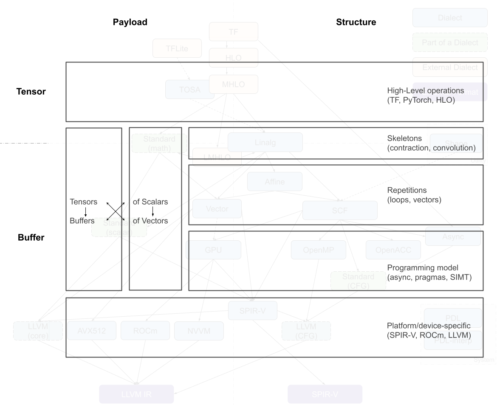

# Codegen Dialect Overview

[Codegen Dialect Overview](https://discourse.llvm.org/t/codegen-dialect-overview/2723)

### Classification 分类

The multiple code generation-related dialects in MLIR can be roughly organized along two axes: *tensor/buffer* and  *payload/structure* .MLIR 中的多个代码生成相关方言可以大致沿着两个轴组织：张量/缓冲区和有效载荷/结构。

A dialect’s position on the tensor/buffer axis indicates whether its main data abstraction is a tensor as found in ML frameworks or a memory buffer as expected by conventional lower-level compilers. Tensors are treated as immutable values that are not necessarily associated with memory, that is, operations on tensors usually don’t have side effects. Data flow between such operations can be expressed using use-definition chains in traditional static single assignment (SSA) form. This is one of the aspects that makes MLIR a powerful transformation vehicle for ML programs, enabling simple rewriting of tensor operations. On the other hand, buffers are mutable and may be subject to aliasing, i.e. several objects may be pointing to the same underlying memory. Data flow can only be extracted through additional dependency and aliasing analyses. The transition between the tensor abstraction and buffer abstraction is performed by the *bufferization* procedure that progressively associates, and ultimately replaces, tensors with buffers. Several dialects, such as Linalg and Standard, contain operations on both tensors and buffers. Some Linalg operations can even operate on both at the same time.

方言在张量/缓冲区轴上的位置表示其主要数据抽象是机器学习框架中找到的张量，还是传统低级编译器期望的内存缓冲区。张量被视为不可变值，不一定与内存相关联，即张量上的操作通常没有副作用。这些操作之间的数据流可以使用传统的静态单赋值（SSA）形式中的使用-定义链来表示。这是使 MLIR 成为机器学习程序强大转换工具的方面之一，它使张量操作的简单重写成为可能。另一方面，缓冲区是可变的，可能受到别名的影响，即多个对象可能指向相同的底层内存。数据流只能通过额外的依赖和别名分析来提取。张量抽象和缓冲区抽象之间的转换是通过缓冲化过程执行的，该过程逐步关联，最终用缓冲区替换张量。一些方言，如 Linalg 和 Standard，包含对张量和缓冲区的操作。一些 Linalg 操作甚至可以同时操作两者。

A dialect’s position on the payload/structure axis indicates whether it describes *what* computation should be performed (payload) or *how* it should be performed (structure). For example, most mathematical operations in the Standard dialect specify the computation to be performed, e.g., the arctangent, without further detail. On the other hand, the SCF dialect defines *how* the contained computation is performed, e.g., repeated until some runtime condition is met, without restricting what the condition is and what computations are performed. Similarly, the Async dialect denotes the general execution model applicable at various levels of payload granularity.

方言在负载/结构轴上的位置表示它描述的是应该执行什么计算（负载）还是如何执行（结构）。例如，标准方言中的大多数数学运算指定要执行的计算，例如反正切，而不提供更多细节。另一方面，SCF 方言定义了包含的计算如何执行，例如重复执行直到满足某些运行时条件，而不限制条件是什么以及执行了哪些计算。同样，Async 方言表示适用于负载粒度不同级别的通用执行模型。

This position on this axis is non-binary, especially at higher level of abstraction. Many operations at least partially specify the structure. For example, vector dialect operations imply SIMD execution model. During the compilation process, the instructions of “how” tend to become more detailed and low-level. Simultaneously, lower levels of the abstraction stack tend to separate the structure operations from the payload operations for the sake of transforming only the former while keeping only an abstract understanding of the payload, e.g., the accessed data or the estimated cost.

此轴上的位置是非二元的，尤其是在更高层次的抽象中。许多操作至少部分地指定了结构。例如，向量方言操作暗示了 SIMD 执行模型。在编译过程中，关于“如何”的指令往往变得更加详细和底层。同时，抽象堆栈的较低级别倾向于将结构操作与有效负载操作分开，以便仅转换前者，同时只保留对有效负载的抽象理解，例如访问的数据或估计的成本。

### Dialects of Interest 感兴趣的语言方言

An MLIR code generation pipeline goes through a sequence of intermediate steps, which are characterized by the most recently introduced dialect. Dialects can be roughly organized into a stack based on the level of abstraction they feature. Converting the representation from a higher-level abstraction to a lower-level abstraction, i.e. lowering, is usually straightforward whereas the inverse process may not be.

MLIR 代码生成管道经过一系列中间步骤，这些步骤由最近引入的方言特征。方言可以根据它们所具有的抽象级别大致组织成堆栈。将表示从高级抽象转换为低级抽象，即降级，通常是直接的，而逆过程可能不是。

Most pipelines enter the in-tree dialect infrastructure through the [Linalg](https://mlir.llvm.org/docs/Dialects/Linalg/) dialect, which features a versatile representation of structured computation on structured data. The dialect is [specifically designed](https://mlir.llvm.org/docs/Rationale/RationaleLinalgDialect/#transformations-and-simplicity-firsta-nametransformations_firsta) to support various transformations with minimal analysis. Operations in this dialect support both tensor and buffer operands and the bufferization process can happen without changing the operations themselves. Furthermore, Linalg provides [“named” operations](https://mlir.llvm.org/docs/Dialects/Linalg/#named-payload-carrying-opsa-namenamed_opsa) with specific payload, such as matrix multiplication and convolution, and [“generic” operations](https://mlir.llvm.org/docs/Dialects/Linalg/#payload-carrying-opsa-namepayload_opsa) that only define the structure. Conversions are available between the two forms. The inherent iterative structure of Linalg dialect operations allows them to be converted into vector operations as well as (affine) loops around vector or scalar operations.

大多数管道通过 Linalg 方言进入树内方言基础设施，该方言具有对结构化数据上结构化计算的灵活表示。该方言专门设计用于支持各种变换，分析最少。该方言中的操作支持张量和缓冲区操作数，缓冲区化过程可以在不改变操作本身的情况下发生。此外，Linalg 提供了具有特定有效载荷的“命名”操作，例如矩阵乘法和卷积，以及仅定义结构的“通用”操作。两种形式之间可以进行转换。Linalg 方言操作的内禀迭代结构允许它们被转换为向量操作以及围绕向量或标量操作的（仿射）循环。

The [Async](https://mlir.llvm.org/docs/Dialects/AsyncDialect/) dialect captures a general asynchronous programming model and may appear at different levels: at a higher level where it is used to[organize large chunks of computation across and within devices, and at a lower level where it can wrap sequences of primitive instructions.

异步方言捕获了一般的异步编程模型，可能出现在不同的级别：在较高级别，它用于[组织和跨设备以及设备内部的大块计算，以及在较低级别，它可以包装原始指令的序列]。

The [Vector](https://mlir.llvm.org/docs/Dialects/Vector/#positioning-in-the-codegen-infrastructure) dialect (Note that the vector *type* belongs to the built-in dialect and can be used outside of the Vector dialect.) is a mid-level abstraction for SIMD and, potentially, SIMT execution models. It leverages MLIR’s multidimensional vector type to target different platforms through dedicated lower-level dialects. An ongoing work investigates the use of [vector abstraction to target GPU](http://discourse.llvm.org/t/vectorops-vector-gpu-for-single-block-warp-or-group-subgroup/1227) devices (SIMT) through explicit representation of threads.

向量方言（请注意，向量类型属于内置方言，可以在向量方言之外使用。）是 SIMD 和潜在 SIMT 执行模型的中间层抽象。它利用 MLIR 的多维向量类型，通过专门的低级方言针对不同的平台。正在进行的工作正在研究使用向量抽象通过显式表示线程来针对 GPU 设备（SIMT）。

The [Affine](https://mlir.llvm.org/docs/Dialects/Affine/) dialect is MLIR’s take on [polyhedral compilation](https://en.wikipedia.org/wiki/Polytope_model). It encapsulates the restrictions of the related programming model and defines the corresponding operations, namely control flow structures such as affine loops and conditionals and affine counterparts of memory operations. Its primary goal is to enable polyhedral transformations, such as auto-parallelization, loop fusion and tiling for locality improvement, and loop vectorization in MLIR.

仿射方言是 MLIR 对多面体编译的见解。它封装了相关编程模型的限制并定义了相应的操作，即控制流结构，如仿射循环和条件以及内存操作的仿射对应物。其主要目标是实现多面体变换，如自动并行化、循环融合和为了局部性改进的循环填充，以及在 MLIR 中的循环向量化。

The [SCF](https://mlir.llvm.org/docs/Dialects/SCFDialect/) (Structured Control Flow) dialect contains the common control flow concepts expressed at a higher level than branches in a control flow graph (CFG), e.g., (parallel) “for” and “while” loops as well as conditionals. This dialect is used to represent, and sometimes transform, the structure of the computation without affecting the payload. It is a common lowering target from Affine and Linalg, which may also be used as an entry point to the MLIR code generation infrastructure from lower-level representations such as C.

SCF（结构化控制流）方言包含在控制流图（CFG）分支以上的高级控制流概念，例如（并行）“for”和“while”循环以及条件语句。此方言用于表示，有时也用于转换，计算结构而不影响有效载荷。它是从 Affine 和 Linalg 的常见降低目标，也可以用作从 C 等底层表示的 MLIR 代码生成基础设施的入口点。

Various programming models, namely [GPU/SIMT](https://mlir.llvm.org/docs/Dialects/GPU/), [Async](https://mlir.llvm.org/docs/Dialects/AsyncDialect/), [OpenMP](https://mlir.llvm.org/docs/Dialects/OpenMPDialect/) and [OpenACC](https://mlir.llvm.org/docs/Dialects/OpenACCDialect/) can be obtained from the SCF dialect. Each of these models is represented by a corresponding dialect, the operations in which are rarely subject to further *optimizing* transformations. However, these representations are an opportunity to implement transformations specific to the programming model, e.g., ones currently explored for the Async dialect.

各种编程模型，即 GPU/SIMT、异步、OpenMP 和 OpenACC，可以从 SCF 方言中获取。每个模型都由相应的方言表示，其中的操作很少受到进一步优化转换的影响。然而，这些表示是实现特定于编程模型的转换的机会，例如目前为异步方言探索的转换。

SCF can also be converted to the “standard” CFG representation by replacing structured control flow with branches between blocks. The branch operations are currently contained in the Standard dialect, together with numerous other operations at various abstraction levels. For example, the Standard dialect also contains pointwise operations on tensors and vectors, conversions between buffers and tensors, trigonometric operations on scalars, etc. Therefore, the Standard dialect [is in the process of being split](http://discourse.llvm.org/t/rfc-splitting-the-standard-dialect/2312) into multiple well-defined dialects.

SCF 也可以通过用块之间的分支替换结构化控制流来转换为“标准”CFG 表示。分支操作目前包含在标准方言中，以及各种抽象级别上的许多其他操作。例如，标准方言还包含张量和向量的逐点操作、缓冲区和张量之间的转换、标量的三角运算等。因此，标准方言正在被拆分为多个定义良好的方言。

Ultimately, parts of the Standard dialect (operations on scalars and vectors, and branches) are converted into target-specific dialects that mostly serve as exit points from the MLIR code generation infrastructure. These include the [LLVM](https://mlir.llvm.org/docs/Dialects/LLVM/), [NVVM](https://mlir.llvm.org/docs/Dialects/NVVMDialect/), [ROCDL](https://mlir.llvm.org/docs/Dialects/ROCDLDialect/), [AVX](https://mlir.llvm.org/docs/Dialects/LLVMAVX512/), [Neon](https://mlir.llvm.org/docs/Dialects/LLVMArmNeon/), [SVE](https://mlir.llvm.org/docs/Dialects/LLVMArmSve/) and [SPIR-V](https://mlir.llvm.org/docs/Dialects/SPIR-V/) dialects, all of which correspond to an external format, IR or instruction set. These dialects are not subject to transformation except for canonicalization.

最终，标准方言（标量与向量的操作以及分支）被转换为特定目标的方言，这些方言主要作为从 MLIR 代码生成基础设施的出口点。这包括 LLVM、NVVM、ROCDL、AVX、Neon、SVE 和 SPIR-V 方言，所有这些都对应于外部格式、IR 或指令集。这些方言除了规范化外，不受转换的影响。

Finally, the [Shape](https://mlir.llvm.org/docs/Dialects/ShapeDialect/) dialect is used to describe shapes of data independently of the payload or (mostly) structure. It appears at the entry level of the code generation pipeline and is typically lowered into address arithmetic or canonicalized away.

最后，Shape 方言用于独立于有效载荷或（主要是）结构来描述数据形状。它在代码生成管道的入口级别出现，通常被降低为地址算术或规范化。

[PDL](https://mlir.llvm.org/docs/Dialects/PDLOps/) ([Pattern Description Language](https://drive.google.com/corp/drive/folders/1hb_sXbdMbIz95X-aaa6Vf5wSYRwsJuve)) and [PDLInterp](https://mlir.llvm.org/docs/Dialects/PDLInterpOps/) dialects are used by the next-generation pattern-rewriting infrastructure for MLIR to specify transformations. As such, they never appear in the code generation pipeline, but may be necessary to describe its operation.

PDL（模式描述语言）和 PDLInterp 方言被下一代模式重写基础设施 MLIR 用于指定转换。因此，它们从未出现在代码生成管道中，但可能是描述其操作所必需的。

## Some Existing Pipelines 一些现有管道

### TensorFlow Kernel Generator TensorFlow 内核生成器

[codegen 4 Kernel generator pipeline代码生成器 4 内核生成器管道**1170×954 120 KB**](https://global.discourse-cdn.com/flex015/uploads/llvm/original/1X/bf319d01863dd4174ff41867f231d8aa9d7b10e9.png "codegen 4 Kernel generator pipeline")

The Tensorflow Kernel Generator project, starting at the TensorFlow (TF) dialect, has recently switched to targeting Linalg-on-tensors from [MHLO](https://github.com/tensorflow/mlir-hlo#meta-hlo-dialect-mhlo) (Meta HLO, more suitable for compilation thanks to, e.g., removal of implicit broadcasting, and with support for dynamic shapes; where [HLO](https://www.tensorflow.org/xla/operation_semantics) is High-Level Optimizer representation, derived from XLA) instead of [LMHLO](https://github.com/tensorflow/mlir-hlo#lmhlo) (Late MHLO, same as MHLO but on buffers rather than tensors) and performs fusion at that level before calling [bufferization](https://mlir.llvm.org/docs/Bufferization/) on Linalg. Further loop transformations such as tiling happen at the SCF level, which is then converted into target-specific GPU dialect while the payload operations are converted to the LLVM dialect with Standard as intermediary. Now-retired prototypes have experimented with using LMHLO dialect targeting Linalg-on-Buffers and performing all transformations on SCF, where it may be more complex than on tensor abstraction.

Tensorflow 内核生成器项目，从 TensorFlow（TF）方言开始，最近已切换到针对 Linalg-on-tensors 从 MHLO（元 HLO，由于例如去除隐式广播等，更适合编译，并支持动态形状；其中 HLO 是高级优化表示，源自 XLA）而不是 LMHLO（延迟 MHLO，与 MHLO 相同，但针对缓冲区而不是张量）的目标，并在该级别进行融合，然后在调用 Linalg 的缓冲区上进行缓冲化。进一步的循环转换，如 tiling，发生在 SCF 级别，然后将其转换为特定于目标 GPU 方言，而有效负载操作则转换为 LLVM 方言，以标准作为中介。现在已退役的原型已尝试使用针对 Linalg-on-Buffers 的 LMHLO 方言，并在 SCF 上执行所有转换，这可能比在张量抽象上更复杂。

When producing several kernels, TensorFlow-related flows are expected to use the Async dialect to orchestrate computation.

当生成多个内核时，TensorFlow 相关的流程应使用异步方言来编排计算。

## Analysis 分析

### Crossing Dialects 跨越方言

In hindsight, it appears that the dialects that cross axis boundaries in this classification (GPU, Linalg and Vector) have required the most discussion and iteration before being accepted as part of the core ecosystem. Even now, users of MLIR infrastructure reported that it was challenging to understand the positioning of some dialects. For example, IREE uses parts of the GPU dialect related to on-device execution, but not the parts related to managing data and kernels from the host, which are closer related to the structure than to the payload. Similarly, the discussion on bridging the tensor and memref abstraction with corresponding operations required significant effort to converge.

回顾起来，在这个分类（GPU、Linalg 和 Vector）中跨越轴边界的地方，方言需要最多的讨论和迭代才能被接受为核心生态系统的一部分。即便现在，MLIR 基础设施的用户报告称，理解某些方言的位置仍然具有挑战性。例如，IREE 使用了与设备上执行相关的 GPU 方言的一部分，但没有使用与从主机管理数据和内核相关的部分，这些部分与结构比与有效载荷更相关。同样，关于将张量和 memref 抽象与相应的操作桥接的讨论也耗费了大量精力以达成共识。

This suggests that new dialects, or smaller IR concepts, can be easier to discuss and reach consensus if they are clearly positioned with respect to other dialects and the design space. When it is necessary to cross the gap between abstractions, it may be preferable to discuss it separately and aim for generalization between dialects (e.g., bufferization process).

这表明，如果新方言或较小的 IR 概念在与其他方言和设计空间的关系中明确定位，它们可能更容易讨论和达成共识。当需要跨越抽象之间的差距时，最好单独讨论，并旨在方言之间实现泛化（例如，缓冲过程）。

### Linalg at the Center 线性代数在中心

The Linalg dialect is one of the main entry points to the MLIR code generation pipelines. Its most recent evolution makes it operate on both tensors and buffers, making bufferization an intra-dialect transformation. It has sufficiently high-level information about the operations to perform transformations without expensive analyses, especially when operating on tensors as values. Some transformations like fusion of element-wise operations and tiling, and combination thereof to generate imperfectly nested computations capture a sufficient amount of transformations needed to target a broad range of architectures. Furthermore, the concept of named operations enables payload-carrying operations that build on the computational patterns of Linalg.

Linalg 方言是 MLIR 代码生成管道的主要入口之一。其最新的演变使其能够在张量和缓冲区上运行，使缓冲区化为方言内部的转换。它对要执行的操作具有足够的高级信息，可以在不进行昂贵分析的情况下进行转换，尤其是在将张量作为值操作时。一些转换，如逐元素操作的融合和分块，以及将它们组合起来生成不完美嵌套的计算，捕获了针对广泛架构所需的大量转换。此外，命名操作的概念使得基于 Linalg 计算模式的携带有效载荷的操作成为可能。

Being exercised in virtually all compilation pipelines adds maintenance pressure and stability requirements on Linalg as production users start to rely on it. The fact that it works across buffers and tensors, and may capture both the payload and the structure of the computation makes understanding Linalg to some extent a requirement for understanding any MLIR code generation pipeline. While there are benefits in having one well-defined and maintained entry point, extra care must be taken to ensure that Linalg remains composable with other dialects and that transformation algorithms are not over-designed for it.

在几乎所有编译管道中都被使用，给 Linalg 带来了维护压力和稳定性要求，随着生产用户开始依赖它。它能够在缓冲区和张量之间工作，并可能捕获计算的有效载荷和结构，这在一定程度上使得理解 Linalg 成为理解任何 MLIR 代码生成管道的必要条件。虽然有一个定义良好且维护良好的入口点有其好处，但必须格外小心，以确保 Linalg 与其他方言保持可组合性，并且变换算法不要过度设计。

### Pipeline Differences to Complementary Transformations管道差异与互补变换

Several parallel compilation pipelines appear to emerge in the ecosystem. The case of targeting GPUs is particularly illustrative: optimizing transformations, parallelism detection and device mapping decisions can happen in various dialects (Linalg, Affine, SCF), which may end up partially reimplementing each other’s functionality; device mapping can derive SIMT threads from explicit loops or from vectors, using the SCF or the Vector dialect. Finally, GPU libraries have support for higher-level operations such as contractions and convolutions, that could be directly targeted from the entry point of the code generation pipeline.

几个并行编译管道似乎在生态系统中出现。针对 GPU 的情况尤其具有说明性：优化转换、并行性检测和设备映射决策可以在各种方言（Linalg、Affine、SCF）中发生，这可能导致部分重新实现彼此的功能；设备映射可以从显式循环或向量中推导出 SIMT 线程，使用 SCF 或 Vector 方言。最后，GPU 库支持更高层次的运算，如收缩和卷积，这些运算可以直接从代码生成管道的入口点进行定位。

It is more important than ever to make sure representations and transformations compose and complement each other to deliver on MLIR’s promise to unify the compilation infrastructure, as opposed to building independent parallel flows. It does not necessarily mean immediately reusing all components, but avoid poorly composable patterns as much as possible. The utility of domain- and target-specific compilers is undeniable, but the project may need to invest into cross-cutting representations, using the generic mechanisms of attributes and interfaces. Circling back to targeting GPUs as an example, a device mapping strategy expressed as attributes that can be attached to different operations (e.g., Linalg generics or parallel SCF loops) that can be transformed through interfaces without needing to know the details of a specific operation.

确保表示和变换相互组合和补充，以实现 MLIR 统一编译基础设施的承诺，比以往任何时候都更加重要，而不是构建独立的并行流程。这并不意味着立即重用所有组件，但应尽可能避免不良的可组合模式。领域和目标特定编译器的效用无可否认，但项目可能需要投资于跨领域的表示，使用属性和接口的通用机制。以针对 GPU 为例，一种设备映射策略可以表示为可以附加到不同操作（例如，Linalg 泛型或并行 SCF 循环）的属性，这些操作可以通过接口进行转换，而无需了解特定操作的详细信息。

### Build Small Reusable Abstractions构建小型可重用抽象

One can observe an unsurprising tendency of performing most transformations in the higher levels of the code generation pipeline: the necessary validity information is readily available or easily extractable at these levels without the need for complex analyses. Yet, higher levels of abstraction often have more stringent restrictions of what is representable. When pursuing benefits of such abstractions, it is important to keep in mind the expressivity and the ability to perform at least some transformations at lower levels as means to quickly increase expressivity without reimplementing the top-level abstraction (dynamic shapes in HLO are a good example).

一个人可以观察到在代码生成管道的高层进行大多数转换的令人惊讶的趋势：必要的有效性信息在这些层面上易于获取或提取，无需复杂的分析。然而，抽象层次越高，对可表示内容的限制通常越严格。在追求这种抽象的好处时，重要的是要记住表达性和在较低层次上执行至少一些转换的能力，作为快速提高表达性的手段，而不需要重新实现顶层抽象（HLO 中的动态形状是一个很好的例子）。

### Need for More Structure 需要更多结构

Another emerging tendency is larger dialects and progressive lowering performed without leaving the dialect boundaries. Some examples include Linalg operations on tensors that get transformed into using buffers, GPU dialect block reductions that get decomposed into shuffles, and math operations in Standard that can be expanded into smaller operations or approximated using other Standard operations. We are reaching a point where a dialect contains several loosely connected subsets of operations. This has led to the proposal of splitting the Standard dialect into multiple components. However, the splitting may not always be desirable or even feasible: the *same* Linalg operations accept tensors and buffers so it is challenging to have separate TLinalg and BLinalg without lots of duplication. This calls for additional ways of structuring the operations within a dialect in a way that is understandable programmatically.

另一种新兴趋势是更大方言和渐进式降低，而无需跨越方言边界。一些例子包括将张量操作转换为使用缓冲区，将 GPU 方言块减少分解为洗牌，以及可以在标准中扩展为较小操作或使用其他标准操作进行近似的标准数学操作。我们正达到一个点，其中方言包含几个松散连接的操作子集。这导致了将标准方言拆分为多个组件的提议。然而，拆分可能并不总是可取或甚至可行：相同的 Linalg 操作接受张量和缓冲区，因此在没有大量重复的情况下，要分别有 TLinalg 和 BLinalg 是具有挑战性的。这需要以可编程方式理解的方式在方言内对操作进行结构化。

### Host/Device Or Program/Kernel As Additional Axis主机/设备或程序/内核作为附加轴

Finally, uses of MLIR in the scope of larger, mostly ML-related, flows prompt for cleaner separation between the aspects that pertain to the overall organization of computations (e.g., operations that reflect the mapping of a model on a distributed system and interaction with the framework that embeds MLIR, typically on a “host”) and organization of individual computations (e.g., operations that correspond to internals of a “kernel” or another large unit of computation, potentially offloaded to a “device”). For “host” parts, code generation may also be necessary and often requires different transformations than for “kernel” parts.

最终，在更大、主要与机器学习相关的流程中使用 MLIR，促使计算整体组织方面的方面（例如，反映模型在分布式系统上的映射以及与嵌入 MLIR 的框架交互的操作，通常在“主机”上）与单个计算组织（例如，对应“内核”或其他大型计算单元内部的操作，可能卸载到“设备”上）之间的分离更加清晰。对于“主机”部分，代码生成可能也是必要的，并且通常需要与“内核”部分不同的转换。

Specific examples of this separation include the GPU dialect that contains operations for both controlling the execution from host and operations executed on the GPU proper, which may benefit from separation into independent dialects, and the Async dialect that is being used on two levels: organizing the execution of independent “kernels” and parallelizing execution within a “kernel” by targeting LLVM coroutines.

具体示例包括包含控制主机执行和 GPU 上执行操作的 GPU 方言，这可能从分离成独立的方言中受益，以及正在两个级别上使用的 Async 方言：通过针对 LLVM 协程组织独立“内核”的执行和通过针对“内核”内的并行执行。
