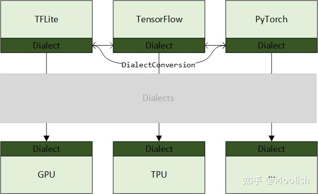
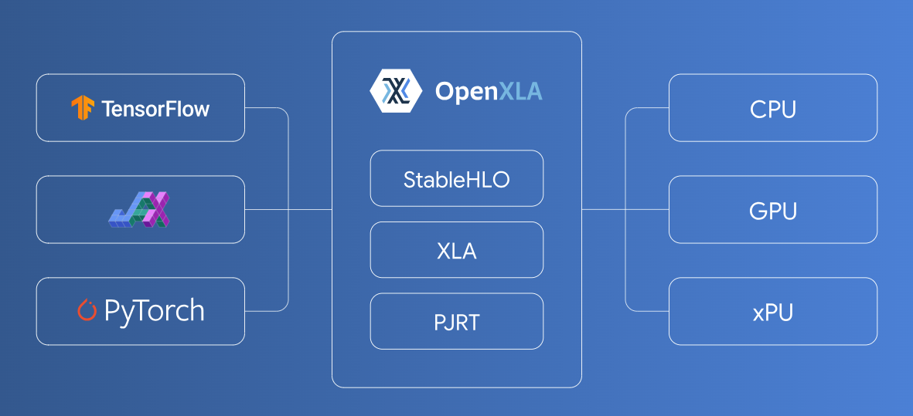

# MLIR Language Reference

[text](https://mlir.llvm.org/talks/)
[text](https://www.lei.chat/zh/posts/mlir-codegen-dialects-for-machine-learning-compilers/)
[text](https://www.cnblogs.com/CocoML/p/17632342.html)

MLIR 基本上是基于一种类图的数据结构，这种结构由称为操作 (Operations) 的节点和称为值 (Values) 的边组成。每个值都是由一个操作或块参数 (Block Argument) 产生的，并且具有由类型系统定义的值类型。操作包含在块 (Blocks) 中，块包含在区域 (Regions) 中。操作在其所属的块中是有顺序的，块在其所属的区域中也是有顺序的，尽管这种顺序在某些类型的区域中可能具有或不具有语义意义。操作还可以包含区域，从而能够表示层次结构。

操作可以表示许多不同的概念，从高层概念（如函数定义、函数调用、缓冲区分配、缓冲区的视图或切片以及进程创建）到低层概念（如与目标无关的算术、与目标相关的指令、配置寄存器和逻辑门）。这些不同的概念由 MLIR 中的不同操作表示，并且 MLIR 中可用的操作集可以任意扩展。

MLIR 还提供了一个可扩展的框架，用于对操作进行转换，使用了编译器 Passes 的常见概念。对任意操作集启用任意转换集会带来显著的扩展挑战，因为每个转换都必须可能考虑到任何操作的语义。MLIR 通过允许操作语义使用特性 (Traits) 和接口 (Interfaces) 进行抽象描述，解决了这一复杂性，从而使转换能够更通用地操作这些操作。特性通常描述了对有效中间表示 (IR) 的验证约束，从而能够捕获并检查复杂的不变量。（参见 Op vs Operation）

MLIR 的一个明显应用是表示基于静态单赋值形式 (SSA) 的中间表示 (IR)，如 LLVM 核心 IR，使用适当的操作类型来定义模块、函数、分支、内存分配和验证约束，以确保 SSA 主导性 (Dominance) 属性。MLIR 包含了一组定义了这些结构的方言 (Dialects)。然而，MLIR 的设计足够通用，也可以表示其他类似编译器的数据结构，例如语言前端中的抽象语法树、目标特定后端中生成的指令或高级综合工具中的电路。

[text](https://www.zhihu.com/question/435109274)

关于MLIR基本模块学习过程如下：

1. Dialect, Attribute, Type, Operation；想象如果自己去实现，该怎么设计类；
2. DialectConversion；想象在自己实现的前四个模块上，如何实现DialectConversion；
3. Interface, Constraint, Trait；同样，想象自己会怎么增加这些功能；
4. Transformation, Concalization；
5. Region, Block：基于1. 设计的Operation，以及4. 增加的Transformation，想象如何对Operation进行抽象，提取出Region和Block的概念；
6. Pass；
7. 最后才是ODS和DRR。

[MLIR中Dialects分类及关联](https://zhuanlan.zhihu.com/p/446836964)

## OpenXLA

[openxla](https://openxla.org/)

An open ecosystem of performant, portable, and extensible machine learning (ML) infrastructure components that simplify ML development by defragmenting the tools between frontend frameworks and hardware backends. Built by industry leaders in AI modeling, software, and hardware.

一个由高性能、可移植和可扩展的机器学习 (ML) 基础设施组件组成的开放生态系统，可通过对前端框架和硬件后端之间的工具进行碎片整理来简化 ML 开发。由 AI 建模、软件和硬件领域的行业领导者构建。

### XLA

XLA (Accelerated Linear Algebra) is an open source compiler for machine learning. The XLA compiler takes models from popular frameworks such as PyTorch, TensorFlow, and JAX, and optimizes the models for high-performance execution across different hardware platforms including GPUs, CPUs, and ML accelerators.

XLA（加速线性代数）是一个用于机器学习的开源编译器。 XLA 编译器采用来自 PyTorch、TensorFlow 和 JAX 等流行框架的模型，并优化模型，以便在不同的硬件平台（包括 GPU、CPU 和 ML 加速器）上实现高性能执行。

#### Key benefits 主要优点

* **Build anywhere** : XLA is already integrated into leading ML frameworks such as TensorFlow, PyTorch, and JAX.
  * 随处构建：XLA 已集成到领先的 ML 框架中，例如 TensorFlow、PyTorch 和 JAX。
* **Run anywhere** : It supports various backends including GPUs, CPUs, and ML accelerators, and includes a pluggable infrastructure to add support for more.
  * 随处运行：它支持各种后端，包括 GPU、CPU 和 ML 加速器，并包含可插拔基础设施以增加对更多后端的支持。
* **Maximize and scale performance** : It optimizes a model's performance with production-tested optimization passes and automated partitioning for model parallelism.
  * 最大化和扩展性能：它通过经过生产测试的优化过程和模型并行性的自动分区来优化模型的性能。
* **Eliminate complexity** : It leverages the power of [MLIR](https://mlir.llvm.org/) to bring the best capabilities into a single compiler toolchain, so you don't have to manage a range of domain-specific compilers.
  * 消除复杂性：它利用了 MLIR将最佳功能引入单个编译器工具链，因此您无需管理一系列特定于域的编译器。
* **Future ready** : As an open source project, built through a collaboration of leading ML hardware and software vendors, XLA is designed to operate at the cutting-edge of the ML industry.
  * 面向未来：作为一个开源项目，通过领先的 ML 硬件和软件供应商的合作构建，XLA 旨在在 ML 行业的前沿运行。

### StableHLO

StableHLO is an operation set for high-level operations (HLO) in machine learning (ML) models. Essentially, it's a portability layer between different ML frameworks and ML compilers: ML frameworks that produce StableHLO programs are compatible with ML compilers that consume StableHLO programs.

StableHLO 是机器学习 (ML) 模型中高级操作 (HLO) 的操作集。本质上，它是不同 ML 框架和 ML 编译器之间的可移植层：生成 StableHLO 程序的 ML 框架与使用 StableHLO 程序的 ML 编译器兼容。

### Shardy

Shardy is an MLIR-based tensor partitioning system for all dialects. Built from the collaboration of both the GSPMD and PartIR teams, it incorporates the best of both systems, and the shared experience of both teams and users.

Shardy 是一个基于 MLIR 的张量划分系统，适用于所有方言。它由 GSPMD 和 PartIR 团队合作构建，融合了两个系统的优点以及团队和用户的共享体验。

### PJRT

PJRT is a hardware and framework independent interface for ML compilers and runtimes. It is currently included with the XLA distribution. See the XLA GitHub and documentation for more information on how to use and integrate PJRT.

PJRT 是用于 ML 编译器和运行时的独立于硬件和框架的接口。目前它包含在 XLA 发行版中。有关如何使用和集成 PJRT 的更多信息，请参阅 XLA GitHub 和文档。

## TF(TensorFlow) Dialect

This dialect maps to TensorFlow operations. 该方言映射到 TensorFlow 操作。

Invariants: 不变量：

* All values are of Tensor type (in particular, scalars are represented using zero-dimensional tensors);
* 所有值都是 Tensor 类型（特别是标量使用零维张量表示）；

TODO: Make invariants more structured so that we can reference them in ops.TODO：

使不变量更加结构化，以便我们可以在操作中引用它们。
