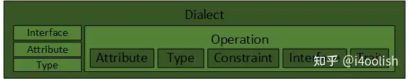
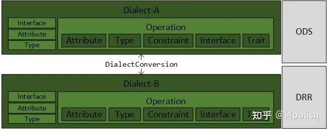

MLIR Language Reference

MLIR 基本上是基于一种类图的数据结构，这种结构由称为操作 (Operations) 的节点和称为值 (Values) 的边组成。每个值都是由一个操作或块参数 (Block Argument) 产生的，并且具有由类型系统定义的值类型。操作包含在块 (Blocks) 中，块包含在区域 (Regions) 中。操作在其所属的块中是有顺序的，块在其所属的区域中也是有顺序的，尽管这种顺序在某些类型的区域中可能具有或不具有语义意义。操作还可以包含区域，从而能够表示层次结构。

操作可以表示许多不同的概念，从高层概念（如函数定义、函数调用、缓冲区分配、缓冲区的视图或切片以及进程创建）到低层概念（如与目标无关的算术、与目标相关的指令、配置寄存器和逻辑门）。这些不同的概念由 MLIR 中的不同操作表示，并且 MLIR 中可用的操作集可以任意扩展。

MLIR 还提供了一个可扩展的框架，用于对操作进行转换，使用了编译器 Passes 的常见概念。对任意操作集启用任意转换集会带来显著的扩展挑战，因为每个转换都必须可能考虑到任何操作的语义。MLIR 通过允许操作语义使用特性 (Traits) 和接口 (Interfaces) 进行抽象描述，解决了这一复杂性，从而使转换能够更通用地操作这些操作。特性通常描述了对有效中间表示 (IR) 的验证约束，从而能够捕获并检查复杂的不变量。（参见 Op vs Operation）

MLIR 的一个明显应用是表示基于静态单赋值形式 (SSA) 的中间表示 (IR)，如 LLVM 核心 IR，使用适当的操作类型来定义模块、函数、分支、内存分配和验证约束，以确保 SSA 主导性 (Dominance) 属性。MLIR 包含了一组定义了这些结构的方言 (Dialects)。然而，MLIR 的设计足够通用，也可以表示其他类似编译器的数据结构，例如语言前端中的抽象语法树、目标特定后端中生成的指令或高级综合工具中的电路。

[text](https://www.zhihu.com/question/435109274)

关于MLIR基本模块学习过程如下：

1. Dialect, Attribute, Type, Operation；想象如果自己去实现，该怎么设计类；
2. DialectConversion；想象在自己实现的前四个模块上，如何实现DialectConversion；
3. Interface, Constraint, Trait；同样，想象自己会怎么增加这些功能；
4. Transformation, Concalization；
5. Region, Block：基于1. 设计的Operation，以及4. 增加的Transformation，想象如何对Operation进行抽象，提取出Region和Block的概念；
6. Pass；
7. 最后才是ODS和DRR。

[MLIR中Dialects分类及关联](https://zhuanlan.zhihu.com/p/446836964)