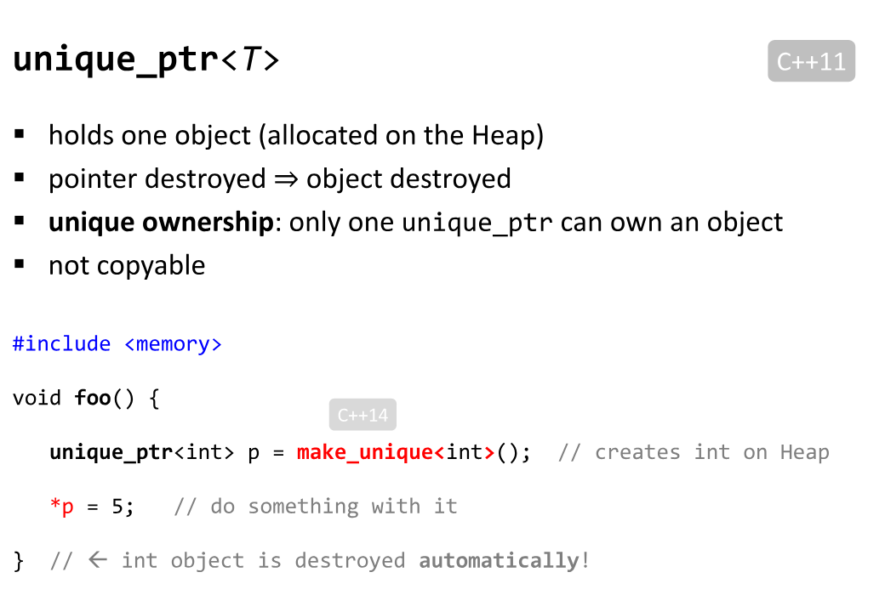

# Morden Cpp

## Links

- [cppreference](https://en.cppreference.com/w/)
- [modern-cpp](https://changkun.de/modern-cpp/)
- [hackingcpp](https://hackingcpp.com/index.html)
- [cppweeklynews](https://github.com/wanghenshui/cppweeklynews)
- [RVO and NRVO](https://pvs-studio.com/en/blog/terms/6516/)
- [github: Mq-b/ModernCpp-ConcurrentProgramming-Tutorial](https://github.com/Mq-b/ModernCpp-ConcurrentProgramming-Tutorial)

awesome repositories:

- [github: awesome-cpp](https://github.com/fffaraz/awesome-cpp)
- cli arg parse:
  - [github.com: p-ranav/argparse](https://github.com/p-ranav/argparse)

## Misc

### Smart Pointers

All programming languages must answer:

- how to allocate the resources?
- how to get the read only access to the resource?
- how to get the mut/write access to the resource?
- how to pass or move the access of the resource?
- when to give up the access to the resource?
- when to release the resources?
- ~~
- practical answer: resource ownership with lifetime

[Back to Basics: Smart Pointers and RAII - Inbal Levi - CppCon 2021](https://www.youtube.com/watch?v=07rJOzFRs6M)
[hacking cpp: unique_ownership](https://hackingcpp.com/cpp/std/unique_ownership.html)

- The ownership model in C++
- syntax and design of smart pointers and RAII

ownership events:

- moving an object
- passing an object as a function parameter
- returning an object from a function

smart pointers

- `unique_ptr`: single ownership
- `shared_ptr`: multiple ownership
- `weak_ptr`: non ownership

RESOURCE MANAGEMENT-RAII

- Standard library classes using RAll
  - std:string, std::vector - free memory on DTOR
  - std::jthread - rejoin on DTOR
- Standard library utilities
  - std::unique_lock - exclusive mutex wrapper (C++11)
  - std::shared_lock - shared mutex wrapper (C++14)
  - std:lock_guard - ownership of a mutex in a scope (C++11)
  - std::scoped_lock - ownership of multiple mutexes (avoids deadlock) (C++11)
  - experimental:scope_exit - general purpose scope guard
- Guidelines Support Library ([github: Microsoft GSL](https://github.com/Microsoft/GSL))
  - gsl::owner - a wrapper which prevents multiple ownership to an object

unique_ptr

[hacking cpp: unique_ptr](https://hackingcpp.com/cpp/std/unique_ownership.html)

shared_ptr

[hacking cpp: shared_ownership](https://hackingcpp.com/cpp/std/shared_ownership.html).

