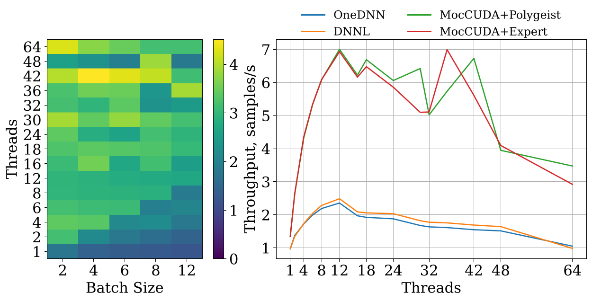
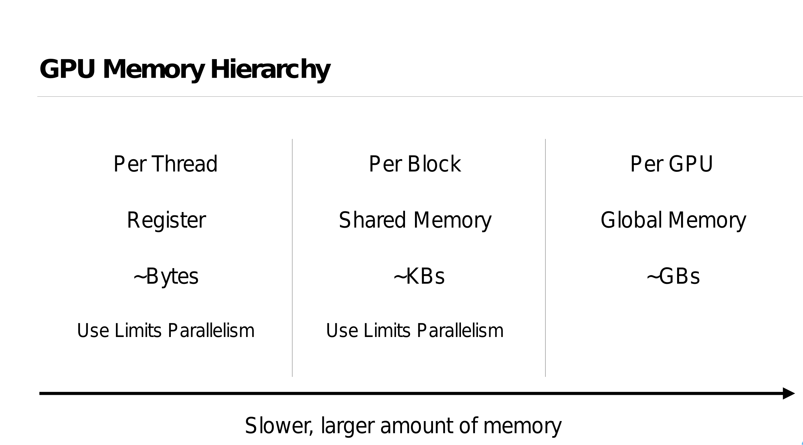

# [Polygeist: Raising C to Polyhedral MLIR](https://ieeexplore.ieee.org/document/9563011)

Published in: 2021 30th International Conference on Parallel Architectures and Compilation Techniques (PACT)

发表于：2021 年第 30 届国际并行架构与编译技术会议（PACT）

Abstract: 摘要：

We present Polygeist, a new compilation flow that connects the MLIR compiler infrastructure to cutting edge polyhedral optimization tools. It consists of a C and C++ frontend capable of converting a broad range of existing codes into MLIR suitable for polyhedral transformation and a bi-directional conversion between MLIR and OpenScop exchange format. The Polygeist/MLIR intermediate representation featuring high-level (affine) loop constructs and n-D arrays embedded into a single static assignment (SSA) substrate enables an unprecedented combination of SSA-based and polyhedral optimizations. We illustrate this by proposing and implementing two extra transformations: statement splitting and reduction parallelization. Our evaluation demonstrates that Polygeist outperforms on average both an LLVM IR-level optimizer (Polly) and a source-to-source state-of-the-art polyhedral compiler (Pluto) when exercised on the Polybench/C benchmark suite in sequential (2.53x vs 1.41x, 2.34x) and parallel mode (9.47x vs 3.26x, 7.54x) thanks to the new representation and transformations.

我们介绍 Polygeist，这是一种新的编译流程，它将 MLIR 编译器基础设施与前沿的多面体优化工具连接起来。它包括一个 C 和 C++前端，能够将广泛现有的代码转换为适用于多面体变换的 MLIR，并实现 MLIR 与 OpenScop 交换格式的双向转换。具有高级（仿射）循环构造和嵌入到单个静态赋值（SSA）基底的 Polygeist/MLIR 中间表示，实现了基于 SSA 和多面体优化的前所未有的组合。我们通过提出并实现两个额外的转换来展示这一点：语句拆分和减少并行化。我们的评估表明，在 Polybench/C 基准测试套件上，Polygeist 在顺序（2.53 倍 vs 1.41 倍，2.34 倍）和并行模式（9.47 倍 vs 3.26 倍，7.54 倍）上平均优于 LLVM IR 级别的优化器（Polly）和源到源的前沿多面体编译器（Pluto），这得益于新的表示和转换。

[William S. Moses](https://wsmoses.com/academic/)

[Polygeist: Affine C in MLIR [MLIR Open Design Meeting 02/11/2021]](https://www.youtube.com/watch?v=GF45kitd3nY)

https://www.youtube.com/@billymoses7764

[getting_started/Use_Polygeist](https://polygeist.llvm.org/getting_started/Use_Polygeist/)

[Retargeting and Respecializing GPU Workloads for Performance Portability](https://ieeexplore.ieee.org/document/10444828)

重新定位和针对性能可移植性重新专业化的 GPU 工作负载

In order to come close to peak performance, accelerators like GPUs require significant architecture-specific tuning that understand the availability of shared memory, parallelism, tensor cores, etc. Unfortunately, the pursuit of higher performance and lower costs have led to a significant diversification of architecture designs, even from the same vendor. This creates the need for performance portability across different GPUs, especially important for programs in a particular programming model with a certain architecture in mind. Even when the program can be seamlessly executed on a different architecture, it may suffer a performance penalty due to it not being sized appropriately to the available hardware resources such as fast memory and registers, let alone not using newer advanced features of the architecture. We propose a new approach to improving performance of (legacy) CUDA programs for modern machines by automatically adjusting the amount of work each parallel thread does, and the amount of memory and register resources it requires. By operating within the MLIR compiler infrastructure, we are able to also target AMD GPUs by performing automatic translation from CUDA and simultaneously adjust the program granularity to fit the size of target GPUs. Combined with autotuning assisted by the platform-specific compiler, our approach demonstrates 27% geomean speedup on the Rodinia benchmark suite over baseline CUDA implementation as well as performance parity between similar NVIDIA and AMD GPUs executing the same CUDA program.

为了接近峰值性能，像 GPU 这样的加速器需要针对特定架构进行显著的调整，这些调整理解共享内存、并行性、张量核心等的可用性。不幸的是，追求更高的性能和更低的成本导致了架构设计的显著多样化，即使是来自同一供应商的产品也是如此。这产生了在不同 GPU 之间实现性能可移植性的需求，这对于特定编程模型和特定架构的程序尤为重要。即使程序可以在不同的架构上无缝执行，它也可能因为未适当调整以适应可用的硬件资源（如快速内存和寄存器）而遭受性能损失，更不用说没有使用架构的新先进特性。我们提出了一种新方法，通过自动调整每个并行线程执行的工作量以及它所需的内存和寄存器资源，来提高（遗留）CUDA 程序在现代机器上的性能。 通过在 MLIR 编译器基础设施中操作，我们能够通过自动从 CUDA 进行翻译来针对 AMD GPU 进行目标定位，同时调整程序粒度以适应目标 GPU 的大小。结合平台特定编译器辅助的自动调整，我们的方法在 Rodinia 基准测试套件上相对于基线 CUDA 实现实现了 27%的几何平均速度提升，以及执行相同 CUDA 程序时类似 NVIDIA 和 AMD GPU 之间的性能对等。

Frontend Performance Differences

- 8% performance boost on Floyd-Warshall occurs if Polygeist generates a single MLIR module for both benchmarking and timing code by default

- MLIR doesn't properly generate LLVM datalayout, preventing vectorization for MLIR-generated code (patched in our lowering)

- Different choice of allocation function can make a 30% impact on some tests (adi)

- LLVM strength-reduction is fragile and sometimes misses reversed loop induction variable (remaining gap in adi)

- 如果 Polygeist 默认为基准测试和计时代码生成单个 MLIR 模块，则 Floyd-Warshall 的性能将提升 8%

- MLIR 无法正确生成 LLVM 数据布局，从而阻止了 MLIR 生成的代码的矢量化（在我们的降低版本中进行了修补）

- 不同的分配函数选择可能会对某些测试 （adi） 产生 30% 的影响

- LLVM 强度降低很脆弱，有时会错过反向环感应变量（ADI 中的剩余间隙）

### Poligeist MLIR Compiler Frontend

Polygeist 的核心功能
Polygeist 的主要目标是 bridging the gap between C/C++ and MLIR。它具有以下核心功能:

C/C++前端:能够解析和分析广泛的 C 和 C++代码。
MLIR 生成:将 C/C++代码转换为适合多面体变换的 MLIR 表示。
多面体优化:利用 MLIR 的多面体优化能力进行高级循环优化。
并行优化:支持自动并行化和并行构造的优化。
GPU 后端支持:包括 CUDA 和 ROCm 后端,实现 GPU 加速。
这些功能使 Polygeist 成为连接传统 C/C++代码和现代 MLIR 编译架构的关键工具。

Polygeist 的工作原理
Polygeist 的工作流程可以简要概括为以下几个步骤:

解析 C/C++代码:使用 Clang 的前端能力解析输入的 C/C++代码。
AST 分析:对抽象语法树(AST)进行深入分析,提取程序的结构和语义信息。
MLIR 生成:基于 AST 分析结果,生成对应的 MLIR 表示。
多面体建模:将 MLIR 表示转换为多面体模型,为后续优化铺平道路。
优化应用:应用多面体优化、并行优化等高级优化技术。
代码生成:将优化后的 MLIR 转换回 LLVM IR 或直接生成目标代码。
通过这一系列步骤,Polygeist 能够充分利用 MLIR 的强大功能,同时保持对原始 C/C++代码的兼容性。

Polygeist 的优势与应用
Polygeist 为 C/C++程序带来了诸多优势:

高级优化:通过多面体模型,可以进行更复杂和有效的循环优化。
并行化:自动检测和利用并行机会,提高程序性能。
可移植性:通过 MLIR 表示,可以更容易地将程序移植到不同的硬件平台。
GPU 加速:内置的 CUDA 和 ROCm 后端支持,简化 GPU 编程。
与 LLVM 生态系统集成:作为 LLVM 项目的一部分,可以无缝集成到现有的 LLVM 工具链中。
这些优势使 Polygeist 在高性能计算、科学计算、机器学习等领域具有广泛的应用前景。

实际应用案例
以下是 Polygeist 在实际项目中的应用案例:

科学计算优化:在一个大规模数值模拟项目中,使用 Polygeist 对核心计算 kernel 进行优化,通过多面体变换和自动并行化,性能提升了 30%。

机器学习框架:某开源机器学习框架使用 Polygeist 优化其 C++后端,实现了更高效的张量运算,在某些模型上推理速度提升了 20%。

图形渲染引擎:一个游戏引擎项目利用 Polygeist 的 GPU 后端支持,简化了 CUDA 代码的生成过程,大大提高了开发效率。

这些案例展示了 Polygeist 在提升程序性能和简化开发流程方面的巨大潜力。

```bash
cgeist input.c -S -emit-mlir | mlir-opt --canonicalize --cse > output.mlir

```

### 2022 LLVMHPC William S. Moses, Polygeist: C++ Frontend for MLIR

[text](https://www.youtube.com/watch?v=LIHxtR4Hop4)

#### The MLIR Framework

- MLIR is a recent compiler infrastructure designed for reuse and extensibility
- Rather than providing a predefined set of instructions and types, MLIR operates on collections of dialects that contain sets of interoperable user-defined operations, attributes and types
- Anyone can define their own optimizable dialect/operation, with a large set of existing dialects (structured control flow, affine, GPU, quantum, fully homomorphic encryption, circuits, LLVM, and more!)
- MLIR 是一种为重用和可扩展性而设计的最新编译器基础架构
- MLIR 不是提供一组预定义的指令和类型,而是对包含一组可互操作的用户定义操作、属性和类型的方言集合进行操作
- 任何人都可以使用大量现有方言(结构化控制流、仿射、GPU、量子、完全同态加密、电路、LLVM 等!)定义自己可优化的方言/操作。

#### The Polyhedral Model

- Represent programs as a collection of computations and constraints on a multi-dimensional grid (polyhedron)
- Makes it easy to analyze and specify program transformations best exploit the available hardware
- Loop restructuring for spatial/temporal locality, automatic parallelization, etc.
- One of the best frameworks for optimizing compute-intensive programs like machine learning kernels or scientific simulations as well as for programming accelerators.

#### Preserve the parallel structure

- Maintain GPU parallelism in a form understandable to the compiler
- Enables optimization between caller and kernel
- Enable parallelism-specific optimization

- 将程序表示为多维网格(多面体)上的计算和约束集合
- 便于分析和指定最佳利用可用硬件的程序转换
- 用于空间/时间局部性、自动并行化等的循环重构
- 优化机器学习内核或科学模拟等计算密集型程序以及编程加速器的最佳框架之一。

#### Synchronization via Memory

- Synchronization (sync_threads) ensures all threads within a block finish executing codeA before executing codeB
- The desired synchronization behavior can be reproduced by defining sync_threads to have the union of the memory semantics of the code before and after the sync.
- This prevents code motion of instructions which require the synchronization for correctness, but permits other code motion (e.g. index computation).

- 同步 （sync_threads） 确保块中的所有线程在执行 CodeB 之前完成对 CodeA 的执行
- 可以通过定义 sync_threads 来重现所需的同步行为，以便在同步之前和之后具有代码的内存语义的并集。
- 这可以防止需要同步以确保正确性的指令的代码移动，但允许其他代码移动（例如索引计算）。

- High-level synchronization representation enables new optimizations, like sync elimination.
- A synchronize instruction is not needed if the set of read/writes before the sync don’t conflict with the read/writes after the sync.

- 高级同步表示支持新的优化，例如同步消除。
- 如果同步前的读/写集与同步后的读/写集不冲突，则不需要 synchronize 指令。

```c++
__global__ void bpnn_layerforward(...) {
  __shared__ float node[HEIGHT];
  __shared__ float weights[HEIGHT][WIDTH];

  if ( tx == 0 )
    node[ty] = input[index_in] ;

  // Unnecessary Barrier #1
  // None of the read/writes below the sync
  //  (weights, hidden)
  // intersect with the read/writes above the sync
  //  (node, input)
  __syncthreads();

  // Unnecessary Store #1
  weights[ty][tx] = hidden[index];

  __syncthreads();
  // Unnecessary Load #1
  weights[ty][tx] = weights[ty][tx] * node[ty];
  // …
}

```

#### GPU Transpilation

- A unified representation of parallelism enables programs in one parallel architecture (e.g. CUDA) to be compiled to another (e.g. CPU/OpenMP)
- **Most CPU backends do not have an equivalent block synchronization**
- Efficiently lower a top-level synchronization by distributing the parallel for loop around the sync, and interchanging control flow

```llvm
parallel_for %i = 0 to N {
  codeA(%i);
  sync_threads;
  codeB(%i);
}
; =>
parallel_for %i = 0 to N {
  codeA(%i);
}

parallel_for %i = 0 to N {
  codeB(%i);
}
```

#### GPU Synchronization Lowering: Control Flow

Synchronization within control flow (for, if, while, etc) can be lowered by splitting around the control flop and interchanging the parallelism.

```c++
parallel_for %i = 0 to N {
  for %j = … {
    codeB1(%i, %j);
    sync_threads;
    codeB2(%i, %j);
  }
}
; Interchange =>
for %j = … {
    parallel_for %i = 0 to N {
        codeB1(%i, %j);
        sync_threads;
        codeB2(%i, %j);
  }
}
; Split =>
for %j = … {
    parallel_for %i = 0 to N {
        codeB1(%i, %j);
    }
    parallel_for %i = 0 to N {
        codeB2(%i, %j);
    }
}

```

#### GPU Transpilation Performance

- CUDA programs transcompiled by Polygeist not only match the performance of handwritten OpenMP programs, but achieve a speedup!
  - 58% geomean speedup on Rodinia
  - 2.7x geomean speedup on PyTorch versus built-in CPU backend (also using our MocCUDA compatibility layer)




