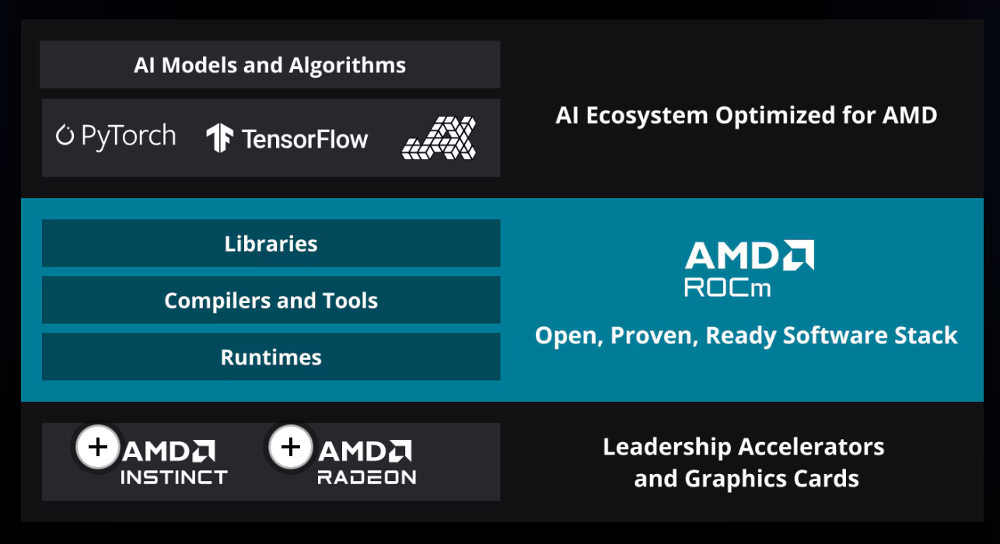

Optimized GPU Software Stack
优化的 GPU 软件堆栈

AMD ROCm™ is an open software stack including drivers, development tools, and APIs that enable GPU programming from low-level kernel to end-user applications. ROCm is optimized for Generative AI and HPC applications, and is easy to migrate existing code into.

AMD ROCm™ 是一个开放软件堆栈，包括驱动程序、开发工具和 API，支持从低级内核到最终用户应用程序的 GPU 编程。 ROCm 针对生成式 AI 和 HPC 应用程序进行了优化，并且易于将现有代码迁移到其中。

ROCm 3 是用于图形处理单元(GPU) 编程的Advanced Micro Devices (AMD) 软件堆栈。 ROCm 跨越多个领域：图形处理单元上的通用计算(GPGPU)、高性能计算(HPC)、异构计算。它提供了多种编程模型： HIP （基于 GPU 内核的编程）、 OpenMP （基于指令的编程）和OpenCL 。

[wiki/ROCm](https://en.wikipedia.org/wiki/ROCm)

[AMD ROCm documentation](https://rocm.docs.amd.com/en/latest/)