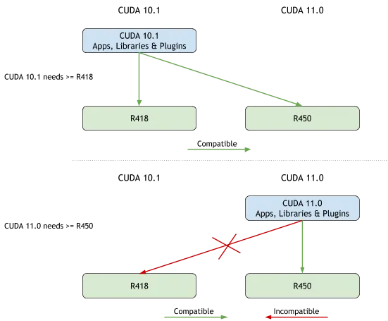

## Installing multiple CUDA + cuDNN versions in the same machine for Tensorflow and Pytorch

[cuda-compatibility](https://docs.nvidia.com/deploy/cuda-compatibility/)




```bash
# add below to your env bash file.

function _switch_cuda {
   v=$1
   export PATH=$PATH:/usr/local/cuda-$v/bin
   export CUDADIR=/usr/local/cuda-$v
   export LD_LIBRARY_PATH=$LD_LIBRARY_PATH:/usr/local/cuda-$v/lib64
   nvcc --version
}
```

And call this function to switch to a corresponding cuda version on your bash session
```bash
_switch_cuda 11.0 # change the version of your like to load bash.
```


## [Multiple Version of CUDA Libraries On The Same Machine](https://blog.kovalevskyi.com/multiple-version-of-cuda-libraries-on-the-same-machine-b9502d50ae77)

```bash
sudo sh cuda-9.1.run --silent --toolkit --toolkitpath=/usr/local/cuda-9.1
```

## [Managing Multiple CUDA Versions on a Single Machine: A Comprehensive Guide](https://towardsdatascience.com/managing-multiple-cuda-versions-on-a-single-machine-a-comprehensive-guide-97db1b22acdc)

```bash
export PATH=/usr/local/cuda-11.8/bin:$PATH
export LD_LIBRARY_PATH=/usr/local/cuda-11.8/lib64:$LD_LIBRARY_PATH

# Activate the virtual environment
echo "export PATH=/usr/local/cuda-11.8/bin:$PATH" >> venv/my_env/bin/activate
echo "LD_LIBRARY_PATH=/usr/local/cuda-11.8/lib64:$LD_LIBRARY_PATH" >> venv/my_env/bin/activate
```