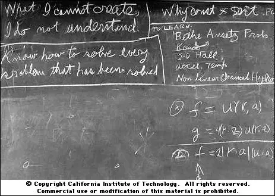

# Feynman

- [wikiquote: Richard_Feynman](https://en.wikiquote.org/wiki/Richard_Feynman)

> "What I cannot create, I do not understand" ^[1]

[1]: https://www.quora.com/What-did-Richard-Feynman-mean-when-he-said-What-I-cannot-create-I-do-not-understand

When Feynman said "create", he did not literally mean that in order to understand particle physics, he had to go Tony Stark on us and build his own accelerator. Instead, he meant that, starting with a blank piece of paper and the knowledge already in his mind, he could take any theoretical result and re-derive it. ("Any" is probably an exaggeration, but he could likely derive whatever he was interested in.)

Feynman thought that ability was the true marker of understanding something because the only way to be able to work something out yourself is to have a firm understanding of each step of the reasoning involved. Further, if you try this, even with relatively simple concepts you think you understand well already, you'll find that you frequently come away from the process with a much deeper appreciation for the problem.

An even more extreme position from Feynman was[1]

Once, I [David Goodstein] said to him, "Dick, explain to me, so that I can understand it, why spin one-half particles obey Fermi-Dirac statistics." Sizing up his audience perfectly, Feynman said, "I'll prepare a freshman lecture on it." But he came back a few days later to say, "I couldn't do it. I couldn't reduce it to the freshman level. That means we don't really understand it."

Feynman meant here that understanding something is not just about working through advanced mathematics. One must also have a notion that is intuitive enough to explain to an audience that cannot follow the detailed derivation.

I've seen a few more sources that spell out Feynman's position on this in detail.

The spinning plate story describes how Feynman felt that curiosity about simple things, and working them out for himself, helped him retain an attitude of play towards his professional work that got him out of a slump.

Feynman's Tips on Physics, an extension to the Feynman lectures, has a chapter about how to learn physics, emphasizing that memorizing formulas is hopeless in the long run, and that by knowing a few key things and understanding the principles, you can work out whatever details you need. I can't find this chapter online, though.

Finally, Feynman's Lost Lecture is a fantastic example of precisely what Feynman meant. In it, he describes his own elementary proof that the inverse square law for gravity leads to elliptical orbits.

当费曼说“创造”时，他并不是说：要理解粒子物理，就必须像托尼·斯塔克那样亲自造一个加速器。而是他认为，从一张白纸和头脑中已有的知识出发，他可以重新推导出任何理论结果。（“任何”可能有些夸张，但很可能会推导出他感兴趣的东西。）

费曼认为，这种能力是真正理解某件事的标志，因为唯一能让你自己解出问题的方法是，对推理过程中的每一步都有一个坚定的理解。此外，如果你尝试这样做，即使是对你已经认为理解得很简单的概念，你也会发现，你经常从过程中获得更深的认识。

费曼甚至更极端的观点是[1]：

有一次，我对他说，“迪克，解释给我听，以便我能理解，为什么半自旋粒子遵守费米-狄拉克统计规律？”他完美地评估了他的听众，然后说：“我准备一个给新生的讲座。”但是几天后他回来说，“我做不到。我无法降到新生水平。这意味着我们实际上并不了解。”

在这里，费曼的意思是，理解某件事不仅仅是通过高级数学来解决问题。还必须有一个足够直观的概念，以便向一个无法跟随详细推导的听众解释。

我找到了一些详细阐述费曼在这个问题上的观点的资料。

旋转盘的故事描述了费曼如何认为，对简单事物的好奇心以及他自己解决问题的能力，帮助他保持一种对职业工作的玩耍态度，使他从困境中走出来。

《费曼物理学指南》是一本扩展费曼讲座的书籍，其中一章讲述了如何学习物理学，强调长期来看记忆公式是徒劳的，而通过了解一些关键点以及理解原则，你可以解决所需的任何细节。不过，我在网上找不到这一章。

最后，《费曼的迷失讲座》正是费曼观点的一个绝佳例证。在其中，他描述了他自己用初等方法证明万有引力反比定律导致椭圆轨道的过程。
